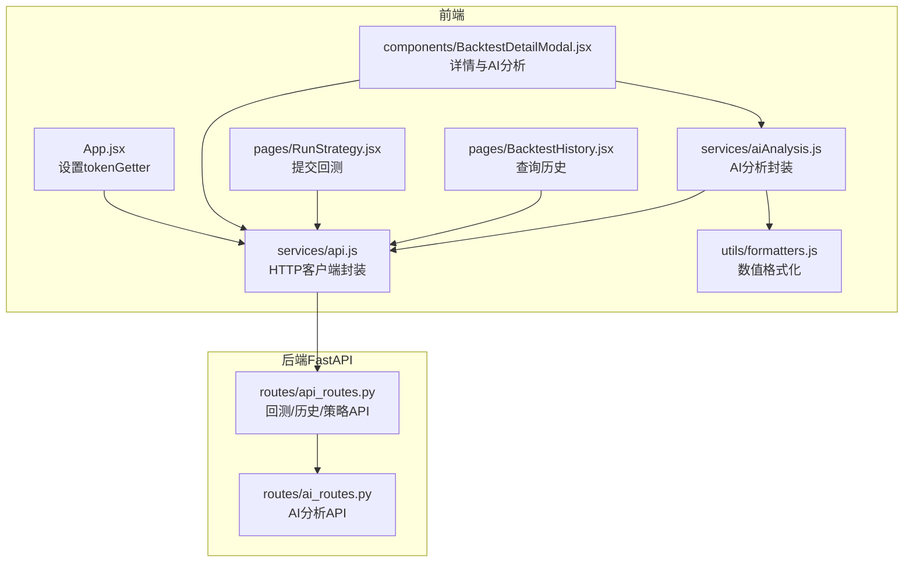
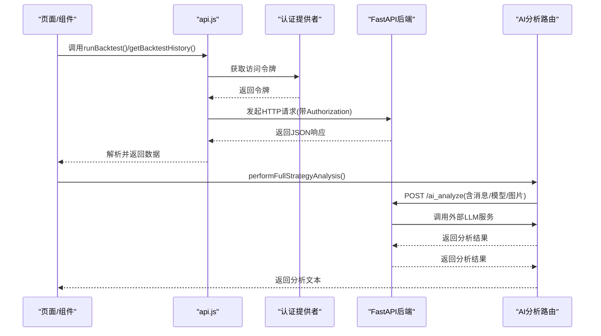
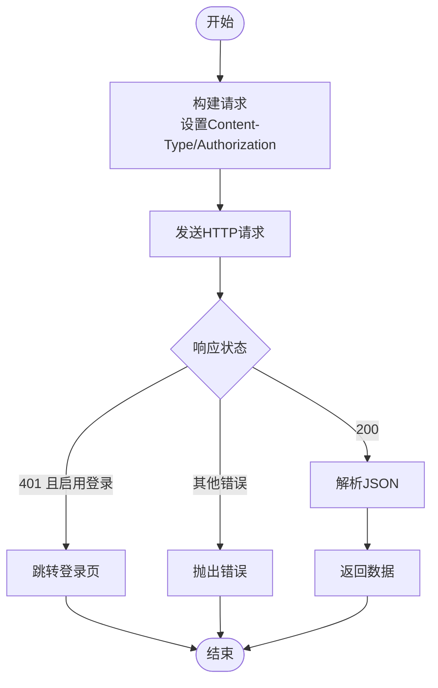
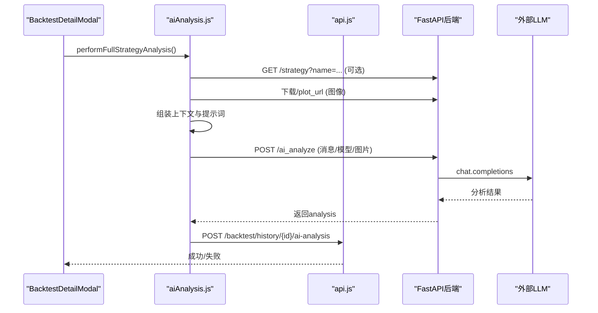
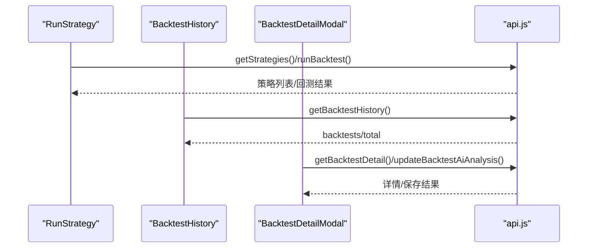
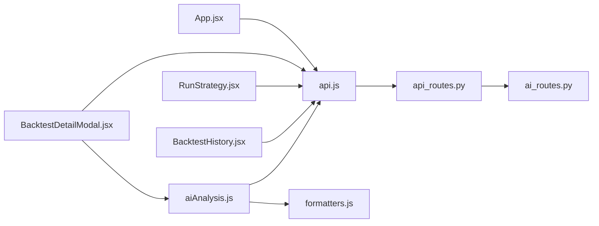

# API集成

<cite>
**本文引用的文件**
- [api.js](file://frontend/src/services/api.js)
- [aiAnalysis.js](file://frontend/src/services/aiAnalysis.js)
- [formatters.js](file://frontend/src/utils/formatters.js)
- [RunStrategy.jsx](file://frontend/src/pages/RunStrategy.jsx)
- [BacktestHistory.jsx](file://frontend/src/pages/BacktestHistory.jsx)
- [BacktestDetailModal.jsx](file://frontend/src/components/BacktestHistory/BacktestDetailModal.jsx)
- [StrategyConfigForm.jsx](file://frontend/src/components/RunStrategy/StrategyConfigForm.jsx)
- [auth.js](file://frontend/src/config/auth.js)
- [App.jsx](file://frontend/src/App.jsx)
- [api_routes.py](file://backend/src/routes/api_routes.py)
- [ai_routes.py](file://backend/src/routes/ai_routes.py)
</cite>

## 目录
1. [简介](#简介)
2. [项目结构](#项目结构)
3. [核心组件](#核心组件)
4. [架构总览](#架构总览)
5. [详细组件分析](#详细组件分析)
6. [依赖关系分析](#依赖关系分析)
7. [性能考量](#性能考量)
8. [故障排查指南](#故障排查指南)
9. [结论](#结论)

## 简介
本文件面向前端工程师，系统性梳理前端与后端FastAPI服务之间的API集成方式，重点覆盖：
- 前端HTTP客户端封装与认证令牌注入
- AI分析API调用流程与数据解析
- 组件内典型API使用模式（提交回测、查询历史）
- 数据预处理与格式化
- 错误处理策略与加载/重试机制建议

## 项目结构
前端采用模块化组织，API相关代码集中在 services 与 utils 目录；页面组件通过服务层发起HTTP请求，并在UI层展示结果或错误信息。

图表来源
- [App.jsx](file://frontend/src/App.jsx#L1-L119)
- [api.js](file://frontend/src/services/api.js#L1-L255)
- [aiAnalysis.js](file://frontend/src/services/aiAnalysis.js#L1-L195)
- [formatters.js](file://frontend/src/utils/formatters.js#L1-L13)
- [RunStrategy.jsx](file://frontend/src/pages/RunStrategy.jsx#L1-L141)
- [BacktestHistory.jsx](file://frontend/src/pages/BacktestHistory.jsx#L1-L334)
- [BacktestDetailModal.jsx](file://frontend/src/components/BacktestHistory/BacktestDetailModal.jsx#L1-L225)
- [api_routes.py](file://backend/src/routes/api_routes.py#L1-L341)
- [ai_routes.py](file://backend/src/routes/ai_routes.py#L1-L81)

章节来源
- [App.jsx](file://frontend/src/App.jsx#L1-L119)
- [api.js](file://frontend/src/services/api.js#L1-L255)
- [aiAnalysis.js](file://frontend/src/services/aiAnalysis.js#L1-L195)
- [formatters.js](file://frontend/src/utils/formatters.js#L1-L13)
- [RunStrategy.jsx](file://frontend/src/pages/RunStrategy.jsx#L1-L141)
- [BacktestHistory.jsx](file://frontend/src/pages/BacktestHistory.jsx#L1-L334)
- [BacktestDetailModal.jsx](file://frontend/src/components/BacktestHistory/BacktestDetailModal.jsx#L1-L225)
- [api_routes.py](file://backend/src/routes/api_routes.py#L1-L341)
- [ai_routes.py](file://backend/src/routes/ai_routes.py#L1-L81)

## 核心组件
- HTTP客户端封装：统一构建请求、注入认证令牌、解析响应与错误处理
- AI分析封装：读取用户设置、准备提示词与图像、调用后端AI分析接口
- 数据格式化：数字、百分比、货币的通用格式化工具
- 页面与组件：回测提交、历史查询、详情弹窗与AI分析触发

章节来源
- [api.js](file://frontend/src/services/api.js#L1-L255)
- [aiAnalysis.js](file://frontend/src/services/aiAnalysis.js#L1-L195)
- [formatters.js](file://frontend/src/utils/formatters.js#L1-L13)
- [RunStrategy.jsx](file://frontend/src/pages/RunStrategy.jsx#L1-L141)
- [BacktestHistory.jsx](file://frontend/src/pages/BacktestHistory.jsx#L1-L334)
- [BacktestDetailModal.jsx](file://frontend/src/components/BacktestHistory/BacktestDetailModal.jsx#L1-L225)

## 架构总览
前端通过服务层api.js发起HTTP请求，自动从认证提供者获取访问令牌并附加到Authorization头；后端FastAPI路由根据路径分发到具体业务逻辑。AI分析流程由aiAnalysis.js组装上下文与图像，调用后端AI分析接口，再将结果写入历史记录。

图表来源
- [api.js](file://frontend/src/services/api.js#L1-L255)
- [aiAnalysis.js](file://frontend/src/services/aiAnalysis.js#L1-L195)
- [api_routes.py](file://backend/src/routes/api_routes.py#L1-L341)
- [ai_routes.py](file://backend/src/routes/ai_routes.py#L1-L81)

## 详细组件分析

### HTTP客户端封装与认证
- 基础URL与令牌注入
  - 使用环境变量作为基础URL，避免硬编码
  - 通过setTokenGetter在应用启动时注入令牌获取函数
  - 请求构建阶段自动设置Content-Type与Authorization头
- 响应解析与错误处理
  - 统一解析JSON并按状态码抛出错误
  - 对401未授权且启用登录时，跳转至登录页
- API方法族
  - 回测与市场数据：/backtest、/data
  - 策略管理：/strategies、/strategy
  - 历史记录：/backtest/history、/backtest/history/{id}、/backtest/history/{id}/ai-analysis
  - 实盘交易：/live/start、/live/stop、/live/status/{id}、/live/sessions、/live/orders/{id}、/live/exchanges、/live/health
  - 步进优化：/walkforward/start、/walkforward/list、/walkforward/{id}、/walkforward/{id}/status

图表来源
- [api.js](file://frontend/src/services/api.js#L1-L255)
- [auth.js](file://frontend/src/config/auth.js#L1-L4)
- [App.jsx](file://frontend/src/App.jsx#L1-L119)

章节来源
- [api.js](file://frontend/src/services/api.js#L1-L255)
- [auth.js](file://frontend/src/config/auth.js#L1-L4)
- [App.jsx](file://frontend/src/App.jsx#L1-L119)

### AI分析调用链
- 用户设置与模型选择
  - 从本地存储读取用户设置，支持默认值与迁移
  - 提供可用模型列表，默认回退到指定模型
- 图像与指标拼装
  - 从回测结果下载图表图像为Blob并转为File
  - 按策略指标与交易日志生成上下文文本
- 调用后端AI分析
  - 通过FormData上传消息、模型与可选图片
  - 后端路由将内容转发给外部LLM服务，返回分析结果
- 结果持久化
  - 将分析结果保存到历史记录中，支持多模型并存

图表来源
- [BacktestDetailModal.jsx](file://frontend/src/components/BacktestHistory/BacktestDetailModal.jsx#L1-L225)
- [aiAnalysis.js](file://frontend/src/services/aiAnalysis.js#L1-L195)
- [api.js](file://frontend/src/services/api.js#L1-L255)
- [api_routes.py](file://backend/src/routes/api_routes.py#L1-L341)
- [ai_routes.py](file://backend/src/routes/ai_routes.py#L1-L81)

章节来源
- [BacktestDetailModal.jsx](file://frontend/src/components/BacktestHistory/BacktestDetailModal.jsx#L1-L225)
- [aiAnalysis.js](file://frontend/src/services/aiAnalysis.js#L1-L195)
- [api.js](file://frontend/src/services/api.js#L1-L255)
- [api_routes.py](file://backend/src/routes/api_routes.py#L1-L341)
- [ai_routes.py](file://backend/src/routes/ai_routes.py#L1-L81)

### 组件中的典型API使用模式
- 提交回测（RunStrategy）
  - 初始化策略列表
  - 收集参数并调用runBacktest，处理成功与失败分支，更新结果与错误状态
- 查询历史（BacktestHistory）
  - 维护过滤条件、排序与分页参数
  - 调用getBacktestHistory获取列表与总数，渲染表格与分页控件
  - 查看详情、删除记录、刷新列表
- 详情与AI分析（BacktestDetailModal）
  - 展示概览、图表、交易明细与AI分析
  - 触发performFullStrategyAnalysis，保存分析结果并更新本地状态

图表来源
- [RunStrategy.jsx](file://frontend/src/pages/RunStrategy.jsx#L1-L141)
- [BacktestHistory.jsx](file://frontend/src/pages/BacktestHistory.jsx#L1-L334)
- [BacktestDetailModal.jsx](file://frontend/src/components/BacktestHistory/BacktestDetailModal.jsx#L1-L225)
- [api.js](file://frontend/src/services/api.js#L1-L255)

章节来源
- [RunStrategy.jsx](file://frontend/src/pages/RunStrategy.jsx#L1-L141)
- [BacktestHistory.jsx](file://frontend/src/pages/BacktestHistory.jsx#L1-L334)
- [BacktestDetailModal.jsx](file://frontend/src/components/BacktestHistory/BacktestDetailModal.jsx#L1-L225)
- [StrategyConfigForm.jsx](file://frontend/src/components/RunStrategy/StrategyConfigForm.jsx#L1-L190)
- [api.js](file://frontend/src/services/api.js#L1-L255)

### 数据预处理与格式化
- 数字、百分比、货币格式化
  - 提供统一的格式化函数，保证UI显示一致性
- 在组件中使用
  - 表格列渲染、指标展示、图表标签等场景复用

章节来源
- [formatters.js](file://frontend/src/utils/formatters.js#L1-L13)
- [BacktestHistory.jsx](file://frontend/src/pages/BacktestHistory.jsx#L1-L334)

## 依赖关系分析
- 前端服务层依赖
  - api.js依赖认证开关与令牌获取函数
  - aiAnalysis.js依赖api.js与formatters.js
  - 页面与组件依赖api.js与aiAnalysis.js
- 后端路由依赖
  - api_routes.py提供回测、历史、策略、实盘、步进优化等端点
  - ai_routes.py提供AI分析端点，内部调用外部LLM服务

图表来源
- [App.jsx](file://frontend/src/App.jsx#L1-L119)
- [api.js](file://frontend/src/services/api.js#L1-L255)
- [aiAnalysis.js](file://frontend/src/services/aiAnalysis.js#L1-L195)
- [formatters.js](file://frontend/src/utils/formatters.js#L1-L13)
- [RunStrategy.jsx](file://frontend/src/pages/RunStrategy.jsx#L1-L141)
- [BacktestHistory.jsx](file://frontend/src/pages/BacktestHistory.jsx#L1-L334)
- [BacktestDetailModal.jsx](file://frontend/src/components/BacktestHistory/BacktestDetailModal.jsx#L1-L225)
- [api_routes.py](file://backend/src/routes/api_routes.py#L1-L341)
- [ai_routes.py](file://backend/src/routes/ai_routes.py#L1-L81)

章节来源
- [App.jsx](file://frontend/src/App.jsx#L1-L119)
- [api.js](file://frontend/src/services/api.js#L1-L255)
- [aiAnalysis.js](file://frontend/src/services/aiAnalysis.js#L1-L195)
- [formatters.js](file://frontend/src/utils/formatters.js#L1-L13)
- [RunStrategy.jsx](file://frontend/src/pages/RunStrategy.jsx#L1-L141)
- [BacktestHistory.jsx](file://frontend/src/pages/BacktestHistory.jsx#L1-L334)
- [BacktestDetailModal.jsx](file://frontend/src/components/BacktestHistory/BacktestDetailModal.jsx#L1-L225)
- [api_routes.py](file://backend/src/routes/api_routes.py#L1-L341)
- [ai_routes.py](file://backend/src/routes/ai_routes.py#L1-L81)

## 性能考量
- 请求合并与去抖
  - 对频繁触发的筛选与分页操作，可在组件层增加防抖以减少请求次数
- 缓存策略
  - 对不常变动的数据（如策略列表）可加入内存缓存，避免重复拉取
- 图像加载
  - 回测图表按需加载，避免一次性并发请求过多图像资源
- 错误与重试
  - 对网络异常与超时场景，建议在服务层引入指数退避重试与最大重试次数限制
- UI反馈
  - 加载状态与骨架屏提升感知性能，避免阻塞交互

## 故障排查指南
- 认证相关
  - 401未授权：确认已启用登录且令牌获取函数已正确注入；检查登录回调与令牌有效期
  - 登录开关：通过环境变量控制是否启用登录，确保路径跳转符合预期
- 网络异常
  - 建议在服务层捕获网络错误并提示用户重试
- 业务错误
  - 后端返回的错误信息包含detail/message字段，前端统一解析并在UI上展示
- AI分析失败
  - 检查OPENAI_API_KEY与OPENAI_BASE_URL配置；确认代理设置；查看后端AI路由异常堆栈

章节来源
- [api.js](file://frontend/src/services/api.js#L1-L255)
- [auth.js](file://frontend/src/config/auth.js#L1-L4)
- [App.jsx](file://frontend/src/App.jsx#L1-L119)
- [ai_routes.py](file://backend/src/routes/ai_routes.py#L1-L81)

## 结论
该前端API集成方案以简洁的服务层封装为核心，实现了认证令牌自动注入、统一响应解析与错误处理，并通过组件化的模式在多个页面中复用。AI分析流程完整覆盖了上下文拼装、图像上传与结果持久化，配合后端FastAPI路由提供了清晰的扩展点。建议后续在服务层补充网络异常与重试机制，进一步提升稳定性与用户体验。