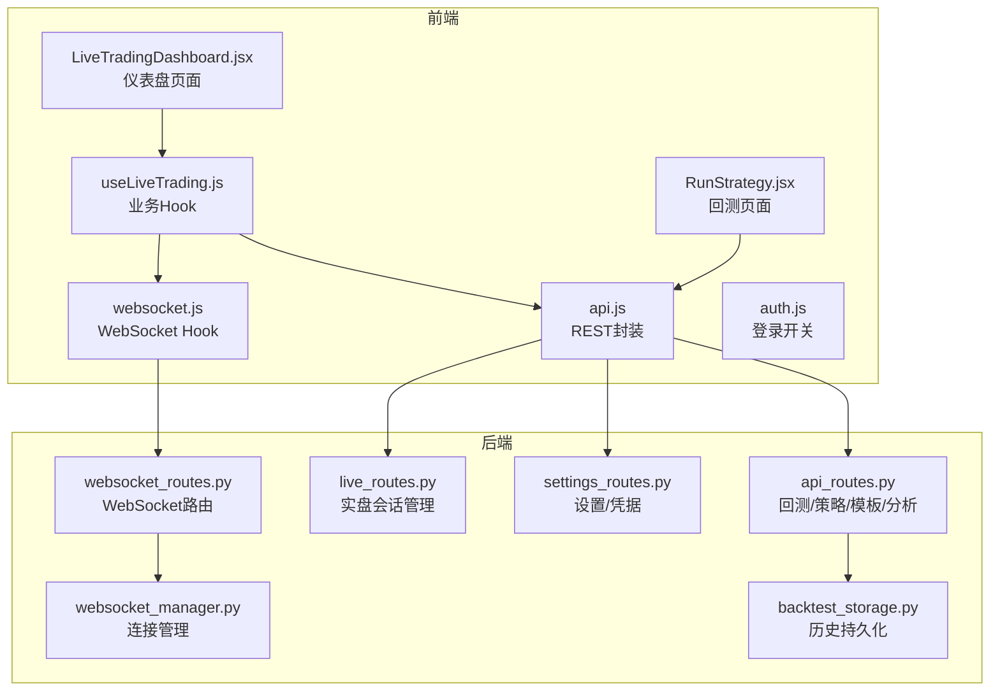
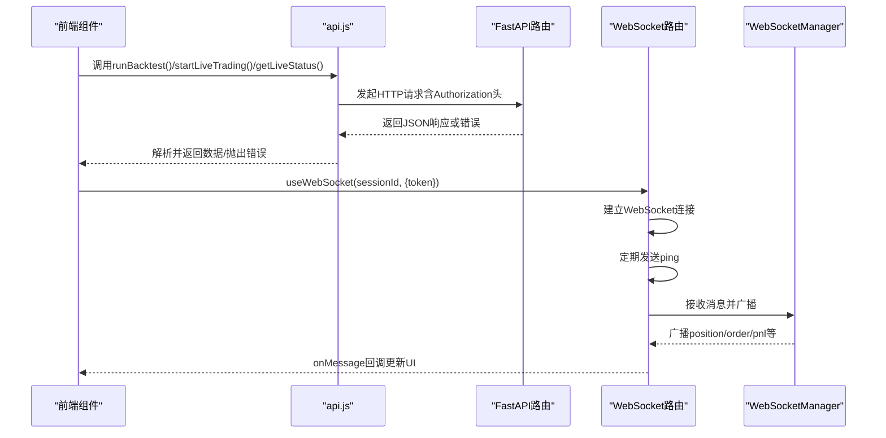
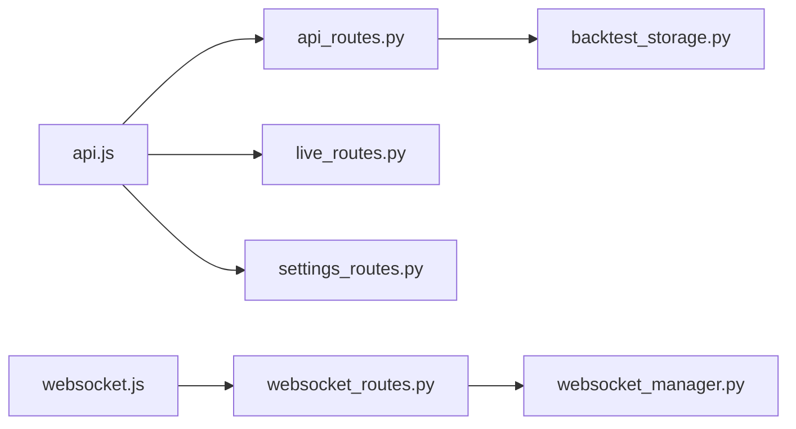

# API集成

<cite>
**本文引用的文件**
- [frontend/src/services/api.js](file://frontend/src/services/api.js)
- [frontend/src/services/websocket.js](file://frontend/src/services/websocket.js)
- [frontend/src/config/auth.js](file://frontend/src/config/auth.js)
- [frontend/src/hooks/useLiveTrading.js](file://frontend/src/hooks/useLiveTrading.js)
- [frontend/src/pages/LiveTradingDashboard.jsx](file://frontend/src/pages/LiveTradingDashboard.jsx)
- [frontend/src/pages/RunStrategy.jsx](file://frontend/src/pages/RunStrategy.jsx)
- [backend/src/routes/api_routes.py](file://backend/src/routes/api_routes.py)
- [backend/src/routes/live_routes.py](file://backend/src/routes/live_routes.py)
- [backend/src/routes/settings_routes.py](file://backend/src/routes/settings_routes.py)
- [backend/src/routes/websocket_routes.py](file://backend/src/routes/websocket_routes.py)
- [backend/src/service/websocket_manager.py](file://backend/src/service/websocket_manager.py)
- [backend/src/db/backtest_storage.py](file://backend/src/db/backtest_storage.py)
</cite>

## 目录
1. [简介](#简介)
2. [项目结构](#项目结构)
3. [核心组件](#核心组件)
4. [架构总览](#架构总览)
5. [详细组件分析](#详细组件分析)
6. [依赖关系分析](#依赖关系分析)
7. [性能考量](#性能考量)
8. [故障排查指南](#故障排查指南)
9. [结论](#结论)
10. [附录](#附录)

## 简介
本文件系统性梳理前端与后端的API集成机制，重点覆盖：
- 前端服务层如何封装对FastAPI后端REST接口的调用（请求构建、认证令牌注入、错误处理、响应解析）
- 核心API端点（/backtest、/live、/settings等）的调用方式与数据格式
- 前端WebSocket客户端如何管理与Daphne/FastAPI WebSocket服务器的连接（连接建立、心跳维持、消息订阅、异常重连）
- 结合后端websocket_routes.py中的路由定义，说明消息类型（如order_update、position_update）的定义与处理流程
- 提供在组件中使用useEffect与useState进行数据获取与状态更新的最佳实践

## 项目结构
前端通过services目录下的api.js与websocket.js分别对接后端REST与WebSocket；后端以FastAPI路由模块组织REST接口，并由websocket_routes.py提供WebSocket端点；业务逻辑由service层与db层支撑。

图表来源
- [frontend/src/services/api.js](file://frontend/src/services/api.js#L1-L403)
- [frontend/src/services/websocket.js](file://frontend/src/services/websocket.js#L1-L287)
- [frontend/src/hooks/useLiveTrading.js](file://frontend/src/hooks/useLiveTrading.js#L1-L277)
- [frontend/src/pages/LiveTradingDashboard.jsx](file://frontend/src/pages/LiveTradingDashboard.jsx#L1-L173)
- [frontend/src/pages/RunStrategy.jsx](file://frontend/src/pages/RunStrategy.jsx#L1-L176)
- [backend/src/routes/api_routes.py](file://backend/src/routes/api_routes.py#L1-L507)
- [backend/src/routes/live_routes.py](file://backend/src/routes/live_routes.py#L1-L430)
- [backend/src/routes/settings_routes.py](file://backend/src/routes/settings_routes.py#L1-L403)
- [backend/src/routes/websocket_routes.py](file://backend/src/routes/websocket_routes.py#L1-L243)
- [backend/src/service/websocket_manager.py](file://backend/src/service/websocket_manager.py#L1-L401)
- [backend/src/db/backtest_storage.py](file://backend/src/db/backtest_storage.py#L1-L446)

章节来源
- [frontend/src/services/api.js](file://frontend/src/services/api.js#L1-L403)
- [frontend/src/services/websocket.js](file://frontend/src/services/websocket.js#L1-L287)
- [backend/src/routes/api_routes.py](file://backend/src/routes/api_routes.py#L1-L507)
- [backend/src/routes/live_routes.py](file://backend/src/routes/live_routes.py#L1-L430)
- [backend/src/routes/settings_routes.py](file://backend/src/routes/settings_routes.py#L1-L403)
- [backend/src/routes/websocket_routes.py](file://backend/src/routes/websocket_routes.py#L1-L243)
- [backend/src/service/websocket_manager.py](file://backend/src/service/websocket_manager.py#L1-L401)
- [backend/src/db/backtest_storage.py](file://backend/src/db/backtest_storage.py#L1-L446)

## 核心组件
- 前端REST封装（api.js）
  - 统一请求构建：自动注入Content-Type与Authorization头（当存在访问令牌时）
  - 统一响应解析：解析JSON并根据HTTP状态码抛出错误；401时在启用登录时跳转到登录页
  - 覆盖主要功能域：策略、模板、回测、市场数据、分析、实盘会话、组合回测、设置与凭据
- 前端WebSocket Hook（websocket.js）
  - 连接管理：支持手动连接、断开、心跳（ping/pong）、可配置重连次数与间隔
  - 消息处理：解析消息类型，暴露lastMessage、readyState、connect/disconnect等
  - 常量定义：WS_MESSAGE_TYPES涵盖connected、position、order、pnl、trade、log、error、status、pong
- 后端REST路由（FastAPI）
  - 回测与策略：/backtest、/strategy、/strategies、/templates、/analyze、/strategy/{name}/params
  - 实盘：/live/start、/live/stop、/live/status/{session_id}、/live/sessions、/live/orders/{session_id}、/live/exchanges、/live/health
  - 设置与凭据：/settings、/settings/reset、/settings/credentials、/settings/credentials/ccxt、/settings/credentials/{key}、/settings/credentials/test
  - 组合回测：/portfolio/backtest、/portfolio/history、/{portfolio_id}、删除/{portfolio_id}
- 后端WebSocket路由与管理
  - /ws/live/{session_id}：基于查询参数token进行ws_token鉴权，支持ping/pong保活
  - WebSocketManager广播：position、order、pnl、trade、log、error、status等消息类型

章节来源
- [frontend/src/services/api.js](file://frontend/src/services/api.js#L1-L403)
- [frontend/src/services/websocket.js](file://frontend/src/services/websocket.js#L1-L287)
- [backend/src/routes/api_routes.py](file://backend/src/routes/api_routes.py#L1-L507)
- [backend/src/routes/live_routes.py](file://backend/src/routes/live_routes.py#L1-L430)
- [backend/src/routes/settings_routes.py](file://backend/src/routes/settings_routes.py#L1-L403)
- [backend/src/routes/websocket_routes.py](file://backend/src/routes/websocket_routes.py#L1-L243)
- [backend/src/service/websocket_manager.py](file://backend/src/service/websocket_manager.py#L1-L401)

## 架构总览
从前端到后端的数据流与交互如下：

图表来源
- [frontend/src/services/api.js](file://frontend/src/services/api.js#L1-L403)
- [frontend/src/services/websocket.js](file://frontend/src/services/websocket.js#L1-L287)
- [backend/src/routes/websocket_routes.py](file://backend/src/routes/websocket_routes.py#L1-L243)
- [backend/src/service/websocket_manager.py](file://backend/src/service/websocket_manager.py#L1-L401)

## 详细组件分析

### 前端REST封装（api.js）
- 认证与请求头
  - 若存在令牌获取器，则在每次请求前尝试获取访问令牌并注入Authorization头
  - 自动设置Content-Type为application/json（当body存在时）
- 响应解析与错误处理
  - 统一解析JSON；非200状态码抛出错误，包含后端message或detail
  - 当LOGIN_ENABLED为真且401时，跳转至登录页
- 关键API域
  - 回测：runBacktest(params)、getBacktestHistory(query)、getBacktestDetail(id)、deleteBacktest(id)、updateBacktestAiAnalysis(id, model, analysis)
  - 实盘：startLiveTrading(config)、stopLiveTrading(sessionId)、getLiveStatus(sessionId)、listLiveSessions(params)、getSessionOrders(sessionId)、getExchanges()、getLiveHealth()
  - 设置与凭据：getSettings()、updateSettings(settings)、resetSettings()、getCredentials()、updateCredentials(credentials)、updateCCXTCredentials(exchange, mode, credentials)、resetCredential(key)、testCredential(type, params)
  - 策略与模板：getStrategies()、getStrategy(name)、saveStrategy(name, code)、getTemplates()、getTemplateDetail(id)、importTemplate(id, name)、getStrategyParams(name)
  - 组合回测：runPortfolioBacktest(params)、getPortfolioHistory(params)、getPortfolioDetail(id)、deletePortfolio(id)
  - 数据与分析：getTickerInfo(ticker)、getTickerPrices(ticker, start, end)、fetchMarketData({ticker,start,end})、analyzeResults({metrics})

章节来源
- [frontend/src/services/api.js](file://frontend/src/services/api.js#L1-L403)
- [frontend/src/config/auth.js](file://frontend/src/config/auth.js#L1-L4)

### 前端WebSocket Hook（websocket.js）
- 连接与URL
  - 支持开发环境与生产环境协议选择（ws/wss），自动拼接/ws/live/{sessionId}?token=...
  - 支持外部传入ws_token，避免硬编码
- 心跳与保活
  - 定时发送ping，收到pong确认
- 重连机制
  - 可配置最大重连次数与间隔；关闭时清理定时器与标志位
- 消息类型
  - WS_MESSAGE_TYPES定义了connected、position、order、pnl、trade、log、error、status、pong等类型
  - parseWebSocketMessage标准化消息结构（type、data、timestamp）

章节来源
- [frontend/src/services/websocket.js](file://frontend/src/services/websocket.js#L1-L287)

### 后端WebSocket路由与管理（websocket_routes.py / websocket_manager.py）
- 路由鉴权
  - /ws/live/{session_id}?token=...：校验session是否存在以及ws_token是否匹配
- 消息类型
  - 服务端接收ping并返回pong；广播connected、position、order、pnl、trade、log、error、status等
- 连接管理
  - WebSocketManager维护每个session_id的连接集合，支持并发广播、清理死连接、统计活跃连接数

章节来源
- [backend/src/routes/websocket_routes.py](file://backend/src/routes/websocket_routes.py#L1-L243)
- [backend/src/service/websocket_manager.py](file://backend/src/service/websocket_manager.py#L1-L401)

### 实盘会话生命周期（REST）
- 开始会话：/live/start（校验模式、交易所、符号、时间框架，创建会话并返回ws_token）
- 停止会话：/live/stop（校验会话存在与状态，保存最终状态）
- 查询状态：/live/status/{session_id}（返回会话配置、P&L、交易、持仓等）
- 列表与健康：/live/sessions、/live/health

章节来源
- [backend/src/routes/live_routes.py](file://backend/src/routes/live_routes.py#L1-L430)

### 回测历史持久化（数据库）
- BacktestStorage负责保存/查询/删除回测记录，自动清理旧记录并删除关联图片文件
- 支持分页、排序、过滤（ticker、strategy_name、日期范围、用户ID）

章节来源
- [backend/src/db/backtest_storage.py](file://backend/src/db/backtest_storage.py#L1-L446)

### 前端实盘Hook与页面（useLiveTrading.js / LiveTradingDashboard.jsx）
- useLiveTrading
  - 管理会话状态、订单、持仓、P&L历史与统计
  - 处理WebSocket消息：position、order、pnl、trade、log、error、status
  - 手动控制WebSocket连接（禁用自动重连，避免会话未就绪时的重复连接）
- LiveTradingDashboard
  - 展示会话控制、统计卡片、P&L图表、持仓与订单日志

章节来源
- [frontend/src/hooks/useLiveTrading.js](file://frontend/src/hooks/useLiveTrading.js#L1-L277)
- [frontend/src/pages/LiveTradingDashboard.jsx](file://frontend/src/pages/LiveTradingDashboard.jsx#L1-L173)

### 回测运行流程（RunStrategy.jsx）
- 页面收集参数（策略、时间窗、初始资金、手续费、stake、策略参数覆盖）
- 调用api.runBacktest(params)，渲染性能概览、交易日志与策略图

章节来源
- [frontend/src/pages/RunStrategy.jsx](file://frontend/src/pages/RunStrategy.jsx#L1-L176)

## 依赖关系分析

图表来源
- [frontend/src/services/api.js](file://frontend/src/services/api.js#L1-L403)
- [frontend/src/services/websocket.js](file://frontend/src/services/websocket.js#L1-L287)
- [backend/src/routes/api_routes.py](file://backend/src/routes/api_routes.py#L1-L507)
- [backend/src/routes/live_routes.py](file://backend/src/routes/live_routes.py#L1-L430)
- [backend/src/routes/settings_routes.py](file://backend/src/routes/settings_routes.py#L1-L403)
- [backend/src/routes/websocket_routes.py](file://backend/src/routes/websocket_routes.py#L1-L243)
- [backend/src/service/websocket_manager.py](file://backend/src/service/websocket_manager.py#L1-L401)
- [backend/src/db/backtest_storage.py](file://backend/src/db/backtest_storage.py#L1-L446)

## 性能考量
- 前端
  - 使用Promise.all并行获取多个数据源（如行情与信息），减少等待时间
  - WebSocket心跳周期与重连间隔需平衡网络波动与资源消耗
- 后端
  - WebSocketManager广播采用连接快照与锁，避免迭代期间连接被修改
  - 回测历史自动清理，限制最大记录数，降低数据库膨胀
- 共同建议
  - 对高频API增加缓存策略（如策略参数提取结果）
  - 对大列表分页与排序优化索引（后端已具备分页与排序能力）

[本节为通用指导，无需列出具体文件来源]

## 故障排查指南
- 401未授权
  - 现象：前端parseResponse检测到401并跳转登录
  - 排查：确认登录开关LOGIN_ENABLED；检查令牌获取器是否可用；核对后端鉴权中间件
- WebSocket无法连接
  - 现象：readyState为ERROR或反复重连
  - 排查：确认ws_token正确；检查后端路由鉴权逻辑；查看浏览器开发者工具Network面板
- 消息类型未处理
  - 现象：未知消息类型被忽略
  - 排查：确认前端WS_MESSAGE_TYPES与后端广播类型一致；检查消息结构
- 实盘会话状态异常
  - 现象：/live/status返回非期望状态
  - 排查：确认会话ID有效；检查后端会话管理器状态转换逻辑

章节来源
- [frontend/src/services/api.js](file://frontend/src/services/api.js#L1-L403)
- [frontend/src/services/websocket.js](file://frontend/src/services/websocket.js#L1-L287)
- [backend/src/routes/websocket_routes.py](file://backend/src/routes/websocket_routes.py#L1-L243)
- [backend/src/routes/live_routes.py](file://backend/src/routes/live_routes.py#L1-L430)

## 结论
该系统通过统一的前端REST封装与WebSocket Hook，实现了与FastAPI后端的稳定集成。前端在请求拦截、认证注入、错误处理方面具备一致性；后端在WebSocket连接管理与消息广播方面提供了清晰的扩展点。结合useEffect与useState的使用模式，可在组件中可靠地完成数据获取与状态更新，确保前后端通信的稳定性与高效性。

[本节为总结性内容，无需列出具体文件来源]

## 附录

### API调用与状态更新示例（路径指引）
- 在组件中使用useEffect与useState获取回测结果
  - 示例路径：[RunStrategy.jsx](file://frontend/src/pages/RunStrategy.jsx#L1-L176)
- 实盘会话启动后手动建立WebSocket连接
  - 示例路径：[useLiveTrading.js](file://frontend/src/hooks/useLiveTrading.js#L1-L277)
- 实盘仪表盘页面展示实时数据
  - 示例路径：[LiveTradingDashboard.jsx](file://frontend/src/pages/LiveTradingDashboard.jsx#L1-L173)

### WebSocket消息类型与处理流程（后端定义）
- 消息类型定义与广播
  - 类型：connected、position、order、pnl、trade、log、error、status、pong
  - 路由与消息样例：[websocket_routes.py](file://backend/src/routes/websocket_routes.py#L1-L243)
- 连接管理与广播实现
  - 连接池、锁、广播、清理死连接：[websocket_manager.py](file://backend/src/service/websocket_manager.py#L1-L401)

### 关键端点与数据格式摘要
- 回测
  - POST /backtest：请求体包含ticker、start_date、end_date、initial_cash、commission、stake、strategy_name、params；返回backtest_id、metrics、plot_url
  - POST /backtest/history：分页查询回测历史
  - GET /backtest/history/{id}：获取详情
  - DELETE /backtest/history/{id}：删除记录
  - POST /backtest/history/{id}/ai-analysis：更新AI分析
  - 参考：[api_routes.py](file://backend/src/routes/api_routes.py#L1-L507)
- 实盘
  - POST /live/start：请求体包含strategy_name、symbol、exchange、mode、timeframe、initial_cash、commission；返回session_id、ws_token等
  - POST /live/stop：停止会话
  - GET /live/status/{session_id}：返回会话状态与指标
  - GET /live/sessions：会话列表（支持过滤与分页）
  - GET /live/orders/{session_id}：订单列表
  - GET /live/exchanges：可用交易所列表
  - GET /live/health：健康检查
  - 参考：[live_routes.py](file://backend/src/routes/live_routes.py#L1-L430)
- 设置与凭据
  - GET /settings、PUT /settings、POST /settings/reset
  - GET /settings/credentials、PUT /settings/credentials、PUT /settings/credentials/ccxt、DELETE /settings/credentials/{key}、POST /settings/credentials/test
  - 参考：[settings_routes.py](file://backend/src/routes/settings_routes.py#L1-L403)
- WebSocket
  - GET /ws/live/{session_id}?token=...：鉴权后建立连接，支持ping/pong保活
  - GET /ws/info：返回连接信息与消息类型
  - 参考：[websocket_routes.py](file://backend/src/routes/websocket_routes.py#L1-L243)