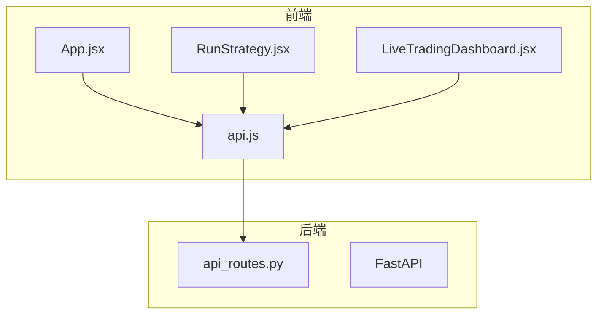
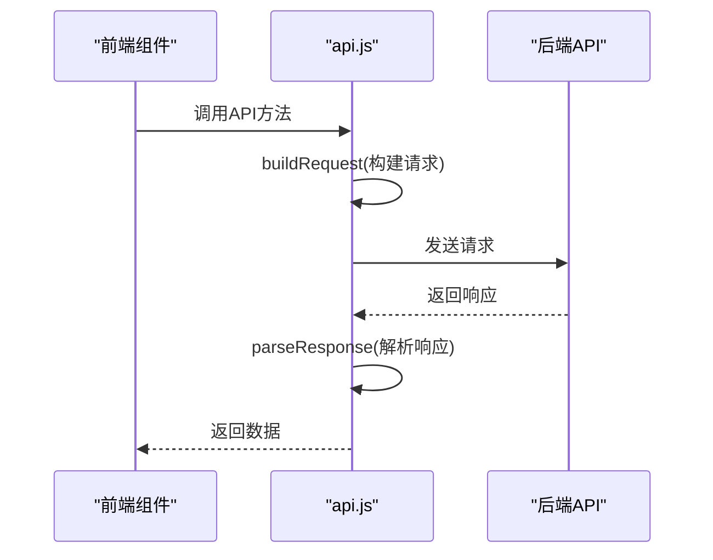
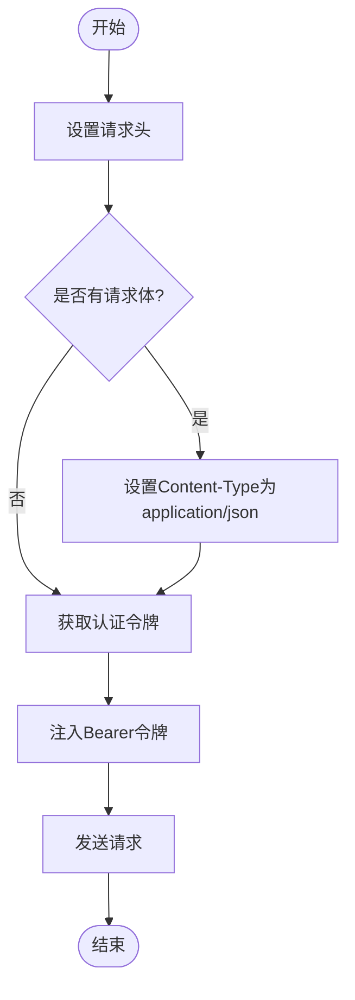
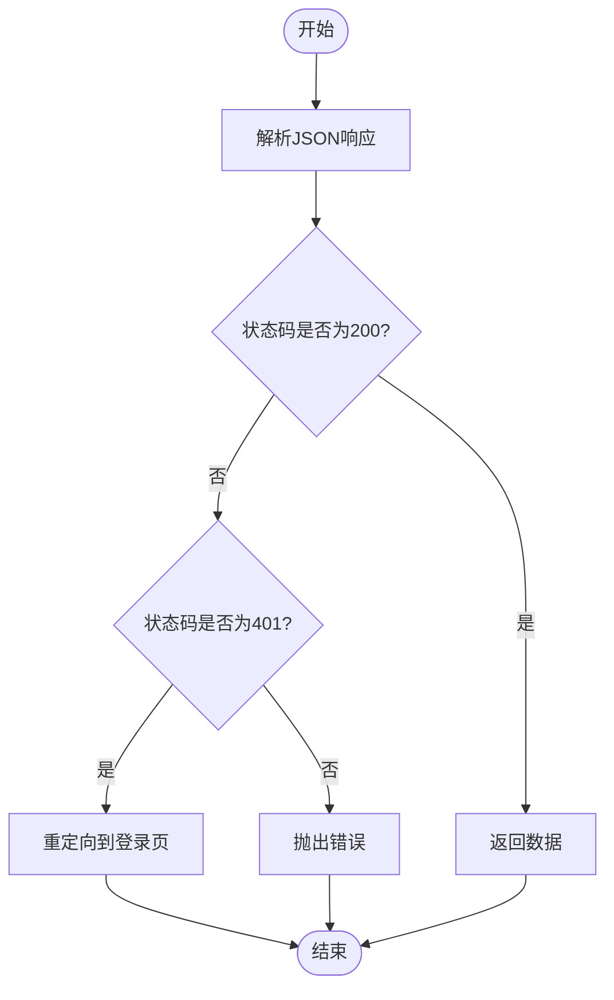
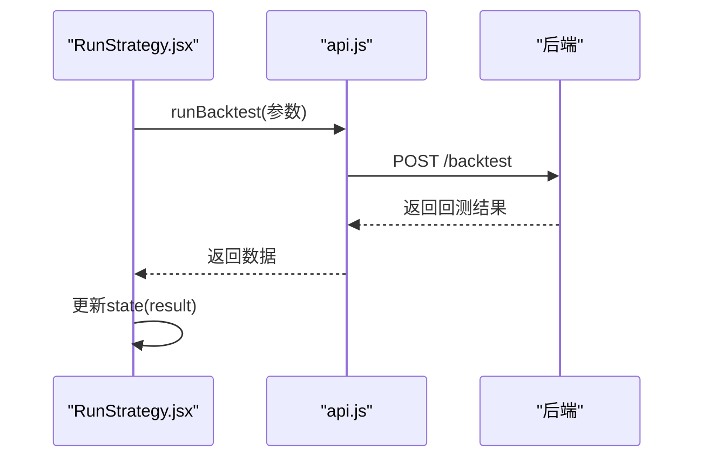
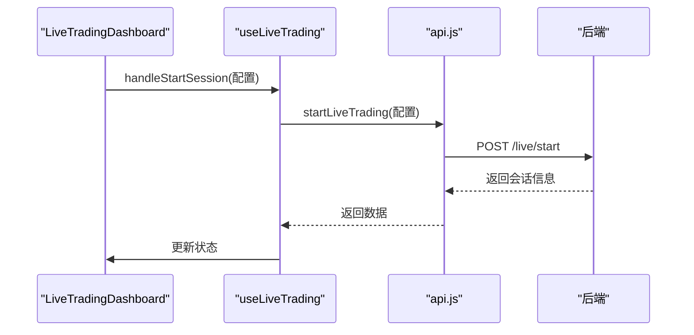
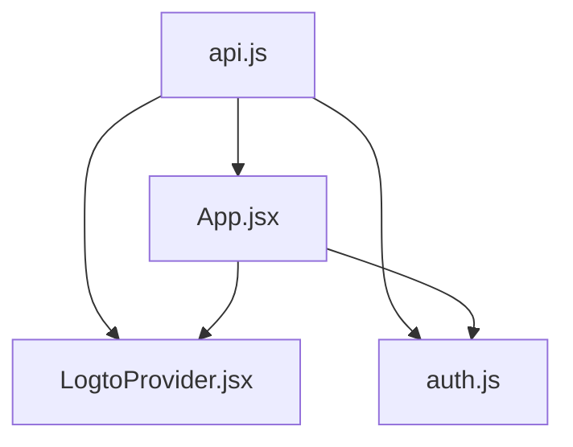
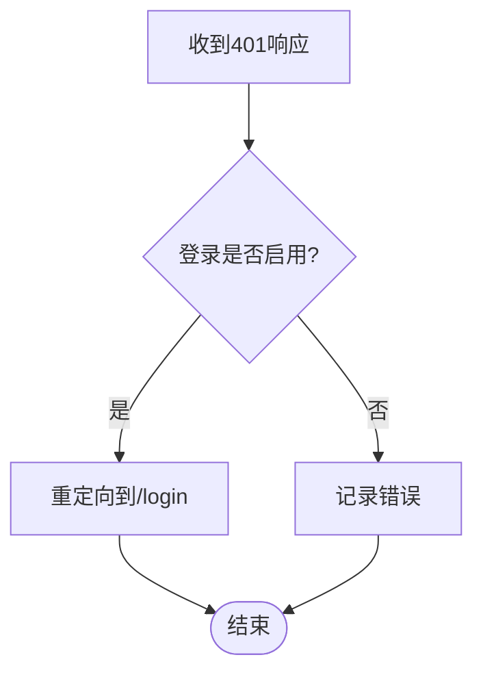
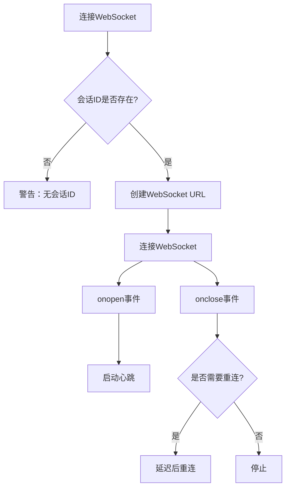

# REST API客户端

<cite>
**本文档引用的文件**  
- [api.js](file://frontend/src/services/api.js#L1-L403)
- [api_routes.py](file://backend/src/routes/api_routes.py#L1-L507)
- [RunStrategy.jsx](file://frontend/src/pages/RunStrategy.jsx#L1-L176)
- [LiveTradingDashboard.jsx](file://frontend/src/pages/LiveTradingDashboard.jsx#L1-L173)
- [useLiveTrading.js](file://frontend/src/hooks/useLiveTrading.js#L1-L277)
- [App.jsx](file://frontend/src/App.jsx#L1-L121)
- [LogtoProvider.jsx](file://frontend/src/providers/LogtoProvider.jsx#L1-L34)
- [websocket.js](file://frontend/src/services/websocket.js#L1-L287)
- [auth.js](file://frontend/src/config/auth.js#L1-L4)
</cite>

## 目录
1. [简介](#简介)
2. [项目结构](#项目结构)
3. [核心组件](#核心组件)
4. [架构概述](#架构概述)
5. [详细组件分析](#详细组件分析)
6. [依赖分析](#依赖分析)
7. [性能考虑](#性能考虑)
8. [故障排除指南](#故障排除指南)
9. [结论](#结论)

## 简介
本文档详细说明了前端REST API客户端的实现机制，重点解析`services/api.js`中如何封装对FastAPI后端RESTful接口的调用。文档涵盖了请求构建、认证令牌注入、错误处理和响应解析等核心逻辑，并描述了`api`对象中各个方法（如`runBacktest`、`startLiveTrading`、`getBacktestHistory`）如何对应后端`api_routes.py`中的路由端点，以及请求/响应的数据结构定义。通过分析`buildRequest`和`parseResponse`函数，说明了请求拦截、401自动重定向登录、JSON解析等通用处理流程。同时提供了在`RunStrategy`或`LiveTrading`组件中如何调用这些API方法获取数据并更新React状态的具体示例，确保前后端通信的健壮性和可维护性。

## 项目结构
该项目采用前后端分离的架构，前端使用React/Vite构建，后端使用FastAPI框架。前端通过`services/api.js`提供统一的API调用接口，与后端`api_routes.py`定义的RESTful端点进行通信。前端组件通过调用API方法获取数据并更新React状态，实现动态交互。

**图示来源**
- [App.jsx](file://frontend/src/App.jsx#L1-L121)
- [api.js](file://frontend/src/services/api.js#L1-L403)
- [RunStrategy.jsx](file://frontend/src/pages/RunStrategy.jsx#L1-L176)
- [LiveTradingDashboard.jsx](file://frontend/src/pages/LiveTradingDashboard.jsx#L1-L173)
- [api_routes.py](file://backend/src/routes/api_routes.py#L1-L507)

**本节来源**
- [App.jsx](file://frontend/src/App.jsx#L1-L121)
- [api.js](file://frontend/src/services/api.js#L1-L403)

## 核心组件
前端REST API客户端的核心是`services/api.js`文件，它封装了所有对后端API的调用。该文件通过`buildRequest`函数构建带有认证令牌的请求，通过`parseResponse`函数解析响应并处理错误。`api`对象提供了多个方法，如`runBacktest`、`startLiveTrading`、`getBacktestHistory`等，这些方法对应后端`api_routes.py`中的路由端点。

**本节来源**
- [api.js](file://frontend/src/services/api.js#L1-L403)
- [api_routes.py](file://backend/src/routes/api_routes.py#L1-L507)

## 架构概述
前端API客户端采用模块化设计，通过`api.js`文件提供统一的API调用接口。该接口封装了请求构建、认证令牌注入、错误处理和响应解析等通用逻辑，使得前端组件可以方便地调用后端API，而无需关心底层实现细节。

**图示来源**
- [api.js](file://frontend/src/services/api.js#L1-L403)
- [api_routes.py](file://backend/src/routes/api_routes.py#L1-L507)

## 详细组件分析
### API客户端分析
`services/api.js`文件是前端与后端通信的核心，它通过`buildRequest`和`parseResponse`函数实现了请求和响应的通用处理逻辑。

#### 请求构建与认证

**图示来源**
- [api.js](file://frontend/src/services/api.js#L19-L41)

#### 响应解析与错误处理

**图示来源**
- [api.js](file://frontend/src/services/api.js#L55-L74)

#### API方法与后端端点对应关系
| 前端方法 | 后端端点 | HTTP方法 | 请求/响应数据结构 |
| --- | --- | --- | --- |
| runBacktest | /backtest | POST | {ticker, start_date, end_date, initial_cash, commission, stake, strategy_name, params} |
| startLiveTrading | /live/start | POST | {ticker, strategy_name, initial_cash, exchange, mode, params} |
| getBacktestHistory | /backtest/history | POST | {ticker, strategy_name, start_date, end_date, sort_by, sort_order, limit, offset} |

**本节来源**
- [api.js](file://frontend/src/services/api.js#L76-L402)
- [api_routes.py](file://backend/src/routes/api_routes.py#L215-L474)

### 组件调用示例
#### RunStrategy组件调用
`RunStrategy.jsx`组件通过调用`api.runBacktest`方法执行回测，并将结果更新到React状态。

**图示来源**
- [RunStrategy.jsx](file://frontend/src/pages/RunStrategy.jsx#L97-L107)
- [api.js](file://frontend/src/services/api.js#L97-L103)

#### LiveTrading组件调用
`LiveTradingDashboard.jsx`组件通过`useLiveTrading` hook调用`api.startLiveTrading`方法启动实盘交易。

**图示来源**
- [LiveTradingDashboard.jsx](file://frontend/src/pages/LiveTradingDashboard.jsx#L128-L131)
- [useLiveTrading.js](file://frontend/src/hooks/useLiveTrading.js#L128-L131)
- [api.js](file://frontend/src/services/api.js#L201-L207)

**本节来源**
- [RunStrategy.jsx](file://frontend/src/pages/RunStrategy.jsx#L82-L114)
- [LiveTradingDashboard.jsx](file://frontend/src/pages/LiveTradingDashboard.jsx#L128-L131)
- [useLiveTrading.js](file://frontend/src/hooks/useLiveTrading.js#L128-L131)

## 依赖分析
前端API客户端依赖于多个组件和配置文件，包括`App.jsx`中的认证设置、`LogtoProvider.jsx`中的认证配置、`auth.js`中的登录启用标志等。

**图示来源**
- [api.js](file://frontend/src/services/api.js#L6-L14)
- [App.jsx](file://frontend/src/App.jsx#L18-L39)
- [LogtoProvider.jsx](file://frontend/src/providers/LogtoProvider.jsx#L11-L15)
- [auth.js](file://frontend/src/config/auth.js#L1-L4)

**本节来源**
- [api.js](file://frontend/src/services/api.js#L6-L14)
- [App.jsx](file://frontend/src/App.jsx#L18-L39)
- [LogtoProvider.jsx](file://frontend/src/providers/LogtoProvider.jsx#L11-L15)
- [auth.js](file://frontend/src/config/auth.js#L1-L4)

## 性能考虑
前端API客户端在性能方面有以下考虑：
- 使用`buildRequest`和`parseResponse`函数封装通用逻辑，减少重复代码。
- 在`RunStrategy`组件中，使用`useEffect`钩子在组件挂载时获取策略列表，避免不必要的重复请求。
- 在`LiveTrading`组件中，使用WebSocket实现实时数据更新，减少HTTP轮询的开销。

## 故障排除指南
### 401未授权错误
当API返回401状态码时，`parseResponse`函数会自动重定向到登录页。

**图示来源**
- [api.js](file://frontend/src/services/api.js#L60-L67)

### WebSocket连接问题
WebSocket连接通过`useWebSocket` hook管理，支持自动重连和心跳检测。

**图示来源**
- [websocket.js](file://frontend/src/services/websocket.js#L99-L238)

**本节来源**
- [api.js](file://frontend/src/services/api.js#L60-L67)
- [websocket.js](file://frontend/src/services/websocket.js#L99-L238)

## 结论
前端REST API客户端通过`services/api.js`文件提供了统一的API调用接口，封装了请求构建、认证令牌注入、错误处理和响应解析等通用逻辑。该设计使得前端组件可以方便地调用后端API，而无需关心底层实现细节，提高了代码的可维护性和健壮性。通过分析`buildRequest`和`parseResponse`函数，我们可以看到请求拦截、401自动重定向登录、JSON解析等通用处理流程。在`RunStrategy`和`LiveTrading`组件中，通过调用API方法获取数据并更新React状态，实现了前后端的高效通信。