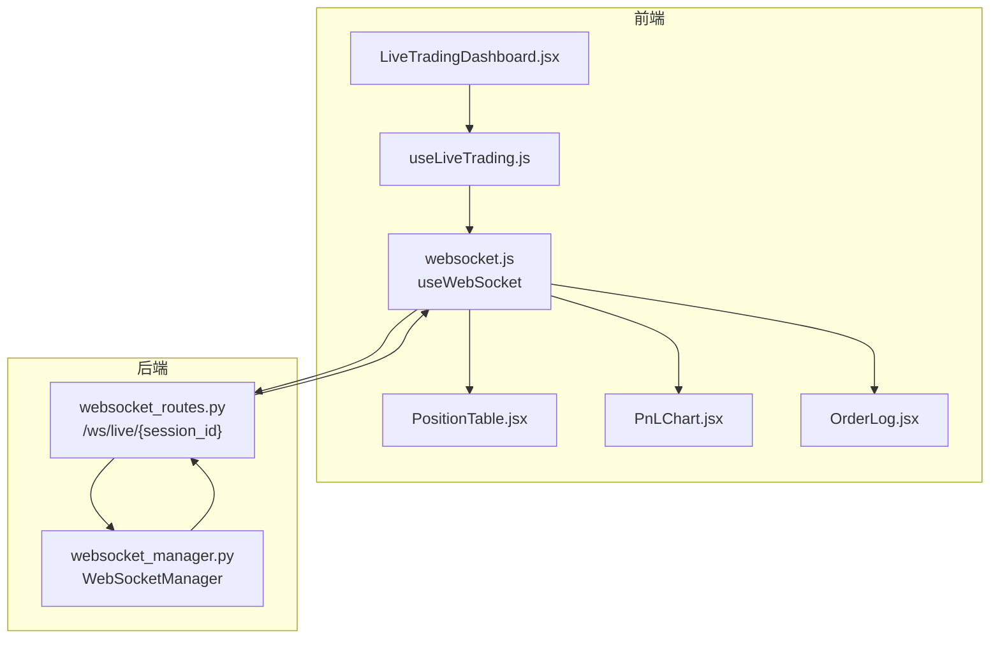
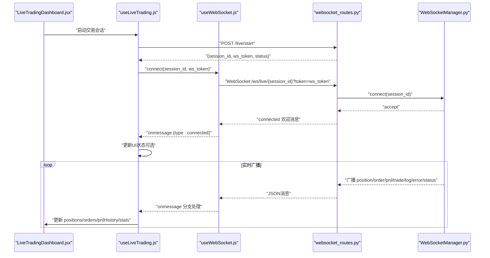
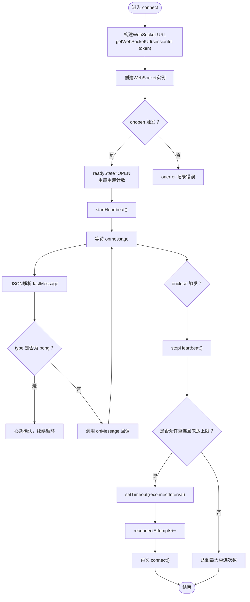
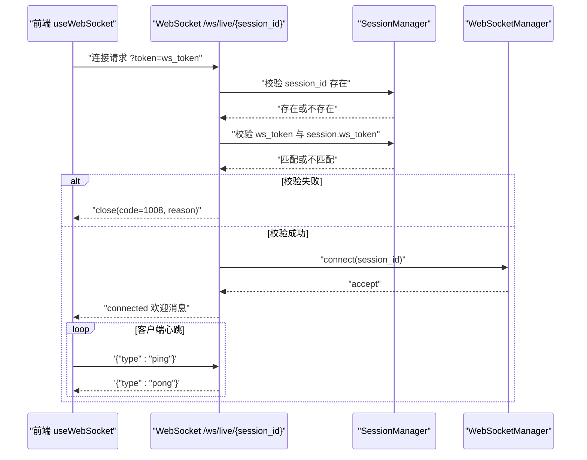
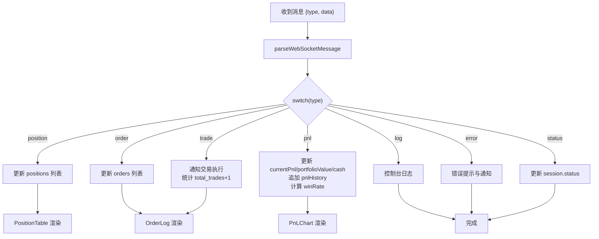
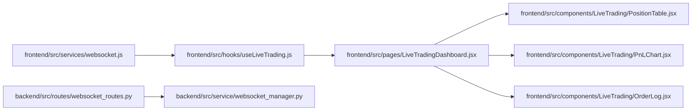

# WebSocket实时通信

<cite>
**本文引用的文件**
- [websocket.js](file://frontend/src/services/websocket.js)
- [useLiveTrading.js](file://frontend/src/hooks/useLiveTrading.js)
- [websocket_routes.py](file://backend/src/routes/websocket_routes.py)
- [websocket_manager.py](file://backend/src/service/websocket_manager.py)
- [LiveTradingDashboard.jsx](file://frontend/src/pages/LiveTradingDashboard.jsx)
- [PositionTable.jsx](file://frontend/src/components/LiveTrading/PositionTable.jsx)
- [PnLChart.jsx](file://frontend/src/components/LiveTrading/PnLChart.jsx)
- [OrderLog.jsx](file://frontend/src/components/LiveTrading/OrderLog.jsx)
- [api.js](file://frontend/src/services/api.js)
</cite>

## 目录
1. [简介](#简介)
2. [项目结构](#项目结构)
3. [核心组件](#核心组件)
4. [架构总览](#架构总览)
5. [详细组件分析](#详细组件分析)
6. [依赖关系分析](#依赖关系分析)
7. [性能考量](#性能考量)
8. [故障排查指南](#故障排查指南)
9. [结论](#结论)
10. [附录：使用示例](#附录使用示例)

## 简介
本文件深入解析前端WebSocket实时通信的实现，围绕useWebSocket自定义Hook如何管理与后端Daphne/FastAPI WebSocket服务器的连接，涵盖连接建立（getWebSocketUrl）、心跳维持（sendPing、startHeartbeat）、消息处理（onmessage）、异常重连（reconnectTimeoutRef）等关键机制。结合后端websocket_routes.py中的/ws/live/{session_id}端点，说明基于ws_token的认证流程与消息收发协议。重点阐述WS_MESSAGE_TYPES中定义的position_update、order_update、pnl_update等消息类型在前端被parseWebSocketMessage解析后，如何驱动UI组件（PositionTable、PnLChart、OrderLog）进行实时更新。最后提供在LiveTradingDashboard中使用useWebSocket的代码示例，展示如何在启动会话后订阅实时数据流。

## 项目结构
前端与后端通过WebSocket实现实时通信：
- 前端：useWebSocket Hook负责WebSocket生命周期与心跳；useLiveTrading Hook负责业务状态与消息分发；UI组件根据状态渲染。
- 后端：FastAPI路由/ws/live/{session_id}提供认证与消息协议；WebSocketManager集中管理连接池与广播。

图表来源
- [LiveTradingDashboard.jsx](file://frontend/src/pages/LiveTradingDashboard.jsx#L1-L173)
- [useLiveTrading.js](file://frontend/src/hooks/useLiveTrading.js#L1-L276)
- [websocket.js](file://frontend/src/services/websocket.js#L1-L287)
- [PositionTable.jsx](file://frontend/src/components/LiveTrading/PositionTable.jsx#L1-L99)
- [PnLChart.jsx](file://frontend/src/components/LiveTrading/PnLChart.jsx#L1-L113)
- [OrderLog.jsx](file://frontend/src/components/LiveTrading/OrderLog.jsx#L1-L139)
- [websocket_routes.py](file://backend/src/routes/websocket_routes.py#L1-L243)
- [websocket_manager.py](file://backend/src/service/websocket_manager.py#L1-L401)

章节来源
- [websocket.js](file://frontend/src/services/websocket.js#L1-L287)
- [useLiveTrading.js](file://frontend/src/hooks/useLiveTrading.js#L1-L276)
- [websocket_routes.py](file://backend/src/routes/websocket_routes.py#L1-L243)
- [websocket_manager.py](file://backend/src/service/websocket_manager.py#L1-L401)
- [LiveTradingDashboard.jsx](file://frontend/src/pages/LiveTradingDashboard.jsx#L1-L173)
- [PositionTable.jsx](file://frontend/src/components/LiveTrading/PositionTable.jsx#L1-L99)
- [PnLChart.jsx](file://frontend/src/components/LiveTrading/PnLChart.jsx#L1-L113)
- [OrderLog.jsx](file://frontend/src/components/LiveTrading/OrderLog.jsx#L1-L139)

## 核心组件
- useWebSocket：封装WebSocket连接、心跳、消息解析与重连逻辑，暴露lastMessage、readyState、connect、disconnect等接口。
- WS_MESSAGE_TYPES：定义消息类型常量，用于前端分支处理position/order/pnl/trade/log/error/status等。
- parseWebSocketMessage：统一解析消息格式，附加时间戳。
- useLiveTrading：在启动会话后手动连接WebSocket，接收消息并更新UI状态。
- WebSocketManager：后端连接池与广播器，按session_id向所有客户端推送position/order/pnl/trade/log/error/status等消息。
- websocket_routes.py：FastAPI WebSocket端点，校验session与ws_token，处理ping/pong保活。

章节来源
- [websocket.js](file://frontend/src/services/websocket.js#L1-L287)
- [useLiveTrading.js](file://frontend/src/hooks/useLiveTrading.js#L1-L276)
- [websocket_manager.py](file://backend/src/service/websocket_manager.py#L1-L401)
- [websocket_routes.py](file://backend/src/routes/websocket_routes.py#L1-L243)

## 架构总览
前端通过useWebSocket建立到后端/ws/live/{session_id}的WebSocket连接，携带ws_token作为认证参数。后端验证ws_token与session存在性，接受连接并向客户端发送connected欢迎消息。随后后端通过WebSocketManager按需广播position/order/pnl/trade/log/error/status等消息。前端useLiveTrading监听消息并更新UI状态，PositionTable、PnLChart、OrderLog据此渲染。

图表来源
- [LiveTradingDashboard.jsx](file://frontend/src/pages/LiveTradingDashboard.jsx#L1-L173)
- [useLiveTrading.js](file://frontend/src/hooks/useLiveTrading.js#L1-L276)
- [websocket.js](file://frontend/src/services/websocket.js#L1-L287)
- [websocket_routes.py](file://backend/src/routes/websocket_routes.py#L1-L243)
- [websocket_manager.py](file://backend/src/service/websocket_manager.py#L1-L401)

## 详细组件分析

### useWebSocket：连接、心跳与重连
- 连接建立
  - getWebSocketUrl：根据环境选择ws/wss与host，拼接/ws/live/{session_id}与查询参数token。
  - connect：关闭旧连接，创建新WebSocket，注册onopen/onmessage/onerror/onclose回调；连接成功后启动心跳。
- 心跳维持
  - sendPing：发送ping消息。
  - startHeartbeat：按heartbeatInterval周期发送ping；stopHeartbeat清理定时器。
- 消息处理
  - onmessage：解析JSON，设置lastMessage；若为pong则忽略；调用外部onMessage回调。
- 异常重连
  - onclose：停止心跳；若允许重连且未达最大次数，则延时重连；记录reconnectAttempts。
  - disconnect：停止心跳、清除重连定时器、关闭WebSocket并复位状态。
- 生命周期
  - autoConnect：挂载时自动连接；卸载时清理。

图表来源
- [websocket.js](file://frontend/src/services/websocket.js#L1-L287)

章节来源
- [websocket.js](file://frontend/src/services/websocket.js#L1-L287)

### 后端WebSocket端点与认证
- 路由：/ws/live/{session_id}
- 认证：必须提供ws_token查询参数，与session.ws_token一致；否则拒绝连接。
- 保活：支持客户端发送{"type":"ping"}，服务端返回{"type":"pong"}。
- 广播：WebSocketManager按session_id广播position/order/pnl/trade/log/error/status等消息。

图表来源
- [websocket_routes.py](file://backend/src/routes/websocket_routes.py#L1-L243)
- [websocket_manager.py](file://backend/src/service/websocket_manager.py#L1-L401)

章节来源
- [websocket_routes.py](file://backend/src/routes/websocket_routes.py#L1-L243)
- [websocket_manager.py](file://backend/src/service/websocket_manager.py#L1-L401)

### 前端消息解析与UI驱动
- parseWebSocketMessage：标准化消息结构，附加timestamp。
- WS_MESSAGE_TYPES：position/order/pnl/trade/log/error/status等类型常量。
- useLiveTrading.handleWebSocketMessage：根据type更新positions、orders、pnlHistory、stats等状态，并触发通知与提示。
- UI组件：
  - PositionTable：根据positions渲染符号、方向、数量、均价、现价、未实现盈亏与百分比。
  - PnLChart：根据pnlHistory绘制收益曲线，随currentPnl动态切换颜色。
  - OrderLog：根据orders渲染订单历史，包含状态、成交均价、手续费等。

图表来源
- [websocket.js](file://frontend/src/services/websocket.js#L253-L287)
- [useLiveTrading.js](file://frontend/src/hooks/useLiveTrading.js#L1-L276)
- [PositionTable.jsx](file://frontend/src/components/LiveTrading/PositionTable.jsx#L1-L99)
- [PnLChart.jsx](file://frontend/src/components/LiveTrading/PnLChart.jsx#L1-L113)
- [OrderLog.jsx](file://frontend/src/components/LiveTrading/OrderLog.jsx#L1-L139)

章节来源
- [websocket.js](file://frontend/src/services/websocket.js#L253-L287)
- [useLiveTrading.js](file://frontend/src/hooks/useLiveTrading.js#L1-L276)
- [PositionTable.jsx](file://frontend/src/components/LiveTrading/PositionTable.jsx#L1-L99)
- [PnLChart.jsx](file://frontend/src/components/LiveTrading/PnLChart.jsx#L1-L113)
- [OrderLog.jsx](file://frontend/src/components/LiveTrading/OrderLog.jsx#L1-L139)

### 在LiveTradingDashboard中订阅实时数据流
- LiveTradingDashboard通过useLiveTrading获取session、positions、orders、pnlHistory、stats、wsConnected等状态。
- 当存在活动会话且ws_token有效时，useLiveTrading在启动会话后延迟连接WebSocket，传入session_id与ws_token。
- UI根据wsConnected显示连接状态；统计数据卡片、PnL图表与订单列表实时更新。

章节来源
- [LiveTradingDashboard.jsx](file://frontend/src/pages/LiveTradingDashboard.jsx#L1-L173)
- [useLiveTrading.js](file://frontend/src/hooks/useLiveTrading.js#L1-L276)

## 依赖关系分析
- 前端依赖
  - useWebSocket依赖浏览器原生WebSocket与React Hooks；通过parseWebSocketMessage与WS_MESSAGE_TYPES解耦消息类型。
  - useLiveTrading依赖useWebSocket与API层，负责业务状态与UI联动。
  - UI组件依赖useLiveTrading提供的状态与事件。
- 后端依赖
  - websocket_routes.py依赖WebSocketManager进行连接管理与广播。
  - WebSocketManager依赖FastAPI WebSocket接口与异步锁保证线程安全。

图表来源
- [websocket.js](file://frontend/src/services/websocket.js#L1-L287)
- [useLiveTrading.js](file://frontend/src/hooks/useLiveTrading.js#L1-L276)
- [LiveTradingDashboard.jsx](file://frontend/src/pages/LiveTradingDashboard.jsx#L1-L173)
- [PositionTable.jsx](file://frontend/src/components/LiveTrading/PositionTable.jsx#L1-L99)
- [PnLChart.jsx](file://frontend/src/components/LiveTrading/PnLChart.jsx#L1-L113)
- [OrderLog.jsx](file://frontend/src/components/LiveTrading/OrderLog.jsx#L1-L139)
- [websocket_routes.py](file://backend/src/routes/websocket_routes.py#L1-L243)
- [websocket_manager.py](file://backend/src/service/websocket_manager.py#L1-L401)

章节来源
- [websocket.js](file://frontend/src/services/websocket.js#L1-L287)
- [useLiveTrading.js](file://frontend/src/hooks/useLiveTrading.js#L1-L276)
- [websocket_routes.py](file://backend/src/routes/websocket_routes.py#L1-L243)
- [websocket_manager.py](file://backend/src/service/websocket_manager.py#L1-L401)

## 性能考量
- 心跳频率与网络质量平衡：heartbeatInterval过短会增加带宽与CPU消耗，过长可能导致误判断开。
- 消息解析与渲染优化：对高频消息（如position/pnl）建议节流或去抖，避免频繁重渲染。
- 连接池与广播：后端WebSocketManager使用集合存储连接，广播前复制连接集合并并发发送，失败连接及时清理。
- UI渲染：PnLChart仅在pnlHistory或currentPnl变化时更新，减少图表重绘成本。

## 故障排查指南
- 连接失败
  - 检查ws_token是否正确传递与匹配；确认session_id存在。
  - 查看前端onerror与onclose日志，关注reconnectAttempts与重连间隔。
- 心跳异常
  - 确认前端定时发送ping；后端应返回pong；若长时间无响应，检查网络或代理。
- 消息未到达
  - 确认后端WebSocketManager已将消息广播至对应session_id。
  - 前端onmessage是否被正确注册，parseWebSocketMessage是否返回标准结构。
- UI不更新
  - 检查useLiveTrading.handleWebSocketMessage分支是否覆盖对应type。
  - 确认UI组件props绑定正确，如positions、orders、pnlHistory等。

章节来源
- [websocket.js](file://frontend/src/services/websocket.js#L1-L287)
- [websocket_routes.py](file://backend/src/routes/websocket_routes.py#L1-L243)
- [websocket_manager.py](file://backend/src/service/websocket_manager.py#L1-L401)
- [useLiveTrading.js](file://frontend/src/hooks/useLiveTrading.js#L1-L276)

## 结论
该实现以useWebSocket为核心，结合后端WebSocketManager与FastAPI路由，形成稳定的实时通信链路。前端通过明确的消息类型与状态管理，将position/order/pnl/trade/log/error/status等消息映射到UI组件，实现了低延迟、高可用的实盘监控与可视化。建议在生产环境中进一步完善消息去抖、连接池健康检查与错误告警策略。

## 附录：使用示例
以下示例展示在LiveTradingDashboard中如何启动会话并订阅实时数据流：
- 启动会话：调用API启动交易会话，获得session_id与ws_token。
- 手动连接：在useLiveTrading中，当会话状态为running且存在ws_token时，调用wsConnect(session_id, ws_token)。
- 订阅消息：在useLiveTrading中注册onMessage回调，根据WS_MESSAGE_TYPES分支处理position/order/pnl/trade/log/error/status，更新UI状态。
- 断开连接：停止会话时调用wsDisconnect，确保清理心跳与重连定时器。

章节来源
- [useLiveTrading.js](file://frontend/src/hooks/useLiveTrading.js#L1-L276)
- [LiveTradingDashboard.jsx](file://frontend/src/pages/LiveTradingDashboard.jsx#L1-L173)
- [api.js](file://frontend/src/services/api.js#L201-L238)
- [websocket_routes.py](file://backend/src/routes/websocket_routes.py#L1-L243)