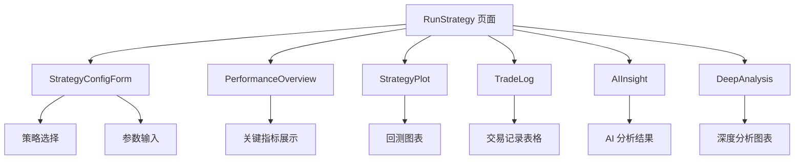
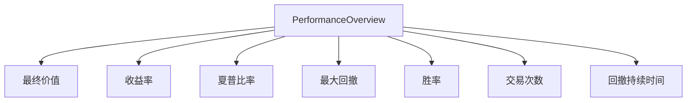

# RunStrategy 页面增强

<cite>
**本文档引用的文件**   
- [RunStrategy.jsx](file://frontend/src/pages/RunStrategy.jsx)
- [RunStrategy.css](file://frontend/src/components/RunStrategy/RunStrategy.css)
- [StrategyConfigForm.jsx](file://frontend/src/components/RunStrategy/StrategyConfigForm.jsx)
- [PerformanceOverview.jsx](file://frontend/src/components/RunStrategy/PerformanceOverview.jsx)
- [TradeLog.jsx](file://frontend/src/components/RunStrategy/TradeLog.jsx)
- [StrategyPlot.jsx](file://frontend/src/components/RunStrategy/StrategyPlot.jsx)
- [AIInsight.jsx](file://frontend/src/components/RunStrategy/AIInsight.jsx)
- [aiAnalysis.js](file://frontend/src/services/aiAnalysis.js)
- [backtest_routes.py](file://backend/src/routes/backtest_routes.py)
- [DeepAnalysis](file://frontend/src/components/DeepAnalysis)
</cite>

## 目录
1. [简介](#简介)
2. [页面结构与核心组件](#页面结构与核心组件)
3. [策略配置表单增强](#策略配置表单增强)
4. [性能概览与交易日志](#性能概览与交易日志)
5. [AI 洞察功能](#ai-洞察功能)
6. [深度分析集成](#深度分析集成)
7. [后端 API 支持](#后端-api-支持)
8. [总结](#总结)

## 简介

RunStrategy 页面是 backtrader 项目中的核心功能模块，允许用户运行回测并分析交易策略的性能。本次增强主要集中在提升用户体验、增加 AI 驱动的洞察力以及集成深度分析功能。该页面通过 React 构建，结合 Ant Design 组件库，实现了现代化的用户界面，并通过调用后端 API 实现了完整的回测流程。

**Section sources**
- [RunStrategy.jsx](file://frontend/src/pages/RunStrategy.jsx#L1-L415)

## 页面结构与核心组件

RunStrategy 页面采用模块化设计，由多个可复用的 React 组件构成。其核心结构包括策略配置表单、性能概览、图表展示、交易日志和 AI 洞察等部分。页面通过 `useState` 和 `useEffect` 钩子管理状态和副作用，确保数据流的清晰和响应性。

页面的主要状态包括回测参数（如股票代码、日期范围、初始资金等）、所选策略、回测结果和 AI 分析结果。这些状态通过事件处理器（如 `handleBacktest` 和 `handleAIAnalysis`）进行更新，并驱动 UI 的重新渲染。

**Diagram sources**
- [RunStrategy.jsx](file://frontend/src/pages/RunStrategy.jsx#L1-L415)
- [StrategyConfigForm.jsx](file://frontend/src/components/RunStrategy/StrategyConfigForm.jsx#L1-L267)
- [PerformanceOverview.jsx](file://frontend/src/components/RunStrategy/PerformanceOverview.jsx#L1-L182)
- [TradeLog.jsx](file://frontend/src/components/RunStrategy/TradeLog.jsx#L1-L58)
- [StrategyPlot.jsx](file://frontend/src/components/RunStrategy/StrategyPlot.jsx#L1-L29)
- [AIInsight.jsx](file://frontend/src/components/RunStrategy/AIInsight.jsx#L1-L99)

**Section sources**
- [RunStrategy.jsx](file://frontend/src/pages/RunStrategy.jsx#L1-L415)

## 策略配置表单增强

`StrategyConfigForm` 组件是用户与系统交互的入口，负责收集回测所需的所有参数。本次增强引入了策略参数的动态加载和覆盖功能。当用户选择一个策略时，系统会通过 `api.getStrategyParams` 接口获取该策略的特定参数，并在表单中动态生成输入框。

此外，表单支持折叠/展开功能，提升了界面的整洁度。用户可以通过点击图标来切换表单的显示状态，这对于拥有大量参数的复杂策略尤其有用。策略参数部分被设计为一个可展开的区域，默认情况下是展开的，用户可以点击标题来收起或展开参数列表。

**Section sources**
- [StrategyConfigForm.jsx](file://frontend/src/components/RunStrategy/StrategyConfigForm.jsx#L1-L267)
- [RunStrategy.css](file://frontend/src/components/RunStrategy/RunStrategy.css#L534-L618)

## 性能概览与交易日志

`PerformanceOverview` 组件以卡片形式展示了回测的关键绩效指标（KPI），如最终价值、收益率、夏普比率、最大回撤等。这些指标被组织在网格布局中，便于用户快速扫描和比较。每个指标都有明确的标签和数值，并根据其正负值使用不同的颜色进行区分。

`TradeLog` 组件则以表格形式列出了所有交易的详细信息，包括交易编号、开仓/平仓日期和价格、交易量、净盈亏和收益率。表格支持排序和筛选，帮助用户深入分析交易行为。该组件通过 `formatCurrency` 和 `formatPercent` 工具函数对数值进行格式化，确保了数据的可读性。

**Diagram sources**
- [PerformanceOverview.jsx](file://frontend/src/components/RunStrategy/PerformanceOverview.jsx#L1-L182)

**Section sources**
- [PerformanceOverview.jsx](file://frontend/src/components/RunStrategy/PerformanceOverview.jsx#L1-L182)
- [TradeLog.jsx](file://frontend/src/components/RunStrategy/TradeLog.jsx#L1-L58)

## AI 洞察功能

AI 洞察是本次增强的核心亮点。`AIInsight` 组件允许用户利用 AI 模型（如 GPT-4）对回测结果进行深度分析。用户可以选择不同的 AI 模型，并触发分析流程。分析结果以 Markdown 格式呈现，支持丰富的文本格式，如标题、列表、代码块和引用。

分析过程由 `performFullStrategyAnalysis` 函数驱动，该函数会收集回测结果、策略代码、性能指标和交易日志，并将其作为提示（prompt）发送给 AI 服务。AI 服务返回的分析结果会被缓存，并支持在不同模型之间切换查看。此外，用户还可以查看 AI 的“思考过程”，增加了分析的透明度。

**Section sources**
- [AIInsight.jsx](file://frontend/src/components/RunStrategy/AIInsight.jsx#L1-L99)
- [aiAnalysis.js](file://frontend/src/services/aiAnalysis.js#L1-L203)

## 深度分析集成

RunStrategy 页面集成了 `DeepAnalysis` 组件，提供了一系列高级分析图表。这些图表包括月度收益热力图、滚动夏普比率图、收益分布图、回撤分布图和连续亏损统计等。这些分析帮助用户从不同维度理解策略的风险和收益特征。

`DeepAnalysis` 组件通过 `api.getDeepAnalysis` 接口从后端获取计算好的分析数据，并将其渲染为交互式图表。该组件采用响应式布局，能够适应不同屏幕尺寸。分析数据在首次请求后会被缓存，避免了重复计算，提高了性能。

**Section sources**
- [DeepAnalysis](file://frontend/src/components/DeepAnalysis#index.jsx)
- [backtest_routes.py](file://backend/src/routes/backtest_routes.py#L241-L325)

## 后端 API 支持

RunStrategy 页面的功能依赖于后端提供的 RESTful API。`backtest_routes.py` 文件定义了处理回测相关请求的路由。`/backtest` 端点用于执行回测，返回回测结果和图表 URL。`/backtest/history` 端点用于管理回测历史记录，支持查询、获取详情、更新 AI 分析和删除记录。

`/backtest/history/{backtest_id}/ai-analysis` 端点允许前端将 AI 分析结果保存到数据库中，实现分析结果的持久化。`/backtest/history/{backtest_id}/deep-analysis` 端点则负责计算和返回深度分析数据。这些 API 设计合理，遵循了 REST 原则，并通过 Pydantic 模型保证了数据的有效性。

**Section sources**
- [backtest_routes.py](file://backend/src/routes/backtest_routes.py#L1-L325)
- [backtestApi.js](file://frontend/src/services/backtestApi.js#L1-L71)

## 总结

RunStrategy 页面的增强显著提升了 backtrader 项目的用户体验和分析能力。通过引入 AI 洞察和深度分析功能，用户可以获得更深入的策略见解。模块化的设计和清晰的代码结构使得系统易于维护和扩展。未来可以考虑增加更多 AI 模型的支持、优化分析算法以及提供更丰富的可视化选项。