# 前端架构

<cite>
**本文档引用的文件**  
- [App.jsx](file://frontend\src\App.jsx)
- [main.jsx](file://frontend\src\main.jsx)
- [i18n.js](file://frontend\src\i18n.js)
- [api.js](file://frontend\src\services\api.js)
- [LogtoProvider.jsx](file://frontend\src\providers\LogtoProvider.jsx)
- [NotificationProvider.jsx](file://frontend\src\providers\NotificationProvider.jsx)
- [Layout.jsx](file://frontend\src\components\Layout\Layout.jsx)
- [RunStrategy.jsx](file://frontend\src\pages\RunStrategy.jsx)
- [LiveTradingDashboard.jsx](file://frontend\src\pages\LiveTradingDashboard.jsx)
- [useAuth.js](file://frontend\src\hooks\useAuth.js)
- [useLiveTrading.js](file://frontend\src\hooks\useLiveTrading.js)
- [PrivateRoute.jsx](file://frontend\src\components\Auth\PrivateRoute.jsx)
- [auth.js](file://frontend\src\config\auth.js)
- [websocket.js](file://frontend\src\services\websocket.js)
- [StrategyConfigForm.jsx](file://frontend\src\components\RunStrategy\StrategyConfigForm.jsx)
- [LiveConfigForm.jsx](file://frontend\src\components\LiveTrading\LiveConfigForm.jsx)
- [zh](file://frontend\src\locales\zh)
- [en](file://frontend\src\locales\en)
</cite>

## 目录
1. [项目结构](#项目结构)
2. [核心组件体系](#核心组件体系)
3. [状态管理机制](#状态管理机制)
4. [国际化支持](#国际化支持)
5. [API集成与通信](#api集成与通信)
6. [组件开发最佳实践](#组件开发最佳实践)

## 项目结构

前端项目采用模块化设计，主要目录结构如下：
- `src/components`: 核心UI组件，按功能划分（Auth、Layout、RunStrategy等）
- `src/pages`: 页面级组件，对应不同路由
- `src/services`: API服务和WebSocket通信
- `src/providers`: React Context状态管理
- `src/hooks`: 自定义Hook
- `src/locales`: 国际化语言文件
- `src/config`: 配置文件

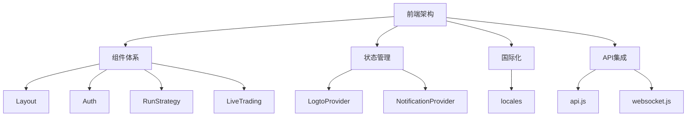

**图示来源**
- [App.jsx](file://frontend\src\App.jsx)
- [project_structure](file://)

## 核心组件体系

### Layout组件
`Layout`组件作为应用的主布局容器，提供统一的页面框架，包含顶部导航栏、侧边菜单和内容区域。它集成了用户认证信息显示、语言切换和通知中心功能。

**组件职责：**
- 提供应用的整体布局结构
- 显示用户信息和认证状态
- 实现中英文语言切换功能
- 集成通知中心

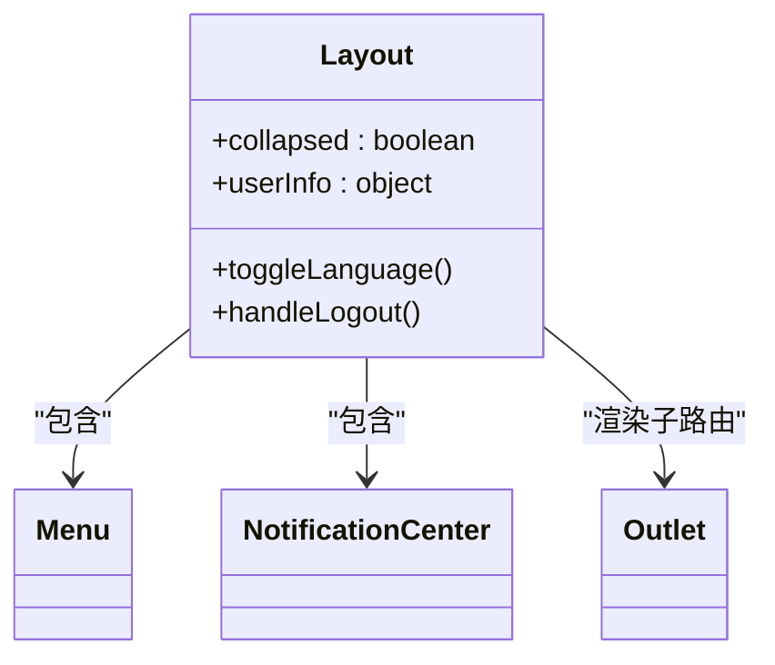

**图示来源**
- [Layout.jsx](file://frontend\src\components\Layout\Layout.jsx)
- [Menu.jsx](file://frontend\src\components\Layout\Menu.jsx)
- [NotificationCenter.jsx](file://frontend\src\components\Layout\NotificationCenter.jsx)

**本节来源**
- [Layout.jsx](file://frontend\src\components\Layout\Layout.jsx)

### Auth组件
`Auth`组件体系提供完整的认证功能，包括路由保护和用户状态管理。

#### PrivateRoute组件
`PrivateRoute`组件用于保护需要认证的路由，根据用户的认证状态决定是否允许访问。

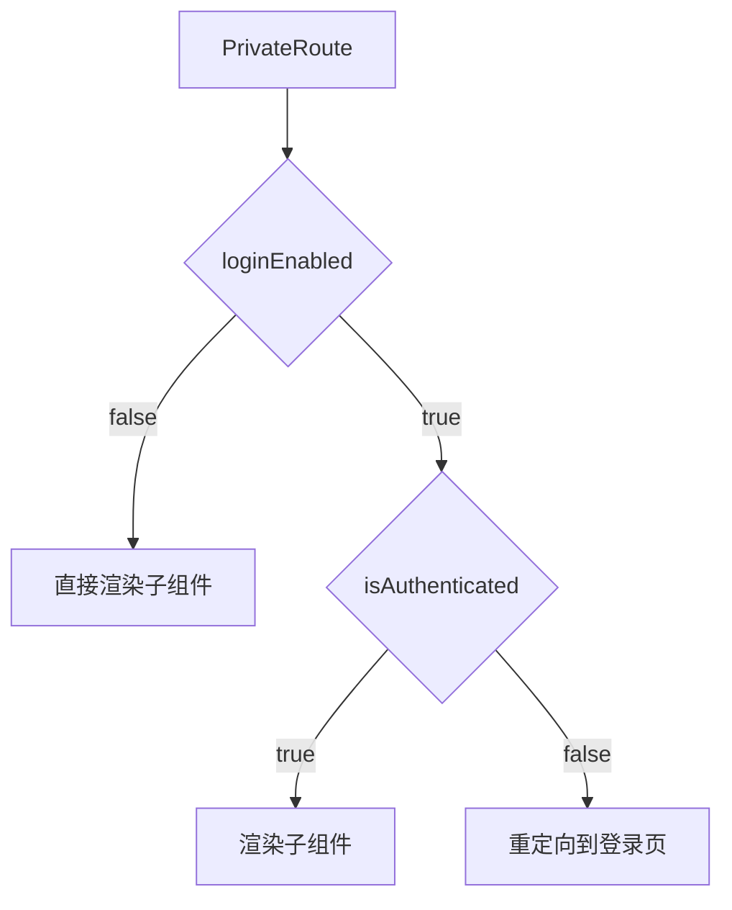

**图示来源**
- [PrivateRoute.jsx](file://frontend\src\components\Auth\PrivateRoute.jsx)
- [useAuth.js](file://frontend\src\hooks\useAuth.js)

**本节来源**
- [PrivateRoute.jsx](file://frontend\src\components\Auth\PrivateRoute.jsx)

### RunStrategy组件
`RunStrategy`组件用于运行策略回测，包含策略配置、性能分析和交易日志等功能。

**组件构成：**
- `StrategyConfigForm`: 策略配置表单
- `PerformanceOverview`: 性能概览
- `TradeLog`: 交易日志
- `StrategyPlot`: 策略图表

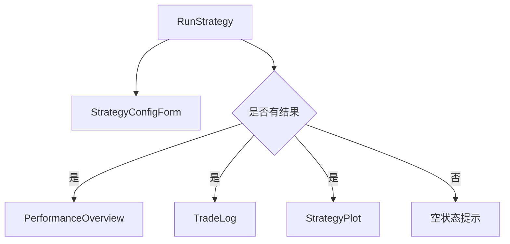

**图示来源**
- [RunStrategy.jsx](file://frontend\src\pages\RunStrategy.jsx)
- [StrategyConfigForm.jsx](file://frontend\src\components\RunStrategy\StrategyConfigForm.jsx)

**本节来源**
- [RunStrategy.jsx](file://frontend\src\pages\RunStrategy.jsx)

### LiveTrading组件
`LiveTrading`组件用于实时交易，提供交易会话管理、仓位监控和订单日志等功能。

**组件构成：**
- `LiveConfigForm`: 交易配置表单
- `SessionControls`: 会话控制
- `PositionTable`: 仓位表格
- `OrderLog`: 订单日志
- `PnLChart`: 盈亏图表

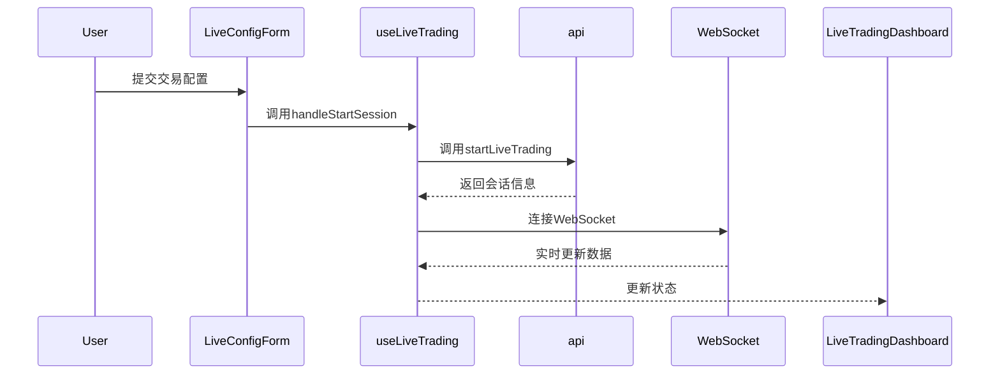

**图示来源**
- [LiveTradingDashboard.jsx](file://frontend\src\pages\LiveTradingDashboard.jsx)
- [useLiveTrading.js](file://frontend\src\hooks\useLiveTrading.js)
- [api.js](file://frontend\src\services\api.js)
- [websocket.js](file://frontend\src\services\websocket.js)

**本节来源**
- [LiveTradingDashboard.jsx](file://frontend\src\pages\LiveTradingDashboard.jsx)

## 状态管理机制

### LogtoProvider
`LogtoProvider`基于Logto认证服务，提供OAuth 2.0认证和令牌管理功能。

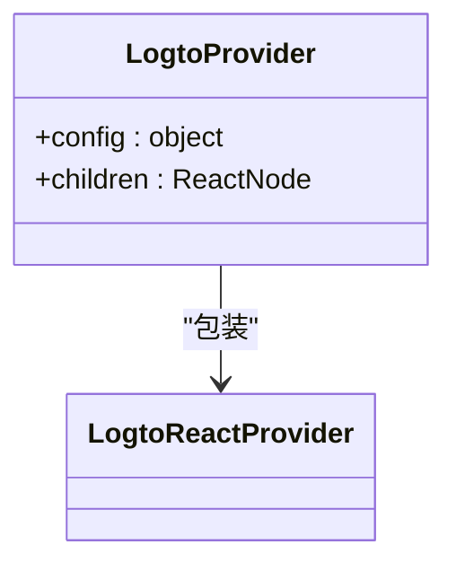

**本节来源**
- [LogtoProvider.jsx](file://frontend\src\providers\LogtoProvider.jsx)

### NotificationProvider
`NotificationProvider`使用React Context实现全局通知状态管理，支持添加、标记已读和清除通知。

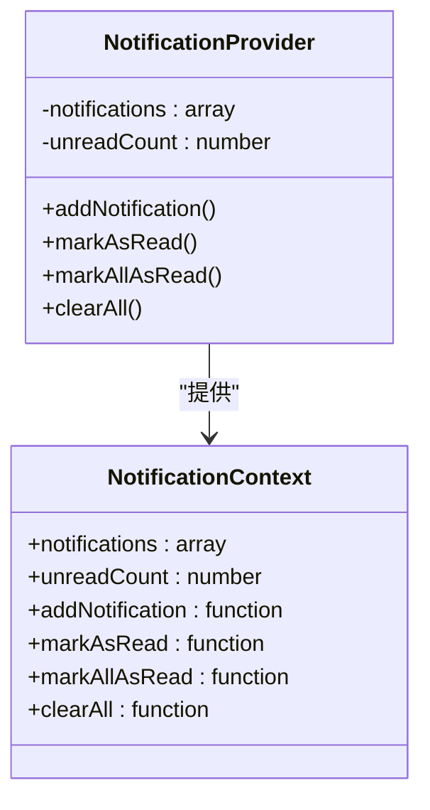

**图示来源**
- [NotificationProvider.jsx](file://frontend\src\providers\NotificationProvider.jsx)

**本节来源**
- [NotificationProvider.jsx](file://frontend\src\providers\NotificationProvider.jsx)

### useAuth Hook
`useAuth` Hook提供统一的认证接口，支持认证启用和禁用两种模式。

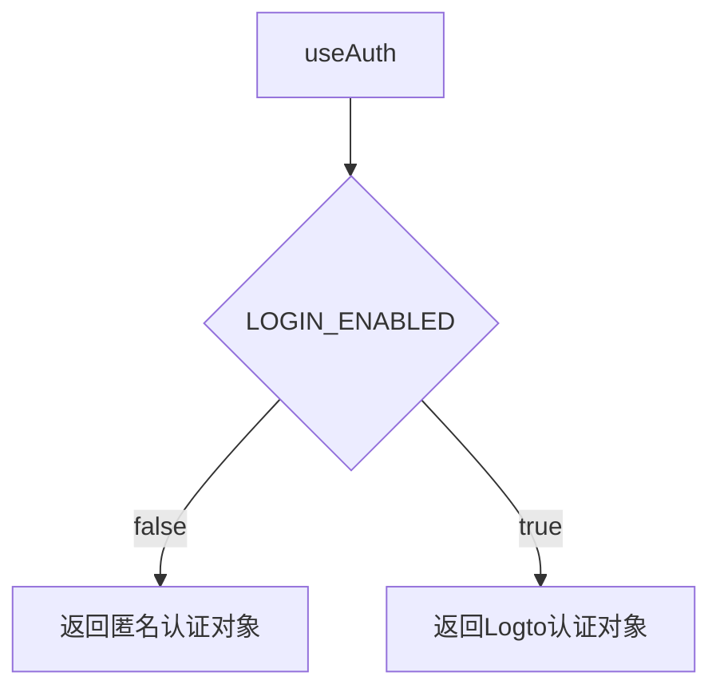

**本节来源**
- [useAuth.js](file://frontend\src\hooks\useAuth.js)

## 国际化支持

### i18next配置
项目使用i18next实现多语言支持，支持中英文切换。

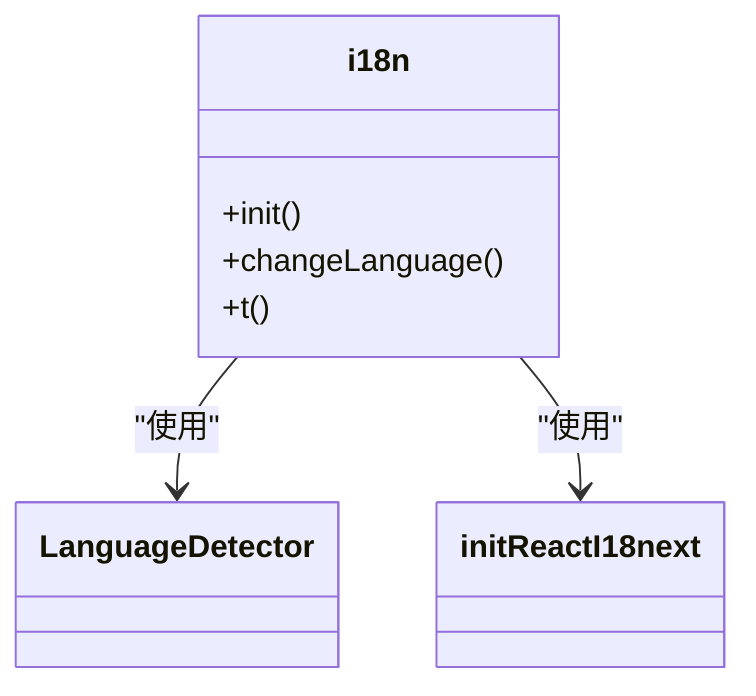

**本节来源**
- [i18n.js](file://frontend\src\i18n.js)

### 语言文件组织
`locales`目录下按语言代码组织JSON文件，每个功能模块有独立的语言文件。

```
locales/
├── en/
│   ├── app.json
│   ├── auth.json
│   ├── common.json
│   ├── config_form.json
│   ├── datasource.json
│   ├── history.json
│   ├── home.json
│   ├── live.json
│   ├── maintain.json
│   ├── nav.json
│   ├── performance.json
│   ├── settings.json
│   ├── strategy_plot.json
│   ├── trade_log.json
│   └── walkforward.json
└── zh/
    ├── app.json
    ├── auth.json
    ├── common.json
    ├── config_form.json
    ├── datasource.json
    ├── history.json
    ├── home.json
    ├── live.json
    ├── maintain.json
    ├── nav.json
    ├── performance.json
    ├── settings.json
    ├── strategy_plot.json
    ├── trade_log.json
    └── walkforward.json
```

**本节来源**
- [i18n.js](file://frontend\src\i18n.js)
- [locales](file://frontend\src\locales)

## API集成与通信

### API客户端封装
`api.js`文件封装了所有API调用，提供统一的请求构建、认证和错误处理机制。

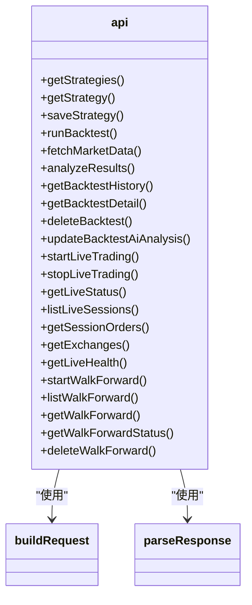

**图示来源**
- [api.js](file://frontend\src\services\api.js)

**本节来源**
- [api.js](file://frontend\src\services\api.js)

### WebSocket通信
`websocket.js`提供WebSocket Hook，支持实时交易数据更新。

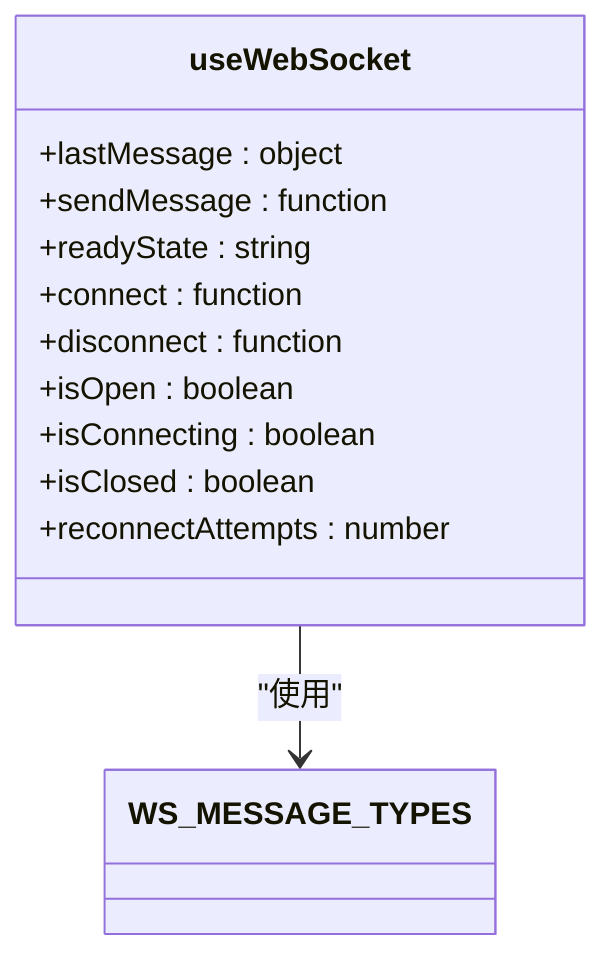

**图示来源**
- [websocket.js](file://frontend\src\services\websocket.js)

**本节来源**
- [websocket.js](file://frontend\src\services\websocket.js)

## 组件开发最佳实践

### 状态管理最佳实践
1. **使用Context进行全局状态管理**：对于跨组件共享的状态，使用React Context
2. **自定义Hook封装逻辑**：将复杂的业务逻辑封装在自定义Hook中
3. **状态提升**：将共享状态提升到最近的共同父组件

### API调用最佳实践
1. **统一API客户端**：所有API调用通过`api.js`中的封装函数
2. **错误处理**：在`parseResponse`中统一处理HTTP错误
3. **认证集成**：自动注入Bearer令牌进行认证

### 组件设计最佳实践
1. **单一职责原则**：每个组件只负责一个功能
2. **可复用性**：设计可复用的UI组件
3. **类型安全**：使用PropTypes定义组件属性类型

**本节来源**
- [App.jsx](file://frontend\src\App.jsx)
- [api.js](file://frontend\src\services\api.js)
- [NotificationProvider.jsx](file://frontend\src\providers\NotificationProvider.jsx)