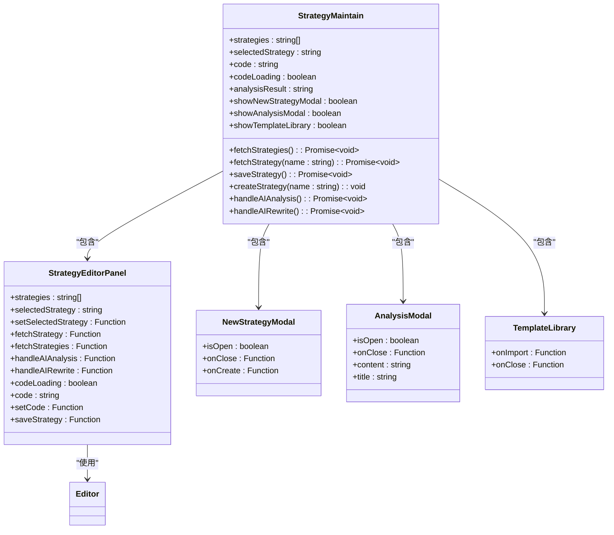
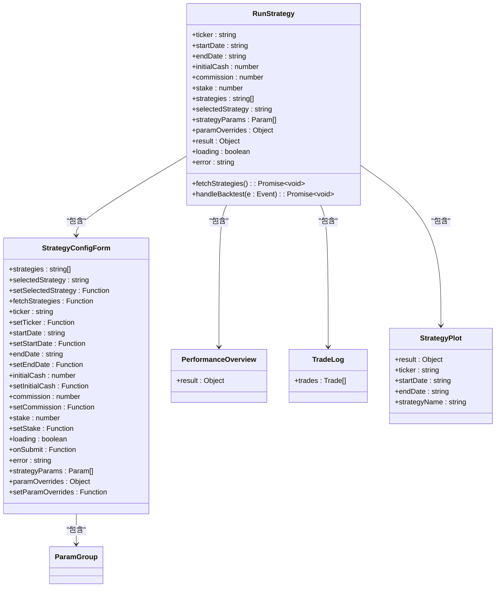
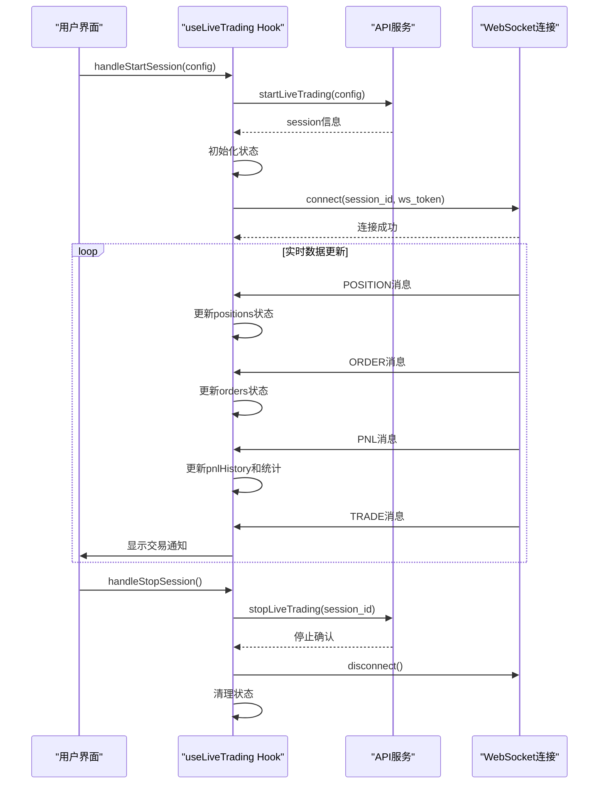
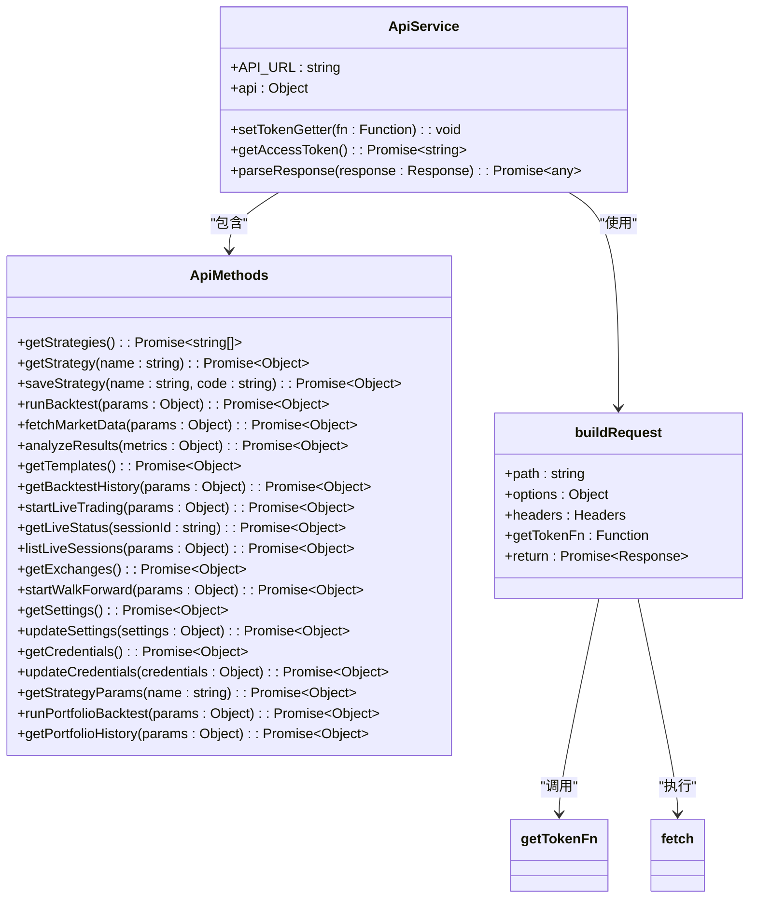
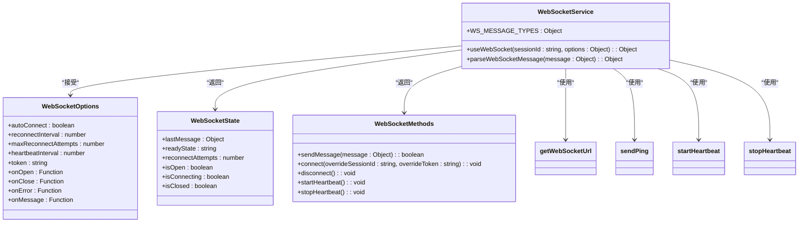
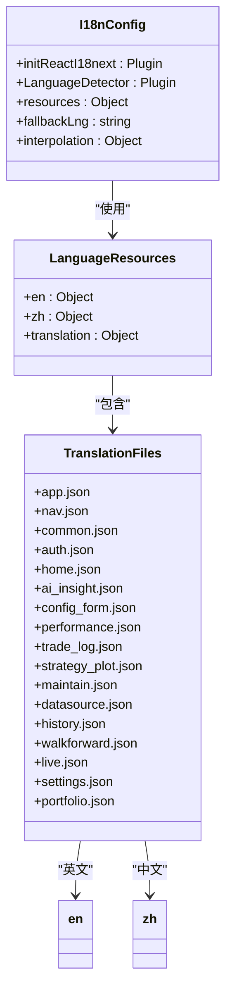
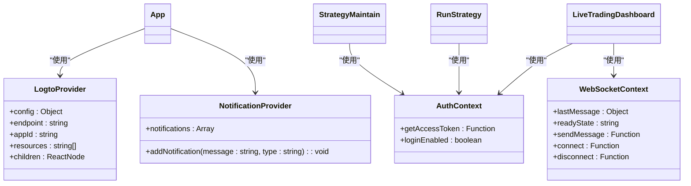

# 前端架构

<cite>
**本文档中引用的文件**  
- [App.jsx](file://frontend\src\App.jsx)
- [main.jsx](file://frontend\src\main.jsx)
- [i18n.js](file://frontend\src\i18n.js)
- [api.js](file://frontend\src\services\api.js)
- [websocket.js](file://frontend\src\services\websocket.js)
- [StrategyMaintain.jsx](file://frontend\src\pages\StrategyMaintain.jsx)
- [RunStrategy.jsx](file://frontend\src\pages\RunStrategy.jsx)
- [LiveTradingDashboard.jsx](file://frontend\src\pages\LiveTradingDashboard.jsx)
- [useLiveTrading.js](file://frontend\src\hooks\useLiveTrading.js)
- [LogtoProvider.jsx](file://frontend\src\providers\LogtoProvider.jsx)
- [StrategyEditorPanel.jsx](file://frontend\src\components\StrategyMaintain\StrategyEditorPanel.jsx)
- [StrategyMaintain.css](file://frontend\src\components\StrategyMaintain\StrategyMaintain.css)
- [RunStrategy.css](file://frontend\src\components\RunStrategy\RunStrategy.css)
- [StrategyConfigForm.jsx](file://frontend\src\components\RunStrategy\StrategyConfigForm.jsx)
- [auth.js](file://frontend\src\config\auth.js)
</cite>

## 目录
1. [项目结构](#项目结构)
2. [核心组件架构](#核心组件架构)
3. [API集成机制](#api集成机制)
4. [WebSocket实时通信](#websocket实时通信)
5. [国际化实现](#国际化实现)
6. [状态管理与上下文](#状态管理与上下文)
7. [代码组织规范](#代码组织规范)

## 项目结构

前端应用采用基于React的组件化架构，src目录下按功能划分核心模块：

```mermaid
graph TB
src[src] --> components[components]
src --> pages[pages]
src --> services[services]
src --> hooks[hooks]
src --> providers[providers]
src --> locales[locales]
src --> config[config]
src --> utils[utils]
src --> App.jsx
src --> main.jsx
src --> i18n.js
components --> StrategyMaintain[StrategyMaintain]
components --> RunStrategy[RunStrategy]
components --> LiveTrading[LiveTrading]
components --> DataSource[DataSource]
components --> BacktestHistory[BacktestHistory]
components --> Layout[Layout]
components --> Auth[Auth]
pages --> StrategyMaintainPage[StrategyMaintain.jsx]
pages --> RunStrategyPage[RunStrategy.jsx]
pages --> LiveTradingPage[LiveTradingDashboard.jsx]
pages --> DataSourcePage[DataSource.jsx]
pages --> BacktestHistoryPage[BacktestHistory.jsx]
pages --> Home[Home.jsx]
pages --> Settings[Settings.jsx]
services --> api[api.js]
services --> websocket[websocket.js]
services --> aiAnalysis[aiAnalysis.js]
hooks --> useAuth[useAuth.js]
hooks --> useLiveTrading[useLiveTrading.js]
providers --> LogtoProvider[LogtoProvider.jsx]
providers --> NotificationProvider[NotificationProvider.jsx]
locales --> en[en]
locales --> zh[zh]
```

**图示来源**
- [App.jsx](file://frontend\src\App.jsx)
- 项目结构

**本节来源**
- [App.jsx](file://frontend\src\App.jsx)
- [main.jsx](file://frontend\src\main.jsx)

## 核心组件架构

前端应用的核心功能由StrategyMaintain、RunStrategy和LiveTrading三大组件构成，每个组件都遵循React的组件化设计模式，通过props进行通信。

### StrategyMaintain组件

StrategyMaintain是策略维护的核心组件，负责策略的创建、编辑和管理。

**图示来源**
- [StrategyMaintain.jsx](file://frontend\src\pages\StrategyMaintain.jsx)
- [StrategyEditorPanel.jsx](file://frontend\src\components\StrategyMaintain\StrategyEditorPanel.jsx)

**本节来源**
- [StrategyMaintain.jsx](file://frontend\src\pages\StrategyMaintain.jsx)
- [StrategyMaintain.css](file://frontend\src\components\StrategyMaintain\StrategyMaintain.css)

### RunStrategy组件

RunStrategy组件负责策略回测的配置和执行，通过表单收集用户输入并调用后端API执行回测。

**图示来源**
- [RunStrategy.jsx](file://frontend\src\pages\RunStrategy.jsx)
- [StrategyConfigForm.jsx](file://frontend\src\components\RunStrategy\StrategyConfigForm.jsx)

**本节来源**
- [RunStrategy.jsx](file://frontend\src\pages\RunStrategy.jsx)
- [RunStrategy.css](file://frontend\src\components\RunStrategy\RunStrategy.css)

### LiveTrading组件

LiveTrading组件负责实时交易会话的管理，通过WebSocket获取实时数据更新。

**图示来源**
- [LiveTradingDashboard.jsx](file://frontend\src\pages\LiveTradingDashboard.jsx)
- [useLiveTrading.js](file://frontend\src\hooks\useLiveTrading.js)

**本节来源**
- [LiveTradingDashboard.jsx](file://frontend\src\pages\LiveTradingDashboard.jsx)
- [useLiveTrading.js](file://frontend\src\hooks\useLiveTrading.js)

## API集成机制

前端通过services/api.js模块封装对后端REST API的调用，提供统一的接口访问方式。

**图示来源**
- [api.js](file://frontend\src\services\api.js)

**本节来源**
- [api.js](file://frontend\src\services\api.js)

## WebSocket实时通信

前端通过services/websocket.js模块管理WebSocket连接，实现实时数据更新。

**图示来源**
- [websocket.js](file://frontend\src\services\websocket.js)

**本节来源**
- [websocket.js](file://frontend\src\services\websocket.js)

## 国际化实现

前端通过i18n.js配置国际化，支持多语言切换。

**图示来源**
- [i18n.js](file://frontend\src\i18n.js)
- [locales](file://frontend\src\locales)

**本节来源**
- [i18n.js](file://frontend\src\i18n.js)

## 状态管理与上下文

前端应用使用React Context进行状态管理，通过providers目录下的组件提供全局状态。

**图示来源**
- [LogtoProvider.jsx](file://frontend\src\providers\LogtoProvider.jsx)
- [App.jsx](file://frontend\src\App.jsx)

**本节来源**
- [LogtoProvider.jsx](file://frontend\src\providers\LogtoProvider.jsx)
- [App.jsx](file://frontend\src\App.jsx)

## 代码组织规范

前端代码遵循清晰的组织规范，确保可维护性和可扩展性。

### 目录结构规范

- **components**: 可复用UI组件，按功能分组
- **pages**: 页面容器组件，每个页面一个文件
- **services**: API和WebSocket客户端，封装后端通信
- **hooks**: 自定义Hook，封装可复用逻辑
- **providers**: 状态管理上下文提供者
- **locales**: 国际化资源文件
- **config**: 配置文件
- **utils**: 工具函数

### 组件通信规范

组件间通过props进行通信，遵循单向数据流原则：

1. 父组件通过props向子组件传递数据和回调函数
2. 子组件通过调用回调函数向父组件传递数据
3. 使用自定义Hook共享逻辑和状态
4. 使用Context提供全局状态

### 最佳实践

1. **组件拆分**: 将复杂组件拆分为更小的、可复用的子组件
2. **状态管理**: 使用useState和useReducer管理组件状态
3. **副作用处理**: 使用useEffect处理副作用
4. **性能优化**: 使用React.memo、useCallback和useMemo优化性能
5. **类型检查**: 使用PropTypes进行运行时类型检查
6. **样式管理**: 使用CSS模块或CSS-in-JS避免样式冲突

**本节来源**
- [App.jsx](file://frontend\src\App.jsx)
- [main.jsx](file://frontend\src\main.jsx)
- [i18n.js](file://frontend\src\i18n.js)
- [api.js](file://frontend\src\services\api.js)
- [websocket.js](file://frontend\src\services\websocket.js)