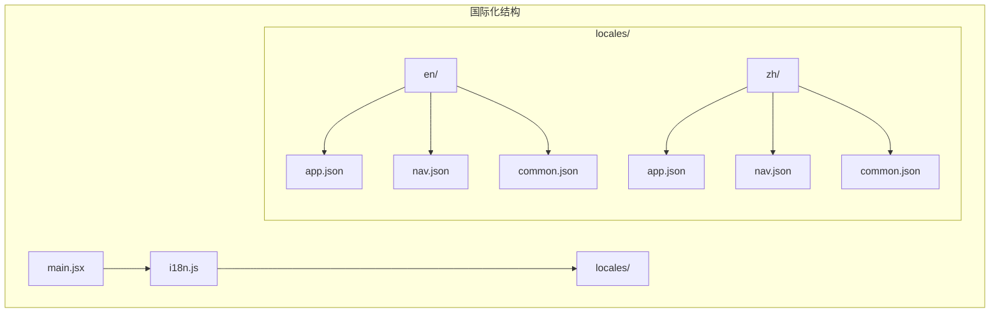
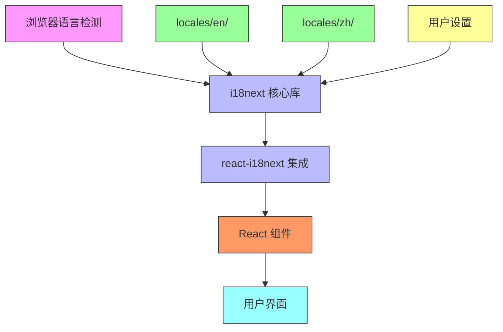
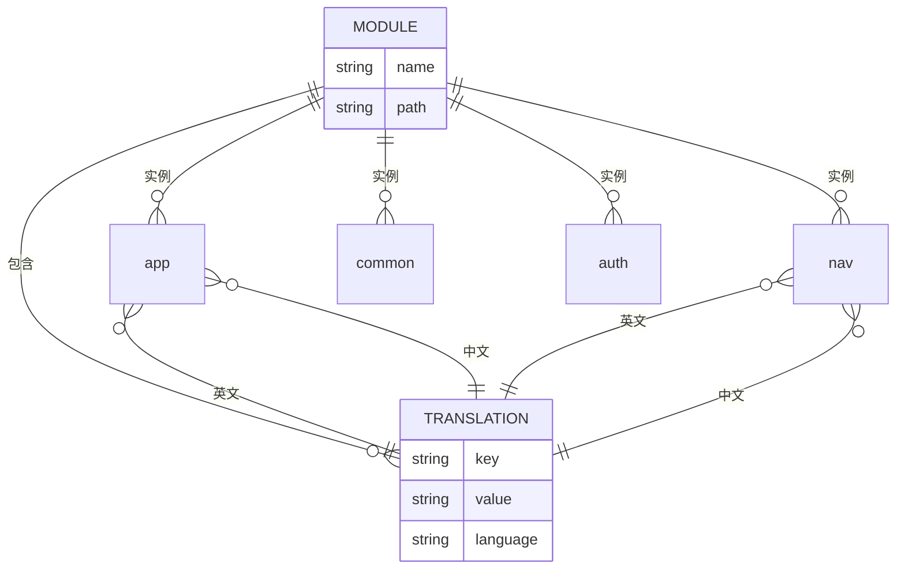
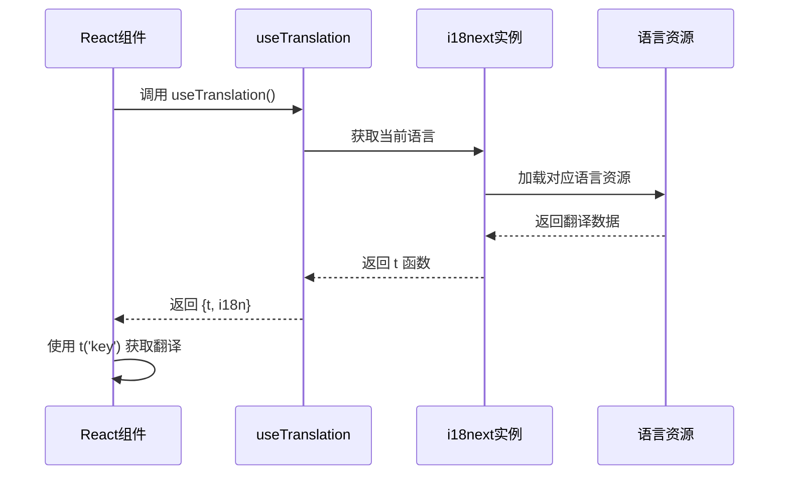
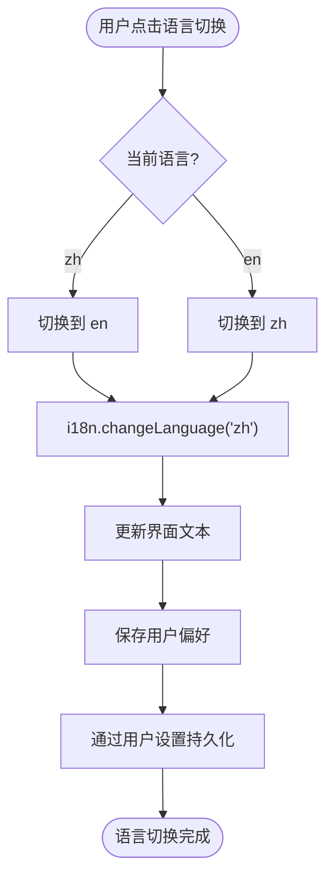
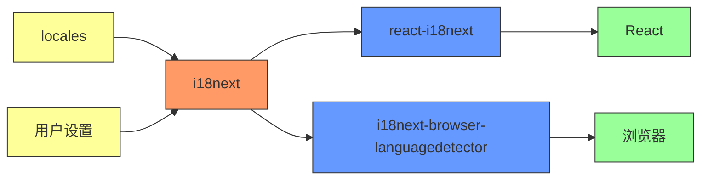

# 国际化

<cite>
**本文档引用的文件**  
- [i18n.js](file://frontend/src/i18n.js)
- [main.jsx](file://frontend/src/main.jsx)
- [Layout.jsx](file://frontend/src/components/Layout/Layout.jsx)
- [Home.jsx](file://frontend/src/pages/Home.jsx)
- [app.json](file://frontend/src/locales/en/app.json)
- [nav.json](file://frontend/src/locales/en/nav.json)
- [common.json](file://frontend/src/locales/en/common.json)
- [LogtoProvider.jsx](file://frontend/src/providers/LogtoProvider.jsx)
- [Settings.jsx](file://frontend/src/pages/Settings.jsx)
- [config_manager.py](file://backend/src/config/config_manager.py)
- [settings_storage.py](file://backend/src/db/settings_storage.py)
</cite>

## 目录
1. [简介](#简介)
2. [项目结构](#项目结构)
3. [核心组件](#核心组件)
4. [架构概述](#架构概述)
5. [详细组件分析](#详细组件分析)
6. [依赖分析](#依赖分析)
7. [性能考虑](#性能考虑)
8. [故障排除指南](#故障排除指南)
9. [结论](#结论)

## 简介
本项目实现了完整的国际化（i18n）支持机制，基于 i18next 库为前端应用提供多语言功能。系统支持英语（en）和中文（zh）两种语言，并通过模块化的 JSON 资源文件组织翻译内容。国际化配置在应用启动时初始化，自动检测用户语言偏好，并支持手动语言切换。语言偏好通过用户设置持久化存储，确保用户体验的一致性。

## 项目结构
国际化功能的实现主要集中在前端 `src` 目录下，采用清晰的分层结构来组织语言资源和配置。



**图示来源**  
- [i18n.js](file://frontend/src/i18n.js)
- [locales](file://frontend/src/locales)

**本节来源**  
- [i18n.js](file://frontend/src/i18n.js)
- [main.jsx](file://frontend/src/main.jsx)

## 核心组件
国际化系统的核心组件包括 i18next 配置初始化、语言资源管理、React 集成以及语言切换功能。系统通过 `i18n.js` 文件集中管理所有国际化配置，从 `locales` 目录加载语言资源，并使用 `react-i18next` 与 React 组件无缝集成。

**本节来源**  
- [i18n.js](file://frontend/src/i18n.js)
- [main.jsx](file://frontend/src/main.jsx)

## 架构概述
系统的国际化架构采用分层设计，从底层的语言资源到上层的用户界面，各层职责分明。



**图示来源**  
- [i18n.js](file://frontend/src/i18n.js)
- [main.jsx](file://frontend/src/main.jsx)
- [Layout.jsx](file://frontend/src/components/Layout/Layout.jsx)

## 详细组件分析

### i18n.js 配置分析
`i18n.js` 文件是国际化系统的入口点，负责初始化 i18next 配置并加载所有语言资源。

```mermaid
classDiagram
class I18nConfig {
+initReactI18next
+LanguageDetector
+resources : Object
+fallbackLng : string
+debug : boolean
+interpolation : Object
+init(config) void
+changeLanguage(lang) Promise
}
class LanguageDetector {
+detect() string
+cacheUserLanguage(lang) void
}
I18nConfig --> LanguageDetector : 使用
I18nConfig --> "en" : 加载资源
I18nConfig --> "zh" : 加载资源
```

**图示来源**  
- [i18n.js](file://frontend/src/i18n.js#L1-L114)

**本节来源**  
- [i18n.js](file://frontend/src/i18n.js#L1-L114)

### 语言资源结构分析
语言资源文件按功能模块划分，每个模块对应一个 JSON 文件，便于维护和扩展。



**图示来源**  
- [app.json](file://frontend/src/locales/en/app.json)
- [nav.json](file://frontend/src/locales/en/nav.json)
- [common.json](file://frontend/src/locales/en/common.json)

**本节来源**  
- [app.json](file://frontend/src/locales/en/app.json)
- [nav.json](file://frontend/src/locales/en/nav.json)
- [common.json](file://frontend/src/locales/en/common.json)

### React 组件集成分析
React 组件通过 useTranslation Hook 使用翻译文本，实现动态语言切换。



**图示来源**  
- [Layout.jsx](file://frontend/src/components/Layout/Layout.jsx#L3-L17)
- [Home.jsx](file://frontend/src/pages/Home.jsx#L63-L63)

**本节来源**  
- [Layout.jsx](file://frontend/src/components/Layout/Layout.jsx#L3-L17)
- [Home.jsx](file://frontend/src/pages/Home.jsx#L63-L63)

### 语言切换功能分析
语言切换功能允许用户在界面中手动切换语言，并通过用户设置持久化偏好。



**图示来源**  
- [Layout.jsx](file://frontend/src/components/Layout/Layout.jsx#L25-L28)
- [Settings.jsx](file://frontend/src/pages/Settings.jsx)

**本节来源**  
- [Layout.jsx](file://frontend/src/components/Layout/Layout.jsx#L25-L28)
- [Settings.jsx](file://frontend/src/pages/Settings.jsx)

## 依赖分析
国际化系统依赖于多个关键组件和外部库，形成完整的依赖链。



**图示来源**  
- [package-lock.json](file://frontend/package-lock.json)
- [i18n.js](file://frontend/src/i18n.js)

**本节来源**  
- [package-lock.json](file://frontend/package-lock.json)
- [i18n.js](file://frontend/src/i18n.js)

## 性能考虑
国际化系统的性能主要体现在资源加载效率和运行时性能上。系统在启动时预加载所有语言资源，避免了运行时的异步加载延迟。通过模块化的资源文件组织，减少了不必要的资源加载。语言切换操作是同步的，确保了界面响应的即时性。

## 故障排除指南
当遇到国际化相关问题时，可以按照以下步骤进行排查：

**本节来源**  
- [i18n.js](file://frontend/src/i18n.js)
- [main.jsx](file://frontend/src/main.jsx)

## 结论
本项目的国际化实现机制完整且可扩展，基于 i18next 库提供了稳定可靠的多语言支持。通过模块化的 JSON 资源文件组织，系统实现了按功能划分的翻译键管理。React 组件通过 useTranslation Hook 简洁地使用翻译文本。语言切换功能结合用户设置实现了偏好持久化。添加新语言的流程清晰，只需创建相应的语言目录、翻译 JSON 文件并注册语言资源即可。整体架构设计合理，既满足了当前需求，又为未来的扩展提供了良好的基础。