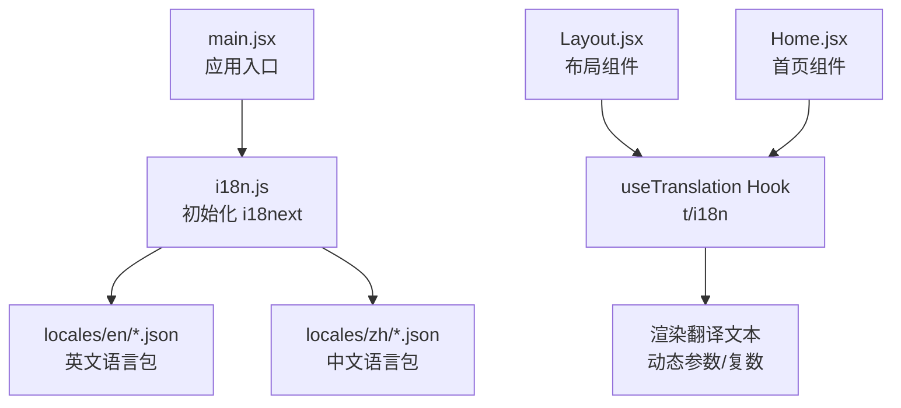
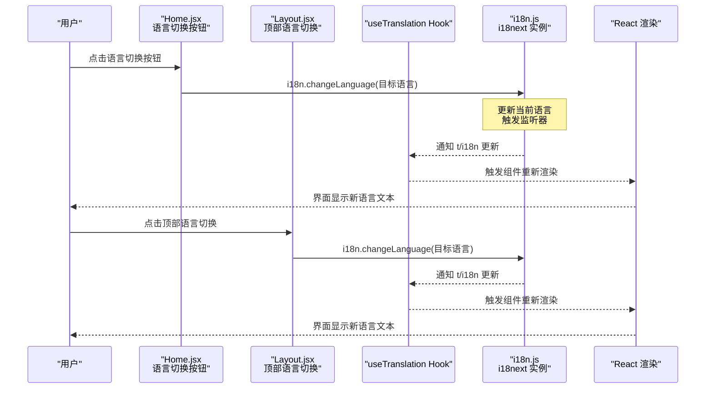
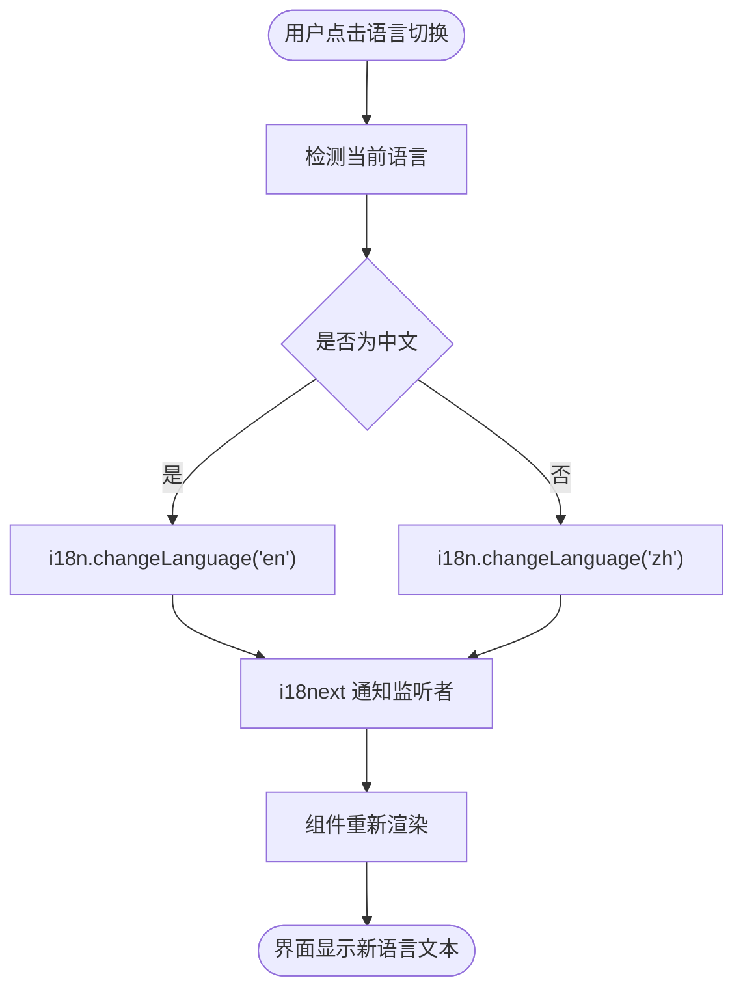
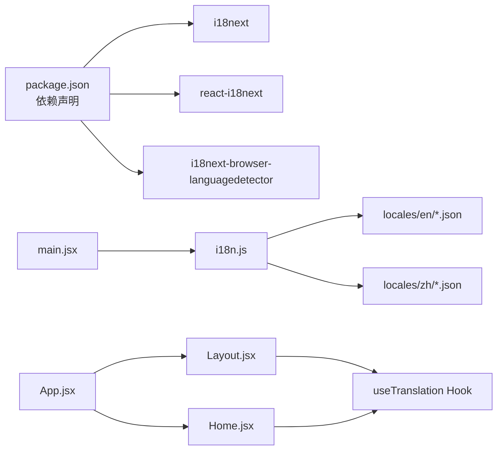

# 国际化支持

<cite>
**本文引用的文件**
- [frontend/src/i18n.js](file://frontend/src/i18n.js)
- [frontend/src/main.jsx](file://frontend/src/main.jsx)
- [frontend/src/App.jsx](file://frontend/src/App.jsx)
- [frontend/src/components/Layout/Layout.jsx](file://frontend/src/components/Layout/Layout.jsx)
- [frontend/src/pages/Home.jsx](file://frontend/src/pages/Home.jsx)
- [frontend/src/locales/locales.md](file://frontend/src/locales/locales.md)
- [frontend/src/locales/en/app.json](file://frontend/src/locales/en/app.json)
- [frontend/src/locales/zh/app.json](file://frontend/src/locales/zh/app.json)
- [frontend/src/locales/en/nav.json](file://frontend/src/locales/en/nav.json)
- [frontend/src/locales/zh/nav.json](file://frontend/src/locales/zh/nav.json)
- [frontend/src/locales/en/common.json](file://frontend/src/locales/en/common.json)
- [frontend/src/locales/zh/common.json](file://frontend/src/locales/zh/common.json)
- [frontend/package.json](file://frontend/package.json)
</cite>

## 目录
1. [简介](#简介)
2. [项目结构](#项目结构)
3. [核心组件](#核心组件)
4. [架构总览](#架构总览)
5. [详细组件分析](#详细组件分析)
6. [依赖关系分析](#依赖关系分析)
7. [性能考量](#性能考量)
8. [故障排查指南](#故障排查指南)
9. [结论](#结论)
10. [附录](#附录)

## 简介
本文件系统性阐述基于 i18next 的前端国际化（i18n）实现机制，覆盖以下主题：
- i18n 初始化与配置：默认语言、语言资源加载路径、回退策略、浏览器语言探测。
- 语言包组织：locales 目录下 en/zh 的结构与按功能模块拆分的 JSON 文件协作方式。
- React 组件中的使用：useTranslation Hook 的调用、动态参数插值与复数形式处理。
- 语言切换流程：从 UI 触发到全局状态更新再到界面重渲染的完整链路。
- 新增语言与翻译项的操作指南：命名规范、维护注意事项与最佳实践。

## 项目结构
国际化相关的关键位置如下：
- 初始化入口：frontend/src/i18n.js 负责注册 i18next 实例、加载语言资源、配置回退与探测器。
- 应用入口：frontend/src/main.jsx 引入 i18n.js，确保在应用启动时完成初始化。
- 组件使用：frontend/src/components/Layout/Layout.jsx 与 frontend/src/pages/Home.jsx 展示了 useTranslation 的典型用法与语言切换交互。
- 语言包：frontend/src/locales 下按语言与功能模块划分的 JSON 文件。

图表来源
- [frontend/src/main.jsx](file://frontend/src/main.jsx#L1-L11)
- [frontend/src/i18n.js](file://frontend/src/i18n.js#L1-L110)
- [frontend/src/components/Layout/Layout.jsx](file://frontend/src/components/Layout/Layout.jsx#L1-L132)
- [frontend/src/pages/Home.jsx](file://frontend/src/pages/Home.jsx#L62-L127)

章节来源
- [frontend/src/main.jsx](file://frontend/src/main.jsx#L1-L11)
- [frontend/src/i18n.js](file://frontend/src/i18n.js#L1-L110)
- [frontend/src/locales/locales.md](file://frontend/src/locales/locales.md#L1-L17)

## 核心组件
- i18n 初始化与配置
  - 使用浏览器语言探测器自动识别用户语言。
  - 默认回退语言为英文；同时支持 zh-CN、zh-TW 映射到 zh。
  - 通过模块导入加载各语言的功能模块 JSON，构建 resources 结构。
  - 关闭 escapeValue（React 已内置转义），便于直接插入 HTML。
- 语言包组织
  - 按功能模块拆分：app.json、nav.json、common.json 等，便于维护与查找。
  - 各语言目录保持相同键集合，确保一致性与可扩展性。
- React 组件中的使用
  - 通过 useTranslation 获取 t 与 i18n，t 用于翻译文本，i18n 用于切换语言。
  - 支持动态参数插值与复数形式处理（由 i18next 官方能力提供）。

章节来源
- [frontend/src/i18n.js](file://frontend/src/i18n.js#L1-L110)
- [frontend/src/locales/locales.md](file://frontend/src/locales/locales.md#L1-L17)
- [frontend/src/components/Layout/Layout.jsx](file://frontend/src/components/Layout/Layout.jsx#L1-L132)
- [frontend/src/pages/Home.jsx](file://frontend/src/pages/Home.jsx#L62-L127)

## 架构总览
下面的序列图展示了语言切换从 UI 到界面重渲染的完整链路。

图表来源
- [frontend/src/pages/Home.jsx](file://frontend/src/pages/Home.jsx#L62-L127)
- [frontend/src/components/Layout/Layout.jsx](file://frontend/src/components/Layout/Layout.jsx#L1-L132)
- [frontend/src/i18n.js](file://frontend/src/i18n.js#L1-L110)

## 详细组件分析

### i18n 初始化与配置（i18n.js）
- 初始化流程
  - 注册 LanguageDetector 以自动探测浏览器语言。
  - 使用 initReactI18next 将 i18next 与 React 集成。
  - 配置 debug、fallbackLng、interpolation.escapeValue 等选项。
  - resources 中包含 en、zh 以及 zh-CN、zh-TW 的映射。
- 语言资源加载
  - 通过模块导入各语言的功能模块 JSON，构建 translation 对象树。
  - 保证 en 与 zh 的键集合一致，避免运行时报错。
- 回退策略
  - 当目标语言缺失键时回退至英文；同时对 zh-CN、zh-TW 进行映射。

章节来源
- [frontend/src/i18n.js](file://frontend/src/i18n.js#L1-L110)

### React 组件中的 useTranslation 使用
- 在布局组件中
  - 通过 useTranslation 获取 t 与 i18n。
  - 顶部语言切换按钮根据当前语言决定显示“English”或“中文”，点击后调用 i18n.changeLanguage 切换语言。
  - 使用 t('app.pro_title') 等键渲染标题与菜单文案。
- 在首页组件中
  - 通过 useTranslation 获取 t 与 i18n。
  - 语言切换下拉菜单通过 i18n.changeLanguage 实现切换。
  - 大量使用 t('模块.键') 进行文案渲染，例如导航、功能介绍、按钮文案等。
- 动态参数与复数形式
  - 动态参数：t('home.welcome', { name: user.name })。
  - 复数形式：t('home.item_count', { count: n })，由 i18next 的复数规则处理。

章节来源
- [frontend/src/components/Layout/Layout.jsx](file://frontend/src/components/Layout/Layout.jsx#L1-L132)
- [frontend/src/pages/Home.jsx](file://frontend/src/pages/Home.jsx#L62-L127)

### 语言包组织与协作（locales 目录）
- 目录结构
  - en 与 zh 目录下按功能模块拆分 JSON 文件，如 app.json、nav.json、common.json 等。
  - 语言包遵循“键命名点分层或模块前缀”的约定，便于查找与维护。
- 协作方式
  - i18n.js 将各模块 JSON 合并为 translation 对象树，供 t 函数查询。
  - 保持各语言目录键集合一致，避免运行时缺失键导致的错误。

章节来源
- [frontend/src/locales/locales.md](file://frontend/src/locales/locales.md#L1-L17)
- [frontend/src/locales/en/app.json](file://frontend/src/locales/en/app.json#L1-L4)
- [frontend/src/locales/zh/app.json](file://frontend/src/locales/zh/app.json#L1-L4)
- [frontend/src/locales/en/nav.json](file://frontend/src/locales/en/nav.json#L1-L9)
- [frontend/src/locales/zh/nav.json](file://frontend/src/locales/zh/nav.json#L1-L9)
- [frontend/src/locales/en/common.json](file://frontend/src/locales/en/common.json#L1-L14)
- [frontend/src/locales/zh/common.json](file://frontend/src/locales/zh/common.json#L1-L14)

### 语言切换流程（UI -> 全局状态 -> 重渲染）
- 触发点
  - 首页语言切换按钮与顶部语言切换按钮均调用 i18n.changeLanguage。
- 执行链路
  - i18n.changeLanguage 更新当前语言并触发监听器。
  - useTranslation 返回的 t/i18n 发生变化，驱动组件重新渲染。
  - 界面文本随之更新为对应语言。
- 一致性保障
  - 由于 en/zh 键集合一致，切换不会出现缺失键导致的空白或报错。

图表来源
- [frontend/src/pages/Home.jsx](file://frontend/src/pages/Home.jsx#L62-L127)
- [frontend/src/components/Layout/Layout.jsx](file://frontend/src/components/Layout/Layout.jsx#L1-L132)
- [frontend/src/i18n.js](file://frontend/src/i18n.js#L1-L110)

## 依赖关系分析
- 外部依赖
  - i18next、react-i18next、i18next-browser-languagedetector 由 package.json 管理。
- 内部依赖
  - main.jsx 引入 i18n.js，确保初始化在应用启动时完成。
  - App.jsx 作为根组件，内部嵌套布局与页面组件，这些组件通过 useTranslation 访问翻译。
  - Layout.jsx 与 Home.jsx 直接使用 useTranslation 与 i18n.changeLanguage。

图表来源
- [frontend/package.json](file://frontend/package.json#L1-L40)
- [frontend/src/main.jsx](file://frontend/src/main.jsx#L1-L11)
- [frontend/src/i18n.js](file://frontend/src/i18n.js#L1-L110)
- [frontend/src/App.jsx](file://frontend/src/App.jsx#L1-L119)
- [frontend/src/components/Layout/Layout.jsx](file://frontend/src/components/Layout/Layout.jsx#L1-L132)
- [frontend/src/pages/Home.jsx](file://frontend/src/pages/Home.jsx#L62-L127)

章节来源
- [frontend/package.json](file://frontend/package.json#L1-L40)
- [frontend/src/main.jsx](file://frontend/src/main.jsx#L1-L11)
- [frontend/src/i18n.js](file://frontend/src/i18n.js#L1-L110)
- [frontend/src/App.jsx](file://frontend/src/App.jsx#L1-L119)

## 性能考量
- 资源加载
  - 采用模块导入方式加载语言包，打包工具会按需处理，避免一次性加载全部语言包。
- 渲染性能
  - useTranslation 返回的 t/i18n 变化仅触发相关组件重渲染，避免全站刷新。
- 回退策略
  - fallbackLng 与 zh-CN/zh-TW 映射减少运行时键缺失概率，降低异常开销。

## 故障排查指南
- 常见问题
  - 切换语言后部分文案未更新：检查对应语言目录是否包含该键，确保 en/zh 键集合一致。
  - 页面出现“缺失键”提示：确认 i18n.js 中 resources 是否包含该键，或在回退语言中提供默认值。
  - 语言切换无效：确认 i18n.changeLanguage 被正确调用，且组件已使用 useTranslation。
- 排查步骤
  - 在浏览器控制台查看 i18next debug 输出（初始化时启用 debug）。
  - 核对 locales 目录下的键是否一致，必要时执行批量同步脚本或 IDE 检查。
  - 确认 main.jsx 已引入 i18n.js，确保初始化在应用启动时完成。

章节来源
- [frontend/src/i18n.js](file://frontend/src/i18n.js#L1-L110)
- [frontend/src/locales/locales.md](file://frontend/src/locales/locales.md#L1-L17)

## 结论
本项目采用 i18next + react-i18next 的成熟方案，结合浏览器语言探测与回退策略，实现了稳定高效的多语言支持。通过按功能模块拆分的语言包与严格的键一致性约束，既保证了可维护性，也降低了运行时风险。组件层通过 useTranslation Hook 与 i18n.changeLanguage 实现无缝的语言切换体验。

## 附录

### 新增语言或翻译项操作指南
- 新增语言
  - 在 locales 目录下新增语言子目录（如 fr），复制现有 en/zh 的键结构。
  - 在 i18n.js 的 resources 中添加该语言映射，确保键集合与现有语言一致。
  - 在 UI 中增加语言切换选项，调用 i18n.changeLanguage 切换。
- 新增翻译项
  - 在对应语言目录的 JSON 文件中添加新键，建议使用“模块.键”命名。
  - 在所有语言目录中同步添加该键，保持键集合一致。
  - 在组件中通过 t('模块.键') 使用新键，必要时传入动态参数。
- 命名规范与维护注意事项
  - 键命名使用点分层或模块前缀，便于查找与合并。
  - 语言包仅存放文案与简单格式化占位，禁止包含业务逻辑。
  - 保持 en/zh 键集合一致，避免运行时缺失键导致的错误。

章节来源
- [frontend/src/locales/locales.md](file://frontend/src/locales/locales.md#L1-L17)
- [frontend/src/i18n.js](file://frontend/src/i18n.js#L1-L110)