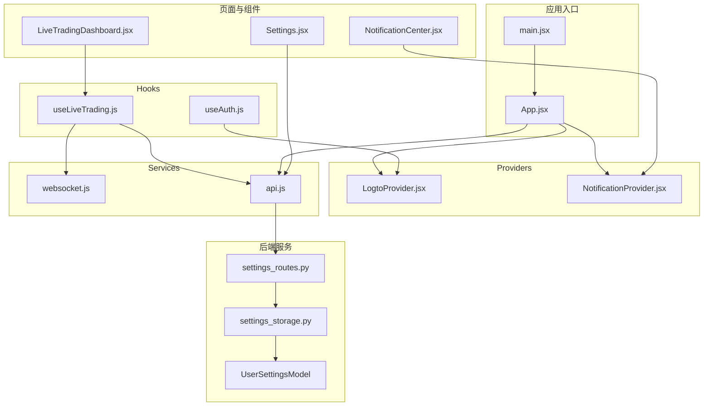
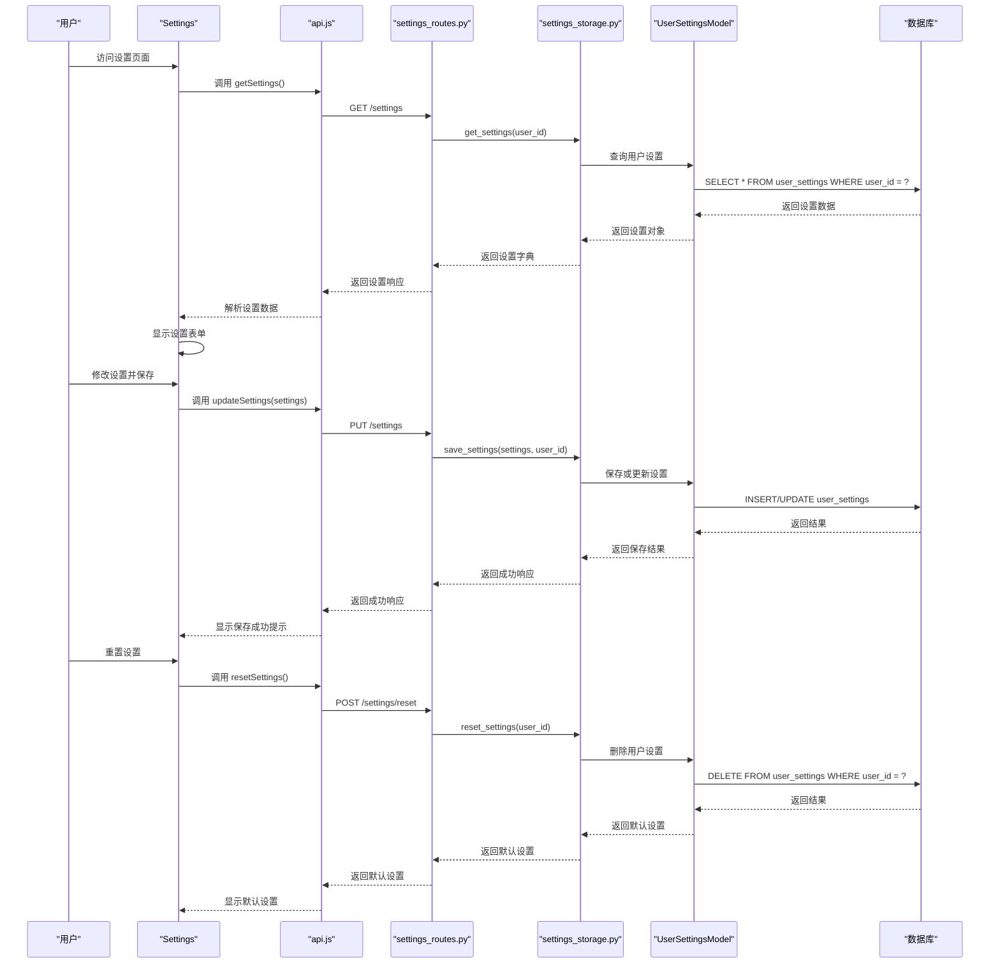
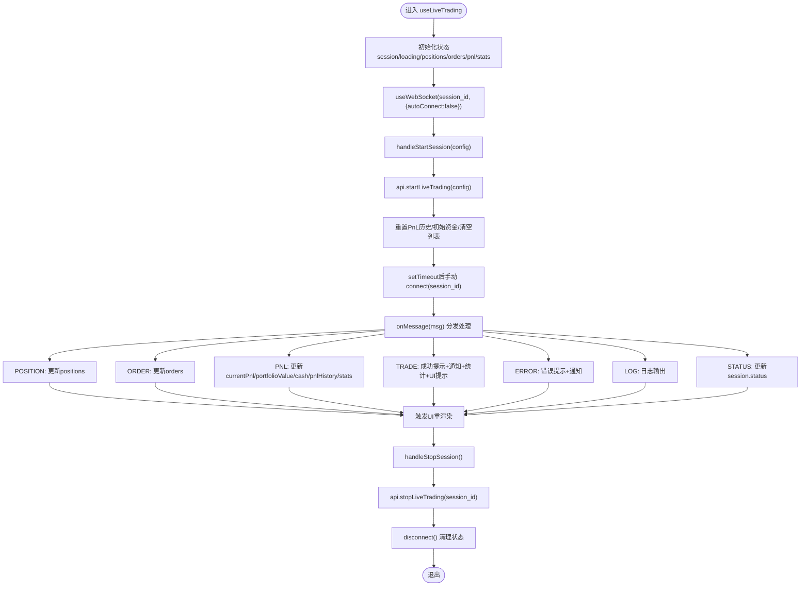
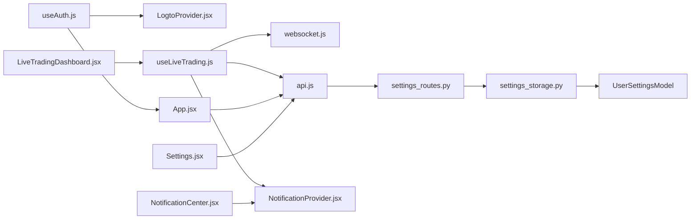

# 状态管理

<cite>
**本文引用的文件**
- [Settings.jsx](file://frontend/src/pages/Settings.jsx)
- [settings_routes.py](file://backend/src/routes/settings_routes.py)
- [settings_storage.py](file://backend/src/db/settings_storage.py)
- [models.py](file://backend/src/db/models.py)
- [api.js](file://frontend/src/services/api.js)
- [useAuth.js](file://frontend/src/hooks/useAuth.js)
- [LogtoProvider.jsx](file://frontend/src/providers/LogtoProvider.jsx)
- [NotificationProvider.jsx](file://frontend/src/providers/NotificationProvider.jsx)
- [useAuth.js](file://frontend/src/hooks/useAuth.js)
- [auth.js](file://frontend/src/config/auth.js)
- [App.jsx](file://frontend/src/App.jsx)
- [main.jsx](file://frontend/src/main.jsx)
- [LiveTradingDashboard.jsx](file://frontend/src/pages/LiveTradingDashboard.jsx)
- [NotificationCenter.jsx](file://frontend/src/components/Layout/NotificationCenter.jsx)
- [websocket.js](file://frontend/src/services/websocket.js)
- [LogtoProvider.jsx](file://frontend/src/providers/LogtoProvider.jsx)
- [NotificationProvider.jsx](file://frontend/src/providers/NotificationProvider.jsx)
- [useAuth.js](file://frontend/src/hooks/useAuth.js)
- [useLiveTrading.js](file://frontend/src/hooks/useLiveTrading.js)
- [websocket.js](file://frontend/src/services/websocket.js)
- [auth.js](file://frontend/src/config/auth.js)
- [App.jsx](file://frontend/src/App.jsx)
- [main.jsx](file://frontend/src/main.jsx)
- [LiveTradingDashboard.jsx](file://frontend/src/pages/LiveTradingDashboard.jsx)
- [NotificationCenter.jsx](file://frontend/src/components/Layout/NotificationCenter.jsx)
- [api.js](file://frontend/src/services/api.js)
</cite>

## 更新摘要
**变更内容**
- 在“详细组件分析”章节中新增了“Settings页面：用户设置状态管理”小节，详细描述了用户设置状态的管理机制
- 更新了“架构总览”章节的Mermaid序列图，增加了Settings页面与后端的交互流程
- 更新了“项目结构”章节的Mermaid图，增加了Settings相关组件
- 更新了“核心组件”章节，增加了Settings页面的描述
- 更新了“依赖关系分析”章节的Mermaid图，增加了Settings相关依赖

## 目录
1. [引言](#引言)
2. [项目结构](#项目结构)
3. [核心组件](#核心组件)
4. [架构总览](#架构总览)
5. [详细组件分析](#详细组件分析)
6. [依赖关系分析](#依赖关系分析)
7. [性能考量](#性能考量)
8. [故障排查指南](#故障排查指南)
9. [结论](#结论)
10. [附录](#附录)

## 引言
本文件系统性梳理前端状态管理的设计与实现，重点围绕以下目标：
- 解释 LogtoProvider 如何封装用户认证状态，提供登录、登出与令牌刷新能力，并在应用全局共享认证上下文。
- 阐述 NotificationProvider 如何实现跨组件的消息通知机制，统一管理错误、警告与成功提示。
- 分析 useAuth 与 useLiveTrading 自定义 Hook 的职责划分与封装策略，提供简洁的状态访问接口。
- 说明 WebSocket 连接（websocket.js）如何与状态管理集成，实现实时交易数据、PnL 更新与订单日志的自动同步。
- 提供状态管理最佳实践：Context 拆分策略、避免不必要重渲染的优化技巧以及错误边界处理建议。

## 项目结构
前端状态管理相关的关键文件分布如下：
- Providers 层：LogtoProvider.jsx、NotificationProvider.jsx
- Hooks 层：useAuth.js、useLiveTrading.js
- Services 层：websocket.js、api.js
- 应用入口与路由：App.jsx、main.jsx
- 使用示例页面与组件：LiveTradingDashboard.jsx、NotificationCenter.jsx
- 认证开关配置：auth.js
- 用户设置管理：Settings.jsx、settings_routes.py、settings_storage.py、UserSettingsModel

图表来源
- [main.jsx](file://frontend/src/main.jsx#L1-L12)
- [App.jsx](file://frontend/src/App.jsx#L1-L119)
- [LogtoProvider.jsx](file://frontend/src/providers/LogtoProvider.jsx#L1-L34)
- [NotificationProvider.jsx](file://frontend/src/providers/NotificationProvider.jsx#L1-L59)
- [useAuth.js](file://frontend/src/hooks/useAuth.js#L1-L30)
- [useLiveTrading.js](file://frontend/src/hooks/useLiveTrading.js#L1-L281)
- [websocket.js](file://frontend/src/services/websocket.js#L1-L282)
- [api.js](file://frontend/src/services/api.js#L1-L255)
- [LiveTradingDashboard.jsx](file://frontend/src/pages/LiveTradingDashboard.jsx#L1-L173)
- [NotificationCenter.jsx](file://frontend/src/components/Layout/NotificationCenter.jsx#L1-L125)
- [Settings.jsx](file://frontend/src/pages/Settings.jsx#L1-L269)
- [settings_routes.py](file://backend/src/routes/settings_routes.py#L1-L128)
- [settings_storage.py](file://backend/src/db/settings_storage.py#L1-L259)
- [models.py](file://backend/src/db/models.py#L436-L471)

章节来源
- [main.jsx](file://frontend/src/main.jsx#L1-L12)
- [App.jsx](file://frontend/src/App.jsx#L1-L119)

## 核心组件
- LogtoProvider：基于 @logto/react 的认证 Provider，负责注入 Logto 配置并为整个应用提供认证上下文。
- NotificationProvider：基于 React Context 的通知 Provider，维护通知列表与未读计数，提供添加、标记已读、清空等操作。
- useAuth：统一认证 Hook，支持“受保护模式”与“匿名模式”，在匿名模式下返回无操作的占位实现，便于本地开发或演示。
- useLiveTrading：实时交易状态聚合 Hook，负责会话生命周期、交易数据（持仓、订单、PnL、统计）、WebSocket 消息处理与 API 调用。
- websocket.js：通用 WebSocket Hook，提供连接、断开、心跳、自动重连、消息解析与状态暴露。
- api.js：统一 API 封装，负责构建带授权头的请求、处理 401 重定向、集中化错误处理。
- App.jsx：应用根组件，按需包裹 LogtoProvider 与 NotificationProvider，设置 API 的 token 获取器。
- LiveTradingDashboard 与 NotificationCenter：具体消费状态的页面与组件。
- Settings.jsx：用户设置管理页面，负责从后端获取设置、本地存储迁移、表单状态管理和加载状态处理。
- settings_routes.py：后端设置路由，提供获取、更新和重置用户设置的API接口。
- settings_storage.py：设置存储层，管理用户AI配置和提示模板的CRUD操作。
- UserSettingsModel：用户设置数据库模型，存储用户偏好设置。

章节来源
- [LogtoProvider.jsx](file://frontend/src/providers/LogtoProvider.jsx#L1-L34)
- [NotificationProvider.jsx](file://frontend/src/providers/NotificationProvider.jsx#L1-L59)
- [useAuth.js](file://frontend/src/hooks/useAuth.js#L1-L30)
- [useLiveTrading.js](file://frontend/src/hooks/useLiveTrading.js#L1-L281)
- [websocket.js](file://frontend/src/services/websocket.js#L1-L282)
- [api.js](file://frontend/src/services/api.js#L1-L255)
- [App.jsx](file://frontend/src/App.jsx#L1-L119)
- [LiveTradingDashboard.jsx](file://frontend/src/pages/LiveTradingDashboard.jsx#L1-L173)
- [NotificationCenter.jsx](file://frontend/src/components/Layout/NotificationCenter.jsx#L1-L125)
- [Settings.jsx](file://frontend/src/pages/Settings.jsx#L1-L269)
- [settings_routes.py](file://backend/src/routes/settings_routes.py#L1-L128)
- [settings_storage.py](file://backend/src/db/settings_storage.py#L1-L259)
- [models.py](file://backend/src/db/models.py#L436-L471)

## 架构总览
整体架构采用“Provider + Hook”的组合式状态管理模式：
- 认证层：LogtoProvider 提供认证上下文；App.jsx 注入 tokenGetter，使 API 请求自动携带 Bearer Token。
- 通知层：NotificationProvider 提供全局通知上下文；NotificationCenter 组件消费通知状态。
- 业务层：useLiveTrading 聚合实时交易状态与 WebSocket；useAuth 抽象登录/登出与令牌获取。
- 通信层：websocket.js 提供 WebSocket 连接与心跳；api.js 统一请求构建与错误处理。
- 设置管理层：Settings.jsx 管理用户设置状态，通过API与后端交互，实现设置的持久化和迁移。

图表来源
- [Settings.jsx](file://frontend/src/pages/Settings.jsx#L1-L269)
- [api.js](file://frontend/src/services/api.js#L256-L274)
- [settings_routes.py](file://backend/src/routes/settings_routes.py#L36-L126)
- [settings_storage.py](file://backend/src/db/settings_storage.py#L64-L218)
- [models.py](file://backend/src/db/models.py#L436-L471)

## 详细组件分析

### LogtoProvider：认证上下文封装
- 职责
  - 从环境变量读取 Logto 端点、应用 ID 与资源标识。
  - 校验配置完整性并在缺失时输出错误日志。
  - 包裹子树，向应用提供 @logto/react 的认证上下文。
- 关键点
  - 配置来源于 import.meta.env，便于在不同环境切换。
  - 子组件可通过 useLogto 获取登录、登出、令牌等能力。
- 与 App.jsx 的协作
  - App.jsx 在启用登录时包裹 LogtoProvider；同时将 getAccessToken 注入到 API 层，使后续请求自动携带 Authorization 头。

章节来源
- [LogtoProvider.jsx](file://frontend/src/providers/LogtoProvider.jsx#L1-L34)
- [App.jsx](file://frontend/src/App.jsx#L1-L119)

### NotificationProvider：通知上下文与统一提示
- 职责
  - 维护通知数组与未读计数。
  - 提供添加通知、标记单条/全部已读、清空通知等方法。
  - 通过 useHeaderNotification 暴露上下文，供组件安全消费。
- 设计要点
  - 使用 useCallback 包裹回调以减少重渲染。
  - 未读计数与通知列表联动更新，保证一致性。
- 与组件的协作
  - LiveTrading 中在交易事件发生时调用 addNotification，统一推送成功/错误提示。
  - NotificationCenter 组件展示通知列表、未读数与批量操作。

章节来源
- [NotificationProvider.jsx](file://frontend/src/providers/NotificationProvider.jsx#L1-L59)
- [useLiveTrading.js](file://frontend/src/hooks/useLiveTrading.js#L1-L281)
- [NotificationCenter.jsx](file://frontend/src/components/Layout/NotificationCenter.jsx#L1-L125)

### useAuth：统一认证 Hook
- 职责
  - 当登录启用时，透传 @logto/react 的 useLogto 能力。
  - 当登录禁用时，返回“匿名模式”的占位对象，包含登录/登出空函数与令牌获取空实现，同时报告已认证且加载完成。
- 与配置的关系
  - 通过 auth.js 的 LOGIN_ENABLED 控制是否启用登录流程。
- 与 API 的协作
  - App.jsx 在登录启用时设置 tokenGetter，使 API 请求自动携带令牌。

章节来源
- [useAuth.js](file://frontend/src/hooks/useAuth.js#L1-L30)
- [auth.js](file://frontend/src/config/auth.js#L1-L4)
- [App.jsx](file://frontend/src/App.jsx#L1-L119)
- [api.js](file://frontend/src/services/api.js#L1-L255)

### useLiveTrading：实时交易状态聚合 Hook
- 状态管理
  - 会话状态：session、loading
  - 交易数据：positions、orders、pnlHistory、currentPnl、portfolioValue、cash
  - 统计指标：totalTrades、winningTrades、losingTrades、winRate
  - WebSocket 状态：wsConnected
- WebSocket 集成
  - 通过 useWebSocket 接收 POSITION、ORDER、PNL、TRADE、LOG、ERROR、STATUS 等消息类型，分别更新对应状态。
  - 会话启动后手动连接 WebSocket，避免自动重连导致的循环连接。
- 生命周期与 API 协作
  - 启动会话：调用 API startLiveTrading，初始化 PnL 历史与初始资金，随后手动连接 WebSocket。
  - 停止会话：调用 API stopLiveTrading，断开 WebSocket 并清理状态。
  - 刷新状态：调用 API 获取会话状态与订单列表。
  - 加载活跃会话：启动时拉取活跃会话并按需连接 WebSocket。
- 错误与提示
  - 对异常进行捕获并通过 NotificationProvider 与 antd message 统一提示。
- 性能注意
  - 使用 useCallback 包裹 handleWebSocketMessage，减少因消息频繁触发导致的重渲染。
  - 使用 setTimeout 控制连接时机，避免 UI 抖动。

图表来源
- [useLiveTrading.js](file://frontend/src/hooks/useLiveTrading.js#L1-L281)
- [websocket.js](file://frontend/src/services/websocket.js#L1-L282)
- [api.js](file://frontend/src/services/api.js#L1-L255)
- [NotificationProvider.jsx](file://frontend/src/providers/NotificationProvider.jsx#L1-L59)

章节来源
- [useLiveTrading.js](file://frontend/src/hooks/useLiveTrading.js#L1-L281)

### websocket.js：WebSocket Hook 与消息类型
- 功能特性
  - 支持自动连接、心跳保活、可配置重连间隔与最大次数。
  - 提供 connect/disconnect/sendMessage/open 状态查询。
  - 消息解析与类型常量（CONNECTED、POSITION、ORDER、PNL、TRADE、LOG、ERROR、STATUS、PONG）。
- 与 useLiveTrading 的集成
  - useLiveTrading 通过 useWebSocket 获取连接控制与 readyState，按需手动连接。
  - onMessage 回调中根据消息类型更新 useLiveTrading 内部状态。
- 错误处理
  - onerror/onclose 中记录日志；在 useLiveTrading 中抑制 UI 繁忙提示，避免刷屏。

章节来源
- [websocket.js](file://frontend/src/services/websocket.js#L1-L282)
- [useLiveTrading.js](file://frontend/src/hooks/useLiveTrading.js#L1-L281)

### App.jsx 与 main.jsx：Provider 拆分与入口
- App.jsx
  - 条件包裹 LogtoProvider（当 LOGIN_ENABLED 为真）。
  - 在登录启用时设置 tokenGetter，使 API 请求自动携带 Bearer Token。
  - 包裹 NotificationProvider，为全应用提供通知上下文。
- main.jsx
  - 应用根节点渲染，承载 App。

章节来源
- [App.jsx](file://frontend/src/App.jsx#L1-L119)
- [main.jsx](file://frontend/src/main.jsx#L1-L12)

### LiveTradingDashboard 与 NotificationCenter：消费状态的页面与组件
- LiveTradingDashboard
  - 使用 useLiveTrading 获取会话、交易数据与控制方法，驱动仪表盘 UI。
  - 显示 PnL、资金、交易统计与订单日志。
- NotificationCenter
  - 使用 useHeaderNotification 获取通知列表与未读计数，提供标记已读、清空等操作。

章节来源
- [LiveTradingDashboard.jsx](file://frontend/src/pages/LiveTradingDashboard.jsx#L1-L173)
- [NotificationCenter.jsx](file://frontend/src/components/Layout/NotificationCenter.jsx#L1-L125)

### Settings页面：用户设置状态管理
- 状态管理
  - 设置状态：settings（包含selectedModels、codeAnalysisPrompt、codeRewritePrompt、fullStrategyAnalysisPrompt）
  - 保存状态：saved（用于显示保存成功提示）
  - 加载状态：loading（用于禁用表单和显示加载状态）
- 设置获取与迁移
  - 页面加载时调用 loadSettings() 方法，首先尝试从后端数据库获取设置。
  - 如果数据库中没有设置或获取失败，则尝试从 localStorage 迁移旧的设置数据。
  - 迁移过程中会处理旧版本的 aiModel 字段，将其转换为新的 selectedModels 数组格式。
  - 迁移成功后会自动将设置保存到数据库，实现从 localStorage 到数据库的无缝迁移。
- 表单状态管理
  - 使用 useState 管理表单数据，通过 handleChange 和 handleModelChange 处理输入变化。
  - 当设置发生变化时，setSaved(false) 将保存状态重置，提示用户有未保存的更改。
- 设置保存与重置
  - 保存时首先验证至少选择了一个AI模型，然后尝试通过API将设置保存到数据库。
  - 如果数据库保存失败，则降级到 localStorage，确保用户设置不会丢失。
  - 重置功能会提示用户确认，然后尝试从数据库重置为默认设置，失败时则在前端重置并清除 localStorage。
- 加载状态处理
  - 在所有异步操作（加载、保存、重置）期间，使用 setLoading(true) 显示加载状态并禁用表单。
  - 使用 try-finally 确保无论操作成功或失败，最终都会 setLoading(false) 恢复界面。

章节来源
- [Settings.jsx](file://frontend/src/pages/Settings.jsx#L1-L269)
- [settings_routes.py](file://backend/src/routes/settings_routes.py#L36-L126)
- [settings_storage.py](file://backend/src/db/settings_storage.py#L64-L218)
- [models.py](file://backend/src/db/models.py#L436-L471)
- [api.js](file://frontend/src/services/api.js#L256-L274)

## 依赖关系分析
- Provider 与 Hook 的耦合
  - useAuth 依赖 @logto/react 与 auth.js 的 LOGIN_ENABLED。
  - useLiveTrading 依赖 NotificationProvider、api.js 与 websocket.js。
- 组件与服务的交互
  - LiveTradingDashboard 仅通过 useLiveTrading 暴露的方法与状态进行交互，降低耦合度。
  - NotificationCenter 仅消费 NotificationProvider 的状态，不关心业务细节。
- 外部依赖
  - @logto/react：认证上下文与令牌管理。
  - antd：消息提示与 UI 组件。
  - 浏览器 WebSocket：实时数据通道。
- Settings页面依赖
  - Settings.jsx 依赖 api.js 的 getSettings、updateSettings 和 resetSettings 方法。
  - api.js 依赖 settings_routes.py 提供的API接口。
  - settings_routes.py 依赖 settings_storage.py 实现业务逻辑。
  - settings_storage.py 依赖 UserSettingsModel 进行数据库操作。

图表来源
- [useAuth.js](file://frontend/src/hooks/useAuth.js#L1-L30)
- [LogtoProvider.jsx](file://frontend/src/providers/LogtoProvider.jsx#L1-L34)
- [App.jsx](file://frontend/src/App.jsx#L1-L119)
- [useLiveTrading.js](file://frontend/src/hooks/useLiveTrading.js#L1-L281)
- [websocket.js](file://frontend/src/services/websocket.js#L1-L282)
- [api.js](file://frontend/src/services/api.js#L1-L255)
- [NotificationProvider.jsx](file://frontend/src/providers/NotificationProvider.jsx#L1-L59)
- [LiveTradingDashboard.jsx](file://frontend/src/pages/LiveTradingDashboard.jsx#L1-L173)
- [NotificationCenter.jsx](file://frontend/src/components/Layout/NotificationCenter.jsx#L1-L125)
- [Settings.jsx](file://frontend/src/pages/Settings.jsx#L1-L269)
- [settings_routes.py](file://backend/src/routes/settings_routes.py#L1-L128)
- [settings_storage.py](file://backend/src/db/settings_storage.py#L1-L259)
- [models.py](file://backend/src/db/models.py#L436-L471)

## 性能考量
- 避免不必要的重渲染
  - 使用 useCallback 包裹回调（如 useLiveTrading 的 handleWebSocketMessage），确保在依赖稳定时不会重建函数引用。
  - 使用 useMemo 或合理拆分状态，减少大对象频繁变更引发的渲染风暴。
- Context 拆分策略
  - 将通知与认证拆分为独立 Provider，避免单一 Context 的频繁更新影响所有消费者。
  - 将高频更新的实时数据（如 WebSocket 消息）与低频更新的静态配置分离。
- 优化 WebSocket 连接
  - 在 useLiveTrading 中禁用自动重连，改为手动 connect，避免会话未就绪时的无效重试。
  - 使用心跳保活，降低网络波动导致的连接中断风险。
- API 请求优化
  - 通过 tokenGetter 一次性注入令牌，减少每次请求重复计算。
  - 对 401 场景进行统一处理，避免组件内分散逻辑。

[本节为通用指导，无需列出具体文件来源]

## 故障排查指南
- 登录配置缺失
  - 现象：控制台出现 Logto 配置缺失错误。
  - 排查：检查 .env 中 VITE_LOGTO_ENDPOINT、VITE_LOGTO_APP_ID、VITE_API_RESOURCE 是否正确设置。
  - 参考路径：[LogtoProvider.jsx](file://frontend/src/providers/LogtoProvider.jsx#L1-L34)
- 无法获取访问令牌
  - 现象：API 请求 401，页面跳转至登录页。
  - 排查：确认 App.jsx 已设置 tokenGetter；检查 useAuth 的 loginEnabled；确认浏览器已登录。
  - 参考路径：[App.jsx](file://frontend/src/App.jsx#L1-L119)，[api.js](file://frontend/src/services/api.js#L1-L255)，[useAuth.js](file://frontend/src/hooks/useAuth.js#L1-L30)
- WebSocket 无法连接或频繁断开
  - 现象：仪表盘显示断开，无实时数据。
  - 排查：确认会话已启动且状态为 running；检查 useLiveTrading 的手动连接逻辑；查看 websocket.js 的 onerror/onclose 日志。
  - 参考路径：[useLiveTrading.js](file://frontend/src/hooks/useLiveTrading.js#L1-L281)，[websocket.js](file://frontend/src/services/websocket.js#L1-L282)
- 通知不显示或未读计数异常
  - 现象：通知列表为空或未读计数不更新。
  - 排查：确认 NotificationProvider 已包裹应用；检查 useHeaderNotification 的使用位置；核对 addNotification 调用。
  - 参考路径：[NotificationProvider.jsx](file://frontend/src/providers/NotificationProvider.jsx#L1-L59)，[LiveTradingDashboard.jsx](file://frontend/src/pages/LiveTradingDashboard.jsx#L1-L173)
- 设置无法保存
  - 现象：点击保存按钮无反应或提示保存失败。
  - 排查：检查是否至少选择了一个AI模型；确认后端 settings_routes.py 的PUT /settings接口是否正常；查看浏览器控制台是否有401错误。
  - 参考路径：[Settings.jsx](file://frontend/src/pages/Settings.jsx#L1-L269)，[settings_routes.py](file://backend/src/routes/settings_routes.py#L60-L102)

章节来源
- [LogtoProvider.jsx](file://frontend/src/providers/LogtoProvider.jsx#L1-L34)
- [App.jsx](file://frontend/src/App.jsx#L1-L119)
- [api.js](file://frontend/src/services/api.js#L1-L255)
- [useAuth.js](file://frontend/src/hooks/useAuth.js#L1-L30)
- [useLiveTrading.js](file://frontend/src/hooks/useLiveTrading.js#L1-L281)
- [websocket.js](file://frontend/src/services/websocket.js#L1-L282)
- [NotificationProvider.jsx](file://frontend/src/providers/NotificationProvider.jsx#L1-L59)
- [LiveTradingDashboard.jsx](file://frontend/src/pages/LiveTradingDashboard.jsx#L1-L173)
- [Settings.jsx](file://frontend/src/pages/Settings.jsx#L1-L269)

## 结论
该前端状态管理方案通过 Provider + Hook 的组合实现了清晰的职责分离：
- 认证与通知通过独立 Context 管理，降低耦合度与重渲染风险。
- useAuth 与 useLiveTrading 将复杂业务逻辑封装为简洁的 Hook 接口，便于页面直接消费。
- websocket.js 与 api.js 提供稳定的通信与请求层，配合 useLiveTrading 实现了实时交易数据的可靠同步。
- 通过手动连接 WebSocket、统一错误处理与通知机制，系统在可用性与用户体验上达到平衡。
- 新增的Settings页面实现了用户设置的完整状态管理，包括从后端获取设置、本地存储迁移、表单状态管理和加载状态处理，确保了用户偏好的持久化和一致性。

[本节为总结性内容，无需列出具体文件来源]

## 附录
- 最佳实践清单
  - 将高频更新的数据与低频更新的数据拆分到不同 Context，避免全局抖动。
  - 使用 useCallback/useMemo 缓存回调与派生数据，减少渲染成本。
  - 对外部依赖（如 WebSocket、第三方 SDK）进行统一封装，暴露最小 API。
  - 在 Provider 层做必要的校验与兜底，避免运行时崩溃。
  - 对 401、网络异常等场景进行统一处理，提升健壮性与一致性。

[本节为通用指导，无需列出具体文件来源]