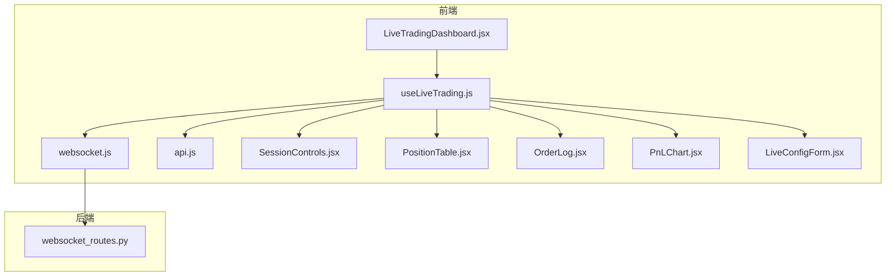
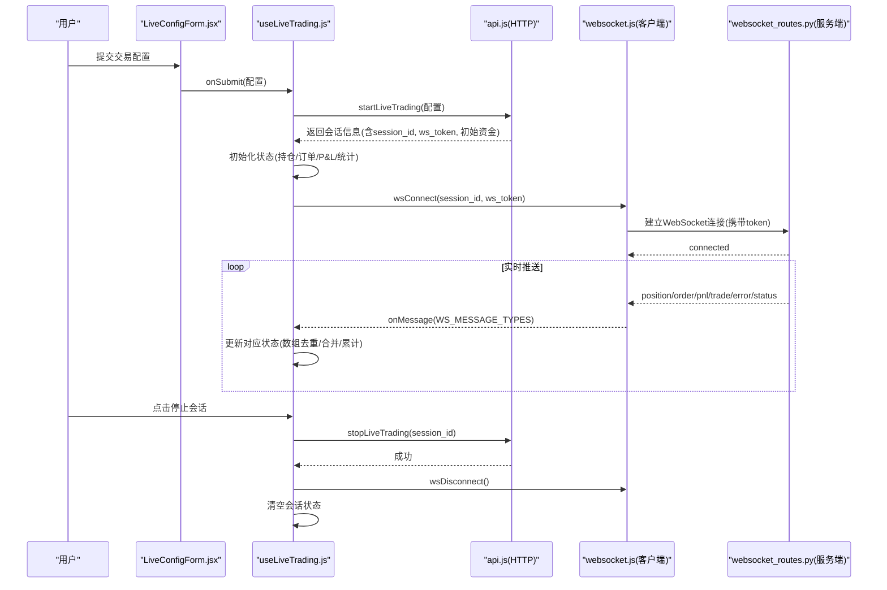
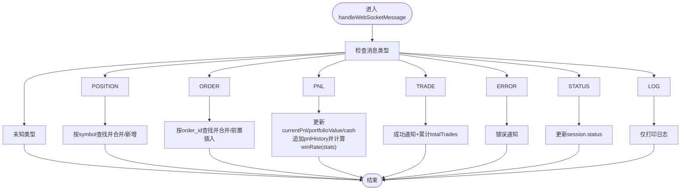
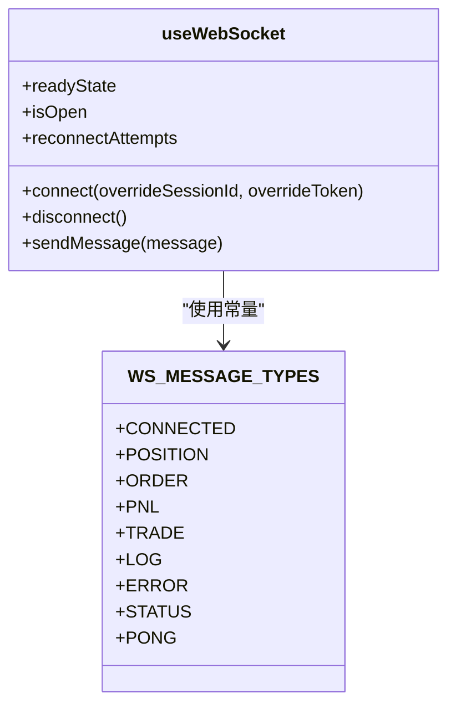
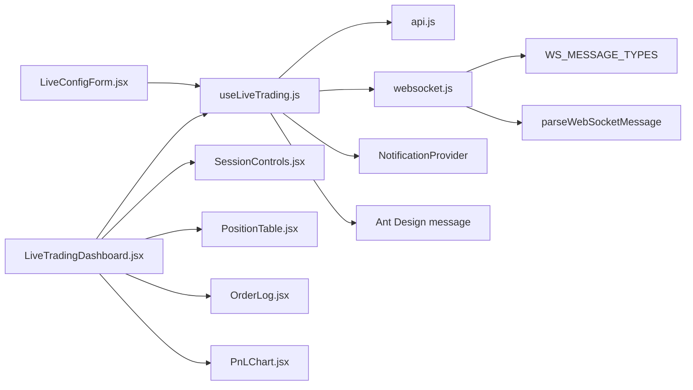

# 交易状态管理

<cite>
**本文引用的文件**
- [useLiveTrading.js](file://frontend/src/hooks/useLiveTrading.js)
- [websocket.js](file://frontend/src/services/websocket.js)
- [api.js](file://frontend/src/services/api.js)
- [LiveTradingDashboard.jsx](file://frontend/src/pages/LiveTradingDashboard.jsx)
- [SessionControls.jsx](file://frontend/src/components/LiveTrading/SessionControls.jsx)
- [PositionTable.jsx](file://frontend/src/components/LiveTrading/PositionTable.jsx)
- [OrderLog.jsx](file://frontend/src/components/LiveTrading/OrderLog.jsx)
- [PnLChart.jsx](file://frontend/src/components/LiveTrading/PnLChart.jsx)
- [LiveConfigForm.jsx](file://frontend/src/components/LiveTrading/LiveConfigForm.jsx)
- [websocket_routes.py](file://backend/src/routes/websocket_routes.py)
</cite>

## 目录
1. [引言](#引言)
2. [项目结构](#项目结构)
3. [核心组件](#核心组件)
4. [架构总览](#架构总览)
5. [详细组件分析](#详细组件分析)
6. [依赖关系分析](#依赖关系分析)
7. [性能考量](#性能考量)
8. [故障排查指南](#故障排查指南)
9. [结论](#结论)
10. [附录](#附录)

## 引言
本文件围绕前端自定义Hook useLiveTrading.js，系统性解析其如何集中管理实盘交易的完整状态生命周期：包括会话状态、持仓、订单、P&L历史、投资组合价值等复杂状态；通过useState进行状态管理，通过useCallback优化事件处理函数；handleStartSession与handleStopSession如何与后端API交互并协调WebSocket连接；handleWebSocketMessage如何根据不同的WS_MESSAGE_TYPES（POSITION、ORDER、PNL、TRADE、ERROR等）更新相应状态，实现毫秒级实时数据同步；以及useEffect在组件挂载时自动加载活跃会话的机制。文档同时结合实际交易场景，说明如何在保持状态一致性的同时，提供流畅的用户体验与可靠的错误处理。

## 项目结构
本项目采用前后端分离架构，前端使用React + Ant Design，后端基于Python（FastAPI），WebSocket用于实时推送交易数据。useLiveTrading.js位于前端hooks目录，负责统一管理实盘交易的状态与交互；websocket.js为通用WebSocket客户端Hook；api.js封装HTTP API调用；页面LiveTradingDashboard.jsx消费useLiveTrading的状态并渲染多个子组件（如SessionControls、PositionTable、OrderLog、PnLChart等）。

图表来源
- [useLiveTrading.js](file://frontend/src/hooks/useLiveTrading.js#L1-L276)
- [websocket.js](file://frontend/src/services/websocket.js#L1-L287)
- [api.js](file://frontend/src/services/api.js#L200-L250)
- [LiveTradingDashboard.jsx](file://frontend/src/pages/LiveTradingDashboard.jsx#L1-L173)
- [SessionControls.jsx](file://frontend/src/components/LiveTrading/SessionControls.jsx#L1-L93)
- [PositionTable.jsx](file://frontend/src/components/LiveTrading/PositionTable.jsx#L1-L99)
- [OrderLog.jsx](file://frontend/src/components/LiveTrading/OrderLog.jsx#L1-L139)
- [PnLChart.jsx](file://frontend/src/components/LiveTrading/PnLChart.jsx#L1-L113)
- [LiveConfigForm.jsx](file://frontend/src/components/LiveTrading/LiveConfigForm.jsx#L1-L241)
- [websocket_routes.py](file://backend/src/routes/websocket_routes.py#L114-L242)

章节来源
- [useLiveTrading.js](file://frontend/src/hooks/useLiveTrading.js#L1-L276)
- [websocket.js](file://frontend/src/services/websocket.js#L1-L287)
- [api.js](file://frontend/src/services/api.js#L200-L250)
- [LiveTradingDashboard.jsx](file://frontend/src/pages/LiveTradingDashboard.jsx#L1-L173)

## 核心组件
- useLiveTrading.js：集中管理实盘交易状态与生命周期，包含会话状态、交易数据、统计指标、WebSocket消息处理、会话启动/停止/刷新逻辑，以及挂载时自动加载活跃会话。
- websocket.js：通用WebSocket客户端Hook，支持心跳保活、重连控制、手动连接/断开、消息解析与回调分发。
- api.js：封装后端HTTP接口，包括启动/停止会话、查询会话状态、列出活跃会话、获取会话订单等。
- LiveTradingDashboard.jsx：仪表盘页面，消费useLiveTrading返回的状态并渲染统计卡片、图表与表格。
- 子组件：SessionControls、PositionTable、OrderLog、PnLChart、LiveConfigForm，分别负责会话控制、持仓展示、订单日志、收益曲线与配置表单。

章节来源
- [useLiveTrading.js](file://frontend/src/hooks/useLiveTrading.js#L1-L276)
- [websocket.js](file://frontend/src/services/websocket.js#L1-L287)
- [api.js](file://frontend/src/services/api.js#L200-L250)
- [LiveTradingDashboard.jsx](file://frontend/src/pages/LiveTradingDashboard.jsx#L1-L173)

## 架构总览
下图展示了从用户操作到后端实时推送的整体流程：用户在LiveConfigForm中提交配置，调用api.startLiveTrading创建会话；随后useLiveTrading在成功后手动建立WebSocket连接；后端websocket_routes.py校验ws_token并建立连接；后端通过WebSocket向前端推送position/order/pnl/trade/error/status等消息；前端useLiveTrading根据WS_MESSAGE_TYPES更新对应状态，驱动UI即时刷新。

图表来源
- [useLiveTrading.js](file://frontend/src/hooks/useLiveTrading.js#L140-L205)
- [websocket.js](file://frontend/src/services/websocket.js#L99-L225)
- [api.js](file://frontend/src/services/api.js#L200-L250)
- [websocket_routes.py](file://backend/src/routes/websocket_routes.py#L152-L219)

## 详细组件分析

### useLiveTrading.js：状态生命周期与事件处理
- 状态管理
  - 会话状态：session、loading
  - 交易数据：positions、orders、pnlHistory、currentPnl、portfolioValue、cash
  - 统计指标：stats（totalTrades、winningTrades、losingTrades、winRate）
- 事件处理优化
  - handleWebSocketMessage使用useCallback包裹，避免每次渲染重新创建回调，减少子组件不必要的重渲染。
  - websocket.js中的useWebSocket也使用useCallback封装connect/disconnect/sendMessage等方法，确保稳定引用。
- WebSocket消息分发
  - POSITION：按symbol查找并合并更新，不存在则新增，保证列表唯一性与实时性。
  - ORDER：按order_id查找并合并更新，不存在则插入到头部，形成“新单优先”的展示顺序。
  - PNL：更新currentPnl、portfolioValue、cash，并追加一条时间戳+当前P&L的历史记录；当收到total_trades等统计字段时，计算winRate并更新stats。
  - TRADE：弹出成功通知与顶部横幅提示，同时累计totalTrades。
  - ERROR：弹出错误通知与横幅提示，便于用户感知异常。
  - STATUS：仅在存在status字段时更新session.status，避免覆盖其他字段。
  - LOG：仅打印日志，不触发UI抖动。
- 会话生命周期
  - handleStartSession：调用api.startLiveTrading创建会话，初始化初始资金与P&L历史，清空持仓与订单，设置stats为零；随后延时手动连接WebSocket（传入ws_token进行鉴权）。
  - handleStopSession：调用api.stopLiveTrading停止会话，断开WebSocket，延时清空session，避免UI闪烁。
  - handleRefreshSession：拉取最新会话状态与订单列表，保持UI与后端一致。
  - loadActiveSessions：组件挂载时自动加载活跃会话，若会话处于running且有ws_token，则延时连接WebSocket。
- 错误处理
  - 所有异步操作均包裹try/catch，失败时通过message与通知横幅提示用户，并在finally中恢复loading状态。
  - websocket.js对onError进行抑制式处理，避免频繁错误消息刷屏，同时保留console输出便于调试。

图表来源
- [useLiveTrading.js](file://frontend/src/hooks/useLiveTrading.js#L28-L121)

章节来源
- [useLiveTrading.js](file://frontend/src/hooks/useLiveTrading.js#L1-L276)

### websocket.js：WebSocket客户端Hook
- 连接与URL生成
  - 支持开发环境与生产环境自动选择主机与协议（ws/wss），并将ws_token作为查询参数传递给后端。
  - connect方法可覆盖sessionId与token，便于动态切换或重连。
- 心跳与保活
  - 定期发送ping消息，后端返回pong确认；心跳间隔可配置。
- 自动重连
  - 可配置最大重连次数与间隔，断线后按指数退避策略尝试重连；disconnect时关闭心跳与定时器。
- 生命周期
  - autoConnect默认开启时，会在挂载时自动连接；否则由上层Hook手动控制连接时机。
  - 卸载时自动清理连接与定时器，防止内存泄漏。

图表来源
- [websocket.js](file://frontend/src/services/websocket.js#L26-L287)

章节来源
- [websocket.js](file://frontend/src/services/websocket.js#L1-L287)

### api.js：后端HTTP接口封装
- 启动会话：POST /live/start
- 停止会话：POST /live/stop
- 查询会话状态：GET /live/status/{session_id}
- 列出活跃会话：GET /live/sessions?active_only=true
- 获取会话订单：GET /live/orders/{session_id}
- 获取交易所列表：GET /live/exchanges

章节来源
- [api.js](file://frontend/src/services/api.js#L200-L250)

### LiveTradingDashboard.jsx：状态消费与UI渲染
- 当无活跃会话时显示LiveConfigForm，用户提交后调用handleStartSession。
- 当有活跃会话时显示：
  - SessionControls：显示会话状态、ID、开始/停止/刷新按钮，连接状态徽章。
  - 统计卡片：投资组合价值、现金余额、未实现盈亏、总交易数与胜率。
  - PnLChart：基于pnlHistory绘制收益曲线，随currentPnl动态变色。
  - PositionTable：展示持仓明细（符号、方向、数量、均价、现价、未实现P&L、百分比）。
  - OrderLog：展示订单历史（时间、符号、方向、类型、数量、价格、成交、状态、手续费）。

章节来源
- [LiveTradingDashboard.jsx](file://frontend/src/pages/LiveTradingDashboard.jsx#L1-L173)

### 子组件职责
- SessionControls.jsx：根据会话状态渲染颜色与文本，提供开始/停止/刷新按钮与防重复点击。
- PositionTable.jsx：列渲染持仓详情，支持P&L百分比计算与正负颜色。
- OrderLog.jsx：列渲染订单详情，按状态映射颜色与图标，支持分页与滚动。
- PnLChart.jsx：轻量级图表库绘制收益曲线，随数据变化更新线条与颜色。
- LiveConfigForm.jsx：资产类别切换、策略选择、交易所选择、模式选择、时间框架、初始资金与手续费配置。

章节来源
- [SessionControls.jsx](file://frontend/src/components/LiveTrading/SessionControls.jsx#L1-L93)
- [PositionTable.jsx](file://frontend/src/components/LiveTrading/PositionTable.jsx#L1-L99)
- [OrderLog.jsx](file://frontend/src/components/LiveTrading/OrderLog.jsx#L1-L139)
- [PnLChart.jsx](file://frontend/src/components/LiveTrading/PnLChart.jsx#L1-L113)
- [LiveConfigForm.jsx](file://frontend/src/components/LiveTrading/LiveConfigForm.jsx#L1-L241)

## 依赖关系分析
- useLiveTrading.js依赖：
  - api.js：发起HTTP请求，管理会话生命周期与订单列表。
  - websocket.js：管理WebSocket连接、心跳与消息分发。
  - NotificationProvider：顶部横幅通知。
  - Ant Design message：消息提示。
- websocket.js依赖：
  - WS_MESSAGE_TYPES：消息类型常量。
  - parseWebSocketMessage：消息解析工具。
- 页面与组件：
  - LiveTradingDashboard.jsx消费useLiveTrading返回的状态与方法。
  - 子组件各自消费useLiveTrading提供的数据并渲染。

图表来源
- [useLiveTrading.js](file://frontend/src/hooks/useLiveTrading.js#L1-L276)
- [websocket.js](file://frontend/src/services/websocket.js#L1-L287)
- [api.js](file://frontend/src/services/api.js#L200-L250)
- [LiveTradingDashboard.jsx](file://frontend/src/pages/LiveTradingDashboard.jsx#L1-L173)
- [SessionControls.jsx](file://frontend/src/components/LiveTrading/SessionControls.jsx#L1-L93)
- [PositionTable.jsx](file://frontend/src/components/LiveTrading/PositionTable.jsx#L1-L99)
- [OrderLog.jsx](file://frontend/src/components/LiveTrading/OrderLog.jsx#L1-L139)
- [PnLChart.jsx](file://frontend/src/components/LiveTrading/PnLChart.jsx#L1-L113)
- [LiveConfigForm.jsx](file://frontend/src/components/LiveTrading/LiveConfigForm.jsx#L1-L241)

章节来源
- [useLiveTrading.js](file://frontend/src/hooks/useLiveTrading.js#L1-L276)
- [websocket.js](file://frontend/src/services/websocket.js#L1-L287)
- [api.js](file://frontend/src/services/api.js#L200-L250)
- [LiveTradingDashboard.jsx](file://frontend/src/pages/LiveTradingDashboard.jsx#L1-L173)

## 性能考量
- 状态更新策略
  - 使用useState管理数组类状态（positions、orders、pnlHistory），在消息处理中采用“查找+合并/新增/前置插入”的方式，避免全量替换，降低渲染成本。
  - 对于stats中的winRate，仅在收到total_trades等统计字段时计算，避免每条消息都进行昂贵计算。
- 回调优化
  - handleWebSocketMessage与websocket.js中的connect/disconnect/heartbeat等均使用useCallback，确保引用稳定，减少子组件重渲染。
- WebSocket连接策略
  - autoConnect=false，由useLiveTrading在会话创建成功后再手动连接，避免无意义的自动重连循环。
  - 心跳间隔与重连次数可配置，兼顾稳定性与资源消耗。
- UI渲染优化
  - PnLChart仅在pnlHistory或currentPnl变化时更新数据，且对时间轴进行排序，避免图表抖动。
  - 订单与持仓表格使用rowKey与分页，限制渲染范围。

[本节为通用性能建议，无需特定文件引用]

## 故障排查指南
- WebSocket无法连接
  - 检查会话是否处于running状态且ws_token是否存在；确认URL协议（ws/wss）与主机地址正确。
  - 查看console输出的连接日志与错误信息；确认后端websocket_routes.py已校验token并允许连接。
- 数据不同步
  - 确认handleWebSocketMessage已正确接收并更新对应状态；检查POSITION与ORDER的去重逻辑是否生效。
  - 若出现PNL不更新，确认后端是否按约定推送PNL消息及字段完整性。
- 会话停止后仍显示数据
  - 确认handleStopSession已调用wsDisconnect并延时清空session；检查UI是否在3秒后才隐藏。
- 通知过多或过少
  - TRADE与ERROR消息通过message与通知横幅提示；若被抑制，可在开发环境下查看console日志定位问题。

章节来源
- [useLiveTrading.js](file://frontend/src/hooks/useLiveTrading.js#L140-L205)
- [websocket.js](file://frontend/src/services/websocket.js#L99-L225)
- [websocket_routes.py](file://backend/src/routes/websocket_routes.py#L152-L219)

## 结论
useLiveTrading.js通过集中化状态管理与事件处理，实现了实盘交易从会话创建、WebSocket连接、实时数据同步到状态清理的完整生命周期闭环。配合websocket.js的心跳与重连机制、api.js的HTTP接口封装，以及Dashboard与各子组件的高效渲染，系统在保持状态一致性的同时，提供了流畅的用户体验与可靠的错误处理能力。对于高频更新的交易数据，采用useCallback优化回调、数组去重与增量更新策略，有效降低了渲染与计算开销。

[本节为总结性内容，无需特定文件引用]

## 附录
- 后端WebSocket消息类型与鉴权
  - 后端websocket_routes.py定义了connected、position、order、pnl、trade、log、error、status等消息类型，并要求ws_token匹配会话；支持ping/pong保活。
- 前端消息类型常量
  - WS_MESSAGE_TYPES在websocket.js中定义，与后端消息类型一一对应，确保消息分发准确。

章节来源
- [websocket_routes.py](file://backend/src/routes/websocket_routes.py#L114-L242)
- [websocket.js](file://frontend/src/services/websocket.js#L271-L286)