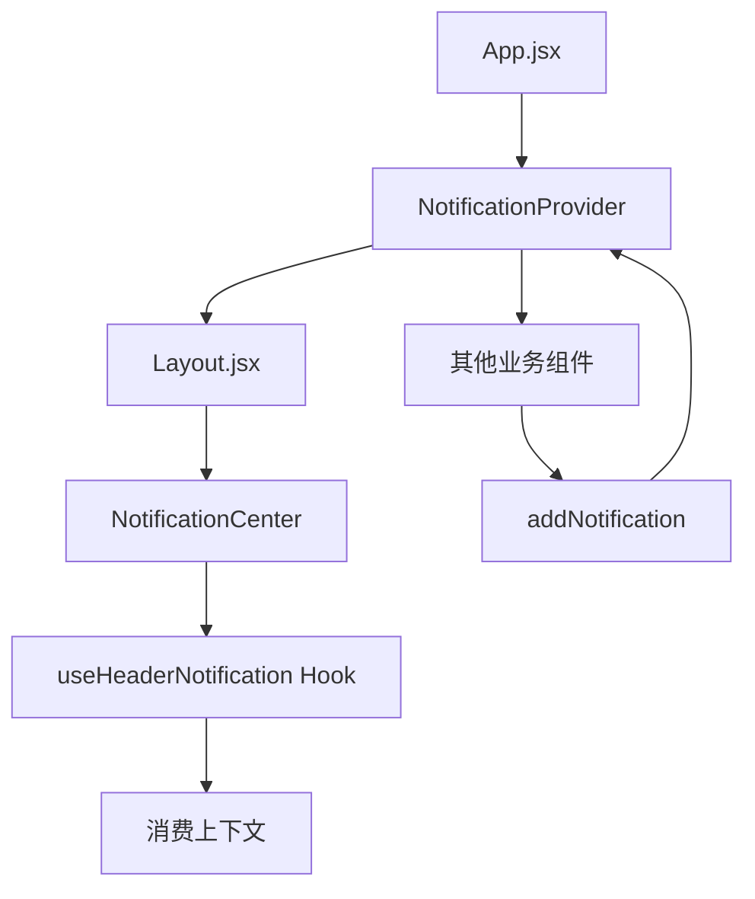
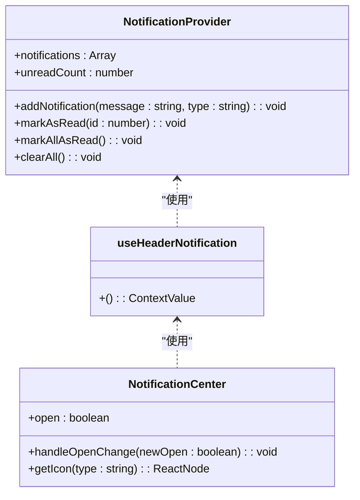
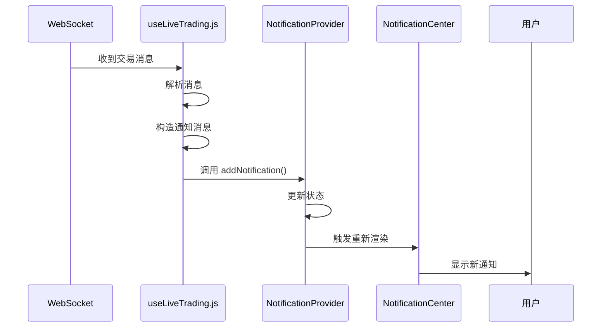

# 全局通知系统

<cite>
**本文档引用的文件**  
- [NotificationProvider.jsx](file://frontend\src\providers\NotificationProvider.jsx)
- [useLiveTrading.js](file://frontend\src\hooks\useLiveTrading.js)
- [NotificationCenter.jsx](file://frontend\src\components\Layout\NotificationCenter.jsx)
- [Layout.jsx](file://frontend\src\components\Layout\Layout.jsx)
- [App.jsx](file://frontend\src\App.jsx)
</cite>

## 目录
1. [系统概述](#系统概述)
2. [核心实现机制](#核心实现机制)
3. [通知上下文与提供者](#通知上下文与提供者)
4. [核心方法实现逻辑](#核心方法实现逻辑)
5. [通知消费与UI展示](#通知消费与ui展示)
6. [实际业务场景应用](#实际业务场景应用)
7. [扩展与最佳实践](#扩展与最佳实践)

## 系统概述

全局通知系统是基于React Context API构建的应用级状态管理解决方案，为整个交易系统提供统一的用户通知机制。该系统通过`NotificationProvider`组件在应用顶层注入上下文，使得任何嵌套层级的组件都能安全地发布和订阅通知。系统支持多种通知类型（成功、错误、警告、信息），并提供未读计数、批量标记已读、清除所有通知等交互功能。通知中心UI集成在页面头部布局中，通过气泡弹出层展示通知列表，确保用户能够及时获取交易执行、系统状态变更等关键信息。

**系统来源**
- [App.jsx](file://frontend\src\App.jsx#L55-L56)
- [Layout.jsx](file://frontend\src\components\Layout\Layout.jsx#L102)

## 核心实现机制

全局通知系统的核心是React Context API，它解决了跨组件层级传递状态的难题。`NotificationContext`被创建为一个null初始值的上下文对象，`NotificationProvider`作为其提供者组件，使用`useState`管理两个核心状态：`notifications`（通知列表）和`unreadCount`（未读通知计数）。这种设计将状态逻辑集中管理，避免了在多个组件中重复定义状态和逻辑。`useCallback`被广泛用于包装所有状态更新函数，确保这些函数的引用在组件重新渲染时保持稳定，防止不必要的子组件重新渲染，从而优化了性能。

**图示来源**
- [NotificationProvider.jsx](file://frontend\src\providers\NotificationProvider.jsx#L5-L51)
- [App.jsx](file://frontend\src\App.jsx#L55)

## 通知上下文与提供者

`NotificationProvider`是整个通知系统的基石。它在`frontend/src/providers/NotificationProvider.jsx`文件中定义，通过`createContext`创建`NotificationContext`。该组件接收`children`作为其子元素，并在其内部使用`useState`初始化`notifications`为空数组，`unreadCount`为0。`NotificationProvider`通过`NotificationContext.Provider`的`value`属性，将包含所有通知状态和操作方法的对象提供给其子树中的所有组件。在`App.jsx`中，`NotificationProvider`被包裹在`ConfigProvider`和路由组件之外，确保了整个应用都能访问到这个上下文。

**代码来源**
- [NotificationProvider.jsx](file://frontend\src\providers\NotificationProvider.jsx#L5-L49)
- [App.jsx](file://frontend\src\App.jsx#L55)

## 核心方法实现逻辑

### addNotification
`addNotification`方法用于添加新通知。它接收`message`（消息内容）和可选的`type`（通知类型，默认为'info'）作为参数。方法内部创建一个包含唯一`id`（使用`Date.now()`生成）、消息、类型、时间戳和`read`状态（初始为`false`）的新通知对象。通过函数式更新`setNotifications(prev => [newNotification, ...prev])`将其添加到列表开头，并通过`setUnreadCount(prev => prev + 1)`递增未读计数。使用`useCallback`包裹并传入空依赖数组`[]`，确保函数引用不变。

### markAsRead
`markAsRead`方法用于将指定ID的通知标记为已读。它接收`id`作为参数，使用`map`遍历通知列表，找到ID匹配的通知并将其`read`属性更新为`true`。同时，通过`setUnreadCount(prev => Math.max(0, prev - 1))`安全地递减未读计数，`Math.max`确保计数不会为负。

### markAllAsRead
`markAllAsRead`方法将所有通知标记为已读。它遍历整个通知列表，将每个通知的`read`属性设为`true`，并将`unreadCount`直接设为0。

### clearAll
`clearAll`方法用于清空所有通知。它直接将`notifications`状态重置为空数组，并将`unreadCount`设为0。

所有这些方法都使用`useCallback`进行优化，这对于性能至关重要，因为`NotificationCenter`等消费组件可能会因这些函数引用变化而频繁重新渲染。

**代码来源**
- [NotificationProvider.jsx](file://frontend\src\providers\NotificationProvider.jsx#L9-L37)

## 通知消费与UI展示

`useHeaderNotification`是一个自定义Hook，用于安全地消费`NotificationContext`。它在`NotificationProvider.jsx`文件中定义，内部调用`useContext(NotificationContext)`获取上下文值。为了防止在`Provider`之外使用此Hook，它包含一个运行时检查：如果`context`为`null`，则抛出一个错误，提示开发者必须在`NotificationProvider`内使用该Hook。

`NotificationCenter`组件负责UI展示，位于`frontend/src/components/Layout/NotificationCenter.jsx`。它通过`useHeaderNotification`获取`notifications`、`unreadCount`以及`markAllAsRead`、`clearAll`、`markAsRead`等方法。UI使用Ant Design的`Popover`（气泡弹出层）实现，点击右上角的铃铛图标时展开。通知列表使用`List`组件渲染，每条通知的样式根据其`read`状态和`type`动态变化。未读通知有特殊的背景色，不同类型的`type`对应不同的图标颜色。用户可以点击通知本身来标记为已读，或使用顶部按钮批量标记已读和清除所有通知。

**图示来源**
- [NotificationProvider.jsx](file://frontend\src\providers\NotificationProvider.jsx#L53-L59)
- [NotificationCenter.jsx](file://frontend\src\components\Layout\NotificationCenter.jsx#L18-L24)

## 实际业务场景应用

`useLiveTrading.js`是通知系统在业务逻辑中的典型应用。该Hook通过`useHeaderNotification`获取`addNotification`方法，并在WebSocket消息处理函数`handleWebSocketMessage`中调用它。例如，当收到`WS_MESSAGE_TYPES.TRADE`类型的消息时，系统会解析交易详情，生成一条如"Bought 1 BTC/USDT @ $45000"的消息，并以`'success'`类型调用`addNotification`，向用户通知交易成功。同样，当收到`WS_MESSAGE_TYPES.ERROR`消息时，会以`'error'`类型发送错误通知。在交易会话的启动和停止操作中，`handleStartSession`和`handleStopSession`等异步函数也会在`try-catch`块中调用`addNotification`，在操作成功或失败时向用户反馈结果。

**图示来源**
- [useLiveTrading.js](file://frontend\src\hooks\useLiveTrading.js#L96)
- [useLiveTrading.js](file://frontend\src\hooks\useLiveTrading.js#L109)
- [useLiveTrading.js](file://frontend\src\hooks\useLiveTrading.js#L163)

## 扩展与最佳实践

该通知系统具有良好的扩展性。可以在`addNotification`方法中增加更多字段，如`duration`（自动消失时间）、`onClick`（点击回调）或`link`（关联链接），以支持更复杂的交互。通知类型也可以扩展，例如增加`'warning'`或`'info'`，并在`getIcon`函数中添加相应的图标。

在其他业务场景中复用该系统非常简单。例如，在策略保存功能中，可以在`saveStrategy`函数成功后调用`addNotification('策略保存成功', 'success')`；在回测完成时，后端可以通过WebSocket发送`'success'`类型的消息，前端自动显示“回测完成”的通知。

关于持久化，当前通知是内存中的，页面刷新后会丢失。若需持久化，可以结合`localStorage`或`sessionStorage`，在`addNotification`时将通知存入存储，并在`NotificationProvider`初始化时从存储中恢复。但需注意清理过期通知，避免存储无限增长。

**代码来源**
- [useLiveTrading.js](file://frontend\src\hooks\useLiveTrading.js#L9-L12)
- [StrategyMaintain.jsx](file://frontend\src\pages\StrategyMaintain.jsx#L95)