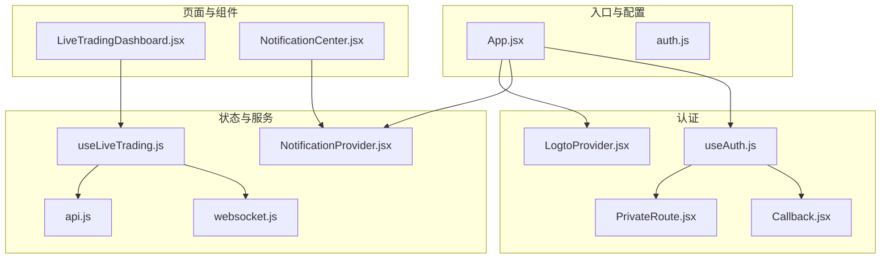
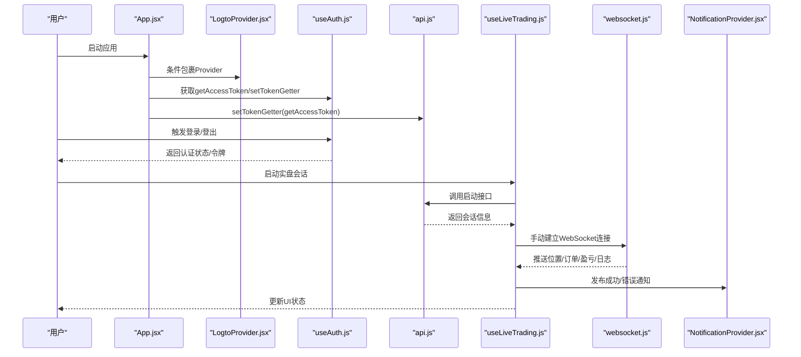
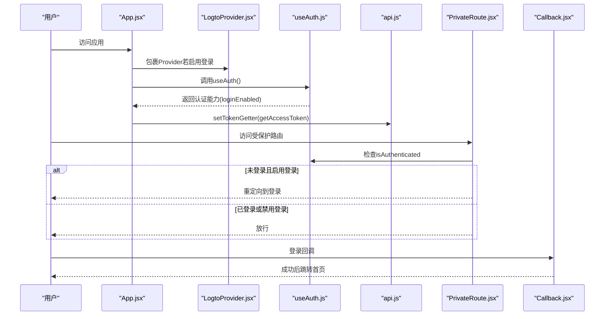
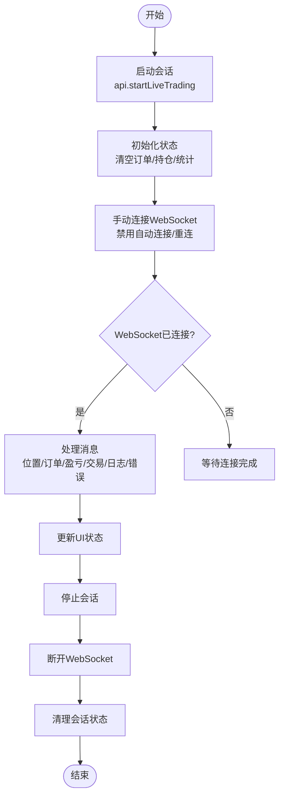
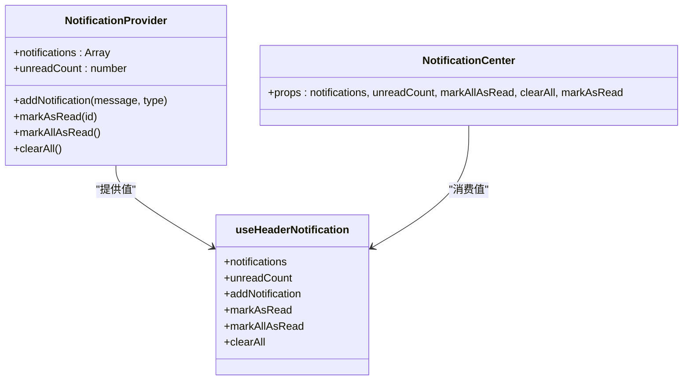
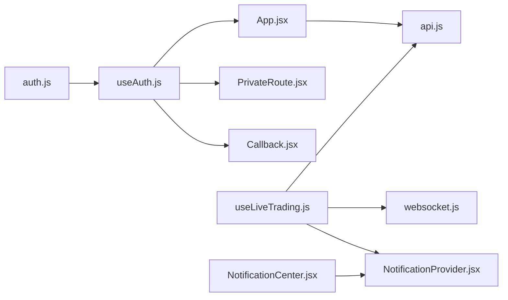

# 状态管理与Hooks

<cite>
**本文引用的文件**
- [useAuth.js](file://frontend/src/hooks/useAuth.js)
- [LogtoProvider.jsx](file://frontend/src/providers/LogtoProvider.jsx)
- [auth.js](file://frontend/src/config/auth.js)
- [App.jsx](file://frontend/src/App.jsx)
- [api.js](file://frontend/src/services/api.js)
- [websocket.js](file://frontend/src/services/websocket.js)
- [useLiveTrading.js](file://frontend/src/hooks/useLiveTrading.js)
- [LiveTradingDashboard.jsx](file://frontend/src/pages/LiveTradingDashboard.jsx)
- [NotificationProvider.jsx](file://frontend/src/providers/NotificationProvider.jsx)
- [NotificationCenter.jsx](file://frontend/src/components/Layout/NotificationCenter.jsx)
- [PrivateRoute.jsx](file://frontend/src/components/Auth/PrivateRoute.jsx)
- [Callback.jsx](file://frontend/src/pages/Callback.jsx)
</cite>

## 目录
1. [引言](#引言)
2. [项目结构](#项目结构)
3. [核心组件](#核心组件)
4. [架构总览](#架构总览)
5. [详细组件分析](#详细组件分析)
6. [依赖关系分析](#依赖关系分析)
7. [性能考量](#性能考量)
8. [故障排查指南](#故障排查指南)
9. [结论](#结论)
10. [附录：创建新自定义Hook的指导原则](#附录创建新自定义hook的指导原则)

## 引言
本文件系统性梳理前端应用的状态管理方案与自定义Hooks设计，重点解析以下三个方面：
- 使用 LogtoProvider 与 useAuth.js 实现 JWT 认证状态的统一管理，覆盖登录、登出、令牌刷新与权限校验逻辑。
- 使用 useLiveTrading.js 封装实盘交易相关状态（会话、订单、持仓、盈亏等）与业务流程，实现跨组件共享。
- 基于 React Context 的 NotificationProvider 实现全局通知系统的发布-订阅模式。

同时，结合 React Hooks 最佳实践，说明 useEffect、useCallback、useMemo 在性能优化中的应用，并给出创建新自定义 Hook 的指导原则，以提升状态逻辑的可复用性、可测试性与组件解耦。

## 项目结构
前端采用“按功能域分层”的组织方式：
- hooks：封装可复用的状态逻辑与副作用（如认证、实盘交易、通知）
- providers：提供上下文与全局能力（认证Provider、通知Provider）
- services：封装网络请求与WebSocket客户端
- pages/components：页面与UI组件，消费Hooks与Provider提供的状态与能力
- config：环境变量与配置开关（如登录开关）

图表来源
- [App.jsx](file://frontend/src/App.jsx#L1-L121)
- [LogtoProvider.jsx](file://frontend/src/providers/LogtoProvider.jsx#L1-L34)
- [useAuth.js](file://frontend/src/hooks/useAuth.js#L1-L30)
- [PrivateRoute.jsx](file://frontend/src/components/Auth/PrivateRoute.jsx#L1-L31)
- [Callback.jsx](file://frontend/src/pages/Callback.jsx#L1-L43)
- [NotificationProvider.jsx](file://frontend/src/providers/NotificationProvider.jsx#L1-L59)
- [api.js](file://frontend/src/services/api.js#L1-L403)
- [websocket.js](file://frontend/src/services/websocket.js#L1-L287)
- [useLiveTrading.js](file://frontend/src/hooks/useLiveTrading.js#L1-L277)
- [LiveTradingDashboard.jsx](file://frontend/src/pages/LiveTradingDashboard.jsx#L1-L173)
- [NotificationCenter.jsx](file://frontend/src/components/Layout/NotificationCenter.jsx#L1-L125)

章节来源
- [App.jsx](file://frontend/src/App.jsx#L1-L121)
- [auth.js](file://frontend/src/config/auth.js#L1-L4)

## 核心组件
- useAuth.js：统一认证Hook，支持受保护与匿名两种模式；在受保护模式下透传 Logto 能力，在匿名模式下返回无操作的占位对象。
- LogtoProvider.jsx：封装 Logto Provider 配置，注入端点、应用ID与资源，负责OAuth流程与令牌管理。
- NotificationProvider.jsx：基于 Context 的通知中心，提供发布-订阅能力（新增、标记已读、清空等）。
- useLiveTrading.js：封装实盘交易状态与业务流程，包括会话生命周期、订单/持仓更新、盈亏统计、WebSocket消息处理与错误通知。
- api.js：统一构建带令牌的请求与响应解析，包含401重定向逻辑。
- websocket.js：通用WebSocket Hook，支持心跳、重连策略、手动连接/断开与消息解析常量。

章节来源
- [useAuth.js](file://frontend/src/hooks/useAuth.js#L1-L30)
- [LogtoProvider.jsx](file://frontend/src/providers/LogtoProvider.jsx#L1-L34)
- [NotificationProvider.jsx](file://frontend/src/providers/NotificationProvider.jsx#L1-L59)
- [useLiveTrading.js](file://frontend/src/hooks/useLiveTrading.js#L1-L277)
- [api.js](file://frontend/src/services/api.js#L1-L403)
- [websocket.js](file://frontend/src/services/websocket.js#L1-L287)

## 架构总览
整体认证与状态流如下：
- 应用启动时根据登录开关决定是否包裹 LogtoProvider。
- AppContent 初始化后，将 getAccessToken 注入到 api.js，使后续请求自动携带令牌。
- useAuth 统一对外暴露登录/登出、令牌获取、用户声明等能力。
- useLiveTrading 通过 api.js 与 websocket.js 协作，驱动实盘交易数据的实时更新。
- NotificationProvider 为全局通知提供上下文，组件通过 useHeaderNotification 订阅发布。

图表来源
- [App.jsx](file://frontend/src/App.jsx#L1-L121)
- [LogtoProvider.jsx](file://frontend/src/providers/LogtoProvider.jsx#L1-L34)
- [useAuth.js](file://frontend/src/hooks/useAuth.js#L1-L30)
- [api.js](file://frontend/src/services/api.js#L1-L403)
- [useLiveTrading.js](file://frontend/src/hooks/useLiveTrading.js#L1-L277)
- [websocket.js](file://frontend/src/services/websocket.js#L1-L287)
- [NotificationProvider.jsx](file://frontend/src/providers/NotificationProvider.jsx#L1-L59)

## 详细组件分析

### 认证与权限：LogtoProvider 与 useAuth
- 登录开关控制：通过环境变量与 auth.js 的 LOGIN_ENABLED 决定是否启用登录。
- Provider 配置：LogtoProvider 从环境变量读取端点、应用ID与资源，缺失时输出错误日志。
- useAuth 统一出口：当登录关闭时，返回匿名模式的占位对象；开启时透传 Logto 能力并附加 loginEnabled 标记。
- App 初始化：AppContent 中在登录开启时设置 api.js 的令牌获取器，使后续请求自动携带令牌；parseResponse 对401进行重定向处理。
- 权限路由：PrivateRoute 基于 useAuth 的 isAuthenticated 判断是否放行，未登录且启用登录时重定向至登录页。
- 回调页：Callback 处理 OAuth 回调，成功后跳转首页，失败则记录错误并跳转登录页。

图表来源
- [App.jsx](file://frontend/src/App.jsx#L1-L121)
- [LogtoProvider.jsx](file://frontend/src/providers/LogtoProvider.jsx#L1-L34)
- [useAuth.js](file://frontend/src/hooks/useAuth.js#L1-L30)
- [api.js](file://frontend/src/services/api.js#L1-L403)
- [PrivateRoute.jsx](file://frontend/src/components/Auth/PrivateRoute.jsx#L1-L31)
- [Callback.jsx](file://frontend/src/pages/Callback.jsx#L1-L43)

章节来源
- [auth.js](file://frontend/src/config/auth.js#L1-L4)
- [LogtoProvider.jsx](file://frontend/src/providers/LogtoProvider.jsx#L1-L34)
- [useAuth.js](file://frontend/src/hooks/useAuth.js#L1-L30)
- [App.jsx](file://frontend/src/App.jsx#L1-L121)
- [PrivateRoute.jsx](file://frontend/src/components/Auth/PrivateRoute.jsx#L1-L31)
- [Callback.jsx](file://frontend/src/pages/Callback.jsx#L1-L43)
- [api.js](file://frontend/src/services/api.js#L1-L403)

### 实盘交易状态：useLiveTrading.js
- 状态划分：会话状态、加载状态、订单列表、持仓列表、盈亏历史、当前盈亏、组合价值、现金、交易统计。
- WebSocket 消息处理：通过 useWebSocket 返回的 connect/disconnect 与 onMessage 回调，按消息类型更新对应状态；对未知类型进行日志提示。
- 会话生命周期：
  - 启动会话：调用 api.startLiveTrading，初始化基础状态，随后手动连接WebSocket（禁用自动连接与自动重连，避免重复连接）。
  - 停止会话：调用 api.stopLiveTrading，断开WebSocket并延时清理会话状态。
  - 刷新状态：拉取会话状态与订单列表，用于恢复或同步界面。
  - 加载活动会话：应用挂载时自动加载最近活动会话，必要时自动连接WebSocket。
- 通知与错误处理：对关键事件（启动/停止/错误）通过 antd message 与 NotificationProvider 发布通知，避免UI刷屏。
- 性能要点：handleWebSocketMessage 使用 useCallback 保证消息处理器稳定，减少子组件重渲染；WebSocket Hook 提供心跳与可控重连策略。

图表来源
- [useLiveTrading.js](file://frontend/src/hooks/useLiveTrading.js#L1-L277)
- [websocket.js](file://frontend/src/services/websocket.js#L1-L287)
- [api.js](file://frontend/src/services/api.js#L1-L403)

章节来源
- [useLiveTrading.js](file://frontend/src/hooks/useLiveTrading.js#L1-L277)
- [websocket.js](file://frontend/src/services/websocket.js#L1-L287)
- [api.js](file://frontend/src/services/api.js#L1-L403)
- [LiveTradingDashboard.jsx](file://frontend/src/pages/LiveTradingDashboard.jsx#L1-L173)

### 全局通知系统：NotificationProvider
- Context 设计：NotificationContext 提供通知列表、未读数以及增删改查方法。
- 发布-订阅：组件通过 useHeaderNotification 订阅通知上下文，调用 addNotification 发布；支持标记已读、全部已读、清空。
- UI 展示：NotificationCenter 作为顶部导航栏的通知面板，展示列表、未读数与时间戳，点击单项标记已读。

图表来源
- [NotificationProvider.jsx](file://frontend/src/providers/NotificationProvider.jsx#L1-L59)
- [NotificationCenter.jsx](file://frontend/src/components/Layout/NotificationCenter.jsx#L1-L125)

章节来源
- [NotificationProvider.jsx](file://frontend/src/providers/NotificationProvider.jsx#L1-L59)
- [NotificationCenter.jsx](file://frontend/src/components/Layout/NotificationCenter.jsx#L1-L125)

## 依赖关系分析
- useAuth 依赖：
  - auth.js 的 LOGIN_ENABLED 控制登录模式
  - @logto/react 的 useLogto 能力
- App.jsx 依赖：
  - useAuth 提供令牌获取器
  - api.js 的 setTokenGetter 注入令牌
  - PrivateRoute 进行权限控制
- useLiveTrading 依赖：
  - api.js 的实盘接口
  - websocket.js 的 WebSocket 客户端
  - NotificationProvider 的通知能力
- NotificationProvider 依赖：
  - React Context 与 useState/useCallback
  - 任意组件通过 useHeaderNotification 订阅

图表来源
- [auth.js](file://frontend/src/config/auth.js#L1-L4)
- [useAuth.js](file://frontend/src/hooks/useAuth.js#L1-L30)
- [App.jsx](file://frontend/src/App.jsx#L1-L121)
- [api.js](file://frontend/src/services/api.js#L1-L403)
- [PrivateRoute.jsx](file://frontend/src/components/Auth/PrivateRoute.jsx#L1-L31)
- [Callback.jsx](file://frontend/src/pages/Callback.jsx#L1-L43)
- [useLiveTrading.js](file://frontend/src/hooks/useLiveTrading.js#L1-L277)
- [websocket.js](file://frontend/src/services/websocket.js#L1-L287)
- [NotificationProvider.jsx](file://frontend/src/providers/NotificationProvider.jsx#L1-L59)
- [NotificationCenter.jsx](file://frontend/src/components/Layout/NotificationCenter.jsx#L1-L125)

章节来源
- [useAuth.js](file://frontend/src/hooks/useAuth.js#L1-L30)
- [App.jsx](file://frontend/src/App.jsx#L1-L121)
- [useLiveTrading.js](file://frontend/src/hooks/useLiveTrading.js#L1-L277)
- [NotificationProvider.jsx](file://frontend/src/providers/NotificationProvider.jsx#L1-L59)

## 性能考量
- useCallback 的使用
  - useLiveTrading.js 中 handleWebSocketMessage 使用 useCallback，确保消息处理器在依赖不变时保持引用稳定，避免子组件不必要的重渲染。
  - NotificationProvider.jsx 中 addNotification/markAsRead/markAllAsRead/clearAll 均使用 useCallback，减少上下文值变化频率。
- useEffect 的使用
  - useLiveTrading.js 在组件挂载时仅执行一次加载活动会话的副作用，避免重复请求。
  - App.jsx 中在登录开启时设置令牌获取器，依赖 getAccessToken 与 loginEnabled，确保只在需要时注入。
- useMemo 的建议
  - 可在需要对复杂计算结果进行缓存的场景引入 useMemo（例如对订单/持仓进行聚合统计），但需注意依赖项与稳定性。
- 其他优化
  - WebSocket 禁用自动重连与自动连接，避免重复连接导致的抖动与资源浪费。
  - 401 错误由 api.js 统一处理并重定向，避免各处重复判断。

章节来源
- [useLiveTrading.js](file://frontend/src/hooks/useLiveTrading.js#L1-L277)
- [NotificationProvider.jsx](file://frontend/src/providers/NotificationProvider.jsx#L1-L59)
- [App.jsx](file://frontend/src/App.jsx#L1-L121)
- [api.js](file://frontend/src/services/api.js#L1-L403)

## 故障排查指南
- 登录相关
  - 现象：登录按钮不可用或无法跳转回调页
  - 排查：确认 env 中 VITE_LOGTO_ENDPOINT/VITE_LOGTO_APP_ID 是否正确；检查 PrivateRoute 是否生效；查看 Callback 页面错误分支的日志与跳转。
- 令牌与鉴权
  - 现象：接口返回401或被重定向到登录
  - 排查：确认 AppContent 是否已 setTokenGetter(getAccessToken)；检查 api.js 的 parseResponse 对401的处理；确认资源标识与端点一致。
- WebSocket 连接
  - 现象：连接失败或频繁重连
  - 排查：useLiveTrading.js 明确禁用自动连接与自动重连，需手动调用 connect；检查 getWebSocketUrl 的协议与主机；关注 onOpen/onError/onClose 日志。
- 通知不显示
  - 现象：通知未出现在顶部面板
  - 排查：确认 NotificationProvider 包裹范围；检查 useHeaderNotification 是否在 Provider 内部使用；核对 addNotification 的调用时机。

章节来源
- [Callback.jsx](file://frontend/src/pages/Callback.jsx#L1-L43)
- [App.jsx](file://frontend/src/App.jsx#L1-L121)
- [api.js](file://frontend/src/services/api.js#L1-L403)
- [useLiveTrading.js](file://frontend/src/hooks/useLiveTrading.js#L1-L277)
- [NotificationProvider.jsx](file://frontend/src/providers/NotificationProvider.jsx#L1-L59)

## 结论
本项目通过 Provider + 自定义 Hooks 的组合，实现了清晰的认证与状态管理：
- useAuth 与 LogtoProvider 将认证细节抽象为统一Hook，支持匿名与受保护两种模式。
- useLiveTrading 将复杂的实盘状态与业务流程封装为可复用Hook，配合 WebSocket 与 API 服务实现跨组件共享。
- NotificationProvider 基于 Context 提供全局通知能力，遵循发布-订阅模式，便于扩展与维护。
在性能方面，合理使用 useCallback/useEffect 等Hooks，有效降低了重渲染与资源浪费。建议在新增状态逻辑时遵循本文附录的指导原则，进一步提升可复用性与可测试性。

## 附录：创建新自定义Hook的指导原则
- 单一职责
  - 每个Hook聚焦一个明确的状态或业务领域，避免“大杂烩”式Hook。
- 依赖最小化
  - 明确Hook的外部依赖（如API、WebSocket、Context），尽量通过参数注入，便于测试与替换。
- 稳定的依赖数组
  - useEffect/useCallback/useMemo 的依赖数组要精确，避免遗漏或过度包含导致的性能问题或逻辑错误。
- 上下文与Provider分离
  - 将“状态”与“提供者”分离，Hook只负责状态逻辑，Provider负责上下文注入，便于在不同层级使用。
- 可测试性
  - 通过函数式设计与依赖注入，使Hook易于单元测试；对异步逻辑提供可模拟的依赖（如API、WebSocket）。
- 文档与命名
  - 为Hook提供清晰的注释与导出文档，命名语义化，便于团队协作与知识沉淀。
- 错误处理与边界条件
  - 明确错误传播路径，提供默认值与降级策略；对异常输入与边界条件进行健壮性处理。
- 性能优化
  - 合理使用 useCallback/useMemo/useRef，避免不必要的重渲染；对高频事件与长列表进行节流/防抖。