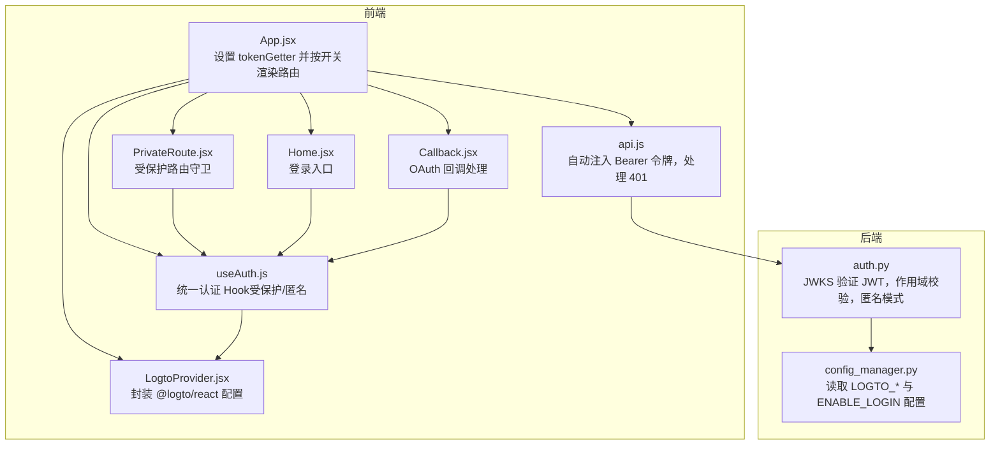
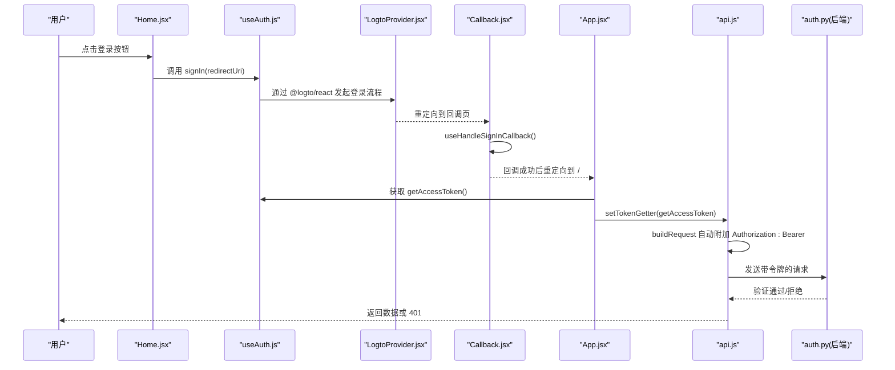
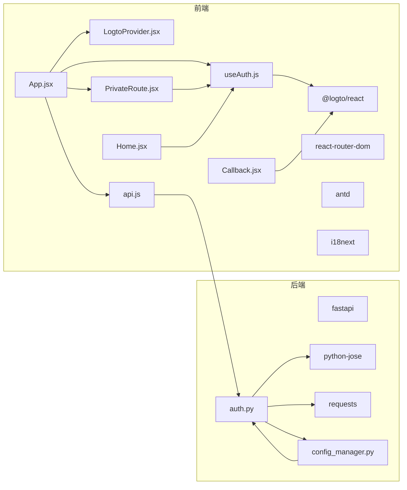
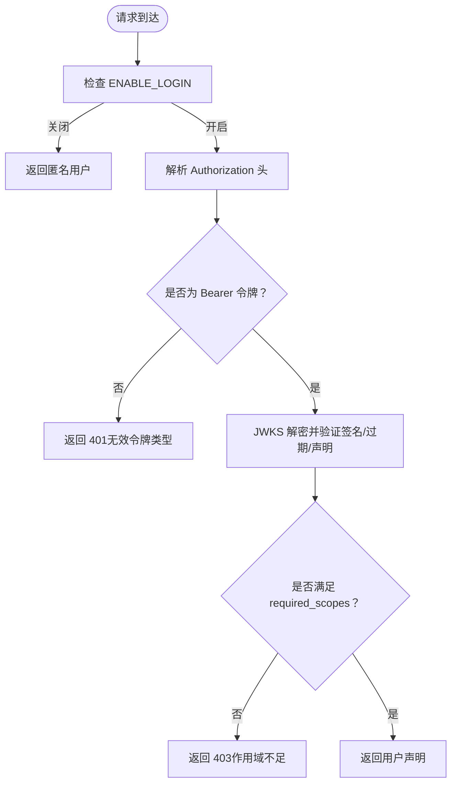

# 认证状态管理

<cite>
**本文引用的文件列表**
- [useAuth.js](file://frontend/src/hooks/useAuth.js)
- [LogtoProvider.jsx](file://frontend/src/providers/LogtoProvider.jsx)
- [auth.js](file://frontend/src/config/auth.js)
- [App.jsx](file://frontend/src/App.jsx)
- [PrivateRoute.jsx](file://frontend/src/components/Auth/PrivateRoute.jsx)
- [Home.jsx](file://frontend/src/pages/Home.jsx)
- [Callback.jsx](file://frontend/src/pages/Callback.jsx)
- [api.js](file://frontend/src/services/api.js)
- [auth.py](file://backend/src/utils/auth.py)
- [config_manager.py](file://backend/src/config/config_manager.py)
- [package.json](file://frontend/package.json)
</cite>

## 目录
1. [简介](#简介)
2. [项目结构](#项目结构)
3. [核心组件](#核心组件)
4. [架构总览](#架构总览)
5. [组件详解](#组件详解)
6. [依赖关系分析](#依赖关系分析)
7. [性能考量](#性能考量)
8. [故障排查指南](#故障排查指南)
9. [结论](#结论)
10. [附录](#附录)

## 简介
本文件深入解析前端自定义 Hook useAuth 如何与 LogtoProvider 集成，实现统一的认证状态管理；说明在 LOGIN_ENABLED 配置开关控制下，认证系统如何在“受保护模式”和“匿名模式”之间无缝切换；阐述 useAuth 返回的认证对象（isAuthenticated、isLoading、signIn、signOut、getAccessToken 等）在前端组件中的使用方式；结合代码路径展示登录状态检查、JWT 令牌获取、权限校验等核心流程；解释 LogtoProvider 如何作为认证上下文提供者为整个应用提供安全的认证服务；并给出处理认证错误、令牌刷新失败等异常的最佳实践，以及扩展认证功能以支持多因素认证或其它身份提供商的建议。

## 项目结构
前端认证相关的关键文件分布如下：
- 配置层：环境变量与开关配置
  - 前端开关：frontend/src/config/auth.js
  - 前端包依赖：frontend/package.json（包含 @logto/react）
- 提供者层：LogtoProvider 封装 @logto/react 的配置与生命周期
  - frontend/src/providers/LogtoProvider.jsx
- Hook 层：useAuth 统一暴露认证能力，支持受保护与匿名两种模式
  - frontend/src/hooks/useAuth.js
- 应用入口与路由：App.jsx 负责注入 tokenGetter、根据开关渲染受保护路由
  - frontend/src/App.jsx
- 路由守卫：PrivateRoute 根据认证状态进行重定向
  - frontend/src/components/Auth/PrivateRoute.jsx
- 登录页与回调页：Home.jsx 触发登录；Callback.jsx 处理 OAuth 回调
  - frontend/src/pages/Home.jsx
  - frontend/src/pages/Callback.jsx
- API 层：api.js 注入 Authorization: Bearer 头，统一处理 401
  - frontend/src/services/api.js
- 后端验证：auth.py 使用 JWKS 验证 JWT，支持匿名模式与作用域校验
  - backend/src/utils/auth.py
  - backend/src/config/config_manager.py

图表来源
- [App.jsx](file://frontend/src/App.jsx#L1-L121)
- [LogtoProvider.jsx](file://frontend/src/providers/LogtoProvider.jsx#L1-L34)
- [useAuth.js](file://frontend/src/hooks/useAuth.js#L1-L30)
- [PrivateRoute.jsx](file://frontend/src/components/Auth/PrivateRoute.jsx#L1-L32)
- [Home.jsx](file://frontend/src/pages/Home.jsx#L1-L216)
- [Callback.jsx](file://frontend/src/pages/Callback.jsx#L1-L44)
- [api.js](file://frontend/src/services/api.js#L1-L120)
- [auth.py](file://backend/src/utils/auth.py#L1-L211)
- [config_manager.py](file://backend/src/config/config_manager.py#L133-L156)

章节来源
- [App.jsx](file://frontend/src/App.jsx#L1-L121)
- [LogtoProvider.jsx](file://frontend/src/providers/LogtoProvider.jsx#L1-L34)
- [useAuth.js](file://frontend/src/hooks/useAuth.js#L1-L30)
- [PrivateRoute.jsx](file://frontend/src/components/Auth/PrivateRoute.jsx#L1-L32)
- [Home.jsx](file://frontend/src/pages/Home.jsx#L1-L216)
- [Callback.jsx](file://frontend/src/pages/Callback.jsx#L1-L44)
- [api.js](file://frontend/src/services/api.js#L1-L120)
- [auth.py](file://backend/src/utils/auth.py#L1-L211)
- [config_manager.py](file://backend/src/config/config_manager.py#L133-L156)

## 核心组件
- useAuth：统一认证 Hook，返回 isAuthenticated、isLoading、signIn、signOut、getAccessToken、getIdTokenClaims 等；当 LOGIN_ENABLED 为 false 时，返回“匿名模式”的占位对象，所有操作为无操作且视为已认证。
- LogtoProvider：封装 @logto/react 的 Provider，注入 endpoint、appId、resources 等配置；在缺少关键配置时输出错误日志。
- App.jsx：根据 LOGIN_ENABLED 决定是否包裹 LogtoProvider；初始化 tokenGetter，使后续 API 请求自动携带 Bearer 令牌；按开关渲染受保护路由与登录/回调路由。
- PrivateRoute：受保护路由守卫，未启用登录时直接放行，启用登录时若未认证则重定向到 /login。
- Home/Callback：Home.jsx 触发 signIn；Callback.jsx 使用 useHandleSignInCallback 处理回调并重定向。
- api.js：setTokenGetter 注入 getAccessToken；buildRequest 自动在请求头添加 Authorization: Bearer；parseResponse 在 401 且启用登录时跳转到 /login。
- 后端 auth.py：通过 JWKS 验证 JWT，支持作用域校验；当 ENABLE_LOGIN 为 false 时允许匿名访问；get_current_user/get_optional_user 支持强制/可选认证。

章节来源
- [useAuth.js](file://frontend/src/hooks/useAuth.js#L1-L30)
- [LogtoProvider.jsx](file://frontend/src/providers/LogtoProvider.jsx#L1-L34)
- [App.jsx](file://frontend/src/App.jsx#L1-L121)
- [PrivateRoute.jsx](file://frontend/src/components/Auth/PrivateRoute.jsx#L1-L32)
- [Home.jsx](file://frontend/src/pages/Home.jsx#L1-L216)
- [Callback.jsx](file://frontend/src/pages/Callback.jsx#L1-L44)
- [api.js](file://frontend/src/services/api.js#L1-L120)
- [auth.py](file://backend/src/utils/auth.py#L1-L211)

## 架构总览
前端通过 LogtoProvider 与 @logto/react 集成，useAuth 抽象出统一的认证接口；App.jsx 在运行时决定是否启用登录模式，并注入 tokenGetter；受保护路由由 PrivateRoute 守卫；API 层自动附加 Bearer 令牌并在 401 时重定向至登录页。后端通过 auth.py 从数据库或环境变量加载 Logto 配置，使用 JWKS 验证 JWT 并支持匿名模式与作用域校验。

图表来源
- [Home.jsx](file://frontend/src/pages/Home.jsx#L60-L90)
- [useAuth.js](file://frontend/src/hooks/useAuth.js#L1-L30)
- [LogtoProvider.jsx](file://frontend/src/providers/LogtoProvider.jsx#L1-L34)
- [Callback.jsx](file://frontend/src/pages/Callback.jsx#L1-L44)
- [App.jsx](file://frontend/src/App.jsx#L29-L40)
- [api.js](file://frontend/src/services/api.js#L1-L120)
- [auth.py](file://backend/src/utils/auth.py#L171-L184)

## 组件详解

### useAuth 统一认证 Hook
- 功能要点
  - 当 LOGIN_ENABLED 为 false：返回匿名模式对象，包含 loginEnabled=false、isAuthenticated=true、isLoading=false、error=null，以及空实现的 signIn/signOut、getAccessToken、getIdTokenClaims。
  - 当 LOGIN_ENABLED 为 true：返回 @logto/react 的 useLogto 结果，并追加 loginEnabled=true，从而在组件中统一使用 isAuthenticated、signIn、signOut、getAccessToken、getIdTokenClaims 等。
- 设计优势
  - 通过单一 Hook 暴露一致的认证接口，屏蔽登录开关差异。
  - 无需在每个组件中判断 LOGIN_ENABLED，简化业务逻辑。

章节来源
- [useAuth.js](file://frontend/src/hooks/useAuth.js#L1-L30)
- [auth.js](file://frontend/src/config/auth.js#L1-L4)

### LogtoProvider 认证上下文提供者
- 功能要点
  - 从 import.meta.env 读取 VITE_LOGTO_ENDPOINT、VITE_LOGTO_APP_ID、VITE_API_BASE_URL。
  - 将配置传给 @logto/react 的 LogtoProvider。
  - 若缺少 endpoint 或 appId，输出错误日志提示配置缺失。
- 集成点
  - App.jsx 在 LOGIN_ENABLED 为 true 时包裹 LogtoProvider，确保 useAuth 可用。

章节来源
- [LogtoProvider.jsx](file://frontend/src/providers/LogtoProvider.jsx#L1-L34)
- [App.jsx](file://frontend/src/App.jsx#L102-L118)

### App.jsx 应用入口与令牌注入
- 功能要点
  - 根据 LOGIN_ENABLED 决定是否包裹 LogtoProvider。
  - 在 AppContent 中调用 useAuth 获取 getAccessToken，并通过 setTokenGetter 注入到 api.js。
  - 根据 LOGIN_ENABLED 渲染登录/回调路由或直接重定向到首页。
  - 将受保护路由包裹在 PrivateRoute 下，实现统一守卫。
- 关键行为
  - 未启用登录时：setTokenGetter(null)，API 不自动附加 Bearer。
  - 启用登录时：setTokenGetter(getAccessToken)，API 自动附加 Bearer。

章节来源
- [App.jsx](file://frontend/src/App.jsx#L1-L121)
- [api.js](file://frontend/src/services/api.js#L1-L40)

### PrivateRoute 受保护路由守卫
- 功能要点
  - 未启用登录：直接放行 children。
  - 启用登录：若 isAuthenticated 为 false，则重定向到 /login。
  - 已认证：渲染 children。
- 适用范围
  - 所有需要登录才能访问的页面路由。

章节来源
- [PrivateRoute.jsx](file://frontend/src/components/Auth/PrivateRoute.jsx#L1-L32)

### Home.jsx 登录入口与自动重定向
- 功能要点
  - 未启用登录：点击按钮直接导航到 /strategy。
  - 启用登录：调用 signIn(redirectUri) 触发 OAuth 流程。
  - 已认证：自动重定向到 /strategy。
- 交互体验
  - 登录按钮文案随登录开关变化，提升用户感知。

章节来源
- [Home.jsx](file://frontend/src/pages/Home.jsx#L60-L90)

### Callback.jsx OAuth 回调处理
- 功能要点
  - 使用 useHandleSignInCallback 处理回调。
  - 成功后重定向到 /。
  - 出错时记录错误并延时重定向到 /login。
- 异常处理
  - 错误场景下保证用户体验与安全性（避免长时间停留在错误页）。

章节来源
- [Callback.jsx](file://frontend/src/pages/Callback.jsx#L1-L44)

### API 层自动注入 Bearer 令牌与 401 处理
- 功能要点
  - setTokenGetter 注入 getAccessToken。
  - buildRequest 在存在 tokenGetter 时，尝试获取资源对应的 access token 并附加 Authorization: Bearer。
  - parseResponse 在收到 401 且启用登录时，跳转到 /login。
- 安全性
  - 仅在启用登录时注入令牌，避免泄露。
  - 令牌获取失败时继续请求，交由后端判定是否需要认证。

章节来源
- [api.js](file://frontend/src/services/api.js#L1-L120)

### 后端 JWT 验证与作用域校验
- 功能要点
  - 从数据库或环境变量读取 LOGTO_* 配置（issuer、jwks_uri、audience、required_scopes、enable_login）。
  - 通过 fetch_jwks 缓存 JWKS；verify_token 使用 python-jose 解码并验证签名、过期、声明等。
  - validate_scopes 校验 token 中的 scope 是否满足 required_scopes。
  - get_current_user/get_optional_user 支持强制/可选认证；当 enable_login 为 false 时返回匿名用户。
- 异常处理
  - 标准化 AuthError，区分过期、无效 token、无效声明等错误码。
  - JWKS 旋转时主动清缓存并重试一次。

章节来源
- [auth.py](file://backend/src/utils/auth.py#L1-L211)
- [config_manager.py](file://backend/src/config/config_manager.py#L133-L156)

## 依赖关系分析
- 前端依赖
  - @logto/react：提供 useLogto、useHandleSignInCallback、LogtoProvider 等能力。
  - react-router-dom：提供路由与导航能力。
  - antd/i18n：UI 与国际化。
- 前端模块耦合
  - App.jsx 依赖 useAuth、LogtoProvider、PrivateRoute。
  - useAuth 依赖 LOGIN_ENABLED。
  - api.js 依赖 LOGIN_ENABLED 与 tokenGetter。
  - PrivateRoute 依赖 useAuth。
- 后端依赖
  - fastapi：HTTP 接口框架。
  - python-jose：JWT 解码与验证。
  - requests：拉取 JWKS。
  - 后端配置来源于 config_manager，支持数据库与环境变量双源。

图表来源
- [package.json](file://frontend/package.json#L1-L42)
- [App.jsx](file://frontend/src/App.jsx#L1-L121)
- [LogtoProvider.jsx](file://frontend/src/providers/LogtoProvider.jsx#L1-L34)
- [useAuth.js](file://frontend/src/hooks/useAuth.js#L1-L30)
- [PrivateRoute.jsx](file://frontend/src/components/Auth/PrivateRoute.jsx#L1-L32)
- [Home.jsx](file://frontend/src/pages/Home.jsx#L1-L216)
- [Callback.jsx](file://frontend/src/pages/Callback.jsx#L1-L44)
- [api.js](file://frontend/src/services/api.js#L1-L120)
- [auth.py](file://backend/src/utils/auth.py#L1-L211)
- [config_manager.py](file://backend/src/config/config_manager.py#L133-L156)

## 性能考量
- 前端
  - useAuth 在 LOGIN_ENABLED 为 false 时返回轻量对象，避免不必要的 SDK 初始化开销。
  - App.jsx 在启用登录时才注入 tokenGetter，减少无谓的令牌获取调用。
  - api.js 在 tokenGetter 不存在时不会附加 Authorization 头，避免无效网络请求。
- 后端
  - fetch_jwks 使用 LRU 缓存，降低频繁拉取 JWKS 的成本；遇到 key 不匹配时主动清缓存并重试一次，提高健壮性。
  - verify_token 仅做必要验证（签名、过期、声明），不进行昂贵的二次校验。

[本节为通用性能讨论，不涉及具体文件分析]

## 故障排查指南
- 前端常见问题
  - 登录按钮无效：确认 LOGIN_ENABLED 是否为 true；检查 VITE_LOGTO_ENDPOINT/VITE_LOGTO_APP_ID 是否正确；查看浏览器控制台是否有配置缺失警告。
  - 回调页报错：Callback.jsx 会在 error 时记录日志并重定向到 /login；检查 Logto 控制台与回调地址配置。
  - 401 未跳转：确认 LOGIN_ENABLED 为 true；检查 api.js 的 parseResponse 是否被调用；确认后端 ENABLE_LOGIN 是否开启。
- 后端常见问题
  - JWKS 获取失败：检查 LOGTO_JWKS_URI 是否配置；代理设置是否正确；网络连通性。
  - 令牌过期/无效：核对 token 过期时间、签名算法、issuer/audience；确认前端资源标识与后端配置一致。
  - 作用域不足：检查 LOGTO_REQUIRED_SCOPES 与 token 中 scope 是否匹配。
- 最佳实践
  - 在开发阶段将 ENABLE_LOGIN 设为 false 可快速进入匿名模式进行界面联调。
  - 对于令牌刷新失败，前端应捕获异常并提示用户重新登录；后端在 401 时不要泄露敏感信息，统一返回标准化错误码。
  - 对于多因素认证或多身份提供商，可在前端增加 Provider 切换与登录入口，后端通过配置项区分不同 issuer/jwks_uri。

章节来源
- [LogtoProvider.jsx](file://frontend/src/providers/LogtoProvider.jsx#L1-L34)
- [Callback.jsx](file://frontend/src/pages/Callback.jsx#L1-L44)
- [api.js](file://frontend/src/services/api.js#L55-L74)
- [auth.py](file://backend/src/utils/auth.py#L141-L169)
- [config_manager.py](file://backend/src/config/config_manager.py#L133-L156)

## 结论
该认证体系通过 useAuth 抽象统一了前端认证接口，结合 LOGIN_ENABLED 实现“受保护模式”与“匿名模式”的无缝切换；App.jsx 通过 tokenGetter 将 Bearer 令牌自动注入 API 请求；PrivateRoute 提供受保护路由守卫；后端通过 JWKS 验证 JWT 并支持匿名模式与作用域校验。整体设计简洁、可维护性强，具备良好的扩展性，便于后续接入多因素认证或其它身份提供商。

[本节为总结性内容，不涉及具体文件分析]

## 附录

### LOGIN_ENABLED 开关与匿名模式
- 开关来源：frontend/src/config/auth.js 从 import.meta.env.VITE_ENABLE_LOGIN 读取布尔值。
- 行为差异：
  - true：启用 @logto/react，useAuth 返回真实认证对象；App.jsx 注入 tokenGetter；路由按受保护模式渲染。
  - false：useAuth 返回匿名模式对象；App.jsx 不注入 tokenGetter；路由直接放行。

章节来源
- [auth.js](file://frontend/src/config/auth.js#L1-L4)
- [useAuth.js](file://frontend/src/hooks/useAuth.js#L1-L30)
- [App.jsx](file://frontend/src/App.jsx#L1-L121)

### 前端组件使用 useAuth 的典型场景
- 登录状态检查：在组件中读取 isAuthenticated，决定显示/隐藏登录按钮或用户菜单。
- 触发登录：调用 signIn(redirectUri)；在回调页使用 useHandleSignInCallback 完成回调处理。
- 获取令牌：调用 getAccessToken(resource) 获取 Bearer 令牌，用于 API 请求。
- 用户信息：调用 getIdTokenClaims() 获取用户声明，用于 UI 展示。
- 登出：调用 signOut(postLogoutRedirectUri) 完成登出流程。

章节来源
- [Home.jsx](file://frontend/src/pages/Home.jsx#L60-L90)
- [Callback.jsx](file://frontend/src/pages/Callback.jsx#L1-L44)
- [useAuth.js](file://frontend/src/hooks/useAuth.js#L1-L30)
- [api.js](file://frontend/src/services/api.js#L1-L120)

### 后端权限校验流程

图表来源
- [auth.py](file://backend/src/utils/auth.py#L38-L84)
- [auth.py](file://backend/src/utils/auth.py#L141-L169)
- [auth.py](file://backend/src/utils/auth.py#L121-L139)
- [config_manager.py](file://backend/src/config/config_manager.py#L133-L156)

### 扩展认证功能建议
- 多身份提供商：在前端增加 Provider 切换与登录入口，后端通过配置区分不同 issuer/jwks_uri。
- 多因素认证：在回调页增加 MFA 流程提示与二次验证；后端在 verify_token 前增加二次校验步骤。
- 自定义作用域：在前端请求时指定资源标识（resource），后端据此校验对应 scope。
- 令牌刷新：前端捕获令牌刷新失败异常，引导用户重新登录；后端在 401 时不泄露具体原因。

[本节为概念性建议，不涉及具体文件分析]