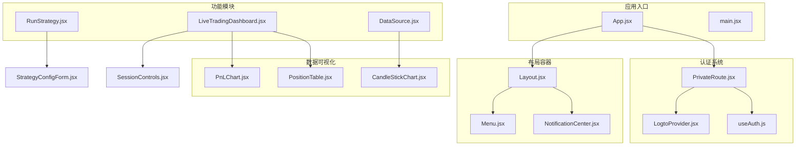
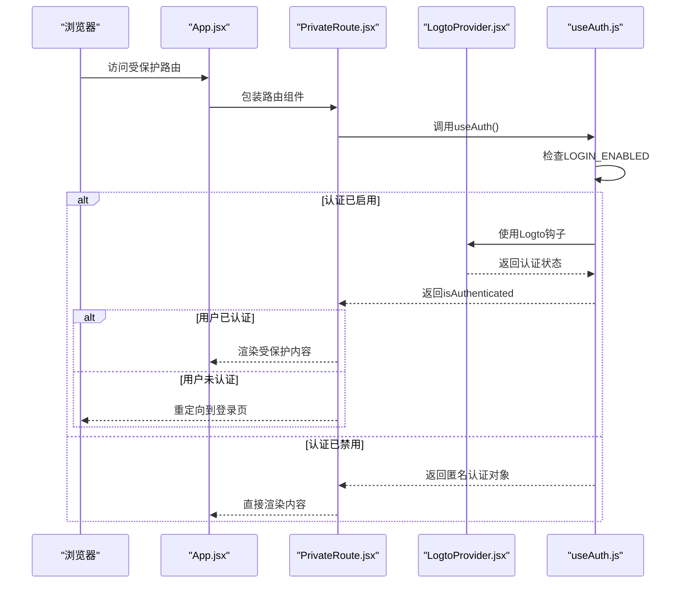
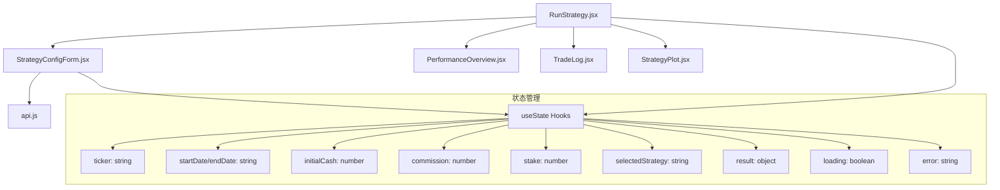
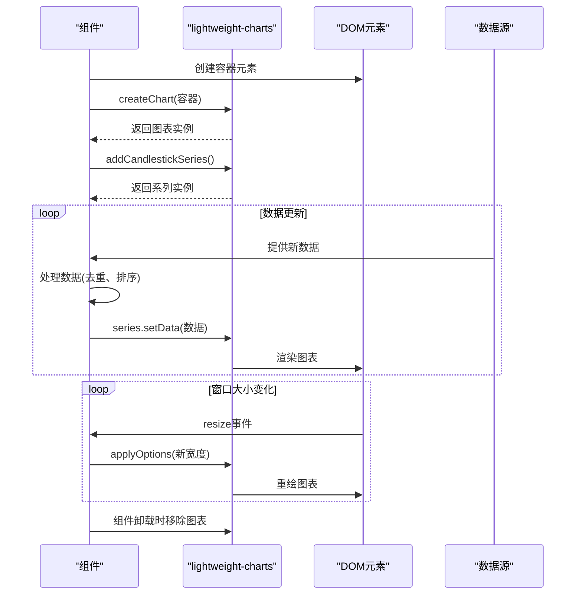

# 组件体系

<cite>
**本文档中引用的文件**   
- [App.jsx](file://frontend/src/App.jsx)
- [Layout.jsx](file://frontend/src/components/Layout/Layout.jsx)
- [Menu.jsx](file://frontend/src/components/Layout/Menu.jsx)
- [NotificationCenter.jsx](file://frontend/src/components/Layout/NotificationCenter.jsx)
- [PrivateRoute.jsx](file://frontend/src/components/Auth/PrivateRoute.jsx)
- [LogtoProvider.jsx](file://frontend/src/providers/LogtoProvider.jsx)
- [useAuth.js](file://frontend/src/hooks/useAuth.js)
- [RunStrategy.jsx](file://frontend/src/pages/RunStrategy.jsx)
- [StrategyConfigForm.jsx](file://frontend/src/components/RunStrategy/StrategyConfigForm.jsx)
- [LiveTradingDashboard.jsx](file://frontend/src/pages/LiveTradingDashboard.jsx)
- [PnLChart.jsx](file://frontend/src/components/LiveTrading/PnLChart.jsx)
- [PositionTable.jsx](file://frontend/src/components/LiveTrading/PositionTable.jsx)
- [SessionControls.jsx](file://frontend/src/components/LiveTrading/SessionControls.jsx)
- [CandleStickChart.jsx](file://frontend/src/components/DataSource/CandleStickChart.jsx)
</cite>

## 目录
1. [简介](#简介)
2. [项目结构](#项目结构)
3. [核心组件](#核心组件)
4. [架构概览](#架构概览)
5. [详细组件分析](#详细组件分析)
6. [依赖分析](#依赖分析)
7. [性能考虑](#性能考虑)
8. [故障排除指南](#故障排除指南)
9. [结论](#结论)

## 简介
本文档详细阐述了基于React的前端组件体系架构设计，重点介绍应用的主布局容器、权限控制机制、核心功能组件以及数据可视化实现。文档涵盖了从应用入口到具体功能模块的完整技术实现路径，为开发者提供全面的组件开发规范和最佳实践指导。

## 项目结构
该前端项目采用模块化组件架构，按照功能域组织文件结构。核心组件被组织在`components`目录下，按功能划分为`Auth`、`Layout`、`RunStrategy`、`LiveTrading`等子模块。页面组件位于`pages`目录，通过路由系统与布局组件集成。`providers`目录包含应用级状态管理和服务提供者，`hooks`目录封装可复用的逻辑钩子。

**Section sources**
- [App.jsx](file://frontend/src/App.jsx#L1-L119)

## 核心组件

本文档深入分析了以下核心组件及其职责划分：
- **Layout组件**：作为应用主布局容器，集成导航菜单和通知中心
- **Auth组件**：实现路由级权限控制和身份验证
- **RunStrategy组件**：支持策略回测的核心功能模块
- **LiveTrading组件**：实现实盘交易监控和控制
- **数据可视化组件**：提供专业的金融数据图表展示

**Section sources**
- [Layout.jsx](file://frontend/src/components/Layout/Layout.jsx#L1-L133)
- [PrivateRoute.jsx](file://frontend/src/components/Auth/PrivateRoute.jsx#L1-L32)
- [RunStrategy.jsx](file://frontend/src/pages/RunStrategy.jsx#L1-L141)
- [LiveTradingDashboard.jsx](file://frontend/src/pages/LiveTradingDashboard.jsx#L1-L173)

## 架构概览

该应用采用分层组件架构，通过React Router实现路由控制，结合自定义提供者模式管理全局状态。整体架构分为四个主要层次：应用入口层、布局容器层、功能组件层和数据服务层。



**Diagram sources**
- [App.jsx](file://frontend/src/App.jsx#L1-L119)
- [Layout.jsx](file://frontend/src/components/Layout/Layout.jsx#L1-L133)
- [PrivateRoute.jsx](file://frontend/src/components/Auth/PrivateRoute.jsx#L1-L32)

## 详细组件分析

### 布局组件分析
`Layout`组件作为应用的主容器，负责提供一致的UI结构和全局功能。它集成了侧边栏导航菜单、顶部操作栏和通知中心，为所有页面提供统一的用户体验。

#### 布局组件结构
```mermaid
classDiagram
class Layout {
+useState collapsed
+useState userInfo
+useEffect fetchUserInfo()
+handleLogout()
+toggleLanguage()
-render()
}
class Menu {
+collapsed : boolean
+setCollapsed : function
+useLocation()
+getNavClass()
-render()
}
class NotificationCenter {
+useHeaderNotification()
+useState open
+getIcon(type)
+handleOpenChange()
-render()
}
Layout --> Menu : "包含"
Layout --> NotificationCenter : "包含"
Layout --> "Outlet" : "渲染子路由"
```

**Diagram sources**
- [Layout.jsx](file://frontend/src/components/Layout/Layout.jsx#L1-L133)
- [Menu.jsx](file://frontend/src/components/Layout/Menu.jsx#L1-L102)
- [NotificationCenter.jsx](file://frontend/src/components/Layout/NotificationCenter.jsx#L1-L125)

**Section sources**
- [Layout.jsx](file://frontend/src/components/Layout/Layout.jsx#L1-L133)
- [Menu.jsx](file://frontend/src/components/Layout/Menu.jsx#L1-L102)
- [NotificationCenter.jsx](file://frontend/src/components/Layout/NotificationCenter.jsx#L1-L125)

### 认证组件分析
`Auth`组件通过`PrivateRoute`高阶组件实现路由级权限控制，结合`LogtoProvider`进行身份验证管理。该设计支持灵活的认证模式切换，既可启用完整OAuth流程，也可配置为匿名访问模式。

#### 认证流程


**Diagram sources**
- [App.jsx](file://frontend/src/App.jsx#L1-L119)
- [PrivateRoute.jsx](file://frontend/src/components/Auth/PrivateRoute.jsx#L1-L32)
- [LogtoProvider.jsx](file://frontend/src/providers/LogtoProvider.jsx#L1-L34)
- [useAuth.js](file://frontend/src/hooks/useAuth.js#L1-L30)

**Section sources**
- [PrivateRoute.jsx](file://frontend/src/components/Auth/PrivateRoute.jsx#L1-L32)
- [LogtoProvider.jsx](file://frontend/src/providers/LogtoProvider.jsx#L1-L34)
- [useAuth.js](file://frontend/src/hooks/useAuth.js#L1-L30)

### 核心功能组件分析
核心功能组件包括`RunStrategy`、`LiveTrading`和`StrategyMaintain`，它们分别负责策略回测、实盘交易和策略维护等关键业务功能。

#### 策略运行组件


**Diagram sources**
- [RunStrategy.jsx](file://frontend/src/pages/RunStrategy.jsx#L1-L141)
- [StrategyConfigForm.jsx](file://frontend/src/components/RunStrategy/StrategyConfigForm.jsx#L1-L190)

**Section sources**
- [RunStrategy.jsx](file://frontend/src/pages/RunStrategy.jsx#L1-L141)
- [StrategyConfigForm.jsx](file://frontend/src/components/RunStrategy/StrategyConfigForm.jsx#L1-L190)

#### 实盘交易组件
```mermaid
classDiagram
class LiveTradingDashboard {
+useLiveTrading hook
+session : object
+positions : array
+orders : array
+pnlHistory : array
+currentPnl : number
+portfolioValue : number
+cash : number
+stats : object
+wsConnected : boolean
+handleStartSession()
+handleStopSession()
+handleRefreshSession()
}
class SessionControls {
+session : object
+onStart : function
+onStop : function
+onRefresh : function
+loading : boolean
+getStatusColor()
+getStatusText()
}
class PnLChart {
+pnlHistory : array
+currentPnl : number
+chartContainerRef : ref
+chartRef : ref
+lineSeriesRef : ref
+useEffect initChart()
+useEffect updateData()
}
class PositionTable {
+positions : array
+loading : boolean
+columns : array
+render methods
}
LiveTradingDashboard --> SessionControls
LiveTradingDashboard --> PnLChart
LiveTradingDashboard --> PositionTable
LiveTradingDashboard --> OrderLog
PnLChart --> "lightweight-charts"
PositionTable --> "antd Table"
```

**Diagram sources**
- [LiveTradingDashboard.jsx](file://frontend/src/pages/LiveTradingDashboard.jsx#L1-L173)
- [SessionControls.jsx](file://frontend/src/components/LiveTrading/SessionControls.jsx#L1-L93)
- [PnLChart.jsx](file://frontend/src/components/LiveTrading/PnLChart.jsx#L1-L113)
- [PositionTable.jsx](file://frontend/src/components/LiveTrading/PositionTable.jsx#L1-L99)

**Section sources**
- [LiveTradingDashboard.jsx](file://frontend/src/pages/LiveTradingDashboard.jsx#L1-L173)
- [SessionControls.jsx](file://frontend/src/components/LiveTrading/SessionControls.jsx#L1-L93)
- [PnLChart.jsx](file://frontend/src/components/LiveTrading/PnLChart.jsx#L1-L113)
- [PositionTable.jsx](file://frontend/src/components/LiveTrading/PositionTable.jsx#L1-L99)

### 数据可视化组件分析
数据可视化组件基于`lightweight-charts`库实现，提供高性能的金融图表展示功能。`CandleStickChart`和`PnLChart`组件分别用于展示K线图和盈亏曲线。

#### 图表组件实现


**Diagram sources**
- [CandleStickChart.jsx](file://frontend/src/components/DataSource/CandleStickChart.jsx#L1-L94)
- [PnLChart.jsx](file://frontend/src/components/LiveTrading/PnLChart.jsx#L1-L113)

**Section sources**
- [CandleStickChart.jsx](file://frontend/src/components/DataSource/CandleStickChart.jsx#L1-L94)
- [PnLChart.jsx](file://frontend/src/components/LiveTrading/PnLChart.jsx#L1-L113)

## 依赖分析

该前端应用的依赖关系清晰，采用自上而下的数据流和自下而上的事件传递机制。核心依赖包括React生态库、Ant Design UI组件库和lightweight-charts数据可视化库。

```mermaid
dependency-graph
"React" --> "react-router-dom"
"React" --> "react-i18next"
"React" --> "@logto/react"
"Ant Design" --> "antd"
"Data Visualization" --> "lightweight-charts"
"App.jsx" --> "Layout.jsx"
"App.jsx" --> "PrivateRoute.jsx"
"App.jsx" --> "LogtoProvider.jsx"
"Layout.jsx" --> "Menu.jsx"
"Layout.jsx" --> "NotificationCenter.jsx"
"PrivateRoute.jsx" --> "useAuth.js"
"LogtoProvider.jsx" --> "@logto/react"
"RunStrategy.jsx" --> "StrategyConfigForm.jsx"
"RunStrategy.jsx" --> "PerformanceOverview.jsx"
"LiveTradingDashboard.jsx" --> "SessionControls.jsx"
"LiveTradingDashboard.jsx" --> "PnLChart.jsx"
"LiveTradingDashboard.jsx" --> "PositionTable.jsx"
"DataSource.jsx" --> "CandleStickChart.jsx"
```

**Diagram sources**
- [package.json](file://frontend/package.json)
- [App.jsx](file://frontend/src/App.jsx#L1-L119)

**Section sources**
- [App.jsx](file://frontend/src/App.jsx#L1-L119)
- [package.json](file://frontend/package.json)

## 性能考虑
该应用在性能方面采取了多项优化措施：
- 使用`useEffect`的依赖数组精确控制渲染时机
- 通过`ref`引用避免不必要的重新渲染
- 在组件卸载时清理事件监听器和定时器
- 对图表组件进行懒加载和按需渲染
- 使用虚拟滚动处理大量交易记录
- 实现WebSocket连接复用，减少网络开销

## 故障排除指南
### 常见问题及解决方案
| 问题现象 | 可能原因 | 解决方案 |
|---------|--------|---------|
| 页面无法加载 | 认证配置错误 | 检查`.env`文件中的`VITE_LOGTO_ENDPOINT`和`VITE_LOGTO_APP_ID` |
| 图表不显示 | 数据格式错误 | 确保传入图表组件的数据符合`{time, open, high, low, close}`格式 |
| WebSocket连接失败 | 服务端未启动 | 确认后端服务正在运行并监听正确端口 |
| 策略回测无响应 | 参数验证失败 | 检查表单输入是否完整且符合要求 |
| 通知中心无反应 | 状态管理错误 | 确认`NotificationProvider`已正确包裹应用 |

**Section sources**
- [LogtoProvider.jsx](file://frontend/src/providers/LogtoProvider.jsx#L1-L34)
- [CandleStickChart.jsx](file://frontend/src/components/DataSource/CandleStickChart.jsx#L1-L94)
- [LiveTradingDashboard.jsx](file://frontend/src/pages/LiveTradingDashboard.jsx#L1-L173)

## 结论
本文档全面介绍了基于React的前端组件体系架构，涵盖了从应用布局到核心功能的完整实现细节。该架构设计具有良好的模块化特性，通过组件化开发提高了代码复用性和可维护性。建议开发者遵循文档中的组件开发规范，充分利用现有的钩子和提供者模式，确保新功能的开发与现有架构保持一致。