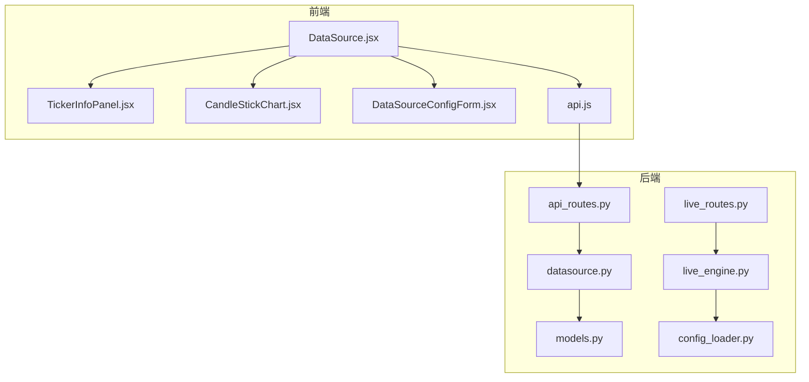
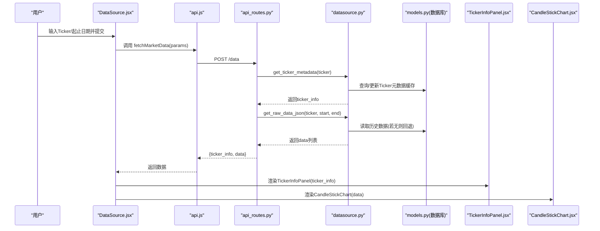
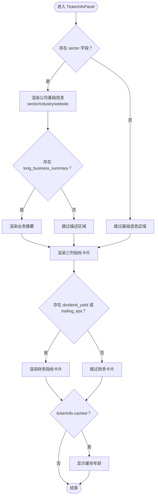
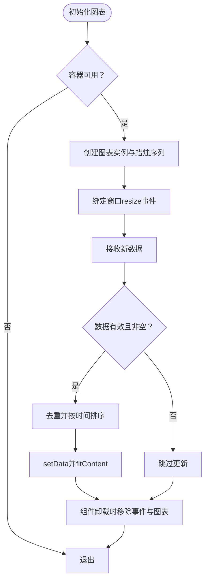
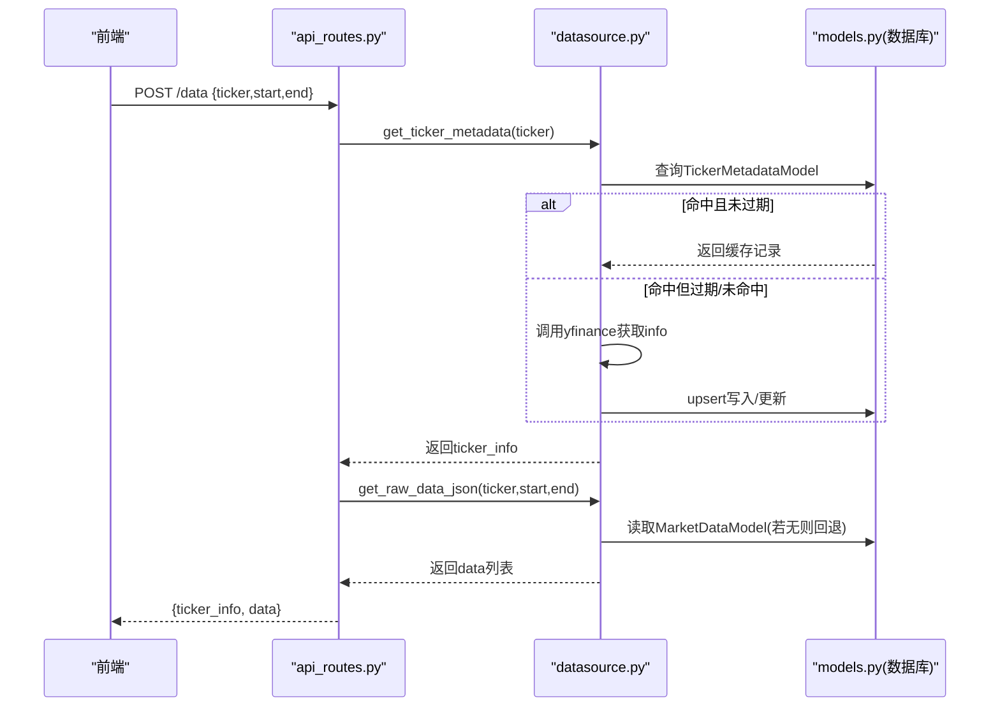
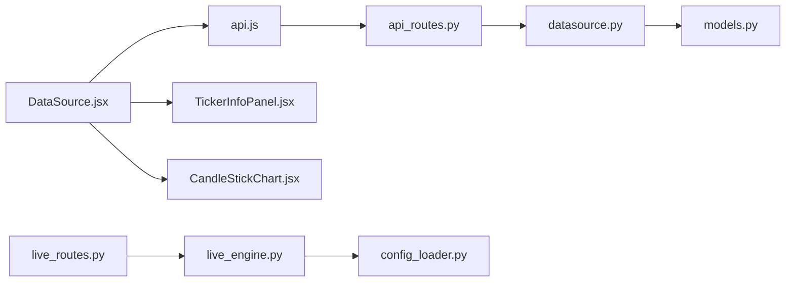

# Ticker信息面板

<cite>
**本文引用的文件**
- [TickerInfoPanel.jsx](file://frontend/src/components/DataSource/TickerInfoPanel.jsx)
- [TickerInfoPanel.css](file://frontend/src/components/DataSource/TickerInfoPanel.css)
- [CandleStickChart.jsx](file://frontend/src/components/DataSource/CandleStickChart.jsx)
- [DataSourceConfigForm.jsx](file://frontend/src/components/DataSource/DataSourceConfigForm.jsx)
- [DataSource.jsx](file://frontend/src/pages/DataSource.jsx)
- [api.js](file://frontend/src/services/api.js)
- [api_routes.py](file://backend/src/routes/api_routes.py)
- [datasource.py](file://backend/src/db/datasource.py)
- [models.py](file://backend/src/db/models.py)
- [live_routes.py](file://backend/src/routes/live_routes.py)
- [live_engine.py](file://backend/src/service/live_engine.py)
- [config_loader.py](file://backend/src/utils/config_loader.py)
</cite>

## 目录
1. [简介](#简介)
2. [项目结构](#项目结构)
3. [核心组件](#核心组件)
4. [架构总览](#架构总览)
5. [详细组件分析](#详细组件分析)
6. [依赖关系分析](#依赖关系分析)
7. [性能考量](#性能考量)
8. [故障排查指南](#故障排查指南)
9. [结论](#结论)

## 简介
本文件聚焦“Ticker信息面板”在前端与后端的整体实现，围绕以下目标展开：
- 前端如何接收后端返回的Ticker元数据与OHLCV蜡烛图数据，并以卡片式布局展示关键指标。
- 后端如何从数据库缓存或外部数据源拉取Ticker元数据与历史价格数据，并统一返回给前端。
- 数据流、错误处理、格式化与响应模型之间的协作关系。
- 与实时/回测功能的集成点（如Live Trading）以及配置校验流程。

## 项目结构
该功能涉及前后端多模块协同：
- 前端页面与组件：DataSource.jsx负责表单提交与结果渲染；TickerInfoPanel.jsx展示Ticker元数据；CandleStickChart.jsx渲染蜡烛图；DataSourceConfigForm.jsx提供输入表单。
- 前端服务层：api.js封装REST调用，统一鉴权与错误处理。
- 后端路由层：api_routes.py提供/data接口，聚合Ticker元数据与历史数据。
- 后端数据层：datasource.py负责yfinance抓取、数据库读写、Ticker元数据解析与缓存。
- 模型定义：models.py定义数据库表结构，包括市场数据与Ticker元数据。
- 实时交易：live_routes.py与live_engine.py提供Live Trading能力，与本功能在UI上可联动展示。

图表来源
- [DataSource.jsx](file://frontend/src/pages/DataSource.jsx#L1-L93)
- [TickerInfoPanel.jsx](file://frontend/src/components/DataSource/TickerInfoPanel.jsx#L1-L194)
- [CandleStickChart.jsx](file://frontend/src/components/DataSource/CandleStickChart.jsx#L1-L94)
- [DataSourceConfigForm.jsx](file://frontend/src/components/DataSource/DataSourceConfigForm.jsx#L1-L99)
- [api.js](file://frontend/src/services/api.js#L1-L277)
- [api_routes.py](file://backend/src/routes/api_routes.py#L68-L94)
- [datasource.py](file://backend/src/db/datasource.py#L1-L215)
- [models.py](file://backend/src/db/models.py#L409-L477)
- [live_routes.py](file://backend/src/routes/live_routes.py#L1-L120)
- [live_engine.py](file://backend/src/service/live_engine.py#L100-L200)
- [config_loader.py](file://backend/src/utils/config_loader.py#L179-L217)

章节来源
- [DataSource.jsx](file://frontend/src/pages/DataSource.jsx#L1-L93)
- [api_routes.py](file://backend/src/routes/api_routes.py#L68-L94)
- [datasource.py](file://backend/src/db/datasource.py#L1-L215)
- [models.py](file://backend/src/db/models.py#L409-L477)

## 核心组件
- TickerInfoPanel.jsx：以卡片网格形式展示公司基础信息、市场指标、交易统计与财务指标，并根据缓存状态显示缓存年龄提示。
- CandleStickChart.jsx：基于lightweight-charts创建蜡烛图，自动适配容器宽度与窗口尺寸变化，确保数据去重与排序后渲染。
- DataSourceConfigForm.jsx：提供Ticker、起止日期等输入项，支持加载态与错误提示。
- DataSource.jsx：页面级容器，负责收集用户输入、调用api.fetchMarketData、分发ticker_info与data到对应子组件。
- api.js：封装请求构建、鉴权注入、响应解析与401跳转逻辑，暴露fetchMarketData方法供页面使用。
- 后端api_routes.py：/data接口聚合Ticker元数据与历史数据，返回统一结构。
- 后端datasource.py：实现yfinance抓取、数据库保存与读取、Ticker元数据解析与缓存逻辑。
- 后端models.py：定义MarketDataModel与TickerMetadataModel，支撑历史数据与元数据持久化。
- 实时交易相关：live_routes.py与live_engine.py提供Live Trading能力，与本功能在UI上可联动展示（例如在Live Trading仪表盘中复用类似的数据面板）。

章节来源
- [TickerInfoPanel.jsx](file://frontend/src/components/DataSource/TickerInfoPanel.jsx#L1-L194)
- [CandleStickChart.jsx](file://frontend/src/components/DataSource/CandleStickChart.jsx#L1-L94)
- [DataSourceConfigForm.jsx](file://frontend/src/components/DataSource/DataSourceConfigForm.jsx#L1-L99)
- [DataSource.jsx](file://frontend/src/pages/DataSource.jsx#L1-L93)
- [api.js](file://frontend/src/services/api.js#L1-L277)
- [api_routes.py](file://backend/src/routes/api_routes.py#L68-L94)
- [datasource.py](file://backend/src/db/datasource.py#L1-L215)
- [models.py](file://backend/src/db/models.py#L409-L477)
- [live_routes.py](file://backend/src/routes/live_routes.py#L1-L120)
- [live_engine.py](file://backend/src/service/live_engine.py#L100-L200)

## 架构总览
下图展示了从前端页面到后端接口与数据层的完整调用链路，以及Ticker元数据与历史数据的生成路径。

图表来源
- [DataSource.jsx](file://frontend/src/pages/DataSource.jsx#L1-L93)
- [api.js](file://frontend/src/services/api.js#L105-L111)
- [api_routes.py](file://backend/src/routes/api_routes.py#L68-L94)
- [datasource.py](file://backend/src/db/datasource.py#L180-L215)
- [models.py](file://backend/src/db/models.py#L409-L477)

## 详细组件分析

### TickerInfoPanel 组件
- 功能要点
  - 展示公司名称与股票代码、行业与网站链接、业务摘要。
  - 分三列卡片展示：市场指标（市值、市盈率、Beta、52周高低）、交易统计（当前价、前收、日价区间、平均成交量）、财务指标（股息率、EPS、利润率）。
  - 缓存指示：当ticker_info包含cached字段时，显示缓存天数。
- 格式化策略
  - 大额数值（如市值、成交量）按单位缩写展示。
  - 百分比与小数按固定精度展示。
- 可选字段
  - 当部分字段为空时，不渲染对应行，保证界面整洁。
- 交互与样式
  - 使用Ant Design图标增强可读性。
  - 样式通过独立CSS文件管理，采用卡片容器、网格布局与响应式断点。

图表来源
- [TickerInfoPanel.jsx](file://frontend/src/components/DataSource/TickerInfoPanel.jsx#L1-L194)
- [TickerInfoPanel.css](file://frontend/src/components/DataSource/TickerInfoPanel.css#L1-L160)

章节来源
- [TickerInfoPanel.jsx](file://frontend/src/components/DataSource/TickerInfoPanel.jsx#L1-L194)
- [TickerInfoPanel.css](file://frontend/src/components/DataSource/TickerInfoPanel.css#L1-L160)

### CandleStickChart 组件
- 功能要点
  - 初始化lightweight-charts，设置主题色、网格线与边框。
  - 接收data数组，进行去重与按时间排序，再setData并自适应缩放。
  - 监听窗口resize事件，动态调整画布宽度。
  - 在组件卸载时清理图表实例与事件监听。
- 数据要求
  - 时间字段为字符串（YYYY-MM-DD），OHLCV字段均为数值。
- 错误与边界
  - 当传入数据为空或无效时，不更新序列，避免异常。

图表来源
- [CandleStickChart.jsx](file://frontend/src/components/DataSource/CandleStickChart.jsx#L1-L94)

章节来源
- [CandleStickChart.jsx](file://frontend/src/components/DataSource/CandleStickChart.jsx#L1-L94)

### DataSourceConfigForm 组件
- 功能要点
  - 提供Ticker、开始日期、结束日期输入，带图标与必填标记。
  - 提交按钮支持禁用态与加载态，错误信息统一展示。
- 与页面交互
  - 作为DataSource.jsx的子组件，接收setter函数与回调，驱动页面状态更新。

章节来源
- [DataSourceConfigForm.jsx](file://frontend/src/components/DataSource/DataSourceConfigForm.jsx#L1-L99)
- [DataSource.jsx](file://frontend/src/pages/DataSource.jsx#L1-L93)

### DataSource 页面
- 功能要点
  - 维护ticker、起止日期、图表数据、Ticker元数据、加载与错误状态。
  - 调用api.fetchMarketData，提取ticker_info与data，分别交给TickerInfoPanel与CandleStickChart渲染。
  - 无数据时显示友好提示。
- 错误处理
  - 捕获异常并设置错误消息，finally中关闭加载态。

章节来源
- [DataSource.jsx](file://frontend/src/pages/DataSource.jsx#L1-L93)
- [api.js](file://frontend/src/services/api.js#L105-L111)

### 后端 /data 接口与数据管线
- 接口行为
  - 验证Ticker有效性（通过get_ticker_metadata），若无效返回400。
  - 获取OHLCV原始数据（get_raw_data_json），并返回统一结构{ticker_info, data}。
- 元数据缓存与刷新
  - get_ticker_metadata优先从数据库缓存读取，未命中或过期则从yfinance抓取，随后入库并返回。
  - 返回字典中包含cached与cache_age_days等缓存元信息，前端据此渲染缓存提示。
- 历史数据回退
  - 若yfinance下载失败，回退到本地数据库查询；若仍无数据则抛出异常。

图表来源
- [api_routes.py](file://backend/src/routes/api_routes.py#L68-L94)
- [datasource.py](file://backend/src/db/datasource.py#L180-L215)
- [datasource.py](file://backend/src/db/datasource.py#L436-L499)
- [models.py](file://backend/src/db/models.py#L409-L477)

章节来源
- [api_routes.py](file://backend/src/routes/api_routes.py#L68-L94)
- [datasource.py](file://backend/src/db/datasource.py#L180-L215)
- [datasource.py](file://backend/src/db/datasource.py#L436-L499)
- [models.py](file://backend/src/db/models.py#L409-L477)

### 数据模型与缓存
- MarketDataModel
  - 存储每日OHLCV与来源标识，唯一约束(ticker,date)，支持回测与历史回放。
- TickerMetadataModel
  - 存储公司基础信息、市场指标、交易统计与财务指标，含额外字段与更新时间，用于前端展示与缓存年龄计算。
- 缓存策略
  - Ticker元数据按ticker缓存，过期判断由updated_at与系统时间差决定；首次抓取时cached=false，后续返回cached=true与cache_age_days。

章节来源
- [models.py](file://backend/src/db/models.py#L409-L477)
- [datasource.py](file://backend/src/db/datasource.py#L436-L499)

### 实时交易集成点
- Live Trading
  - live_routes.py提供启动/停止/查询会话、列出会话、获取交易所列表、健康检查等接口。
  - live_engine.py负责策略加载、适配器初始化（CCXT/IBKR）、Cerebro运行与会话状态管理。
  - config_loader.py提供交换所配置、符号与时间框架校验、纸面交易参数等。
- 与数据面板的关联
  - DataSource页面可作为Live Trading仪表盘中的数据源配置入口，二者共享数据获取与展示模式（Ticker元数据与蜡烛图）。

章节来源
- [live_routes.py](file://backend/src/routes/live_routes.py#L1-L120)
- [live_engine.py](file://backend/src/service/live_engine.py#L100-L200)
- [config_loader.py](file://backend/src/utils/config_loader.py#L179-L217)

## 依赖关系分析
- 前端
  - DataSource.jsx依赖api.js与各子组件，形成页面级编排。
  - TickerInfoPanel.jsx依赖国际化资源与Ant Design图标，样式独立于组件。
  - CandleStickChart.jsx依赖lightweight-charts，内部管理图表生命周期。
- 后端
  - api_routes.py依赖datasource.py进行数据获取与验证。
  - datasource.py依赖yfinance与SQLAlchemy ORM，访问models.py定义的表。
  - live_routes.py与live_engine.py共同构成实时交易子系统，config_loader.py提供配置校验。

图表来源
- [DataSource.jsx](file://frontend/src/pages/DataSource.jsx#L1-L93)
- [api.js](file://frontend/src/services/api.js#L1-L277)
- [TickerInfoPanel.jsx](file://frontend/src/components/DataSource/TickerInfoPanel.jsx#L1-L194)
- [CandleStickChart.jsx](file://frontend/src/components/DataSource/CandleStickChart.jsx#L1-L94)
- [api_routes.py](file://backend/src/routes/api_routes.py#L68-L94)
- [datasource.py](file://backend/src/db/datasource.py#L1-L215)
- [models.py](file://backend/src/db/models.py#L409-L477)
- [live_routes.py](file://backend/src/routes/live_routes.py#L1-L120)
- [live_engine.py](file://backend/src/service/live_engine.py#L100-L200)
- [config_loader.py](file://backend/src/utils/config_loader.py#L179-L217)

## 性能考量
- 前端
  - CandleStickChart在窗口resize时仅更新宽度，避免全量重建图表，降低重绘成本。
  - 数据去重与排序在前端完成，建议后端也做去重与排序，减少重复渲染。
- 后端
  - Ticker元数据缓存显著降低yfinance调用频率，提升响应速度与用户体验。
  - 历史数据优先从数据库读取，回退机制保障可用性。
  - 对于大量数据，建议在后端分页或限制返回条目数量，避免一次性传输过多数据。

[本节为通用指导，无需特定文件引用]

## 故障排查指南
- 前端
  - 若出现“无数据”提示，检查DataSource.jsx的错误分支与api.js的响应解析逻辑。
  - 图表不显示或空白：确认传入data非空且字段类型正确；检查CandleStickChart的去重与排序逻辑。
- 后端
  - /data接口返回400：通常因Ticker无效，检查datasource.py的_get_validate_ticker_info逻辑与返回的validation_error。
  - 数据库读取失败：查看datasource.py的get_data_from_db与get_raw_data_json异常分支。
  - 实时交易相关
    - Live Trading接口返回403：确认LIVE_TRADING_ENABLED配置；检查live_routes.py的权限校验。
    - 会话状态异常：检查live_engine.py的状态更新与存储逻辑。

章节来源
- [DataSource.jsx](file://frontend/src/pages/DataSource.jsx#L1-L93)
- [api.js](file://frontend/src/services/api.js#L55-L75)
- [CandleStickChart.jsx](file://frontend/src/components/DataSource/CandleStickChart.jsx#L60-L94)
- [datasource.py](file://backend/src/db/datasource.py#L180-L215)
- [datasource.py](file://backend/src/db/datasource.py#L436-L499)
- [live_routes.py](file://backend/src/routes/live_routes.py#L120-L182)

## 结论
Ticker信息面板通过前后端清晰的职责划分与数据契约，实现了从Ticker元数据到历史价格的完整展示。前端以卡片与图表形式直观呈现关键指标，后端以缓存与回退策略保障稳定性与性能。结合实时交易能力，该组件可作为数据源配置与可视化的核心入口，便于用户快速评估资产并开展策略回测或实盘交易。