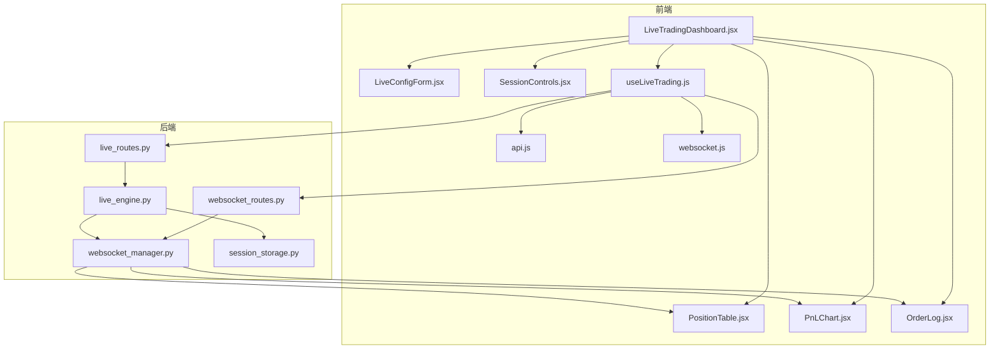
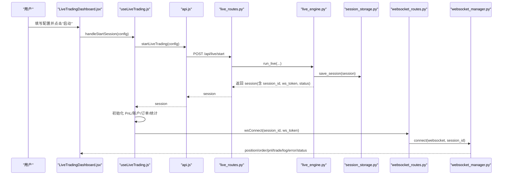
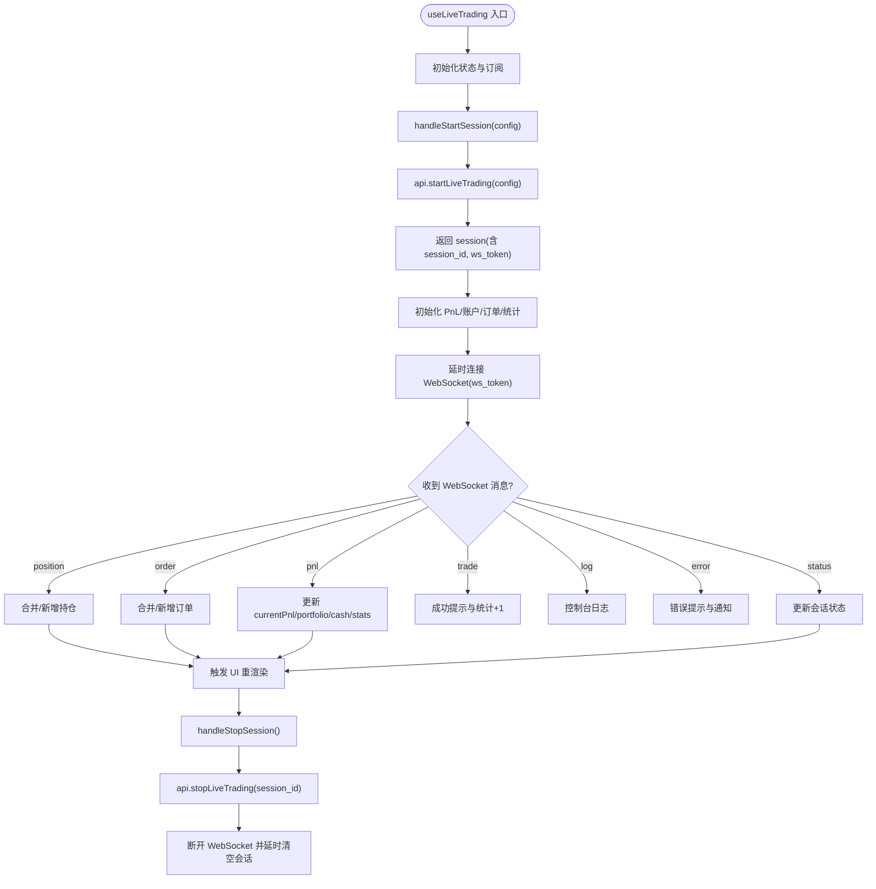
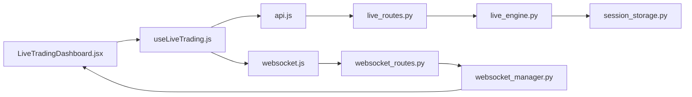

# 实时监控组件

<cite>
**本文引用的文件列表**
- [LiveConfigForm.jsx](file://frontend/src/components/LiveTrading/LiveConfigForm.jsx)
- [SessionControls.jsx](file://frontend/src/components/LiveTrading/SessionControls.jsx)
- [PositionTable.jsx](file://frontend/src/components/LiveTrading/PositionTable.jsx)
- [PnLChart.jsx](file://frontend/src/components/LiveTrading/PnLChart.jsx)
- [OrderLog.jsx](file://frontend/src/components/LiveTrading/OrderLog.jsx)
- [useLiveTrading.js](file://frontend/src/hooks/useLiveTrading.js)
- [LiveTradingDashboard.jsx](file://frontend/src/pages/LiveTradingDashboard.jsx)
- [api.js](file://frontend/src/services/api.js)
- [websocket.js](file://frontend/src/services/websocket.js)
- [live_routes.py](file://backend/src/routes/live_routes.py)
- [websocket_routes.py](file://backend/src/routes/websocket_routes.py)
- [live_engine.py](file://backend/src/service/live_engine.py)
- [websocket_manager.py](file://backend/src/service/websocket_manager.py)
- [session_storage.py](file://backend/src/db/session_storage.py)
</cite>

## 目录
1. [引言](#引言)
2. [项目结构](#项目结构)
3. [核心组件](#核心组件)
4. [架构总览](#架构总览)
5. [详细组件分析](#详细组件分析)
6. [依赖关系分析](#依赖关系分析)
7. [性能考量](#性能考量)
8. [故障排查指南](#故障排查指南)
9. [结论](#结论)

## 引言
本文件围绕实时监控组件的设计与实现展开，聚焦于 LiveTrading 模块。文档从用户界面到后端引擎与 WebSocket 管理器的全链路进行剖析，重点说明：
- LiveConfigForm 如何配置实盘会话参数并通过 /api/live/start 启动 live_engine 驱动的交易会话；
- SessionControls 组件对会话生命周期（启动/停止/刷新）的控制逻辑；
- PositionTable 通过 WebSocket 实时更新持仓数据，与 websocket_manager 建立连接并处理 position_update 消息；
- PnLChart 动态绘制实时盈亏曲线，结合 session_storage 中的会话状态进行数据绑定；
- OrderLog 对订单状态变更事件的监听与展示机制；
- 所有实时数据通过 useLiveTrading.js 自定义 Hook 统一管理的架构设计，并给出高频率数据更新下的性能调优方案。

## 项目结构
前端采用组件化与 Hook 分离职责：页面负责布局与状态聚合，Hook 负责业务逻辑与数据流，服务层封装 API 请求与 WebSocket 连接；后端以 FastAPI 路由为入口，LiveEngine 驱动策略执行，WebSocketManager 负责广播，SessionStorage 提供持久化。

图表来源
- [LiveTradingDashboard.jsx](file://frontend/src/pages/LiveTradingDashboard.jsx#L1-L173)
- [useLiveTrading.js](file://frontend/src/hooks/useLiveTrading.js#L1-L276)
- [api.js](file://frontend/src/services/api.js#L1-L405)
- [websocket.js](file://frontend/src/services/websocket.js#L1-L287)
- [live_routes.py](file://backend/src/routes/live_routes.py#L1-L430)
- [websocket_routes.py](file://backend/src/routes/websocket_routes.py#L1-L243)
- [live_engine.py](file://backend/src/service/live_engine.py#L1-L338)
- [websocket_manager.py](file://backend/src/service/websocket_manager.py#L1-L401)
- [session_storage.py](file://backend/src/db/session_storage.py#L1-L393)

章节来源
- [LiveTradingDashboard.jsx](file://frontend/src/pages/LiveTradingDashboard.jsx#L1-L173)
- [useLiveTrading.js](file://frontend/src/hooks/useLiveTrading.js#L1-L276)
- [live_routes.py](file://backend/src/routes/live_routes.py#L1-L430)

## 核心组件
- LiveConfigForm：表单配置实盘会话参数（资产类别、策略、交易对、交易所、模式、时间框架、初始资金、手续费），提交后调用 useLiveTrading 的启动函数。
- SessionControls：显示会话状态与 ID，提供启动/停止/刷新按钮，禁用无效状态按钮。
- PositionTable：展示未平仓头寸，包含符号、方向、数量、均价、现价、未实现盈亏与百分比。
- PnLChart：基于 lightweight-charts 的折线图，按时间戳绘制累计盈亏曲线，根据当前盈亏切换线条颜色。
- OrderLog：展示订单历史，包含时间、符号、方向、类型、数量、价格、成交进度、平均成交价、状态、手续费等。
- useLiveTrading：统一管理会话、实时数据（持仓、订单、PnL、统计）、WebSocket 连接与错误通知，封装启动/停止/刷新逻辑。
- API/WebSocket 服务：api.js 封装 HTTP 接口，websocket.js 封装 WebSocket 连接与心跳重连。

章节来源
- [LiveConfigForm.jsx](file://frontend/src/components/LiveTrading/LiveConfigForm.jsx#L1-L241)
- [SessionControls.jsx](file://frontend/src/components/LiveTrading/SessionControls.jsx#L1-L93)
- [PositionTable.jsx](file://frontend/src/components/LiveTrading/PositionTable.jsx#L1-L99)
- [PnLChart.jsx](file://frontend/src/components/LiveTrading/PnLChart.jsx#L1-L113)
- [OrderLog.jsx](file://frontend/src/components/LiveTrading/OrderLog.jsx#L1-L139)
- [useLiveTrading.js](file://frontend/src/hooks/useLiveTrading.js#L1-L276)
- [api.js](file://frontend/src/services/api.js#L1-L405)
- [websocket.js](file://frontend/src/services/websocket.js#L1-L287)

## 架构总览
下图展示了从前端到后端的完整交互流程：用户在前端填写配置并点击“启动”，后端启动 live_engine 并返回会话信息；随后前端使用会话 ID 和 ws_token 建立 WebSocket 连接，后端通过 WebSocketManager 广播 position/order/pnl/trade/log/error/status 等消息。

图表来源
- [LiveTradingDashboard.jsx](file://frontend/src/pages/LiveTradingDashboard.jsx#L1-L173)
- [useLiveTrading.js](file://frontend/src/hooks/useLiveTrading.js#L1-L276)
- [api.js](file://frontend/src/services/api.js#L203-L217)
- [live_routes.py](file://backend/src/routes/live_routes.py#L102-L176)
- [live_engine.py](file://backend/src/service/live_engine.py#L105-L269)
- [session_storage.py](file://backend/src/db/session_storage.py#L60-L124)
- [websocket_routes.py](file://backend/src/routes/websocket_routes.py#L21-L219)
- [websocket_manager.py](file://backend/src/service/websocket_manager.py#L45-L118)

## 详细组件分析

### LiveConfigForm：会话参数配置与启动
- 支持资产类别（加密货币/股票），动态加载交易所列表；
- 校验与默认值（时间框架、初始资金、手续费）；
- 提交时将资产类别注入配置并回调父组件的启动函数。

章节来源
- [LiveConfigForm.jsx](file://frontend/src/components/LiveTrading/LiveConfigForm.jsx#L1-L241)

### SessionControls：会话生命周期控制
- 显示会话状态标签与 session_id 缩略；
- 启动：当无会话或已停止时显示“开始交易”按钮；
- 停止：弹出确认框，避免误操作；
- 刷新：拉取最新状态与订单列表。

章节来源
- [SessionControls.jsx](file://frontend/src/components/LiveTrading/SessionControls.jsx#L1-L93)

### PositionTable：持仓实时更新
- 列定义：符号、方向（LONG/SHORT）、数量、均价、现价、未实现盈亏、盈亏百分比；
- 百分比计算：若未提供则基于均价与数量推导；
- 使用 Ant Design Table 渲染，支持空状态文案。

章节来源
- [PositionTable.jsx](file://frontend/src/components/LiveTrading/PositionTable.jsx#L1-L99)

### PnLChart：实时盈亏曲线
- 初始化 lightweight-charts，设置透明背景、网格、边框；
- 添加零线（保本线）与最后值显示；
- 数据映射：将时间戳转换为秒级时间，按时间排序；
- 颜色切换：根据当前 PnL 正负切换线条颜色。

章节来源
- [PnLChart.jsx](file://frontend/src/components/LiveTrading/PnLChart.jsx#L1-L113)

### OrderLog：订单状态变更监听与展示
- 状态图标与颜色：创建、提交中、接受、部分成交、已成交、已取消、已拒绝；
- 成交进度：显示已成交/总量与百分比；
- 时间格式化：使用 dayjs 展示 HH:mm:ss 并悬浮显示完整时间；
- 表格滚动：右侧列较多时启用纵向滚动。

章节来源
- [OrderLog.jsx](file://frontend/src/components/LiveTrading/OrderLog.jsx#L1-L139)

### useLiveTrading.js：统一数据与生命周期管理
- 状态管理：session、positions、orders、pnlHistory、currentPnl、portfolioValue、cash、stats；
- WebSocket 处理：按消息类型更新对应状态，包括 position/order/pnl/trade/log/error/status；
- 启动流程：调用 /api/live/start，初始化 PnL/账户/订单/统计，延时手动连接 WebSocket；
- 停止流程：调用 /api/live/stop，断开 WebSocket，延时清空会话；
- 刷新流程：拉取会话状态与订单列表；
- 自动加载：挂载时尝试加载活跃会话并自动连接。

图表来源
- [useLiveTrading.js](file://frontend/src/hooks/useLiveTrading.js#L1-L276)

章节来源
- [useLiveTrading.js](file://frontend/src/hooks/useLiveTrading.js#L1-L276)

### 后端：REST 与 WebSocket 路由
- /api/live/start：校验配置、调用 run_live 创建会话并返回 session；
- /api/live/stop：校验会话存在性与活动状态，优雅停止并返回最终状态；
- /api/live/status/{session_id}：返回会话详情；
- /api/live/sessions：按状态/活跃度筛选会话；
- /api/live/exchanges：返回可用交易所信息；
- /api/live/orders/{session_id}：返回会话订单；
- /ws/live/{session_id}?token=...：鉴权后连接，广播 position/order/pnl/trade/log/error/status。

章节来源
- [live_routes.py](file://backend/src/routes/live_routes.py#L102-L176)
- [live_routes.py](file://backend/src/routes/live_routes.py#L191-L261)
- [live_routes.py](file://backend/src/routes/live_routes.py#L263-L289)
- [live_routes.py](file://backend/src/routes/live_routes.py#L295-L345)
- [live_routes.py](file://backend/src/routes/live_routes.py#L347-L397)
- [live_routes.py](file://backend/src/routes/live_routes.py#L399-L430)
- [websocket_routes.py](file://backend/src/routes/websocket_routes.py#L21-L219)

### 引擎与存储：live_engine 与 websocket_manager
- live_engine.run_live：构建 store/broker/data_feed，初始化 cerebro，添加分析器，后台线程运行，更新状态并保存到数据库；
- websocket_manager：维护每个会话的连接池，广播 position/order/pnl/trade/log/error/status，清理死连接，统计连接数。

章节来源
- [live_engine.py](file://backend/src/service/live_engine.py#L105-L269)
- [live_engine.py](file://backend/src/service/live_engine.py#L277-L338)
- [websocket_manager.py](file://backend/src/service/websocket_manager.py#L1-L401)
- [session_storage.py](file://backend/src/db/session_storage.py#L60-L124)

## 依赖关系分析
- 前端依赖：
  - useLiveTrading 依赖 api.js 与 websocket.js；
  - LiveTradingDashboard 聚合各子组件并消费 useLiveTrading；
  - 各组件仅依赖自身 props，耦合度低。
- 后端依赖：
  - live_routes 依赖 live_engine 与 session_manager；
  - websocket_routes 依赖 websocket_manager 与 session_manager；
  - live_engine 依赖 session_storage 与 broker/adapters。

图表来源
- [LiveTradingDashboard.jsx](file://frontend/src/pages/LiveTradingDashboard.jsx#L1-L173)
- [useLiveTrading.js](file://frontend/src/hooks/useLiveTrading.js#L1-L276)
- [api.js](file://frontend/src/services/api.js#L1-L405)
- [websocket.js](file://frontend/src/services/websocket.js#L1-L287)
- [live_routes.py](file://backend/src/routes/live_routes.py#L1-L430)
- [websocket_routes.py](file://backend/src/routes/websocket_routes.py#L1-L243)
- [live_engine.py](file://backend/src/service/live_engine.py#L1-L338)
- [session_storage.py](file://backend/src/db/session_storage.py#L1-L393)
- [websocket_manager.py](file://backend/src/service/websocket_manager.py#L1-L401)

章节来源
- [useLiveTrading.js](file://frontend/src/hooks/useLiveTrading.js#L1-L276)
- [live_routes.py](file://backend/src/routes/live_routes.py#L1-L430)
- [websocket_routes.py](file://backend/src/routes/websocket_routes.py#L1-L243)
- [live_engine.py](file://backend/src/service/live_engine.py#L1-L338)
- [websocket_manager.py](file://backend/src/service/websocket_manager.py#L1-L401)
- [session_storage.py](file://backend/src/db/session_storage.py#L1-L393)

## 性能考量
- WebSocket 心跳与重连
  - 前端心跳间隔可配置，默认 30 秒发送一次 ping，收到 pong 即视为存活；
  - 最大重连次数与间隔可配置，避免风暴重连；
  - 连接关闭时停止心跳并清理定时器，防止内存泄漏。
- 数据更新频率优化
  - useLiveTrading 对 position/order/pnl 采用浅合并策略，减少不必要的数组重建；
  - PnLHistory 仅追加新点，不全量替换，避免图表重绘抖动；
  - PositionTable/OrderLog 使用固定列宽与虚拟滚动（如需）降低 DOM 负担。
- 后端广播效率
  - WebSocketManager 使用连接集合副本遍历，避免迭代期间修改；
  - 广播失败的连接被清理，降低后续广播成本；
  - 位置/订单/PnL/交易/日志/错误/状态均以 JSON 文本传输，消息体简洁。
- 前端渲染优化建议
  - 将高频更新拆分为独立组件，使用 memo 包裹或 useMemo/useCallback；
  - 图表数据按时间排序后批量 setData，避免逐条更新；
  - 订单与持仓列表使用 rowKey 基于唯一标识，提升表格 diff 效率。

章节来源
- [websocket.js](file://frontend/src/services/websocket.js#L1-L287)
- [useLiveTrading.js](file://frontend/src/hooks/useLiveTrading.js#L1-L276)
- [PnLChart.jsx](file://frontend/src/components/LiveTrading/PnLChart.jsx#L1-L113)
- [PositionTable.jsx](file://frontend/src/components/LiveTrading/PositionTable.jsx#L1-L99)
- [OrderLog.jsx](file://frontend/src/components/LiveTrading/OrderLog.jsx#L1-L139)
- [websocket_manager.py](file://backend/src/service/websocket_manager.py#L91-L149)

## 故障排查指南
- 启动失败
  - 检查 /api/live/start 返回的错误信息，确认策略名称、交易对、时间框架、交易所配置是否有效；
  - 若返回 403，请检查后端环境变量 LIVE_TRADING_ENABLED。
- WebSocket 无法连接
  - 确认 ws_token 与 session_id 正确传递；
  - 查看前端日志与后端 /ws/live/{session_id} 的鉴权日志；
  - 若连接频繁断开，检查心跳间隔与重连次数配置。
- 数据不同步
  - 使用“刷新”按钮重新拉取会话状态与订单；
  - 检查后端 WebSocketManager 的连接计数与会话列表。
- 停止异常
  - 确认会话处于活动状态后再停止；
  - 查看后端日志定位 stop_live 的异常原因。

章节来源
- [live_routes.py](file://backend/src/routes/live_routes.py#L102-L176)
- [websocket_routes.py](file://backend/src/routes/websocket_routes.py#L152-L219)
- [useLiveTrading.js](file://frontend/src/hooks/useLiveTrading.js#L182-L205)

## 结论
该实时监控组件通过清晰的前后端分层与统一的数据管理 Hook，实现了从配置、启动、生命周期控制到实时数据展示的完整闭环。前端以组件为中心，后端以路由与引擎为核心，WebSocketManager 提供稳定的广播通道，session_storage 保障会话持久化。在高频数据场景下，建议继续优化前端渲染与后端广播路径，确保系统在高并发与高吞吐下的稳定性与可观测性。