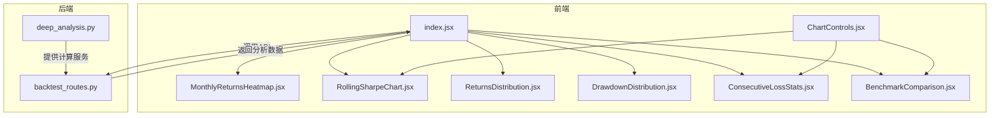
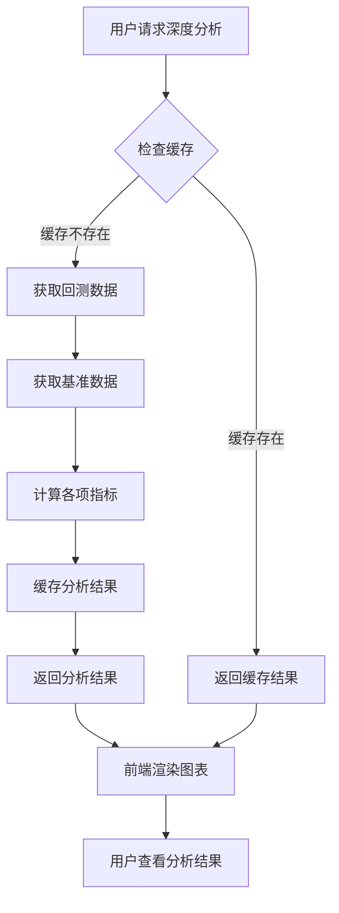
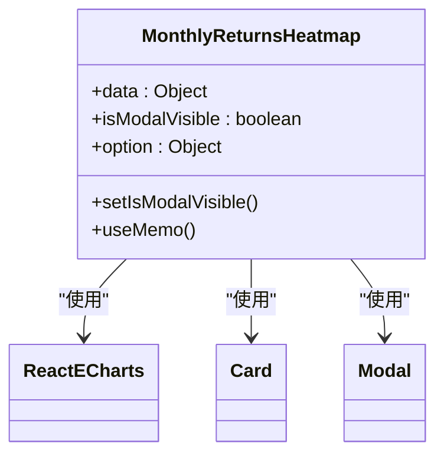
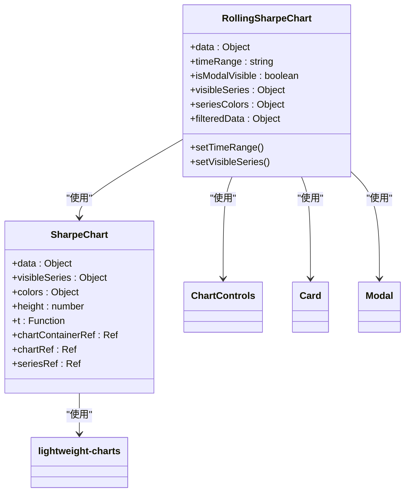
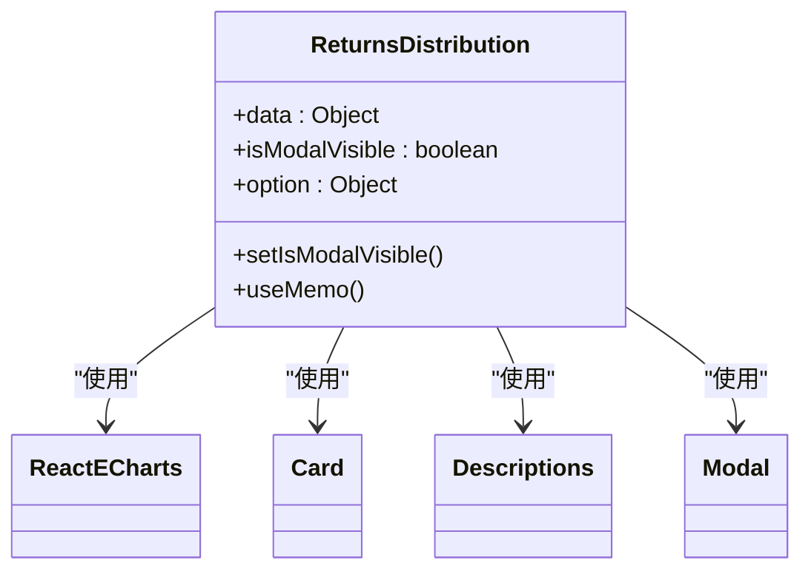
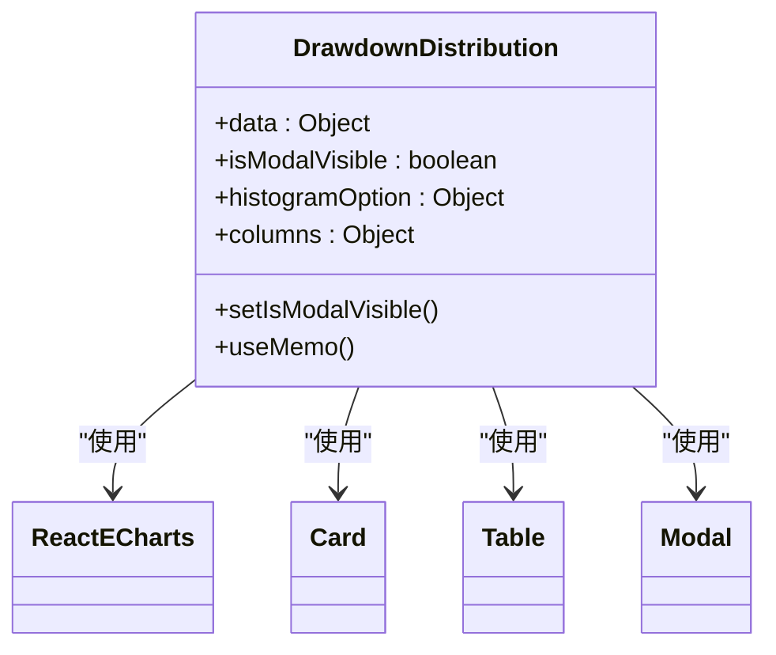
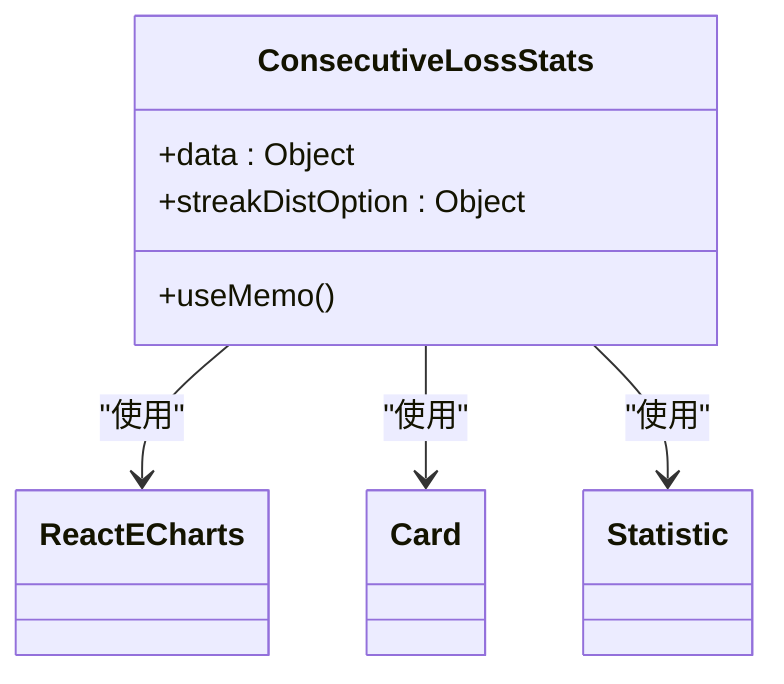
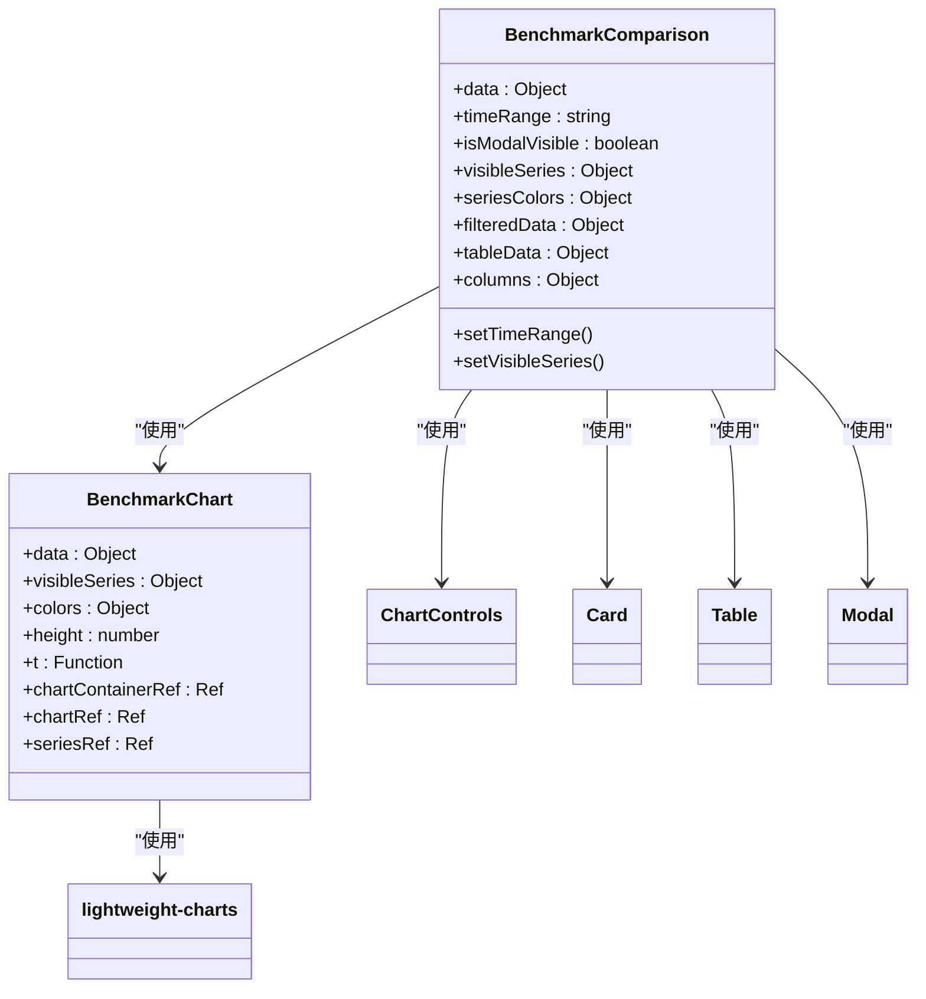
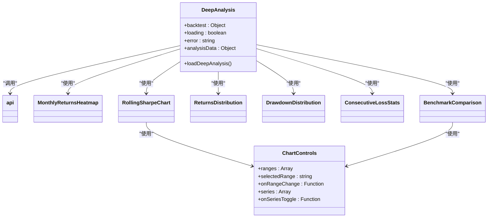
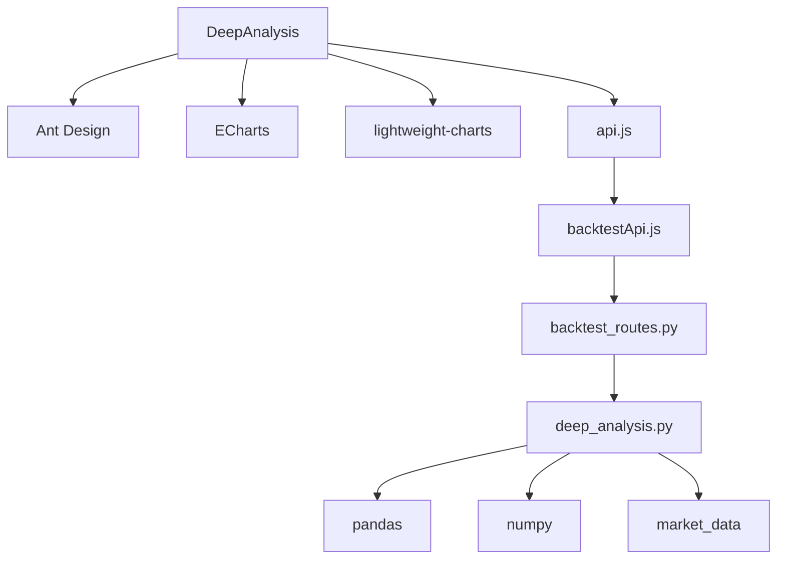

# 深度分析图表控件

<cite>
**本文档引用的文件**   
- [index.jsx](file://frontend/src/components/DeepAnalysis/index.jsx)
- [BenchmarkComparison.jsx](file://frontend/src/components/DeepAnalysis/BenchmarkComparison.jsx)
- [ChartControls.jsx](file://frontend/src/components/DeepAnalysis/ChartControls.jsx)
- [ConsecutiveLossStats.jsx](file://frontend/src/components/DeepAnalysis/ConsecutiveLossStats.jsx)
- [DrawdownDistribution.jsx](file://frontend/src/components/DeepAnalysis/DrawdownDistribution.jsx)
- [MonthlyReturnsHeatmap.jsx](file://frontend/src/components/DeepAnalysis/MonthlyReturnsHeatmap.jsx)
- [ReturnsDistribution.jsx](file://frontend/src/components/DeepAnalysis/ReturnsDistribution.jsx)
- [RollingSharpeChart.jsx](file://frontend/src/components/DeepAnalysis/RollingSharpeChart.jsx)
- [api.js](file://frontend/src/services/api.js)
- [backtestApi.js](file://frontend/src/services/backtestApi.js)
- [deep_analysis.py](file://backend/src/service/deep_analysis.py)
- [backtest_routes.py](file://backend/src/routes/backtest_routes.py)
- [BacktestDetailModal.jsx](file://frontend/src/components/BacktestHistory/BacktestDetailModal.jsx)
- [DEEP_ANALYSIS_FEATURE.md](file://docs/DEEP_ANALYSIS_FEATURE.md)
</cite>

## 目录
1. [简介](#简介)
2. [项目结构](#项目结构)
3. [核心组件](#核心组件)
4. [架构概述](#架构概述)
5. [详细组件分析](#详细组件分析)
6. [依赖分析](#依赖分析)
7. [性能考虑](#性能考虑)
8. [故障排查指南](#故障排查指南)
9. [结论](#结论)
10. [附录](#附录)

## 简介
深度分析图表控件是回测系统中的关键可视化组件，为用户提供高级的策略性能分析功能。该控件通过多个子组件的组合，实现了对回测结果的全面深入分析，包括月度收益热图、滚动夏普比率、收益分布、回撤分析、连续亏损统计和基准对比等六个核心分析维度。系统采用前后端分离架构，后端负责复杂的数据计算和分析，前端负责数据的可视化展示，通过缓存机制确保了高性能的用户体验。

## 项目结构
深度分析功能的实现涉及前后端多个模块的协同工作。前端组件位于`frontend/src/components/DeepAnalysis/`目录下，包含6个核心可视化组件和1个主容器组件。后端服务位于`backend/src/service/deep_analysis.py`，负责所有分析指标的计算。API路由定义在`backend/src/routes/backtest_routes.py`中，通过RESTful接口连接前后端。整个功能通过`docs/DEEP_ANALYSIS_FEATURE.md`文档进行详细说明和指导。

**图表来源**
- [index.jsx](file://frontend/src/components/DeepAnalysis/index.jsx)
- [backtest_routes.py](file://backend/src/routes/backtest_routes.py)
- [deep_analysis.py](file://backend/src/service/deep_analysis.py)

**章节来源**
- [index.jsx](file://frontend/src/components/DeepAnalysis/index.jsx)
- [DEEP_ANALYSIS_FEATURE.md](file://docs/DEEP_ANALYSIS_FEATURE.md)

## 核心组件
深度分析图表控件由多个专门化的子组件构成，每个组件负责特定类型的分析可视化。主容器组件`index.jsx`负责协调数据获取和布局管理，其他六个子组件分别实现不同的分析图表。所有组件都遵循React函数式组件的设计模式，使用Hooks管理状态和副作用。组件间通过props进行数据传递，确保了良好的封装性和可维护性。该控件支持响应式布局，能够在不同屏幕尺寸下提供良好的用户体验。

**章节来源**
- [index.jsx](file://frontend/src/components/DeepAnalysis/index.jsx)
- [BenchmarkComparison.jsx](file://frontend/src/components/DeepAnalysis/BenchmarkComparison.jsx)
- [ConsecutiveLossStats.jsx](file://frontend/src/components/DeepAnalysis/ConsecutiveLossStats.jsx)

## 架构概述
深度分析功能采用分层架构设计，从前端用户界面到后端数据处理形成了清晰的数据流。当用户请求深度分析时，前端通过API调用触发后端计算，后端首先检查缓存，如果存在则直接返回结果，否则进行完整的分析计算并将结果缓存。这种架构设计既保证了首次访问的准确性，又确保了后续访问的高性能。系统使用ECharts和lightweight-charts两种图表库，根据不同的可视化需求选择合适的工具。

**图表来源**
- [backtest_routes.py](file://backend/src/routes/backtest_routes.py)
- [deep_analysis.py](file://backend/src/service/deep_analysis.py)
- [DEEP_ANALYSIS_FEATURE.md](file://docs/DEEP_ANALYSIS_FEATURE.md)

**章节来源**
- [DEEP_ANALYSIS_FEATURE.md](file://docs/DEEP_ANALYSIS_FEATURE.md)
- [backtest_routes.py](file://backend/src/routes/backtest_routes.py)

## 详细组件分析
深度分析图表控件的每个子组件都针对特定的分析需求进行了专门设计和优化，共同构成了完整的深度分析解决方案。

### 月度收益热图分析
月度收益热图组件通过颜色编码的方式直观展示策略在不同月份的收益表现，帮助用户识别季节性模式和周期性特征。

**图表来源**
- [MonthlyReturnsHeatmap.jsx](file://frontend/src/components/DeepAnalysis/MonthlyReturnsHeatmap.jsx)

**章节来源**
- [MonthlyReturnsHeatmap.jsx](file://frontend/src/components/DeepAnalysis/MonthlyReturnsHeatmap.jsx)

### 滚动夏普比率分析
滚动夏普比率组件展示策略风险调整后收益的时间变化趋势，通过与基准的对比帮助用户评估策略的稳定性。

**图表来源**
- [RollingSharpeChart.jsx](file://frontend/src/components/DeepAnalysis/RollingSharpeChart.jsx)
- [ChartControls.jsx](file://frontend/src/components/DeepAnalysis/ChartControls.jsx)

**章节来源**
- [RollingSharpeChart.jsx](file://frontend/src/components/DeepAnalysis/RollingSharpeChart.jsx)

### 收益分布分析
收益分布组件通过直方图展示每日收益的分布情况，并提供详细的统计指标，帮助用户理解策略的收益特征。

**图表来源**
- [ReturnsDistribution.jsx](file://frontend/src/components/DeepAnalysis/ReturnsDistribution.jsx)

**章节来源**
- [ReturnsDistribution.jsx](file://frontend/src/components/DeepAnalysis/ReturnsDistribution.jsx)

### 回撤分布分析
回撤分布组件分析策略的最大回撤和平均回撤，并通过直方图展示回撤深度的分布情况。

**图表来源**
- [DrawdownDistribution.jsx](file://frontend/src/components/DeepAnalysis/DrawdownDistribution.jsx)

**章节来源**
- [DrawdownDistribution.jsx](file://frontend/src/components/DeepAnalysis/DrawdownDistribution.jsx)

### 连续亏损统计分析
连续亏损统计组件识别策略的最大连亏周期，评估策略的稳定性和风险承受能力。

**图表来源**
- [ConsecutiveLossStats.jsx](file://frontend/src/components/DeepAnalysis/ConsecutiveLossStats.jsx)

**章节来源**
- [ConsecutiveLossStats.jsx](file://frontend/src/components/DeepAnalysis/ConsecutiveLossStats.jsx)

### 基准对比分析
基准对比组件将策略表现与SPY和沪深300等基准进行对比，计算Alpha、Beta、相关性等专业指标。

**图表来源**
- [BenchmarkComparison.jsx](file://frontend/src/components/DeepAnalysis/BenchmarkComparison.jsx)
- [ChartControls.jsx](file://frontend/src/components/DeepAnalysis/ChartControls.jsx)

**章节来源**
- [BenchmarkComparison.jsx](file://frontend/src/components/DeepAnalysis/BenchmarkComparison.jsx)

### 主容器与控制组件
主容器组件负责整体布局和数据流管理，控制组件提供时间范围和系列可见性等交互功能。

**图表来源**
- [index.jsx](file://frontend/src/components/DeepAnalysis/index.jsx)
- [ChartControls.jsx](file://frontend/src/components/DeepAnalysis/ChartControls.jsx)

**章节来源**
- [index.jsx](file://frontend/src/components/DeepAnalysis/index.jsx)
- [ChartControls.jsx](file://frontend/src/components/DeepAnalysis/ChartControls.jsx)

## 依赖分析
深度分析图表控件依赖于多个前端UI库和图表库，同时也与后端服务紧密耦合。前端依赖Ant Design作为UI组件库，使用ECharts和lightweight-charts分别处理复杂的统计图表和金融图表。后端依赖pandas和numpy进行数据分析和计算。API层通过`api.js`统一管理所有服务调用，确保了前后端通信的一致性和可靠性。整个系统通过模块化设计，降低了组件间的耦合度，提高了代码的可维护性。

**图表来源**
- [api.js](file://frontend/src/services/api.js)
- [backtestApi.js](file://frontend/src/services/backtestApi.js)
- [deep_analysis.py](file://backend/src/service/deep_analysis.py)

**章节来源**
- [api.js](file://frontend/src/services/api.js)
- [deep_analysis.py](file://backend/src/service/deep_analysis.py)

## 性能考虑
深度分析功能在设计时充分考虑了性能因素，通过多种机制确保系统的高效运行。后端采用缓存机制，首次计算后将结果存储在数据库中，后续请求直接返回缓存结果，避免了重复计算。前端实现懒加载和按需渲染，只有在用户查看特定分析时才加载相关数据。对于大数据集，系统采用分页和限制显示数量的策略，防止页面卡顿。图表库的选择也考虑了性能因素，lightweight-charts专为金融图表优化，ECharts在大数据量下表现良好。

**章节来源**
- [DEEP_ANALYSIS_FEATURE.md](file://docs/DEEP_ANALYSIS_FEATURE.md)
- [backtest_routes.py](file://backend/src/routes/backtest_routes.py)

## 故障排查指南
当深度分析功能出现问题时，可以从以下几个方面进行排查：首先检查回测数据是否包含`equity_curve`字段，这是深度分析的基础数据；其次确认数据库迁移是否完成，`deep_analysis`列必须存在；然后检查网络连接，确保能够获取基准数据；最后查看前后端日志，定位具体的错误信息。常见的"请重新运行回测"提示通常是因为旧的回测数据缺少必要的分析字段。

**章节来源**
- [DEEP_ANALYSIS_FEATURE.md](file://docs/DEEP_ANALYSIS_FEATURE.md)
- [backtest_routes.py](file://backend/src/routes/backtest_routes.py)

## 结论
深度分析图表控件是一个功能强大且设计精良的可视化系统，通过六个专业化的子组件为用户提供全面的策略性能分析。系统采用前后端分离架构，结合缓存机制和高效的图表库，实现了高性能的用户体验。组件化的设计使得系统具有良好的可扩展性，可以方便地添加新的分析维度。整体实现遵循了最佳实践，代码结构清晰，文档齐全，为用户提供了专业的量化分析工具。

## 附录
### API端点
- **POST** `/api/backtest/history/{backtest_id}/deep-analysis` - 获取或计算深度分析

### 请求参数
| 参数 | 类型 | 默认值 | 描述 |
|------|------|--------|------|
| benchmarks | string[] | ["SPY", "000300.SS"] | 基准股票代码 |
| rolling_window | number | 60 | 滚动窗口大小（天） |
| risk_free_rate | number | 0.02 | 无风险利率 |

### 响应状态码
| 状态码 | 描述 |
|--------|------|
| 200 | 成功返回分析结果 |
| 400 | 回测数据不完整，需要重新运行 |
| 404 | 回测记录不存在 |
| 500 | 服务器内部错误 |

**章节来源**
- [DEEP_ANALYSIS_FEATURE.md](file://docs/DEEP_ANALYSIS_FEATURE.md)
- [backtest_routes.py](file://backend/src/routes/backtest_routes.py)