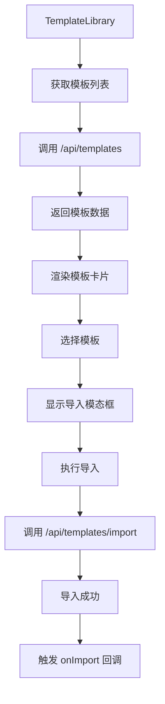
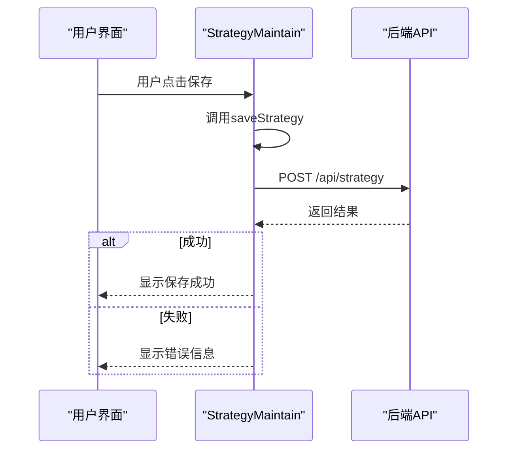

# 策略开发组件

<cite>
**本文档引用的文件**  
- [StrategyEditorPanel.jsx](file://frontend/src/components/StrategyMaintain/StrategyEditorPanel.jsx)
- [StrategyMaintain.css](file://frontend/src/components/StrategyMaintain/StrategyMaintain.css)
- [TemplateLibrary.jsx](file://frontend/src/components/StrategyMaintain/TemplateLibrary/TemplateLibrary.jsx)
- [TemplateCard.jsx](file://frontend/src/components/StrategyMaintain/TemplateLibrary/TemplateCard.jsx)
- [TemplateImportModal.jsx](file://frontend/src/components/StrategyMaintain/TemplateLibrary/TemplateImportModal.jsx)
- [NewStrategyModal.jsx](file://frontend/src/components/StrategyMaintain/NewStrategyModal.jsx)
- [AnalysisModal.jsx](file://frontend/src/components/StrategyMaintain/AnalysisModal.jsx)
- [api.js](file://frontend/src/services/api.js)
- [StrategyMaintain.jsx](file://frontend/src/pages/StrategyMaintain.jsx)
- [strategy_sandbox.py](file://backend/src/service/strategy_sandbox.py)
- [strategy_templates.py](file://backend/src/service/strategy_templates.py)
- [atr_trailing_stop.py](file://backend/resources/strategy/templates/atr_trailing_stop.py)
</cite>

## 目录
1. [策略开发组件概述](#策略开发组件概述)
2. [StrategyEditorPanel 与 Monaco Editor 集成](#strategyeditorpanel-与-monaco-editor-集成)
3. [TemplateLibrary 组件设计](#templatelibrary-组件设计)
4. [NewStrategyModal 与 AnalysisModal 组件](#newstrategymodal-与-analysismodal-组件)
5. [组件间状态传递与后端通信](#组件间状态传递与后端通信)
6. [组件扩展指南](#组件扩展指南)

## 策略开发组件概述

策略开发组件是系统中用于创建、编辑和管理交易策略的核心模块。该模块提供了一个集成的开发环境，允许用户通过图形界面进行策略代码的编写、调试和分析。主要功能包括策略代码编辑、AI辅助分析、模板库管理以及新策略的创建。整个模块围绕StrategyMaintain组件构建，通过多个子组件协同工作，实现了完整的策略生命周期管理。

**Section sources**
- [StrategyMaintain.jsx](file://frontend/src/pages/StrategyMaintain.jsx#L1-L208)

## StrategyEditorPanel 与 Monaco Editor 集成

StrategyEditorPanel组件集成了Monaco Editor，为用户提供专业的代码编辑体验。该组件通过@monaco-editor/react库封装，实现了代码高亮、语法检查和自动补全等高级功能。编辑器配置为Python语言模式，采用vs-dark主题，确保在暗色背景下有良好的可读性。通过设置automaticLayout: true，编辑器能够响应式地适应容器大小变化。

编辑器的核心功能通过props从父组件传递，包括当前代码内容(code)、代码更新函数(setCode)以及策略保存函数(saveStrategy)。组件结构分为三个部分：顶部工具栏包含策略选择器(StrategySelector)，中间区域为代码编辑器本身，底部为操作按钮(通过EditorActions组件实现)。这种布局确保了用户界面的清晰和操作的便捷性。

当用户在编辑器中修改代码时，onChange事件会触发setCode函数，将最新的代码内容同步到React状态中。保存操作则通过调用saveStrategy函数，将当前策略名称和代码内容发送到后端/api/strategy端点进行持久化存储。整个过程通过loading状态进行控制，防止在请求期间产生重复操作。

**Section sources**
- [StrategyEditorPanel.jsx](file://frontend/src/components/StrategyMaintain/StrategyEditorPanel.jsx#L1-L83)
- [StrategyMaintain.css](file://frontend/src/components/StrategyMaintain/StrategyMaintain.css#L96-L102)

## TemplateLibrary 组件设计

TemplateLibrary组件提供了一个完整的策略模板管理系统，包含TemplateCard和TemplateImportModal两个核心子组件。该组件从后端/api/templates端点获取所有可用的策略模板，这些模板与backend/resources/strategy/templates/目录中的Python文件相对应。

TemplateCard组件以卡片形式展示每个模板的详细信息，包括模板名称、难度等级、分类、描述、市场类型和参数列表。卡片设计采用Ant Design的图标和标签，通过getDifficultyName和getCategoryName函数实现国际化支持。用户点击卡片后会触发TemplateImportModal的显示，进入模板导入流程。

TemplateImportModal是一个模态对话框，允许用户为即将导入的策略指定新名称。模态框会显示所选模板的详细信息，包括参数配置，帮助用户理解模板的功能。名称验证规则要求名称以字母开头，只能包含字母、数字和下划线，确保与后端文件系统兼容。导入操作通过/api/templates/import端点完成，成功后会触发onImport回调，更新父组件的状态。

**Diagram sources**
- [TemplateLibrary.jsx](file://frontend/src/components/StrategyMaintain/TemplateLibrary/TemplateLibrary.jsx#L1-L144)
- [TemplateCard.jsx](file://frontend/src/components/StrategyMaintain/TemplateLibrary/TemplateCard.jsx#L1-L66)
- [TemplateImportModal.jsx](file://frontend/src/components/StrategyMaintain/TemplateLibrary/TemplateImportModal.jsx#L1-L106)

**Section sources**
- [TemplateLibrary.jsx](file://frontend/src/components/StrategyMaintain/TemplateLibrary/TemplateLibrary.jsx#L1-L144)
- [TemplateCard.jsx](file://frontend/src/components/StrategyMaintain/TemplateLibrary/TemplateCard.jsx#L1-L66)
- [TemplateImportModal.jsx](file://frontend/src/components/StrategyMaintain/TemplateLibrary/TemplateImportModal.jsx#L1-L106)
- [strategy_templates.py](file://backend/src/service/strategy_templates.py#L1-L378)

## NewStrategyModal 与 AnalysisModal 组件

NewStrategyModal组件用于创建新的策略文件。当用户点击"新建"按钮时，该模态框会显示一个输入框，要求用户输入新策略的名称。输入框包含实时验证和键盘事件处理，支持Enter键确认和Escape键取消。创建成功后，会使用预设的模板代码初始化新策略，并将其设置为当前编辑的策略。

AnalysisModal组件用于展示AI分析的结果。该模态框采用较大的尺寸(最大宽度800px)，以适应Markdown格式的分析报告。内容通过ReactMarkdown组件渲染，支持富文本显示。模态框包含标题、滚动内容区域和关闭按钮，提供了良好的阅读体验。当AI分析完成时，分析结果会通过content属性传递给该组件并显示。

这两个模态组件都采用了标准的模态框设计模式：通过overlay背景层捕获外部点击事件以关闭模态框，内部内容区域阻止事件冒泡以防止意外关闭。样式定义在StrategyMaintain.css中，确保了视觉一致性。

**Section sources**
- [NewStrategyModal.jsx](file://frontend/src/components/StrategyMaintain/NewStrategyModal.jsx#L1-L62)
- [AnalysisModal.jsx](file://frontend/src/components/StrategyMaintain/AnalysisModal.jsx#L1-L32)

## 组件间状态传递与后端通信

策略开发组件通过props和React状态管理组件间的通信。StrategyMaintain作为根组件，维护着所有共享状态，如策略列表(strategies)、当前选中策略(selectedStrategy)、代码内容(code)和加载状态(codeLoading)。这些状态通过props向下传递给子组件，形成单向数据流。

对于需要回调的交互操作，如策略保存、AI分析等，父组件将相应的处理函数作为props传递给子组件。例如，StrategyEditorPanel接收saveStrategy函数作为prop，当用户点击保存按钮时调用该函数。这种模式确保了状态管理的集中化和可预测性。

与后端的通信通过services/api.js中的api对象实现。该服务封装了所有API调用，包括策略相关的getStrategies、getStrategy、saveStrategy，以及模板相关的getTemplates、importTemplate。API调用使用fetch并集成认证令牌，确保请求的安全性。错误处理通过parseResponse函数统一管理，对401未授权状态进行特殊处理，自动重定向到登录页面。

**Diagram sources**
- [StrategyMaintain.jsx](file://frontend/src/pages/StrategyMaintain.jsx#L1-L208)
- [api.js](file://frontend/src/services/api.js#L76-L95)

**Section sources**
- [StrategyMaintain.jsx](file://frontend/src/pages/StrategyMaintain.jsx#L1-L208)
- [api.js](file://frontend/src/services/api.js#L1-L403)

## 组件扩展指南

要添加新的策略模板，需要在backend/resources/strategy/templates/目录中创建新的Python文件，并在backend/src/service/strategy_templates.py中注册。模板文件应遵循标准的Backtrader策略结构，包含必要的文档字符串和参数定义。在strategy_templates.py中，使用_register_template函数注册新模板，提供ID、名称、分类、难度等级、描述和参数等元数据。

要扩展编辑功能，可以在StrategySelector组件中添加新的操作按钮。例如，可以添加一个"格式化代码"按钮，集成代码格式化服务。实现时需要在StrategyMaintain组件中定义相应的处理函数，并通过props传递给子组件。同时，需要在services/api.js中添加新的API方法，与后端服务进行通信。

所有扩展都应遵循现有架构规范：保持单向数据流，将状态管理集中在父组件，通过props传递数据和回调函数。样式应定义在相应的CSS文件中，避免内联样式。国际化支持应使用useTranslation钩子，确保文本内容可翻译。

**Section sources**
- [strategy_templates.py](file://backend/src/service/strategy_templates.py#L59-L316)
- [atr_trailing_stop.py](file://backend/resources/strategy/templates/atr_trailing_stop.py#L1-L51)