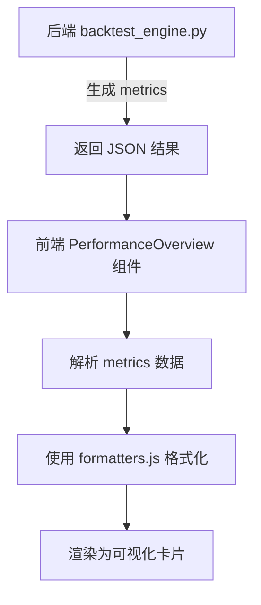
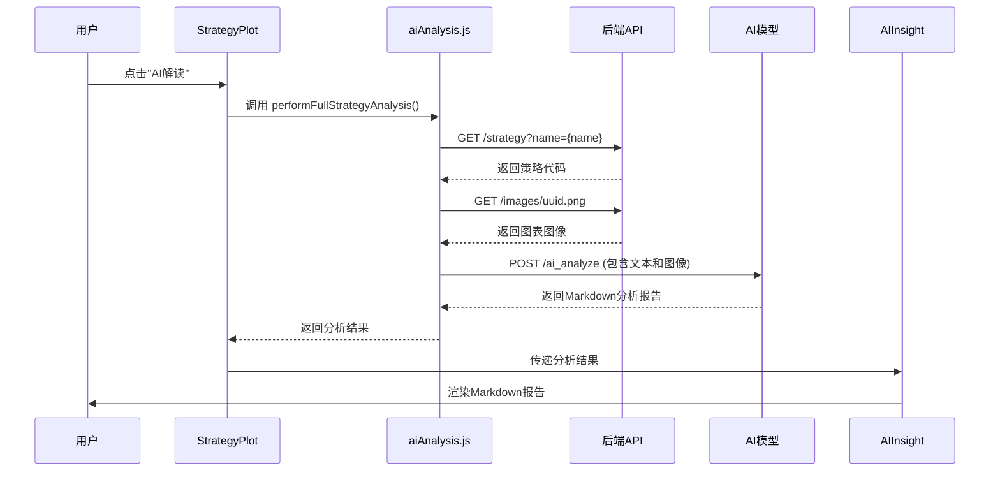

# 策略执行组件

<cite>
**本文档引用文件**   
- [StrategyConfigForm.jsx](file://frontend/src/components/RunStrategy/StrategyConfigForm.jsx)
- [PerformanceOverview.jsx](file://frontend/src/components/RunStrategy/PerformanceOverview.jsx)
- [StrategyPlot.jsx](file://frontend/src/components/RunStrategy/StrategyPlot.jsx)
- [TradeLog.jsx](file://frontend/src/components/RunStrategy/TradeLog.jsx)
- [AIInsight.jsx](file://frontend/src/components/RunStrategy/AIInsight.jsx)
- [api.js](file://frontend/src/services/api.js)
- [aiAnalysis.js](file://frontend/src/services/aiAnalysis.js)
- [backtest_engine.py](file://backend/src/service/backtest_engine.py)
- [backtest_storage.py](file://backend/src/db/backtest_storage.py)
- [api_routes.py](file://backend/src/routes/api_routes.py)
- [RunStrategy.jsx](file://frontend/src/pages/RunStrategy.jsx)
- [formatters.js](file://frontend/src/utils/formatters.js)
- [RunStrategy.css](file://frontend/src/components/RunStrategy/RunStrategy.css)
</cite>

## 目录
1. [引言](#引言)
2. [策略参数配置与提交流程](#策略参数配置与提交流程)
3. [回测结果性能概览](#回测结果性能概览)
4. [策略信号与K线图可视化](#策略信号与k线图可视化)
5. [交易记录与AI分析展示](#交易记录与ai分析展示)
6. [状态管理与数据共享机制](#状态管理与数据共享机制)
7. [性能优化建议](#性能优化建议)
8. [结论](#结论)

## 引言
本文档全面解析策略执行与回测展示组件的实现机制，围绕RunStrategy模块展开。详细说明前端组件如何协同工作，从用户输入参数到后端执行回测，再到结果的可视化展示与AI分析的完整流程。文档将深入分析StrategyConfigForm、PerformanceOverview、StrategyPlot、TradeLog和AIInsight等核心组件的实现细节，以及它们与后端服务的交互方式。

## 策略参数配置与提交流程

该流程始于`StrategyConfigForm`组件，它负责收集用户输入的回测参数。用户通过表单输入资产代码（ticker）、时间范围（startDate, endDate）、初始资金（initialCash）、手续费率（commission）和下单数量（stake）等核心参数。该组件还支持动态加载可用的策略列表，并允许用户选择特定策略。

当用户选择一个策略时，`RunStrategy`页面组件会通过`api.js`中的`getStrategyParams`方法，向后端`/strategy/{name}/params`接口发起请求。后端`backtest_engine.py`中的`extract_strategy_params`函数会解析用户策略文件（Python类）中的`params`属性，提取出所有可配置的参数（如均线周期、布林带宽度等），并将其返回给前端。`StrategyConfigForm`随后会动态渲染这些策略专属参数，允许用户进行覆盖。

用户点击“运行回测”按钮后，`RunStrategy`组件会调用`api.runBacktest`方法。该方法将所有配置参数（包括基础参数和策略参数）打包成一个JSON对象，通过POST请求提交至后端的`/backtest`接口。

**Section sources**
- [StrategyConfigForm.jsx](file://frontend/src/components/RunStrategy/StrategyConfigForm.jsx#L1-L248)
- [RunStrategy.jsx](file://frontend/src/pages/RunStrategy.jsx#L1-L176)
- [api.js](file://frontend/src/services/api.js#L97-L103)
- [backtest_engine.py](file://backend/src/service/backtest_engine.py#L302-L400)
- [api_routes.py](file://backend/src/routes/api_routes.py#L215-L286)

## 回测结果性能概览

`PerformanceOverview`组件负责解析和展示回测的核心性能指标。当后端`backtest_engine.py`执行完回测后，它会返回一个包含`metrics`字段的JSON对象。该对象由Backtrader框架的多个分析器（Analyzer）生成，包含了夏普比率（Sharpe Ratio）、最大回撤（Max Drawdown）、年化收益（Annual Returns）、总交易数（Total Trades）和胜率（Win Rate）等关键数据。

`PerformanceOverview`组件接收这个结果对象，通过`formatters.js`中的`formatCurrency`、`formatPercent`和`formatNumber`等工具函数对数值进行格式化。它使用网格布局（`stats-grid`）清晰地展示主要指标，并通过`detail-card`提供更详细的分析，如按年份划分的收益、交易详情和时间回撤分析。组件通过条件渲染为正收益和负收益分别应用不同的颜色样式（绿色或红色），使用户能快速评估策略表现。



**Diagram sources **
- [PerformanceOverview.jsx](file://frontend/src/components/RunStrategy/PerformanceOverview.jsx#L1-L182)
- [backtest_engine.py](file://backend/src/service/backtest_engine.py#L354-L364)
- [formatters.js](file://frontend/src/utils/formatters.js#L1-L13)

**Section sources**
- [PerformanceOverview.jsx](file://frontend/src/components/RunStrategy/PerformanceOverview.jsx#L1-L182)
- [backtest_engine.py](file://backend/src/service/backtest_engine.py#L302-L400)

## 策略信号与K线图可视化

`StrategyPlot`组件利用后端生成的静态图表进行可视化。`backtest_engine.py`在执行回测时，会调用Backtrader的`cerebro.plot()`方法，生成包含K线、策略信号（如买卖点）和资金曲线的图表，并将其保存为PNG文件。该文件的URL路径（`plot_url`）会作为回测结果的一部分返回给前端。

`StrategyPlot`组件接收`result.plot_url`，并将其作为``标签的`src`属性进行渲染。为了提升用户体验，该组件还实现了图表放大功能，用户点击“最大化”按钮后，可以在一个模态框中查看高清图表，并支持缩放和重置操作。

```mermaid
graph TB
subgraph "后端"
A[backtest_engine.py] --> B[调用 cerebro.plot()]
B --> C[生成 PNG 图像]
C --> D[保存至 IMAGES_DIR]
D --> E[返回 /images/uuid.png URL]
end
subgraph "前端"
E --> F[StrategyPlot.jsx]
F --> G[]
G --> H[渲染 K线与策略信号]
end
```

**Diagram sources **
- [StrategyPlot.jsx](file://frontend/src/components/RunStrategy/StrategyPlot.jsx#L1-L180)
- [backtest_engine.py](file://backend/src/service/backtest_engine.py#L366-L381)

**Section sources**
- [StrategyPlot.jsx](file://frontend/src/components/RunStrategy/StrategyPlot.jsx#L1-L180)
- [backtest_engine.py](file://backend/src/service/backtest_engine.py#L302-L400)

## 交易记录与AI分析展示

### 交易记录展示
`TradeLog`组件负责格式化和展示详细的交易记录。后端`backtest_engine.py`中定义了一个名为`TradeRecorder`的自定义分析器（Analyzer），它继承自`bt.Analyzer`。该分析器通过监听订单状态变化（`notify_order`事件），记录每笔交易的开仓和平仓价格、时间、盈亏和收益率等信息，并将这些数据封装在`trade_details`中返回。

`TradeLog`组件接收`result.metrics.trade_details.trades`数组，将其渲染为一个表格。表格的每一行代表一笔交易，关键字段如净盈亏（Net PnL）和收益率（Return）会根据其正负值应用不同的CSS类（`positive`或`negative`），以直观地显示盈利或亏损。

**Section sources**
- [TradeLog.jsx](file://frontend/src/components/RunStrategy/TradeLog.jsx#L1-L58)
- [backtest_engine.py](file://backend/src/service/backtest_engine.py#L221-L300)

### AI分析展示
`AIInsight`组件通过调用`/api/ai/analyze`端点获取GPT生成的分析报告。当用户在`StrategyPlot`中点击“AI解读”按钮时，`performFullStrategyAnalysis`函数会被触发。该函数会：
1.  从`/strategy`接口获取当前策略的源代码。
2.  从`result.plot_url`下载回测图表图像。
3.  将策略配置、性能指标、最近交易日志和源代码等信息，按照预设的Prompt模板（在`aiAnalysis.js`中定义）进行格式化。
4.  调用`analyzeChart`函数，通过`/ai_analyze`接口将文本提示和图表图像发送给AI模型。

AI模型处理后返回分析报告，内容以Markdown格式返回。`AIInsight`组件使用`ReactMarkdown`库将Markdown内容渲染为富文本，并支持切换不同AI模型的分析结果。报告中包含“思考过程”部分，用户可以展开查看AI的推理链。



**Diagram sources **
- [AIInsight.jsx](file://frontend/src/components/RunStrategy/AIInsight.jsx#L1-L99)
- [StrategyPlot.jsx](file://frontend/src/components/RunStrategy/StrategyPlot.jsx#L26-L65)
- [aiAnalysis.js](file://frontend/src/services/aiAnalysis.js#L59-L169)
- [api.js](file://frontend/src/services/api.js#L51-L57)

**Section sources**
- [AIInsight.jsx](file://frontend/src/components/RunStrategy/AIInsight.jsx#L1-L99)
- [StrategyPlot.jsx](file://frontend/src/components/RunStrategy/StrategyPlot.jsx#L1-L180)
- [aiAnalysis.js](file://frontend/src/services/aiAnalysis.js#L1-L195)

## 状态管理与数据共享机制

各组件间通过`RunStrategy`页面组件的React状态（State）进行回测会话数据的共享。`RunStrategy`组件作为父组件，维护着所有核心状态，如`ticker`、`startDate`、`endDate`、`result`等。这些状态通过props向下传递给`StrategyConfigForm`、`PerformanceOverview`、`TradeLog`和`StrategyPlot`等子组件。

当用户提交回测后，`handleBacktest`函数会更新`result`状态。由于`result`是所有展示组件的依赖项，其更新会触发整个结果区域的重新渲染，从而实现数据的同步。这种基于组件层级的状态提升（Lifting State Up）模式，确保了数据流的单向性和可预测性，避免了状态不一致的问题。

**Section sources**
- [RunStrategy.jsx](file://frontend/src/pages/RunStrategy.jsx#L1-L176)

## 性能优化建议

1.  **大数据量图表渲染优化**：当前使用静态PNG图像，虽然简单但不够灵活。建议集成`Lightweight Charts`库，将后端生成的OHLCV和信号数据以JSON格式传输，由前端进行动态渲染。这可以实现缩放、平移等交互功能，并减少网络传输的图片体积。
2.  **AI分析结果缓存**：AI分析耗时较长，且结果不常变化。建议在`backtest_storage.py`中增强`BacktestStorage`类，将AI分析结果（`ai_analysis`字段）与回测记录一同持久化。当用户再次查看同一回测时，优先从数据库加载已缓存的分析结果，避免重复调用昂贵的AI API。
3.  **前端状态管理**：随着应用复杂度增加，可以考虑引入`Redux`或`Zustand`等状态管理库，将回测会话状态从组件树中抽离，实现更高效的状态管理和跨组件通信。
4.  **后端回测任务异步化**：对于复杂的策略或长周期回测，同步执行可能导致HTTP请求超时。建议将`/backtest`接口改为异步模式，立即返回一个任务ID，然后通过WebSocket或轮询`/backtest/status/{id}`接口来获取最终结果。

## 结论
本系统通过清晰的前后端分离架构，实现了策略回测的完整闭环。前端组件职责分明，通过`RunStrategy`页面进行状态协调；后端利用Backtrader框架执行回测，并通过RESTful API提供数据服务。`backtest_storage.py`确保了结果的持久化，而`AIInsight`组件则通过集成大模型为用户提供深度的策略解读。整体流程高效、可扩展，为量化策略的研发和评估提供了强大的支持。