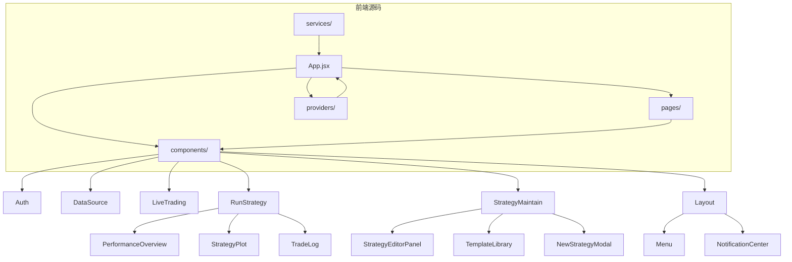
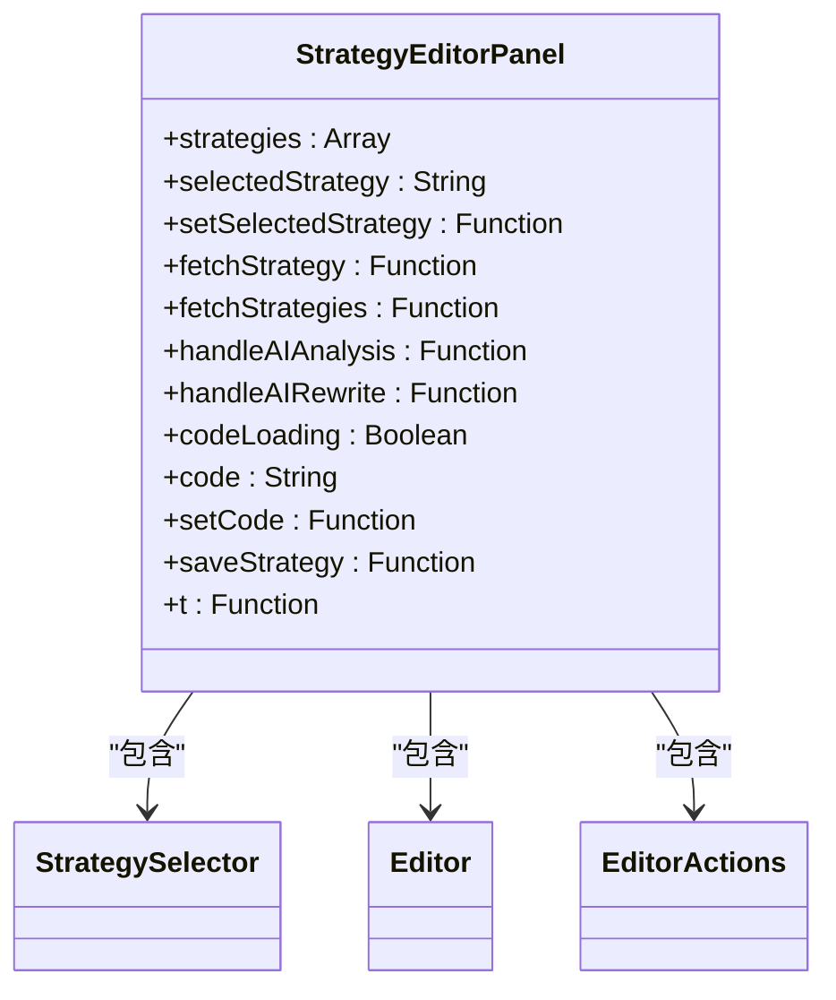
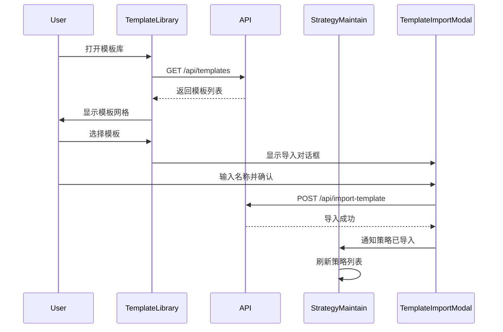
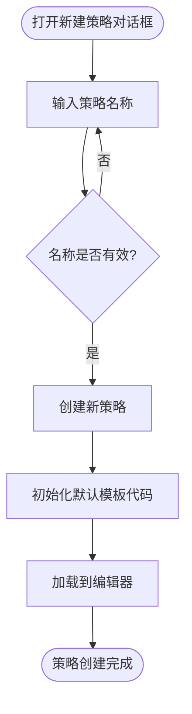
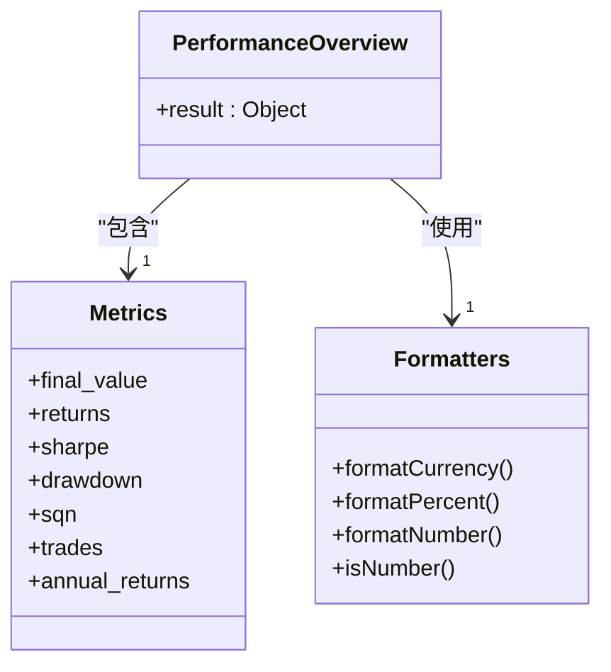
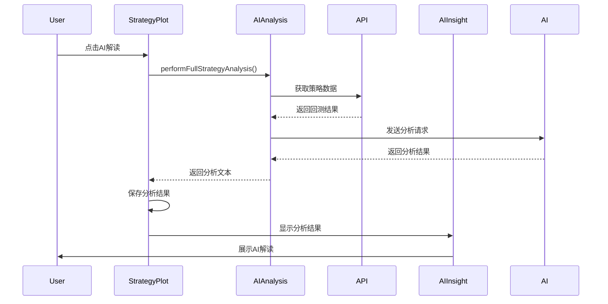
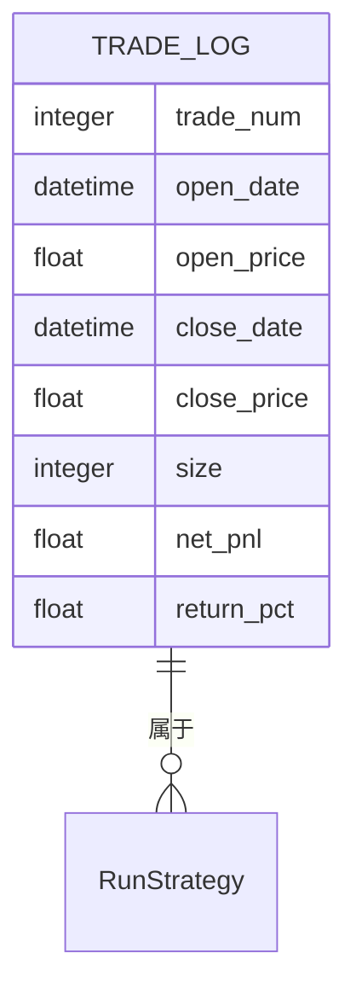
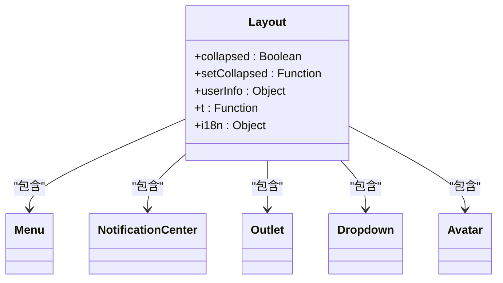
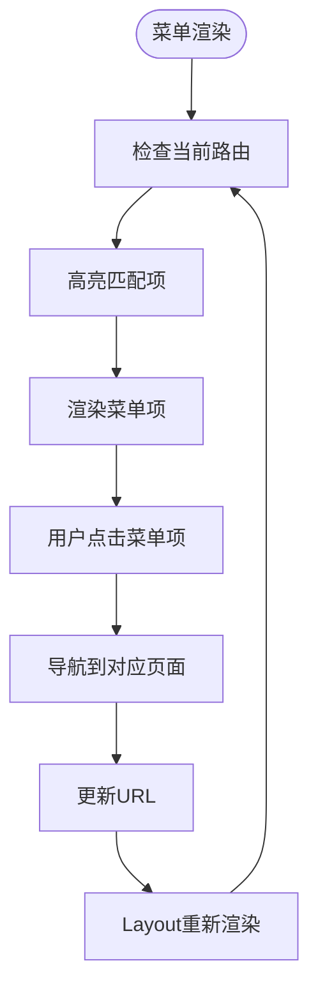
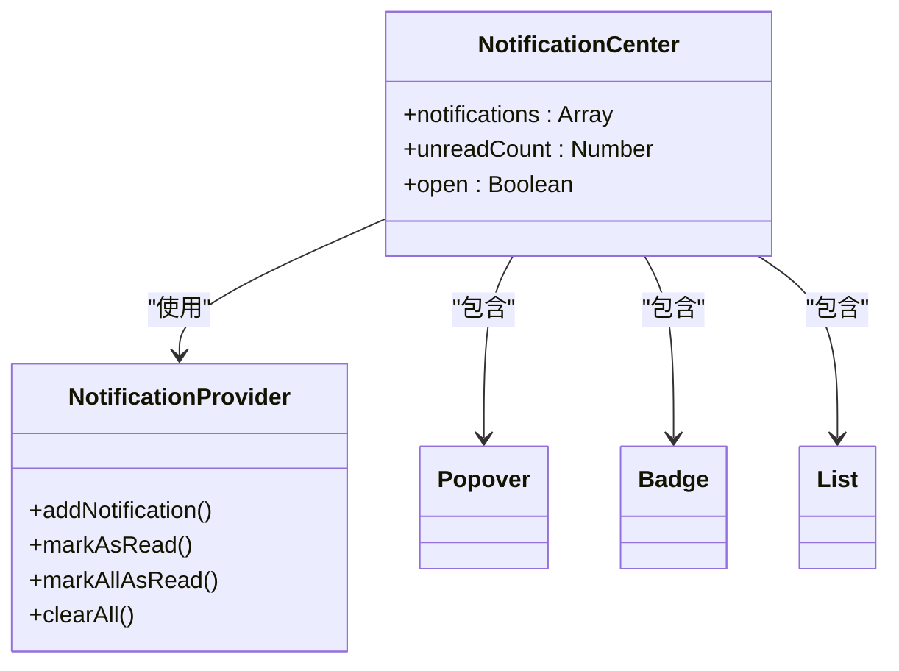

# 组件架构

<cite>
**本文档中引用的文件**  
- [App.jsx](file://frontend/src/App.jsx)
- [main.jsx](file://frontend/src/main.jsx)
- [Layout.jsx](file://frontend/src/components/Layout/Layout.jsx)
- [Menu.jsx](file://frontend/src/components/Layout/Menu.jsx)
- [NotificationCenter.jsx](file://frontend/src/components/Layout/NotificationCenter.jsx)
- [StrategyMaintain.jsx](file://frontend/src/pages/StrategyMaintain.jsx)
- [StrategyEditorPanel.jsx](file://frontend/src/components/StrategyMaintain/StrategyEditorPanel.jsx)
- [TemplateLibrary.jsx](file://frontend/src/components/StrategyMaintain/TemplateLibrary/TemplateLibrary.jsx)
- [NewStrategyModal.jsx](file://frontend/src/components/StrategyMaintain/NewStrategyModal.jsx)
- [RunStrategy.jsx](file://frontend/src/pages/RunStrategy.jsx)
- [PerformanceOverview.jsx](file://frontend/src/components/RunStrategy/PerformanceOverview.jsx)
- [StrategyPlot.jsx](file://frontend/src/components/RunStrategy/StrategyPlot.jsx)
- [TradeLog.jsx](file://frontend/src/components/RunStrategy/TradeLog.jsx)
- [package.json](file://frontend/package.json)
</cite>

## 目录
1. [项目结构](#项目结构)
2. [核心组件](#核心组件)
3. [策略维护模块分析](#策略维护模块分析)
4. [策略运行模块分析](#策略运行模块分析)
5. [布局与全局系统](#布局与全局系统)
6. [UI规范与样式实现](#ui规范与样式实现)
7. [组件复用与扩展指南](#组件复用与扩展指南)

## 项目结构

前端项目采用基于React 18.3和Ant Design 6.1的组件化架构，整体结构清晰，按功能模块组织。`components`目录下包含多个功能域组件，包括Auth（认证）、DataSource（数据源）、LiveTrading（实盘交易）、RunStrategy（策略运行）、StrategyMaintain（策略维护）等。每个组件目录包含其子组件和样式文件，遵循高内聚低耦合的设计原则。

**Diagram sources**
- [App.jsx](file://frontend/src/App.jsx)
- [project_structure](file://)

**Section sources**
- [App.jsx](file://frontend/src/App.jsx)
- [main.jsx](file://frontend/src/main.jsx)

## 核心组件

项目核心组件围绕策略生命周期构建，包括策略维护、策略运行、数据源管理、实盘交易等模块。通过React Router实现路由导航，Ant Design提供UI组件库，Monaco Editor用于策略代码编辑，React Markdown支持AI分析结果渲染。全局状态通过React Context和自定义Hook管理，如`useAuth`处理认证状态，`NotificationProvider`管理通知系统。

**Section sources**
- [App.jsx](file://frontend/src/App.jsx)
- [package.json](file://frontend/package.json)

## 策略维护模块分析

策略维护模块（StrategyMaintain）是策略开发的核心界面，包含策略编辑、模板管理、新建策略等功能。该模块通过`StrategyEditorPanel`、`TemplateLibrary`、`NewStrategyModal`等子组件实现职责分离。

### StrategyEditorPanel 组件

`StrategyEditorPanel`是策略编辑的主工作区，包含策略选择器、代码编辑器和操作按钮。它接收来自父组件的状态和回调函数，实现策略的加载、保存和AI分析功能。代码编辑器使用Monaco Editor，提供Python语法高亮和代码编辑功能。

**Diagram sources**
- [StrategyEditorPanel.jsx](file://frontend/src/components/StrategyMaintain/StrategyEditorPanel.jsx)

### TemplateLibrary 组件

`TemplateLibrary`组件提供策略模板库功能，允许用户浏览和导入预定义的策略模板。它通过API获取模板列表，支持按分类筛选，并通过`TemplateImportModal`实现模板导入功能。

**Diagram sources**
- [TemplateLibrary.jsx](file://frontend/src/components/StrategyMaintain/TemplateLibrary/TemplateLibrary.jsx)
- [StrategyMaintain.jsx](file://frontend/src/pages/StrategyMaintain.jsx)

### NewStrategyModal 组件

`NewStrategyModal`是一个模态对话框，用于创建新策略。用户输入策略名称后，父组件会初始化一个默认策略模板并加载到编辑器中。

**Diagram sources**
- [NewStrategyModal.jsx](file://frontend/src/components/StrategyMaintain/NewStrategyModal.jsx)

**Section sources**
- [StrategyMaintain.jsx](file://frontend/src/pages/StrategyMaintain.jsx)
- [StrategyEditorPanel.jsx](file://frontend/src/components/StrategyMaintain/StrategyEditorPanel.jsx)
- [TemplateLibrary.jsx](file://frontend/src/components/StrategyMaintain/TemplateLibrary/TemplateLibrary.jsx)
- [NewStrategyModal.jsx](file://frontend/src/components/StrategyMaintain/NewStrategyModal.jsx)

## 策略运行模块分析

策略运行模块（RunStrategy）负责执行回测并展示结果，包含配置表单、性能概览、交易日志和策略图表等组件。

### PerformanceOverview 组件

`PerformanceOverview`组件展示回测结果的关键指标，包括最终价值、收益率、夏普比率、最大回撤、胜率等。它接收`result`对象作为props，解析其中的`metrics`数据并格式化显示。

**Diagram sources**
- [PerformanceOverview.jsx](file://frontend/src/components/RunStrategy/PerformanceOverview.jsx)

### StrategyPlot 组件

`StrategyPlot`组件显示策略的可视化图表，并集成AI分析功能。用户可以选择不同的AI模型对策略图表进行解读，分析结果通过`AIInsight`组件展示。

**Diagram sources**
- [StrategyPlot.jsx](file://frontend/src/components/RunStrategy/StrategyPlot.jsx)

### TradeLog 组件

`TradeLog`组件以表格形式展示交易明细，包括交易编号、开仓/平仓时间、价格、数量、净收益和收益率等信息。表格行根据收益正负显示不同颜色。

**Diagram sources**
- [TradeLog.jsx](file://frontend/src/components/RunStrategy/TradeLog.jsx)

**Section sources**
- [RunStrategy.jsx](file://frontend/src/pages/RunStrategy.jsx)
- [PerformanceOverview.jsx](file://frontend/src/components/RunStrategy/PerformanceOverview.jsx)
- [StrategyPlot.jsx](file://frontend/src/components/RunStrategy/StrategyPlot.jsx)
- [TradeLog.jsx](file://frontend/src/components/RunStrategy/TradeLog.jsx)

## 布局与全局系统

### Layout 组件

`Layout`组件提供全局布局框架，包含侧边栏菜单、顶部导航栏和内容区域。它通过`Outlet`组件渲染当前路由的页面内容，实现一致的用户体验。

**Diagram sources**
- [Layout.jsx](file://frontend/src/components/Layout/Layout.jsx)

### Menu 组件

`Menu`组件实现侧边栏导航菜单，包含策略运行、策略维护、数据源、历史记录等主要功能入口。菜单项根据当前路由高亮显示，支持折叠/展开。

**Diagram sources**
- [Menu.jsx](file://frontend/src/components/Layout/Menu.jsx)

### NotificationCenter 组件

`NotificationCenter`组件实现全局通知系统，通过`NotificationProvider`的Context API获取通知数据。它显示未读通知数量，支持标记已读、清空所有通知等功能。

**Diagram sources**
- [NotificationCenter.jsx](file://frontend/src/components/Layout/NotificationCenter.jsx)
- [NotificationProvider.jsx](file://frontend/src/providers/NotificationProvider.jsx)

**Section sources**
- [Layout.jsx](file://frontend/src/components/Layout/Layout.jsx)
- [Menu.jsx](file://frontend/src/components/Layout/Menu.jsx)
- [NotificationCenter.jsx](file://frontend/src/components/Layout/NotificationCenter.jsx)

## UI规范与样式实现

项目遵循Ant Design 6.1的UI规范，采用CSS Modules实现样式隔离。在`package.json`中明确指定了`antd`版本为`^6.1.0`，确保UI一致性。响应式设计通过CSS媒体查询和Ant Design的栅格系统实现，适配不同屏幕尺寸。

主题配置在`App.jsx`中通过`ConfigProvider`设置，采用深色主题算法，自定义了主色调、背景色、边框色等设计令牌。字体使用Inter系统字体栈，确保跨平台显示一致性。

**Section sources**
- [App.jsx](file://frontend/src/App.jsx)
- [Layout.css](file://frontend/src/components/Layout/Layout.css)
- [package.json](file://frontend/package.json)

## 组件复用与扩展指南

### 组件复用最佳实践

1. **Props标准化**：所有组件使用PropTypes定义props类型，确保接口清晰
2. **状态提升**：共享状态应提升到最近的共同祖先组件
3. **自定义Hook**：将通用逻辑封装为自定义Hook，如`useAuth`、`useLiveTrading`
4. **样式复用**：通过CSS变量和Ant Design的Token系统实现设计一致性

### 扩展指南

1. **新增功能模块**：在`components`目录下创建新文件夹，遵循现有命名规范
2. **新增页面**：在`pages`目录下创建新页面组件，并在`App.jsx`中添加路由
3. **新增API服务**：在`services`目录下创建新的API服务文件，封装HTTP请求
4. **国际化支持**：在`locales`目录下对应语言文件中添加新的翻译键值

新开发应遵循现有架构模式，保持代码风格一致，确保可维护性和可扩展性。

**Section sources**
- [App.jsx](file://frontend/src/App.jsx)
- [components/](file://frontend/src/components/)
- [pages/](file://frontend/src/pages/)
- [services/](file://frontend/src/services/)
- [locales/](file://frontend/src/locales/)