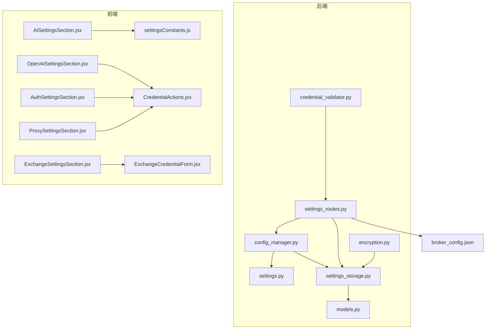
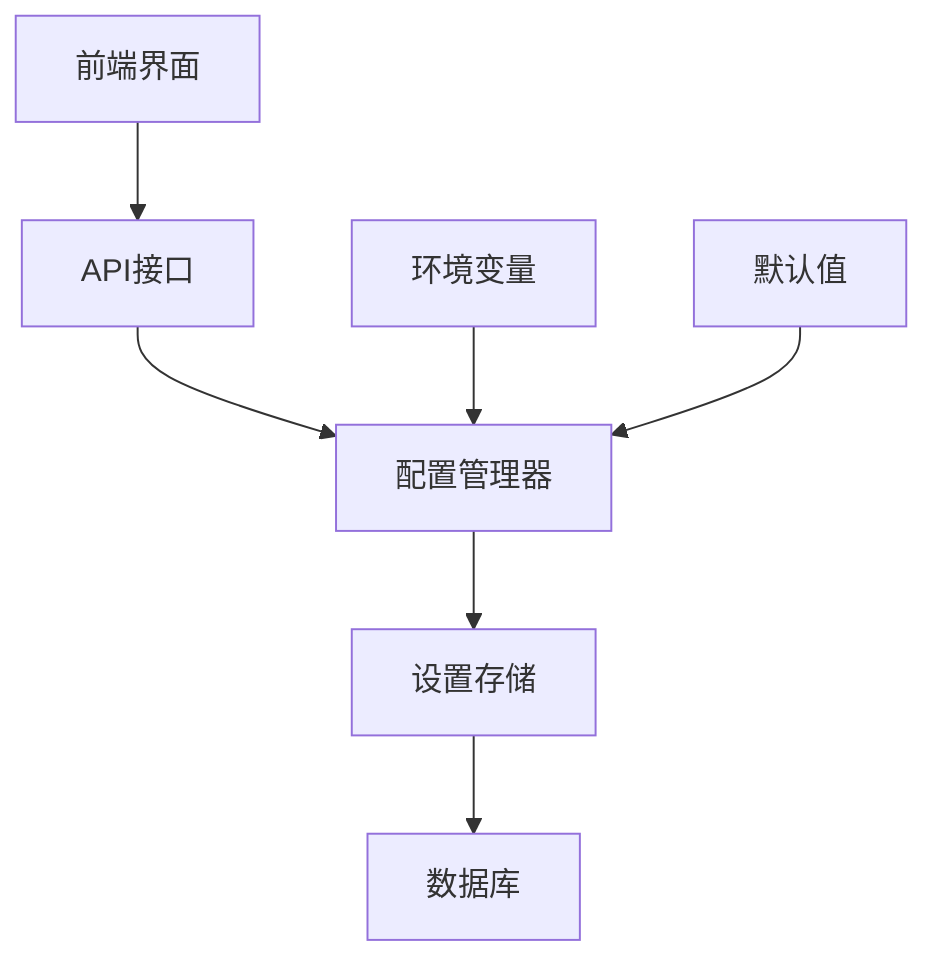
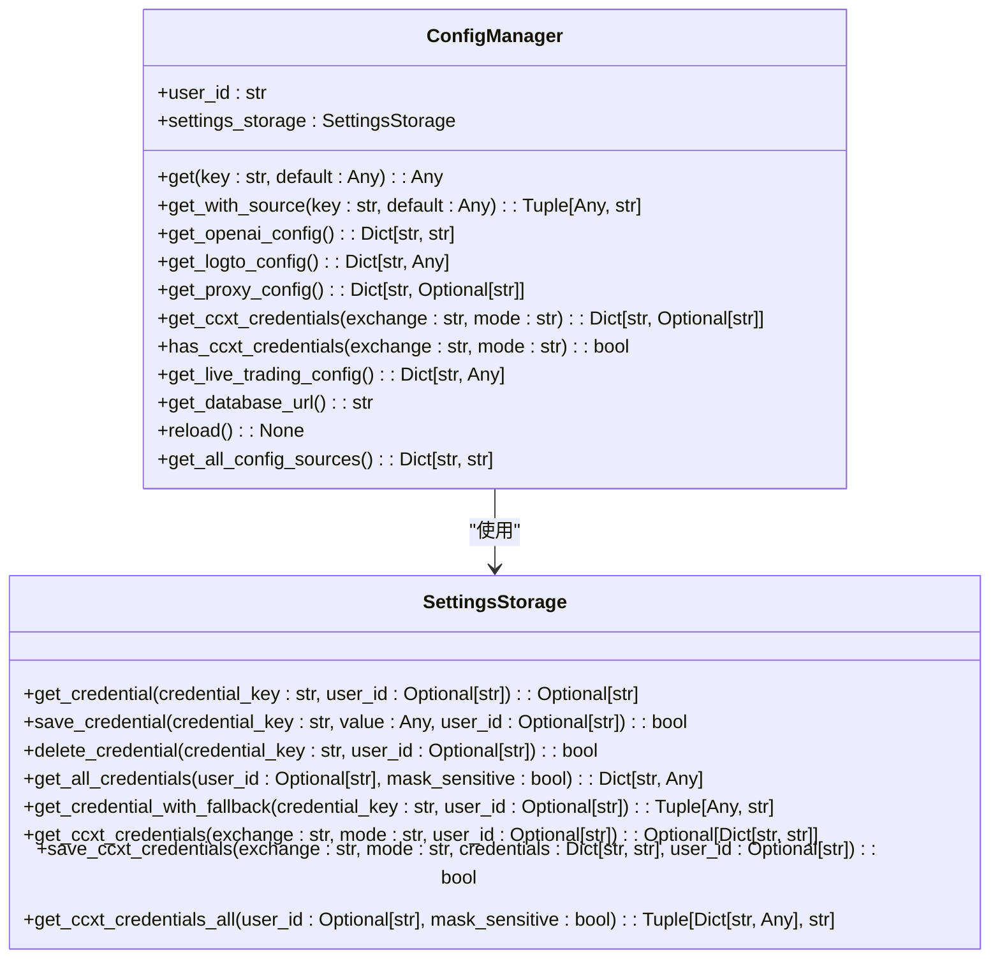
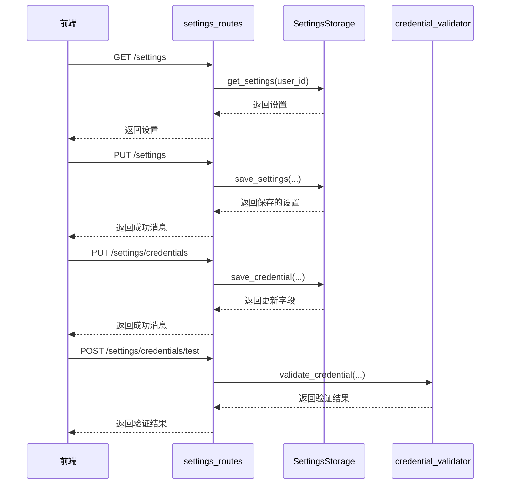
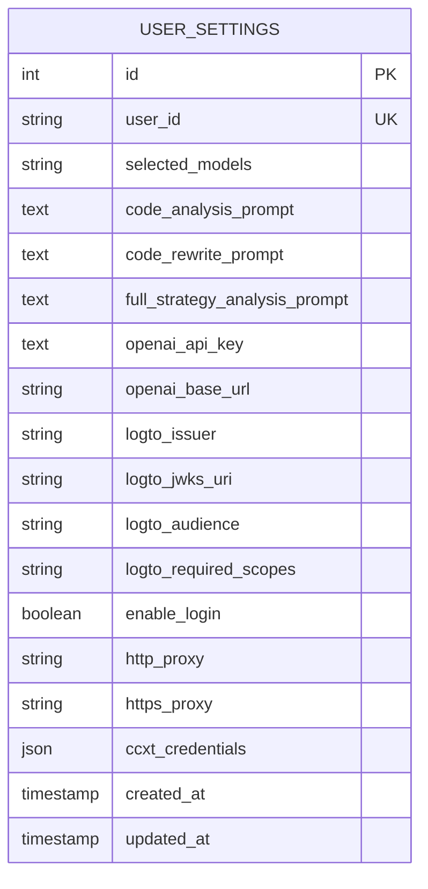
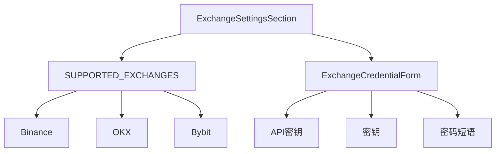
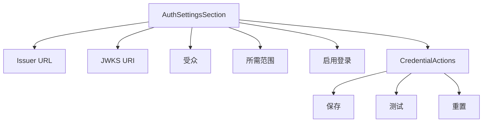
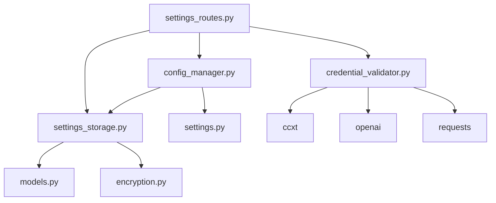

# 设置管理

<cite>
**本文档中引用的文件**   
- [config_manager.py](file://backend/src/config/config_manager.py)
- [settings.py](file://backend/src/config/settings.py)
- [settings_routes.py](file://backend/src/routes/settings_routes.py)
- [settings_storage.py](file://backend/src/db/settings_storage.py)
- [models.py](file://backend/src/db/models.py)
- [encryption.py](file://backend/src/utils/encryption.py)
- [credential_validator.py](file://backend/src/utils/credential_validator.py)
- [broker_config.json](file://backend/resources/config/broker_config.json)
- [AISettingsSection.jsx](file://frontend/src/components/Settings/AISettingsSection.jsx)
- [OpenAISettingsSection.jsx](file://frontend/src/components/Settings/OpenAISettingsSection.jsx)
- [AuthSettingsSection.jsx](file://frontend/src/components/Settings/AuthSettingsSection.jsx)
- [ProxySettingsSection.jsx](file://frontend/src/components/Settings/ProxySettingsSection.jsx)
- [ExchangeSettingsSection.jsx](file://frontend/src/components/Settings/ExchangeSettingsSection.jsx)
- [settingsConstants.js](file://frontend/src/constants/settingsConstants.js)
</cite>

## 更新摘要
**已更改内容**   
- 更新了简介、项目结构、核心组件、架构概述、详细组件分析和故障排除指南部分，以反映新增的交易所和认证设置功能
- 新增了交易所设置和认证设置两个详细组件分析小节
- 更新了架构概述和配置管理器分析的图表以包含新功能

## 目录
1. [简介](#简介)
2. [项目结构](#项目结构)
3. [核心组件](#核心组件)
4. [架构概述](#架构概述)
5. [详细组件分析](#详细组件分析)
6. [依赖分析](#依赖分析)
7. [性能考虑](#性能考虑)
8. [故障排除指南](#故障排除指南)
9. [结论](#结论)

## 简介
本项目中的设置管理模块提供了一个集中化的配置和凭证管理系统，支持用户通过前端界面配置各种设置，同时保持与环境变量配置的向后兼容性。系统采用数据库优先的回退策略，优先从数据库读取用户特定的加密凭证，若未找到则回退到环境变量，最后使用硬编码的默认值。该系统支持管理OpenAI API密钥、Logto身份验证配置、代理设置以及多个交易所（如Binance、OKX、Bybit）的交易凭证。前端提供了直观的界面，允许用户配置AI模型、提示模板、身份验证选项和代理设置，并能测试凭证的有效性。

## 项目结构
设置管理功能主要分布在后端的`src/config`、`src/routes`和`src/db`目录，以及前端的`src/components/Settings`目录中。后端负责提供API接口、数据存储和业务逻辑，前端则提供用户界面进行设置的查看和修改。

**图源**
- [config_manager.py](file://backend/src/config/config_manager.py)
- [settings.py](file://backend/src/config/settings.py)
- [settings_routes.py](file://backend/src/routes/settings_routes.py)
- [settings_storage.py](file://backend/src/db/settings_storage.py)
- [models.py](file://backend/src/db/models.py)
- [encryption.py](file://backend/src/utils/encryption.py)
- [credential_validator.py](file://backend/src/utils/credential_validator.py)
- [broker_config.json](file://backend/resources/config/broker_config.json)
- [AISettingsSection.jsx](file://frontend/src/components/Settings/AISettingsSection.jsx)
- [OpenAISettingsSection.jsx](file://frontend/src/components/Settings/OpenAISettingsSection.jsx)
- [AuthSettingsSection.jsx](file://frontend/src/components/Settings/AuthSettingsSection.jsx)
- [ProxySettingsSection.jsx](file://frontend/src/components/Settings/ProxySettingsSection.jsx)
- [ExchangeSettingsSection.jsx](file://frontend/src/components/Settings/ExchangeSettingsSection.jsx)
- [settingsConstants.js](file://frontend/src/constants/settingsConstants.js)

**节源**
- [config_manager.py](file://backend/src/config/config_manager.py)
- [settings.py](file://backend/src/config/settings.py)
- [settings_routes.py](file://backend/src/routes/settings_routes.py)
- [settings_storage.py](file://backend/src/db/settings_storage.py)
- [models.py](file://backend/src/db/models.py)
- [encryption.py](file://backend/src/utils/encryption.py)
- [credential_validator.py](file://backend/src/utils/credential_validator.py)
- [broker_config.json](file://backend/resources/config/broker_config.json)
- [AISettingsSection.jsx](file://frontend/src/components/Settings/AISettingsSection.jsx)
- [OpenAISettingsSection.jsx](file://frontend/src/components/Settings/OpenAISettingsSection.jsx)
- [AuthSettingsSection.jsx](file://frontend/src/components/Settings/AuthSettingsSection.jsx)
- [ProxySettingsSection.jsx](file://frontend/src/components/Settings/ProxySettingsSection.jsx)
- [ExchangeSettingsSection.jsx](file://frontend/src/components/Settings/ExchangeSettingsSection.jsx)
- [settingsConstants.js](file://frontend/src/constants/settingsConstants.js)

## 核心组件
设置管理的核心是`ConfigManager`类，它提供了统一的接口来访问各种配置和凭证。该类支持数据库优先的回退策略，确保用户可以通过UI配置凭证，同时保持与`.env`文件配置的兼容性。`SettingsStorage`类负责与数据库的交互，处理用户设置和凭证的持久化。前端组件则通过API与后端通信，提供用户友好的界面来管理设置。

**节源**
- [config_manager.py](file://backend/src/config/config_manager.py#L33-L351)
- [settings_storage.py](file://backend/src/db/settings_storage.py#L52-L764)
- [settings_routes.py](file://backend/src/routes/settings_routes.py#L18-L403)

## 架构概述
设置管理系统的架构分为三层：前端界面层、后端API层和数据存储层。前端界面层由多个React组件构成，提供用户交互界面。后端API层通过FastAPI提供RESTful接口，处理前端的请求并调用相应的业务逻辑。数据存储层使用SQLite数据库，通过SQLAlchemy ORM进行数据操作，确保数据的一致性和安全性。

**图源**
- [config_manager.py](file://backend/src/config/config_manager.py)
- [settings_routes.py](file://backend/src/routes/settings_routes.py)
- [settings_storage.py](file://backend/src/db/settings_storage.py)
- [models.py](file://backend/src/db/models.py)

## 详细组件分析

### 配置管理器分析
`ConfigManager`类是设置管理的核心，它提供了多种方法来获取不同类型的配置信息。

**图源**
- [config_manager.py](file://backend/src/config/config_manager.py#L33-L351)
- [settings_storage.py](file://backend/src/db/settings_storage.py#L52-L764)

### API路由分析
`settings_routes.py`文件定义了所有与设置管理相关的API端点，包括获取和更新用户设置、凭证管理以及凭证测试。

**图源**
- [settings_routes.py](file://backend/src/routes/settings_routes.py#L18-L403)
- [settings_storage.py](file://backend/src/db/settings_storage.py#L52-L764)
- [credential_validator.py](file://backend/src/utils/credential_validator.py#L26-L360)

### 数据模型分析
`UserSettingsModel`是设置管理的核心数据模型，用于存储用户的各种设置和凭证。

**图源**
- [models.py](file://backend/src/db/models.py#L611-L680)

**节源**
- [models.py](file://backend/src/db/models.py#L611-L680)

### 交易所设置分析
`ExchangeSettingsSection.jsx`组件提供了用户配置交易所API密钥的界面。该组件使用嵌套标签页结构，允许用户为不同的交易所（Binance、OKX、Bybit）和交易模式（模拟盘、实盘）分别配置凭证。每个交易所的凭证表单由`ExchangeCredentialForm`组件提供，支持API密钥、密钥和可选的密码短语输入。

**图源**
- [ExchangeSettingsSection.jsx](file://frontend/src/components/Settings/ExchangeSettingsSection.jsx#L1-L62)
- [settingsConstants.js](file://frontend/src/constants/settingsConstants.js#L35-L39)
- [ExchangeCredentialForm.jsx](file://frontend/src/components/Settings/ExchangeCredentialForm.jsx#L1-L65)

**节源**
- [ExchangeSettingsSection.jsx](file://frontend/src/components/Settings/ExchangeSettingsSection.jsx#L1-L62)
- [settingsConstants.js](file://frontend/src/constants/settingsConstants.js#L35-L39)
- [ExchangeCredentialForm.jsx](file://frontend/src/components/Settings/ExchangeCredentialForm.jsx#L1-L65)

### 认证设置分析
`AuthSettingsSection.jsx`组件提供了用户配置Logto身份验证设置的界面。该组件允许用户配置身份验证服务器的发行者URL、JWKS URI、受众和所需范围等参数。组件还包含一个开关来启用或禁用登录功能，并提供了测试凭证有效性的功能。

**图源**
- [AuthSettingsSection.jsx](file://frontend/src/components/Settings/AuthSettingsSection.jsx#L1-L89)

**节源**
- [AuthSettingsSection.jsx](file://frontend/src/components/Settings/AuthSettingsSection.jsx#L1-L89)

## 依赖分析
设置管理模块依赖于多个其他模块和外部库。后端依赖于`sqlalchemy`进行数据库操作，`cryptography`进行加密，`ccxt`和`openai`进行API调用验证。前端依赖于`antd`进行UI组件构建。各模块之间的依赖关系清晰，通过API接口进行通信，确保了模块间的松耦合。

**图源**
- [config_manager.py](file://backend/src/config/config_manager.py)
- [settings_routes.py](file://backend/src/routes/settings_routes.py)
- [settings_storage.py](file://backend/src/db/settings_storage.py)
- [models.py](file://backend/src/db/models.py)
- [encryption.py](file://backend/src/utils/encryption.py)
- [credential_validator.py](file://backend/src/utils/credential_validator.py)

## 性能考虑
设置管理系统在设计时考虑了性能因素。`SettingsStorage`类使用了数据库连接池，避免了频繁创建和销毁数据库连接的开销。`ConfigManager`类的设计是线程安全的，可以在多线程环境中使用。对于频繁访问的配置，可以考虑引入缓存机制，但目前的实现已经通过数据库连接池和合理的查询设计保证了良好的性能。

## 故障排除指南
在使用设置管理系统时，可能会遇到一些常见问题。例如，凭证测试失败可能是由于API密钥无效或网络问题导致。如果无法保存设置，可能是数据库连接问题或权限不足。建议检查环境变量配置，确保`ENCRYPTION_KEY`已正确设置，并且数据库文件有正确的读写权限。

**节源**
- [config_manager.py](file://backend/src/config/config_manager.py)
- [settings_storage.py](file://backend/src/db/settings_storage.py)
- [credential_validator.py](file://backend/src/utils/credential_validator.py)

## 结论
设置管理模块为系统提供了灵活且安全的配置管理能力。通过数据库优先的回退策略，用户既可以通过UI方便地管理设置，又能保持与传统环境变量配置的兼容性。系统的模块化设计和清晰的依赖关系使得维护和扩展变得容易。未来可以考虑增加更多的凭证类型支持和更详细的错误日志记录，以进一步提升用户体验。