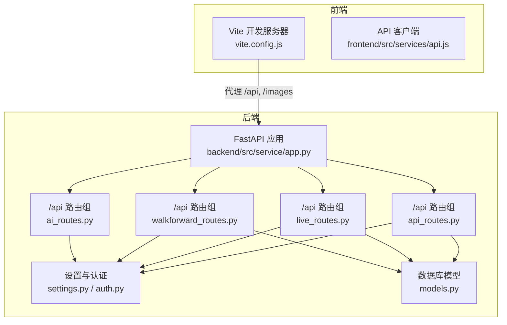
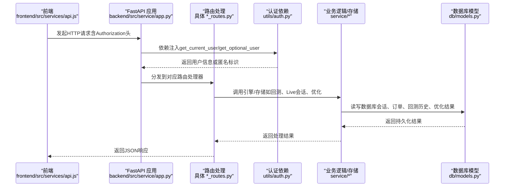
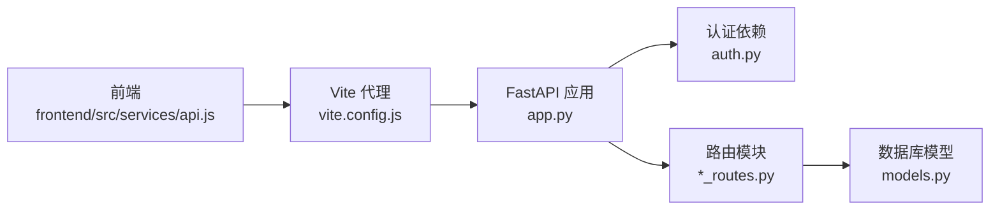

# API端点

<cite>
**本文引用的文件**
- [backend/src/service/app.py](file://backend/src/service/app.py)
- [backend/src/routes/api_routes.py](file://backend/src/routes/api_routes.py)
- [backend/src/routes/live_routes.py](file://backend/src/routes/live_routes.py)
- [backend/src/routes/walkforward_routes.py](file://backend/src/routes/walkforward_routes.py)
- [backend/src/routes/ai_routes.py](file://backend/src/routes/ai_routes.py)
- [backend/src/utils/auth.py](file://backend/src/utils/auth.py)
- [backend/src/config/settings.py](file://backend/src/config/settings.py)
- [backend/src/db/models.py](file://backend/src/db/models.py)
- [frontend/src/services/api.js](file://frontend/src/services/api.js)
- [frontend/vite.config.js](file://frontend/vite.config.js)
- [CLAUDE.md](file://CLAUDE.md)
- [backend/main.py](file://backend/main.py)
</cite>

## 目录
1. [简介](#简介)
2. [项目结构](#项目结构)
3. [核心组件](#核心组件)
4. [架构总览](#架构总览)
5. [详细组件分析](#详细组件分析)
6. [依赖关系分析](#依赖关系分析)
7. [性能考量](#性能考量)
8. [故障排查指南](#故障排查指南)
9. [结论](#结论)
10. [附录](#附录)

## 简介
本文件为基于FastAPI的后端API端点文档，覆盖以下模块的RESTful接口：
- 后台回测与策略：api_routes.py
- 实盘/纸模拟交易：live_routes.py
- 参数优化（滚动窗/锚定窗）：walkforward_routes.py
- 图表AI分析：ai_routes.py

文档说明每个端点的HTTP方法、URL路径、请求参数、请求体结构、响应格式、错误码、认证要求（如get_current_user依赖），并解释路由注册机制（在app.py中通过include_router集成各功能模块路由）。同时提供新增端点的流程参考（CLAUDE.md中的“Adding a New API Endpoint”），以及前后端交互规范（同步更新frontend/src/services/api.js）。

## 项目结构
后端采用FastAPI应用入口，统一在app.py中注册各路由模块；前端通过Vite代理到后端的/api与/images路径。

图表来源
- [backend/src/service/app.py](file://backend/src/service/app.py#L1-L31)
- [frontend/vite.config.js](file://frontend/vite.config.js#L1-L24)
- [frontend/src/services/api.js](file://frontend/src/services/api.js#L1-L255)

章节来源
- [backend/src/service/app.py](file://backend/src/service/app.py#L1-L31)
- [frontend/vite.config.js](file://frontend/vite.config.js#L1-L24)

## 核心组件
- 路由注册与前缀
  - 在app.py中通过include_router将各模块router注册到FastAPI应用，并统一使用前缀/api（除walkforward_routes.py已自带/api前缀）。
- 认证依赖
  - get_current_user：用于需要登录态的端点。
  - get_optional_user：用于可选登录态的端点（如参数优化列表）。
- 设置与环境变量
  - settings.py提供认证开关、代理、数据库、Live Trading开关等配置。
- 数据模型
  - models.py定义了回测历史、参数优化、会话、订单、持仓等数据库模型，支撑历史查询与状态管理。

章节来源
- [backend/src/service/app.py](file://backend/src/service/app.py#L1-L31)
- [backend/src/utils/auth.py](file://backend/src/utils/auth.py#L1-L191)
- [backend/src/config/settings.py](file://backend/src/config/settings.py#L1-L81)
- [backend/src/db/models.py](file://backend/src/db/models.py#L1-L395)

## 架构总览
下图展示了从浏览器到后端API再到服务层与数据库的整体调用链。

图表来源
- [backend/src/service/app.py](file://backend/src/service/app.py#L1-L31)
- [backend/src/utils/auth.py](file://backend/src/utils/auth.py#L1-L191)
- [backend/src/db/models.py](file://backend/src/db/models.py#L1-L395)

## 详细组件分析

### 回测与策略接口（api_routes.py）
- 基础路径前缀：/api
- 认证要求：大多数端点依赖get_current_user，需携带Bearer Token；部分历史查询端点依赖get_optional_user，允许匿名访问。
- 关键端点与行为

1) 获取策略列表
- 方法与路径：GET /api/strategies
- 认证：需要登录态
- 响应：包含策略名称数组
- 错误码：500（内部异常）

2) 获取市场数据
- 方法与路径：POST /api/data
- 请求体：DataRequest（ticker, start_date, end_date）
- 认证：需要登录态
- 响应：包含原始数据
- 错误码：500（内部异常）、502（数据加载失败）

3) 运行回测
- 方法与路径：POST /api/backtest
- 请求体：BacktestRequest（ticker, start_date, end_date, initial_cash, commission, stake, strategy_name）
- 认证：需要登录态
- 行为：生成唯一backtest_id，保存图表至IMAGES_DIR，调用回测引擎，异步保存历史记录（非阻塞），返回backtest_id、指标与图片URL
- 响应：backtest_id, metrics, plot_url
- 错误码：400（策略加载错误）、502（数据加载错误）、500（其他异常）

4) 获取策略代码
- 方法与路径：GET /api/strategy?name=...
- 查询参数：name（可选，默认取第一个可用策略）
- 认证：需要登录态
- 响应：code, name
- 错误码：400（策略加载错误）、404（无策略）、500（内部异常）

5) 保存策略代码
- 方法与路径：POST /api/strategy
- 请求体：StrategyCode（name, code）
- 认证：需要登录态
- 响应：status, message, name
- 错误码：400（策略加载错误）、500（内部异常）

6) 结果分析（AI提示）
- 方法与路径：POST /api/analyze
- 请求体：AnalysisRequest（metrics字典）
- 认证：需要登录态
- 响应：analysis文本
- 错误码：500（内部异常）

7) 回测历史列表
- 方法与路径：POST /api/backtest/history
- 请求体：BacktestHistoryQuery（ticker, strategy_name, start_date, end_date, sort_by, sort_order, limit, offset）
- 认证：可选登录态
- 响应：分页结果（包含记录与总数）
- 错误码：500（内部异常）

8) 获取回测详情
- 方法与路径：GET /api/backtest/history/{backtest_id}
- 路径参数：backtest_id
- 认证：可选登录态
- 响应：单条历史记录
- 错误码：404（未找到）、500（内部异常）

9) 删除回测记录
- 方法与路径：DELETE /api/backtest/history/{backtest_id}
- 路径参数：backtest_id
- 认证：可选登录态
- 响应：status, message
- 错误码：404（未找到）、500（内部异常）

10) 更新AI分析
- 方法与路径：POST /api/backtest/history/{backtest_id}/ai-analysis
- 路径参数：backtest_id
- 请求体：AIAnalysisUpdate（model_name, analysis）
- 认证：可选登录态
- 响应：status, message
- 错误码：404（未找到）、500（内部异常）

- 请求体与响应模型
  - BacktestRequest、DataRequest、StrategyCode、AnalysisRequest、BacktestHistoryQuery、AIAnalysisUpdate
- 错误处理
  - 使用HTTPException返回标准错误码与消息；部分异常转换为400/500/502；日志记录异常堆栈

章节来源
- [backend/src/routes/api_routes.py](file://backend/src/routes/api_routes.py#L1-L341)
- [backend/src/utils/auth.py](file://backend/src/utils/auth.py#L1-L191)
- [backend/src/config/settings.py](file://backend/src/config/settings.py#L1-L81)
- [backend/src/db/models.py](file://backend/src/db/models.py#L257-L316)

### 实盘/纸模拟交易接口（live_routes.py）
- 基础路径前缀：/api
- 认证要求：除健康检查外，均依赖get_current_user
- 关键端点与行为

1) 启动交易会话
- 方法与路径：POST /api/live/start
- 请求体：StartLiveRequest（strategy_name, symbol, exchange, mode, timeframe, initial_cash, commission）
- 认证：需要登录态
- 行为：校验配置、启动会话、返回会话信息
- 响应：会话ID、状态、配置、指标
- 错误码：400（配置/参数无效）、403（未启用Live Trading）、404（策略不存在）、500（内部异常）

2) 停止交易会话
- 方法与路径：POST /api/live/stop
- 请求体：StopLiveRequest（session_id）
- 认证：需要登录态
- 行为：停止会话、返回最终状态与指标
- 响应：session_id, status, final_pnl, total_trades, end_time
- 错误码：404（会话不存在）、500（内部异常）

3) 获取会话状态
- 方法与路径：GET /api/live/status/{session_id}
- 路径参数：session_id
- 认证：需要登录态
- 响应：SessionResponse（包含状态、配置、指标、持仓、订单等）
- 错误码：404（会话不存在）、500（内部异常）

4) 列出会话
- 方法与路径：GET /api/live/sessions
- 查询参数：status（starting/running/stopping/stopped/error）、active_only（布尔）、limit（默认100）
- 认证：需要登录态
- 响应：SessionResponse数组
- 错误码：400（status非法）、500（内部异常）

5) 获取交易所列表
- 方法与路径：GET /api/live/exchanges
- 认证：需要登录态
- 响应：ExchangeInfo数组
- 错误码：500（内部异常）

6) 获取会话订单
- 方法与路径：GET /api/live/orders/{session_id}
- 路径参数：session_id
- 认证：需要登录态
- 响应：订单数组
- 错误码：404（会话不存在）、500（内部异常）

7) 健康检查
- 方法与路径：GET /api/live/health
- 认证：可选登录态
- 响应：系统状态、会话计数、启用的交易所
- 错误码：500（内部异常）

- 请求体与响应模型
  - StartLiveRequest、StopLiveRequest、SessionResponse、ExchangeInfo
- 错误处理
  - 对配置/参数错误返回400；对未启用功能返回403；对不存在资源返回404；其他异常返回500

章节来源
- [backend/src/routes/live_routes.py](file://backend/src/routes/live_routes.py#L1-L423)
- [backend/src/utils/auth.py](file://backend/src/utils/auth.py#L1-L191)
- [backend/src/config/settings.py](file://backend/src/config/settings.py#L1-L81)
- [backend/src/db/models.py](file://backend/src/db/models.py#L63-L121)

### 参数优化（滚动窗/锚定窗）接口（walkforward_routes.py）
- 基础路径前缀：/api（该模块已在路由内声明包含/api前缀）
- 认证要求：列表/详情/删除/状态端点依赖get_optional_user（允许匿名访问）
- 关键端点与行为

1) 启动参数优化
- 方法与路径：POST /api/walkforward/start
- 请求体：WalkForwardOptimizationRequest（strategy_name, ticker, start_date, end_date, param_grid, train_period_days, test_period_days, anchored, optimization_metric, initial_cash, commission, stake）
- 认证：可选登录态
- 行为：创建优化记录，后台任务执行优化，返回optimization_id
- 响应：WalkForwardOptimizationResponse（optimization_id, status, message）
- 错误码：500（内部异常）

2) 列出优化
- 方法与路径：GET /api/walkforward/list
- 查询参数：ticker, strategy_name, status, sort_by, sort_order, limit, offset
- 认证：可选登录态
- 响应：WalkForwardListResponse（optimizations, total）
- 错误码：500（内部异常）

3) 获取优化详情
- 方法与路径：GET /api/walkforward/{optimization_id}
- 路径参数：optimization_id
- 认证：可选登录态
- 响应：完整优化结果（含窗口、最佳参数、过拟合指标、综合测试指标）
- 错误码：404（未找到）、500（内部异常）

4) 删除优化
- 方法与路径：DELETE /api/walkforward/{optimization_id}
- 路径参数：optimization_id
- 认证：可选登录态
- 响应：message
- 错误码：404（未找到）、500（内部异常）

5) 获取优化状态
- 方法与路径：GET /api/walkforward/{optimization_id}/status
- 路径参数：optimization_id
- 认证：可选登录态
- 响应：optimization_id, status, error_message, num_windows, created_at, completed_at
- 错误码：404（未找到）、500（内部异常）

- 请求体与响应模型
  - WalkForwardOptimizationRequest、WalkForwardOptimizationResponse、WalkForwardListResponse
- 错误处理
  - 异常统一转换为500；未找到返回404

章节来源
- [backend/src/routes/walkforward_routes.py](file://backend/src/routes/walkforward_routes.py#L1-L400)
- [backend/src/utils/auth.py](file://backend/src/utils/auth.py#L1-L191)
- [backend/src/db/models.py](file://backend/src/db/models.py#L318-L391)

### 图表AI分析接口（ai_routes.py）
- 基础路径前缀：/api
- 认证要求：需要登录态
- 关键端点与行为

1) 图表AI分析
- 方法与路径：POST /api/ai_analyze
- 请求类型：multipart/form-data
- 字段：message（文本）、model（模型名，默认gpt-4o）、file（可选图片）
- 认证：需要登录态
- 行为：校验OPENAI_API_KEY与OPENAI_BASE_URL，构造消息内容（文本+可选图片），调用OpenAI Chat Completions，返回分析结果
- 响应：analysis（字符串）
- 错误码：500（缺少密钥/调用失败）

- 错误处理
  - 缺少密钥/配置错误返回500；其他异常返回500

章节来源
- [backend/src/routes/ai_routes.py](file://backend/src/routes/ai_routes.py#L1-L81)
- [backend/src/utils/auth.py](file://backend/src/utils/auth.py#L1-L191)
- [backend/src/config/settings.py](file://backend/src/config/settings.py#L1-L81)

## 依赖关系分析
- 路由注册
  - app.py统一include_router，将各模块router注册到FastAPI应用，并设置CORS。
- 认证依赖
  - 所有受保护端点依赖get_current_user；部分公开端点依赖get_optional_user。
- 数据模型
  - 回测历史、参数优化、会话、订单、持仓等模型支撑历史查询与状态管理。
- 前后端交互
  - 前端通过Vite代理将/api与/images转发到后端；API客户端自动注入Authorization头并处理401跳转。

图表来源
- [backend/src/service/app.py](file://backend/src/service/app.py#L1-L31)
- [frontend/src/services/api.js](file://frontend/src/services/api.js#L1-L255)
- [frontend/vite.config.js](file://frontend/vite.config.js#L1-L24)
- [backend/src/utils/auth.py](file://backend/src/utils/auth.py#L1-L191)
- [backend/src/db/models.py](file://backend/src/db/models.py#L1-L395)

章节来源
- [backend/src/service/app.py](file://backend/src/service/app.py#L1-L31)
- [frontend/src/services/api.js](file://frontend/src/services/api.js#L1-L255)
- [frontend/vite.config.js](file://frontend/vite.config.js#L1-L24)

## 性能考量
- 回测与Live会话
  - 回测可能产生大图表与大量数据，建议限制时间范围与参数规模；使用IMAGES_DIR缓存图表，避免重复生成。
- 参数优化
  - 优化过程为后台任务，避免阻塞主请求；合理设置训练/测试窗口大小，平衡过拟合检测与计算成本。
- 数据库查询
  - 历史查询支持排序与分页，建议在高频查询字段上建立索引（如created_at、strategy_name、ticker等）。
- 并发与限流
  - Live Trading端点可考虑引入速率限制与并发会话上限（当前注释中提到“最大并发会话数”为规划项）。

## 故障排查指南
- 认证相关
  - 401 Unauthorized：前端未正确注入Authorization头或令牌无效；检查getAccessToken与setTokenGetter调用。
  - 403 Forbidden：Live Trading未启用或令牌缺少必要scope；检查LIVE_TRADING_ENABLED与LOGTO_REQUIRED_SCOPES。
- 回测与数据
  - 502 Bad Gateway：数据源加载失败；检查数据源配置与网络。
  - 500 Internal Server Error：策略加载错误、数据库异常、未知异常；查看后端日志定位。
- Live Trading
  - 会话不存在：确认session_id正确；检查会话生命周期与状态。
  - 健康检查失败：检查Broker配置、凭据与网络代理设置。
- 参数优化
  - 优化未找到：确认optimization_id正确；检查数据库状态字段。
- 前后端联调
  - 确认Vite代理已启用；确保后端CORS允许前端Origin；检查API_URL与代理目标地址。

章节来源
- [frontend/src/services/api.js](file://frontend/src/services/api.js#L1-L255)
- [frontend/vite.config.js](file://frontend/vite.config.js#L1-L24)
- [backend/src/utils/auth.py](file://backend/src/utils/auth.py#L1-L191)
- [backend/src/config/settings.py](file://backend/src/config/settings.py#L1-L81)

## 结论
本API体系以FastAPI为核心，围绕回测、Live交易、参数优化与AI分析构建了完整的交易开发与验证闭环。通过统一的路由注册、认证依赖与数据库模型，实现了清晰的职责分离与良好的扩展性。新增端点遵循“定义路由→注册router→前端调用”的流程，确保前后端一致的交互体验。

## 附录

### 路由注册机制与前后端交互
- 路由注册
  - 在app.py中include_router，统一前缀/api；ai_routes、live_routes、api_routes均使用该前缀；walkforward_routes.py内已包含/api前缀，注册时无需再次加前缀。
- 前后端交互
  - 前端通过Vite代理将/api与/images转发到后端；API客户端自动注入Authorization头并处理401跳转。

章节来源
- [backend/src/service/app.py](file://backend/src/service/app.py#L1-L31)
- [frontend/vite.config.js](file://frontend/vite.config.js#L1-L24)
- [frontend/src/services/api.js](file://frontend/src/services/api.js#L1-L255)

### 新增API端点流程（参考CLAUDE.md）
- 步骤
  - 在backend/src/routes/下创建新路由文件，定义router与端点，使用Depends(get_current_user)或get_optional_user进行认证控制。
  - 在backend/src/service/app.py中include_router注册新router。
  - 在frontend/src/services/api.js中新增对应的API调用方法，保持请求体与响应结构一致。
- 注意事项
  - 统一响应结构与错误码；在routes.md中约定命名与前缀规范；在CLAUDE.md中补充文档示例与变更说明。

章节来源
- [CLAUDE.md](file://CLAUDE.md#L263-L285)
- [backend/src/service/app.py](file://backend/src/service/app.py#L1-L31)
- [backend/src/routes/routes.md](file://backend/src/routes/routes.md#L1-L20)

### 版本控制与兼容性管理建议
- 接口版本
  - 建议在URL中加入版本号（如/api/v1/...），或通过Accept头部协商版本，以便平滑演进。
- 兼容性
  - 保持向后兼容的响应字段；新增字段建议可选；对废弃字段提供迁移指引。
- 文档同步
  - 每次接口变更需同步更新前端api.js与文档示例，确保前后端一致。

章节来源
- [CLAUDE.md](file://CLAUDE.md#L1-L20)
- [frontend/src/services/api.js](file://frontend/src/services/api.js#L1-L255)