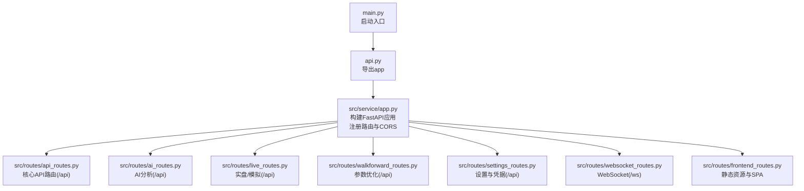
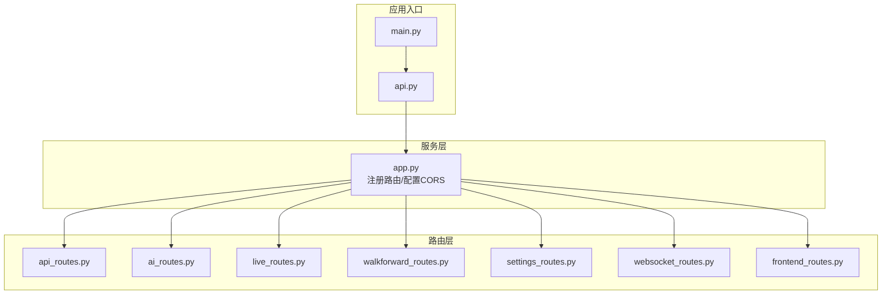
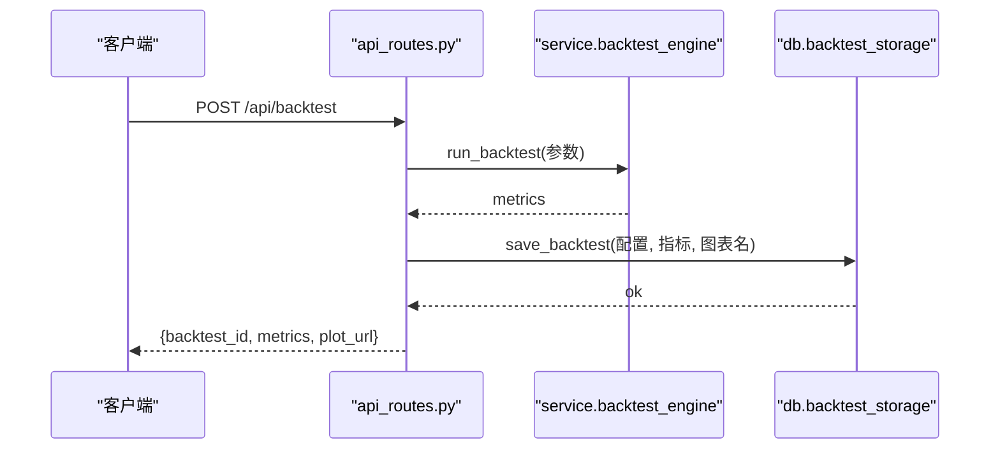
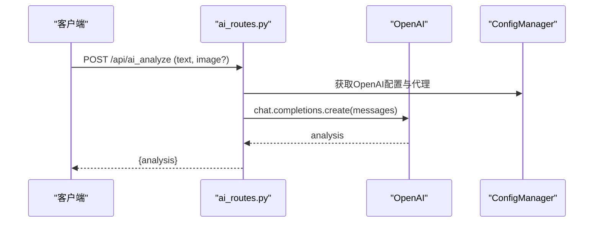
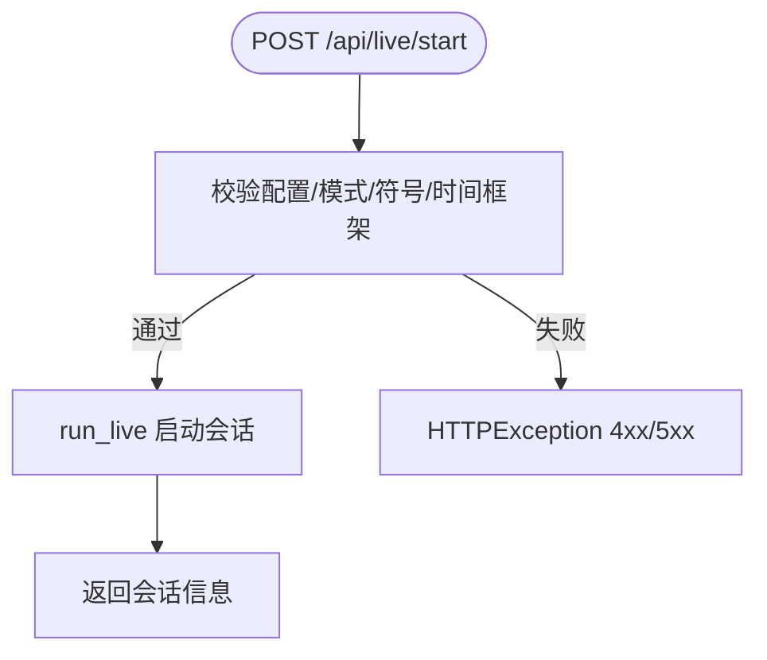
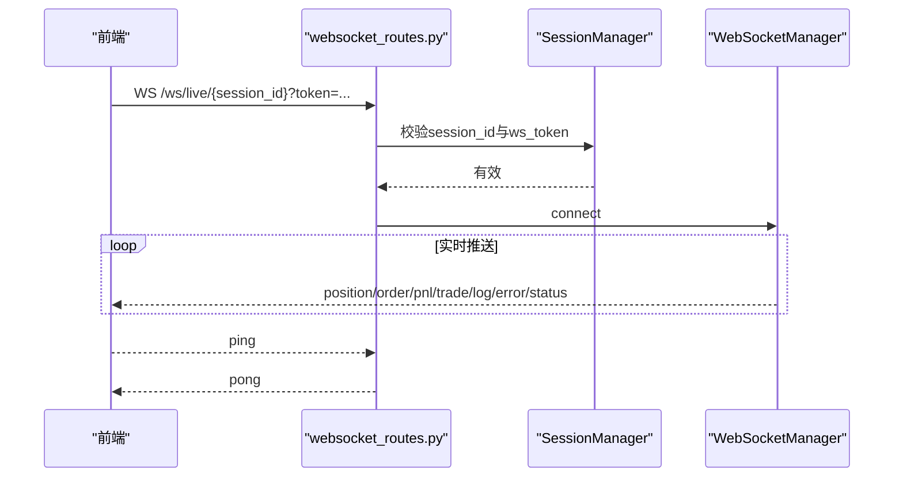
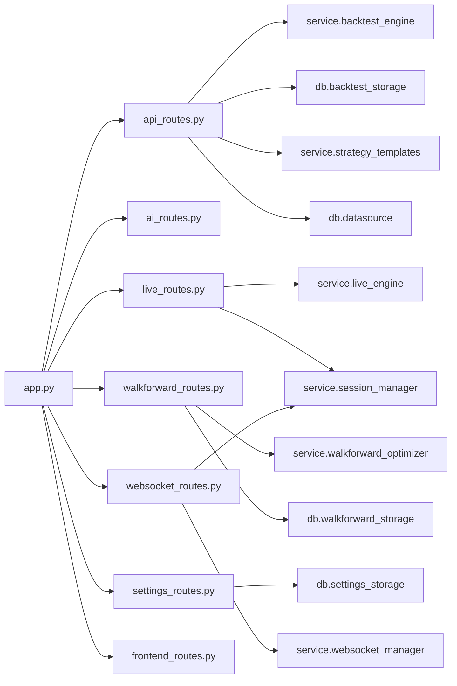

# API路由

<cite>
**本文引用的文件列表**
- [api.py](file://backend/src/api.py)
- [main.py](file://backend/main.py)
- [app.py](file://backend/src/service/app.py)
- [routes.md](file://backend/src/routes/routes.md)
- [api_routes.py](file://backend/src/routes/api_routes.py)
- [ai_routes.py](file://backend/src/routes/ai_routes.py)
- [live_routes.py](file://backend/src/routes/live_routes.py)
- [walkforward_routes.py](file://backend/src/routes/walkforward_routes.py)
- [websocket_routes.py](file://backend/src/routes/websocket_routes.py)
- [frontend_routes.py](file://backend/src/routes/frontend_routes.py)
- [settings_routes.py](file://backend/src/routes/settings_routes.py)
- [test_routes_imports.py](file://backend/tests/routes/test_routes_imports.py)
</cite>

## 目录
1. [简介](#简介)
2. [项目结构](#项目结构)
3. [核心组件](#核心组件)
4. [架构总览](#架构总览)
5. [详细组件分析](#详细组件分析)
6. [依赖关系分析](#依赖关系分析)
7. [性能考量](#性能考量)
8. [故障排查指南](#故障排查指南)
9. [结论](#结论)
10. [附录](#附录)

## 简介
本文件聚焦于FastAPI在本项目中的实际应用，围绕api_routes.py作为主路由入口，系统梳理各功能模块的路由设计与实现，结合routes.md中定义的路由注册规范，解释RESTful设计风格在本项目中的落地实践。文档逐项分析ai_routes、live_routes、walkforward_routes等模块的端点设计，覆盖HTTP方法、URL路径、请求/响应数据结构、认证要求与错误处理模式；并说明路由层与service层的调用关系，强调其在MVC架构中的控制器职责。同时提供常见问题与最佳实践建议，如CORS配置冲突、路径参数解析、异步视图函数的正确使用等。

## 项目结构
后端采用FastAPI框架，路由按功能拆分到独立模块，统一在服务层app.py中注册。api.py导出FastAPI应用实例，main.py通过Daphne服务器启动应用。前端静态资源与SPA路由托管由frontend_routes.py负责。



图表来源
- [main.py](file://backend/main.py#L1-L31)
- [api.py](file://backend/src/api.py#L1-L3)
- [app.py](file://backend/src/service/app.py#L1-L46)
- [frontend_routes.py](file://backend/src/routes/frontend_routes.py#L1-L34)

章节来源
- [routes.md](file://backend/src/routes/routes.md#L1-L24)
- [app.py](file://backend/src/service/app.py#L1-L46)

## 核心组件
- 主路由入口：api_routes.py
  - 提供策略模板、策略代码、回测、历史记录、AI分析等核心API
  - 使用Pydantic模型进行请求/响应校验
  - 通过Depends(get_current_user)进行鉴权
- 其他功能路由：
  - ai_routes.py：AI图表分析（支持图片上传）
  - live_routes.py：实盘/模拟交易会话管理
  - walkforward_routes.py：Walk-Forward参数优化（后台任务）
  - settings_routes.py：用户设置与凭据管理
  - websocket_routes.py：WebSocket实时推送
  - frontend_routes.py：静态资源与SPA路由

章节来源
- [api_routes.py](file://backend/src/routes/api_routes.py#L1-L507)
- [ai_routes.py](file://backend/src/routes/ai_routes.py#L1-L92)
- [live_routes.py](file://backend/src/routes/live_routes.py#L1-L430)
- [walkforward_routes.py](file://backend/src/routes/walkforward_routes.py#L1-L400)
- [settings_routes.py](file://backend/src/routes/settings_routes.py#L1-L403)
- [websocket_routes.py](file://backend/src/routes/websocket_routes.py#L1-L243)
- [frontend_routes.py](file://backend/src/routes/frontend_routes.py#L1-L34)

## 架构总览
路由层遵循“控制器”职责：接收请求、进行参数校验与鉴权、调用service/db层业务逻辑、返回标准化响应或错误。服务层app.py集中注册所有路由，统一前缀与CORS策略。



图表来源
- [app.py](file://backend/src/service/app.py#L1-L46)
- [main.py](file://backend/main.py#L1-L31)
- [api.py](file://backend/src/api.py#L1-L3)

## 详细组件分析

### 主路由入口：api_routes.py
- 设计原则
  - 统一前缀：通过app.py注册为“/api”，避免重复前缀
  - 鉴权：所有端点均依赖当前用户上下文
  - 错误处理：显式捕获异常并映射为HTTP状态码
  - 数据校验：使用Pydantic模型定义请求/响应结构
- 关键端点
  - 策略模板
    - GET /api/templates：返回模板列表、分类与难度
    - GET /api/templates/{template_id}：返回模板详情（含代码）
    - POST /api/templates/import：导入模板为新策略
  - 策略代码
    - GET /api/strategy：获取策略代码（可指定名称）
    - POST /api/strategy：保存策略代码
    - GET /api/strategy/{name}/params：提取策略参数定义
  - 数据与回测
    - GET /api/ticker/{ticker}/info：校验并返回标的元信息
    - GET /api/ticker/{ticker}/prices：返回OHLCV数据
    - POST /api/backtest：执行回测，生成图表并持久化历史
    - POST /api/data：兼容旧接口（返回增强响应）
  - 历史与AI分析
    - POST /api/backtest/history：查询回测历史（过滤/排序/分页）
    - GET /api/backtest/history/{backtest_id}：获取回测详情
    - DELETE /api/backtest/history/{backtest_id}：删除回测记录
    - POST /api/backtest/history/{backtest_id}/ai-analysis：更新AI分析
    - POST /api/analyze：基于指标生成文本分析
- 请求/响应与认证
  - 所有端点通过Depends(get_current_user)注入用户上下文
  - 使用Pydantic模型进行输入校验（如BacktestRequest、DataRequest、StrategyCode等）
  - 返回统一结构，错误时返回标准HTTP状态码
- 与service/db层交互
  - 调用service.backtest_engine执行回测
  - 调用db.backtest_storage进行历史记录的增删改查
  - 调用service.strategy_templates与db.datasource提供模板与数据源能力



图表来源
- [api_routes.py](file://backend/src/routes/api_routes.py#L215-L296)
- [app.py](file://backend/src/service/app.py#L37-L42)

章节来源
- [api_routes.py](file://backend/src/routes/api_routes.py#L1-L507)

### AI分析：ai_routes.py
- 端点
  - POST /api/ai_analyze：支持文本消息与图片上传，调用OpenAI进行分析
- 文件上传与WebSocket升级
  - 使用Form/File参数接收图片，Base64编码后发送给OpenAI
  - 该模块未包含WebSocket端点，但展示了文件上传与外部API集成的模式
- 认证与配置
  - 依赖用户上下文，读取用户级配置（OpenAI密钥、代理）
  - 支持HTTP代理配置，必要时使用httpx.AsyncClient包装



图表来源
- [ai_routes.py](file://backend/src/routes/ai_routes.py#L1-L92)

章节来源
- [ai_routes.py](file://backend/src/routes/ai_routes.py#L1-L92)

### 实盘/模拟交易：live_routes.py
- 端点
  - POST /api/live/start：启动会话（paper/live模式）
  - POST /api/live/stop：停止会话
  - GET /api/live/status/{session_id}：获取会话状态
  - GET /api/live/sessions：列出会话（支持过滤与分页）
  - GET /api/live/exchanges：获取可用交易所信息
  - GET /api/live/orders/{session_id}：获取会话订单
  - GET /api/live/health：健康检查
- 数据模型
  - StartLiveRequest/StopLiveRequest/SessionResponse/ExchangeInfo等
- 错误处理
  - 对配置缺失、会话不存在、模式非法等情况返回明确HTTP状态码
- 与service层
  - 调用service.live_engine与service.session_manager执行业务逻辑



图表来源
- [live_routes.py](file://backend/src/routes/live_routes.py#L102-L189)

章节来源
- [live_routes.py](file://backend/src/routes/live_routes.py#L1-L430)

### Walk-Forward参数优化：walkforward_routes.py
- 端点
  - POST /api/walkforward/start：创建并启动后台优化任务
  - GET /api/walkforward/list：列出优化记录（过滤/排序/分页）
  - GET /api/walkforward/{optimization_id}：获取详细结果
  - DELETE /api/walkforward/{optimization_id}：删除优化记录
  - GET /api/walkforward/{optimization_id}/status：查询状态
- 异步与后台任务
  - 使用BackgroundTasks在后台运行优化流程
  - 通过数据库存储进度与结果，支持状态轮询
- 数据模型
  - WalkForwardOptimizationRequest/Response/ListResponse等

```mermaid
sequenceDiagram
participant Client as "客户端"
participant WF as "walkforward_routes.py"
participant BG as "BackgroundTasks"
participant DB as "WalkForwardStorage"
participant Opt as "WalkForwardOptimizer"
Client->>WF : POST /api/walkforward/start
WF->>DB : create_optimization
WF->>BG : add_task(run_optimization_task)
BG->>Opt : run_walkforward
Opt->>DB : save_optimization_result
Client->>WF : GET /api/walkforward/{id}/status
WF->>DB : get_optimization
WF-->>Client : {status, progress...}
```

图表来源
- [walkforward_routes.py](file://backend/src/routes/walkforward_routes.py#L129-L228)
- [walkforward_routes.py](file://backend/src/routes/walkforward_routes.py#L234-L397)

章节来源
- [walkforward_routes.py](file://backend/src/routes/walkforward_routes.py#L1-L400)

### 设置与凭据：settings_routes.py
- 端点
  - GET/PUT /api/settings：获取/更新用户设置
  - POST /api/settings/reset：重置为默认值
  - GET/PUT /api/settings/credentials：获取/更新通用凭据
  - PUT /api/settings/credentials/ccxt：更新CCXT凭据
  - DELETE /api/settings/credentials/{key}：重置某凭据
  - POST /api/settings/credentials/test：测试凭据有效性
- 安全与加密
  - 敏感字段加密存储，返回时掩码显示
  - 凭据测试通过实际API调用验证

章节来源
- [settings_routes.py](file://backend/src/routes/settings_routes.py#L1-L403)

### WebSocket：websocket_routes.py
- 端点
  - WS /ws/live/{session_id}：实时推送交易状态、订单、P&L、日志等
  - GET /ws/info：获取连接信息
- 认证
  - 通过查询参数ws_token进行会话级认证
- 协议与消息类型
  - 支持connected、position、order、pnl、trade、log、error、status等消息类型
  - 支持ping/pong保活



图表来源
- [websocket_routes.py](file://backend/src/routes/websocket_routes.py#L21-L219)

章节来源
- [websocket_routes.py](file://backend/src/routes/websocket_routes.py#L1-L243)

### 前端路由与静态资源：frontend_routes.py
- 端点
  - GET /：返回index.html或友好提示
  - GET /{full_path}：SPA兜底，返回index.html
- 静态资源
  - 挂载/images与/assets目录
- 注册方式
  - 在app.py中通过mount_frontend(app)完成挂载

章节来源
- [frontend_routes.py](file://backend/src/routes/frontend_routes.py#L1-L34)

## 依赖关系分析
- 路由注册
  - app.py统一include_router，按功能模块注册，部分模块带前缀“/api”
- 路由与服务层耦合
  - 路由层仅编排，不直接操作数据库或外部Broker
  - 通过service层封装业务逻辑，保持高内聚低耦合
- CORS与安全
  - 通过环境变量配置CORS，避免凭据与通配符同时启用导致冲突
  - 所有API端点依赖鉴权中间件



图表来源
- [app.py](file://backend/src/service/app.py#L1-L46)
- [api_routes.py](file://backend/src/routes/api_routes.py#L1-L507)
- [live_routes.py](file://backend/src/routes/live_routes.py#L1-L430)
- [walkforward_routes.py](file://backend/src/routes/walkforward_routes.py#L1-L400)
- [settings_routes.py](file://backend/src/routes/settings_routes.py#L1-L403)
- [websocket_routes.py](file://backend/src/routes/websocket_routes.py#L1-L243)

章节来源
- [app.py](file://backend/src/service/app.py#L1-L46)

## 性能考量
- 异步与后台任务
  - 回测与Walk-Forward优化应尽量异步化，避免阻塞请求线程
  - 使用BackgroundTasks处理长耗时任务，路由快速返回
- 缓存与降噪
  - 对高频查询（如历史列表）考虑缓存与分页限制
- I/O与网络
  - 外部API（如OpenAI）调用应设置合理超时与代理支持
- 静态资源
  - images与assets静态挂载，减少动态处理开销

## 故障排查指南
- CORS配置冲突
  - 当CORS_ALLOW_CREDENTIALS为true且允许通配符origin时，自动降级为不允许凭据
  - 建议在开发环境明确allow_origins，生产环境严格限定
- 路径参数解析错误
  - 确保路径参数类型匹配（如session_id为字符串UUID）
  - 对必填参数进行显式校验，避免None导致后续逻辑异常
- 异步视图函数的正确使用
  - 需要等待I/O或外部调用的端点应声明为async
  - WebSocket端点必须使用WebSocket协议，确保客户端与服务端一致
- 文件上传
  - 图片上传使用Form/File参数，注意Content-Type与大小限制
  - 上传后及时清理临时文件，避免磁盘占用
- 错误处理
  - 明确区分4xx（参数/鉴权/资源不存在）与5xx（内部错误）
  - 对可预期异常（如策略加载失败、数据源不可用）返回具体错误信息

章节来源
- [app.py](file://backend/src/service/app.py#L21-L46)
- [websocket_routes.py](file://backend/src/routes/websocket_routes.py#L21-L219)
- [ai_routes.py](file://backend/src/routes/ai_routes.py#L1-L92)

## 结论
本项目以FastAPI为核心，采用模块化路由设计，统一在服务层app.py中注册，形成清晰的MVC分层：路由层负责编排与校验，服务层封装业务逻辑，数据层专注持久化。api_routes.py作为主入口，完整体现了RESTful设计风格：资源命名清晰、状态码使用规范、错误处理一致。配合WebSocket与后台任务，满足实时推送与长耗时任务场景。建议在生产环境中进一步完善限流、缓存与可观测性，持续提升稳定性与性能。

## 附录
- 路由注册规范
  - 新路由文件命名为{feature}_routes.py，对外暴露router
  - 路由注册统一在backend/src/service/app.py完成
  - 接口变更需同步更新前端与文档示例
- 测试验证
  - 路由模块导入与router暴露的单元测试

章节来源
- [routes.md](file://backend/src/routes/routes.md#L1-L24)
- [test_routes_imports.py](file://backend/tests/routes/test_routes_imports.py#L1-L22)