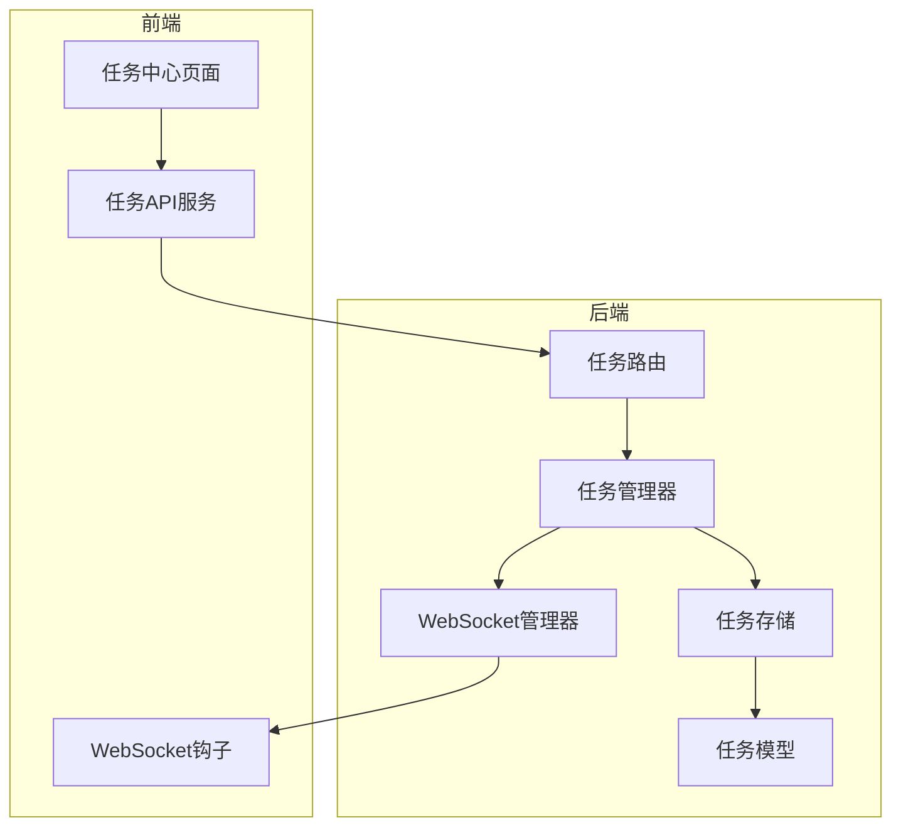
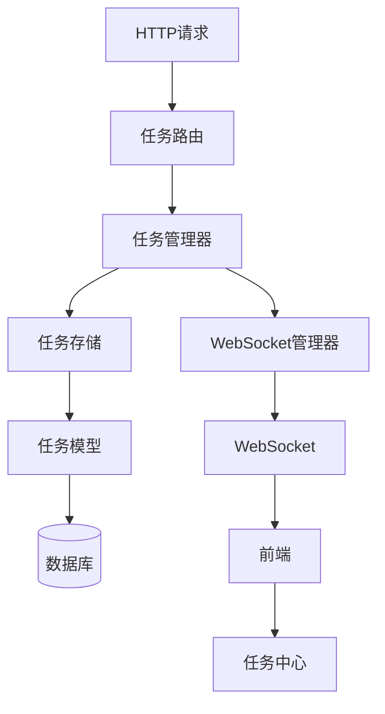
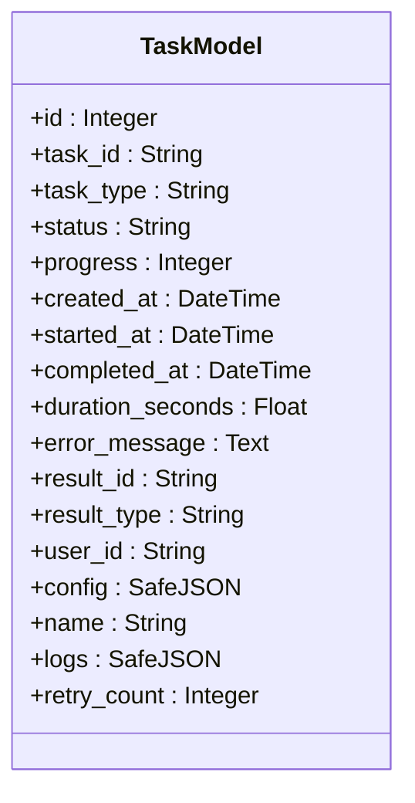
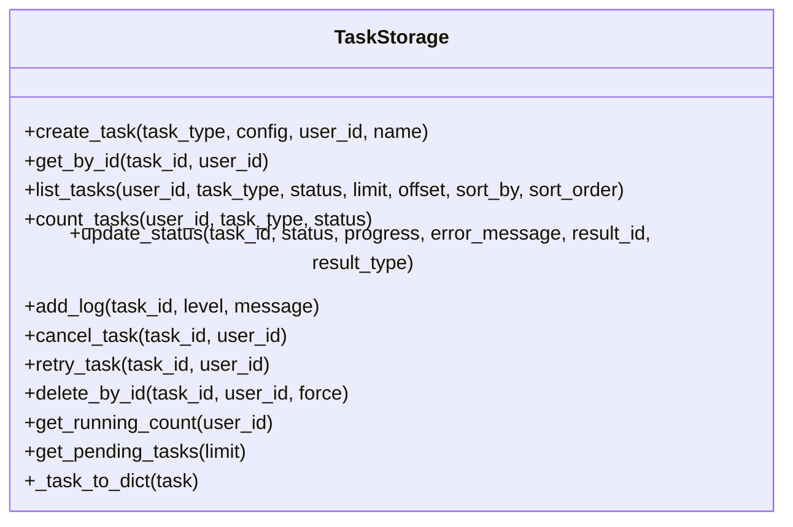
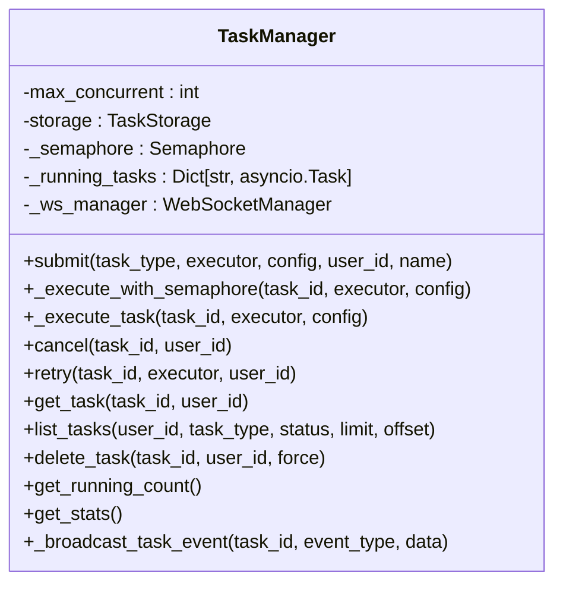
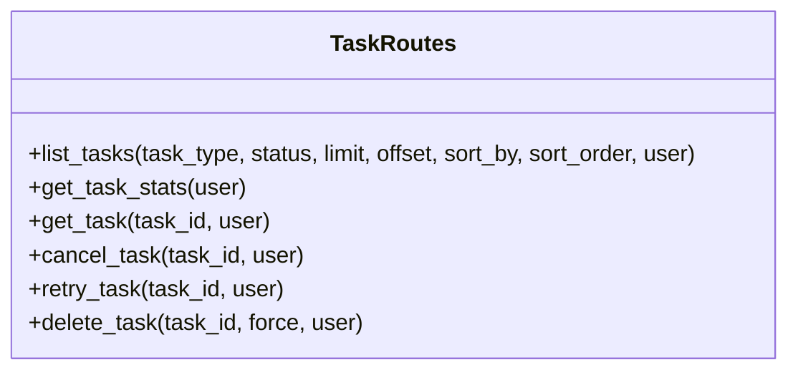
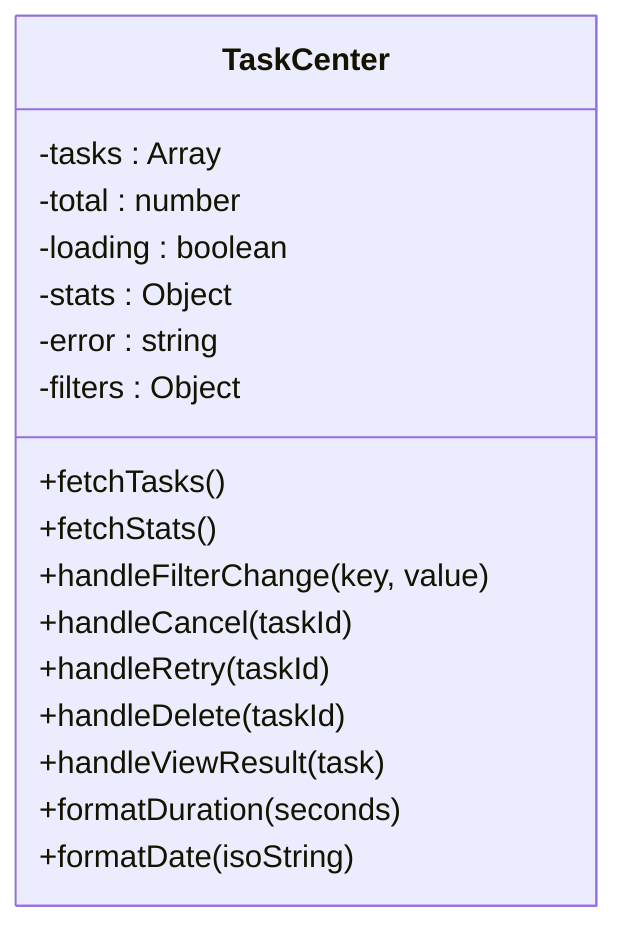
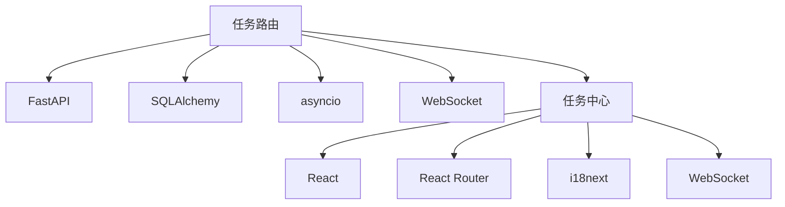

# 任务路由

<cite>
**本文档中引用的文件**  
- [task_routes.py](file://backend/src/routes/task_routes.py)
- [task_manager.py](file://backend/src/service/task_manager.py)
- [task.py](file://backend/src/db/models/task.py)
- [task.py](file://backend/src/db/storage/task.py)
- [api.py](file://backend/api.py)
- [main.py](file://backend/main.py)
- [taskApi.js](file://frontend/src/services/taskApi.js)
- [TaskCenter.jsx](file://frontend/src/pages/TaskCenter.jsx)
- [websocket_manager.py](file://backend/src/service/websocket_manager.py)
- [useTaskWebSocket.js](file://frontend/src/hooks/useTaskWebSocket.js)
</cite>

## 目录
1. [简介](#简介)
2. [项目结构](#项目结构)
3. [核心组件](#核心组件)
4. [架构概述](#架构概述)
5. [详细组件分析](#详细组件分析)
6. [依赖分析](#依赖分析)
7. [性能考虑](#性能考虑)
8. [故障排除指南](#故障排除指南)
9. [结论](#结论)

## 简介
"任务路由"文档详细介绍了 backtrader 项目中任务管理系统的架构和实现。该系统为后端任务（如回测、投资组合分析、前向优化和深度分析）提供统一的 REST API 接口。系统通过任务队列、并发控制和实时 WebSocket 更新实现高效的任务管理。前端通过 TaskCenter 页面提供用户界面，用于监控、取消、重试和删除任务。整个系统设计注重可扩展性、错误处理和用户体验。

## 项目结构
任务路由功能主要分布在后端的 `src/routes`、`src/service` 和 `src/db` 目录中，以及前端的 `src/pages` 和 `src/services` 目录中。后端通过 FastAPI 框架定义 REST API 路由，使用 SQLAlchemy 进行数据库操作，并通过 WebSocket 实现实时通信。前端使用 React 构建用户界面，通过 API 服务与后端交互。

**图示来源**
- [task_routes.py](file://backend/src/routes/task_routes.py#L24)
- [task_manager.py](file://backend/src/service/task_manager.py#L26)
- [task.py](file://backend/src/db/models/task.py#L36)
- [task.py](file://backend/src/db/storage/task.py#L26)
- [TaskCenter.jsx](file://frontend/src/pages/TaskCenter.jsx#L29)
- [taskApi.js](file://frontend/src/services/taskApi.js#L68)
- [useTaskWebSocket.js](file://frontend/src/hooks/useTaskWebSocket.js#L21)
- [websocket_manager.py](file://backend/src/service/websocket_manager.py#L18)

**章节来源**
- [task_routes.py](file://backend/src/routes/task_routes.py)
- [task_manager.py](file://backend/src/service/task_manager.py)
- [task.py](file://backend/src/db/models/task.py)
- [task.py](file://backend/src/db/storage/task.py)
- [TaskCenter.jsx](file://frontend/src/pages/TaskCenter.jsx)
- [taskApi.js](file://frontend/src/services/taskApi.js)
- [useTaskWebSocket.js](file://frontend/src/hooks/useTaskWebSocket.js)
- [websocket_manager.py](file://backend/src/service/websocket_manager.py)

## 核心组件
任务路由系统的核心组件包括任务模型、任务存储、任务管理器和任务路由。任务模型定义了数据库中的任务表结构，任务存储提供了对任务记录的 CRUD 操作，任务管理器负责任务的执行和并发控制，任务路由则暴露了 REST API 接口供前端调用。

**章节来源**
- [task.py](file://backend/src/db/models/task.py#L36)
- [task.py](file://backend/src/db/storage/task.py#L26)
- [task_manager.py](file://backend/src/service/task_manager.py#L26)
- [task_routes.py](file://backend/src/routes/task_routes.py#L24)

## 架构概述
任务路由系统采用分层架构，从上到下分为路由层、服务层、存储层和数据层。路由层处理 HTTP 请求，服务层管理任务的生命周期，存储层负责数据库操作，数据层定义了任务的持久化模型。系统通过 WebSocket 实现前后端的实时通信，确保用户界面能够及时反映任务状态的变化。

**图示来源**
- [task_routes.py](file://backend/src/routes/task_routes.py#L24)
- [task_manager.py](file://backend/src/service/task_manager.py#L26)
- [task.py](file://backend/src/db/storage/task.py#L26)
- [task.py](file://backend/src/db/models/task.py#L36)
- [websocket_manager.py](file://backend/src/service/websocket_manager.py#L18)
- [TaskCenter.jsx](file://frontend/src/pages/TaskCenter.jsx#L29)

## 详细组件分析
### 任务模型分析
任务模型定义了任务在数据库中的结构，包括任务ID、类型、状态、进度、创建时间、开始时间、完成时间、持续时间、错误信息、结果ID、用户ID、配置和日志等字段。该模型使用 SQLAlchemy ORM 映射到数据库表。

**图示来源**
- [task.py](file://backend/src/db/models/task.py#L36)

**章节来源**
- [task.py](file://backend/src/db/models/task.py#L36)

### 任务存储分析
任务存储层提供了对任务记录的创建、读取、更新和删除操作。它封装了数据库的 CRUD 操作，为上层服务提供了一个干净的接口。存储层还实现了任务状态更新、日志添加、任务取消和重试等功能。

**图示来源**
- [task.py](file://backend/src/db/storage/task.py#L26)

**章节来源**
- [task.py](file://backend/src/db/storage/task.py#L26)

### 任务管理器分析
任务管理器是任务系统的核心，负责任务的提交、执行、取消和重试。它使用 asyncio 信号量来控制并发任务的数量，确保系统资源不会被过度消耗。任务管理器还负责通过 WebSocket 向前端广播任务状态更新。

**图示来源**
- [task_manager.py](file://backend/src/service/task_manager.py#L26)

**章节来源**
- [task_manager.py](file://backend/src/service/task_manager.py#L26)

### 任务路由分析
任务路由层定义了 REST API 接口，包括列出任务、获取任务详情、取消任务、重试任务和删除任务等。每个路由都使用 Pydantic 模型进行请求和响应的验证，确保数据的完整性和一致性。

**图示来源**
- [task_routes.py](file://backend/src/routes/task_routes.py#L24)

**章节来源**
- [task_routes.py](file://backend/src/routes/task_routes.py#L24)

### 前端任务中心分析
前端任务中心页面提供了用户界面，用于监控和管理后台任务。页面通过 WebSocket 实现实时更新，用户可以查看任务列表、过滤任务、取消任务、重试任务和删除任务。页面还显示了任务的实时状态和进度。

**图示来源**
- [TaskCenter.jsx](file://frontend/src/pages/TaskCenter.jsx#L29)

**章节来源**
- [TaskCenter.jsx](file://frontend/src/pages/TaskCenter.jsx#L29)

## 依赖分析
任务路由系统依赖于多个后端和前端组件。后端依赖包括 FastAPI、SQLAlchemy、asyncio 和 WebSocket。前端依赖包括 React、React Router、i18next 和 WebSocket。系统通过 API 服务和 WebSocket 钩子与后端进行通信。

**图示来源**
- [task_routes.py](file://backend/src/routes/task_routes.py#L15)
- [task.py](file://backend/src/db/models/task.py#L14)
- [task_manager.py](file://backend/src/service/task_manager.py#L12)
- [websocket_manager.py](file://backend/src/service/websocket_manager.py#L13)
- [TaskCenter.jsx](file://frontend/src/pages/TaskCenter.jsx#L11)
- [useTaskWebSocket.js](file://frontend/src/hooks/useTaskWebSocket.js#L8)

**章节来源**
- [task_routes.py](file://backend/src/routes/task_routes.py)
- [task.py](file://backend/src/db/models/task.py)
- [task_manager.py](file://backend/src/service/task_manager.py)
- [websocket_manager.py](file://backend/src/service/websocket_manager.py)
- [TaskCenter.jsx](file://frontend/src/pages/TaskCenter.jsx)
- [useTaskWebSocket.js](file://frontend/src/hooks/useTaskWebSocket.js)

## 性能考虑
任务路由系统通过并发控制和异步处理来优化性能。任务管理器使用信号量限制同时运行的任务数量，防止系统资源耗尽。所有数据库操作和网络请求都使用异步方式执行，确保系统能够高效处理大量并发请求。WebSocket 实现了实时通信，减少了轮询带来的性能开销。

## 故障排除指南
如果任务路由系统出现问题，可以按照以下步骤进行排查：
1. 检查后端日志，查看是否有错误信息。
2. 检查数据库连接，确保数据库服务正常运行。
3. 检查 WebSocket 连接，确保前后端通信正常。
4. 检查任务管理器的并发设置，确保没有超过最大并发任务数。
5. 检查前端网络请求，确保 API 调用成功。

**章节来源**
- [task_manager.py](file://backend/src/service/task_manager.py#L23)
- [websocket_manager.py](file://backend/src/service/websocket_manager.py#L15)
- [task_routes.py](file://backend/src/routes/task_routes.py#L22)
- [task.py](file://backend/src/db/storage/task.py#L23)

## 结论
任务路由系统为 backtrader 项目提供了一个强大而灵活的任务管理框架。通过分层架构和模块化设计，系统实现了高内聚低耦合，便于维护和扩展。实时 WebSocket 通信和友好的用户界面提升了用户体验。系统的设计充分考虑了性能、可靠性和安全性，为复杂的量化交易任务提供了坚实的基础。