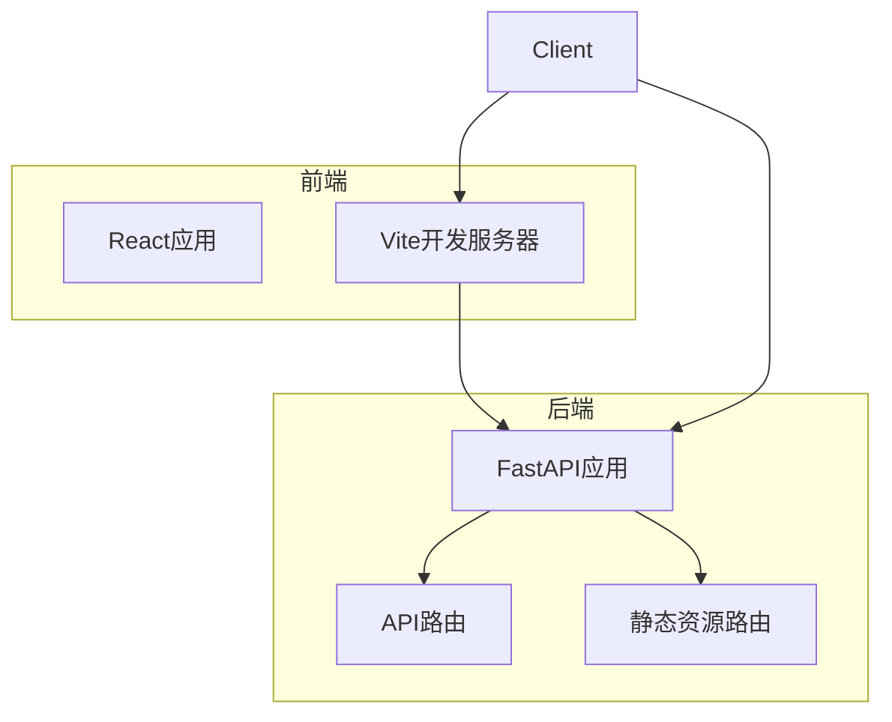
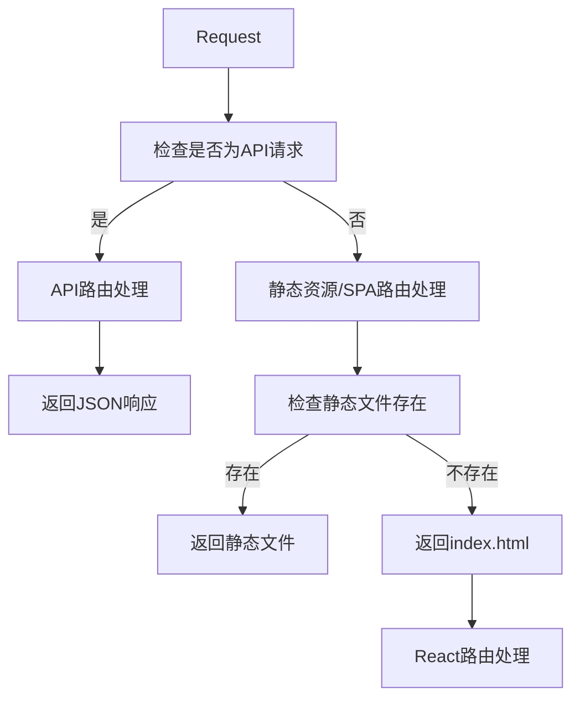
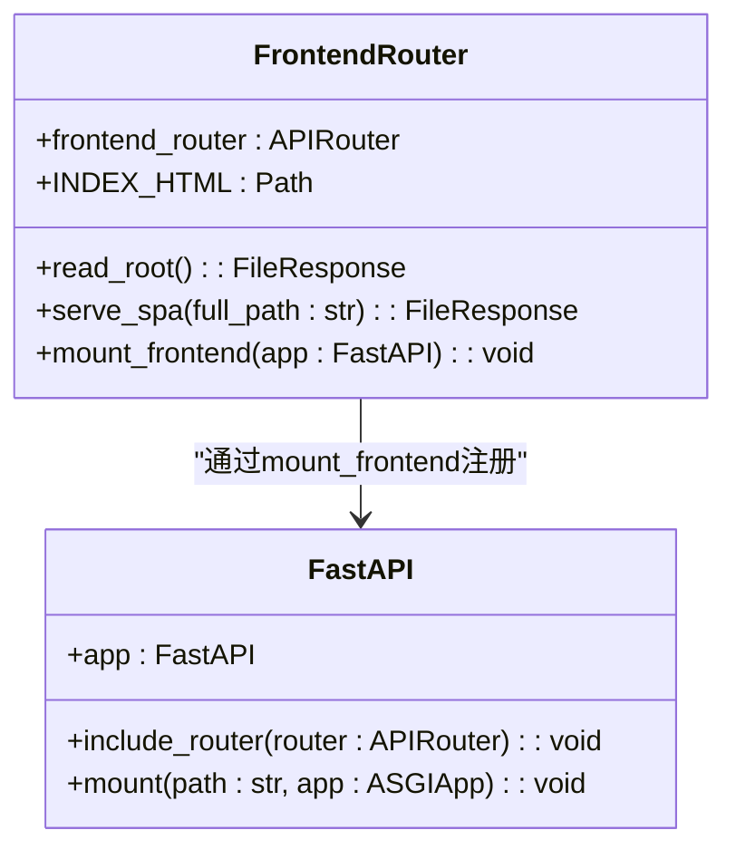
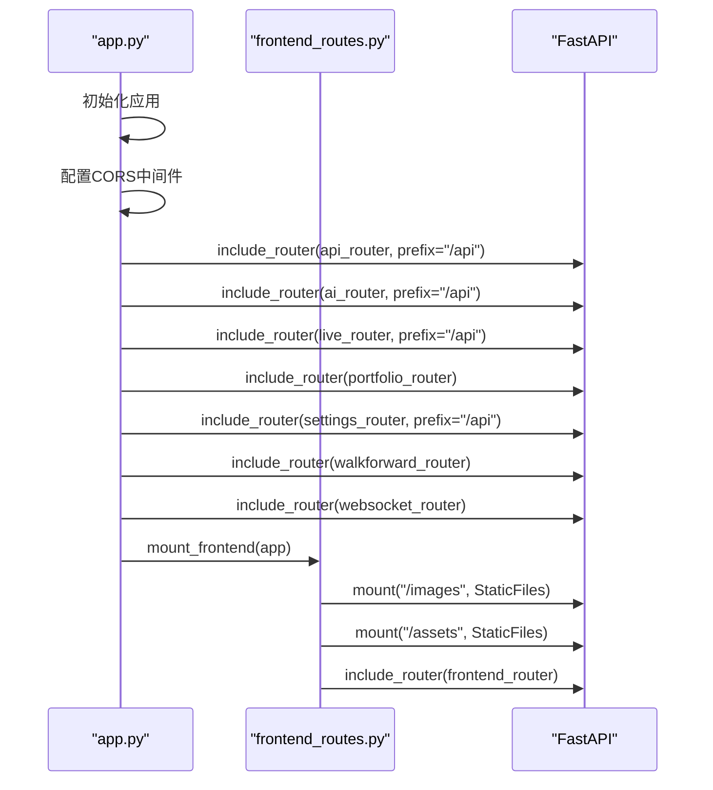
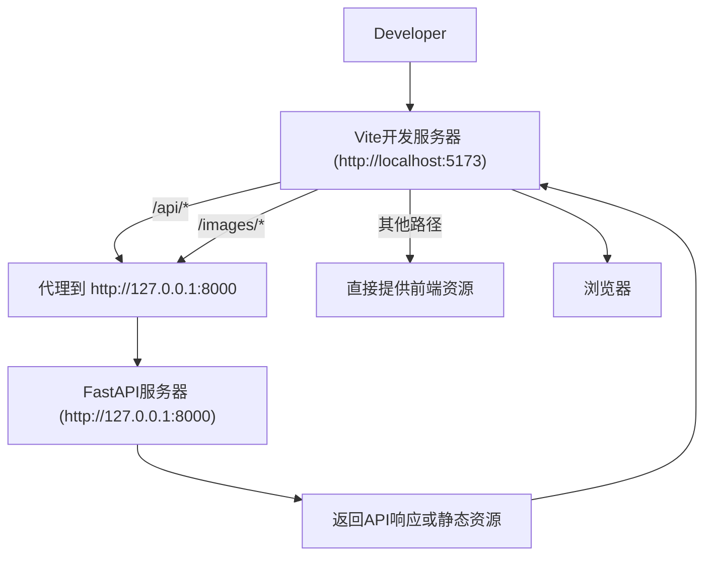
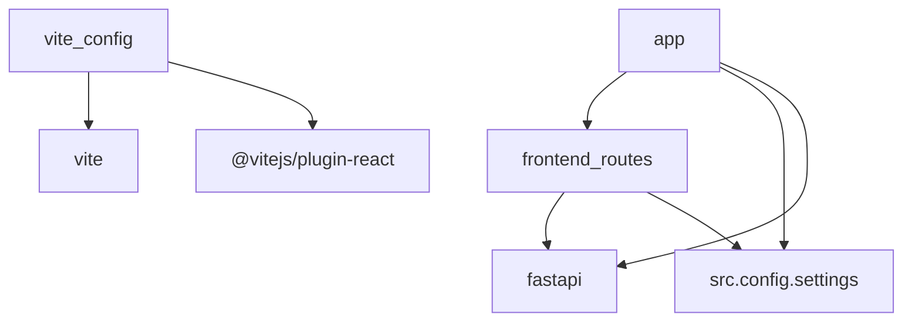

# 前端静态资源路由

<cite>
**本文档引用文件**  
- [frontend_routes.py](file://backend/src/routes/frontend_routes.py)
- [app.py](file://backend/src/service/app.py)
- [vite.config.js](file://frontend/vite.config.js)
- [index.html](file://frontend/index.html)
- [settings.py](file://backend/src/config/settings.py)
</cite>

## 目录
1. [简介](#简介)
2. [项目结构](#项目结构)
3. [核心组件](#核心组件)
4. [架构概述](#架构概述)
5. [详细组件分析](#详细组件分析)
6. [依赖分析](#依赖分析)
7. [性能考虑](#性能考虑)
8. [故障排除指南](#故障排除指南)
9. [结论](#结论)

## 简介
本文档详细说明了Backtrader项目中前端静态资源路由的实现机制。该系统通过`frontend_routes.py`文件实现了单页应用（SPA）的路由支持，将所有非API请求重定向至前端入口`index.html`。文档涵盖了开发模式下Vite代理配置与生产模式下静态文件服务的差异，以及路由注册时机和优先级关系，并提供了常见问题的排查方法。

## 项目结构
项目采用前后端分离架构，前端使用React框架并通过Vite构建，后端使用FastAPI提供API服务。前端静态资源路由机制确保了React应用的HTML5 History模式在刷新时仍能正确加载。

**图示来源**  
- [frontend_routes.py](file://backend/src/routes/frontend_routes.py#L7-L33)
- [vite.config.js](file://frontend/vite.config.js#L7-L16)

**本节来源**  
- [frontend_routes.py](file://backend/src/routes/frontend_routes.py)
- [vite.config.js](file://frontend/vite.config.js)

## 核心组件
`frontend_routes.py`是实现前端静态资源路由的核心文件，它定义了一个API路由器，包含两个主要路由处理函数：一个用于处理根路径请求，另一个作为通配符路由处理所有非API请求。`app.py`文件负责将这些路由注册到FastAPI应用中，而`vite.config.js`则配置了开发环境下的代理规则。

**本节来源**  
- [frontend_routes.py](file://backend/src/routes/frontend_routes.py#L7-L33)
- [app.py](file://backend/src/service/app.py#L21-L44)
- [vite.config.js](file://frontend/vite.config.js#L1-L24)

## 架构概述
系统的路由架构设计确保了API请求和前端路由请求的正确分发。在生产环境中，FastAPI应用通过`mount_frontend`函数挂载静态文件服务和SPA路由；在开发环境中，Vite开发服务器通过代理将API请求转发到FastAPI后端，同时直接提供前端资源服务。

**图示来源**  
- [frontend_routes.py](file://backend/src/routes/frontend_routes.py#L11-L24)
- [app.py](file://backend/src/service/app.py#L37-L44)

**本节来源**  
- [frontend_routes.py](file://backend/src/routes/frontend_routes.py)
- [app.py](file://backend/src/service/app.py)

## 详细组件分析

### 前端路由组件分析
`frontend_routes.py`文件实现了单页应用所需的路由机制，通过通配符路由捕获所有非API请求并返回`index.html`，让前端React应用接管路由控制。

**图示来源**  
- [frontend_routes.py](file://backend/src/routes/frontend_routes.py#L7-L33)

**本节来源**  
- [frontend_routes.py](file://backend/src/routes/frontend_routes.py#L1-L33)

### 路由注册组件分析
`app.py`文件中的应用初始化过程按照特定顺序注册各种路由，确保API路由优先于前端SPA路由，避免API请求被错误拦截。

**图示来源**  
- [app.py](file://backend/src/service/app.py#L21-L44)
- [frontend_routes.py](file://backend/src/routes/frontend_routes.py#L27-L33)

**本节来源**  
- [app.py](file://backend/src/service/app.py#L21-L44)
- [frontend_routes.py](file://backend/src/routes/frontend_routes.py#L27-L33)

### 开发代理配置分析
`vite.config.js`文件配置了开发环境下的代理规则，将API请求转发到后端FastAPI服务器，实现前后端分离开发。

**图示来源**  
- [vite.config.js](file://frontend/vite.config.js#L7-L16)

**本节来源**  
- [vite.config.js](file://frontend/vite.config.js#L1-L24)

## 依赖分析
前端静态资源路由功能依赖于多个组件的协同工作，包括FastAPI框架、Vite构建工具以及项目配置文件。这些组件共同实现了开发和生产环境下的路由机制。

**图示来源**  
- [frontend_routes.py](file://backend/src/routes/frontend_routes.py#L1-L5)
- [app.py](file://backend/src/service/app.py#L1-L17)
- [vite.config.js](file://frontend/vite.config.js#L1-L2)

**本节来源**  
- [frontend_routes.py](file://backend/src/routes/frontend_routes.py)
- [app.py](file://backend/src/service/app.py)
- [vite.config.js](file://frontend/vite.config.js)

## 性能考虑
前端静态资源路由机制在生产环境中通过FastAPI的`StaticFiles`中间件高效提供静态资源服务，同时利用操作系统的文件系统缓存提高性能。在开发环境中，Vite的按需编译和热更新机制确保了快速的开发体验。

## 故障排除指南
以下是一些常见问题及其排查方法：

1. **路由冲突导致API被错误拦截**：确保API路由在`app.py`中先于前端路由注册，API路由应有`/api`前缀。
2. **静态资源缓存策略不当**：检查生产环境中静态资源的HTTP缓存头设置，确保合理使用缓存。
3. **HTML5 History模式下刷新404错误**：确认`frontend_routes.py`中的通配符路由`/{full_path:path}`正确配置并最后注册。
4. **跨域资源加载失败**：检查`app.py`中的CORS配置，确保开发环境中Vite代理正确设置。

**本节来源**  
- [frontend_routes.py](file://backend/src/routes/frontend_routes.py#L19-L24)
- [app.py](file://backend/src/service/app.py#L27-L35)
- [vite.config.js](file://frontend/vite.config.js#L7-L16)

## 结论
Backtrader项目的前端静态资源路由机制通过精心设计的路由注册顺序和环境特定配置，成功实现了单页应用的支持。在生产环境中，FastAPI直接提供静态资源服务和SPA路由；在开发环境中，Vite开发服务器通过代理与FastAPI后端协同工作。这种架构既保证了开发效率，又确保了生产环境的性能和可靠性。