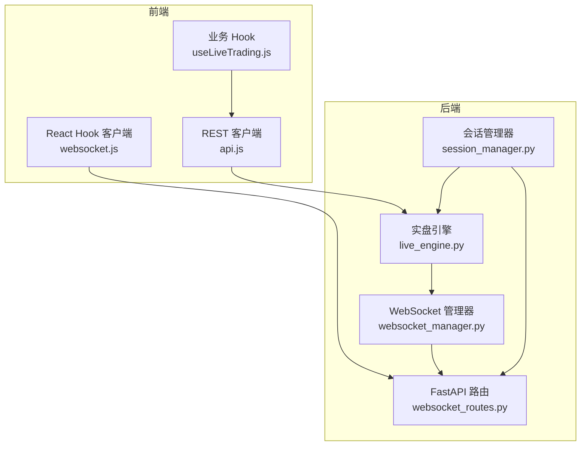
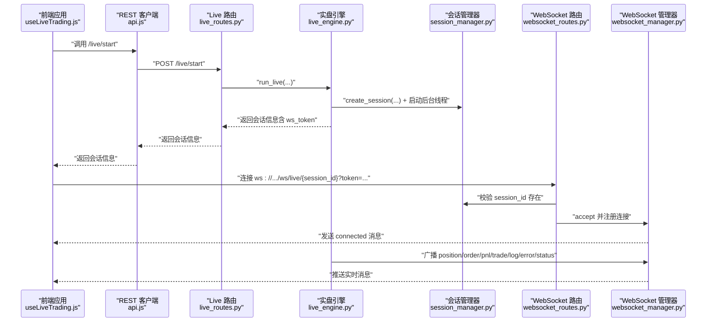
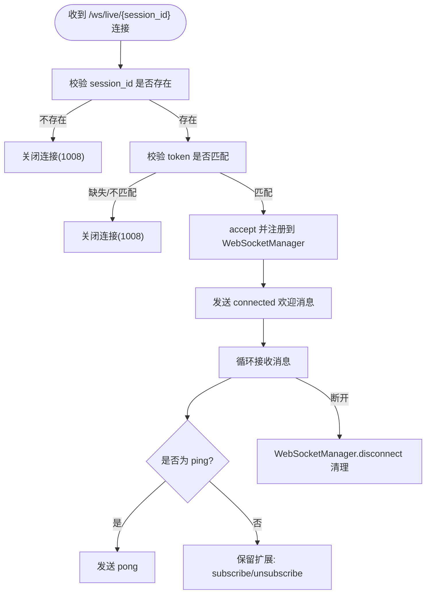
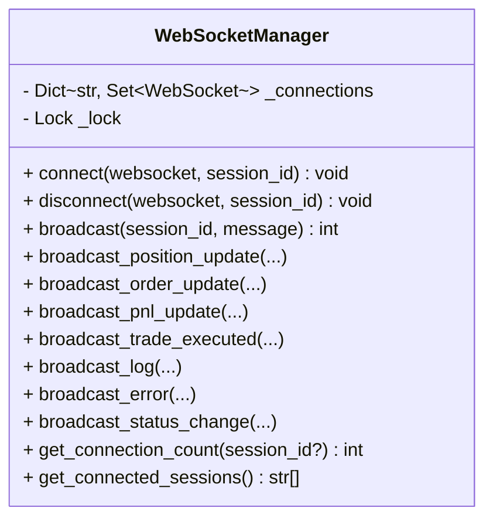
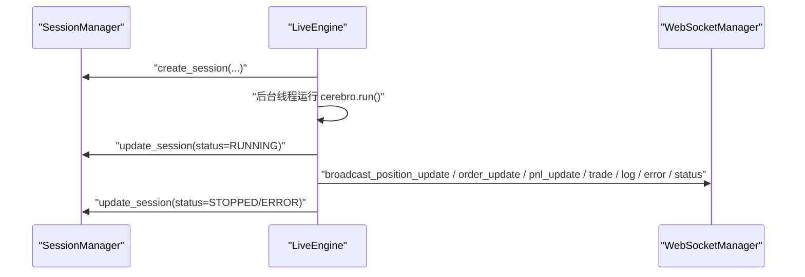
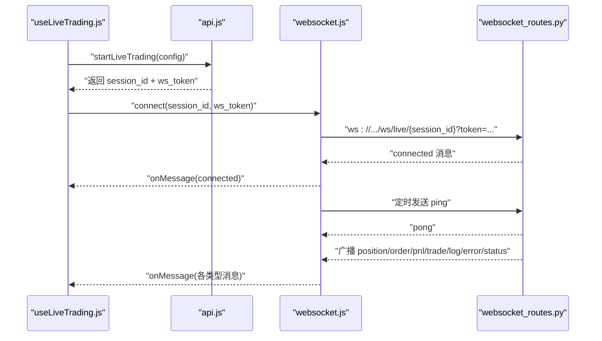
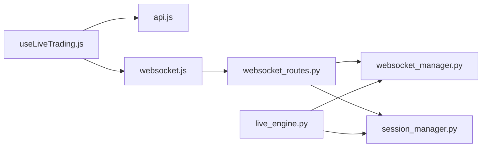

# 实时通信接口

<cite>
**本文引用的文件列表**
- [websocket_routes.py](file://backend/src/routes/websocket_routes.py)
- [websocket_manager.py](file://backend/src/service/websocket_manager.py)
- [live_engine.py](file://backend/src/service/live_engine.py)
- [session_manager.py](file://backend/src/service/session_manager.py)
- [live_routes.py](file://backend/src/routes/live_routes.py)
- [websocket.js](file://frontend/src/services/websocket.js)
- [useLiveTrading.js](file://frontend/src/hooks/useLiveTrading.js)
- [api.js](file://frontend/src/services/api.js)
- [test_websocket_manager.py](file://backend/tests/service/test_websocket_manager.py)
</cite>

## 目录
1. [简介](#简介)
2. [项目结构](#项目结构)
3. [核心组件](#核心组件)
4. [架构总览](#架构总览)
5. [详细组件分析](#详细组件分析)
6. [依赖关系分析](#依赖关系分析)
7. [性能考虑](#性能考虑)
8. [故障排查指南](#故障排查指南)
9. [结论](#结论)
10. [附录](#附录)

## 简介
本文件面向实时通信接口，聚焦于后端 WebSocket 路由与前端连接管理的完整链路，围绕 /ws/live/{session_id} 端点设计与实现，解释基于 WebSocketManager 单例的消息广播机制，以及客户端与服务端之间的消息格式与处理流程。文档还结合 live_engine.py 的会话状态变更逻辑，阐述如何在实盘交易运行期间实时同步订单、持仓与盈亏信息；并提供前端使用 websocket.js 进行连接管理、心跳检测与异常重连的实践指导。

## 项目结构
后端采用 FastAPI 提供 REST 与 WebSocket 接口，前端使用 React Hook 封装 WebSocket 客户端。关键模块如下：
- 后端路由层：websocket_routes.py 提供 WebSocket 端点与连接信息查询
- 服务层：websocket_manager.py 提供 WebSocket 连接池与广播能力；session_manager.py 提供会话生命周期管理；live_engine.py 驱动实盘交易线程与状态更新
- 前端：websocket.js 提供连接、心跳与重连；useLiveTrading.js 在业务层消费 WebSocket 消息并驱动 UI

图表来源
- [websocket_routes.py](file://backend/src/routes/websocket_routes.py#L21-L242)
- [websocket_manager.py](file://backend/src/service/websocket_manager.py#L18-L401)
- [session_manager.py](file://backend/src/service/session_manager.py#L1-L419)
- [live_engine.py](file://backend/src/service/live_engine.py#L105-L269)
- [websocket.js](file://frontend/src/services/websocket.js#L1-L287)
- [useLiveTrading.js](file://frontend/src/hooks/useLiveTrading.js#L1-L199)
- [api.js](file://frontend/src/services/api.js#L203-L245)

章节来源
- [websocket_routes.py](file://backend/src/routes/websocket_routes.py#L21-L242)
- [websocket_manager.py](file://backend/src/service/websocket_manager.py#L18-L401)
- [session_manager.py](file://backend/src/service/session_manager.py#L1-L419)
- [live_engine.py](file://backend/src/service/live_engine.py#L105-L269)
- [websocket.js](file://frontend/src/services/websocket.js#L1-L287)
- [useLiveTrading.js](file://frontend/src/hooks/useLiveTrading.js#L1-L199)
- [api.js](file://frontend/src/services/api.js#L203-L245)

## 核心组件
- WebSocket 路由与鉴权
  - /ws/live/{session_id}：接收客户端连接，校验会话存在性与 ws_token，接受连接并注册到 WebSocketManager
  - 支持客户端发送 ping 保持心跳，服务端返回 pong
- WebSocket 管理器
  - 维护每个 session_id 的连接集合，支持欢迎消息、广播、清理死连接、统计连接数
  - 提供 position/order/pnl/trade/log/error/status 等广播方法
- 会话管理器
  - 提供 TradingSession 数据结构与 SessionStatus 枚举，生成 ws_token 用于 WebSocket 鉴权
  - 提供创建、启动、停止、查询等生命周期管理
- 实盘引擎
  - run_live 创建会话、初始化 broker/data、启动后台线程执行策略循环
  - stop_live 停止会话并更新状态
- 前端 WebSocket 客户端
  - 自动计算协议（ws/wss），拼接 token 查询参数
  - 心跳定时发送 ping，收到 pong 后确认连接健康
  - 断线自动重连，支持最大尝试次数与间隔配置

章节来源
- [websocket_routes.py](file://backend/src/routes/websocket_routes.py#L21-L242)
- [websocket_manager.py](file://backend/src/service/websocket_manager.py#L18-L401)
- [session_manager.py](file://backend/src/service/session_manager.py#L20-L101)
- [live_engine.py](file://backend/src/service/live_engine.py#L105-L269)
- [websocket.js](file://frontend/src/services/websocket.js#L1-L287)

## 架构总览
WebSocket 实时通信链路从“会话创建”开始，到“策略运行与状态变更”，再到“前端订阅与展示”的闭环。

图表来源
- [live_routes.py](file://backend/src/routes/live_routes.py#L102-L176)
- [live_engine.py](file://backend/src/service/live_engine.py#L105-L269)
- [session_manager.py](file://backend/src/service/session_manager.py#L140-L196)
- [websocket_routes.py](file://backend/src/routes/websocket_routes.py#L155-L173)
- [websocket_manager.py](file://backend/src/service/websocket_manager.py#L45-L72)

## 详细组件分析

### WebSocket 路由与鉴权（websocket_routes.py）
- 端点设计
  - 路径：/ws/live/{session_id}
  - 查询参数：token（来自 /api/live/start 返回的 ws_token）
- 鉴权流程
  - 校验 session 是否存在；不存在则关闭连接（1008）
  - 校验 token 是否匹配；不匹配则关闭连接（1008）
- 连接建立
  - 使用 WebSocketManager.connect 接受连接并注册
  - 发送欢迎消息 connected
- 心跳与消息处理
  - 支持字符串或 JSON 的 ping，统一返回 pong
  - 保留 subscribe/unsubscribe 扩展点
- 信息查询
  - /ws/info 返回端点、协议、连接数、已连接会话、消息类型与客户端消息

图表来源
- [websocket_routes.py](file://backend/src/routes/websocket_routes.py#L155-L218)

章节来源
- [websocket_routes.py](file://backend/src/routes/websocket_routes.py#L21-L242)

### WebSocket 管理器（websocket_manager.py）
- 连接池
  - 以 session_id 为键维护连接集合，使用锁保证并发安全
- 广播机制
  - broadcast：遍历连接集合，逐个发送；捕获异常并清理死连接
  - 提供 position/order/pnl/trade/log/error/status 等专用广播方法
- 连接生命周期
  - connect：接受连接、注册、发送欢迎消息
  - disconnect：移除连接，若无连接则删除会话键
- 统计与可观测性
  - get_connection_count/get_connected_sessions

图表来源
- [websocket_manager.py](file://backend/src/service/websocket_manager.py#L18-L401)

章节来源
- [websocket_manager.py](file://backend/src/service/websocket_manager.py#L18-L401)

### 会话管理器与实盘引擎（session_manager.py、live_engine.py）
- 会话模型
  - TradingSession 包含 session_id、策略、标的、状态、资金、订单、位置、错误信息等
  - SessionStatus 枚举：starting、running、stopping、stopped、error
  - ws_token 字段用于 WebSocket 鉴权
- 生命周期
  - create_session：创建并注册会话
  - stop_session：停止会话，等待线程结束，更新状态与时间
  - run_live：创建会话、加载策略、初始化 broker/data、启动后台线程执行策略循环
  - stop_live：停止会话并返回最终状态
- 与 WebSocket 的关系
  - 会话创建成功后，前端使用 ws_token 连接 /ws/live/{session_id}
  - 实盘引擎在运行过程中通过 WebSocketManager 广播各类事件

图表来源
- [session_manager.py](file://backend/src/service/session_manager.py#L140-L301)
- [live_engine.py](file://backend/src/service/live_engine.py#L105-L269)
- [websocket_manager.py](file://backend/src/service/websocket_manager.py#L150-L328)

章节来源
- [session_manager.py](file://backend/src/service/session_manager.py#L20-L101)
- [session_manager.py](file://backend/src/service/session_manager.py#L140-L301)
- [live_engine.py](file://backend/src/service/live_engine.py#L105-L269)

### 前端连接管理（websocket.js、useLiveTrading.js、api.js）
- 连接与鉴权
  - 自动判断协议（ws/wss），拼接 token 查询参数
  - 支持手动 connect/disconnect
- 心跳与重连
  - 心跳：按 heartbeatInterval 发送 ping，收到 pong 视为健康
  - 重连：断线后按 reconnectInterval 与 maxReconnectAttempts 重试
- 业务集成
  - useLiveTrading.js 在 /live/start 成功后延迟连接 WebSocket，并使用 ws_token
  - 解析 WS_MESSAGE_TYPES，分别更新 positions、orders、pnl、cash 等状态

图表来源
- [useLiveTrading.js](file://frontend/src/hooks/useLiveTrading.js#L140-L172)
- [websocket.js](file://frontend/src/services/websocket.js#L49-L110)
- [websocket.js](file://frontend/src/services/websocket.js#L137-L175)
- [websocket_routes.py](file://backend/src/routes/websocket_routes.py#L174-L218)

章节来源
- [websocket.js](file://frontend/src/services/websocket.js#L1-L287)
- [useLiveTrading.js](file://frontend/src/hooks/useLiveTrading.js#L1-L199)
- [api.js](file://frontend/src/services/api.js#L203-L245)

## 依赖关系分析
- 路由依赖
  - websocket_routes.py 依赖 get_websocket_manager 与 get_session_manager
- 服务依赖
  - WebSocketManager 仅依赖 FastAPI WebSocket 与 asyncio
  - SessionManager 为单例，提供线程安全的会话读写
  - LiveEngine 依赖 SessionManager、Broker/Data 组件与后台线程
- 前端依赖
  - useLiveTrading.js 依赖 api.js 与 websocket.js
  - websocket.js 依赖浏览器原生 WebSocket

图表来源
- [websocket_routes.py](file://backend/src/routes/websocket_routes.py#L13-L15)
- [websocket_manager.py](file://backend/src/service/websocket_manager.py#L393-L401)
- [session_manager.py](file://backend/src/service/session_manager.py#L407-L419)
- [live_engine.py](file://backend/src/service/live_engine.py#L105-L269)
- [useLiveTrading.js](file://frontend/src/hooks/useLiveTrading.js#L1-L199)
- [api.js](file://frontend/src/services/api.js#L203-L245)
- [websocket.js](file://frontend/src/services/websocket.js#L1-L287)

章节来源
- [websocket_routes.py](file://backend/src/routes/websocket_routes.py#L13-L15)
- [websocket_manager.py](file://backend/src/service/websocket_manager.py#L393-L401)
- [session_manager.py](file://backend/src/service/session_manager.py#L407-L419)
- [live_engine.py](file://backend/src/service/live_engine.py#L105-L269)
- [useLiveTrading.js](file://frontend/src/hooks/useLiveTrading.js#L1-L199)
- [api.js](file://frontend/src/services/api.js#L203-L245)
- [websocket.js](file://frontend/src/services/websocket.js#L1-L287)

## 性能考虑
- 广播性能
  - 广播前复制连接集合，避免迭代期间修改；对失败连接进行清理，降低后续发送成本
  - 广播返回发送数量，便于监控与限速策略
- 心跳与保活
  - 前端按固定间隔发送 ping，服务端直接返回 pong，避免复杂协议
- 批量推送
  - 当前实现按事件逐条广播；如需降低带宽与 CPU，可在上层聚合后再调用广播（例如每秒合并一次 position 更新）
- 并发与锁
  - 使用 asyncio.Lock 保护连接集合；广播时复制集合，减少锁持有时间
- 连接数限制
  - 可在路由层增加每会话最大连接数限制，超过阈值拒绝新连接
- 序列化与日志
  - 使用 JSON 序列化；日志级别区分 debug/warning，避免高频日志影响性能

章节来源
- [websocket_manager.py](file://backend/src/service/websocket_manager.py#L91-L149)
- [websocket_routes.py](file://backend/src/routes/websocket_routes.py#L174-L218)
- [websocket.js](file://frontend/src/services/websocket.js#L75-L98)

## 故障排查指南
- 连接超时/鉴权失败
  - 现象：连接被 1008 关闭
  - 原因：session_id 不存在或 token 缺失/不匹配
  - 处理：确认 /api/live/start 返回的 ws_token 正确传递；检查 session_id 是否正确
- 会话 ID 不匹配
  - 现象：服务端记录警告并关闭连接
  - 处理：确保前端连接 URL 中的 session_id 与后端一致
- 消息丢失
  - 现象：部分客户端未收到消息
  - 原因：发送异常导致死连接未清理
  - 处理：WebSocketManager 已清理死连接；可增加重连与幂等处理
- 并发连接数限制
  - 现象：新连接被拒绝
  - 处理：在路由层增加每会话最大连接数限制；或在负载均衡层限制
- 心跳与重连
  - 现象：频繁断线
  - 处理：调整 heartbeatInterval 与 reconnectInterval；确保网络稳定；必要时启用 wss

章节来源
- [websocket_routes.py](file://backend/src/routes/websocket_routes.py#L155-L169)
- [websocket_manager.py](file://backend/src/service/websocket_manager.py#L113-L149)
- [websocket.js](file://frontend/src/services/websocket.js#L137-L175)

## 结论
该实时通信接口通过 /ws/live/{session_id} 端点与 WebSocketManager 单例，实现了会话级的可靠广播与连接管理。配合 live_engine 的会话生命周期与 session_manager 的鉴权令牌，前端可稳定地订阅订单、持仓与盈亏等事件。通过心跳与重连机制，系统具备良好的鲁棒性。建议在生产环境中引入连接数限制、消息聚合与更细粒度的错误码，以进一步提升稳定性与性能。

## 附录

### 消息格式与数据结构
- 服务端推送（服务器 -> 客户端）
  - connected：建立连接后的欢迎消息
  - position：symbol、size、avg_price、current_price、pnl、pnl_percent
  - order：order_id、symbol、side、size、price、status、filled_size、filled_price
  - pnl：current_pnl、total_pnl_percent、cash、portfolio_value
  - trade：symbol、side、size、price、commission、pnl
  - log：level、message、timestamp
  - error：message、code
  - status：old_status、new_status
- 客户端发送（客户端 -> 服务器）
  - ping：心跳请求，服务端返回 pong

章节来源
- [websocket_routes.py](file://backend/src/routes/websocket_routes.py#L35-L151)
- [websocket_manager.py](file://backend/src/service/websocket_manager.py#L150-L328)

### 错误码定义
- 1008：无效或缺失 token（服务端主动关闭）
- 其他：WebSocket 关闭码详见标准；HTTP 层面可通过 REST 接口返回 404/400/500 等

章节来源
- [websocket_routes.py](file://backend/src/routes/websocket_routes.py#L155-L169)

### 前端使用要点
- 连接时机：在 /api/live/start 成功后，延迟短时间再连接 WebSocket，确保会话已进入 running 状态
- 心跳：默认 30 秒一次；可根据网络状况调整
- 重连：最多 3-5 次，间隔 3 秒；超过上限不再重连
- 消息解析：使用 WS_MESSAGE_TYPES 常量区分消息类型，分别更新 UI

章节来源
- [useLiveTrading.js](file://frontend/src/hooks/useLiveTrading.js#L140-L172)
- [websocket.js](file://frontend/src/services/websocket.js#L1-L287)

### 测试参考
- 单元测试覆盖了欢迎消息、断线清理、广播与死连接清理等关键路径

章节来源
- [test_websocket_manager.py](file://backend/tests/service/test_websocket_manager.py#L1-L69)