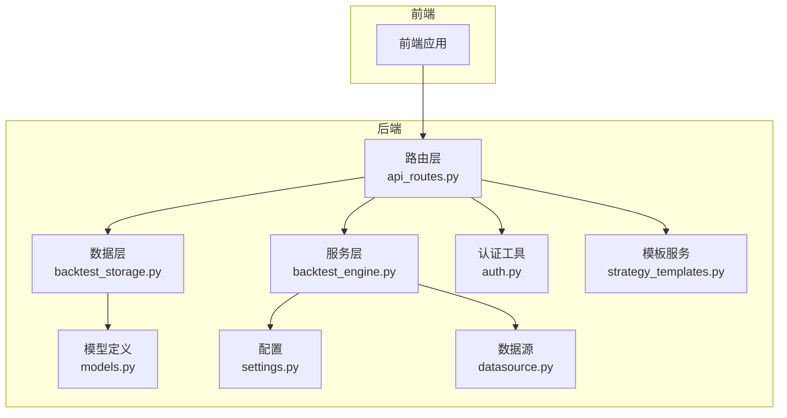
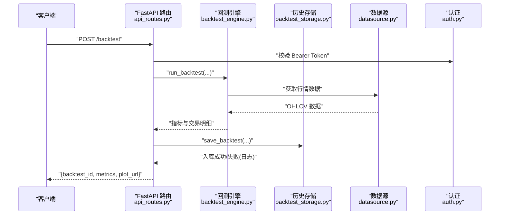
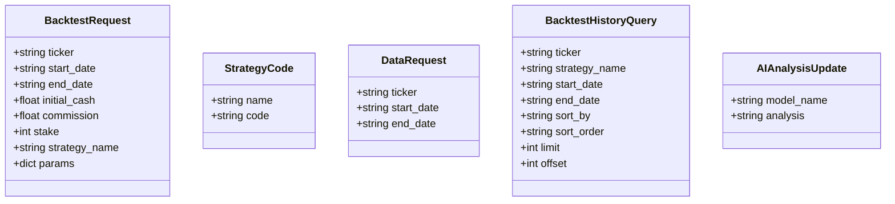
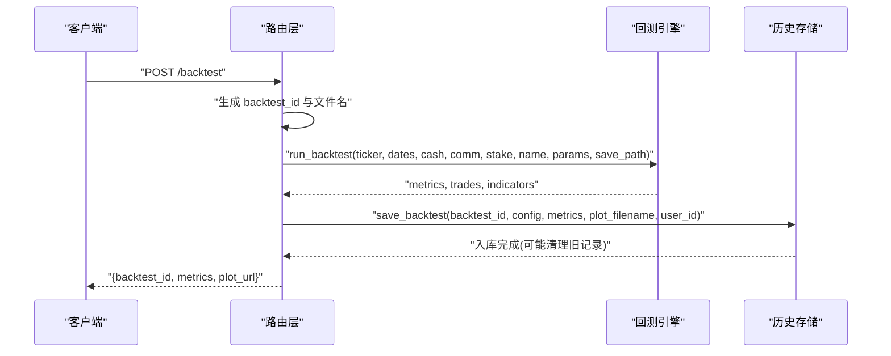
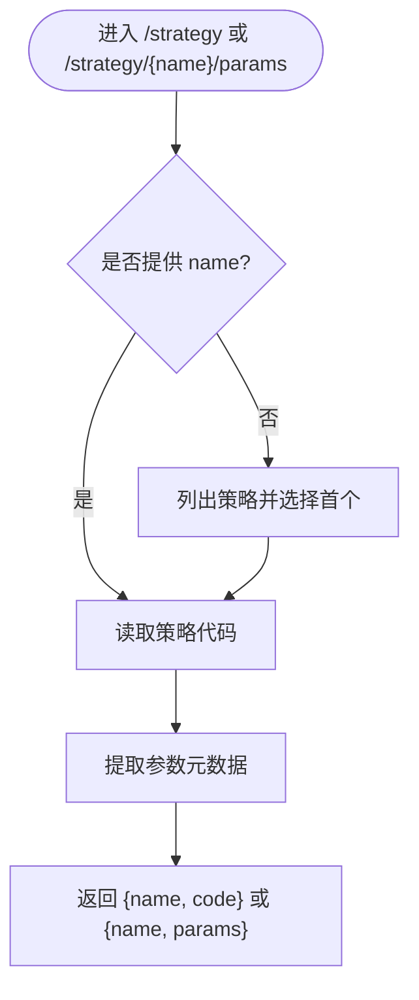
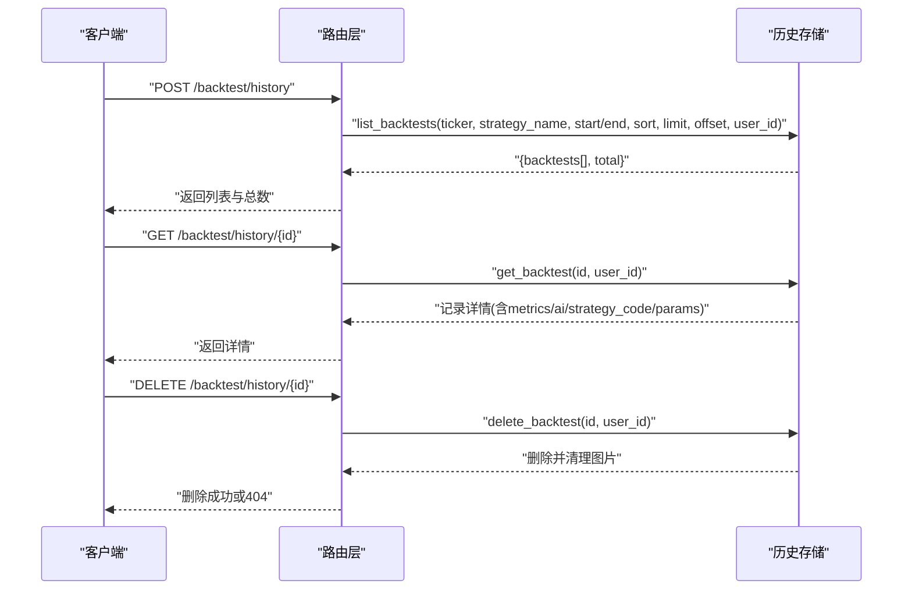
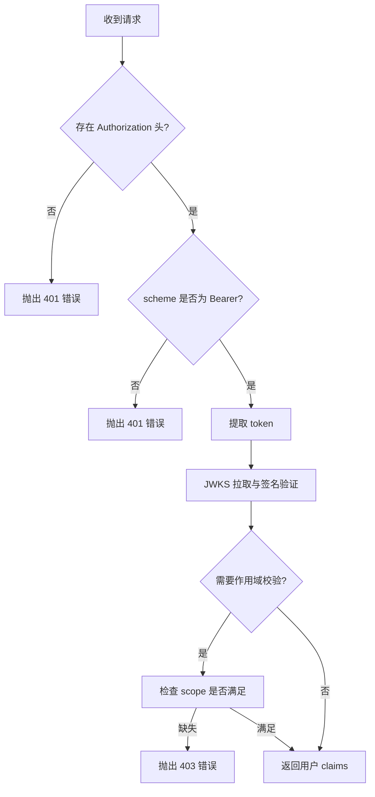
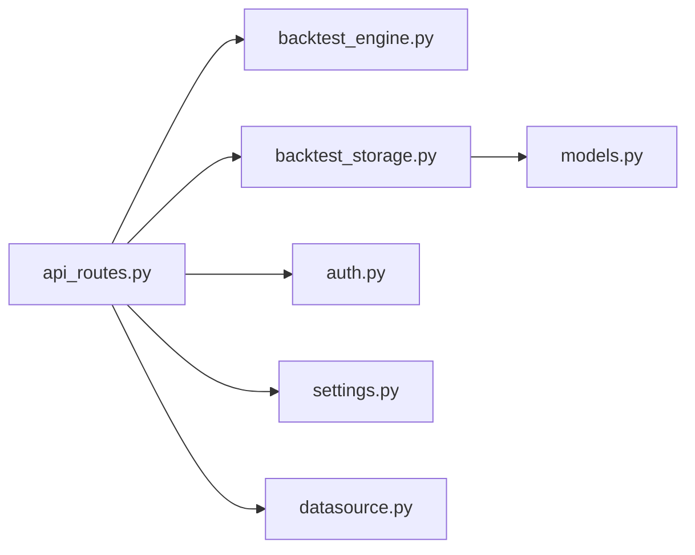

# 核心API

<cite>
**本文引用的文件列表**
- [api_routes.py](file://backend/src/routes/api_routes.py)
- [backtest_engine.py](file://backend/src/service/backtest_engine.py)
- [backtest_storage.py](file://backend/src/db/backtest_storage.py)
- [auth.py](file://backend/src/utils/auth.py)
- [settings.py](file://backend/src/config/settings.py)
- [models.py](file://backend/src/db/models.py)
- [datasource.py](file://backend/src/db/datasource.py)
- [strategy_templates.py](file://backend/src/service/strategy_templates.py)
- [test_api_module.py](file://backend/tests/test_api_module.py)
- [test_routes_imports.py](file://backend/tests/routes/test_routes_imports.py)
</cite>

## 目录
1. [简介](#简介)
2. [项目结构](#项目结构)
3. [核心组件](#核心组件)
4. [架构总览](#架构总览)
5. [详细组件分析](#详细组件分析)
6. [依赖关系分析](#依赖关系分析)
7. [性能考量](#性能考量)
8. [故障排查指南](#故障排查指南)
9. [结论](#结论)
10. [附录](#附录)

## 简介
本文件聚焦于后端路由层的核心API，围绕 api_routes.py 中实现的策略管理、回测执行与历史记录功能进行系统化说明。重点解释 BacktestRequest、StrategyCode 等 Pydantic 模型如何定义请求数据结构，梳理 /backtest、/strategy、/backtest/history 等关键端点的 HTTP 方法、认证方式与错误处理机制。结合代码路径示例，展示如何通过 POST /backtest 发起一次完整的回测任务，包括参数传递、结果返回与图表生成逻辑；并覆盖策略代码的保存与读取流程（save_strategy/get_strategy）、回测历史的分页查询、筛选与删除功能。最后说明该路由层如何调用 backtest_engine 与 backtest_storage 完成业务逻辑，并强调其在 MVC 架构中作为控制器的职责，同时给出常见问题的容错处理建议。

## 项目结构
后端采用典型的 MVC 分层：
- 控制器（Routes）：位于 backend/src/routes，负责接收请求、校验参数、调用服务层与持久化层、返回响应与错误码。
- 服务层（Service）：位于 backend/src/service，封装业务逻辑，如回测引擎、沙箱执行、模板管理等。
- 数据层（DB）：位于 backend/src/db，提供数据库操作与模型定义。
- 工具与配置：位于 backend/src/utils 与 backend/src/config，提供认证、资源目录、环境变量等支撑。

**图示来源**
- [api_routes.py](file://backend/src/routes/api_routes.py#L1-L507)
- [backtest_engine.py](file://backend/src/service/backtest_engine.py#L1-L400)
- [backtest_storage.py](file://backend/src/db/backtest_storage.py#L1-L446)
- [auth.py](file://backend/src/utils/auth.py#L1-L211)
- [settings.py](file://backend/src/config/settings.py#L1-L107)
- [models.py](file://backend/src/db/models.py#L1-L200)
- [datasource.py](file://backend/src/db/datasource.py#L1-L200)
- [strategy_templates.py](file://backend/src/service/strategy_templates.py#L1-L200)

**章节来源**
- [api_routes.py](file://backend/src/routes/api_routes.py#L1-L507)
- [backtest_engine.py](file://backend/src/service/backtest_engine.py#L1-L400)
- [backtest_storage.py](file://backend/src/db/backtest_storage.py#L1-L446)
- [auth.py](file://backend/src/utils/auth.py#L1-L211)
- [settings.py](file://backend/src/config/settings.py#L1-L107)

## 核心组件
- 请求模型
  - BacktestRequest：定义回测请求参数，包含标的、日期范围、初始资金、手续费、手数、策略名称与参数覆盖等。
  - StrategyCode：定义策略保存/读取的名称与代码体。
  - DataRequest：定义行情数据请求参数。
  - BacktestHistoryQuery：定义历史查询的过滤、排序、分页参数。
  - AIAnalysisUpdate：定义为某次回测更新AI分析的请求体。
- 控制器端点
  - /backtest：POST，发起回测，生成唯一ID、运行回测、保存图表、非阻塞写入历史。
  - /strategy：GET/POST，列出策略、读取策略、保存策略。
  - /strategy/{name}/params：GET，提取策略参数元数据。
  - /backtest/history：POST，分页查询历史，支持多字段过滤与排序。
  - /backtest/history/{backtest_id}：GET/DELETE，获取详情与删除记录。
  - /backtest/history/{backtest_id}/ai-analysis：POST，更新AI分析。
  - /templates、/templates/{template_id}、/templates/import：策略模板相关端点。
  - /ticker/{ticker}/info、/ticker/{ticker}/prices、/data：行情数据端点。
- 认证与授权
  - 使用 Bearer Token 进行鉴权，依赖 JWKS 验证与可选作用域校验。
- 错误处理
  - 统一捕获并转换为 HTTP 异常，返回标准错误码与消息；部分持久化失败不影响主流程。

**章节来源**
- [api_routes.py](file://backend/src/routes/api_routes.py#L41-L147)
- [api_routes.py](file://backend/src/routes/api_routes.py#L151-L213)
- [api_routes.py](file://backend/src/routes/api_routes.py#L215-L296)
- [api_routes.py](file://backend/src/routes/api_routes.py#L298-L350)
- [api_routes.py](file://backend/src/routes/api_routes.py#L375-L507)

## 架构总览
控制器层作为入口，负责：
- 参数校验与类型约束（Pydantic）
- 认证拦截（Bearer Token）
- 调用服务层执行回测或策略读写
- 调用数据层持久化历史与清理旧记录
- 返回标准化响应与错误码

**图示来源**
- [api_routes.py](file://backend/src/routes/api_routes.py#L215-L296)
- [backtest_engine.py](file://backend/src/service/backtest_engine.py#L302-L384)
- [backtest_storage.py](file://backend/src/db/backtest_storage.py#L37-L117)
- [datasource.py](file://backend/src/db/datasource.py#L1-L200)
- [auth.py](file://backend/src/utils/auth.py#L171-L204)

## 详细组件分析

### 请求模型与数据流
- BacktestRequest
  - 字段：ticker、start_date、end_date、initial_cash、commission、stake、strategy_name、params。
  - 默认值与可空性：commission/stake 可为空，为空时使用默认值。
  - 用途：作为 /backtest 的请求体，驱动回测引擎执行。
- StrategyCode
  - 字段：name、code。
  - 用途：/strategy 接口的保存与读取载体。
- DataRequest
  - 字段：ticker、start_date、end_date。
  - 用途：/ticker/{ticker}/prices 与兼容的 /data 端点。
- BacktestHistoryQuery
  - 字段：ticker、strategy_name、start_date、end_date、sort_by、sort_order、limit、offset。
  - 用途：/backtest/history 的查询条件与分页控制。
- AIAnalysisUpdate
  - 字段：model_name、analysis。
  - 用途：为指定回测记录追加AI分析内容。

**图示来源**
- [api_routes.py](file://backend/src/routes/api_routes.py#L41-L147)
- [api_routes.py](file://backend/src/routes/api_routes.py#L378-L393)

**章节来源**
- [api_routes.py](file://backend/src/routes/api_routes.py#L41-L147)
- [api_routes.py](file://backend/src/routes/api_routes.py#L378-L393)

### 回测执行流程（POST /backtest）
- 关键步骤
  - 生成唯一 backtest_id，拼接图片文件名，准备保存路径。
  - 若提供 strategy_name，则先尝试读取策略代码快照。
  - 调用 run_backtest，传入参数与保存路径，返回指标与交易明细。
  - 将 backtest_id、metrics、plot_url 组装为响应。
  - 非阻塞地调用 BacktestStorage.save_backtest，写入数据库并触发自动清理。
- 图表生成
  - 引擎侧使用 matplotlib 渲染 K 线+指标图，保存为 PNG。
- 错误处理
  - 策略加载失败：400。
  - 数据加载失败：502。
  - 其他异常：500。
  - 历史保存失败：记录日志但不影响主流程。

**图示来源**
- [api_routes.py](file://backend/src/routes/api_routes.py#L215-L296)
- [backtest_engine.py](file://backend/src/service/backtest_engine.py#L302-L384)
- [backtest_storage.py](file://backend/src/db/backtest_storage.py#L37-L117)

**章节来源**
- [api_routes.py](file://backend/src/routes/api_routes.py#L215-L296)
- [backtest_engine.py](file://backend/src/service/backtest_engine.py#L302-L384)
- [backtest_storage.py](file://backend/src/db/backtest_storage.py#L118-L154)

### 策略管理（/strategy 与 /strategy/{name}/params）
- GET /strategy
  - 无 name 时返回策略列表第一个策略的代码；若无可用策略则 404。
- POST /strategy
  - 保存策略名称与代码；失败时返回 400 或 500。
- GET /strategy/{name}/params
  - 解析策略参数元数据（名称、值、类型），失败时记录警告并返回空数组。

**图示来源**
- [api_routes.py](file://backend/src/routes/api_routes.py#L298-L350)
- [backtest_engine.py](file://backend/src/service/backtest_engine.py#L167-L219)

**章节来源**
- [api_routes.py](file://backend/src/routes/api_routes.py#L298-L350)
- [backtest_engine.py](file://backend/src/service/backtest_engine.py#L62-L80)
- [backtest_engine.py](file://backend/src/service/backtest_engine.py#L167-L219)

### 回测历史管理（/backtest/history）
- POST /backtest/history
  - 支持按 ticker、strategy_name、日期区间过滤，按 created_at/total_return/sharpe_ratio 排序，分页 limit/offset。
  - 返回 {backtests[], total}。
- GET /backtest/history/{backtest_id}
  - 返回单条历史记录，包含完整 metrics、AI分析、策略代码与参数。
- DELETE /backtest/history/{backtest_id}
  - 删除记录并清理对应图片文件；未找到返回 404。
- POST /backtest/history/{backtest_id}/ai-analysis
  - 为指定回测追加 AI 分析，以 {model_name: analysis} 形式合并存储。

**图示来源**
- [api_routes.py](file://backend/src/routes/api_routes.py#L394-L507)
- [backtest_storage.py](file://backend/src/db/backtest_storage.py#L184-L268)
- [backtest_storage.py](file://backend/src/db/backtest_storage.py#L269-L300)
- [backtest_storage.py](file://backend/src/db/backtest_storage.py#L300-L353)
- [backtest_storage.py](file://backend/src/db/backtest_storage.py#L354-L414)

**章节来源**
- [api_routes.py](file://backend/src/routes/api_routes.py#L394-L507)
- [backtest_storage.py](file://backend/src/db/backtest_storage.py#L184-L268)
- [backtest_storage.py](file://backend/src/db/backtest_storage.py#L269-L300)
- [backtest_storage.py](file://backend/src/db/backtest_storage.py#L300-L353)
- [backtest_storage.py](file://backend/src/db/backtest_storage.py#L354-L414)

### 认证与授权
- 认证方式
  - Bearer Token，从 Authorization 头中提取。
  - 使用 JWKS 动态拉取签名密钥，验证签名、算法、受众、签发者等。
  - 支持可选作用域校验（当配置启用）。
- 依赖注入
  - get_current_user 作为 FastAPI 依赖，为每个受保护端点注入用户上下文。
- 未启用登录
  - 当 ENABLE_LOGIN=false 时，允许匿名访问，user.sub 设为 "anonymous"。

**图示来源**
- [auth.py](file://backend/src/utils/auth.py#L171-L204)
- [auth.py](file://backend/src/utils/auth.py#L38-L120)
- [auth.py](file://backend/src/utils/auth.py#L121-L169)

**章节来源**
- [auth.py](file://backend/src/utils/auth.py#L1-L211)
- [settings.py](file://backend/src/config/settings.py#L19-L37)

### 错误处理机制
- 策略加载失败：StrategyLoadError → 400。
- 数据加载失败：DataLoadError → 502。
- 其他异常：统一捕获并返回 500。
- 历史保存失败：记录错误日志，但不阻断主流程响应。
- 未找到记录：404。

**章节来源**
- [api_routes.py](file://backend/src/routes/api_routes.py#L287-L296)
- [api_routes.py](file://backend/src/routes/api_routes.py#L426-L449)
- [api_routes.py](file://backend/src/routes/api_routes.py#L451-L474)

## 依赖关系分析
- 控制器对服务层的依赖
  - 调用 run_backtest、get_user_strategy_code、save_user_strategy_code、list_strategies、extract_strategy_params。
- 控制器对数据层的依赖
  - 通过 BacktestStorage 提供的 save_backtest、list_backtests、get_backtest、delete_backtest、update_ai_analysis。
- 控制器对工具与配置的依赖
  - 认证依赖 auth.get_current_user；资源目录依赖 settings.IMAGES_DIR、STRATEGY_DIR；数据源依赖 datasource.get_raw_data_json。
- 服务层内部依赖
  - backtest_engine 依赖 settings、datasource、strategy_sandbox/isolated_sandbox；回测指标与图表渲染由 backtrader 与 matplotlib 完成。
- 数据层依赖
  - models 定义表结构；SQLAlchemy 查询与事务管理；自动清理旧记录与损坏数据修复。

**图示来源**
- [api_routes.py](file://backend/src/routes/api_routes.py#L1-L50)
- [backtest_engine.py](file://backend/src/service/backtest_engine.py#L1-L40)
- [backtest_storage.py](file://backend/src/db/backtest_storage.py#L1-L40)
- [auth.py](file://backend/src/utils/auth.py#L1-L40)
- [settings.py](file://backend/src/config/settings.py#L1-L40)
- [datasource.py](file://backend/src/db/datasource.py#L1-L40)
- [models.py](file://backend/src/db/models.py#L1-L60)

**章节来源**
- [api_routes.py](file://backend/src/routes/api_routes.py#L1-L50)
- [backtest_engine.py](file://backend/src/service/backtest_engine.py#L1-L40)
- [backtest_storage.py](file://backend/src/db/backtest_storage.py#L1-L40)
- [auth.py](file://backend/src/utils/auth.py#L1-L40)
- [settings.py](file://backend/src/config/settings.py#L1-L40)
- [datasource.py](file://backend/src/db/datasource.py#L1-L40)
- [models.py](file://backend/src/db/models.py#L1-L60)

## 性能考量
- 回测执行
  - 使用 matplotlib Agg 后端与关闭交互模式，避免弹窗与阻塞。
  - 图表渲染 DPI 与尺寸固定，保证输出质量与体积平衡。
- 存储与清理
  - 历史记录上限控制与自动清理，避免磁盘膨胀。
  - 删除记录时同步清理图片文件，减少碎片。
- 并发与超时
  - 沙箱执行支持超时与内存限制，防止恶意或异常策略导致资源耗尽。
- I/O 与网络
  - 数据源访问与 JWKS 拉取带超时与代理配置，提升稳定性。

[本节为通用性能讨论，无需具体文件引用]

## 故障排查指南
- 策略参数解析失败
  - 现象：/strategy/{name}/params 返回空数组。
  - 原因：策略文件参数提取逻辑异常或参数定义不符合预期。
  - 处理：检查策略文件结构与参数声明，必要时降级使用默认值。
  - 参考
    - [api_routes.py](file://backend/src/routes/api_routes.py#L325-L350)
    - [backtest_engine.py](file://backend/src/service/backtest_engine.py#L167-L219)
- UUID 生成冲突
  - 现象：极少数情况下历史记录重复。
  - 原因：UUID 生成器冲突概率极低，但理论上存在。
  - 处理：后端已使用数据库唯一约束与自动清理策略，建议关注清理逻辑与并发写入。
  - 参考
    - [backtest_storage.py](file://backend/src/db/backtest_storage.py#L25-L31)
    - [backtest_storage.py](file://backend/src/db/backtest_storage.py#L118-L154)
- 文件路径权限错误
  - 现象：保存图片或策略文件失败。
  - 原因：IMAGES_DIR/STRATEGY_DIR 权限不足或不存在。
  - 处理：确保 ensure_resource_dirs 创建并赋予写权限。
  - 参考
    - [settings.py](file://backend/src/config/settings.py#L71-L106)
    - [backtest_engine.py](file://backend/src/service/backtest_engine.py#L67-L80)
    - [backtest_engine.py](file://backend/src/service/backtest_engine.py#L366-L384)
- 数据库存储异常
  - 现象：历史保存失败，但回测响应正常。
  - 原因：数据库连接、事务或 JSON 序列化异常。
  - 处理：查看日志，必要时触发损坏记录清理后重试。
  - 参考
    - [api_routes.py](file://backend/src/routes/api_routes.py#L252-L285)
    - [backtest_storage.py](file://backend/src/db/backtest_storage.py#L110-L117)
    - [backtest_storage.py](file://backend/src/db/backtest_storage.py#L155-L183)
- 认证失败
  - 现象：401/403。
  - 原因：Token 缺失、格式错误、过期、签名无效或缺少作用域。
  - 处理：确认 Authorization 头、Token 有效性与 JWKS 配置。
  - 参考
    - [auth.py](file://backend/src/utils/auth.py#L171-L204)
    - [auth.py](file://backend/src/utils/auth.py#L38-L120)

**章节来源**
- [api_routes.py](file://backend/src/routes/api_routes.py#L252-L285)
- [backtest_engine.py](file://backend/src/service/backtest_engine.py#L67-L80)
- [backtest_engine.py](file://backend/src/service/backtest_engine.py#L366-L384)
- [backtest_storage.py](file://backend/src/db/backtest_storage.py#L110-L117)
- [backtest_storage.py](file://backend/src/db/backtest_storage.py#L155-L183)
- [auth.py](file://backend/src/utils/auth.py#L171-L204)
- [auth.py](file://backend/src/utils/auth.py#L38-L120)

## 结论
本文件系统性梳理了后端核心API在策略管理、回测执行与历史记录方面的设计与实现。控制器层通过 Pydantic 模型严格约束请求参数，结合认证中间件保障安全，调用服务层完成回测与策略读写，并通过数据层实现历史记录的持久化与清理。整体遵循 MVC 分层与约定，具备良好的扩展性与容错能力。建议在生产环境中关注资源目录权限、数据库稳定性与 JWKS 配置，以确保回测与历史管理的可靠性。

[本节为总结性内容，无需具体文件引用]

## 附录
- 测试与导出
  - 后端应用导出 FastAPI 实例，路由模块导入并通过断言确保 router 存在。
  - 参考
    - [test_api_module.py](file://backend/tests/test_api_module.py#L1-L9)
    - [test_routes_imports.py](file://backend/tests/routes/test_routes_imports.py#L1-L23)

**章节来源**
- [test_api_module.py](file://backend/tests/test_api_module.py#L1-L9)
- [test_routes_imports.py](file://backend/tests/routes/test_routes_imports.py#L1-L23)