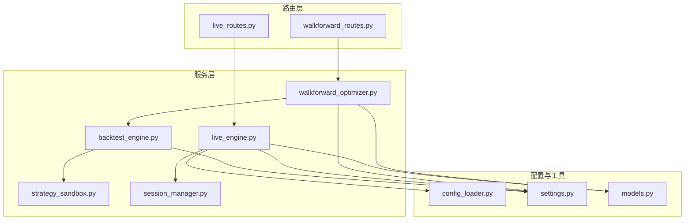
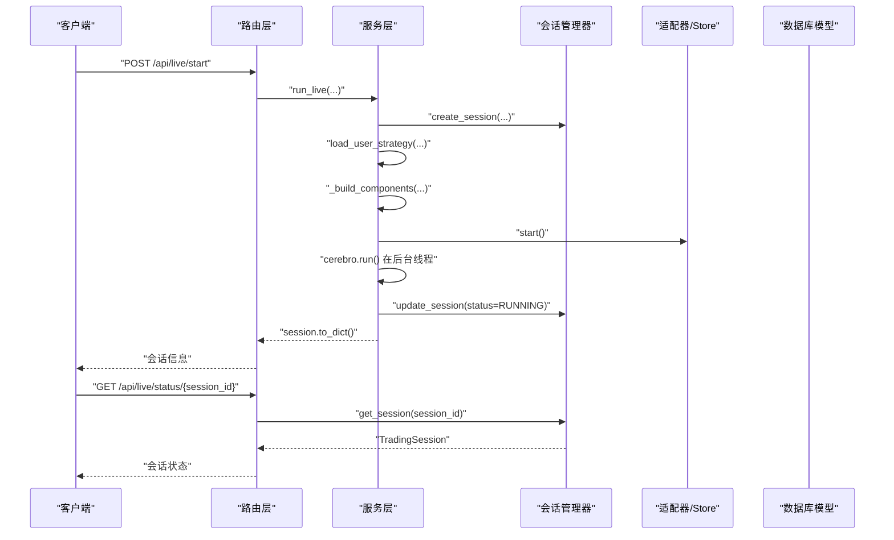
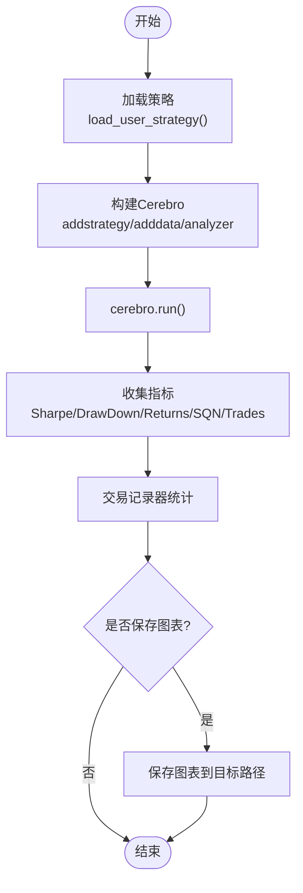
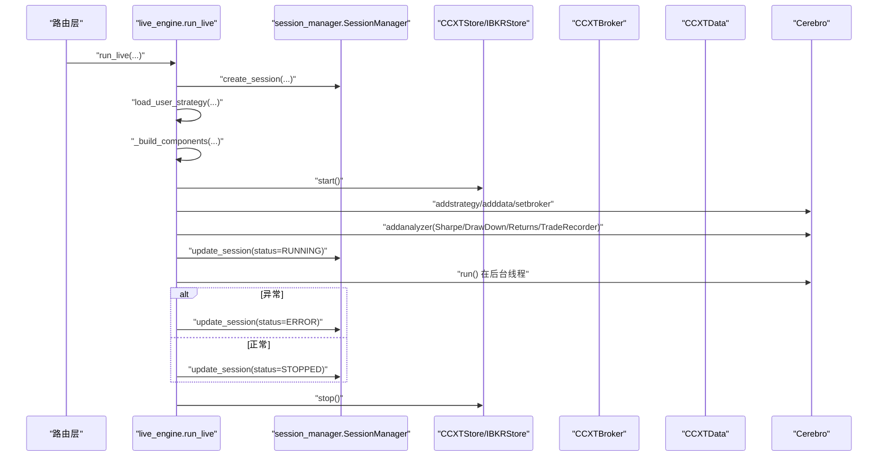
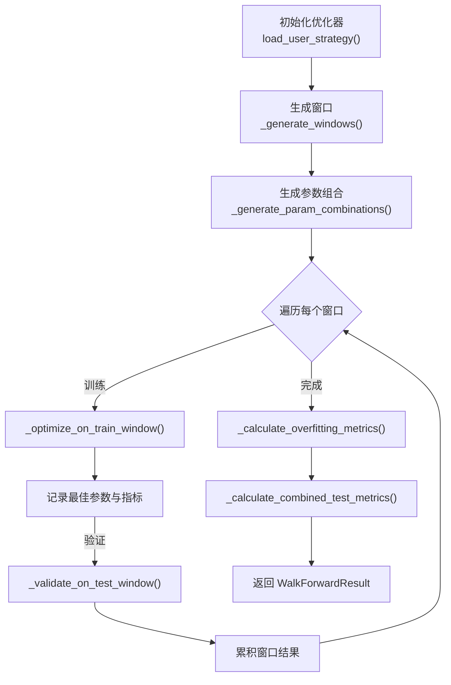
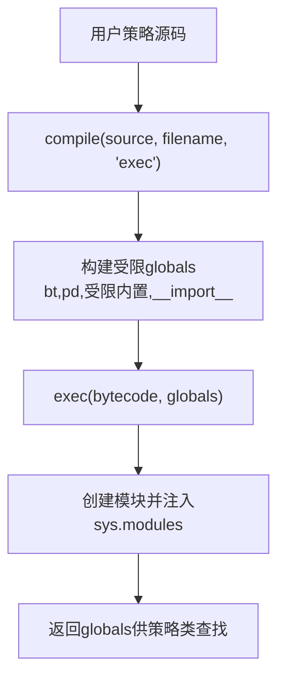
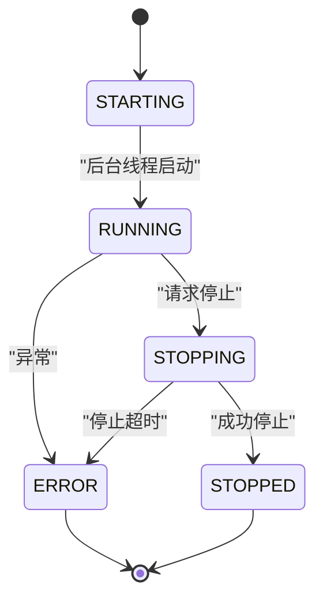
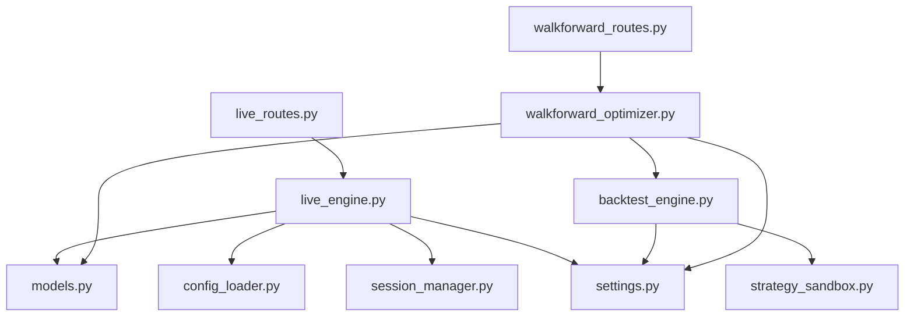

# 业务逻辑层

<cite>
**本文引用的文件列表**
- [backend/src/service/backtest_engine.py](file://backend/src/service/backtest_engine.py)
- [backend/src/service/live_engine.py](file://backend/src/service/live_engine.py)
- [backend/src/service/walkforward_optimizer.py](file://backend/src/service/walkforward_optimizer.py)
- [backend/src/service/strategy_sandbox.py](file://backend/src/service/strategy_sandbox.py)
- [backend/src/service/session_manager.py](file://backend/src/service/session_manager.py)
- [backend/src/service/service.md](file://backend/src/service/service.md)
- [backend/src/routes/live_routes.py](file://backend/src/routes/live_routes.py)
- [backend/src/routes/walkforward_routes.py](file://backend/src/routes/walkforward_routes.py)
- [backend/src/config/settings.py](file://backend/src/config/settings.py)
- [backend/src/utils/config_loader.py](file://backend/src/utils/config_loader.py)
- [backend/src/db/models.py](file://backend/src/db/models.py)
</cite>

## 目录
1. [引言](#引言)
2. [项目结构](#项目结构)
3. [核心组件](#核心组件)
4. [架构总览](#架构总览)
5. [详细组件分析](#详细组件分析)
6. [依赖关系分析](#依赖关系分析)
7. [性能考量](#性能考量)
8. [故障排查指南](#故障排查指南)
9. [结论](#结论)
10. [附录](#附录)

## 引言
本文件聚焦后端业务逻辑层的核心服务组件，系统化梳理以下模块：
- 回测引擎：回测执行流程、事件驱动机制与性能优化策略
- 实盘引擎：实盘交易生命周期、订单执行与风险控制
- 参数优化器：滚动/锚定窗口的参数优化算法与分布式扩展思路
- 策略沙箱：沙箱安全机制与策略隔离执行原理
- 会话管理：会话状态管理与单例模式实现

文档同时覆盖各服务的初始化过程、方法调用关系、异常处理机制与线程安全考虑，并结合路由层展示服务间协作模式，最后给出新服务开发的最佳实践与长耗时任务异步处理规范。

## 项目结构
业务逻辑层位于 backend/src/service，围绕“服务层不定义路由”的约定，通过 FastAPI 路由层进行编排与调用。核心文件如下：
- 回测引擎：负责策略加载、数据接入、指标分析与图表输出
- 实盘引擎：负责会话创建、组件初始化、Cerebro 运行与生命周期管理
- 参数优化器：负责训练/验证窗口生成、参数组合遍历与过拟合检测
- 策略沙箱：负责策略代码的安全执行与导入白名单控制
- 会话管理：负责多会话并发管理、状态机与线程安全

图示来源
- [backend/src/routes/live_routes.py](file://backend/src/routes/live_routes.py#L1-L200)
- [backend/src/routes/walkforward_routes.py](file://backend/src/routes/walkforward_routes.py#L1-L120)
- [backend/src/service/backtest_engine.py](file://backend/src/service/backtest_engine.py#L1-L120)
- [backend/src/service/live_engine.py](file://backend/src/service/live_engine.py#L1-L120)
- [backend/src/service/walkforward_optimizer.py](file://backend/src/service/walkforward_optimizer.py#L1-L120)
- [backend/src/service/strategy_sandbox.py](file://backend/src/service/strategy_sandbox.py#L1-L80)
- [backend/src/service/session_manager.py](file://backend/src/service/session_manager.py#L1-L120)
- [backend/src/utils/config_loader.py](file://backend/src/utils/config_loader.py#L1-L120)
- [backend/src/config/settings.py](file://backend/src/config/settings.py#L1-L80)
- [backend/src/db/models.py](file://backend/src/db/models.py#L1-L120)

章节来源
- [backend/src/service/service.md](file://backend/src/service/service.md#L1-L21)

## 核心组件
- 回测引擎：封装策略加载、数据接入、分析器注册、Cerebro 执行与图表渲染，提供统一的回测入口与指标聚合
- 实盘引擎：封装会话创建、组件装配（Store/Broker/Data）、Cerebro 后台运行、状态更新与优雅停止
- 参数优化器：基于滚动/锚定窗口的训练-验证流程，提供过拟合检测与汇总统计
- 策略沙箱：限制策略可导入模块与内置函数，防止恶意或越权操作
- 会话管理：单例会话管理器，提供线程安全的会话生命周期管理与状态机

章节来源
- [backend/src/service/backtest_engine.py](file://backend/src/service/backtest_engine.py#L1-L120)
- [backend/src/service/live_engine.py](file://backend/src/service/live_engine.py#L1-L120)
- [backend/src/service/walkforward_optimizer.py](file://backend/src/service/walkforward_optimizer.py#L1-L120)
- [backend/src/service/strategy_sandbox.py](file://backend/src/service/strategy_sandbox.py#L1-L80)
- [backend/src/service/session_manager.py](file://backend/src/service/session_manager.py#L1-L120)

## 架构总览
服务层通过路由层暴露 REST 接口，路由层对请求参数进行校验与鉴权，随后调用对应服务层函数完成业务编排。会话管理器作为全局单例贯穿实盘生命周期，策略沙箱保障策略代码执行安全，参数优化器在后台任务中运行并持久化结果。

图示来源
- [backend/src/routes/live_routes.py](file://backend/src/routes/live_routes.py#L100-L180)
- [backend/src/service/live_engine.py](file://backend/src/service/live_engine.py#L100-L260)
- [backend/src/service/session_manager.py](file://backend/src/service/session_manager.py#L120-L220)
- [backend/src/db/models.py](file://backend/src/db/models.py#L63-L121)

## 详细组件分析

### 回测引擎 backtest_engine.py
- 策略加载与安全
  - 策略文件名清洗与路径构造，防止路径穿越
  - 通过策略沙箱执行用户策略代码，限定导入模块与内置函数
  - 若沙箱或文件系统错误，抛出策略加载异常
- 数据接入与分析器
  - 使用数据源加载回测数据，添加策略与分析器（夏普比率、最大回撤、收益、年度回报、SQN、交易分析、时间序列回撤等）
  - 自定义交易记录器用于统计每笔交易的开平仓、盈亏、手续费与持续时间
- 执行与输出
  - Cerebro 执行回测，聚合指标并返回
  - 可选保存图表至指定路径，失败时抛出渲染异常
- 性能优化策略
  - 关闭交互式绘图，使用非交互后端避免弹窗与阻塞
  - 统一资源目录确保图像与策略目录存在
  - 对图表尺寸与 DPI 进行控制，平衡质量与体积

图示来源
- [backend/src/service/backtest_engine.py](file://backend/src/service/backtest_engine.py#L180-L272)

章节来源
- [backend/src/service/backtest_engine.py](file://backend/src/service/backtest_engine.py#L1-L120)
- [backend/src/service/backtest_engine.py](file://backend/src/service/backtest_engine.py#L180-L272)
- [backend/src/service/strategy_sandbox.py](file://backend/src/service/strategy_sandbox.py#L148-L181)

### 实盘引擎 live_engine.py
- 会话生命周期
  - 创建会话：生成 session_id，填充策略、标的、交易所、模式、时间框架、初始资金与手续费
  - 加载策略：复用回测引擎的策略加载能力
  - 组件装配：根据适配器（CCXT/IBKR）创建 Store/Broker/DataFeed
  - 初始化 Cerebro：添加策略、数据、分析器与交易记录器
  - 后台运行：在守护线程中运行 cerebro.run()，期间更新状态为 RUNNING
  - 停止流程：捕获异常更新状态为 ERROR，否则正常 STOPPED；关闭 Store 并持久化
- 异常处理与线程安全
  - 后台线程异常捕获并更新会话状态与错误信息
  - 会话状态机与锁保护，避免竞态
- 风险控制
  - 返回分析器对零条目场景进行容错，避免除零错误
  - 通过配置加载器与 Broker 配置进行市场与风控参数约束

图示来源
- [backend/src/service/live_engine.py](file://backend/src/service/live_engine.py#L100-L260)
- [backend/src/service/session_manager.py](file://backend/src/service/session_manager.py#L120-L220)

章节来源
- [backend/src/service/live_engine.py](file://backend/src/service/live_engine.py#L1-L120)
- [backend/src/service/live_engine.py](file://backend/src/service/live_engine.py#L100-L260)
- [backend/src/service/live_engine.py](file://backend/src/service/live_engine.py#L268-L329)
- [backend/src/utils/config_loader.py](file://backend/src/utils/config_loader.py#L179-L218)

### 参数优化器 walkforward_optimizer.py
- 窗口生成
  - 支持滚动与锚定两种窗口：滚动向前滑动，锚定从起点增长训练集
  - 保证测试窗口不超过整体结束日期
- 参数网格
  - 从参数字典生成笛卡尔积，穷举所有组合
- 单次回测
  - 为每个参数组合运行一次回测，提取最终净值、总回报、夏普、最大回撤、SQN、交易数、胜率与利润因子
  - 对异常进行兜底，返回默认指标字典
- 训练与验证
  - 在训练窗口上按指定指标寻找最佳参数组合
  - 在测试窗口上验证最佳参数，得到测试指标
- 过拟合检测与汇总
  - 计算训练/测试相关性、平均退化百分比、一致性得分与退化标准差
  - 汇总所有测试窗口的回报、夏普、最大回撤与交易统计

图示来源
- [backend/src/service/walkforward_optimizer.py](file://backend/src/service/walkforward_optimizer.py#L116-L200)
- [backend/src/service/walkforward_optimizer.py](file://backend/src/service/walkforward_optimizer.py#L274-L340)
- [backend/src/service/walkforward_optimizer.py](file://backend/src/service/walkforward_optimizer.py#L341-L418)
- [backend/src/service/walkforward_optimizer.py](file://backend/src/service/walkforward_optimizer.py#L419-L538)

章节来源
- [backend/src/service/walkforward_optimizer.py](file://backend/src/service/walkforward_optimizer.py#L1-L120)
- [backend/src/service/walkforward_optimizer.py](file://backend/src/service/walkforward_optimizer.py#L116-L200)
- [backend/src/service/walkforward_optimizer.py](file://backend/src/service/walkforward_optimizer.py#L274-L340)
- [backend/src/service/walkforward_optimizer.py](file://backend/src/service/walkforward_optimizer.py#L341-L418)
- [backend/src/service/walkforward_optimizer.py](file://backend/src/service/walkforward_optimizer.py#L419-L538)

### 策略沙箱 strategy_sandbox.py
- 安全执行
  - 构建受限的内置函数集合与允许导入模块白名单
  - 自定义 __import__，仅允许白名单模块导入
  - 编译用户策略源码为字节码，再在受控全局环境中执行
- 错误处理
  - 语法错误与执行异常均包装为策略沙箱错误
- 输出
  - 返回执行后的全局命名空间，供策略类查找

图示来源
- [backend/src/service/strategy_sandbox.py](file://backend/src/service/strategy_sandbox.py#L148-L181)

章节来源
- [backend/src/service/strategy_sandbox.py](file://backend/src/service/strategy_sandbox.py#L1-L80)
- [backend/src/service/strategy_sandbox.py](file://backend/src/service/strategy_sandbox.py#L148-L181)

### 会话管理 session_manager.py
- 单例模式
  - 使用双重检查锁定确保线程安全的单例实例
- 会话状态机
  - STARTING → RUNNING → STOPPING → STOPPED 或 ERROR
- 生命周期管理
  - 创建、注册、查询、更新、停止、移除、列出、计数
  - 停止流程包含 Store 停止、线程 join 与超时控制
- 线程安全
  - 使用 RLock 保护会话字典，避免并发修改
  - 状态更新与日志记录在锁内进行

图示来源
- [backend/src/service/session_manager.py](file://backend/src/service/session_manager.py#L1-L120)
- [backend/src/service/session_manager.py](file://backend/src/service/session_manager.py#L120-L220)
- [backend/src/service/session_manager.py](file://backend/src/service/session_manager.py#L238-L292)

章节来源
- [backend/src/service/session_manager.py](file://backend/src/service/session_manager.py#L1-L120)
- [backend/src/service/session_manager.py](file://backend/src/service/session_manager.py#L120-L220)
- [backend/src/service/session_manager.py](file://backend/src/service/session_manager.py#L238-L292)

## 依赖关系分析
- 路由层依赖服务层
  - live_routes 调用 live_engine 的 run_live/stop_live/get_session_status
  - walkforward_routes 调用 walkforward_optimizer 的后台任务与存储
- 服务层内部依赖
  - live_engine 依赖 session_manager、config_loader、backtest_engine（交易记录器）
  - backtest_engine 依赖 strategy_sandbox、config_loader（策略目录）
  - walkforward_optimizer 依赖 backtest_engine（策略加载与数据源）
- 配置与资源
  - config_loader 提供 Broker 配置与校验
  - settings 提供资源目录与环境变量
- 数据模型
  - models 定义会话、订单、持仓与回测历史的数据库模型，支撑持久化与查询

图示来源
- [backend/src/routes/live_routes.py](file://backend/src/routes/live_routes.py#L1-L120)
- [backend/src/routes/walkforward_routes.py](file://backend/src/routes/walkforward_routes.py#L1-L120)
- [backend/src/service/live_engine.py](file://backend/src/service/live_engine.py#L1-L120)
- [backend/src/service/walkforward_optimizer.py](file://backend/src/service/walkforward_optimizer.py#L1-L120)
- [backend/src/service/backtest_engine.py](file://backend/src/service/backtest_engine.py#L1-L120)
- [backend/src/service/strategy_sandbox.py](file://backend/src/service/strategy_sandbox.py#L1-L80)
- [backend/src/service/session_manager.py](file://backend/src/service/session_manager.py#L1-L120)
- [backend/src/utils/config_loader.py](file://backend/src/utils/config_loader.py#L1-L120)
- [backend/src/config/settings.py](file://backend/src/config/settings.py#L1-L80)
- [backend/src/db/models.py](file://backend/src/db/models.py#L1-L120)

章节来源
- [backend/src/routes/live_routes.py](file://backend/src/routes/live_routes.py#L1-L120)
- [backend/src/routes/walkforward_routes.py](file://backend/src/routes/walkforward_routes.py#L1-L120)
- [backend/src/service/live_engine.py](file://backend/src/service/live_engine.py#L1-L120)
- [backend/src/service/walkforward_optimizer.py](file://backend/src/service/walkforward_optimizer.py#L1-L120)
- [backend/src/service/backtest_engine.py](file://backend/src/service/backtest_engine.py#L1-L120)
- [backend/src/service/strategy_sandbox.py](file://backend/src/service/strategy_sandbox.py#L1-L80)
- [backend/src/service/session_manager.py](file://backend/src/service/session_manager.py#L1-L120)
- [backend/src/utils/config_loader.py](file://backend/src/utils/config_loader.py#L1-L120)
- [backend/src/config/settings.py](file://backend/src/config/settings.py#L1-L80)
- [backend/src/db/models.py](file://backend/src/db/models.py#L1-L120)

## 性能考量
- 回测引擎
  - 非交互式绘图与关闭显示，避免本地弹窗与阻塞
  - 控制图表尺寸与 DPI，兼顾质量与体积
  - 统一资源目录，减少 IO 异常
- 实盘引擎
  - 后台线程运行 cerebro，避免阻塞主线程
  - 状态更新与 Store 清理在异常路径中进行，确保资源释放
- 参数优化器
  - 穷举参数组合可能带来大量回测任务，建议采用分批/并行/分布式执行策略
  - 过拟合检测指标可用于筛选稳健参数组合，减少无效尝试
- 会话管理
  - 使用 RLock 保护共享状态，避免频繁加锁带来的竞争
  - 停止流程设置超时，防止线程无法退出导致资源泄漏

[本节为通用指导，无需特定文件来源]

## 故障排查指南
- 回测引擎
  - 策略加载失败：检查策略文件是否存在、名称合法性与沙箱导入限制
  - 图表渲染失败：确认绘图后端可用与目标路径权限
- 实盘引擎
  - 会话启动失败：检查 Broker 配置、交易所可用性与凭证
  - 会话停止失败：查看 Store 停止与线程 join 是否超时
  - 返回分析器零条目：使用容错返回器避免除零错误
- 参数优化器
  - 参数组合过多导致内存/时间压力：分批执行或限制参数范围
  - 训练/验证指标异常：检查数据源与时间窗口边界
- 会话管理
  - 并发访问冲突：确认使用单例与锁保护
  - 状态不一致：检查状态更新顺序与异常分支

章节来源
- [backend/src/service/backtest_engine.py](file://backend/src/service/backtest_engine.py#L180-L272)
- [backend/src/service/live_engine.py](file://backend/src/service/live_engine.py#L268-L329)
- [backend/src/service/walkforward_optimizer.py](file://backend/src/service/walkforward_optimizer.py#L274-L340)
- [backend/src/service/session_manager.py](file://backend/src/service/session_manager.py#L238-L292)

## 结论
业务逻辑层通过明确的职责划分与严格的异常处理，实现了从策略加载、数据接入、分析计算到会话管理与参数优化的完整闭环。策略沙箱确保了用户代码的安全执行，会话管理器提供了可靠的并发控制与生命周期管理。参数优化器通过窗口化与过拟合检测提升了参数选择的稳健性。路由层通过统一的接口编排这些服务，形成清晰的前后端协作模式。

[本节为总结，无需特定文件来源]

## 附录

### 服务间协作模式
- 路由层负责输入校验与鉴权，服务层负责业务编排
- live_engine 与 session_manager 协作管理实盘会话
- walkforward_optimizer 通过后台任务运行，避免阻塞主流程
- backtest_engine 与 strategy_sandbox 共同保障策略安全与可执行

章节来源
- [backend/src/routes/live_routes.py](file://backend/src/routes/live_routes.py#L100-L180)
- [backend/src/routes/walkforward_routes.py](file://backend/src/routes/walkforward_routes.py#L129-L228)
- [backend/src/service/live_engine.py](file://backend/src/service/live_engine.py#L100-L260)
- [backend/src/service/session_manager.py](file://backend/src/service/session_manager.py#L120-L220)
- [backend/src/service/backtest_engine.py](file://backend/src/service/backtest_engine.py#L180-L272)

### 新服务开发最佳实践
- 初始化与依赖
  - 明确依赖注入与配置加载，避免硬编码
  - 使用单例或全局工厂管理跨模块共享对象
- 方法调用关系
  - 将复杂流程拆分为小函数，保持单一职责
  - 明确前置条件与后置条件，便于测试与维护
- 异常处理机制
  - 区分业务异常与系统异常，前者可直接返回，后者需记录并向上抛出
  - 在关键路径增加 try/except/finally，确保资源清理
- 线程安全考虑
  - 对共享状态使用锁保护，避免竞态
  - 后台任务设置超时与取消机制，防止资源泄漏
- 长耗时任务的异步处理规范
  - 使用后台任务队列或线程池，避免阻塞请求线程
  - 提供进度查询与状态更新接口，支持取消与重试
  - 对外部依赖（网络、数据库）增加重试与熔断策略

章节来源
- [backend/src/service/service.md](file://backend/src/service/service.md#L1-L21)
- [backend/src/service/session_manager.py](file://backend/src/service/session_manager.py#L120-L220)
- [backend/src/routes/walkforward_routes.py](file://backend/src/routes/walkforward_routes.py#L129-L228)