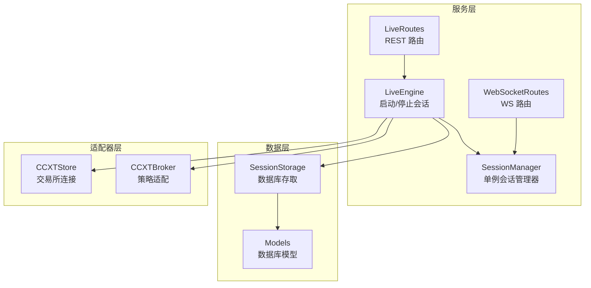
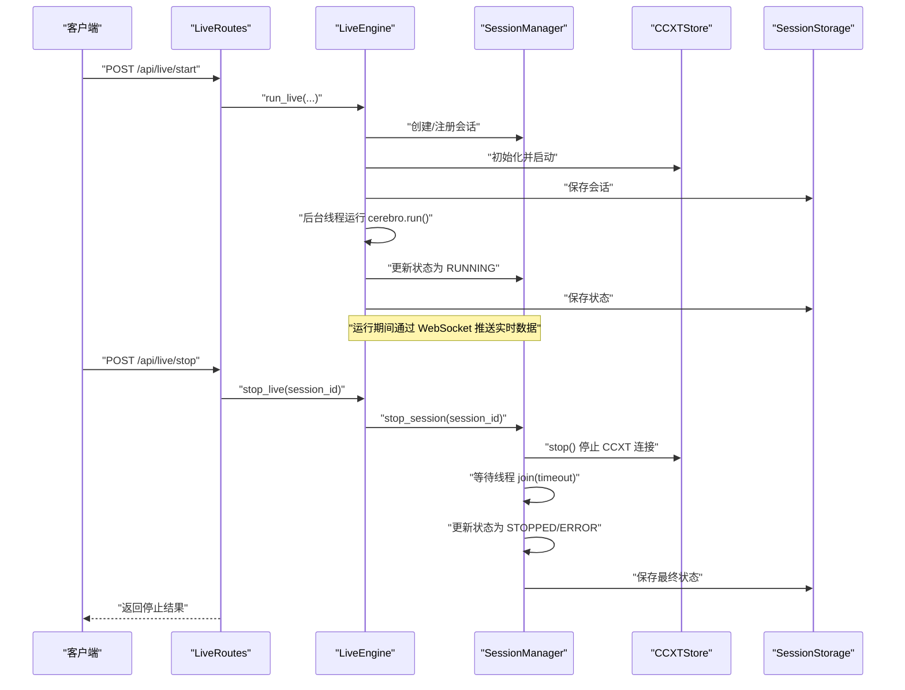
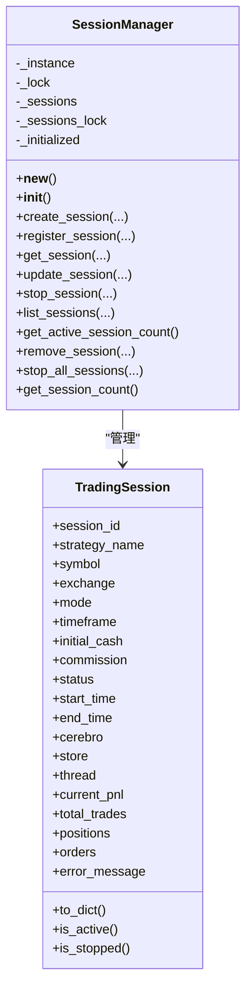
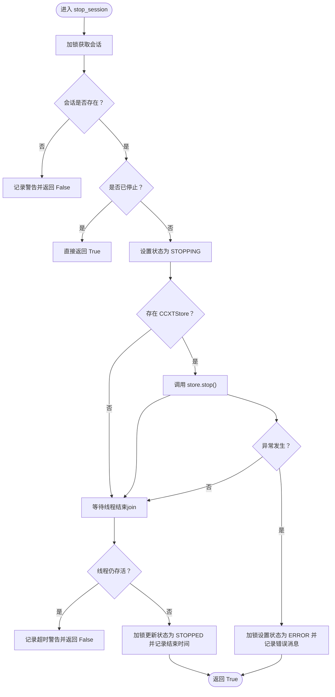
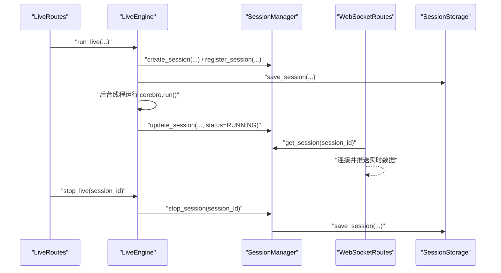
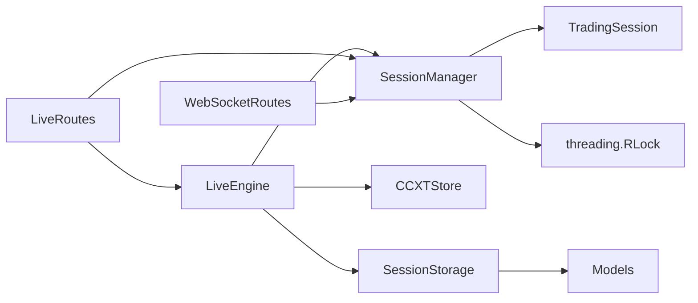

# 会话管理

<cite>
**本文引用的文件列表**
- [session_manager.py](file://backend/src/service/session_manager.py)
- [live_engine.py](file://backend/src/service/live_engine.py)
- [live_routes.py](file://backend/src/routes/live_routes.py)
- [websocket_routes.py](file://backend/src/routes/websocket_routes.py)
- [session_storage.py](file://backend/src/db/session_storage.py)
- [models.py](file://backend/src/db/models.py)
- [ccxt_store.py](file://backend/src/brokers/ccxt_adapter/ccxt_store.py)
- [ccxt_broker.py](file://backend/src/brokers/ccxt_adapter/ccxt_broker.py)
- [test_session_manager.py](file://auto_test/test_session_manager.py)
</cite>

## 目录
1. [简介](#简介)
2. [项目结构](#项目结构)
3. [核心组件](#核心组件)
4. [架构总览](#架构总览)
5. [组件详解](#组件详解)
6. [依赖关系分析](#依赖关系分析)
7. [性能考量](#性能考量)
8. [故障排查指南](#故障排查指南)
9. [结论](#结论)
10. [附录](#附录)

## 简介
本文件深入解析后端服务中的会话状态管理与单例模式实现，聚焦于 session_manager.py 模块。文档围绕以下目标展开：
- 解释 SessionManager 类如何通过 __new__ 方法与线程锁（_lock）实现单例模式，确保全局唯一实例；
- 分析 TradingSession 数据类如何封装会话的配置、状态与运行时信息（如 cerebro、store、thread）；
- 阐述 create_session、get_session、stop_session 等核心方法如何在保证线程安全的前提下（使用 _sessions_lock）对会话进行增删改查；
- 解释 stop_session 方法如何协调停止 CCXTStore、等待线程结束并更新会话状态的完整流程；
- 结合代码示例说明如何在应用中获取全局会话管理器并管理多个并发交易会话。

## 项目结构
与会话管理直接相关的模块分布如下：
- 后端服务层：session_manager.py（会话管理）、live_engine.py（启动/停止会话逻辑）、routes（REST/WebSocket 路由）
- 数据持久化层：session_storage.py（数据库存取）、models.py（数据库模型）
- 适配器层：ccxt_store.py（CCXT 存储）、ccxt_broker.py（CCXT 经纪商）

图表来源
- [session_manager.py](file://backend/src/service/session_manager.py#L95-L408)
- [live_engine.py](file://backend/src/service/live_engine.py#L190-L329)
- [live_routes.py](file://backend/src/routes/live_routes.py#L1-L200)
- [websocket_routes.py](file://backend/src/routes/websocket_routes.py#L1-L200)
- [session_storage.py](file://backend/src/db/session_storage.py#L1-L392)
- [models.py](file://backend/src/db/models.py#L62-L119)
- [ccxt_store.py](file://backend/src/brokers/ccxt_adapter/ccxt_store.py#L43-L82)
- [ccxt_broker.py](file://backend/src/brokers/ccxt_adapter/ccxt_broker.py#L49-L91)

章节来源
- [session_manager.py](file://backend/src/service/session_manager.py#L1-L410)
- [live_engine.py](file://backend/src/service/live_engine.py#L190-L329)
- [live_routes.py](file://backend/src/routes/live_routes.py#L1-L200)
- [websocket_routes.py](file://backend/src/routes/websocket_routes.py#L1-L200)
- [session_storage.py](file://backend/src/db/session_storage.py#L1-L392)
- [models.py](file://backend/src/db/models.py#L62-L119)
- [ccxt_store.py](file://backend/src/brokers/ccxt_adapter/ccxt_store.py#L43-L82)
- [ccxt_broker.py](file://backend/src/brokers/ccxt_adapter/ccxt_broker.py#L49-L91)

## 核心组件
- 单例会话管理器：SessionManager 提供全局唯一的会话管理入口，内部以字典维护所有会话，并通过 RLock 保证线程安全。
- 会话数据对象：TradingSession 封装会话配置、状态与运行时对象（cerebro、store、thread），并提供序列化输出。
- 生命周期管理：create_session、register_session、get_session、update_session、remove_session、list_sessions、get_active_session_count、stop_session、stop_all_sessions。
- 全局访问：get_session_manager 返回全局 SessionManager 实例，供路由与引擎调用。

章节来源
- [session_manager.py](file://backend/src/service/session_manager.py#L28-L92)
- [session_manager.py](file://backend/src/service/session_manager.py#L95-L394)
- [session_manager.py](file://backend/src/service/session_manager.py#L398-L408)

## 架构总览
下图展示从路由到引擎再到会话管理器与存储的整体交互流程。

图表来源
- [live_routes.py](file://backend/src/routes/live_routes.py#L100-L200)
- [live_engine.py](file://backend/src/service/live_engine.py#L190-L329)
- [session_manager.py](file://backend/src/service/session_manager.py#L132-L290)
- [session_storage.py](file://backend/src/db/session_storage.py#L59-L119)

## 组件详解

### 单例模式与全局访问
- SessionManager 使用双重检查锁定的 __new__ 实现单例，避免多线程竞争导致的重复实例化；同时通过类变量 _lock 保护实例创建过程。
- 初始化时仅在首次进入构造函数时设置内部状态（_sessions、_sessions_lock、_initialized），确保幂等性。
- 提供 get_session_manager() 函数作为全局访问入口，便于路由与引擎模块统一获取管理器实例。

图表来源
- [session_manager.py](file://backend/src/service/session_manager.py#L95-L394)
- [session_manager.py](file://backend/src/service/session_manager.py#L28-L92)

章节来源
- [session_manager.py](file://backend/src/service/session_manager.py#L113-L131)
- [session_manager.py](file://backend/src/service/session_manager.py#L124-L130)
- [session_manager.py](file://backend/src/service/session_manager.py#L398-L408)

### TradingSession 数据类
- 字段覆盖：会话标识、策略名、交易对、交易所、模式（paper/live）、时间框架、初始资金、手续费、状态与时间戳等。
- 运行时对象：cerebro（Backtrader 引擎）、store（CCXTStore）、thread（后台执行线程）。
- 追踪字段：当前 PnL、总交易数、持仓列表、订单列表、错误信息。
- 序列化：to_dict() 输出用于 API 响应，包含状态、时间、指标与开放订单过滤。
- 状态判断：is_active()/is_stopped() 便捷判断会话是否处于活跃或已停止状态。

章节来源
- [session_manager.py](file://backend/src/service/session_manager.py#L28-L92)

### 线程安全的增删改查
- create_session：在 _sessions_lock 保护下检查重复 ID 并创建会话，随后写入字典并记录日志。
- register_session：注册已有会话对象，同样在 _sessions_lock 下校验唯一性。
- get_session：按 ID 获取会话，返回 None 或会话对象。
- update_session：在 _sessions_lock 下查找并更新属性，支持批量关键字参数。
- remove_session：移除跟踪中的会话，若仍处于活跃状态会发出警告提示先停止再移除。
- list_sessions：支持按状态或仅活跃会话过滤返回列表。
- get_active_session_count：统计活跃会话数量。
- get_session_count：统计各状态计数与总数、活跃数。

章节来源
- [session_manager.py](file://backend/src/service/session_manager.py#L132-L204)
- [session_manager.py](file://backend/src/service/session_manager.py#L205-L236)
- [session_manager.py](file://backend/src/service/session_manager.py#L237-L290)
- [session_manager.py](file://backend/src/service/session_manager.py#L292-L394)

### stop_session 流程与 CCXTStore 协调
stop_session 的关键步骤：
- 加锁获取会话并判断是否已停止，若是则直接返回成功；
- 设置状态为 STOPPING；
- 停止 CCXTStore（若存在）；
- 若会话线程仍存活，则以超时参数 join 等待其结束；
- 若线程未在超时内退出，返回失败；
- 成功路径：更新状态为 STOPPED 并记录结束时间；
- 异常路径：捕获异常，设置状态为 ERROR 并记录错误消息；
- 所有状态变更均在 _sessions_lock 保护下进行，保证一致性。

图表来源
- [session_manager.py](file://backend/src/service/session_manager.py#L237-L290)

章节来源
- [session_manager.py](file://backend/src/service/session_manager.py#L237-L290)

### 与 CCXTStore 的集成
- CCXTStore 在启动时会先启动异步事件循环线程，再加载凭据、初始化交易所并验证连接；
- LiveEngine 在启动会话时将 store 与 cerebro 写入 TradingSession，并在后台线程中运行 cerebro.run()；
- stop_session 中调用 store.stop() 以优雅关闭底层连接；
- CCXTBroker 作为策略适配器，持有 store 并基于参数初始化资金与杠杆等。

章节来源
- [ccxt_store.py](file://backend/src/brokers/ccxt_adapter/ccxt_store.py#L43-L82)
- [live_engine.py](file://backend/src/service/live_engine.py#L190-L270)
- [ccxt_broker.py](file://backend/src/brokers/ccxt_adapter/ccxt_broker.py#L49-L91)

### 在应用中获取全局会话管理器并管理并发会话
- 全局访问：通过 get_session_manager() 获取全局 SessionManager 实例；
- 路由集成：REST 路由在启动/停止会话时调用 LiveEngine，并通过 SessionManager 更新状态；
- WebSocket 集成：WebSocket 路由在连接前校验会话存在性，随后交由 WebSocketManager 管理连接；
- 数据持久化：SessionStorage 负责将会话状态写入数据库，支持查询与统计。

图表来源
- [live_routes.py](file://backend/src/routes/live_routes.py#L100-L200)
- [websocket_routes.py](file://backend/src/routes/websocket_routes.py#L150-L170)
- [live_engine.py](file://backend/src/service/live_engine.py#L190-L329)
- [session_manager.py](file://backend/src/service/session_manager.py#L132-L290)
- [session_storage.py](file://backend/src/db/session_storage.py#L59-L119)

章节来源
- [live_routes.py](file://backend/src/routes/live_routes.py#L1-L200)
- [websocket_routes.py](file://backend/src/routes/websocket_routes.py#L1-L200)
- [live_engine.py](file://backend/src/service/live_engine.py#L190-L329)
- [session_manager.py](file://backend/src/service/session_manager.py#L398-L408)

## 依赖关系分析
- SessionManager 依赖：
  - TradingSession（数据结构）
  - threading.RLock（线程安全）
  - logging（日志）
- LiveEngine 依赖：
  - SessionManager（生命周期管理）
  - CCXTStore（连接与数据源）
  - SessionStorage（持久化）
- 路由依赖：
  - LiveRoutes 依赖 LiveEngine 与 SessionManager
  - WebSocketRoutes 依赖 SessionManager 与 WebSocketManager
- 数据层依赖：
  - SessionStorage 依赖 SQLAlchemy 与数据库模型

图表来源
- [session_manager.py](file://backend/src/service/session_manager.py#L95-L394)
- [live_engine.py](file://backend/src/service/live_engine.py#L190-L329)
- [live_routes.py](file://backend/src/routes/live_routes.py#L1-L200)
- [websocket_routes.py](file://backend/src/routes/websocket_routes.py#L1-L200)
- [session_storage.py](file://backend/src/db/session_storage.py#L1-L392)
- [models.py](file://backend/src/db/models.py#L62-L119)

章节来源
- [session_manager.py](file://backend/src/service/session_manager.py#L95-L394)
- [live_engine.py](file://backend/src/service/live_engine.py#L190-L329)
- [live_routes.py](file://backend/src/routes/live_routes.py#L1-L200)
- [websocket_routes.py](file://backend/src/routes/websocket_routes.py#L1-L200)
- [session_storage.py](file://backend/src/db/session_storage.py#L1-L392)
- [models.py](file://backend/src/db/models.py#L62-L119)

## 性能考量
- 单例模式避免了重复实例化带来的资源浪费，且通过类级锁保护实例创建，适合高并发场景。
- 会话集合使用字典存储，查找与更新均为 O(1)，满足高频读写需求。
- stop_session 的 join(timeout) 限制了阻塞时间，防止长时间卡死；异常路径及时回滚状态，避免脏数据。
- 数据库写入采用独立事务，失败回滚，减少不一致风险。

[本节为通用性能讨论，无需列出具体文件来源]

## 故障排查指南
- 会话无法停止：
  - 检查 stop_session 是否被调用且线程仍在运行；确认 timeout 参数是否过小；
  - 查看日志中关于 CCXTStore 停止与线程 join 的记录。
- 状态异常：
  - 使用 get_session() 获取会话并检查 status/end_time；
  - 通过 list_sessions(active_only=True) 快速定位活跃会话。
- 数据库状态不同步：
  - 确认 SessionStorage.save_session() 是否被调用；
  - 检查数据库连接与事务提交/回滚日志。
- 单元测试参考：
  - 自动化测试覆盖了创建/获取、停止会话、批量停止等关键路径，可作为行为验证依据。

章节来源
- [session_manager.py](file://backend/src/service/session_manager.py#L237-L290)
- [session_storage.py](file://backend/src/db/session_storage.py#L59-L119)
- [test_session_manager.py](file://auto_test/test_session_manager.py#L10-L65)

## 结论
session_manager.py 通过严谨的单例设计与细粒度的线程同步，提供了可靠的会话生命周期管理能力。TradingSession 将配置、状态与运行时对象统一建模，配合 SessionManager 的增删改查与 stop_session 的优雅停机流程，实现了多并发交易会话的稳定运行。结合 LiveEngine 与 SessionStorage，系统在启动、运行、停止全链路中保持状态一致与可观测性，适合生产环境部署。

[本节为总结性内容，无需列出具体文件来源]

## 附录
- 全局访问入口：get_session_manager()
- 关键方法路径：
  - 创建会话：[create_session](file://backend/src/service/session_manager.py#L132-L185)
  - 获取会话：[get_session](file://backend/src/service/session_manager.py#L205-L216)
  - 更新会话：[update_session](file://backend/src/service/session_manager.py#L217-L236)
  - 停止会话：[stop_session](file://backend/src/service/session_manager.py#L237-L290)
  - 移除会话：[remove_session](file://backend/src/service/session_manager.py#L322-L349)
  - 列出会话：[list_sessions](file://backend/src/service/session_manager.py#L292-L315)
  - 停止全部：[stop_all_sessions](file://backend/src/service/session_manager.py#L351-L374)
  - 统计会话：[get_session_count](file://backend/src/service/session_manager.py#L376-L394)