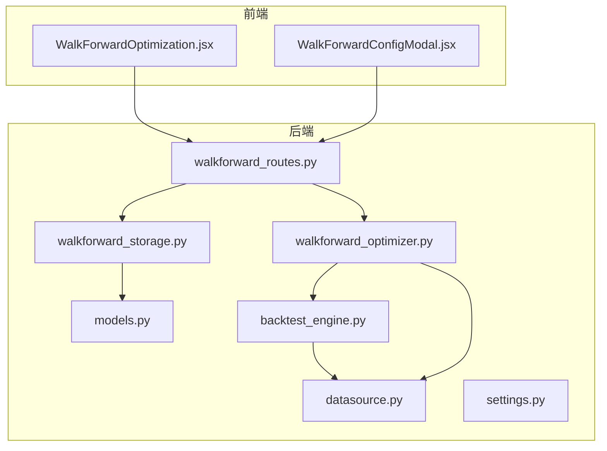
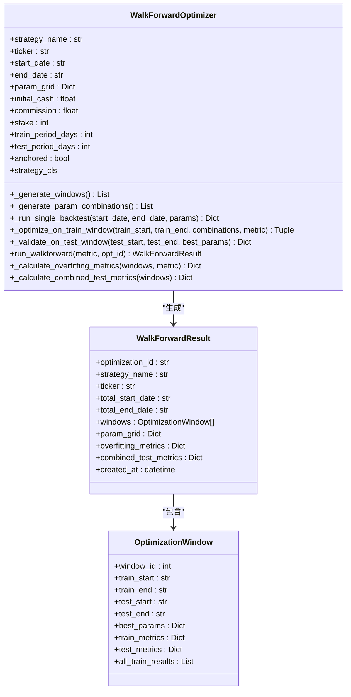
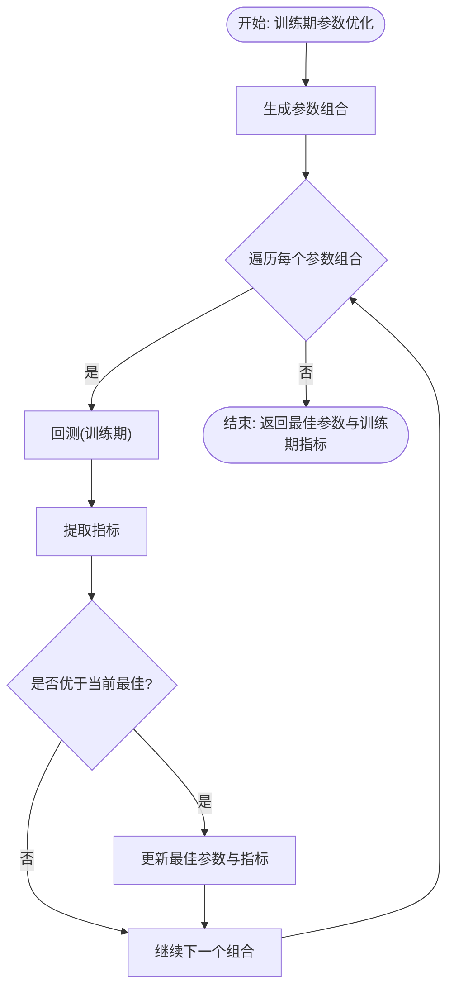
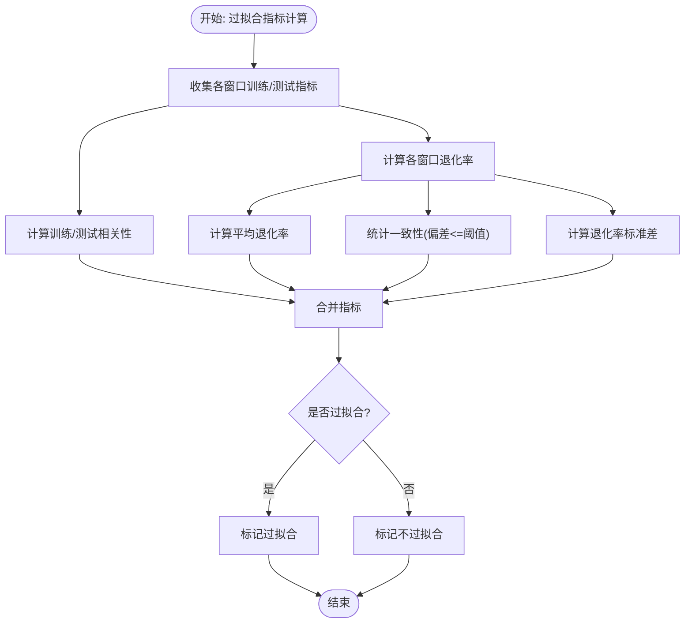
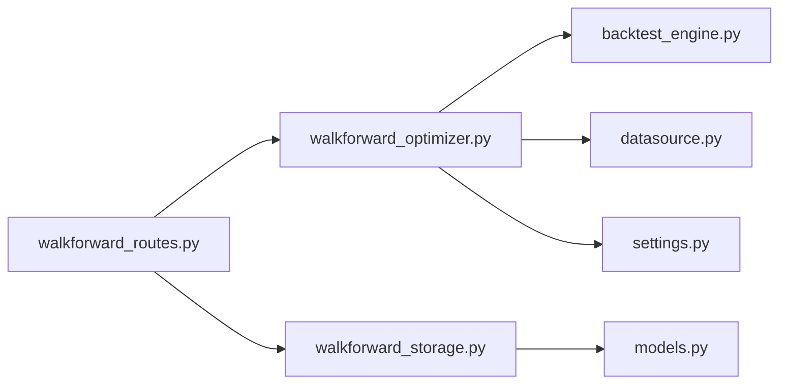

# 参数优化器

<cite>
**本文引用的文件列表**
- [walkforward_optimizer.py](file://backend/src/service/walkforward_optimizer.py)
- [backtest_engine.py](file://backend/src/service/backtest_engine.py)
- [datasource.py](file://backend/src/db/datasource.py)
- [settings.py](file://backend/src/config/settings.py)
- [walkforward_routes.py](file://backend/src/routes/walkforward_routes.py)
- [walkforward_storage.py](file://backend/src/db/walkforward_storage.py)
- [models.py](file://backend/src/db/models.py)
- [sma_cross.py](file://backend/resources/strategy/sma_cross.py)
- [breakout.py](file://backend/resources/strategy/breakout.py)
- [WalkForwardOptimization.jsx](file://frontend/src/components/WalkForward/WalkForwardOptimization.jsx)
- [WalkForwardConfigModal.jsx](file://frontend/src/components/WalkForward/WalkForwardConfigModal.jsx)
</cite>

## 目录
1. [简介](#简介)
2. [项目结构](#项目结构)
3. [核心组件](#核心组件)
4. [架构总览](#架构总览)
5. [详细组件分析](#详细组件分析)
6. [依赖关系分析](#依赖关系分析)
7. [性能考量](#性能考量)
8. [故障排查指南](#故障排查指南)
9. [结论](#结论)
10. [附录](#附录)

## 简介
本文件深入解析 walkforward_optimizer.py 模块中的参数优化算法实现，重点说明 WalkForwardOptimizer 类如何基于训练期与测试期生成滚动或锚定的优化窗口；分析 _optimize_on_train_window 如何遍历参数网格并在训练集上寻找最优参数组合；阐述 _validate_on_test_window 如何在未参与训练的测试集上验证最优参数性能；解释 _overfitting_metrics 的计算逻辑，包括训练/测试性能相关性、平均退化率与一致性分数等过拟合检测指标。同时提供参数网格配置示例、完整前向优化流程与结果解读建议，帮助评估策略稳健性。

## 项目结构
WalkForwardOptimizer 位于后端服务层，通过 FastAPI 路由触发后台任务运行，并将结果持久化至数据库。前端提供可视化界面用于发起优化、查看汇总与详情。



图表来源
- [walkforward_routes.py](file://backend/src/routes/walkforward_routes.py#L1-L120)
- [walkforward_optimizer.py](file://backend/src/service/walkforward_optimizer.py#L1-L120)
- [backtest_engine.py](file://backend/src/service/backtest_engine.py#L1-L120)
- [datasource.py](file://backend/src/db/datasource.py#L1-L120)
- [walkforward_storage.py](file://backend/src/db/walkforward_storage.py#L1-L120)
- [models.py](file://backend/src/db/models.py#L318-L395)

章节来源
- [walkforward_routes.py](file://backend/src/routes/walkforward_routes.py#L1-L120)
- [walkforward_optimizer.py](file://backend/src/service/walkforward_optimizer.py#L1-L120)

## 核心组件
- WalkForwardOptimizer：负责生成滚动/锚定窗口、遍历参数网格、在训练期优化参数、在测试期验证、计算过拟合指标与汇总测试指标。
- 数据加载：通过 datasource.get_bt_feed 提供 Backtrader 可用的数据流。
- 策略加载：通过 backtest_engine.load_user_strategy 动态加载用户策略类。
- 结果持久化：通过 walkforward_storage 将优化过程与结果写入数据库模型。

章节来源
- [walkforward_optimizer.py](file://backend/src/service/walkforward_optimizer.py#L56-L120)
- [datasource.py](file://backend/src/db/datasource.py#L114-L120)
- [backtest_engine.py](file://backend/src/service/backtest_engine.py#L73-L97)
- [walkforward_storage.py](file://backend/src/db/walkforward_storage.py#L164-L237)
- [models.py](file://backend/src/db/models.py#L318-L395)

## 架构总览
下图展示从请求到结果的完整流程：前端发起优化请求，后端创建记录并启动后台任务，WalkForwardOptimizer 在每个窗口内先训练后验证，最后计算过拟合指标并持久化。

```mermaid
sequenceDiagram
participant FE as "前端"
participant API as "FastAPI路由"
participant BG as "后台任务"
participant OPT as "WalkForwardOptimizer"
participant STG as "策略引擎"
participant DS as "数据源"
participant DB as "存储层"
FE->>API : "POST /api/walkforward/start"
API->>DB : "创建优化记录(状态 : pending)"
API->>BG : "添加后台任务"
BG->>OPT : "初始化并运行 run_walkforward()"
loop 遍历每个窗口
OPT->>OPT : "_generate_windows()"
OPT->>OPT : "_optimize_on_train_window()"
OPT->>STG : "加载策略类"
OPT->>DS : "获取训练期数据"
OPT->>STG : "回测(训练期)"
OPT->>OPT : "_validate_on_test_window()"
OPT->>DS : "获取测试期数据"
OPT->>STG : "回测(测试期)"
end
OPT->>OPT : "_calculate_overfitting_metrics()"
OPT->>OPT : "_calculate_combined_test_metrics()"
OPT->>DB : "保存结果(状态 : completed)"
API-->>FE : "返回优化ID"
```

图表来源
- [walkforward_routes.py](file://backend/src/routes/walkforward_routes.py#L129-L228)
- [walkforward_optimizer.py](file://backend/src/service/walkforward_optimizer.py#L341-L417)
- [backtest_engine.py](file://backend/src/service/backtest_engine.py#L73-L97)
- [datasource.py](file://backend/src/db/datasource.py#L114-L120)
- [walkforward_storage.py](file://backend/src/db/walkforward_storage.py#L164-L237)

## 详细组件分析

### WalkForwardOptimizer 类
- 初始化参数：策略名、标的、起止日期、参数网格、初始资金、手续费、头寸规模、训练/测试窗口天数、是否锚定。
- 窗口生成：_generate_windows 支持滚动与锚定两种模式，按 train_period_days 与 test_period_days 切分，确保测试期不越界。
- 参数网格：_generate_param_combinations 基于笛卡尔积生成所有参数组合。
- 训练优化：_optimize_on_train_window 对每个参数组合在训练期内回测，选择指定优化指标的最佳组合。
- 测试验证：_validate_on_test_window 使用训练期选出的最佳参数在测试期内回测。
- 过拟合检测：_calculate_overfitting_metrics 计算训练/测试相关性、平均退化率、一致性分数与标准差。
- 汇总测试：_calculate_combined_test_metrics 统计跨窗口测试期的综合表现。



图表来源
- [walkforward_optimizer.py](file://backend/src/service/walkforward_optimizer.py#L27-L120)
- [walkforward_optimizer.py](file://backend/src/service/walkforward_optimizer.py#L341-L417)

章节来源
- [walkforward_optimizer.py](file://backend/src/service/walkforward_optimizer.py#L116-L159)
- [walkforward_optimizer.py](file://backend/src/service/walkforward_optimizer.py#L161-L179)
- [walkforward_optimizer.py](file://backend/src/service/walkforward_optimizer.py#L181-L273)
- [walkforward_optimizer.py](file://backend/src/service/walkforward_optimizer.py#L274-L340)
- [walkforward_optimizer.py](file://backend/src/service/walkforward_optimizer.py#L395-L531)

### 训练期参数优化流程
- 输入：训练期起止日期、参数组合列表、优化指标（如夏普比率、总收益、盈亏比）。
- 处理：对每个参数组合运行一次回测，提取指标；比较并记录最佳参数组合及对应指标。
- 输出：最佳参数、训练期指标、全部训练期结果。



图表来源
- [walkforward_optimizer.py](file://backend/src/service/walkforward_optimizer.py#L274-L340)

章节来源
- [walkforward_optimizer.py](file://backend/src/service/walkforward_optimizer.py#L274-L340)

### 测试期验证流程
- 输入：测试期起止日期、训练期选出的最佳参数。
- 处理：使用最佳参数在测试期内进行一次回测。
- 输出：测试期指标字典。

```mermaid
sequenceDiagram
participant OPT as "WalkForwardOptimizer"
participant DS as "数据源"
participant STG as "策略引擎"
OPT->>DS : "获取测试期数据"
OPT->>STG : "回测(测试期, 最佳参数)"
STG-->>OPT : "返回测试期指标"
```

图表来源
- [walkforward_optimizer.py](file://backend/src/service/walkforward_optimizer.py#L321-L340)
- [datasource.py](file://backend/src/db/datasource.py#L114-L120)
- [backtest_engine.py](file://backend/src/service/backtest_engine.py#L180-L257)

章节来源
- [walkforward_optimizer.py](file://backend/src/service/walkforward_optimizer.py#L321-L340)

### 过拟合检测指标计算
- 训练/测试相关性：对各窗口训练与测试指标计算皮尔逊相关系数。
- 平均退化率：(训练值-测试值)/|训练值|*100，取平均。
- 一致性分数：测试表现与训练表现偏差不超过阈值的比例。
- 标准差：退化率的标准差，越低越好。
- 是否过拟合：平均退化率超过阈值或一致性分数低于阈值则判定为过拟合。



图表来源
- [walkforward_optimizer.py](file://backend/src/service/walkforward_optimizer.py#L419-L494)

章节来源
- [walkforward_optimizer.py](file://backend/src/service/walkforward_optimizer.py#L419-L494)

### 参数网格配置与执行流程
- 参数网格配置：前端 WalkForwardConfigModal 将用户输入的参数名与逗号分隔的候选值转换为 param_grid 字典。
- 示例策略：sma_cross.py 与 breakout.py 展示了如何在策略中声明 params，从而被优化器读取并参与网格搜索。
- 完整流程：前端提交请求 -> 后端创建记录 -> 后台任务运行 -> 逐窗口训练/验证 -> 计算指标 -> 持久化 -> 前端查看结果。

```mermaid
sequenceDiagram
participant FE as "前端"
participant API as "FastAPI路由"
participant BG as "后台任务"
participant OPT as "WalkForwardOptimizer"
participant DB as "存储层"
FE->>FE : "填写参数网格(名称+候选值)"
FE->>API : "POST /api/walkforward/start"
API->>DB : "创建记录(状态 : pending)"
API->>BG : "启动后台任务"
BG->>OPT : "run_walkforward()"
OPT-->>BG : "返回结果"
BG->>DB : "保存完成结果"
FE->>API : "GET /api/walkforward/{id}"
API-->>FE : "返回详情(含过拟合指标)"
```

图表来源
- [WalkForwardConfigModal.jsx](file://frontend/src/components/WalkForward/WalkForwardConfigModal.jsx#L52-L99)
- [walkforward_routes.py](file://backend/src/routes/walkforward_routes.py#L129-L228)
- [walkforward_optimizer.py](file://backend/src/service/walkforward_optimizer.py#L341-L417)
- [walkforward_storage.py](file://backend/src/db/walkforward_storage.py#L164-L237)
- [sma_cross.py](file://backend/resources/strategy/sma_cross.py#L1-L19)
- [breakout.py](file://backend/resources/strategy/breakout.py#L1-L32)

章节来源
- [WalkForwardConfigModal.jsx](file://frontend/src/components/WalkForward/WalkForwardConfigModal.jsx#L52-L99)
- [walkforward_routes.py](file://backend/src/routes/walkforward_routes.py#L129-L228)
- [sma_cross.py](file://backend/resources/strategy/sma_cross.py#L1-L19)
- [breakout.py](file://backend/resources/strategy/breakout.py#L1-L32)

## 依赖关系分析
- 服务层依赖：
  - backtest_engine.load_user_strategy：动态加载用户策略类。
  - datasource.get_bt_feed：提供 Backtrader 数据源。
  - settings：资源目录与环境变量。
- 存储层依赖：
  - models.WalkForwardOptimizationModel：持久化优化结果。
  - walkforward_storage：封装数据库操作。
- 路由层依赖：
  - walkforward_routes：接收请求、调度后台任务、调用存储层。



图表来源
- [walkforward_optimizer.py](file://backend/src/service/walkforward_optimizer.py#L1-L120)
- [backtest_engine.py](file://backend/src/service/backtest_engine.py#L73-L97)
- [datasource.py](file://backend/src/db/datasource.py#L114-L120)
- [walkforward_routes.py](file://backend/src/routes/walkforward_routes.py#L129-L228)
- [walkforward_storage.py](file://backend/src/db/walkforward_storage.py#L164-L237)
- [models.py](file://backend/src/db/models.py#L318-L395)

章节来源
- [walkforward_optimizer.py](file://backend/src/service/walkforward_optimizer.py#L1-L120)
- [walkforward_routes.py](file://backend/src/routes/walkforward_routes.py#L129-L228)
- [walkforward_storage.py](file://backend/src/db/walkforward_storage.py#L164-L237)

## 性能考量
- 参数组合爆炸：参数网格大小与组合数量呈笛卡尔积增长，需谨慎设计参数范围与步长。
- 回测成本：每个组合在训练期与测试期各一次回测，整体计算量随窗口数与组合数线性增长。
- 数据加载：优先从数据库或 yfinance 获取，失败时使用合成数据保证流程可用但可能影响结果。
- 并发与批处理：可考虑在后台任务中并行化部分独立回测，减少总耗时。

## 故障排查指南
- 策略加载失败：确认策略文件存在且包含符合要求的 UserStrategy 类。
- 数据加载异常：检查 DATABASE_URL 与网络连接；若数据库不可用，将回退到 yfinance 或合成数据。
- 回测异常：捕获异常并返回默认指标，便于继续流程；可在日志中定位具体参数组合。
- 结果缺失：确认后台任务已成功完成并保存；检查数据库记录状态与字段完整性。

章节来源
- [backtest_engine.py](file://backend/src/service/backtest_engine.py#L73-L97)
- [datasource.py](file://backend/src/db/datasource.py#L1-L120)
- [walkforward_optimizer.py](file://backend/src/service/walkforward_optimizer.py#L181-L273)
- [walkforward_storage.py](file://backend/src/db/walkforward_storage.py#L164-L237)

## 结论
WalkForwardOptimizer 通过滚动或锚定窗口在训练期优化参数、在测试期验证，结合过拟合检测指标与汇总测试指标，为策略稳健性评估提供了系统化方法。合理配置参数网格、选择合适的优化指标与窗口划分方式，是获得可靠优化结果的关键。前端界面支持一键发起优化与结果可视化，便于快速迭代与决策。

## 附录
- 参数网格配置要点
  - 在前端 WalkForwardConfigModal 中逐项输入参数名与候选值，系统会自动转换为 param_grid。
  - 建议从较小范围开始，逐步扩大，避免组合爆炸。
- 优化指标选择
  - 夏普比率：适合衡量风险调整后的收益。
  - 总收益：直接反映策略盈利能力。
  - 盈亏比：关注胜率与盈亏平衡。
- 过拟合判断参考
  - 平均退化率过高或一致性分数过低通常提示过拟合。
  - 训练/测试相关性较低也应引起注意。

章节来源
- [WalkForwardConfigModal.jsx](file://frontend/src/components/WalkForward/WalkForwardConfigModal.jsx#L52-L99)
- [walkforward_optimizer.py](file://backend/src/service/walkforward_optimizer.py#L419-L494)
- [WalkForwardOptimization.jsx](file://frontend/src/components/WalkForward/WalkForwardOptimization.jsx#L146-L216)