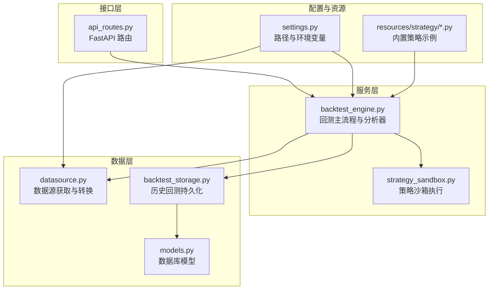
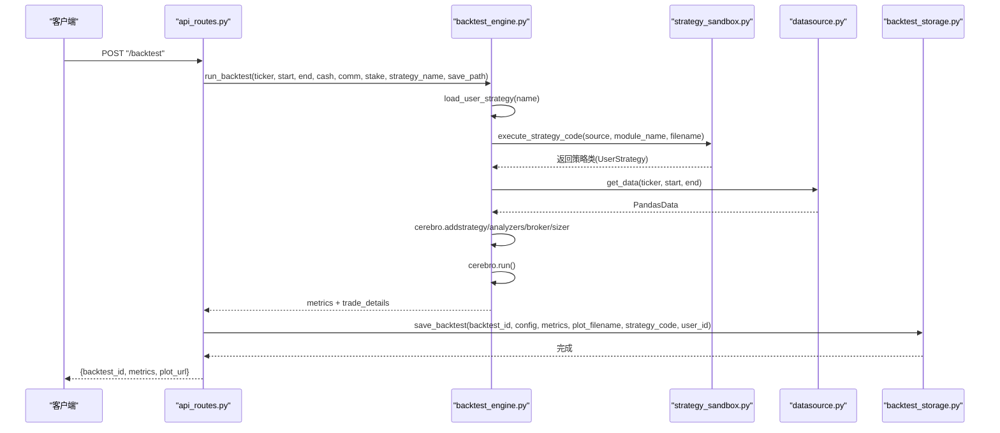
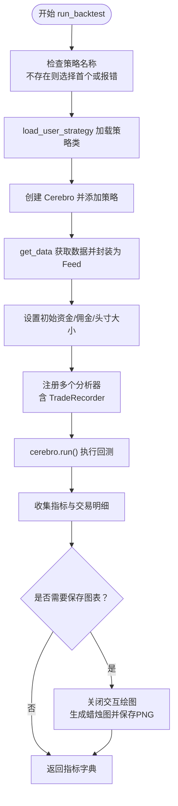
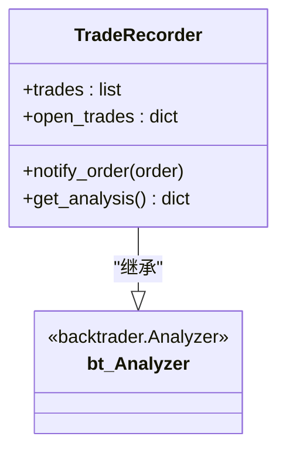
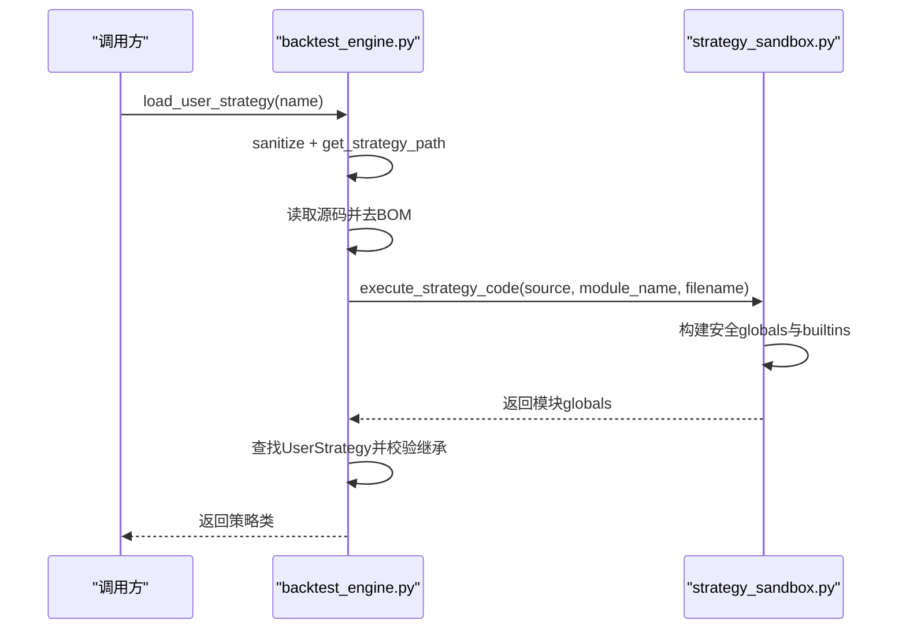
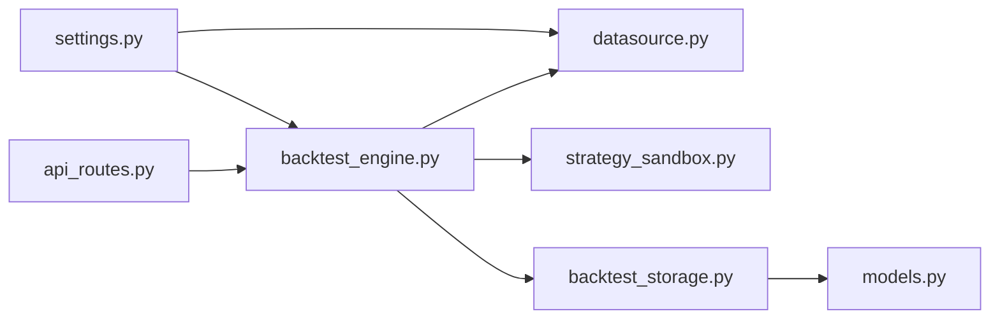

# 回测引擎

<cite>
**本文引用的文件列表**
- [backtest_engine.py](file://backend/src/service/backtest_engine.py)
- [strategy_sandbox.py](file://backend/src/service/strategy_sandbox.py)
- [datasource.py](file://backend/src/db/datasource.py)
- [models.py](file://backend/src/db/models.py)
- [backtest_storage.py](file://backend/src/db/backtest_storage.py)
- [settings.py](file://backend/src/config/settings.py)
- [api_routes.py](file://backend/src/routes/api_routes.py)
- [breakout.py](file://backend/resources/strategy/breakout.py)
- [buy_and_hold.py](file://backend/resources/strategy/buy_and_hold.py)
</cite>

## 目录
1. [简介](#简介)
2. [项目结构](#项目结构)
3. [核心组件](#核心组件)
4. [架构总览](#架构总览)
5. [详细组件分析](#详细组件分析)
6. [依赖关系分析](#依赖关系分析)
7. [性能考量](#性能考量)
8. [故障排查指南](#故障排查指南)
9. [结论](#结论)
10. [附录](#附录)

## 简介
本文件系统性梳理后端回测引擎模块的执行流程与实现细节，重点覆盖：
- run_backtest 函数如何初始化 Cerebro 引擎、加载策略、配置数据源并执行回测的完整生命周期；
- TradeRecorder 分析器如何捕获每笔交易的详细信息（开仓/平仓价格、盈亏、手续费等）并生成交易报告；
- 自定义策略加载机制 load_user_strategy 如何通过沙箱执行用户策略代码并验证其继承自 bt.Strategy；
- 策略代码的保存与读取（save_user_strategy_code、get_user_strategy_code）实现；
- 回测结果的指标计算逻辑（夏普比率、最大回撤、年化收益等）以及图表渲染流程；
- 结合代码示例说明如何调用该模块进行单次回测，并提供处理常见错误（如策略加载失败、数据获取错误）的最佳实践。

## 项目结构
回测引擎位于后端服务层，围绕 backtest_engine.py 展开，配合策略沙箱、数据源、存储与 API 路由共同构成完整的回测流水线。

图示来源
- [backtest_engine.py](file://backend/src/service/backtest_engine.py#L1-L272)
- [strategy_sandbox.py](file://backend/src/service/strategy_sandbox.py#L1-L182)
- [datasource.py](file://backend/src/db/datasource.py#L1-L156)
- [backtest_storage.py](file://backend/src/db/backtest_storage.py#L1-L444)
- [models.py](file://backend/src/db/models.py#L257-L316)
- [settings.py](file://backend/src/config/settings.py#L1-L81)
- [api_routes.py](file://backend/src/routes/api_routes.py#L1-L200)
- [breakout.py](file://backend/resources/strategy/breakout.py#L1-L32)
- [buy_and_hold.py](file://backend/resources/strategy/buy_and_hold.py#L1-L11)

章节来源
- [backtest_engine.py](file://backend/src/service/backtest_engine.py#L1-L272)
- [settings.py](file://backend/src/config/settings.py#L1-L81)

## 核心组件
- 回测主流程 run_backtest：负责初始化 Cerebro、添加策略与分析器、配置资金与佣金、加载数据、运行回测并提取指标与交易明细，最终可选导出图表。
- 自定义分析器 TradeRecorder：在订单完成时记录开仓/平仓信息，计算盈亏、手续费、回报率等，并汇总统计。
- 策略沙箱 strategy_sandbox：限制用户策略导入范围与内置能力，安全地编译与执行用户代码，确保策略类继承自 bt.Strategy。
- 数据源 datasource：优先从数据库拉取，其次使用 yfinance 下载，最后降级为合成数据，统一输出 PandasData 供 Cerebro 使用。
- 历史回测存储 backtest_storage：将回测配置、指标、图表文件名、策略代码快照等持久化至数据库，并提供查询与清理。
- 配置 settings：定义资源目录（策略、图片）、数据库连接等基础配置。
- API 路由 api_routes：对外提供回测、策略读写、数据获取等接口，并在成功后异步落库。

章节来源
- [backtest_engine.py](file://backend/src/service/backtest_engine.py#L180-L272)
- [strategy_sandbox.py](file://backend/src/service/strategy_sandbox.py#L1-L182)
- [datasource.py](file://backend/src/db/datasource.py#L1-L156)
- [backtest_storage.py](file://backend/src/db/backtest_storage.py#L1-L444)
- [settings.py](file://backend/src/config/settings.py#L1-L81)
- [api_routes.py](file://backend/src/routes/api_routes.py#L1-L200)

## 架构总览
下图展示一次典型回测请求从 API 到结果落库的端到端流程。

图示来源
- [api_routes.py](file://backend/src/routes/api_routes.py#L77-L146)
- [backtest_engine.py](file://backend/src/service/backtest_engine.py#L180-L272)
- [strategy_sandbox.py](file://backend/src/service/strategy_sandbox.py#L148-L179)
- [datasource.py](file://backend/src/db/datasource.py#L70-L119)
- [backtest_storage.py](file://backend/src/db/backtest_storage.py#L37-L108)

## 详细组件分析

### run_backtest 生命周期与控制流
- 初始化与参数校验
  - 若未指定策略名称，则自动选择可用策略中的第一个；若无可用策略则抛出策略加载错误。
  - 通过 load_user_strategy 加载策略类，随后创建 Cerebro 实例并添加策略。
- 数据源配置
  - 通过 get_data 获取 Pandas DataFrame，再封装为 Backtrader Feed 并加入 Cerebro。
- 资金与交易参数
  - 设置初始资金、佣金比例、固定头寸大小（FixedSize）。
- 分析器注册
  - 注册多种分析器：SharpeRatio、DrawDown、Returns、AnnualReturn、SQN、TradeAnalyzer、TimeDrawDown。
  - 注册自定义 TradeRecorder，用于记录每笔交易的详细信息。
- 执行与结果提取
  - 运行 cerebro.run()，取第一条策略实例，汇总各分析器结果与 TradeRecorder 的交易明细。
- 图表渲染
  - 关闭交互绘图，生成蜡烛图并保存为 PNG 文件，异常时记录日志并抛出运行时错误。

图示来源
- [backtest_engine.py](file://backend/src/service/backtest_engine.py#L180-L272)

章节来源
- [backtest_engine.py](file://backend/src/service/backtest_engine.py#L180-L272)

### TradeRecorder 分析器：交易记录与统计
- 订单通知回调
  - 当订单状态为 Completed 时，区分买入/卖出，分别记录开仓与平仓信息。
  - 对应开仓订单被暂存于 open_trades，平仓时弹出最早的一笔并计算盈亏、手续费、净收益与回报率。
- 交易统计
  - 统计总交易数、胜/负交易数、总盈亏、平均盈亏等。
- 可扩展字段
  - 支持从策略 params 中读取止损/止盈参数，便于后续扩展更丰富的风控与止盈逻辑。

图示来源
- [backtest_engine.py](file://backend/src/service/backtest_engine.py#L99-L178)

章节来源
- [backtest_engine.py](file://backend/src/service/backtest_engine.py#L99-L178)

### 自定义策略加载机制：load_user_strategy 与沙箱执行
- 策略文件定位与安全命名
  - sanitize_strategy_name 仅允许字母数字与连字符/下划线，去除多余空白与非法字符，避免路径穿越。
  - get_strategy_path 将策略名映射到 STRATEGY_DIR 下的 .py 文件。
- 策略读取与沙箱执行
  - load_user_strategy 读取策略源码，移除 BOM，调用 execute_strategy_code 在受限全局环境中执行。
  - execute_strategy_code 构建安全的 __builtins__ 与允许导入集合，仅暴露 backtrader、pandas 等必要模块。
- 类型与继承校验
  - 从执行结果的 globals 中查找 UserStrategy，要求必须继承自 bt.Strategy，否则抛出策略加载错误。

图示来源
- [backtest_engine.py](file://backend/src/service/backtest_engine.py#L59-L96)
- [strategy_sandbox.py](file://backend/src/service/strategy_sandbox.py#L148-L179)

章节来源
- [backtest_engine.py](file://backend/src/service/backtest_engine.py#L59-L96)
- [strategy_sandbox.py](file://backend/src/service/strategy_sandbox.py#L1-L182)

### 策略代码的保存与读取
- 保存策略
  - save_user_strategy_code 接收策略名与源码，确保资源目录存在后写入对应文件。
- 读取策略
  - get_user_strategy_code 同样确保资源目录存在，定位文件并读取源码；若文件不存在则抛出策略加载错误。
- 与 API 的集成
  - API 路由提供 /strategy 接口，支持读取与保存策略代码，便于前端编辑与回测。

章节来源
- [backtest_engine.py](file://backend/src/service/backtest_engine.py#L67-L71)
- [backtest_engine.py](file://backend/src/service/backtest_engine.py#L59-L65)
- [api_routes.py](file://backend/src/routes/api_routes.py#L158-L183)

### 数据源获取与降级策略
- 优先级
  - 先尝试从数据库按日期区间查询股票 OHLCV 数据；
  - 若失败或为空，使用 yfinance 下载；
  - 最后降级为合成数据（单调递增价格序列），保证回测管道不中断。
- 输出格式
  - 统一列名（Open/High/Low/Close/Volume/Adj Close），并转换为 Backtrader Feed。

章节来源
- [datasource.py](file://backend/src/db/datasource.py#L1-L156)

### 回测结果指标与图表渲染
- 指标提取
  - final_value：账户净值；
  - sharpe：夏普比率；
  - drawdown：最大回撤；
  - returns：总回报（归一化）；
  - annual_returns：年化回报；
  - sqn：系统质量指数；
  - trades：交易统计（胜率、盈亏比等）；
  - timedraw：时间回撤；
  - trade_details：TradeRecorder 汇总后的交易明细。
- 图表渲染
  - 关闭交互绘图，生成蜡烛图并保存为 PNG；异常时记录日志并抛出运行时错误。

章节来源
- [backtest_engine.py](file://backend/src/service/backtest_engine.py#L224-L256)

### 历史回测持久化与查询
- 存储内容
  - 包含回测配置、关键指标（最终价值、总回报、夏普、最大回撤、交易数等）、完整 metrics JSON、AI 分析、策略代码快照、图表文件名等。
- 清理策略
  - 保留最近 N 条记录，删除旧记录并同步删除对应图片文件；
  - 提供清理损坏 JSON 的辅助方法，保障查询稳定性。
- 查询接口
  - 支持按用户、标的、策略、日期范围过滤，支持排序与分页。

章节来源
- [backtest_storage.py](file://backend/src/db/backtest_storage.py#L1-L444)
- [models.py](file://backend/src/db/models.py#L257-L316)

## 依赖关系分析
- 模块耦合
  - backtest_engine 依赖 datasource 提供数据，依赖 strategy_sandbox 安全加载策略，依赖 backtest_storage 写入历史。
  - api_routes 作为入口，协调 backtest_engine 与 backtest_storage。
- 外部依赖
  - backtrader、matplotlib、pandas、yfinance、SQLAlchemy。
- 潜在循环依赖
  - 未发现直接循环依赖；各模块职责清晰，通过函数接口耦合。

图示来源
- [api_routes.py](file://backend/src/routes/api_routes.py#L1-L200)
- [backtest_engine.py](file://backend/src/service/backtest_engine.py#L1-L272)
- [datasource.py](file://backend/src/db/datasource.py#L1-L156)
- [strategy_sandbox.py](file://backend/src/service/strategy_sandbox.py#L1-L182)
- [backtest_storage.py](file://backend/src/db/backtest_storage.py#L1-L444)
- [models.py](file://backend/src/db/models.py#L257-L316)
- [settings.py](file://backend/src/config/settings.py#L1-L81)

章节来源
- [api_routes.py](file://backend/src/routes/api_routes.py#L1-L200)
- [backtest_engine.py](file://backend/src/service/backtest_engine.py#L1-L272)

## 性能考量
- 图表渲染
  - 关闭交互绘图与本地弹窗，避免阻塞与额外 IO；批量关闭图形句柄防止内存泄漏。
- 数据获取
  - 优先数据库缓存，减少网络请求；yfinance 降级为合成数据，保证可用性但可能影响回测真实性。
- 分析器数量
  - 注册多个分析器会增加计算开销；可根据需求裁剪分析器以优化性能。
- 沙箱执行
  - 编译与执行策略代码在单次回测中只发生一次，成本可控；注意避免在策略中执行高复杂度操作。

[本节为通用建议，无需特定文件来源]

## 故障排查指南
- 策略加载失败
  - 症状：StrategyLoadError 或 StrategySandboxError。
  - 排查要点：
    - 确认策略文件名合法（仅字母数字与连字符/下划线，可带 .py 后缀）；
    - 确认 UserStrategy 类存在于源码且继承自 bt.Strategy；
    - 检查沙箱允许的导入模块与内置函数，避免使用受限功能；
    - 检查策略源码语法与运行时异常。
- 数据获取错误
  - 症状：DataLoadError 或回退为合成数据。
  - 排查要点：
    - 检查 DATABASE_URL 是否正确配置；
    - 检查 yfinance 可用性与网络代理设置；
    - 确认日期范围有效且包含工作日。
- 图表渲染失败
  - 症状：运行时错误提示无法渲染图表。
  - 排查要点：
    - 确认 matplotlib 后端设置为非 GUI（已默认设置为 Agg）；
    - 检查目标保存路径权限与磁盘空间；
    - 捕获异常并查看日志定位具体原因。
- API 层错误
  - 症状：HTTP 400/500 错误。
  - 排查要点：
    - StrategyLoadError 映射为 400；
    - DataLoadError 映射为 502；
    - 其他异常映射为 500，并打印堆栈以便定位。

章节来源
- [backtest_engine.py](file://backend/src/service/backtest_engine.py#L180-L272)
- [strategy_sandbox.py](file://backend/src/service/strategy_sandbox.py#L1-L182)
- [datasource.py](file://backend/src/db/datasource.py#L1-L156)
- [api_routes.py](file://backend/src/routes/api_routes.py#L147-L156)

## 结论
该回测引擎模块以清晰的职责划分与安全的策略沙箱为核心，实现了从策略加载、数据获取、回测执行到结果落库与图表渲染的完整闭环。TradeRecorder 为交易层面提供了细粒度洞察，结合多种分析器指标，能够满足回测评估与可视化展示的需求。通过 API 路由与存储层的配合，系统具备良好的可扩展性与可维护性。

[本节为总结性内容，无需特定文件来源]

## 附录

### 如何调用模块进行单次回测（示例步骤）
- 通过 API 路由
  - 发送 POST 请求到 /backtest，携带 ticker、start_date、end_date、initial_cash、commission、stake、strategy_name 等参数；
  - 成功后返回 backtest_id、metrics 与 plot_url，同时异步落库。
- 直接调用 Python 接口
  - 导入 run_backtest，传入所需参数；
  - 若需要保存图表，提供 save_path；
  - 获取返回的指标字典与交易明细。

章节来源
- [api_routes.py](file://backend/src/routes/api_routes.py#L77-L146)
- [backtest_engine.py](file://backend/src/service/backtest_engine.py#L180-L272)

### 内置策略参考
- 示例策略文件展示了如何定义 UserStrategy 并使用参数化（params）与内置指标（Highest/Lowest）实现突破策略，以及如何设置止损/止盈逻辑。

章节来源
- [breakout.py](file://backend/resources/strategy/breakout.py#L1-L32)
- [buy_and_hold.py](file://backend/resources/strategy/buy_and_hold.py#L1-L11)