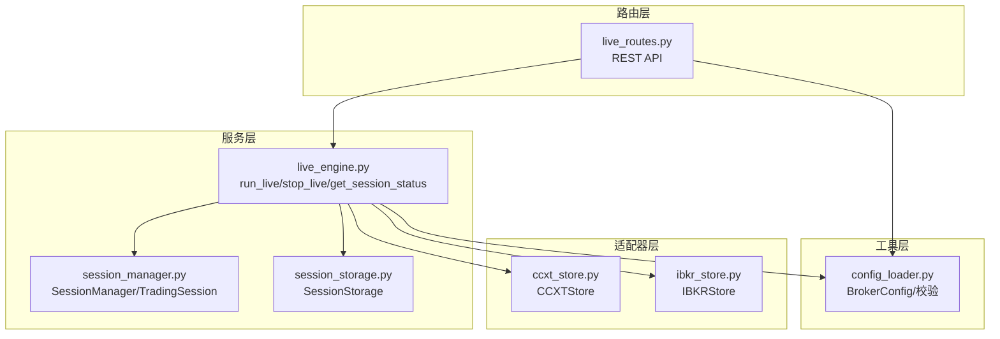
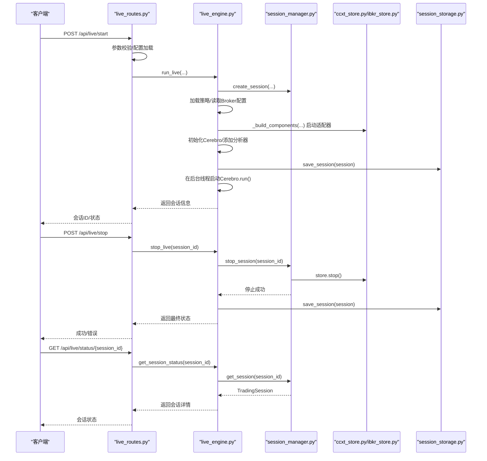
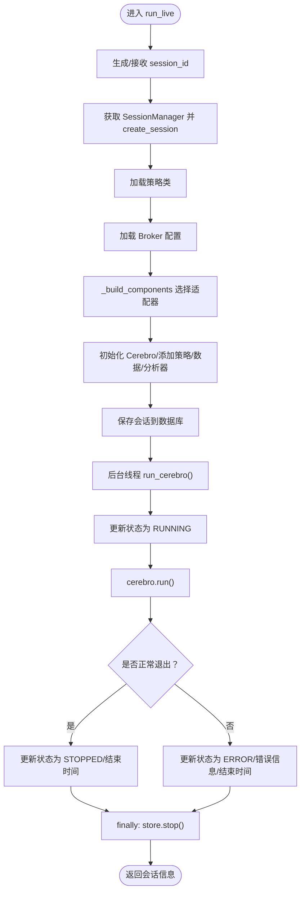
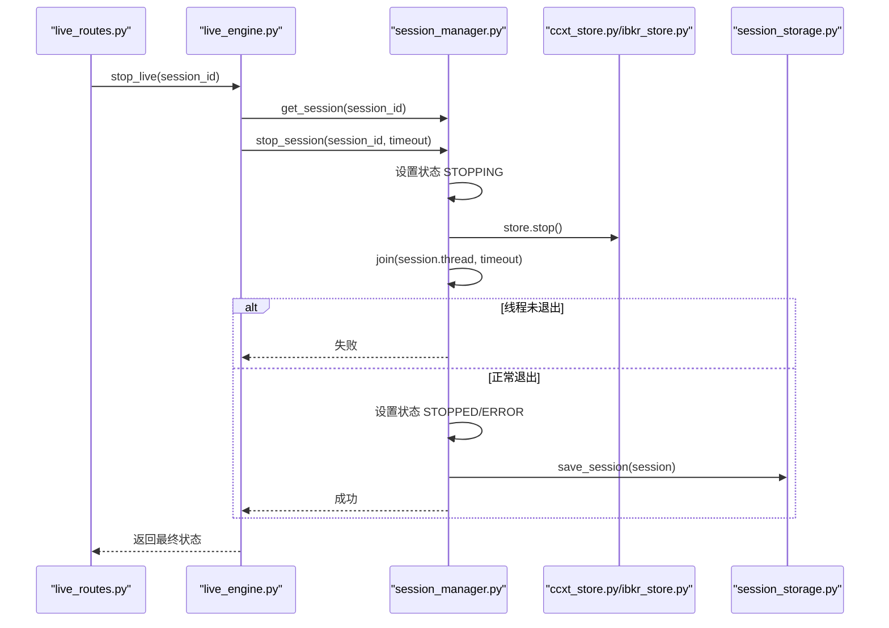
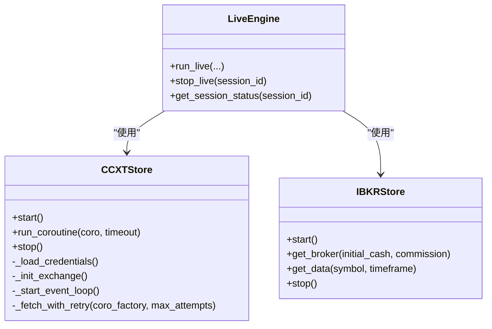
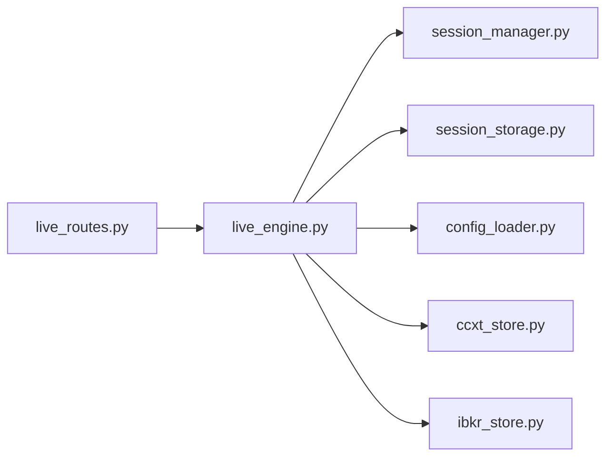

# 实盘引擎

<cite>
**本文引用的文件列表**
- [live_engine.py](file://backend/src/service/live_engine.py)
- [session_manager.py](file://backend/src/service/session_manager.py)
- [live_routes.py](file://backend/src/routes/live_routes.py)
- [ccxt_store.py](file://backend/src/brokers/ccxt_adapter/ccxt_store.py)
- [ibkr_store.py](file://backend/src/brokers/ibkr_adapter/ibkr_store.py)
- [session_storage.py](file://backend/src/db/session_storage.py)
- [config_loader.py](file://backend/src/utils/config_loader.py)
</cite>

## 目录
1. [引言](#引言)
2. [项目结构](#项目结构)
3. [核心组件](#核心组件)
4. [架构总览](#架构总览)
5. [详细组件分析](#详细组件分析)
6. [依赖关系分析](#依赖关系分析)
7. [性能考量](#性能考量)
8. [故障排查指南](#故障排查指南)
9. [结论](#结论)
10. [附录](#附录)

## 引言
本文件系统性记录 live_engine.py 模块的实盘交易生命周期管理，围绕 run_live 函数如何根据交易所适配器（CCXT 或 IBKR）动态构建 store、broker 和 data_feed 组件；分析 SessionManager 如何创建与管理会话状态，并将 Cerebro 实例在后台线程中启动以实现非阻塞运行；阐述 stop_live 函数如何安全停止会话，包括更新状态、终止线程与清理资源；解释 get_session_status 如何提供实时会话监控信息。同时给出启动实盘/模拟交易会话的操作步骤，重点描述与 SessionManager 和交易所适配器的协作模式，并提供常见问题（网络中断、订单执行失败）的调试与恢复策略。

## 项目结构
后端采用分层设计：
- 路由层：提供 REST API，负责参数校验与调用服务层
- 服务层：业务编排，负责生命周期管理与组件装配
- 适配器层：交易所适配器（CCXT/IBKR），封装连接与数据流
- 存储层：数据库持久化，保存会话与订单历史
- 工具层：配置加载与校验

图表来源
- [live_routes.py](file://backend/src/routes/live_routes.py#L1-L200)
- [live_engine.py](file://backend/src/service/live_engine.py#L1-L120)
- [session_manager.py](file://backend/src/service/session_manager.py#L1-L120)
- [session_storage.py](file://backend/src/db/session_storage.py#L1-L120)
- [ccxt_store.py](file://backend/src/brokers/ccxt_adapter/ccxt_store.py#L1-L120)
- [ibkr_store.py](file://backend/src/brokers/ibkr_adapter/ibkr_store.py#L1-L80)
- [config_loader.py](file://backend/src/utils/config_loader.py#L1-L120)

章节来源
- [live_routes.py](file://backend/src/routes/live_routes.py#L1-L200)
- [live_engine.py](file://backend/src/service/live_engine.py#L1-L120)
- [session_manager.py](file://backend/src/service/session_manager.py#L1-L120)
- [session_storage.py](file://backend/src/db/session_storage.py#L1-L120)
- [ccxt_store.py](file://backend/src/brokers/ccxt_adapter/ccxt_store.py#L1-L120)
- [ibkr_store.py](file://backend/src/brokers/ibkr_adapter/ibkr_store.py#L1-L80)
- [config_loader.py](file://backend/src/utils/config_loader.py#L1-L120)

## 核心组件
- run_live：启动会话，装配适配器组件，初始化 Cerebro 并在后台线程运行
- stop_live：优雅停止会话，更新状态并清理资源
- get_session_status：返回当前会话状态与指标
- SessionManager：集中管理会话生命周期与并发安全
- CCXTStore/IBKRStore：适配器层，负责连接与数据流
- SessionStorage：数据库持久化，支持会话与订单历史
- 配置加载与校验：BrokerConfig、交易所配置、时间框架与符号校验

章节来源
- [live_engine.py](file://backend/src/service/live_engine.py#L100-L329)
- [session_manager.py](file://backend/src/service/session_manager.py#L1-L200)
- [ccxt_store.py](file://backend/src/brokers/ccxt_adapter/ccxt_store.py#L1-L120)
- [ibkr_store.py](file://backend/src/brokers/ibkr_adapter/ibkr_store.py#L1-L120)
- [session_storage.py](file://backend/src/db/session_storage.py#L1-L120)
- [config_loader.py](file://backend/src/utils/config_loader.py#L1-L120)

## 架构总览
下面的时序图展示了从 API 到引擎再到适配器与存储的整体流程。

图表来源
- [live_routes.py](file://backend/src/routes/live_routes.py#L100-L200)
- [live_engine.py](file://backend/src/service/live_engine.py#L100-L329)
- [session_manager.py](file://backend/src/service/session_manager.py#L200-L320)
- [ccxt_store.py](file://backend/src/brokers/ccxt_adapter/ccxt_store.py#L58-L120)
- [ibkr_store.py](file://backend/src/brokers/ibkr_adapter/ibkr_store.py#L82-L120)
- [session_storage.py](file://backend/src/db/session_storage.py#L59-L120)

## 详细组件分析

### run_live：实盘会话生命周期编排
- 会话ID生成与日志记录
- 获取全局 SessionManager，创建会话对象
- 策略类加载与 Broker 配置加载（若未传入）
- 根据适配器选择 CCXT 或 IBKR：
  - CCXT：初始化 CCXTStore（start）、CCXTBroker、CCXTData
  - IBKR：初始化 IBKRStore（start）、获取 Broker 与 Data
- 初始化 Cerebro，添加策略、数据、分析器（夏普比率、最大回撤、收益、交易记录）
- 将 cerebro/store 保存到会话对象，持久化到数据库
- 在后台线程启动 run_cerebro：
  - 更新状态为 RUNNING，持久化
  - 执行 cerebro.run()，正常结束则更新 STOPPED 与结束时间
  - 异常捕获则更新 ERROR、错误消息与结束时间
  - finally 中确保 store.stop() 清理
- 返回会话字典

图表来源
- [live_engine.py](file://backend/src/service/live_engine.py#L100-L266)

章节来源
- [live_engine.py](file://backend/src/service/live_engine.py#L100-L266)

### stop_live：优雅停止会话
- 通过 SessionManager 获取会话
- 调用 stop_session(session_id, timeout)，内部：
  - 设置状态为 STOPPING
  - 若存在 store，调用 store.stop()
  - join 线程等待超时，若仍存活则返回失败
  - 最终设置状态为 STOPPED/ERROR，并写入结束时间
- 保存最终状态到数据库
- 返回包含最终状态、P&L、结束时间等信息

图表来源
- [live_engine.py](file://backend/src/service/live_engine.py#L268-L305)
- [session_manager.py](file://backend/src/service/session_manager.py#L238-L292)
- [ccxt_store.py](file://backend/src/brokers/ccxt_adapter/ccxt_store.py#L97-L121)
- [ibkr_store.py](file://backend/src/brokers/ibkr_adapter/ibkr_store.py#L108-L120)
- [session_storage.py](file://backend/src/db/session_storage.py#L59-L120)

章节来源
- [live_engine.py](file://backend/src/service/live_engine.py#L268-L305)
- [session_manager.py](file://backend/src/service/session_manager.py#L238-L292)

### get_session_status：实时会话监控
- 通过 SessionManager 获取会话对象
- 若不存在抛出异常
- 返回会话的序列化字典（含状态、时间、指标、订单、位置等）

章节来源
- [live_engine.py](file://backend/src/service/live_engine.py#L307-L329)
- [session_manager.py](file://backend/src/service/session_manager.py#L61-L86)

### 适配器协作：CCXT 与 IBKR
- CCXTStore
  - start：启动事件循环线程，加载凭据，初始化交易所实例，加载市场并验证连接
  - run_coroutine：在同步上下文中桥接异步 CCXT 操作
  - stop：关闭交易所连接、停止事件循环、等待线程结束
  - 提供重试机制与指数退避用于网络错误
- IBKRStore
  - start：连接 IB Gateway/TWS，支持纸金模式
  - get_broker/get_data：返回 Backtrader Broker/Data Feed
  - stop：断开连接并释放资源

图表来源
- [ccxt_store.py](file://backend/src/brokers/ccxt_adapter/ccxt_store.py#L58-L120)
- [ibkr_store.py](file://backend/src/brokers/ibkr_adapter/ibkr_store.py#L82-L157)
- [live_engine.py](file://backend/src/service/live_engine.py#L100-L178)

章节来源
- [ccxt_store.py](file://backend/src/brokers/ccxt_adapter/ccxt_store.py#L1-L120)
- [ibkr_store.py](file://backend/src/brokers/ibkr_adapter/ibkr_store.py#L1-L157)
- [live_engine.py](file://backend/src/service/live_engine.py#L100-L178)

### SessionManager：会话状态与并发控制
- 单例模式，全局唯一实例
- 线程安全的数据结构与锁，保证多会话并发安全
- 提供 create_session/register_session/get_session/update_session/list_sessions/remove_session/stop_all_sessions/get_session_count 等方法
- stop_session 内部：
  - 设置 STOPPING 状态
  - 调用 store.stop()
  - join 线程等待超时
  - 设置 STOPPED/ERROR 并写入结束时间

章节来源
- [session_manager.py](file://backend/src/service/session_manager.py#L114-L200)
- [session_manager.py](file://backend/src/service/session_manager.py#L238-L292)

### SessionStorage：会话与订单持久化
- save_session/load_session/list_sessions/delete_session
- save_order/get_session_orders/get_session_count
- 支持崩溃恢复与历史查询

章节来源
- [session_storage.py](file://backend/src/db/session_storage.py#L59-L120)
- [session_storage.py](file://backend/src/db/session_storage.py#L124-L234)
- [session_storage.py](file://backend/src/db/session_storage.py#L235-L392)

### 配置加载与校验
- BrokerConfig 结构化配置，包含交易所、风控、交易设置、通知等
- get_exchange_config/list_enabled_exchanges/validate_symbol/validate_timeframe
- 为路由层与引擎层提供统一的配置入口

章节来源
- [config_loader.py](file://backend/src/utils/config_loader.py#L1-L120)
- [config_loader.py](file://backend/src/utils/config_loader.py#L179-L246)
- [config_loader.py](file://backend/src/utils/config_loader.py#L264-L333)

## 依赖关系分析
- run_live 依赖 SessionManager、SessionStorage、Broker 配置与适配器
- stop_live/ get_session_status 依赖 SessionManager
- 适配器层独立于引擎层，通过统一接口对接
- 存储层与引擎层解耦，仅通过会话对象交互

图表来源
- [live_engine.py](file://backend/src/service/live_engine.py#L1-L120)
- [session_manager.py](file://backend/src/service/session_manager.py#L1-L120)
- [session_storage.py](file://backend/src/db/session_storage.py#L1-L120)
- [config_loader.py](file://backend/src/utils/config_loader.py#L1-L120)
- [ccxt_store.py](file://backend/src/brokers/ccxt_adapter/ccxt_store.py#L1-L120)
- [ibkr_store.py](file://backend/src/brokers/ibkr_adapter/ibkr_store.py#L1-L120)
- [live_routes.py](file://backend/src/routes/live_routes.py#L1-L120)

章节来源
- [live_engine.py](file://backend/src/service/live_engine.py#L1-L120)
- [session_manager.py](file://backend/src/service/session_manager.py#L1-L120)
- [session_storage.py](file://backend/src/db/session_storage.py#L1-L120)
- [config_loader.py](file://backend/src/utils/config_loader.py#L1-L120)
- [ccxt_store.py](file://backend/src/brokers/ccxt_adapter/ccxt_store.py#L1-L120)
- [ibkr_store.py](file://backend/src/brokers/ibkr_adapter/ibkr_store.py#L1-L120)
- [live_routes.py](file://backend/src/routes/live_routes.py#L1-L120)

## 性能考量
- 后台线程运行 Cerebro，避免阻塞 API 请求
- CCXTStore 使用事件循环线程与 run_coroutine 桥接异步操作，减少阻塞
- 重试与指数退避在网络错误时提升稳定性
- 分析器（收益、最大回撤、夏普比率）在零周期时通过自定义分析器避免崩溃
- 数据库持久化采用事务与回滚，保障一致性

章节来源
- [live_engine.py](file://backend/src/service/live_engine.py#L188-L192)
- [ccxt_store.py](file://backend/src/brokers/ccxt_adapter/ccxt_store.py#L136-L168)
- [ccxt_store.py](file://backend/src/brokers/ccxt_adapter/ccxt_store.py#L293-L314)
- [session_storage.py](file://backend/src/db/session_storage.py#L59-L120)

## 故障排查指南
- 启动失败
  - 检查 Broker 配置与凭据是否正确（CCXTStore 会在缺少凭据时报错）
  - 确认交易所可用且网络可达
  - 查看 SessionManager 的 create_session 是否成功
- 运行中异常
  - run_cerebro 的异常分支会将状态置为 ERROR，并记录错误信息
  - store.stop() 会在 finally 中被调用，确保资源清理
- 停止失败
  - stop_session 会尝试 join 线程，若超时仍未退出，返回失败
  - 可检查线程是否仍在执行阻塞操作（如网络请求）
- 网络中断
  - CCXTStore 提供 _fetch_with_retry 与指数退避，可在网络抖动时自动重试
  - 建议在策略中增加重试与熔断逻辑
- 订单执行失败
  - 通过 SessionStorage.save_order 持久化订单，便于事后复盘
  - 结合 get_session_orders 与前端订单面板定位问题
- 常见症状与建议
  - “会话已停止”：确认 stop_live 是否被调用，线程是否 join 成功
  - “无数据/延迟高”：检查 CCXTStore.start 是否成功，事件循环是否运行
  - “策略未触发”：确认 Cerebro.addstrategy/adddata 是否正确添加

章节来源
- [live_engine.py](file://backend/src/service/live_engine.py#L200-L266)
- [session_manager.py](file://backend/src/service/session_manager.py#L238-L292)
- [ccxt_store.py](file://backend/src/brokers/ccxt_adapter/ccxt_store.py#L97-L121)
- [session_storage.py](file://backend/src/db/session_storage.py#L269-L360)

## 结论
live_engine.py 通过清晰的生命周期编排，将策略、适配器与存储解耦，配合 SessionManager 的并发安全与 CCXT/IBKR 适配器的连接管理，实现了可扩展、可观测、可恢复的实盘交易系统。通过 API 层的统一入口与后台线程运行，系统在生产环境中具备良好的稳定性与可维护性。

## 附录

### 启动实盘/模拟会话步骤
- 准备 Broker 配置与凭据（CCXT 环境变量）
- 通过路由层启动会话：
  - POST /api/live/start
  - 参数：strategy_name、symbol、exchange、mode、timeframe、initial_cash、commission
- 获取会话状态：
  - GET /api/live/status/{session_id}
- 停止会话：
  - POST /api/live/stop
  - 参数：session_id

章节来源
- [live_routes.py](file://backend/src/routes/live_routes.py#L100-L182)
- [live_routes.py](file://backend/src/routes/live_routes.py#L184-L254)
- [live_routes.py](file://backend/src/routes/live_routes.py#L256-L286)