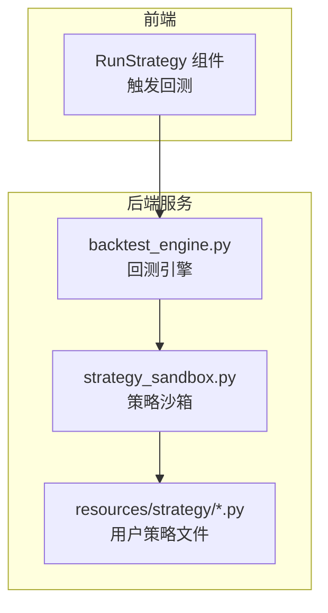
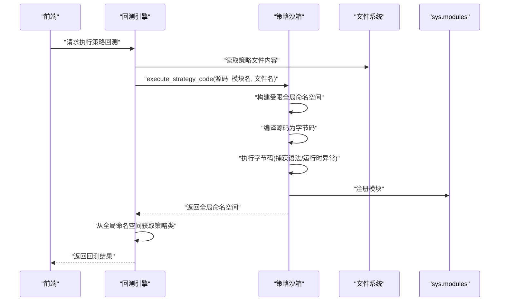
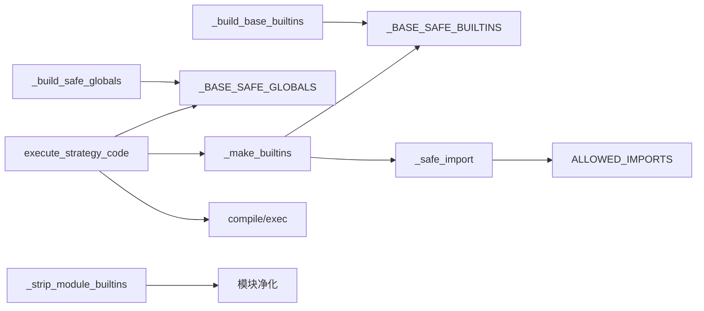

# 策略沙箱

<cite>
**本文引用的文件**
- [strategy_sandbox.py](file://backend/src/service/strategy_sandbox.py)
- [backtest_engine.py](file://backend/src/service/backtest_engine.py)
- [breakout.py](file://backend/resources/strategy/breakout.py)
- [strategy.md](file://backend/resources/strategy/strategy.md)
- [CLAUDE.md](file://CLAUDE.md)
</cite>

## 目录
1. [简介](#简介)
2. [项目结构](#项目结构)
3. [核心组件](#核心组件)
4. [架构总览](#架构总览)
5. [详细组件分析](#详细组件分析)
6. [依赖关系分析](#依赖关系分析)
7. [性能考量](#性能考量)
8. [故障排查指南](#故障排查指南)
9. [结论](#结论)

## 简介
本文件聚焦于后端服务中的策略沙箱模块，系统性解析其安全机制与执行流程，重点说明：
- execute_strategy_code 如何通过受限的全局命名空间与内置函数，隔离用户策略代码的执行环境；
- _safe_import 如何限制用户策略仅能导入白名单模块，并移除模块的 __builtins__ 引用；
- 如何捕获并处理语法错误与运行时异常，保障宿主应用的安全与稳定。

## 项目结构
策略沙箱位于后端服务层，作为加载与执行用户策略的核心组件，被回测引擎调用以保证策略代码在受控环境中运行。

图表来源
- [strategy_sandbox.py](file://backend/src/service/strategy_sandbox.py#L148-L179)
- [backtest_engine.py](file://backend/src/service/backtest_engine.py#L73-L96)
- [breakout.py](file://backend/resources/strategy/breakout.py#L1-L32)

章节来源
- [CLAUDE.md](file://CLAUDE.md#L150-L156)
- [strategy.md](file://backend/resources/strategy/strategy.md#L16-L18)

## 核心组件
- 策略沙箱错误类型：StrategySandboxError，用于统一包装沙箱约束违规与执行失败信息。
- 白名单模块集合：ALLOWED_IMPORTS，限定用户策略可导入的模块范围。
- 安全内置函数集：_build_base_builtins，构建受控的内置函数字典。
- 安全全局命名空间：_build_safe_globals，注入受控的第三方模块别名（如 bt、pd）。
- 安全导入器：_safe_import，拦截并校验 import 请求，移除模块的 __builtins__ 引用。
- 执行器：execute_strategy_code，构建受限的执行上下文，编译并执行策略源码，捕获语法与运行时异常。

章节来源
- [strategy_sandbox.py](file://backend/src/service/strategy_sandbox.py#L11-L182)

## 架构总览
策略沙箱在回测引擎中被调用，先读取用户策略文件，再通过沙箱执行，最终从返回的全局命名空间中提取策略类并进行回测。

图表来源
- [backtest_engine.py](file://backend/src/service/backtest_engine.py#L73-L96)
- [strategy_sandbox.py](file://backend/src/service/strategy_sandbox.py#L148-L179)

## 详细组件分析

### execute_strategy_code：受限执行与异常处理
- 构建受限全局命名空间
  - 复制基础安全全局变量（含 bt、pd 的去 __builtins__ 版本）。
  - 注入 __name__、__package__、__doc__、__builtins__、__file__ 等执行必需项。
  - 其中 __builtins__ 由 _make_builtins 返回，包含受控内置函数与自定义 __import__。
- 编译与执行
  - 使用 compile 将源码编译为字节码，捕获语法错误并转换为 StrategySandboxError。
  - 使用 exec 在受限命名空间中执行字节码，捕获任何运行时异常并转换为 StrategySandboxError。
- 模块注册
  - 将执行后的全局命名空间封装为 ModuleType 并注册到 sys.modules，便于后续查找与使用。
- 异常处理
  - 语法错误：StrategySandboxError("Strategy contains syntax errors: ...")
  - 运行时异常：StrategySandboxError("Strategy execution failed: ...")

章节来源
- [strategy_sandbox.py](file://backend/src/service/strategy_sandbox.py#L148-L179)

### _safe_import：白名单导入与模块净化
- 限制相对导入
  - 若 level 非零，直接抛出 StrategySandboxError，杜绝相对导入路径带来的不确定性。
- 白名单校验
  - 解析根模块名，若不在 ALLOWED_IMPORTS，抛出 StrategySandboxError，阻止不受控模块进入。
- 导入与净化
  - 成功导入后，对模块字典执行 _strip_module_builtins，移除 __builtins__ 引用，避免策略间接访问系统级能力。
- 导入失败兜底
  - 捕获 ImportError 并包装为 StrategySandboxError，提供清晰的错误信息。

章节来源
- [strategy_sandbox.py](file://backend/src/service/strategy_sandbox.py#L44-L55)
- [strategy_sandbox.py](file://backend/src/service/strategy_sandbox.py#L16-L33)

### _strip_module_builtins：模块净化
- 作用
  - 从模块的 __dict__ 中移除 "__builtins__" 键，防止策略通过模块对象反向访问内置函数与系统接口。
- 影响
  - 即使策略持有模块对象引用，也无法通过该模块对象获取原始内置函数集合。

章节来源
- [strategy_sandbox.py](file://backend/src/service/strategy_sandbox.py#L36-L41)

### _make_builtins：受限内置函数集合
- 构造
  - 基于 _build_base_builtins 生成受控内置函数字典。
  - 替换 __import__ 为 _safe_import，使所有 import 请求均经过白名单校验与模块净化。
- 效果
  - 用户策略仅能使用白名单内的内置函数，且无法绕过导入检查。

章节来源
- [strategy_sandbox.py](file://backend/src/service/strategy_sandbox.py#L142-L146)
- [strategy_sandbox.py](file://backend/src/service/strategy_sandbox.py#L58-L126)

### _build_base_builtins：内置函数白名单
- 范围
  - 包含常用内置函数与部分异常类型、装饰器等，覆盖数值计算、序列操作、类型判断、字符串处理等常见需求。
- 设计原则
  - 仅保留回测与策略开发所需的内置函数，剔除可能带来安全风险的系统级能力。

章节来源
- [strategy_sandbox.py](file://backend/src/service/strategy_sandbox.py#L58-L126)

### _build_safe_globals：受控第三方模块注入
- 注入
  - 将 backtrader 与 pandas 的模块对象注入到安全全局命名空间，并对模块执行去 __builtins__ 处理。
- 目的
  - 为用户提供策略开发所需的工具库，同时避免策略直接访问底层系统能力。

章节来源
- [strategy_sandbox.py](file://backend/src/service/strategy_sandbox.py#L131-L139)
- [strategy_sandbox.py](file://backend/src/service/strategy_sandbox.py#L36-L41)

### ALLOWED_IMPORTS：导入白名单
- 内容
  - 包括 backtrader、数学与统计库、随机数与日期时间、数据处理与数值计算等模块。
- 作用
  - 严格限制用户策略可导入的外部模块，降低越权访问与破坏性行为的风险。

章节来源
- [strategy_sandbox.py](file://backend/src/service/strategy_sandbox.py#L16-L33)

### 回测引擎集成：策略加载与异常映射
- 加载流程
  - 读取策略文件内容，调用 execute_strategy_code 在沙箱中执行。
  - 从返回的全局命名空间中查找 UserStrategy 类型并校验其继承关系。
- 异常映射
  - 将沙箱错误与文件系统错误统一包装为 StrategyLoadError，便于上层处理与前端展示。

章节来源
- [backtest_engine.py](file://backend/src/service/backtest_engine.py#L73-L96)

### 示例策略：UserStrategy 结构
- 用户策略通常以类的形式存在，继承 backtrader.Strategy，并实现初始化与下一周期逻辑。
- 该结构与沙箱提供的 bt、pd 等受控模块配合，满足典型回测需求。

章节来源
- [breakout.py](file://backend/resources/strategy/breakout.py#L1-L32)

## 依赖关系分析
策略沙箱内部各函数之间的依赖关系如下：

图表来源
- [strategy_sandbox.py](file://backend/src/service/strategy_sandbox.py#L36-L179)

章节来源
- [strategy_sandbox.py](file://backend/src/service/strategy_sandbox.py#L11-L182)

## 性能考量
- 字节码编译成本低：compile 仅在首次执行时产生开销，后续可重复利用字节码。
- exec 执行效率高：受限命名空间与精简内置函数集合减少查找与权限检查成本。
- 模块净化开销小：对单个模块字典进行键删除操作，时间复杂度近似 O(1)。
- 白名单校验快速：根模块名解析与集合查找均为常数时间。

## 故障排查指南
- 语法错误
  - 现象：StrategySandboxError("Strategy contains syntax errors: ...")
  - 排查要点：检查策略文件的缩进、括号匹配、关键字拼写等。
  - 参考位置：[strategy_sandbox.py](file://backend/src/service/strategy_sandbox.py#L164-L168)
- 运行时异常
  - 现象：StrategySandboxError("Strategy execution failed: ...")
  - 排查要点：定位异常发生的具体语句，检查变量类型、索引越界、除零等常见问题。
  - 参考位置：[strategy_sandbox.py](file://backend/src/service/strategy_sandbox.py#L169-L173)
- 导入受限
  - 现象：StrategySandboxError("Import of module 'xxx' is not permitted")
  - 排查要点：确认模块是否在 ALLOWED_IMPORTS 列表中；避免相对导入；检查 fromlist 用法。
  - 参考位置：[strategy_sandbox.py](file://backend/src/service/strategy_sandbox.py#L44-L55)
- 模块 __builtins__ 引用缺失
  - 现象：策略无法通过模块对象访问内置函数。
  - 说明：这是预期行为，旨在阻断越权访问。
  - 参考位置：[strategy_sandbox.py](file://backend/src/service/strategy_sandbox.py#L36-L41)
- 策略类缺失或类型不符
  - 现象：StrategyLoadError("UserStrategy class not found in strategy file" 或 "UserStrategy must inherit from backtrader.Strategy")
  - 排查要点：确认策略文件中存在符合要求的类定义。
  - 参考位置：[backtest_engine.py](file://backend/src/service/backtest_engine.py#L88-L96)

## 结论
策略沙箱通过“白名单导入 + 模块净化 + 受限内置函数 + 明确异常处理”的组合，有效隔离了用户策略代码的执行环境，既满足策略开发与回测需求，又显著降低了安全风险。回测引擎在加载策略时对沙箱错误进行统一映射，进一步提升了系统的健壮性与可观测性。