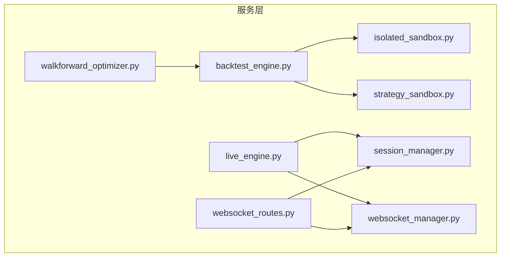
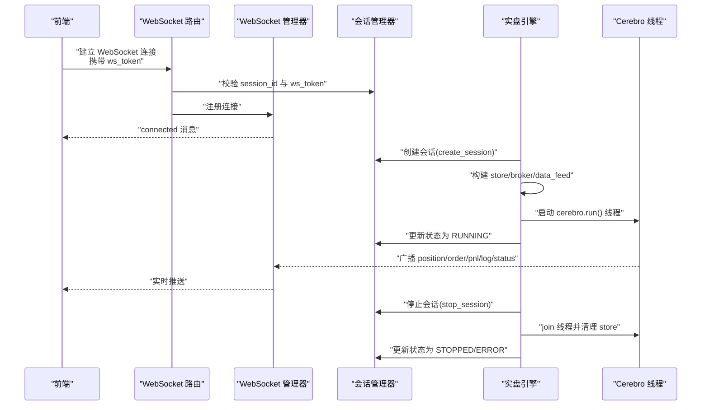
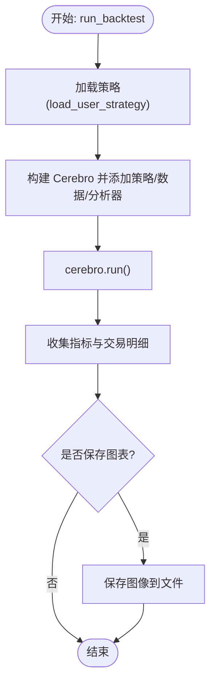
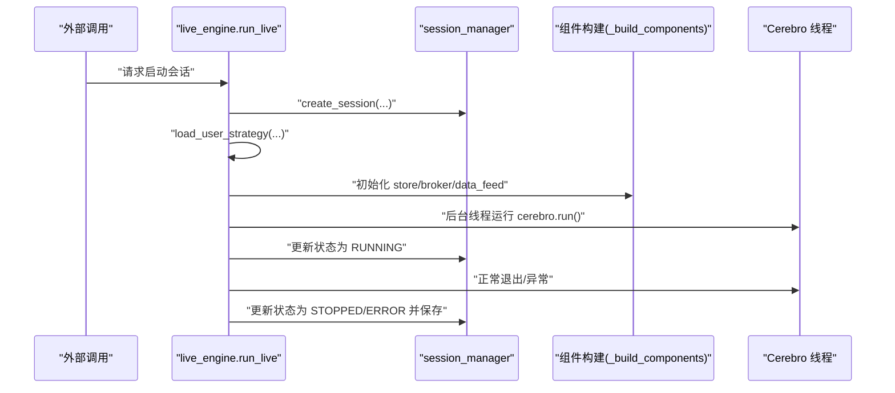
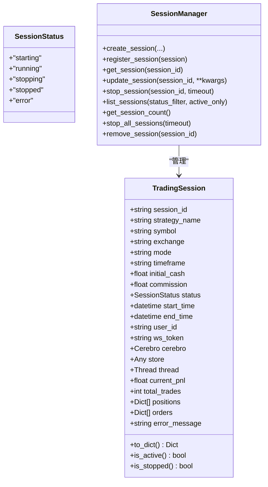
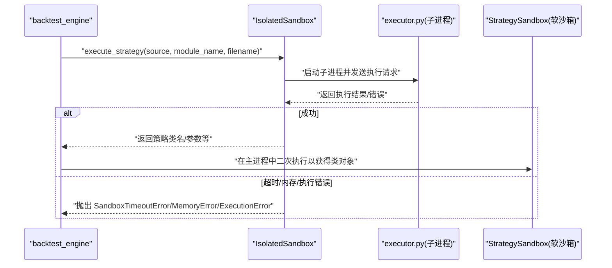
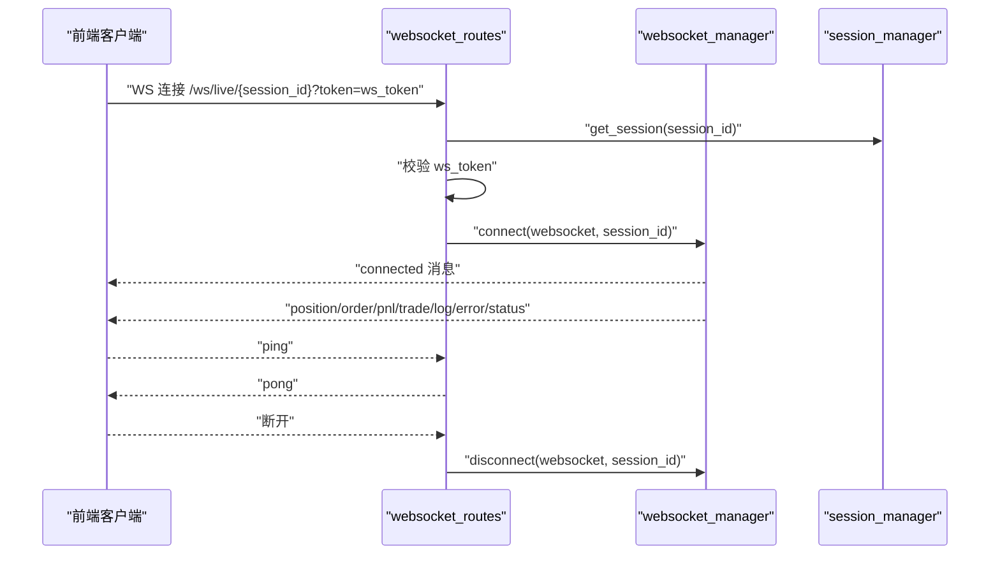
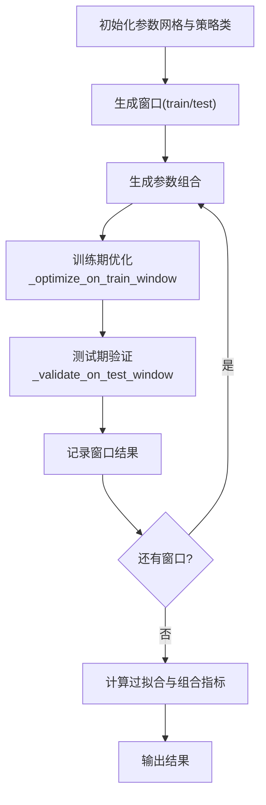
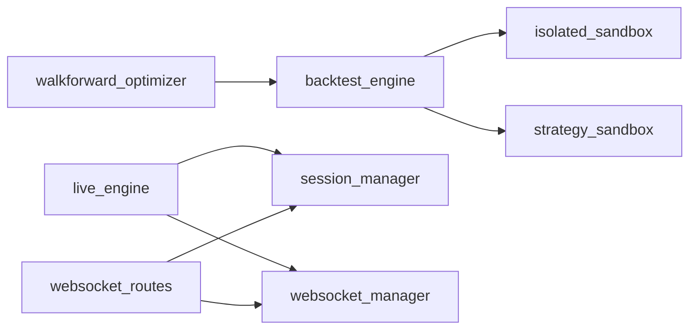

# 业务逻辑服务

<cite>
**本文引用的文件列表**
- [service.md](file://backend/src/service/service.md)
- [backtest_engine.py](file://backend/src/service/backtest_engine.py)
- [live_engine.py](file://backend/src/service/live_engine.py)
- [session_manager.py](file://backend/src/service/session_manager.py)
- [strategy_sandbox.py](file://backend/src/service/strategy_sandbox.py)
- [isolated_sandbox.py](file://backend/src/service/isolated_sandbox.py)
- [websocket_manager.py](file://backend/src/service/websocket_manager.py)
- [websocket_routes.py](file://backend/src/routes/websocket_routes.py)
- [walkforward_optimizer.py](file://backend/src/service/walkforward_optimizer.py)
- [test_backtest_engine.py](file://backend/tests/service/test_backtest_engine.py)
- [test_session_manager.py](file://backend/tests/service/test_session_manager.py)
- [test_strategy_sandbox.py](file://backend/tests/service/test_strategy_sandbox.py)
</cite>

## 目录
1. [引言](#引言)
2. [项目结构](#项目结构)
3. [核心组件](#核心组件)
4. [架构总览](#架构总览)
5. [详细组件分析](#详细组件分析)
6. [依赖关系分析](#依赖关系分析)
7. [性能考量](#性能考量)
8. [故障排查指南](#故障排查指南)
9. [结论](#结论)
10. [附录](#附录)

## 引言
本文件围绕后端业务逻辑服务层进行系统化梳理，重点阐述以下主题：
- 回测引擎如何协调策略加载、数据获取与回测执行，并与策略沙箱协作实现安全的策略代码执行；
- 实盘引擎如何管理实盘交易会话生命周期，以及与会话管理器的交互机制；
- WebSocket 管理器如何实现观察者模式，向客户端广播实时交易数据；
- 会话管理器作为核心协调者的角色，包括会话状态管理、资源清理与并发控制；
- 策略沙箱的安全机制，包括代码隔离、超时控制与异常捕获；
- 基于滚动窗口的参数优化流程 Walk-Forward Optimizer 的算法与性能考量。

## 项目结构
服务层位于 backend/src/service，主要模块职责如下：
- backtest_engine.py：回测引擎，负责策略加载、参数提取、回测执行与指标产出；
- live_engine.py：实盘/模拟引擎，负责会话创建、组件初始化、Cerebro 运行与生命周期管理；
- session_manager.py：会话管理器，提供会话生命周期管理、线程安全访问与全局单例；
- strategy_sandbox.py：软沙箱（已标注弃用），用于在进程内限制导入与内置函数；
- isolated_sandbox.py：隔离沙箱，基于子进程执行策略，具备超时、内存限制与网络/文件写入开关；
- websocket_manager.py：WebSocket 管理器，维护连接池、广播事件与观察者模式；
- websocket_routes.py：WebSocket 路由，提供鉴权与消息类型说明；
- walkforward_optimizer.py：Walk-Forward 参数优化器，训练/验证分离与过拟合检测。

图表来源
- [backtest_engine.py](file://backend/src/service/backtest_engine.py#L1-L400)
- [live_engine.py](file://backend/src/service/live_engine.py#L1-L338)
- [session_manager.py](file://backend/src/service/session_manager.py#L1-L419)
- [strategy_sandbox.py](file://backend/src/service/strategy_sandbox.py#L1-L213)
- [isolated_sandbox.py](file://backend/src/service/isolated_sandbox.py#L1-L393)
- [websocket_manager.py](file://backend/src/service/websocket_manager.py#L1-L401)
- [websocket_routes.py](file://backend/src/routes/websocket_routes.py#L1-L243)
- [walkforward_optimizer.py](file://backend/src/service/walkforward_optimizer.py#L1-L538)

章节来源
- [service.md](file://backend/src/service/service.md#L1-L25)

## 核心组件
- 回测引擎（backtest_engine）：封装策略文件读取、参数提取、数据加载与回测执行，输出指标与交易明细。
- 实盘引擎（live_engine）：创建会话、构建 CCXT/IBKR 组件、启动 Cerebro 线程、更新状态与持久化。
- 会话管理器（session_manager）：单例会话中心，提供创建、更新、停止、统计与移除等能力。
- 策略沙箱（strategy_sandbox/ isolated_sandbox）：软沙箱用于受控执行，隔离沙箱用于安全隔离与资源限制。
- WebSocket 管理器（websocket_manager）：连接池与广播，实现观察者模式向客户端推送实时数据。
- Walk-Forward 优化器（walkforward_optimizer）：滚动窗口训练/验证，计算过拟合检测指标与组合测试指标。

章节来源
- [backtest_engine.py](file://backend/src/service/backtest_engine.py#L1-L400)
- [live_engine.py](file://backend/src/service/live_engine.py#L1-L338)
- [session_manager.py](file://backend/src/service/session_manager.py#L1-L419)
- [strategy_sandbox.py](file://backend/src/service/strategy_sandbox.py#L1-L213)
- [isolated_sandbox.py](file://backend/src/service/isolated_sandbox.py#L1-L393)
- [websocket_manager.py](file://backend/src/service/websocket_manager.py#L1-L401)
- [walkforward_optimizer.py](file://backend/src/service/walkforward_optimizer.py#L1-L538)

## 架构总览
服务层通过清晰的边界与依赖关系协同工作：
- backtest_engine 与 live_engine 共同依赖策略沙箱（软/隔离）与数据源；
- live_engine 与 session_manager 协作管理会话生命周期；
- websocket_manager 与 websocket_routes 提供实时数据广播；
- walkforward_optimizer 在回测引擎之上进行参数搜索与过拟合检测。

图表来源
- [websocket_routes.py](file://backend/src/routes/websocket_routes.py#L1-L243)
- [websocket_manager.py](file://backend/src/service/websocket_manager.py#L1-L401)
- [session_manager.py](file://backend/src/service/session_manager.py#L1-L419)
- [live_engine.py](file://backend/src/service/live_engine.py#L1-L338)

## 详细组件分析

### 回测引擎 backtest_engine
- 策略加载与安全执行
  - 支持软沙箱与隔离沙箱两种模式，隔离沙箱通过子进程执行并限制超时、内存、网络与文件写入。
  - 加载失败时抛出 StrategyLoadError，包含超时、执行错误与沙箱错误的映射。
- 策略参数提取
  - 从策略类的 params 元类中提取参数名称、默认值与类型，兼容 _getdefaults 与直接属性两种路径。
- 回测执行与指标产出
  - 使用 backtrader.Cerebro 添加策略、数据、分析器与自定义 TradeRecorder，产出 Sharpe、DrawDown、Returns、SQN、TradeAnalyzer、TimeDrawDown 与交易明细。
  - 支持可选保存回测图到文件。
- 关键方法与路径
  - 策略加载与参数提取：[load_user_strategy](file://backend/src/service/backtest_engine.py#L81-L165)、[extract_strategy_params](file://backend/src/service/backtest_engine.py#L167-L219)
  - 回测执行入口：[run_backtest](file://backend/src/service/backtest_engine.py#L302-L384)
  - 交易记录器：[TradeRecorder](file://backend/src/service/backtest_engine.py#L221-L300)

图表来源
- [backtest_engine.py](file://backend/src/service/backtest_engine.py#L302-L384)

章节来源
- [backtest_engine.py](file://backend/src/service/backtest_engine.py#L1-L400)
- [test_backtest_engine.py](file://backend/tests/service/test_backtest_engine.py#L1-L35)

### 实盘引擎 live_engine
- 会话生命周期管理
  - 创建会话、加载策略、初始化 CCXT/IBKR 组件、设置 broker 与数据流、添加分析器、保存会话、后台线程运行 cerebro、更新状态与持久化。
  - 停止会话时调用 store.stop()、等待线程 join、设置状态与结束时间。
- 错误处理
  - 对 ZeroDivisionError 进行安全包装，避免收益分析器崩溃。
- 关键方法与路径
  - 启动会话：[run_live](file://backend/src/service/live_engine.py#L105-L269)
  - 停止会话：[stop_live](file://backend/src/service/live_engine.py#L277-L314)
  - 查询状态：[get_session_status](file://backend/src/service/live_engine.py#L316-L338)
  - 安全收益分析器：[SafeReturns](file://backend/src/service/live_engine.py#L35-L49)

图表来源
- [live_engine.py](file://backend/src/service/live_engine.py#L105-L269)
- [session_manager.py](file://backend/src/service/session_manager.py#L139-L214)

章节来源
- [live_engine.py](file://backend/src/service/live_engine.py#L1-L338)
- [session_manager.py](file://backend/src/service/session_manager.py#L1-L419)

### 会话管理器 session_manager
- 单例模式
  - 线程安全的单例实例，确保全局唯一。
- 会话模型
  - TradingSession 数据类包含策略名、符号、交易所、模式、时间框架、初始资金、佣金、状态、时间戳、用户标识、WebSocket token、运行时对象、统计与错误信息。
- 生命周期管理
  - create_session/register_session/get_session/update_session
  - stop_session：停止 CCXT store、等待线程 join、设置状态与结束时间
  - list_sessions/get_session_count/stop_all_sessions/remove_session
- 关键方法与路径
  - 会话状态枚举：[SessionStatus](file://backend/src/service/session_manager.py#L20-L27)
  - 会话模型：[TradingSession](file://backend/src/service/session_manager.py#L29-L101)
  - 单例与锁：[SessionManager](file://backend/src/service/session_manager.py#L102-L138)
  - 停止会话：[stop_session](file://backend/src/service/session_manager.py#L247-L301)
  - 列表与计数：[list_sessions](file://backend/src/service/session_manager.py#L302-L326)、[get_session_count](file://backend/src/service/session_manager.py#L386-L405)

图表来源
- [session_manager.py](file://backend/src/service/session_manager.py#L1-L419)

章节来源
- [session_manager.py](file://backend/src/service/session_manager.py#L1-L419)
- [test_session_manager.py](file://backend/tests/service/test_session_manager.py#L1-L83)

### 策略沙箱 strategy_sandbox 与 isolated_sandbox
- 软沙箱（strategy_sandbox）
  - 限制允许导入模块集合，替换 __builtins__，阻止相对导入与危险内置函数，适用于可信代码或演示场景。
  - 关键点：白名单导入、安全 builtins 构造、语法错误与执行错误包装。
- 隔离沙箱（isolated_sandbox）
  - 子进程执行策略，通过环境变量传递资源限制（超时、内存、网络、文件写入），支持 validate 与 execute 两种动作。
  - 关键点：子进程启动、请求/响应协议、超时与错误分类（超时/内存/执行）。
- 关键方法与路径
  - 软沙箱执行：[execute_strategy_code](file://backend/src/service/strategy_sandbox.py#L179-L210)
  - 隔离沙箱执行：[IsolatedSandbox.execute_strategy](file://backend/src/service/isolated_sandbox.py#L181-L265)
  - 隔离沙箱验证：[IsolatedSandbox.validate_strategy](file://backend/src/service/isolated_sandbox.py#L284-L325)
  - 隔离沙箱超时/内存/执行错误：[SandboxError/SandboxTimeoutError/SandboxMemoryError/SandboxExecutionError](file://backend/src/service/isolated_sandbox.py#L36-L55)

图表来源
- [backtest_engine.py](file://backend/src/service/backtest_engine.py#L81-L165)
- [isolated_sandbox.py](file://backend/src/service/isolated_sandbox.py#L181-L265)
- [strategy_sandbox.py](file://backend/src/service/strategy_sandbox.py#L179-L210)

章节来源
- [strategy_sandbox.py](file://backend/src/service/strategy_sandbox.py#L1-L213)
- [isolated_sandbox.py](file://backend/src/service/isolated_sandbox.py#L1-L393)
- [test_strategy_sandbox.py](file://backend/tests/service/test_strategy_sandbox.py#L1-L39)

### WebSocket 管理器 websocket_manager 与路由 websocket_routes
- 观察者模式
  - 维护 session_id -> WebSocket 集合的连接池，广播消息给同一会话的所有客户端，自动清理断开连接。
- 路由鉴权
  - /ws/live/{session_id} 路由接收 ws_token，校验 session 是否存在且 token 匹配，否则拒绝连接。
- 关键方法与路径
  - 连接/断开/广播：[connect/disconnect/broadcast](file://backend/src/service/websocket_manager.py#L45-L149)
  - 位置/订单/P&L/成交/日志/错误/状态广播：[broadcast_*](file://backend/src/service/websocket_manager.py#L150-L350)
  - WebSocket 路由与鉴权：[/ws/live/{session_id}](file://backend/src/routes/websocket_routes.py#L21-L219)

图表来源
- [websocket_routes.py](file://backend/src/routes/websocket_routes.py#L21-L219)
- [websocket_manager.py](file://backend/src/service/websocket_manager.py#L45-L149)
- [session_manager.py](file://backend/src/service/session_manager.py#L1-L419)

章节来源
- [websocket_manager.py](file://backend/src/service/websocket_manager.py#L1-L401)
- [websocket_routes.py](file://backend/src/routes/websocket_routes.py#L1-L243)

### Walk-Forward 参数优化器 walkforward_optimizer
- 算法流程
  - 生成滚动/锚定窗口（训练期与测试期），对每个窗口生成参数组合并在训练期优化，在测试期验证，记录最佳参数与指标。
  - 计算过拟合检测指标：训练/测试相关性、平均退化百分比、一致性得分、退化标准差，以及是否检测到过拟合。
  - 计算组合测试指标：跨窗口汇总的总回报、平均夏普比率、最大回撤、总交易数、胜率等。
- 性能考量
  - 参数组合爆炸式增长，建议合理缩小参数网格或采用分层搜索；
  - 训练/测试窗口大小影响稳定性，需平衡样本量与时效性；
  - 分析器较多时注意内存与 CPU 开销，必要时减少分析器或分批执行。
- 关键方法与路径
  - 窗口生成：[_generate_windows](file://backend/src/service/walkforward_optimizer.py#L116-L159)
  - 参数组合生成：[_generate_param_combinations](file://backend/src/service/walkforward_optimizer.py#L161-L179)
  - 单次回测：[_run_single_backtest](file://backend/src/service/walkforward_optimizer.py#L181-L273)
  - 训练期优化：[_optimize_on_train_window](file://backend/src/service/walkforward_optimizer.py#L274-L319)
  - 测试期验证：[_validate_on_test_window](file://backend/src/service/walkforward_optimizer.py#L321-L339)
  - 过拟合指标：[_calculate_overfitting_metrics](file://backend/src/service/walkforward_optimizer.py#L419-L494)
  - 组合测试指标：[_calculate_combined_test_metrics](file://backend/src/service/walkforward_optimizer.py#L495-L531)
  - 主流程：[run_walkforward](file://backend/src/service/walkforward_optimizer.py#L341-L418)

图表来源
- [walkforward_optimizer.py](file://backend/src/service/walkforward_optimizer.py#L116-L418)

章节来源
- [walkforward_optimizer.py](file://backend/src/service/walkforward_optimizer.py#L1-L538)

## 依赖关系分析
- backtest_engine 依赖
  - 策略沙箱（软/隔离）：[load_user_strategy](file://backend/src/service/backtest_engine.py#L81-L165)
  - 数据源：[get_bt_feed](file://backend/src/service/backtest_engine.py#L328-L330)
- live_engine 依赖
  - 会话管理器：[get_session_manager](file://backend/src/service/live_engine.py#L21-L23)
  - 策略加载：[load_user_strategy](file://backend/src/service/live_engine.py#L169-L170)
  - 组件构建：[CCXTStore/CCXTBroker/CCXTData 或 IBKRStore](file://backend/src/service/live_engine.py#L50-L103)
- websocket_routes 依赖
  - WebSocket 管理器与会话管理器：[websocket_live_updates](file://backend/src/routes/websocket_routes.py#L152-L171)
- walkforward_optimizer 依赖
  - 回测引擎策略加载与数据源：[load_user_strategy](file://backend/src/service/walkforward_optimizer.py#L109-L110)、[get_bt_feed](file://backend/src/service/walkforward_optimizer.py#L205-L206)

图表来源
- [backtest_engine.py](file://backend/src/service/backtest_engine.py#L1-L400)
- [live_engine.py](file://backend/src/service/live_engine.py#L1-L338)
- [session_manager.py](file://backend/src/service/session_manager.py#L1-L419)
- [websocket_manager.py](file://backend/src/service/websocket_manager.py#L1-L401)
- [websocket_routes.py](file://backend/src/routes/websocket_routes.py#L1-L243)
- [walkforward_optimizer.py](file://backend/src/service/walkforward_optimizer.py#L1-L538)

章节来源
- [backtest_engine.py](file://backend/src/service/backtest_engine.py#L1-L400)
- [live_engine.py](file://backend/src/service/live_engine.py#L1-L338)
- [session_manager.py](file://backend/src/service/session_manager.py#L1-L419)
- [websocket_manager.py](file://backend/src/service/websocket_manager.py#L1-L401)
- [websocket_routes.py](file://backend/src/routes/websocket_routes.py#L1-L243)
- [walkforward_optimizer.py](file://backend/src/service/walkforward_optimizer.py#L1-L538)

## 性能考量
- 回测与实盘
  - 分析器数量与复杂度直接影响内存与 CPU；建议按需启用分析器。
  - 图像渲染（保存回测图）可能阻塞，建议在后台任务中执行或关闭自动保存。
- 沙箱执行
  - 隔离沙箱引入子进程开销，频繁加载策略时可复用 IsolatedSandbox 实例以减少启动成本。
  - 超时与内存限制应根据策略复杂度调整，避免频繁超时导致回测中断。
- WebSocket
  - 广播前复制连接集合，避免迭代期间修改；及时清理断连，降低无效广播。
- Walk-Forward
  - 参数网格过大时，优先采用分层搜索或贝叶斯优化等高效策略；
  - 训练/测试窗口长度需权衡样本量与市场结构变化，避免过度拟合。

## 故障排查指南
- 策略加载失败
  - 检查策略文件是否存在与命名规范（仅字母数字与短横线下划线，不含路径遍历）。
  - 若使用隔离沙箱，关注超时与内存限制；必要时提升 timeout 与 max_memory。
  - 参考测试用例定位问题：[test_strategy_sandbox.py](file://backend/tests/service/test_strategy_sandbox.py#L1-L39)、[test_backtest_engine.py](file://backend/tests/service/test_backtest_engine.py#L1-L35)
- 实盘会话无法停止
  - 确认线程仍在运行且未被阻塞；适当增大 stop_session 的 timeout。
  - 检查 store.stop() 是否成功调用；查看 SessionManager 的 stop_session 日志。
  - 参考测试用例：[test_session_manager.py](file://backend/tests/service/test_session_manager.py#L1-L83)
- WebSocket 连接被拒绝
  - 确认 token 与 session_id 正确；检查会话是否存在且状态有效。
  - 查看路由日志与 WebSocket 管理器连接计数，确认连接池清理是否正常。
  - 参考路由实现：[/ws/live/{session_id}](file://backend/src/routes/websocket_routes.py#L152-L171)

章节来源
- [test_strategy_sandbox.py](file://backend/tests/service/test_strategy_sandbox.py#L1-L39)
- [test_backtest_engine.py](file://backend/tests/service/test_backtest_engine.py#L1-L35)
- [test_session_manager.py](file://backend/tests/service/test_session_manager.py#L1-L83)
- [websocket_routes.py](file://backend/src/routes/websocket_routes.py#L152-L171)

## 结论
服务层通过明确的职责划分与强约束的安全机制，实现了从策略加载、数据接入、回测/实盘执行到实时监控的完整闭环。会话管理器作为核心协调者，确保多会话并发下的状态一致与资源回收；策略沙箱保障了用户策略在生产环境中的安全执行；WebSocket 管理器以观察者模式提供低延迟的实时数据通道；Walk-Forward 优化器则为参数优化提供了稳健的评估框架。建议在实际部署中结合性能与安全需求，合理配置沙箱参数、分析器与窗口策略，持续优化用户体验与系统稳定性。

## 附录
- 典型使用场景（方法签名路径）
  - 启动回测：[run_backtest](file://backend/src/service/backtest_engine.py#L302-L384)
  - 启动实盘：[run_live](file://backend/src/service/live_engine.py#L105-L269)
  - 停止实盘：[stop_live](file://backend/src/service/live_engine.py#L277-L314)
  - 查询会话状态：[get_session_status](file://backend/src/service/live_engine.py#L316-L338)
  - 创建会话：[create_session](file://backend/src/service/session_manager.py#L139-L196)
  - 停止会话：[stop_session](file://backend/src/service/session_manager.py#L247-L301)
  - 广播位置更新：[broadcast_position_update](file://backend/src/service/websocket_manager.py#L150-L181)
  - 广播订单更新：[broadcast_order_update](file://backend/src/service/websocket_manager.py#L182-L221)
  - 广播 P&L 更新：[broadcast_pnl_update](file://backend/src/service/websocket_manager.py#L222-L249)
  - 广播成交执行：[broadcast_trade_executed](file://backend/src/service/websocket_manager.py#L250-L282)
  - 广播日志/错误/状态：[broadcast_log/broadcast_error/broadcast_status_change](file://backend/src/service/websocket_manager.py#L284-L350)
  - Walk-Forward 主流程：[run_walkforward](file://backend/src/service/walkforward_optimizer.py#L341-L418)