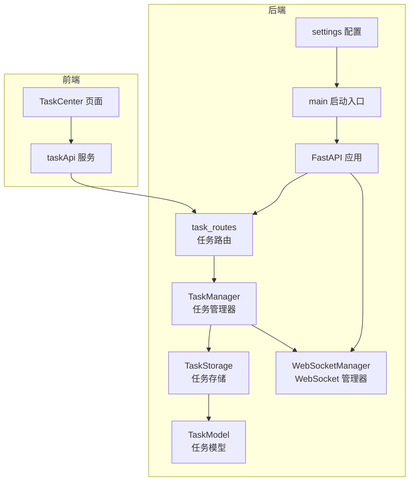
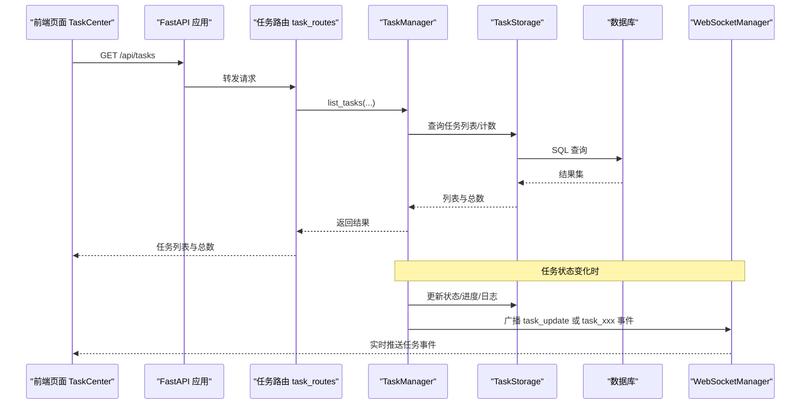
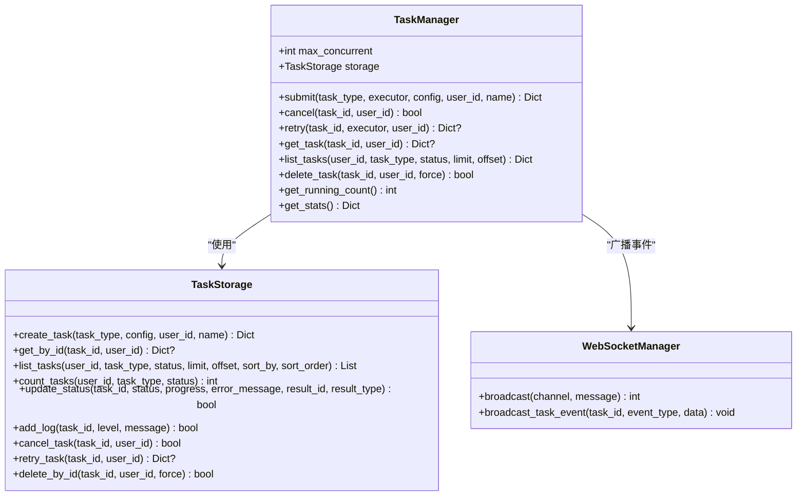
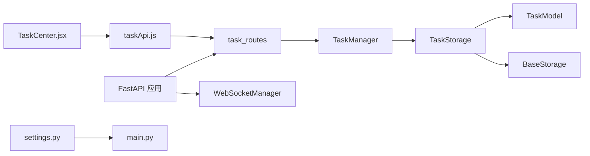

# 任务管理器

<cite>
**本文引用的文件**
- [backend/src/service/task_manager.py](file://backend/src/service/task_manager.py)
- [backend/src/route/task_routes.py](file://backend/src/route/task_routes.py)
- [backend/src/db/models/task.py](file://backend/src/db/models/task.py)
- [backend/src/db/storage/task.py](file://backend/src/db/storage/task.py)
- [backend/src/db/storage/base.py](file://backend/src/db/storage/base.py)
- [backend/src/service/websocket_manager.py](file://backend/src/service/websocket_manager.py)
- [backend/api.py](file://backend/api.py)
- [backend/main.py](file://backend/main.py)
- [backend/src/config/settings.py](file://backend/src/config/settings.py)
- [frontend/src/pages/TaskCenter.jsx](file://frontend/src/pages/TaskCenter.jsx)
- [frontend/src/services/taskApi.js](file://frontend/src/services/taskApi.js)
</cite>

## 目录
1. [简介](#简介)
2. [项目结构](#项目结构)
3. [核心组件](#核心组件)
4. [架构总览](#架构总览)
5. [详细组件分析](#详细组件分析)
6. [依赖关系分析](#依赖关系分析)
7. [性能考量](#性能考量)
8. [故障排查指南](#故障排查指南)
9. [结论](#结论)
10. [附录](#附录)

## 简介
本文件系统性梳理“任务管理器”的设计与实现，覆盖后端服务层、数据库模型与存储层、REST 路由、WebSocket 广播以及前端页面与 API 封装。任务管理器提供统一的后台任务执行能力，支持并发控制、生命周期管理（提交、取消、重试）、进度与日志记录，并通过 WebSocket 实时推送状态更新，便于用户在前端“任务中心”进行可视化监控与操作。

## 项目结构
任务管理器涉及后端服务、数据库模型与存储、路由与 API、WebSocket 管理，以及前端页面与服务封装。下图展示与任务管理器直接相关的模块与交互关系。

图表来源
- [backend/src/service/task_manager.py](file://backend/src/service/task_manager.py#L1-L380)
- [backend/src/route/task_routes.py](file://backend/src/route/task_routes.py#L1-L433)
- [backend/src/db/storage/task.py](file://backend/src/db/storage/task.py#L1-L408)
- [backend/src/db/models/task.py](file://backend/src/db/models/task.py#L1-L107)
- [backend/src/service/websocket_manager.py](file://backend/src/service/websocket_manager.py#L1-L453)
- [backend/api.py](file://backend/api.py#L1-L59)
- [backend/main.py](file://backend/main.py#L1-L68)
- [backend/src/config/settings.py](file://backend/src/config/settings.py#L1-L117)
- [frontend/src/pages/TaskCenter.jsx](file://frontend/src/pages/TaskCenter.jsx#L1-L411)
- [frontend/src/services/taskApi.js](file://frontend/src/services/taskApi.js#L1-L167)

章节来源
- [backend/src/service/task_manager.py](file://backend/src/service/task_manager.py#L1-L380)
- [backend/src/route/task_routes.py](file://backend/src/route/task_routes.py#L1-L433)
- [backend/src/db/storage/task.py](file://backend/src/db/storage/task.py#L1-L408)
- [backend/src/db/models/task.py](file://backend/src/db/models/task.py#L1-L107)
- [backend/src/service/websocket_manager.py](file://backend/src/service/websocket_manager.py#L1-L453)
- [backend/api.py](file://backend/api.py#L1-L59)
- [backend/main.py](file://backend/main.py#L1-L68)
- [backend/src/config/settings.py](file://backend/src/config/settings.py#L1-L117)
- [frontend/src/pages/TaskCenter.jsx](file://frontend/src/pages/TaskCenter.jsx#L1-L411)
- [frontend/src/services/taskApi.js](file://frontend/src/services/taskApi.js#L1-L167)

## 核心组件
- 任务管理器（TaskManager）
  - 提交新任务、并发控制（信号量）、进度回调、状态更新、错误处理、取消与重试、统计查询、WebSocket 广播。
- 任务存储（TaskStorage）
  - 数据库 CRUD、状态与进度更新、日志追加、取消与重试、删除、计数与分页。
- 任务模型（TaskModel）
  - 定义任务表结构、枚举类型（任务类型、状态）。
- 任务路由（task_routes）
  - 提供列表、详情、统计、取消、重试、删除等 REST 接口。
- WebSocket 管理器（WebSocketManager）
  - 维护连接池、广播消息、任务事件广播。
- 前端任务中心（TaskCenter）
  - 展示任务列表、实时更新、过滤与分页、取消/重试/删除操作。
- 前端任务 API（taskApi）
  - 对后端接口的封装，提供列表、详情、统计、取消、重试、删除等方法。

章节来源
- [backend/src/service/task_manager.py](file://backend/src/service/task_manager.py#L1-L380)
- [backend/src/db/storage/task.py](file://backend/src/db/storage/task.py#L1-L408)
- [backend/src/db/models/task.py](file://backend/src/db/models/task.py#L1-L107)
- [backend/src/route/task_routes.py](file://backend/src/route/task_routes.py#L1-L433)
- [backend/src/service/websocket_manager.py](file://backend/src/service/websocket_manager.py#L1-L453)
- [frontend/src/pages/TaskCenter.jsx](file://frontend/src/pages/TaskCenter.jsx#L1-L411)
- [frontend/src/services/taskApi.js](file://frontend/src/services/taskApi.js#L1-L167)

## 架构总览
任务管理器采用“服务层 + 存储层 + 路由 + WebSocket + 前端”的分层架构：
- 服务层负责任务生命周期与并发控制；
- 存储层负责持久化与数据一致性；
- 路由层提供 REST 接口；
- WebSocket 管理器负责实时事件广播；
- 前端页面与服务封装负责用户交互与数据展示。

图表来源
- [backend/src/route/task_routes.py](file://backend/src/route/task_routes.py#L78-L168)
- [backend/src/service/task_manager.py](file://backend/src/service/task_manager.py#L106-L214)
- [backend/src/db/storage/task.py](file://backend/src/db/storage/task.py#L95-L162)
- [backend/src/service/websocket_manager.py](file://backend/src/service/websocket_manager.py#L351-L402)
- [frontend/src/pages/TaskCenter.jsx](file://frontend/src/pages/TaskCenter.jsx#L1-L200)

## 详细组件分析

### 任务管理器（TaskManager）
- 并发控制
  - 使用信号量限制最大并发任务数，默认从环境变量读取，避免资源争用。
- 生命周期管理
  - 提交：创建任务记录、调度执行、广播“created”事件。
  - 执行：更新为运行中、支持进度回调、自动计算持续时间。
  - 取消：运行中任务通过取消异常传播；待执行任务通过存储层标记取消。
  - 重试：仅对失败或取消的任务重试，复制原配置生成新任务。
  - 删除：运行中任务默认不可删除，可强制删除用于清理卡住的任务。
- 状态与日志
  - 统一的状态枚举（PENDING/RUNNING/COMPLETED/FAILED/CANCELLED），支持错误消息与日志数组。
- WebSocket 广播
  - 在任务状态变化时广播事件，前端订阅“tasks”频道接收实时更新。
- 统计
  - 提供最大并发、运行中数量、可用槽位、待执行数量等指标。

图表来源
- [backend/src/service/task_manager.py](file://backend/src/service/task_manager.py#L26-L379)
- [backend/src/db/storage/task.py](file://backend/src/db/storage/task.py#L26-L408)
- [backend/src/service/websocket_manager.py](file://backend/src/service/websocket_manager.py#L351-L402)

章节来源
- [backend/src/service/task_manager.py](file://backend/src/service/task_manager.py#L26-L379)

### 任务存储（TaskStorage）
- 创建任务：生成唯一 task_id，初始状态为 PENDING，记录配置、名称、日志与重试次数。
- 查询与分页：支持按用户、类型、状态过滤，排序字段与顺序可控。
- 状态更新：自动设置 started_at/completed_at/duration_seconds，保证时区一致。
- 日志：以数组形式追加带时间戳的日志条目。
- 取消与重试：仅对 PENDING/RUNNING 或 FAILED/CANCELLED 的任务执行相应操作。
- 删除：运行中任务默认不可删，强制模式用于清理卡住的任务。

章节来源
- [backend/src/db/storage/task.py](file://backend/src/db/storage/task.py#L26-L408)

### 任务模型（TaskModel）
- 字段覆盖：主键自增、唯一 task_id、任务类型与状态、进度、时间戳、错误信息、结果链接、用户标识、配置快照、名称、日志数组、重试次数。
- 枚举：TaskType（backtest、portfolio、walkforward、deep_analysis）、TaskStatus（PENDING/RUNNING/COMPLETED/FAILED/CANCELLED）。

章节来源
- [backend/src/db/models/task.py](file://backend/src/db/models/task.py#L1-L107)

### 任务路由（task_routes）
- 列表与统计：支持 task_type/status 过滤、limit/offset 分页、sort_by/sort_order 排序；统计返回并发上限、运行中、可用槽位、待执行数量等。
- 获取任务详情：按 task_id 查询，支持用户鉴权过滤。
- 取消任务：仅 PENDING/RUNNING 可取消，否则返回错误。
- 重试任务：仅 FAILED/CANCELLED 可重试，根据任务类型动态导入对应执行器。
- 删除任务：运行中任务默认不可删，force=true 允许强制删除。

章节来源
- [backend/src/route/task_routes.py](file://backend/src/route/task_routes.py#L78-L433)

### WebSocket 管理器（WebSocketManager）
- 连接管理：按会话维护连接集合，支持欢迎消息与断开清理。
- 广播：向指定会话的所有客户端广播消息，自动清理无效连接。
- 任务事件：提供 broadcast_task_update 与 broadcast_task_event，分别用于进度/状态更新与生命周期事件。

章节来源
- [backend/src/service/websocket_manager.py](file://backend/src/service/websocket_manager.py#L1-L453)

### 前端任务中心（TaskCenter）
- 功能：列出任务、筛选类型与状态、查看详情、取消/重试/删除、查看结果、实时更新、统计信息。
- 实时更新：订阅 WebSocket 任务频道，收到事件后局部刷新任务列表与统计。
- 用户交互：根据任务状态显示可执行的操作按钮；支持强制删除卡住的运行中任务。

章节来源
- [frontend/src/pages/TaskCenter.jsx](file://frontend/src/pages/TaskCenter.jsx#L1-L411)

### 前端任务 API（taskApi）
- 封装：listTasks/getTask/getTaskStats/cancelTask/retryTask/deleteTask。
- 参数：支持 task_type/status/limit/offset/sort_by/sort_order 等查询参数。

章节来源
- [frontend/src/services/taskApi.js](file://frontend/src/services/taskApi.js#L1-L167)

## 依赖关系分析
- 模块耦合
  - TaskManager 依赖 TaskStorage 与 WebSocketManager；TaskStorage 依赖 TaskModel 与 BaseStorage；BaseStorage 依赖数据库初始化。
  - 路由层依赖 TaskManager；前端通过 taskApi 调用路由。
- 外部依赖
  - FastAPI、SQLAlchemy、Daphne（ASGI 服务器）、环境变量（数据库 URL、日志级别、并发上限等）。
- 循环依赖
  - TaskManager 延迟加载 WebSocketManager，避免循环导入。

图表来源
- [backend/src/route/task_routes.py](file://backend/src/route/task_routes.py#L1-L433)
- [backend/src/service/task_manager.py](file://backend/src/service/task_manager.py#L1-L380)
- [backend/src/db/storage/task.py](file://backend/src/db/storage/task.py#L1-L408)
- [backend/src/db/models/task.py](file://backend/src/db/models/task.py#L1-L107)
- [backend/src/db/storage/base.py](file://backend/src/db/storage/base.py#L1-L89)
- [backend/src/service/websocket_manager.py](file://backend/src/service/websocket_manager.py#L1-L453)
- [backend/api.py](file://backend/api.py#L1-L59)
- [backend/main.py](file://backend/main.py#L1-L68)
- [backend/src/config/settings.py](file://backend/src/config/settings.py#L1-L117)
- [frontend/src/pages/TaskCenter.jsx](file://frontend/src/pages/TaskCenter.jsx#L1-L411)
- [frontend/src/services/taskApi.js](file://frontend/src/services/taskApi.js#L1-L167)

## 性能考量
- 并发控制
  - 通过信号量限制最大并发任务数，避免资源争用导致系统过载。默认值来自环境变量，可根据部署规模调整。
- 数据库访问
  - 使用上下文管理的会话，自动提交/回滚，减少长事务与锁竞争。
- WebSocket 广播
  - 广播前复制连接集合，避免迭代期间集合被修改；对发送失败的连接进行清理，降低广播成本。
- 前端渲染
  - 仅在任务状态变化时局部更新，避免全量刷新；统计信息按需刷新，减少网络与计算压力。

[本节为通用指导，无需特定文件来源]

## 故障排查指南
- 无法取消任务
  - 若任务已结束（完成/失败/取消），取消接口会返回错误；请检查任务当前状态。
  - 如果任务处于运行中但无法取消，尝试强制删除任务记录（谨慎使用）。
- 重试失败
  - 仅 FAILED/CANCELLED 任务可重试；若状态不符，请先确认原始任务状态。
  - 若执行器导入失败，检查任务类型是否受支持。
- 任务长时间无响应
  - 查看任务统计中的“运行中/待执行/可用槽位”，评估并发上限是否过低。
  - 检查数据库连接与日志，定位存储层写入异常。
- WebSocket 不更新
  - 确认前端已连接到“tasks”频道；检查 WebSocketManager 的广播逻辑与连接池状态。
- 数据库问题
  - 确认 DATABASE_URL 正确；SQLite 默认路径位于项目根目录；日志中会屏蔽密码信息以便安全输出。

章节来源
- [backend/src/route/task_routes.py](file://backend/src/route/task_routes.py#L189-L346)
- [backend/src/service/task_manager.py](file://backend/src/service/task_manager.py#L225-L344)
- [backend/src/db/storage/task.py](file://backend/src/db/storage/task.py#L250-L359)
- [backend/src/service/websocket_manager.py](file://backend/src/service/websocket_manager.py#L91-L149)
- [backend/main.py](file://backend/main.py#L1-L68)

## 结论
任务管理器通过清晰的服务层与存储层分离、严格的生命周期管理与并发控制、完善的实时事件广播，实现了稳定可靠的后台任务执行与可视化管理。前后端协作明确，前端页面与 API 封装提供了良好的用户体验。建议在生产环境中合理配置并发上限与数据库参数，并结合日志与监控持续优化性能与稳定性。

[本节为总结性内容，无需特定文件来源]

## 附录

### 环境变量与配置要点
- MAX_CONCURRENT_TASKS：最大并发任务数（默认 3）。
- DATABASE_URL：数据库连接字符串（默认 SQLite）。
- LOG_LEVEL：日志级别。
- LIVE_TRADING_ENABLED、DEFAULT_EXCHANGE、DEFAULT_TRADE_MODE：交易相关开关与默认值。

章节来源
- [backend/src/service/task_manager.py](file://backend/src/service/task_manager.py#L22-L24)
- [backend/src/config/settings.py](file://backend/src/config/settings.py#L30-L53)
- [backend/main.py](file://backend/main.py#L40-L64)