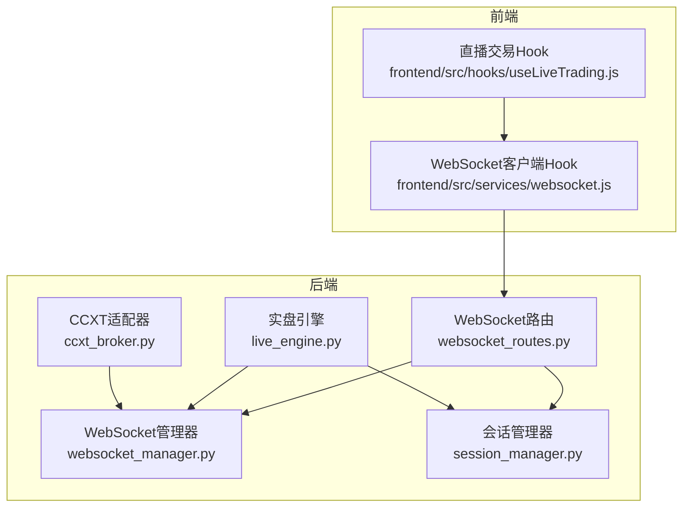
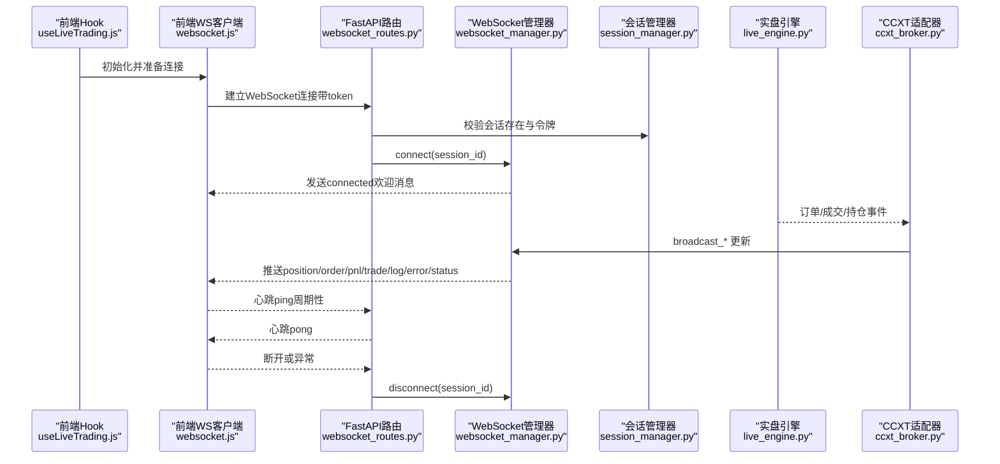
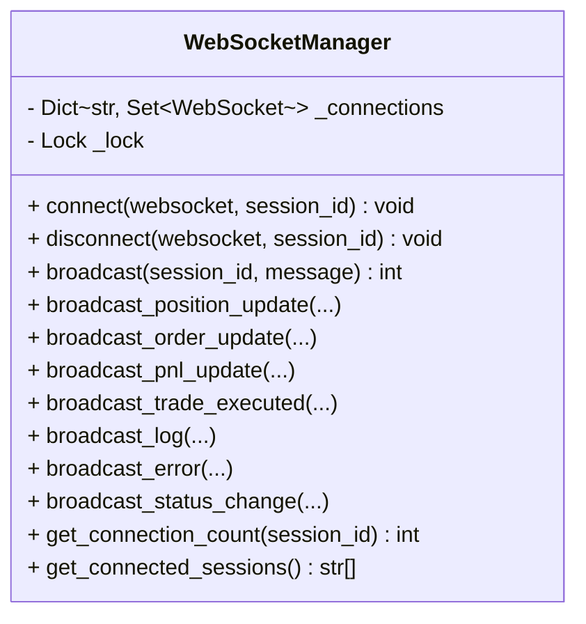
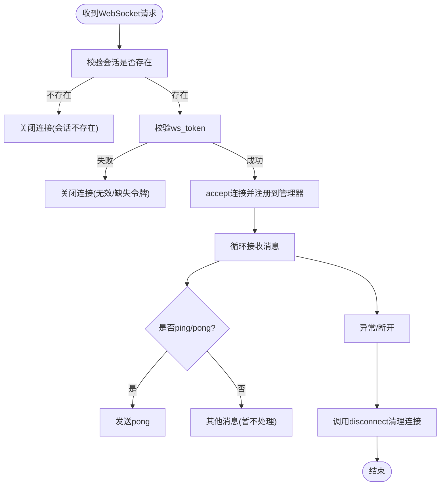
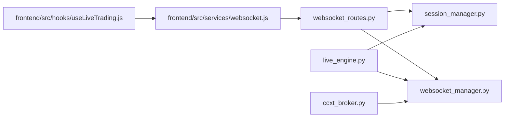

# WebSocket管理器

<cite>
**本文引用的文件列表**
- [websocket_manager.py](file://backend/src/service/websocket_manager.py)
- [websocket_routes.py](file://backend/src/routes/websocket_routes.py)
- [session_manager.py](file://backend/src/service/session_manager.py)
- [live_engine.py](file://backend/src/service/live_engine.py)
- [ccxt_broker.py](file://backend/src/brokers/ccxt_adapter/ccxt_broker.py)
- [websocket.js](file://frontend/src/services/websocket.js)
- [useLiveTrading.js](file://frontend/src/hooks/useLiveTrading.js)
- [test_websocket_manager.py](file://backend/tests/service/test_websocket_manager.py)
</cite>

## 目录
1. [简介](#简介)
2. [项目结构](#项目结构)
3. [核心组件](#核心组件)
4. [架构总览](#架构总览)
5. [组件详解](#组件详解)
6. [依赖关系分析](#依赖关系分析)
7. [性能考量](#性能考量)
8. [故障排查指南](#故障排查指南)
9. [结论](#结论)
10. [附录](#附录)

## 简介
本文件系统性解析WebSocket管理器（WebSocketManager）在本项目中的设计与实现，重点覆盖：
- 基于FastAPI的WebSocket协议实现全双工通信
- 每个交易会话（session_id）下的多客户端连接池管理
- 连接生命周期管理：connect与disconnect
- 广播机制：broadcast及其对异常连接的清理策略
- 七种预定义消息类型（position, order, pnl, trade, log, error, status）的数据格式、生成方式与前端消费模式
- 单例模式的全局实例与会话管理器的协同工作
- 生产环境最佳实践：连接鉴权、心跳检测、断线重连

## 项目结构
WebSocket相关能力由后端服务模块与前端Hook共同构成，形成“后端广播 + 前端订阅”的实时通信闭环。

图表来源
- [websocket_routes.py](file://backend/src/routes/websocket_routes.py#L1-L243)
- [websocket_manager.py](file://backend/src/service/websocket_manager.py#L1-L401)
- [session_manager.py](file://backend/src/service/session_manager.py#L1-L419)
- [live_engine.py](file://backend/src/service/live_engine.py#L1-L338)
- [ccxt_broker.py](file://backend/src/brokers/ccxt_adapter/ccxt_broker.py#L428-L462)
- [websocket.js](file://frontend/src/services/websocket.js#L1-L287)
- [useLiveTrading.js](file://frontend/src/hooks/useLiveTrading.js#L1-L276)

章节来源
- [websocket_routes.py](file://backend/src/routes/websocket_routes.py#L1-L243)
- [websocket_manager.py](file://backend/src/service/websocket_manager.py#L1-L401)
- [session_manager.py](file://backend/src/service/session_manager.py#L1-L419)
- [live_engine.py](file://backend/src/service/live_engine.py#L1-L338)
- [ccxt_broker.py](file://backend/src/brokers/ccxt_adapter/ccxt_broker.py#L428-L462)
- [websocket.js](file://frontend/src/services/websocket.js#L1-L287)
- [useLiveTrading.js](file://frontend/src/hooks/useLiveTrading.js#L1-L276)

## 核心组件
- WebSocketManager：集中式WebSocket连接管理与广播
- WebSocket路由：FastAPI WebSocket端点，鉴权与保活
- 会话管理器：维护交易会话状态与令牌
- 实盘引擎：启动/停止会话，并驱动会话状态变更
- CCXT适配器：在订单成交/持仓变化时触发广播
- 前端Hook：心跳、断线重连、消息解析与UI更新

章节来源
- [websocket_manager.py](file://backend/src/service/websocket_manager.py#L1-L401)
- [websocket_routes.py](file://backend/src/routes/websocket_routes.py#L1-L243)
- [session_manager.py](file://backend/src/service/session_manager.py#L1-L419)
- [live_engine.py](file://backend/src/service/live_engine.py#L1-L338)
- [ccxt_broker.py](file://backend/src/brokers/ccxt_adapter/ccxt_broker.py#L428-L462)
- [websocket.js](file://frontend/src/services/websocket.js#L1-L287)
- [useLiveTrading.js](file://frontend/src/hooks/useLiveTrading.js#L1-L276)

## 架构总览
WebSocket实时通信链路如下：
- 客户端通过前端Hook建立WebSocket连接，携带会话令牌
- 后端路由校验会话存在性与令牌有效性，接入WebSocket管理器
- 实盘引擎或适配器在事件发生时调用WebSocket管理器进行广播
- 前端Hook接收消息并更新UI状态

图表来源
- [websocket_routes.py](file://backend/src/routes/websocket_routes.py#L1-L243)
- [websocket_manager.py](file://backend/src/service/websocket_manager.py#L1-L401)
- [session_manager.py](file://backend/src/service/session_manager.py#L1-L419)
- [live_engine.py](file://backend/src/service/live_engine.py#L1-L338)
- [ccxt_broker.py](file://backend/src/brokers/ccxt_adapter/ccxt_broker.py#L428-L462)
- [websocket.js](file://frontend/src/services/websocket.js#L1-L287)
- [useLiveTrading.js](file://frontend/src/hooks/useLiveTrading.js#L1-L276)

## 组件详解

### WebSocketManager：连接池与广播
- 连接池结构：以session_id为键，值为WebSocket集合，支持多客户端并发
- 生命周期管理：
  - connect：接受连接、注册到对应session池、发送欢迎消息
  - disconnect：从池中移除连接，若会话无连接则清理该会话键
- 广播逻辑：
  - broadcast：遍历当前会话连接，逐个发送；捕获发送异常并清理失效连接
  - 返回成功送达数量，便于监控与调试
- 预定义广播方法：
  - broadcast_position_update：位置更新
  - broadcast_order_update：订单更新
  - broadcast_pnl_update：盈亏更新
  - broadcast_trade_executed：成交执行
  - broadcast_log：日志消息
  - broadcast_error：错误通知
  - broadcast_status_change：会话状态变更
- 辅助查询：
  - get_connection_count：按会话或总计统计
  - get_connected_sessions：返回有连接的会话列表

图表来源
- [websocket_manager.py](file://backend/src/service/websocket_manager.py#L1-L401)

章节来源
- [websocket_manager.py](file://backend/src/service/websocket_manager.py#L1-L401)

### WebSocket路由：鉴权、保活与清理
- 路径：/ws/live/{session_id}
- 鉴权：校验session存在且ws_token匹配
- 保活：支持字符串与JSON两种ping消息，统一回pong
- 清理：异常或断开时调用disconnect，确保连接池一致性

图表来源
- [websocket_routes.py](file://backend/src/routes/websocket_routes.py#L1-L243)

章节来源
- [websocket_routes.py](file://backend/src/routes/websocket_routes.py#L1-L243)

### 会话管理器：状态与令牌
- 提供会话创建、更新、停止、计数等能力
- 为WebSocket鉴权提供ws_token（每个会话自动生成）
- 与实盘引擎协作，驱动会话状态变更（running/stopped/error）

章节来源
- [session_manager.py](file://backend/src/service/session_manager.py#L1-L419)
- [live_engine.py](file://backend/src/service/live_engine.py#L1-L338)

### 实盘引擎与CCXT适配器：事件驱动广播
- 实盘引擎启动/停止会话，并更新会话状态
- CCXT适配器在订单成交、持仓变化时调用WebSocket管理器广播position/pnl等消息

章节来源
- [live_engine.py](file://backend/src/service/live_engine.py#L1-L338)
- [ccxt_broker.py](file://backend/src/brokers/ccxt_adapter/ccxt_broker.py#L428-L462)

### 前端Hook：心跳、重连与消息消费
- 心跳：定时发送ping，收到pong确认存活
- 重连：断开后按指数退避尝试重连，限制最大次数
- 消息消费：根据消息类型更新UI（位置、订单、P&L、成交、日志、错误、状态）

章节来源
- [websocket.js](file://frontend/src/services/websocket.js#L1-L287)
- [useLiveTrading.js](file://frontend/src/hooks/useLiveTrading.js#L1-L276)

## 依赖关系分析
- WebSocket路由依赖WebSocket管理器与会话管理器
- WebSocket管理器被实盘引擎与适配器间接使用
- 前端Hook依赖后端WebSocket端点与消息常量

图表来源
- [websocket_routes.py](file://backend/src/routes/websocket_routes.py#L1-L243)
- [websocket_manager.py](file://backend/src/service/websocket_manager.py#L1-L401)
- [session_manager.py](file://backend/src/service/session_manager.py#L1-L419)
- [live_engine.py](file://backend/src/service/live_engine.py#L1-L338)
- [ccxt_broker.py](file://backend/src/brokers/ccxt_adapter/ccxt_broker.py#L428-L462)
- [websocket.js](file://frontend/src/services/websocket.js#L1-L287)
- [useLiveTrading.js](file://frontend/src/hooks/useLiveTrading.js#L1-L276)

章节来源
- [websocket_routes.py](file://backend/src/routes/websocket_routes.py#L1-L243)
- [websocket_manager.py](file://backend/src/service/websocket_manager.py#L1-L401)
- [session_manager.py](file://backend/src/service/session_manager.py#L1-L419)
- [live_engine.py](file://backend/src/service/live_engine.py#L1-L338)
- [ccxt_broker.py](file://backend/src/brokers/ccxt_adapter/ccxt_broker.py#L428-L462)
- [websocket.js](file://frontend/src/services/websocket.js#L1-L287)
- [useLiveTrading.js](file://frontend/src/hooks/useLiveTrading.js#L1-L276)

## 性能考量
- 并发安全：使用锁保护连接池读写，避免竞态
- 广播效率：复制连接集合避免迭代期间修改；对异常连接即时清理，降低后续发送失败成本
- 心跳与保活：前端定期ping，后端直接pong，减少无效业务处理
- 扩展性：单例WebSocket管理器可扩展为分布式共享存储或Redis pub/sub，但当前实现为进程内内存池

[本节为通用建议，无需列出具体文件来源]

## 故障排查指南
- 连接失败（会话不存在/令牌无效）
  - 检查会话是否已创建且ws_token正确
  - 参考路由层的校验逻辑与关闭原因
- 广播未送达
  - 查看broadcast返回值与日志，确认会话是否有连接
  - 异常连接会被清理，检查异常日志
- 前端不断重连
  - 检查心跳间隔与最大重连次数配置
  - 确认后端路由未抛出异常导致断开
- 单元测试参考
  - 测试覆盖了connect欢迎消息、断线清理、异常连接清理与空会话广播返回0

章节来源
- [websocket_routes.py](file://backend/src/routes/websocket_routes.py#L1-L243)
- [websocket_manager.py](file://backend/src/service/websocket_manager.py#L1-L401)
- [test_websocket_manager.py](file://backend/tests/service/test_websocket_manager.py#L1-L69)
- [websocket.js](file://frontend/src/services/websocket.js#L1-L287)

## 结论
WebSocketManager通过“会话级连接池 + 广播”实现了低耦合、高扩展的实时通信能力。结合会话管理器的状态与令牌机制、前端的心跳与重连策略，形成了稳定可靠的直播交易监控体系。生产环境中建议：
- 使用严格的会话令牌鉴权
- 合理设置心跳周期与重连策略
- 对广播失败进行可观测与告警
- 在高并发场景考虑连接池与广播的扩展方案

[本节为总结性内容，无需列出具体文件来源]

## 附录

### 预定义消息类型与数据格式
- connected：连接成功后的欢迎消息
- position：位置更新
- order：订单更新
- pnl：盈亏更新
- trade：成交执行
- log：日志消息
- error：错误通知
- status：会话状态变更

章节来源
- [websocket_routes.py](file://backend/src/routes/websocket_routes.py#L1-L243)
- [websocket_manager.py](file://backend/src/service/websocket_manager.py#L1-L401)

### 生成方式与调用路径
- 位置更新：CCXT适配器在订单成交后调用broadcast_position_update
- 盈亏更新：CCXT适配器在订单成交后调用broadcast_pnl_update
- 订单更新：策略或适配器触发
- 成交执行：策略或适配器触发
- 日志/错误/状态：引擎或适配器触发

章节来源
- [ccxt_broker.py](file://backend/src/brokers/ccxt_adapter/ccxt_broker.py#L428-L462)
- [websocket_manager.py](file://backend/src/service/websocket_manager.py#L1-L401)

### 前端消费模式
- 心跳：定时发送ping，收到pong确认存活
- 重连：断开后按配置自动重连
- 消息解析：根据type分发到不同UI逻辑（位置、订单、P&L、成交、日志、错误、状态）

章节来源
- [websocket.js](file://frontend/src/services/websocket.js#L1-L287)
- [useLiveTrading.js](file://frontend/src/hooks/useLiveTrading.js#L1-L276)