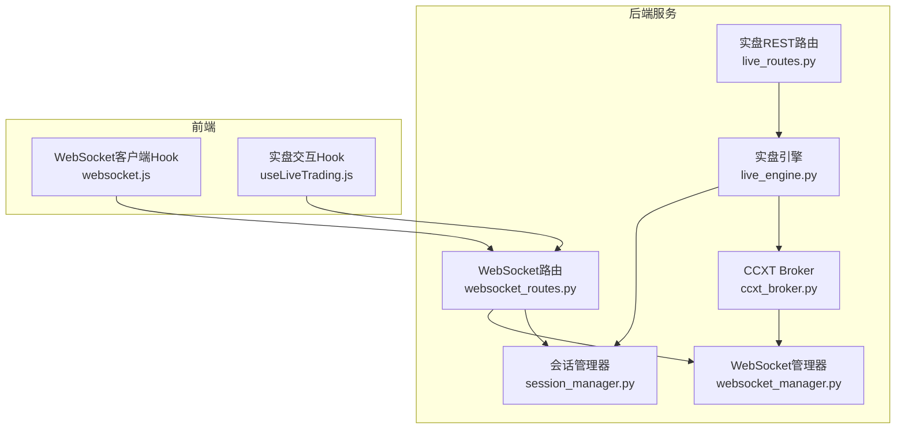
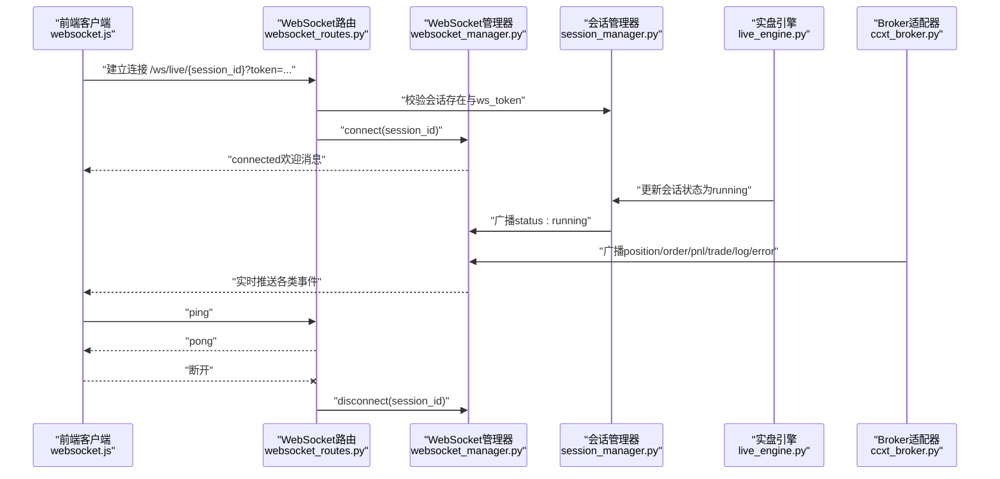
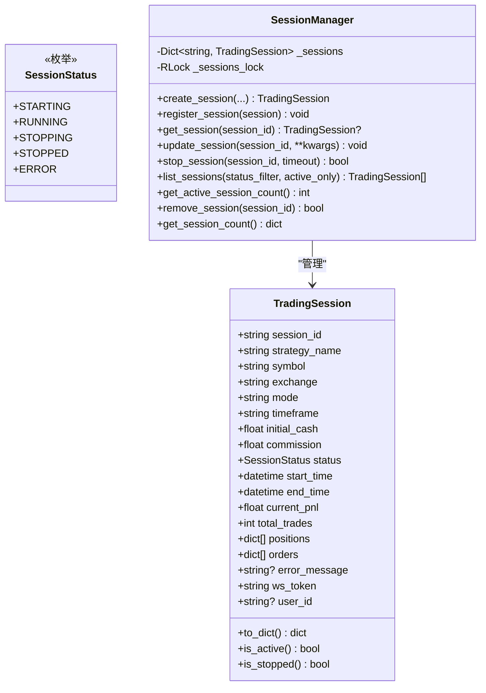
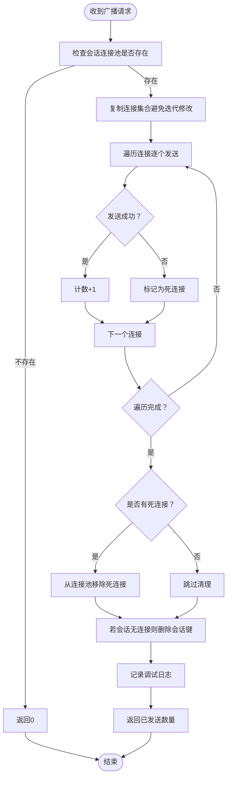
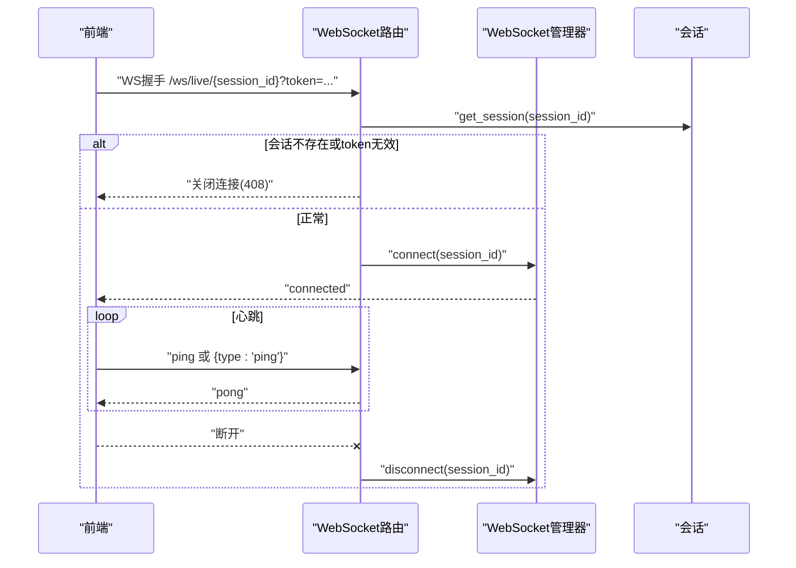
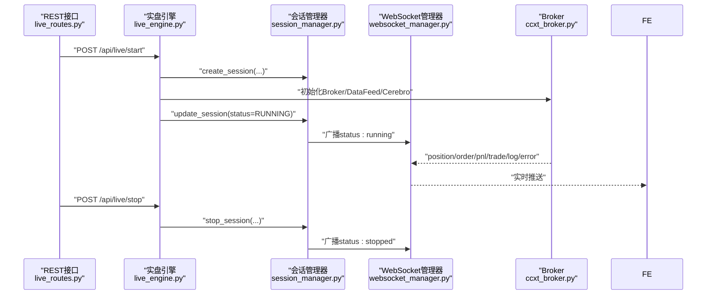
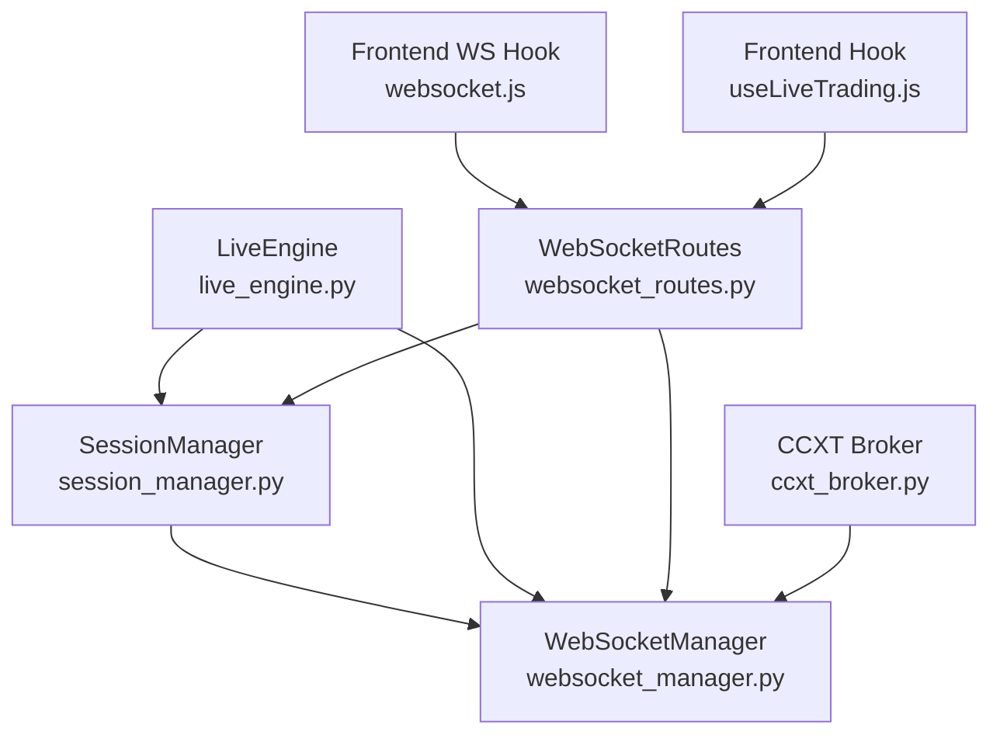

# 会话与WebSocket管理

<cite>
**本文引用的文件**
- [session_manager.py](file://backend/src/service/session_manager.py)
- [websocket_manager.py](file://backend/src/service/websocket_manager.py)
- [websocket_routes.py](file://backend/src/routes/websocket_routes.py)
- [live_engine.py](file://backend/src/service/live_engine.py)
- [live_routes.py](file://backend/src/routes/live_routes.py)
- [websocket.js](file://frontend/src/services/websocket.js)
- [useLiveTrading.js](file://frontend/src/hooks/useLiveTrading.js)
- [ccxt_broker.py](file://backend/src/brokers/ccxt_adapter/ccxt_broker.py)
</cite>

## 目录
1. [简介](#简介)
2. [项目结构](#项目结构)
3. [核心组件](#核心组件)
4. [架构总览](#架构总览)
5. [详细组件分析](#详细组件分析)
6. [依赖关系分析](#依赖关系分析)
7. [性能考量](#性能考量)
8. [故障排查指南](#故障排查指南)
9. [结论](#结论)
10. [附录：消息格式与最佳实践](#附录消息格式与最佳实践)

## 简介
本文件聚焦于后端会话管理器（SessionManager）与WebSocket管理器（WebSocketManager）的架构设计与协同工作机制。前者以单例模式集中管理多个实盘/回测会话的生命周期，后者基于观察者模式负责将会话事件（订单、P&L、交易、日志、状态等）实时推送到前端。二者通过会话ID关联，当会话状态或业务事件发生时，由会话管理器驱动WebSocket管理器进行广播，从而实现前后端的低延迟联动。

## 项目结构
围绕会话与WebSocket的关键模块分布如下：
- 后端服务层
  - 会话管理：backend/src/service/session_manager.py
  - WebSocket管理：backend/src/service/websocket_manager.py
  - 实盘引擎：backend/src/service/live_engine.py
  - WebSocket路由：backend/src/routes/websocket_routes.py
  - 实盘REST路由：backend/src/routes/live_routes.py
- 前端服务层
  - WebSocket客户端Hook：frontend/src/services/websocket.js
  - 实盘交互Hook：frontend/src/hooks/useLiveTrading.js
- 适配器
  - CCXT Broker：backend/src/brokers/ccxt_adapter/ccxt_broker.py

图表来源
- [session_manager.py](file://backend/src/service/session_manager.py#L1-L419)
- [websocket_manager.py](file://backend/src/service/websocket_manager.py#L1-L401)
- [websocket_routes.py](file://backend/src/routes/websocket_routes.py#L1-L243)
- [live_engine.py](file://backend/src/service/live_engine.py#L1-L338)
- [live_routes.py](file://backend/src/routes/live_routes.py#L1-L430)
- [websocket.js](file://frontend/src/services/websocket.js#L1-L287)
- [useLiveTrading.js](file://frontend/src/hooks/useLiveTrading.js#L1-L235)
- [ccxt_broker.py](file://backend/src/brokers/ccxt_adapter/ccxt_broker.py#L428-L462)

章节来源
- [session_manager.py](file://backend/src/service/session_manager.py#L1-L419)
- [websocket_manager.py](file://backend/src/service/websocket_manager.py#L1-L401)
- [websocket_routes.py](file://backend/src/routes/websocket_routes.py#L1-L243)
- [live_engine.py](file://backend/src/service/live_engine.py#L1-L338)
- [live_routes.py](file://backend/src/routes/live_routes.py#L1-L430)
- [websocket.js](file://frontend/src/services/websocket.js#L1-L287)
- [useLiveTrading.js](file://frontend/src/hooks/useLiveTrading.js#L1-L235)
- [ccxt_broker.py](file://backend/src/brokers/ccxt_adapter/ccxt_broker.py#L428-L462)

## 核心组件
- 会话管理器（SessionManager）
  - 单例模式：全局唯一实例，避免多实例导致的状态不一致
  - 线程安全：内部使用RLock保护会话字典；创建/更新/停止等操作均在锁内执行
  - 生命周期管理：创建、注册、查询、更新、停止、移除、统计
  - 会话模型（TradingSession）：封装会话配置、运行时状态、指标与认证令牌
- WebSocket管理器（WebSocketManager）
  - 观察者模式：按会话ID维护连接集合，统一广播
  - 并发安全：使用异步锁保护连接池；发送失败自动清理死连接
  - 事件广播：位置、订单、P&L、交易、日志、错误、状态变更等
- 实盘引擎（LiveEngine）
  - 与会话管理器集成：启动时创建会话并在线程中运行Cerebro
  - 状态变更：运行中、停止、异常时更新会话状态并持久化
- WebSocket路由（WebSocketRoutes）
  - 连接鉴权：校验会话存在性与ws_token
  - 心跳机制：支持ping/pong保活
  - 生命周期：连接建立、断开清理
- 前端WebSocket客户端（websocket.js）
  - 自动重连：指数退避或固定间隔重试
  - 心跳：定时发送ping，接收pong确认
  - 消息解析：按type分派到UI逻辑

章节来源
- [session_manager.py](file://backend/src/service/session_manager.py#L102-L419)
- [websocket_manager.py](file://backend/src/service/websocket_manager.py#L18-L401)
- [live_engine.py](file://backend/src/service/live_engine.py#L105-L338)
- [websocket_routes.py](file://backend/src/routes/websocket_routes.py#L21-L243)
- [websocket.js](file://frontend/src/services/websocket.js#L1-L287)

## 架构总览
会话管理器与WebSocket管理器通过“事件驱动”的方式协作：
- 会话状态变更（运行中、停止、异常）由会话管理器触发
- WebSocket管理器根据会话ID向该会话的所有连接广播状态变更
- 实盘引擎在业务事件（订单成交、仓位变化、P&L更新）发生时，调用WebSocket管理器进行广播
- 前端通过WebSocket路由订阅对应会话，接收实时推送

图表来源
- [websocket_routes.py](file://backend/src/routes/websocket_routes.py#L21-L218)
- [websocket_manager.py](file://backend/src/service/websocket_manager.py#L45-L148)
- [session_manager.py](file://backend/src/service/session_manager.py#L214-L301)
- [live_engine.py](file://backend/src/service/live_engine.py#L211-L266)
- [ccxt_broker.py](file://backend/src/brokers/ccxt_adapter/ccxt_broker.py#L428-L462)
- [websocket.js](file://frontend/src/services/websocket.js#L100-L170)

## 详细组件分析

### 会话管理器（SessionManager）
- 设计要点
  - 单例模式：双重检查锁保证线程安全的单例创建
  - 会话字典：以session_id为键，线程安全读写
  - 生命周期：STARTING/RUNNING/STOPPING/STOPPED/ERROR五态
  - 资源清理：停止会话时关闭store、等待线程退出、设置结束时间
- 关键方法
  - 创建/注册：create_session/register_session
  - 查询/更新：get_session/update_session
  - 停止/移除：stop_session/remove_session
  - 统计：list_sessions/get_session_count/get_active_session_count
- 线程安全
  - 所有对会话字典的操作均在RLock保护下执行
  - 停止流程包含超时控制，避免阻塞

图表来源
- [session_manager.py](file://backend/src/service/session_manager.py#L20-L101)
- [session_manager.py](file://backend/src/service/session_manager.py#L102-L419)

章节来源
- [session_manager.py](file://backend/src/service/session_manager.py#L102-L419)

### WebSocket管理器（WebSocketManager）
- 设计要点
  - 连接池：按会话ID维护WebSocket集合
  - 广播：复制连接集合，逐个发送，捕获异常并清理死连接
  - 事件类型：position/order/pnl/trade/log/error/status
  - 并发安全：异步锁保护连接池
- 关键方法
  - 连接/断开：connect/disconnect
  - 广播：broadcast以及各事件专用广播方法
  - 统计：get_connection_count/get_connected_sessions
- 错误处理
  - 发送失败记录警告并清理连接
  - 断开时若无连接则移除会话键

图表来源
- [websocket_manager.py](file://backend/src/service/websocket_manager.py#L91-L148)

章节来源
- [websocket_manager.py](file://backend/src/service/websocket_manager.py#L18-L401)

### WebSocket路由与鉴权、心跳
- 鉴权
  - 校验会话存在且ws_token匹配，否则关闭连接
- 心跳
  - 支持字符串"ping"与JSON对象{"type":"ping"}两种形式
  - 服务器统一响应{"type":"pong"}
- 生命周期
  - 连接建立发送"connected"欢迎消息
  - 断开清理连接池

图表来源
- [websocket_routes.py](file://backend/src/routes/websocket_routes.py#L21-L218)
- [websocket_manager.py](file://backend/src/service/websocket_manager.py#L45-L90)

章节来源
- [websocket_routes.py](file://backend/src/routes/websocket_routes.py#L21-L218)

### 实盘引擎与会话状态联动
- 启动流程
  - 通过SessionManager.create_session创建会话
  - 初始化Broker/DataFeed/Cerebro并在线程中运行
  - 运行中将状态更新为RUNNING并持久化
- 停止流程
  - 调用SessionManager.stop_session，关闭store、等待线程退出
  - 成功后更新状态为STOPPED并持久化
- 事件广播
  - 订单成交、仓位变化、P&L更新等由Broker侧触发WebSocketManager广播

图表来源
- [live_routes.py](file://backend/src/routes/live_routes.py#L102-L254)
- [live_engine.py](file://backend/src/service/live_engine.py#L105-L338)
- [session_manager.py](file://backend/src/service/session_manager.py#L197-L301)
- [websocket_manager.py](file://backend/src/service/websocket_manager.py#L284-L350)
- [ccxt_broker.py](file://backend/src/brokers/ccxt_adapter/ccxt_broker.py#L428-L462)

章节来源
- [live_engine.py](file://backend/src/service/live_engine.py#L105-L338)
- [live_routes.py](file://backend/src/routes/live_routes.py#L102-L254)
- [ccxt_broker.py](file://backend/src/brokers/ccxt_adapter/ccxt_broker.py#L428-L462)

## 依赖关系分析
- 会话管理器
  - 外部依赖：threading、logging、datetime、typing
  - 内部依赖：自身单例实例、会话字典、RLock
- WebSocket管理器
  - 外部依赖：asyncio、json、logging、FastAPI WebSocket
  - 内部依赖：连接池字典、异步锁
- 实盘引擎
  - 依赖会话管理器进行状态管理
  - 依赖Broker适配器进行数据与订单处理
- WebSocket路由
  - 依赖会话管理器进行鉴权
  - 依赖WebSocket管理器进行广播
- 前端
  - 依赖WebSocket路由进行连接与消息处理

图表来源
- [session_manager.py](file://backend/src/service/session_manager.py#L102-L419)
- [websocket_manager.py](file://backend/src/service/websocket_manager.py#L18-L401)
- [live_engine.py](file://backend/src/service/live_engine.py#L105-L338)
- [websocket_routes.py](file://backend/src/routes/websocket_routes.py#L21-L218)
- [websocket.js](file://frontend/src/services/websocket.js#L1-L287)
- [useLiveTrading.js](file://frontend/src/hooks/useLiveTrading.js#L1-L235)
- [ccxt_broker.py](file://backend/src/brokers/ccxt_adapter/ccxt_broker.py#L428-L462)

章节来源
- [session_manager.py](file://backend/src/service/session_manager.py#L102-L419)
- [websocket_manager.py](file://backend/src/service/websocket_manager.py#L18-L401)
- [live_engine.py](file://backend/src/service/live_engine.py#L105-L338)
- [websocket_routes.py](file://backend/src/routes/websocket_routes.py#L21-L218)
- [websocket.js](file://frontend/src/services/websocket.js#L1-L287)
- [useLiveTrading.js](file://frontend/src/hooks/useLiveTrading.js#L1-L235)
- [ccxt_broker.py](file://backend/src/brokers/ccxt_adapter/ccxt_broker.py#L428-L462)

## 性能考量
- 会话管理器
  - RLock保护下的O(1)字典访问，查询/更新复杂度低
  - 停止流程包含超时控制，避免长时间阻塞
- WebSocket管理器
  - 广播时复制连接集合，避免迭代期间修改
  - 发送失败立即清理死连接，降低后续广播成本
  - 异步锁减少并发竞争
- 实盘引擎
  - 在独立线程中运行Cerebro，避免阻塞主事件循环
  - 状态变更与持久化分离，减少IO阻塞影响
- 前端
  - 定时心跳与指数退避重连，降低网络抖动影响

[本节为通用指导，无需特定文件来源]

## 故障排查指南
- 连接失败
  - 检查会话是否存在与ws_token是否匹配
  - 查看WebSocket路由的日志输出
- 心跳失效
  - 确认前端定时发送ping，服务器返回pong
  - 若出现大量断开，检查网络质量与防火墙
- 广播失败
  - WebSocket管理器会清理死连接，确认连接池是否被清空
  - 检查消息格式是否符合规范
- 会话停止失败
  - 查看会话管理器的停止超时日志
  - 确认store.stop()是否正常执行
- 前端无消息
  - 确认会话ID正确且前端已携带token
  - 检查前端Hook的readyState与lastMessage

章节来源
- [websocket_routes.py](file://backend/src/routes/websocket_routes.py#L152-L218)
- [websocket_manager.py](file://backend/src/service/websocket_manager.py#L91-L148)
- [session_manager.py](file://backend/src/service/session_manager.py#L247-L301)
- [websocket.js](file://frontend/src/services/websocket.js#L100-L210)

## 结论
会话管理器与WebSocket管理器通过清晰的职责划分与事件驱动机制实现了高可用的实盘监控体系。会话管理器专注状态与资源管理，WebSocket管理器专注实时广播，二者通过会话ID解耦协作。前端通过心跳与重连保障了连接稳定性。整体设计具备良好的扩展性与可维护性。

[本节为总结，无需特定文件来源]

## 附录：消息格式与最佳实践

### WebSocket消息格式定义（JSON结构）
- 通用字段
  - type：消息类型（connected、position、order、pnl、trade、log、error、status、pong）
  - data：具体数据对象
- 事件类型与字段
  - connected
    - session_id：会话ID
    - message：连接提示信息
  - position
    - symbol：交易对
    - size：持仓数量
    - avg_price：平均入场价
    - current_price：当前价格
    - pnl：未实现盈亏
    - pnl_percent：未实现盈亏百分比
  - order
    - order_id：订单ID
    - symbol：交易对
    - side：方向（buy/sell）
    - size：委托数量
    - price：委托价格
    - status：状态（submitted/filled/canceled/rejected等）
    - filled_size：已成交数量
    - filled_price：平均成交价
  - pnl
    - current_pnl：当前P&L
    - total_pnl_percent：总收益百分比
    - cash：现金余额
    - portfolio_value：组合价值
  - trade
    - symbol：交易对
    - side：方向
    - size：成交数量
    - price：成交价格
    - commission：手续费
    - pnl：平仓时的收益（可为空）
  - log
    - level：日志级别（info/warning/error）
    - message：日志内容
    - timestamp：时间戳
  - error
    - message：错误描述
    - code：错误码（可选）
  - status
    - old_status：旧状态
    - new_status：新状态
  - pong
    - 仅用于心跳响应

章节来源
- [websocket_routes.py](file://backend/src/routes/websocket_routes.py#L35-L151)
- [websocket_manager.py](file://backend/src/service/websocket_manager.py#L150-L350)

### 事件类型分类
- 会话级事件
  - status：会话状态变更（starting/running/stopping/stopped/error）
- 业务级事件
  - position：持仓变化
  - order：订单状态变化
  - pnl：账户P&L变化
  - trade：成交回报
  - log：策略日志
  - error：错误通知

章节来源
- [websocket_manager.py](file://backend/src/service/websocket_manager.py#L28-L36)
- [websocket_routes.py](file://backend/src/routes/websocket_routes.py#L220-L242)

### 错误处理策略
- 连接鉴权失败
  - 关闭连接并返回408（会话不存在或token无效）
- 发送失败
  - 记录警告并清理死连接
- 停止超时
  - 返回False并记录告警，必要时强制清理
- 前端异常
  - 捕获JSON解析错误与网络异常，保持连接池一致性

章节来源
- [websocket_routes.py](file://backend/src/routes/websocket_routes.py#L152-L218)
- [websocket_manager.py](file://backend/src/service/websocket_manager.py#L91-L148)
- [session_manager.py](file://backend/src/service/session_manager.py#L247-L301)

### 连接鉴权、心跳与断线重连最佳实践
- 鉴权
  - 使用会话的ws_token作为连接参数，路由侧严格校验
- 心跳
  - 前端每30秒发送一次ping，服务器返回pong
  - 心跳失败应视为连接异常，准备重连
- 断线重连
  - 固定间隔或指数退避重试，最大重试次数建议5次
  - 重连成功后重新拉取最新状态
- 前端处理
  - 使用React Hook封装连接、消息处理与重连逻辑
  - 对不同类型消息进行差异化UI更新

章节来源
- [websocket_routes.py](file://backend/src/routes/websocket_routes.py#L140-L218)
- [websocket.js](file://frontend/src/services/websocket.js#L1-L287)
- [useLiveTrading.js](file://frontend/src/hooks/useLiveTrading.js#L1-L235)