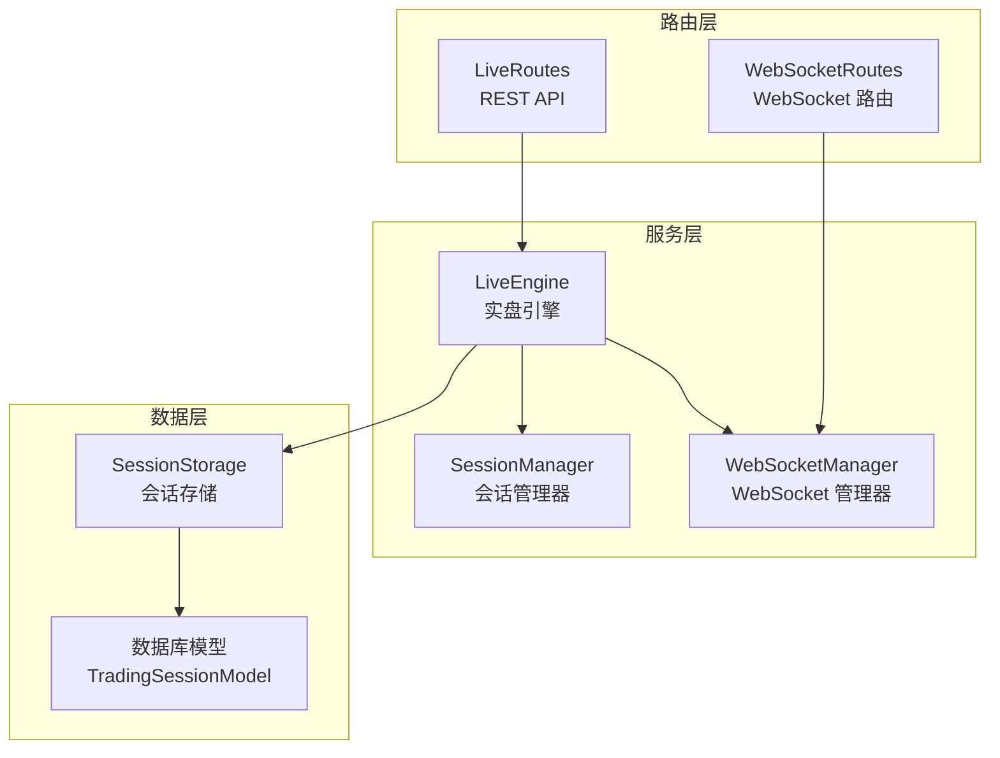
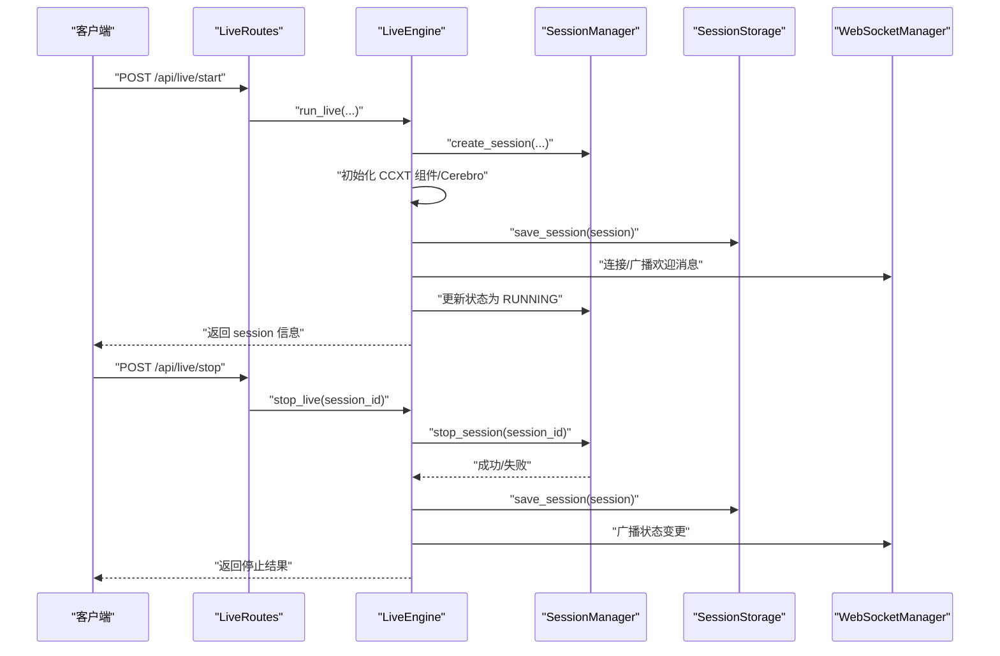
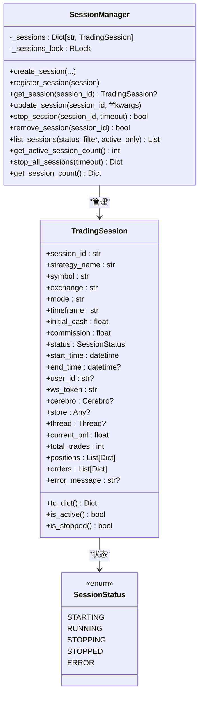
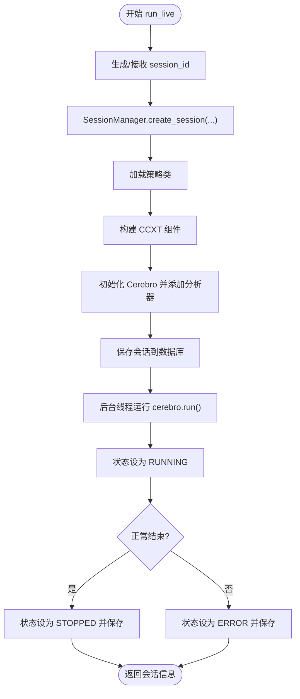
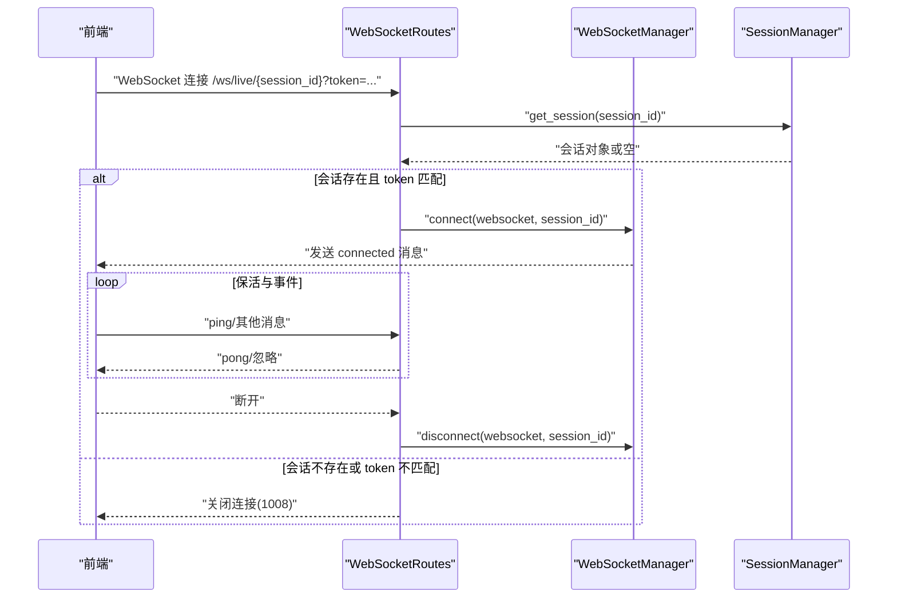
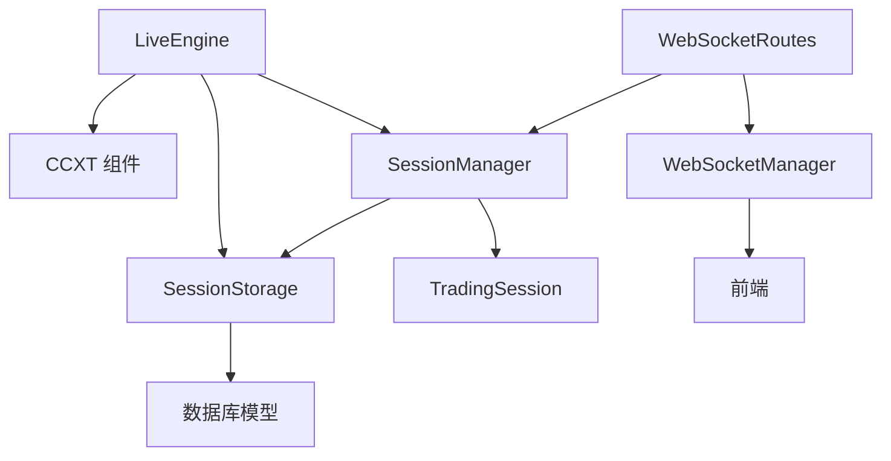

# 会话管理器

<cite>
**本文引用的文件**
- [session_manager.py](file://backend/src/service/session_manager.py)
- [live_engine.py](file://backend/src/service/live_engine.py)
- [websocket_manager.py](file://backend/src/service/websocket_manager.py)
- [websocket_routes.py](file://backend/src/routes/websocket_routes.py)
- [session_storage.py](file://backend/src/db/session_storage.py)
- [models.py](file://backend/src/db/models.py)
- [live_routes.py](file://backend/src/routes/live_routes.py)
- [test_session_manager.py](file://backend/tests/service/test_session_manager.py)
- [test_websocket_manager.py](file://backend/tests/service/test_websocket_manager.py)
</cite>

## 目录
1. [简介](#简介)
2. [项目结构](#项目结构)
3. [核心组件](#核心组件)
4. [架构总览](#架构总览)
5. [详细组件分析](#详细组件分析)
6. [依赖关系分析](#依赖关系分析)
7. [性能考量](#性能考量)
8. [故障排查指南](#故障排查指南)
9. [结论](#结论)
10. [附录](#附录)

## 简介
本文件深入剖析会话管理器（SessionManager）的架构设计与实现机制，重点覆盖：
- 单例模式的全局唯一实例与线程安全实现
- 交易会话（TradingSession）生命周期管理：创建、查询、更新、停止、移除
- TradingSession 数据类结构及其在实盘交易中的作用
- 状态机（SessionStatus）流转与异常处理
- 与实盘引擎（live_engine.py）和 WebSocket 管理器的交互关系
- 资源清理与持久化协调
- 高并发场景下的性能优化建议与常见问题排查（如会话卡在 STOPPING 状态）

## 项目结构
围绕会话管理器的关键模块与文件如下：
- 服务层：会话管理器、实盘引擎、WebSocket 管理器
- 数据层：会话持久化存储
- 路由层：REST API 与 WebSocket 路由
- 测试层：单元测试验证关键行为

图表来源
- [session_manager.py](file://backend/src/service/session_manager.py#L102-L419)
- [live_engine.py](file://backend/src/service/live_engine.py#L1-L338)
- [websocket_manager.py](file://backend/src/service/websocket_manager.py#L1-L401)
- [websocket_routes.py](file://backend/src/routes/websocket_routes.py#L1-L243)
- [session_storage.py](file://backend/src/db/session_storage.py#L1-L393)
- [models.py](file://backend/src/db/models.py#L41-L122)
- [live_routes.py](file://backend/src/routes/live_routes.py#L1-L200)

章节来源
- [session_manager.py](file://backend/src/service/session_manager.py#L1-L419)
- [live_engine.py](file://backend/src/service/live_engine.py#L1-L338)
- [websocket_manager.py](file://backend/src/service/websocket_manager.py#L1-L401)
- [websocket_routes.py](file://backend/src/routes/websocket_routes.py#L1-L243)
- [session_storage.py](file://backend/src/db/session_storage.py#L1-L393)
- [models.py](file://backend/src/db/models.py#L41-L122)
- [live_routes.py](file://backend/src/routes/live_routes.py#L1-L200)

## 核心组件
- 会话管理器（SessionManager）
  - 单例模式：确保全局唯一实例
  - 线程安全：使用 RLock 保护共享状态
  - 生命周期管理：创建、注册、查询、更新、停止、移除、统计
- 交易会话（TradingSession）
  - 数据类封装会话配置、运行时对象、状态与指标
  - 提供序列化接口 to_dict，用于 API 响应与持久化
- 实盘引擎（LiveEngine）
  - 启动/停止会话，协调 CCXT 组件与 Backtrader Cerebro
  - 与会话管理器协作更新状态并持久化
- WebSocket 管理器（WebSocketManager）
  - 维护每个会话的连接池，广播实时事件
  - 与 WebSocket 路由配合进行鉴权与连接管理
- 会话存储（SessionStorage）
  - 将 TradingSession 持久化到数据库，支持加载、列表、计数与删除

章节来源
- [session_manager.py](file://backend/src/service/session_manager.py#L102-L419)
- [live_engine.py](file://backend/src/service/live_engine.py#L1-L338)
- [websocket_manager.py](file://backend/src/service/websocket_manager.py#L1-L401)
- [session_storage.py](file://backend/src/db/session_storage.py#L1-L393)

## 架构总览
会话管理器作为中心枢纽，贯穿启动、运行、停止与持久化的全链路：
- REST API 触发 live_engine 创建会话
- live_engine 初始化 CCXT 组件与 Cerebro，并在线程中运行
- 会话状态在运行中被更新，最终保存到数据库
- WebSocket 管理器负责向前端推送实时事件

图表来源
- [live_routes.py](file://backend/src/routes/live_routes.py#L100-L200)
- [live_engine.py](file://backend/src/service/live_engine.py#L105-L338)
- [session_manager.py](file://backend/src/service/session_manager.py#L139-L301)
- [session_storage.py](file://backend/src/db/session_storage.py#L60-L124)
- [websocket_routes.py](file://backend/src/routes/websocket_routes.py#L152-L218)
- [websocket_manager.py](file://backend/src/service/websocket_manager.py#L45-L148)

## 详细组件分析

### 会话管理器（SessionManager）
- 单例模式
  - 使用双重检查锁（threading.Lock）保证线程安全的实例创建
  - 全局唯一实例通过工厂函数 get_session_manager 获取
- 线程安全
  - 内部字典 _sessions 使用 RLock 保护，避免并发读写冲突
  - 所有公共方法均在持有锁的情况下访问或修改会话集合
- 生命周期管理
  - create_session：校验重复、构造 TradingSession 并注册
  - register_session：直接注册已存在的会话对象
  - get_session：按 ID 查询会话
  - update_session：动态更新字段（仅存在属性才会设置）
  - stop_session：设置状态为 STOPPING，调用 store.stop()，等待线程结束，超时则返回失败；异常时置 ERROR 并记录错误
  - remove_session：从跟踪中移除，若仍处于活动状态发出警告
  - list_sessions/get_session_count：支持按状态过滤与统计
  - stop_all_sessions：批量停止活动会话
- 异常处理
  - 不存在会话时返回 False 或抛出异常
  - 停止超时返回 False，不强制中断线程
  - 发生异常时设置 ERROR 状态并记录错误信息

图表来源
- [session_manager.py](file://backend/src/service/session_manager.py#L102-L419)

章节来源
- [session_manager.py](file://backend/src/service/session_manager.py#L102-L419)
- [test_session_manager.py](file://backend/tests/service/test_session_manager.py#L1-L83)

### 交易会话（TradingSession）
- 字段说明
  - 基础配置：策略名、交易对、交易所、模式、时间框架、初始资金、手续费
  - 状态与时间：状态、开始时间、结束时间
  - 用户与认证：用户 ID、WebSocket 认证令牌
  - 运行时对象：Cerebro、Store、线程（非序列化）
  - 指标与追踪：当前 P&L、总交易数、持仓列表、订单列表、错误信息
- 序列化
  - to_dict 输出 API 友好的可序列化结构，包含开放订单过滤、时间格式化、用户 ID 等
- 活跃性判断
  - is_active/is_stopped 基于状态枚举快速判断

章节来源
- [session_manager.py](file://backend/src/service/session_manager.py#L29-L101)

### 实盘引擎（LiveEngine）
- 启动流程
  - 生成 session_id（可选），创建会话并注册到 SessionManager
  - 加载策略类，构建 CCXT 组件（Store/Broker/DataFeed）
  - 初始化 Cerebro，添加分析器，保存会话至数据库
  - 在后台线程中运行 cerebro.run()，期间更新状态为 RUNNING
  - 正常结束或异常时更新状态为 STOPPED/ERROR，并保存最终状态
- 停止流程
  - 通过 SessionManager.stop_session 停止指定会话
  - 成功后保存最终状态并返回结果
- 错误处理
  - 初始化失败时移除会话并抛出异常
  - 运行期异常捕获并记录，设置 ERROR 状态

图表来源
- [live_engine.py](file://backend/src/service/live_engine.py#L105-L275)

章节来源
- [live_engine.py](file://backend/src/service/live_engine.py#L105-L338)

### WebSocket 管理器与路由
- WebSocket 管理器
  - 维护 session_id 到连接集合的映射，支持连接/断开、广播、清理死连接
  - 广播多种事件类型：position、order、pnl、trade、log、error、status
- WebSocket 路由
  - /ws/live/{session_id}?token=... 连接鉴权：校验 session 存在与 ws_token 匹配
  - 支持 ping/pong 保活，收到未知消息记录告警
  - 断开时清理连接池

图表来源
- [websocket_routes.py](file://backend/src/routes/websocket_routes.py#L152-L218)
- [websocket_manager.py](file://backend/src/service/websocket_manager.py#L45-L148)
- [session_manager.py](file://backend/src/service/session_manager.py#L214-L226)

章节来源
- [websocket_manager.py](file://backend/src/service/websocket_manager.py#L1-L401)
- [websocket_routes.py](file://backend/src/routes/websocket_routes.py#L1-L243)
- [test_websocket_manager.py](file://backend/tests/service/test_websocket_manager.py#L1-L68)

### 会话持久化（SessionStorage）
- 保存会话：新增或更新 TradingSessionModel，同步状态、时间、指标与错误信息
- 加载会话：将数据库模型转换为 TradingSession 对象
- 列表与计数：支持按状态分页查询与统计
- 删除会话：按 session_id 删除记录

章节来源
- [session_storage.py](file://backend/src/db/session_storage.py#L60-L269)
- [models.py](file://backend/src/db/models.py#L41-L122)

## 依赖关系分析
- SessionManager 依赖
  - TradingSession 数据类
  - SessionStatus 枚举
  - 日志记录器
- LiveEngine 依赖
  - SessionManager（获取/更新状态）
  - SessionStorage（保存会话）
  - CCXT 组件（Store/Broker/DataFeed）
- WebSocketManager 依赖
  - FastAPI WebSocket
  - asyncio Lock 保护连接池
- WebSocketRoutes 依赖
  - WebSocketManager
  - SessionManager（鉴权）
- SessionStorage 依赖
  - 数据库模型（TradingSessionModel、SessionStatusEnum）
  - SQLAlchemy 会话

图表来源
- [session_manager.py](file://backend/src/service/session_manager.py#L102-L419)
- [live_engine.py](file://backend/src/service/live_engine.py#L1-L338)
- [websocket_manager.py](file://backend/src/service/websocket_manager.py#L1-L401)
- [websocket_routes.py](file://backend/src/routes/websocket_routes.py#L1-L243)
- [session_storage.py](file://backend/src/db/session_storage.py#L1-L393)
- [models.py](file://backend/src/db/models.py#L41-L122)

章节来源
- [session_manager.py](file://backend/src/service/session_manager.py#L102-L419)
- [live_engine.py](file://backend/src/service/live_engine.py#L1-L338)
- [websocket_manager.py](file://backend/src/service/websocket_manager.py#L1-L401)
- [websocket_routes.py](file://backend/src/routes/websocket_routes.py#L1-L243)
- [session_storage.py](file://backend/src/db/session_storage.py#L1-L393)
- [models.py](file://backend/src/db/models.py#L41-L122)

## 性能考量
- 线程安全与锁粒度
  - 使用 RLock 保护会话集合，避免频繁加锁导致的热点竞争
  - stop_session 中对线程 join 的超时控制，防止阻塞影响其他会话
- 并发场景建议
  - 控制同时启动的会话数量，避免 CCXT 连接与数据库压力过大
  - 合理设置超时参数，确保 stop_session 快速失败并释放资源
  - 对高频查询（如列表/统计）考虑缓存或分页限制
- I/O 与网络
  - WebSocket 广播采用异步，注意清理死连接，避免连接池膨胀
  - 数据库操作使用短事务与批量提交，减少锁持有时间

[本节为通用指导，无需特定文件来源]

## 故障排查指南
- 会话卡在 STOPPING 状态
  - 可能原因：线程未及时退出或 CCXT 组件未正确停止
  - 排查步骤：
    - 检查 stop_session 的超时参数是否过小
    - 确认 session.thread 是否存活，必要时手动中断
    - 查看 session.store 是否实现了 stop() 并正确关闭
    - 检查异常日志，确认是否抛出异常导致状态停留在 STOPPING
  - 参考实现位置
    - [session_manager.py](file://backend/src/service/session_manager.py#L247-L301)
- 会话无法停止
  - 可能原因：会话不存在或已停止
  - 排查步骤：
    - 使用 get_session 确认会话存在
    - 检查 is_stopped 判断逻辑
    - 若线程阻塞，适当增大超时或强制清理
  - 参考实现位置
    - [session_manager.py](file://backend/src/service/session_manager.py#L214-L226)
    - [session_manager.py](file://backend/src/service/session_manager.py#L261-L293)
- WebSocket 连接失败
  - 可能原因：session 不存在或 ws_token 不匹配
  - 排查步骤：
    - 确认 /api/live/start 返回的 ws_token
    - 检查 /ws/live/{session_id}?token=... 参数
    - 查看 WebSocketRoutes 的鉴权逻辑
  - 参考实现位置
    - [websocket_routes.py](file://backend/src/routes/websocket_routes.py#L152-L169)
- 数据持久化异常
  - 可能原因：数据库连接或事务异常
  - 排查步骤：
    - 检查 save_session/load_session 的异常分支
    - 确认数据库 URL 与连接池配置
  - 参考实现位置
    - [session_storage.py](file://backend/src/db/session_storage.py#L60-L124)
    - [session_storage.py](file://backend/src/db/session_storage.py#L125-L173)

章节来源
- [session_manager.py](file://backend/src/service/session_manager.py#L247-L301)
- [websocket_routes.py](file://backend/src/routes/websocket_routes.py#L152-L169)
- [session_storage.py](file://backend/src/db/session_storage.py#L60-L124)

## 结论
会话管理器以单例模式与细粒度锁保障了多会话并发场景下的稳定性，结合实盘引擎与 WebSocket 管理器形成了完整的生命周期闭环。通过 TradingSession 数据类与 SessionStorage 的协同，实现了状态的可视化与持久化。针对高并发与异常场景，建议合理设置超时、控制并发量、优化锁粒度与清理策略，以提升整体性能与可靠性。

[本节为总结性内容，无需特定文件来源]

## 附录
- 关键 API 与方法路径
  - 创建会话：[create_session](file://backend/src/service/session_manager.py#L139-L195)
  - 查询会话：[get_session](file://backend/src/service/session_manager.py#L214-L226)
  - 更新会话：[update_session](file://backend/src/service/session_manager.py#L227-L246)
  - 停止会话：[stop_session](file://backend/src/service/session_manager.py#L247-L301)
  - 移除会话：[remove_session](file://backend/src/service/session_manager.py#L332-L359)
  - 启动会话（引擎）：[run_live](file://backend/src/service/live_engine.py#L105-L275)
  - 停止会话（引擎）：[stop_live](file://backend/src/service/live_engine.py#L277-L314)
  - WebSocket 连接与鉴权：[/ws/live/{session_id}](file://backend/src/routes/websocket_routes.py#L152-L218)
  - 会话持久化：[save_session](file://backend/src/db/session_storage.py#L60-L124)

[本节为索引性内容，无需特定文件来源]