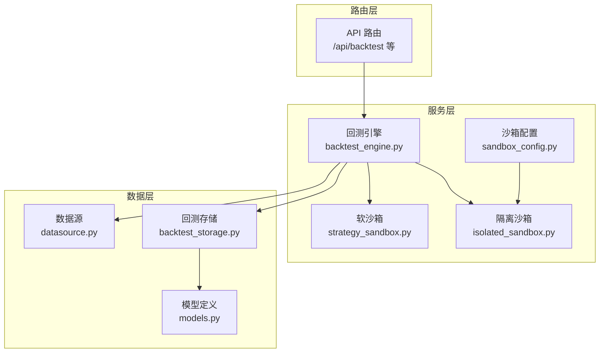
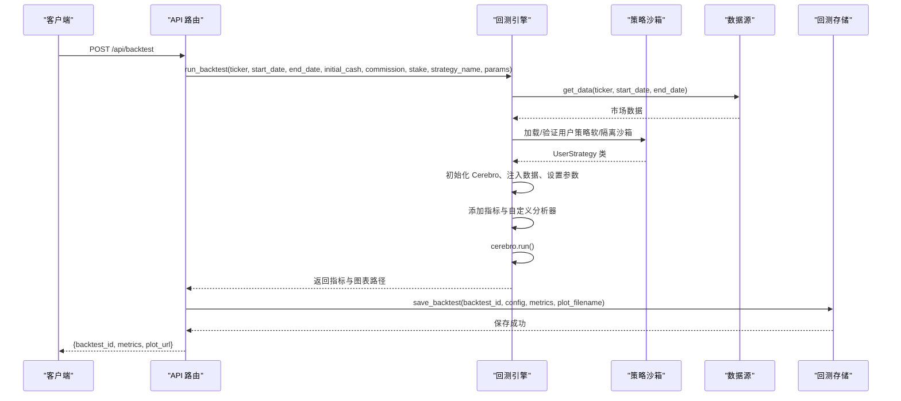
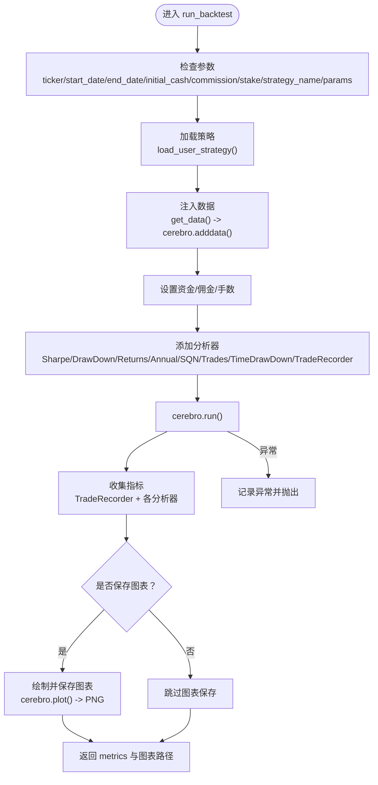
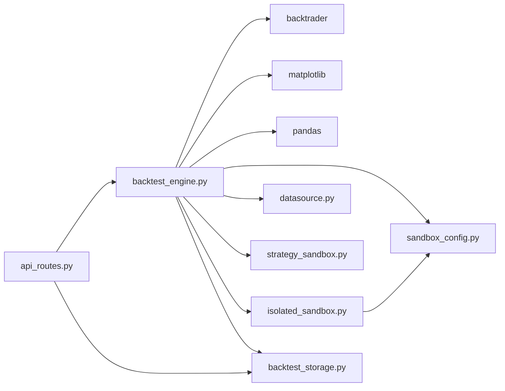

# 回测引擎

<cite>
**本文引用的文件列表**
- [backend/src/service/backtest_engine.py](file://backend/src/service/backtest_engine.py)
- [backend/src/service/strategy_sandbox.py](file://backend/src/service/strategy_sandbox.py)
- [backend/src/service/isolated_sandbox.py](file://backend/src/service/isolated_sandbox.py)
- [backend/src/config/sandbox_config.py](file://backend/src/config/sandbox_config.py)
- [backend/src/db/backtest_storage.py](file://backend/src/db/backtest_storage.py)
- [backend/src/db/models.py](file://backend/src/db/models.py)
- [backend/src/routes/api_routes.py](file://backend/src/routes/api_routes.py)
- [backend/tests/service/test_backtest_engine.py](file://backend/tests/service/test_backtest_engine.py)
- [backend/tests/service/test_strategy_sandbox.py](file://backend/tests/service/test_strategy_sandbox.py)
- [backend/resources/strategy/breakout.py](file://backend/resources/strategy/breakout.py)
</cite>

## 目录
1. [简介](#简介)
2. [项目结构](#项目结构)
3. [核心组件](#核心组件)
4. [架构总览](#架构总览)
5. [详细组件分析](#详细组件分析)
6. [依赖关系分析](#依赖关系分析)
7. [性能考量](#性能考量)
8. [故障排查指南](#故障排查指南)
9. [结论](#结论)
10. [附录](#附录)

## 简介
本文件围绕回测引擎（backtest_engine.py）的设计与实现进行深入剖析，覆盖以下关键主题：
- 如何加载用户策略、初始化 Backtrader 的 Cerebro 引擎、注入市场数据并执行回测流程
- 与 strategy_sandbox 模块的集成机制，确保用户策略在隔离环境中安全执行
- 回测参数的解析与校验逻辑（时间范围、初始资金、佣金设置等）
- 回测结果生成过程（性能指标计算、交易记录汇总、图表路径生成）
- 结果通过 backtest_storage 进行持久化
- 典型调用示例与 API 使用方式
- 关键方法 run_backtest() 的实现细节（异常处理、资源释放、日志记录）
- 常见问题排查（策略未触发、数据加载失败等）

## 项目结构
回测引擎位于后端服务层，与路由层、数据库层、沙箱配置与执行模块协同工作。整体结构如下图所示：

图表来源
- [backend/src/routes/api_routes.py](file://backend/src/routes/api_routes.py#L1-L507)
- [backend/src/service/backtest_engine.py](file://backend/src/service/backtest_engine.py#L1-L400)
- [backend/src/service/strategy_sandbox.py](file://backend/src/service/strategy_sandbox.py#L1-L213)
- [backend/src/service/isolated_sandbox.py](file://backend/src/service/isolated_sandbox.py#L1-L393)
- [backend/src/config/sandbox_config.py](file://backend/src/config/sandbox_config.py#L1-L115)
- [backend/src/db/backtest_storage.py](file://backend/src/db/backtest_storage.py#L1-L446)
- [backend/src/db/models.py](file://backend/src/db/models.py#L282-L345)

章节来源
- [backend/src/routes/api_routes.py](file://backend/src/routes/api_routes.py#L1-L507)
- [backend/src/service/backtest_engine.py](file://backend/src/service/backtest_engine.py#L1-L400)

## 核心组件
- 回测引擎（backtest_engine.py）
  - 提供 run_backtest() 主流程，负责策略加载、数据注入、Cerebro 初始化、指标计算、图表生成与返回
  - 提供策略参数提取、策略文件读写、策略名清洗与路径构造等辅助能力
- 策略沙箱（strategy_sandbox.py）
  - 软沙箱：限制导入与内置函数，不适用于不可信代码
  - 用于“软模式”下的策略加载与执行
- 隔离沙箱（isolated_sandbox.py）
  - 子进程隔离执行策略，支持超时、内存限制、网络与文件写入控制
  - 用于“子进程模式”的安全策略加载与验证
- 沙箱配置（sandbox_config.py）
  - 从环境变量读取沙箱模式与资源限制参数
- 回测存储（backtest_storage.py）
  - 将回测配置、指标、图表文件名、AI分析、策略代码快照持久化至数据库
- 路由层（api_routes.py）
  - 对外暴露 /api/backtest 等接口，封装请求参数、调用回测引擎并保存历史记录

章节来源
- [backend/src/service/backtest_engine.py](file://backend/src/service/backtest_engine.py#L1-L400)
- [backend/src/service/strategy_sandbox.py](file://backend/src/service/strategy_sandbox.py#L1-L213)
- [backend/src/service/isolated_sandbox.py](file://backend/src/service/isolated_sandbox.py#L1-L393)
- [backend/src/config/sandbox_config.py](file://backend/src/config/sandbox_config.py#L1-L115)
- [backend/src/db/backtest_storage.py](file://backend/src/db/backtest_storage.py#L1-L446)
- [backend/src/routes/api_routes.py](file://backend/src/routes/api_routes.py#L1-L507)

## 架构总览
回测引擎的调用链路如下：

图表来源
- [backend/src/routes/api_routes.py](file://backend/src/routes/api_routes.py#L215-L296)
- [backend/src/service/backtest_engine.py](file://backend/src/service/backtest_engine.py#L302-L384)
- [backend/src/db/backtest_storage.py](file://backend/src/db/backtest_storage.py#L37-L117)

## 详细组件分析

### 回测引擎（backtest_engine.py）
- 策略加载与安全执行
  - load_user_strategy(name)：根据策略名定位文件，读取源码；依据沙箱配置选择软沙箱或隔离沙箱执行；校验 UserStrategy 是否继承自 bt.Strategy
  - 软沙箱：execute_strategy_code(source, ...)，构建受限的 builtins 与允许导入集合，执行策略代码并返回 globals
  - 隔离沙箱：IsolatedSandbox.execute_strategy(source, ...)，通过子进程执行策略，支持超时、内存限制、网络与文件写入控制
- 参数解析与校验
  - run_backtest() 接收 ticker、start_date、end_date、initial_cash、commission、stake、strategy_name、params 等参数；若未指定策略名，则自动选择可用策略中的第一个
  - 对 params 字典进行透传给 cerebro.addstrategy()，否则使用策略默认参数
- 数据注入与回测执行
  - get_data(ticker, start_date, end_date) 注入到 cerebro.adddata()
  - 设置初始资金、佣金、固定手数
  - 添加多个分析器：SharpeRatio、DrawDown、Returns、AnnualReturn、SQN、TradeAnalyzer、TimeDrawDown、自定义 TradeRecorder
  - 执行 cerebro.run() 并收集指标
- 结果生成与图表输出
  - 从 TradeRecorder 获取交易明细与汇总
  - 从各分析器获取指标并组装 metrics
  - 可选保存图表：cerebro.plot(style="candlestick", iplot=False)，保存为 PNG 文件，路径写入返回结果
- 异常处理与日志
  - run_backtest() 内捕获 cerebro.run() 异常并记录日志
  - 图表渲染失败时抛出 RuntimeError 并记录日志
  - 资源释放：关闭 matplotlib 图形句柄，避免内存泄漏

图表来源
- [backend/src/service/backtest_engine.py](file://backend/src/service/backtest_engine.py#L302-L384)

章节来源
- [backend/src/service/backtest_engine.py](file://backend/src/service/backtest_engine.py#L1-L400)

### 策略沙箱（strategy_sandbox.py）
- 软沙箱执行流程
  - 构建受限的 builtins 与允许导入集合（仅允许 backtrader、pandas、numpy 等白名单模块）
  - 自定义 __import__，拦截不允许的模块导入与相对导入
  - 编译并执行策略源码，返回 globals，供后续获取 UserStrategy 类
- 安全约束
  - 阻止 open、os 等危险内置函数
  - 阻止相对导入
  - 捕获语法错误与执行异常并包装为 StrategySandboxError

章节来源
- [backend/src/service/strategy_sandbox.py](file://backend/src/service/strategy_sandbox.py#L1-L213)

### 隔离沙箱（isolated_sandbox.py）
- 子进程隔离执行
  - 通过 strategy_executor.py 在独立进程中执行策略代码
  - 支持超时、内存限制、网络与文件写入开关
  - 统一封装 SandboxError、SandboxTimeoutError、SandboxMemoryError、SandboxExecutionError
- 验证与执行
  - validate_strategy(source)：仅验证策略合法性
  - execute_strategy(source, module_name, filename)：执行策略并返回可序列化结果

章节来源
- [backend/src/service/isolated_sandbox.py](file://backend/src/service/isolated_sandbox.py#L1-L393)

### 沙箱配置（sandbox_config.py）
- 从环境变量读取配置项：SANDBOX_MODE、SANDBOX_TIMEOUT_SECONDS、SANDBOX_MAX_MEMORY_MB、SANDBOX_ALLOW_NETWORK、SANDBOX_ALLOW_FILE_WRITE 等
- 提供全局单例配置对象，供隔离沙箱与策略加载使用

章节来源
- [backend/src/config/sandbox_config.py](file://backend/src/config/sandbox_config.py#L1-L115)

### 回测存储（backtest_storage.py）
- 持久化字段
  - backtest_id、ticker、start_date、end_date、initial_cash、commission、stake、strategy_name、created_at
  - denormalized 指标：final_value、total_return、sharpe_ratio、max_drawdown、total_trades、winning_trades、losing_trades
  - metrics（完整指标 JSON）、ai_analysis（AI 分析 JSON）、strategy_code（策略代码快照）、plot_filename（图表文件名）、params（策略参数覆盖）
- 自动清理
  - 保留最近 100 条记录，删除旧记录并清理对应图片文件
  - 清理损坏 JSON 的记录
- 查询与更新
  - list_backtests()/get_backtest()/delete_backtest()/update_ai_analysis()

章节来源
- [backend/src/db/backtest_storage.py](file://backend/src/db/backtest_storage.py#L1-L446)
- [backend/src/db/models.py](file://backend/src/db/models.py#L282-L345)

### 路由层（api_routes.py）
- /api/backtest
  - 解析请求体参数，生成 backtest_id 与图片文件名
  - 调用 run_backtest() 执行回测，返回 backtest_id、metrics、plot_url
  - 异步保存到 backtest_storage，非阻塞且失败仅记录日志
- /api/backtest/history、/api/backtest/history/{backtest_id}、/api/backtest/history/{backtest_id}/ai-analysis
  - 列表查询、详情查询、删除记录、更新 AI 分析

章节来源
- [backend/src/routes/api_routes.py](file://backend/src/routes/api_routes.py#L1-L507)

## 依赖关系分析
- backtest_engine.py
  - 依赖 backtrader、matplotlib、pandas
  - 依赖 sandbox_config.get_config() 获取沙箱配置
  - 依赖 datasource.get_bt_feed/get_raw_data_json 注入数据
  - 依赖 strategy_sandbox.execute_strategy_code 与 isolated_sandbox.IsolatedSandbox
  - 依赖 backtest_storage.BacktestStorage.save_backtest
- isolated_sandbox.py
  - 依赖 sandbox_config.SandboxConfig
  - 依赖 strategy_executor.py（子进程执行脚本）
- api_routes.py
  - 依赖 backtest_engine.run_backtest、get_user_strategy_code、save_user_strategy_code、list_strategies、extract_strategy_params
  - 依赖 backtest_storage.BacktestStorage

图表来源
- [backend/src/service/backtest_engine.py](file://backend/src/service/backtest_engine.py#L1-L400)
- [backend/src/service/isolated_sandbox.py](file://backend/src/service/isolated_sandbox.py#L1-L393)
- [backend/src/routes/api_routes.py](file://backend/src/routes/api_routes.py#L1-L507)

## 性能考量
- 图表渲染
  - 使用 matplotlib Agg 后端与 plt.ioff() 避免弹窗与阻塞
  - 显式关闭图形句柄与 plt.close("all")，防止内存泄漏
- 沙箱模式选择
  - 子进程模式提供更强的安全性，但存在进程启动与通信开销；软模式执行更快但不适用于不可信代码
- 数据加载
  - 数据源缓存与索引有助于减少重复 IO；回测历史查询支持分页与排序，避免一次性加载过多数据
- 指标计算
  - Backtrader 内置分析器已高度优化；自定义 TradeRecorder 在订单回调中累积交易明细，注意避免在高频交易中过度频繁的字典操作

[本节为通用指导，无需列出具体文件来源]

## 故障排查指南
- 策略未触发
  - 检查策略文件是否存在与命名是否合法（仅允许字母、数字、连字符、下划线，且不包含路径遍历）
  - 确认策略类名为 UserStrategy 且继承自 bt.Strategy
  - 若使用隔离沙箱，确认策略未触发超时或内存限制
  - 参考测试用例：策略文件读写与加载断言
- 数据加载失败
  - 确认 ticker 符号有效且在数据源中可获取
  - 检查日期范围是否正确（start_date <= end_date），以及数据源可用性
- 图表渲染失败
  - 检查 matplotlib 后端与权限；确认保存路径存在且可写
  - 若出现 RuntimeError，查看日志中异常堆栈
- 回测异常
  - run_backtest() 捕获 cerebro.run() 异常并记录日志，检查日志输出定位问题
- 沙箱相关错误
  - 软沙箱：相对导入、非法模块导入、缺失内置函数会被拒绝
  - 隔离沙箱：超时、内存不足、执行失败会抛出相应异常类型

章节来源
- [backend/tests/service/test_backtest_engine.py](file://backend/tests/service/test_backtest_engine.py#L1-L35)
- [backend/tests/service/test_strategy_sandbox.py](file://backend/tests/service/test_strategy_sandbox.py#L1-L39)
- [backend/src/service/backtest_engine.py](file://backend/src/service/backtest_engine.py#L302-L384)
- [backend/src/service/strategy_sandbox.py](file://backend/src/service/strategy_sandbox.py#L1-L213)
- [backend/src/service/isolated_sandbox.py](file://backend/src/service/isolated_sandbox.py#L1-L393)

## 结论
回测引擎通过清晰的职责划分与安全沙箱机制，实现了从策略加载、数据注入、指标计算到结果持久化的完整闭环。路由层统一对外提供 REST API，回测存储层保证历史数据的可追溯与可查询。隔离沙箱与软沙箱的双模式设计兼顾了性能与安全性。通过完善的异常处理与日志记录，系统具备良好的可观测性与可维护性。

[本节为总结性内容，无需列出具体文件来源]

## 附录

### API 使用示例（基于路由层）
- 回测请求体字段
  - ticker: 交易标的符号
  - start_date: 开始日期（YYYY-MM-DD）
  - end_date: 结束日期（YYYY-MM-DD）
  - initial_cash: 初始资金
  - commission: 佣金费率
  - stake: 固定手数
  - strategy_name: 策略名称（可选）
  - params: 策略参数覆盖（可选）
- 返回字段
  - backtest_id: 回测唯一标识
  - metrics: 指标字典（包含最终资产、夏普比率、最大回撤、年化收益、SQN、交易统计、时间回撤、交易明细等）
  - plot_url: 图表访问路径

章节来源
- [backend/src/routes/api_routes.py](file://backend/src/routes/api_routes.py#L41-L50)

### 关键方法实现要点（run_backtest）
- 参数校验与默认值
  - 若未提供 strategy_name，自动选择可用策略中的第一个
  - params 为空时使用策略默认参数，否则透传覆盖
- 数据注入与引擎配置
  - 设置初始资金、佣金、固定手数
  - 注入市场数据 feed
- 指标与分析器
  - 添加 SharpeRatio、DrawDown、Returns、AnnualReturn、SQN、TradeAnalyzer、TimeDrawDown、自定义 TradeRecorder
- 执行与结果
  - cerebro.run() 返回结果后，从 TradeRecorder 获取交易明细与汇总
  - 组装 metrics 字典并可选保存图表
- 异常处理与日志
  - run_backtest() 捕获 cerebro.run() 异常并记录日志
  - 图表渲染失败抛出 RuntimeError 并记录日志
  - 资源释放：关闭图形句柄与 matplotlib

章节来源
- [backend/src/service/backtest_engine.py](file://backend/src/service/backtest_engine.py#L302-L384)

### 策略示例参考
- 示例策略文件展示了 UserStrategy 的基本结构与参数定义，可用于理解策略参数提取与运行流程

章节来源
- [backend/resources/strategy/breakout.py](file://backend/resources/strategy/breakout.py#L1-L32)