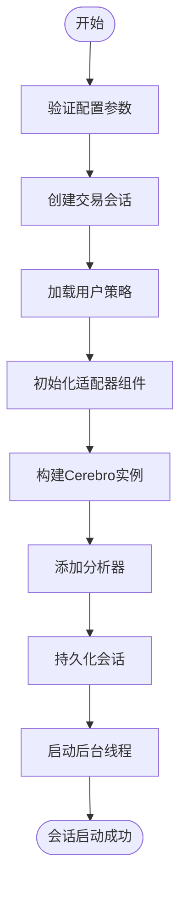
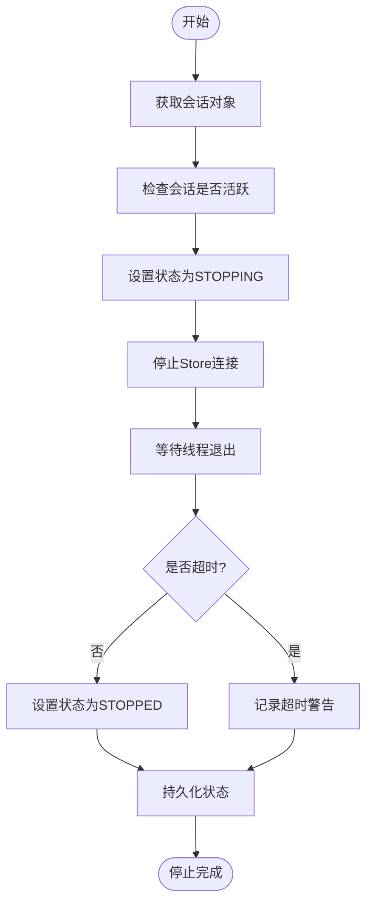
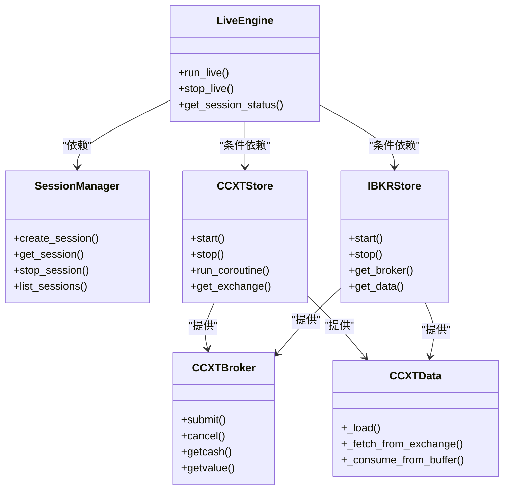

# 实盘交易引擎

<cite>
**本文档引用的文件**  
- [live_engine.py](file://backend/src/service/live_engine.py)
- [session_manager.py](file://backend/src/service/session_manager.py)
- [live_routes.py](file://backend/src/routes/live_routes.py)
- [ccxt_store.py](file://backend/src/brokers/ccxt_adapter/ccxt_store.py)
- [ccxt_broker.py](file://backend/src/brokers/ccxt_adapter/ccxt_broker.py)
- [ccxt_data.py](file://backend/src/brokers/ccxt_adapter/ccxt_data.py)
- [ibkr_store.py](file://backend/src/brokers/ibkr_adapter/ibkr_store.py)
</cite>

## 目录
1. [简介](#简介)
2. [核心组件](#核心组件)
3. [会话生命周期管理](#会话生命周期管理)
4. [会话启动与停止流程](#会话启动与停止流程)
5. [适配器统一抽象层设计](#适配器统一抽象层设计)
6. [错误恢复与重连机制](#错误恢复与重连机制)
7. [性能监控与风控建议](#性能监控与风控建议)
8. [常见连接问题解决方案](#常见连接问题解决方案)

## 简介

实盘交易引擎是系统中负责执行真实市场交易的核心模块，它通过集成Backtrader框架与外部交易所API，实现了策略自动化执行。该引擎支持纸面交易（paper trading）和实盘交易（live trading）两种模式，并通过统一的适配器层兼容CCXT和IBKR两大主流交易平台。

引擎的核心职责包括：根据用户配置创建交易会话、加载指定策略、连接真实交易所进行订单执行、同步持仓与实时行情、管理会话生命周期等。整个流程由`live_engine.py`驱动，与`session_manager.py`协同工作，确保多会话并发下的状态一致性与资源隔离。

**Section sources**
- [live_engine.py](file://backend/src/service/live_engine.py#L1-L338)
- [session_manager.py](file://backend/src/service/session_manager.py#L1-L419)

## 核心组件

实盘交易引擎由多个核心组件构成，各司其职，协同完成交易任务。

### 交易会话管理器（SessionManager）

`SessionManager`是一个单例类，负责全局管理所有交易会话的生命周期。它提供会话的创建、查询、更新、停止和移除功能，并通过线程锁保证操作的原子性。每个会话状态变更都会被持久化到数据库，确保系统重启后可恢复。

会话状态机包含五种状态：`STARTING`（启动中）、`RUNNING`（运行中）、`STOPPING`（停止中）、`STOPPED`（已停止）和`ERROR`（出错）。通过`get_active_session_count()`和`list_sessions()`等方法，可以实时监控系统负载和会话分布。

**Section sources**
- [session_manager.py](file://backend/src/service/session_manager.py#L102-L419)

### 交易会话（TradingSession）

`TradingSession`数据类封装了一个完整的交易实例，包含策略名称、交易对、交易所、时间周期、初始资金、佣金率等配置信息，以及运行时的Cerebro实例、Store连接、线程句柄等对象。会话还跟踪当前盈亏、总交易数、持仓和订单列表等动态指标。

会话通过`to_dict()`方法序列化为API响应，其中包含WebSocket认证令牌（`ws_token`），用于前端实时数据推送的身份验证。

**Section sources**
- [session_manager.py](file://backend/src/service/session_manager.py#L29-L100)

### 实盘交易引擎（LiveTradingEngine）

`live_engine.py`是实盘交易的主控模块，提供了`run_live()`、`stop_live()`和`get_session_status()`三个核心接口。`run_live()`函数负责初始化会话、加载策略、构建交易组件并启动Cerebro循环；`stop_live()`则用于优雅地终止会话。

引擎通过`_build_components()`函数根据交易所配置动态选择适配器（CCXT或IBKR），实现多平台兼容性。所有运行时异常均被捕获并记录，确保系统稳定性。

**Section sources**
- [live_engine.py](file://backend/src/service/live_engine.py#L50-L338)

## 会话生命周期管理

会话的生命周期由`SessionManager`严格管理，从创建到销毁经历多个阶段。

### 会话创建流程

当用户发起启动请求时，`live_routes.py`中的`start_live_trading()`接口被调用。该接口首先验证配置参数，然后调用`run_live()`函数。在`run_live()`中，系统执行以下步骤：

1. 生成唯一会话ID（UUID）
2. 通过`session_manager.create_session()`注册新会话
3. 加载用户策略类
4. 根据交易所配置初始化适配器组件
5. 构建Cerebro实例并添加策略、数据源和经纪人
6. 添加分析器（如夏普比率、回撤、收益等）
7. 将Cerebro和Store实例存入会话对象
8. 持久化会话到数据库
9. 在后台线程启动Cerebro循环

**Diagram sources**
- [live_engine.py](file://backend/src/service/live_engine.py#L141-L266)
- [session_manager.py](file://backend/src/service/session_manager.py#L139-L196)

### 会话停止流程

会话停止通过`stop_live()`函数触发，其流程如下：

1. 调用`session_manager.stop_session()`请求停止
2. 将会话状态置为`STOPPING`
3. 调用Store的`stop()`方法关闭交易所连接
4. 等待后台线程安全退出（带超时）
5. 更新会话状态为`STOPPED`或`ERROR`
6. 持久化最终状态

若线程未能在指定超时内退出，系统将记录警告并返回失败状态，但不会强制终止线程，以避免资源泄漏。

**Diagram sources**
- [live_engine.py](file://backend/src/service/live_engine.py#L277-L313)
- [session_manager.py](file://backend/src/service/session_manager.py#L247-L301)

## 会话启动与停止流程

### 启动流程详解

会话启动是一个多阶段的异步过程。首先，API路由接收HTTP请求并进行参数校验。随后，`run_live()`函数在后台线程中执行Cerebro的`run()`方法。此方法会持续轮询数据源，当新K线形成时触发策略的`next()`逻辑，进而可能生成订单。

订单提交后，由适配器经纪人（如`CCXTBroker`）负责将其发送至交易所，并在每个`next()`周期检查订单状态，处理成交、取消等事件。所有状态变更均通过WebSocket广播至前端，实现低延迟的用户体验。

### 停止流程详解

停止流程强调优雅退出。系统首先尝试通过`session_manager.stop_session()`协调停止。该方法会先调用Store的`stop()`方法断开网络连接，然后等待Cerebro线程自然结束。在此期间，任何新订单将被拒绝，未成交订单可选择性取消。

若用户配置了“停止时平仓”选项，系统会在断开连接前尝试关闭所有持仓。但由于市场波动和网络延迟，无法保证100%执行成功，因此建议用户在高风险策略中手动管理头寸。

**Section sources**
- [live_engine.py](file://backend/src/service/live_engine.py#L211-L256)
- [session_manager.py](file://backend/src/service/session_manager.py#L272-L293)

## 适配器统一抽象层设计

为支持多交易所平台，系统设计了统一的适配器抽象层，目前支持CCXT和IBKR两大平台。

### CCXT适配器

CCXT适配器由`CCXTStore`、`CCXTBroker`和`CCXTData`三个类组成：

- **CCXTStore**：作为中心连接管理器，负责维护CCXT交易所实例和异步事件循环。它通过`run_coroutine()`方法桥接异步CCXT调用与同步Backtrader框架。
- **CCXTBroker**：实现`bt.BrokerBase`接口，处理订单提交、取消、状态同步和资金/持仓管理。它扩展了`bt.Order`类以跟踪交易所订单ID。
- **CCXTData**：继承`bt.DataBase`，提供实时OHLCV数据流。它通过定期轮询`fetch_ohlcv()`获取新K线，并过滤未闭合的“形成中”K线，防止未来函数泄漏。

所有CCXT操作均具备重试机制，对网络错误进行指数退避重试，提升连接鲁棒性。

### IBKR适配器

IBKR适配器相对轻量，主要作为Backtrader原生`IBStore`的包装器。`IBKRStore`类负责初始化连接参数，并提供`get_broker()`和`get_data()`工厂方法，屏蔽底层配置细节。

与CCXT不同，IBKR使用长连接和实时推送机制，因此数据延迟更低，但配置更复杂，需正确设置TWS/Gateway的主机、端口和客户端ID。

### 统一接口设计

两种适配器通过`_build_components()`函数统一接入。该函数根据交易所配置中的`adapter`字段（'ccxt'或'ibkr'）动态实例化相应组件，对上层引擎完全透明。这种设计实现了“一次编写，多平台运行”的策略复用目标。

**Diagram sources**
- [live_engine.py](file://backend/src/service/live_engine.py#L50-L102)
- [ccxt_store.py](file://backend/src/brokers/ccxt_adapter/ccxt_store.py#L21-L330)
- [ccxt_broker.py](file://backend/src/brokers/ccxt_adapter/ccxt_broker.py#L41-L545)
- [ccxt_data.py](file://backend/src/brokers/ccxt_adapter/ccxt_data.py#L20-L288)
- [ibkr_store.py](file://backend/src/brokers/ibkr_adapter/ibkr_store.py#L47-L159)

## 错误恢复与重连机制

系统具备完善的错误恢复能力，确保在异常情况下尽可能维持服务。

### 网络中断重连

对于CCXT适配器，`CCXTStore`在`start()`阶段会持续重试连接，直至成功。在运行时，所有网络请求均通过`_fetch_with_retry()`包装，对`NetworkError`和`RequestTimeout`进行最多三次指数退避重试（0.5s, 1s, 2s）。若重试失败，错误将被记录，但不会中断Cerebro主循环，保证策略继续运行。

### 会话异常处理

在`run_cerebro()`后台线程中，任何未捕获异常都会被捕获，会话状态将被置为`ERROR`，并记录错误信息。同时，系统会尝试调用`store.stop()`清理资源，然后退出线程。前端可通过`get_session_status()`接口获取错误详情，便于诊断。

### 系统级健康检查

`live_routes.py`提供了`/api/live/health`健康检查端点，返回系统状态、活跃会话数、会话统计和启用的交易所列表。该接口可用于Kubernetes等容器编排系统的存活探针，实现自动故障恢复。

**Section sources**
- [ccxt_store.py](file://backend/src/brokers/ccxt_adapter/ccxt_store.py#L299-L320)
- [live_engine.py](file://backend/src/service/live_engine.py#L236-L251)

## 性能监控与风控建议

### 性能监控指标

建议监控以下关键指标以评估系统健康状况：

- **活跃会话数**：反映系统负载，可通过`session_manager.get_active_session_count()`获取。
- **CPU/内存使用率**：高会话数可能导致资源耗尽，需设置告警阈值。
- **订单延迟**：从策略生成订单到收到交易所确认的时间差，影响策略有效性。
- **K线延迟**：数据源获取新K线的时间与交易所实际闭合时间的差异。
- **错误日志频率**：频繁的网络错误可能预示连接问题。

### 风控配置建议

1. **资金管理**：为每个会话设置合理的初始资金和最大杠杆，避免过度暴露。
2. **订单频率限制**：在策略中实现速率限制，防止因高频交易导致API封禁。
3. **熔断机制**：当单日亏损达到预设阈值时，自动停止所有会话。
4. **沙箱测试**：新策略必须先在纸面交易模式下充分验证，再切换至实盘。
5. **凭证安全**：API密钥应加密存储于数据库，避免硬编码在代码或配置文件中。

**Section sources**
- [session_manager.py](file://backend/src/service/session_manager.py#L327-L331)
- [live_routes.py](file://backend/src/routes/live_routes.py#L399-L430)

## 常见连接问题解决方案

### CCXT连接问题

- **"Missing API credentials"错误**：确保在设置界面或`.env`文件中正确配置了API密钥。纸面交易模式也需密钥，部分交易所测试网要求认证。
- **"Network error"频繁出现**：检查网络稳定性，或调整`_fetch_with_retry`的重试次数和超时时间。
- **K线数据延迟**：增大`CCXTData`的`limit`参数以提高抓取效率，或检查交易所API限流情况。

### IBKR连接问题

- **"Failed to start IBKRStore"**：确认TWS/Gateway已启动，且API访问已启用。检查主机、端口、客户端ID是否匹配。
- **连接超时**：增加`connect_timeout`参数值，或在网络状况良好时重试。
- **账户未指定**：在环境变量或初始化参数中明确设置`account`，避免使用默认账户。

### 通用排查步骤

1. 检查日志文件，定位具体错误信息。
2. 验证交易所API状态页面，确认服务正常。
3. 使用`/api/live/health`端点检查系统整体健康状况。
4. 重启相关服务，排除临时性故障。
5. 联系交易所技术支持，获取API调用详情。

**Section sources**
- [ccxt_store.py](file://backend/src/brokers/ccxt_adapter/ccxt_store.py#L171-L204)
- [ibkr_store.py](file://backend/src/brokers/ibkr_adapter/ibkr_store.py#L90-L108)
- [live_routes.py](file://backend/src/routes/live_routes.py#L400-L430)