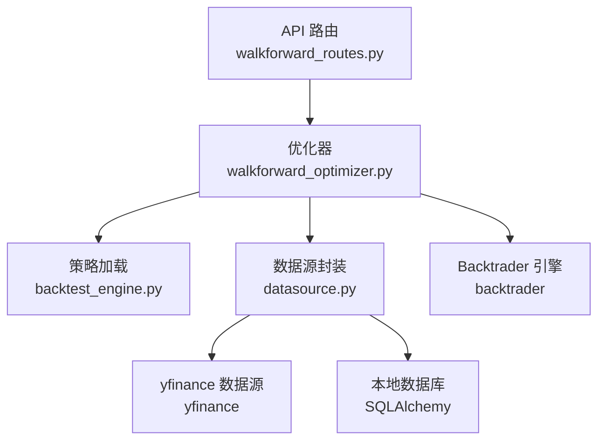
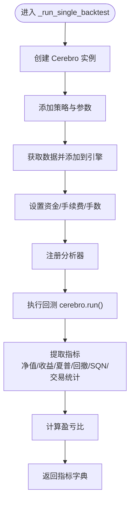
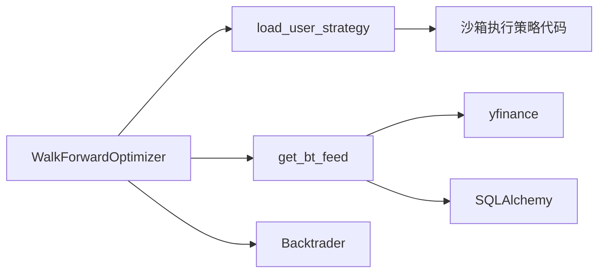

# 参数优化引擎

<cite>
**本文引用的文件**
- [walkforward_optimizer.py](file://backend/src/service/walkforward_optimizer.py)
- [backtest_engine.py](file://backend/src/service/backtest_engine.py)
- [datasource.py](file://backend/src/db/datasource.py)
- [walkforward_routes.py](file://backend/src/routes/walkforward_routes.py)
- [test_walkforward_optimizer.py](file://backend/tests/service/test_walkforward_optimizer.py)
- [sma_cross.py](file://backend/resources/strategy/templates/sma_cross.py)
- [ema_cross.py](file://backend/resources/strategy/templates/ema_cross.py)
</cite>

## 目录
1. [简介](#简介)
2. [项目结构](#项目结构)
3. [核心组件](#核心组件)
4. [架构总览](#架构总览)
5. [详细组件分析](#详细组件分析)
6. [依赖关系分析](#依赖关系分析)
7. [性能考量](#性能考量)
8. [故障排查指南](#故障排查指南)
9. [结论](#结论)
10. [附录：配置与使用指南](#附录配置与使用指南)

## 简介
本文件系统性解析 Walk-Forward 优化器（walkforward_optimizer.py）的算法实现与工作流程，围绕以下目标展开：
- 解释 WalkForwardOptimizer 类的初始化参数，包括 param_grid 的结构、训练/测试窗口周期（train_period_days、test_period_days）以及锚定（anchored）与滚动（rolling）窗口模式的区别。
- 描述 _generate_windows 方法如何根据总时间范围和窗口大小生成一系列训练-测试时间窗口。
- 阐明 _generate_param_combinations 如何使用笛卡尔积生成所有可能的参数组合。
- 重点分析 _run_single_backtest 方法，说明其如何利用 Backtrader 框架执行单次回测并提取夏普比率、最大回撤、收益率等关键指标。
- 解释 _optimize_on_train_window 和 _validate_on_test_window 如何分别在训练集上寻优并在测试集上验证。
- 阐述 run_walkforward 主流程如何协调上述步骤完成完整的滚动优化。
- 详细说明 _calculate_overfitting_metrics 如何计算训练-测试相关性、平均退化率和一致性得分来检测过拟合，以及 _calculate_combined_test_metrics 如何聚合所有测试窗口的结果以评估策略的真实表现。
- 提供配置参数网格、解读优化结果和基于结果调整策略的实用指南。

## 项目结构
Walk-Forward 优化器位于后端服务层，通过 API 路由触发后台任务，调用优化器执行回测与评估，并将结果持久化存储。关键模块关系如下：



图表来源
- [walkforward_routes.py](file://backend/src/routes/walkforward_routes.py#L1-L120)
- [walkforward_optimizer.py](file://backend/src/service/walkforward_optimizer.py#L1-L120)
- [backtest_engine.py](file://backend/src/service/backtest_engine.py#L81-L165)
- [datasource.py](file://backend/src/db/datasource.py#L200-L231)

章节来源
- [walkforward_routes.py](file://backend/src/routes/walkforward_routes.py#L1-L120)
- [walkforward_optimizer.py](file://backend/src/service/walkforward_optimizer.py#L1-L120)
- [backtest_engine.py](file://backend/src/service/backtest_engine.py#L81-L165)
- [datasource.py](file://backend/src/db/datasource.py#L200-L231)

## 核心组件
- WalkForwardOptimizer：核心优化器，负责生成窗口、参数组合、执行回测、训练寻优、测试验证、过拟合检测与结果汇总。
- OptimizationWindow：单个窗口的数据结构，包含训练/测试时间区间、最佳参数、训练与测试指标、训练集所有结果。
- WalkForwardResult：完整优化结果，包含全局统计、过拟合指标与测试聚合指标。

章节来源
- [walkforward_optimizer.py](file://backend/src/service/walkforward_optimizer.py#L27-L54)

## 架构总览
下图展示从 API 触发到优化完成的整体流程，包括策略加载、数据获取、回测执行与结果保存。

```mermaid
sequenceDiagram
participant Client as "客户端"
participant Route as "API 路由<br/>walkforward_routes.py"
participant Task as "后台任务<br/>run_optimization_task"
participant Opt as "优化器<br/>WalkForwardOptimizer"
participant Strat as "策略加载<br/>backtest_engine.py"
participant Data as "数据源<br/>datasource.py"
participant BT as "Backtrader 引擎"
Client->>Route : POST /api/walkforward/start
Route->>Task : 启动后台任务
Task->>Opt : 初始化 WalkForwardOptimizer(...)
Opt->>Strat : load_user_strategy(name)
Strat-->>Opt : 返回 UserStrategy 类
Opt->>Opt : _generate_windows()
loop 每个窗口
Opt->>Opt : _optimize_on_train_window()
Opt->>Data : get_bt_feed(ticker, train_start, train_end)
Data-->>Opt : PandasData
Opt->>BT : cerebro.run()
BT-->>Opt : 训练指标
Opt->>Opt : _validate_on_test_window()
Opt->>Data : get_bt_feed(ticker, test_start, test_end)
Data-->>Opt : PandasData
Opt->>BT : cerebro.run()
BT-->>Opt : 测试指标
end
Opt->>Opt : _calculate_overfitting_metrics()
Opt->>Opt : _calculate_combined_test_metrics()
Opt-->>Task : 返回 WalkForwardResult
Task->>Route : 保存结果并更新状态
Route-->>Client : 返回 optimization_id
```

图表来源
- [walkforward_routes.py](file://backend/src/routes/walkforward_routes.py#L66-L120)
- [walkforward_optimizer.py](file://backend/src/service/walkforward_optimizer.py#L116-L218)
- [backtest_engine.py](file://backend/src/service/backtest_engine.py#L81-L165)
- [datasource.py](file://backend/src/db/datasource.py#L225-L231)

## 详细组件分析

### 初始化参数与窗口模式
- 初始化参数
  - strategy_name、ticker、start_date、end_date：指定策略名称、标的与整体回测时间范围。
  - param_grid：参数名到候选值列表的映射，如 {"fast_period": [5, 10, 20], "slow_period": [20, 30, 50]}。
  - initial_cash、commission、stake：资金、手续费与下单手数。
  - train_period_days、test_period_days：训练与测试窗口长度（天）。
  - anchored：窗口模式选择。
    - True（锚定）：训练窗口从起始点开始，每次将测试期长度加到训练期，形成“增长式”窗口。
    - False（滚动）：训练窗口平移滑动，每次将测试起点作为新的窗口起点。
- 窗口生成逻辑
  - 使用日期加减生成训练期与测试期边界，若测试结束超过总结束日期则停止。
  - 锚定模式下，训练期长度随窗口递增；滚动模式下，窗口起点为上一个测试起点。

章节来源
- [walkforward_optimizer.py](file://backend/src/service/walkforward_optimizer.py#L64-L115)
- [walkforward_optimizer.py](file://backend/src/service/walkforward_optimizer.py#L116-L159)

### 参数组合生成
- 使用笛卡尔积生成所有参数组合，空网格时返回仅含空字典的列表，便于统一处理。

章节来源
- [walkforward_optimizer.py](file://backend/src/service/walkforward_optimizer.py#L161-L179)
- [test_walkforward_optimizer.py](file://backend/tests/service/test_walkforward_optimizer.py#L6-L21)

### 单次回测执行（_run_single_backtest）
- 回测配置
  - 添加策略类与参数，注入数据源（PandasData），设置初始资金、手续费与固定手数。
  - 注册多个分析器：夏普比率、最大回撤、收益率、交易分析、SQN。
- 指标提取
  - 从分析器中提取最终净值、年化收益、夏普比率、最大回撤、SQN、总交易数、胜率、盈亏比等。
  - 对异常进行兜底处理，返回标准化指标字典。



图表来源
- [walkforward_optimizer.py](file://backend/src/service/walkforward_optimizer.py#L181-L273)

章节来源
- [walkforward_optimizer.py](file://backend/src/service/walkforward_optimizer.py#L181-L273)

### 训练寻优与测试验证
- 训练寻优（_optimize_on_train_window）
  - 遍历参数组合，在训练期内逐一执行回测，记录所有结果并依据优化指标（默认夏普比率）选择最佳参数与对应指标。
  - 处理指标为 None 的情况，避免比较错误。
- 测试验证（_validate_on_test_window）
  - 使用训练阶段选出的最佳参数在测试期内执行一次回测，得到测试指标。

章节来源
- [walkforward_optimizer.py](file://backend/src/service/walkforward_optimizer.py#L274-L339)

### 主流程 run_walkforward
- 生成窗口与参数组合。
- 逐窗口执行：训练寻优 → 测试验证 → 记录窗口结果。
- 计算过拟合检测指标与测试聚合指标，封装为 WalkForwardResult 并返回。

章节来源
- [walkforward_optimizer.py](file://backend/src/service/walkforward_optimizer.py#L341-L417)

### 过拟合检测指标（_calculate_overfitting_metrics）
- 训练-测试相关性：对各窗口训练与测试指标计算皮尔逊相关系数。
- 平均退化率：(训练指标 - 测试指标)/|训练指标| × 100，按窗口求平均。
- 一致性得分：测试指标偏离训练指标不超过 20% 的窗口占比。
- 波动性：退化率的标准差。
- 过拟合判定：平均退化率 > 30 或一致性得分 < 50 时视为存在过拟合风险。

章节来源
- [walkforward_optimizer.py](file://backend/src/service/walkforward_optimizer.py#L419-L494)

### 测试聚合指标（_calculate_combined_test_metrics）
- 聚合所有测试窗口的指标：总收益、平均夏普比率、平均最大回撤、总交易数、胜率等，用于衡量策略在滚动窗口下的整体外样本表现。

章节来源
- [walkforward_optimizer.py](file://backend/src/service/walkforward_optimizer.py#L495-L531)

### 策略加载与数据源
- 策略加载（load_user_strategy）
  - 从策略目录读取用户策略文件，支持安全沙箱执行与软沙箱回退，确保返回继承自 Backtrader 的 UserStrategy 类。
- 数据源封装（get_bt_feed）
  - 先尝试从 yfinance 下载，失败或为空时回退到本地数据库；成功后保存至数据库以便复用；最终包装为 Backtrader PandasData。

章节来源
- [backtest_engine.py](file://backend/src/service/backtest_engine.py#L81-L165)
- [datasource.py](file://backend/src/db/datasource.py#L200-L231)

### API 路由与后台任务
- API 路由
  - /api/walkforward/start：提交优化请求，返回 optimization_id 并异步运行。
  - /api/walkforward/list：分页列出历史优化记录。
  - /api/walkforward/{id}：获取某次优化的详细结果。
  - /api/walkforward/{id}/status：查询运行状态与进度。
- 后台任务
  - run_optimization_task：创建优化器实例，执行 run_walkforward，保存结果并更新状态。

章节来源
- [walkforward_routes.py](file://backend/src/routes/walkforward_routes.py#L1-L200)
- [walkforward_routes.py](file://backend/src/routes/walkforward_routes.py#L200-L399)

## 依赖关系分析
- 组件耦合
  - WalkForwardOptimizer 依赖 backtest_engine.load_user_strategy 与 datasource.get_bt_feed，耦合点清晰且职责单一。
  - 与 Backtrader 引擎交互集中在 _run_single_backtest，便于替换或扩展分析器。
- 外部依赖
  - yfinance：在线数据获取。
  - SQLAlchemy：本地数据库存取。
  - FastAPI：API 路由与后台任务调度。



图表来源
- [walkforward_optimizer.py](file://backend/src/service/walkforward_optimizer.py#L108-L115)
- [backtest_engine.py](file://backend/src/service/backtest_engine.py#L81-L165)
- [datasource.py](file://backend/src/db/datasource.py#L200-L231)

章节来源
- [walkforward_optimizer.py](file://backend/src/service/walkforward_optimizer.py#L108-L115)
- [backtest_engine.py](file://backend/src/service/backtest_engine.py#L81-L165)
- [datasource.py](file://backend/src/db/datasource.py#L200-L231)

## 性能考量
- 参数组合爆炸：param_grid 中每个参数维度的候选数相乘即为组合总数，应谨慎设计网格规模，避免回测时间过长。
- 窗口数量：训练/测试窗口越多，回测次数越多，建议合理设置窗口长度与步进。
- 数据获取：优先使用本地数据库缓存，减少网络请求；确保数据质量与完整性。
- 分析器开销：仅保留必要的分析器，避免不必要的计算。
- 并行化：当前实现为串行遍历参数组合与窗口，可考虑在参数层面引入多进程/线程池以提升吞吐（需注意 Backtrader 的线程安全性）。

## 故障排查指南
- 策略加载失败
  - 现象：抛出 StrategyLoadError。
  - 排查：确认策略文件存在、包含 UserStrategy 类、继承自 bt.Strategy。
- 数据加载失败
  - 现象：DataLoadError 或返回空数据。
  - 排查：检查 ticker 是否有效、网络是否可达、本地数据库是否可用。
- 回测异常
  - 现象：_run_single_backtest 返回兜底指标并记录错误日志。
  - 排查：查看 error 字段，检查参数合法性、数据缺失、策略逻辑问题。
- 过拟合检测结果异常
  - 现象：相关性为 NaN、退化率或一致性得分为 0。
  - 排查：确认各窗口均有有效指标；检查优化指标是否为 None。

章节来源
- [backtest_engine.py](file://backend/src/service/backtest_engine.py#L151-L165)
- [datasource.py](file://backend/src/db/datasource.py#L200-L231)
- [walkforward_optimizer.py](file://backend/src/service/walkforward_optimizer.py#L257-L273)
- [walkforward_optimizer.py](file://backend/src/service/walkforward_optimizer.py#L419-L494)

## 结论
WalkForwardOptimizer 通过严格的训练-测试分离与滚动窗口机制，结合多种指标与过拟合检测手段，为策略参数优化提供了稳健的工程化方案。其模块化设计便于扩展分析器、替换数据源与增强可视化。实际应用中应关注参数网格规模、窗口设置与数据质量，以平衡回测效率与结果可靠性。

## 附录：配置与使用指南

### 配置参数网格
- 建议从较小网格起步，逐步扩大关键参数范围，避免组合爆炸。
- 参考策略模板中的参数定义方式，确保 param_grid 与策略参数名一致。
- 示例策略模板路径：
  - [sma_cross.py](file://backend/resources/strategy/templates/sma_cross.py#L1-L41)
  - [ema_cross.py](file://backend/resources/strategy/templates/ema_cross.py#L1-L41)

章节来源
- [sma_cross.py](file://backend/resources/strategy/templates/sma_cross.py#L1-L41)
- [ema_cross.py](file://backend/resources/strategy/templates/ema_cross.py#L1-L41)

### 解读优化结果
- overfitting_metrics 关键指标
  - train_test_correlation：训练与测试表现的相关性越高，越可能存在过拟合。
  - avg_degradation_pct：平均退化率 > 30 表示测试表现显著劣于训练，提示过拟合风险。
  - consistency_score：测试表现与训练一致性的百分比，< 50 表示不稳定。
  - degradation_std：退化波动越大，策略在不同窗口下的稳定性越差。
- combined_test_metrics
  - avg_sharpe_ratio、avg_max_drawdown、win_rate 等综合指标反映策略在滚动窗口下的整体外样本表现。

章节来源
- [walkforward_optimizer.py](file://backend/src/service/walkforward_optimizer.py#L419-L494)
- [walkforward_optimizer.py](file://backend/src/service/walkforward_optimizer.py#L495-L531)

### 基于结果调整策略
- 若过拟合风险高，建议：
  - 缩小参数搜索空间，聚焦关键参数。
  - 增大测试期长度，提高外样本检验强度。
  - 引入更稳健的优化指标（如 SQN、最大回撤控制）。
  - 采用锚定窗口以观察长期稳定性。
- 若测试聚合指标不佳，建议：
  - 检查交易成本与滑点影响，适当提高 commission 或降低交易频率。
  - 重新审视入场/出场信号，避免噪声触发。
  - 结合市场阶段与流动性特征调整参数。