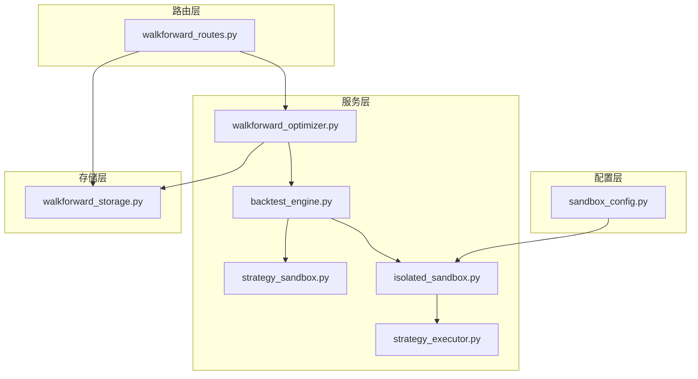
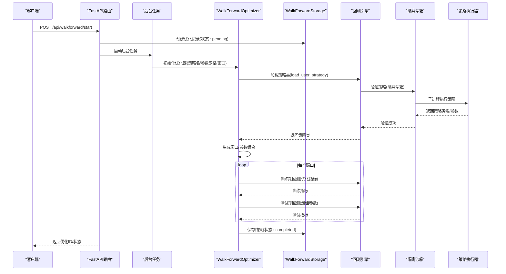
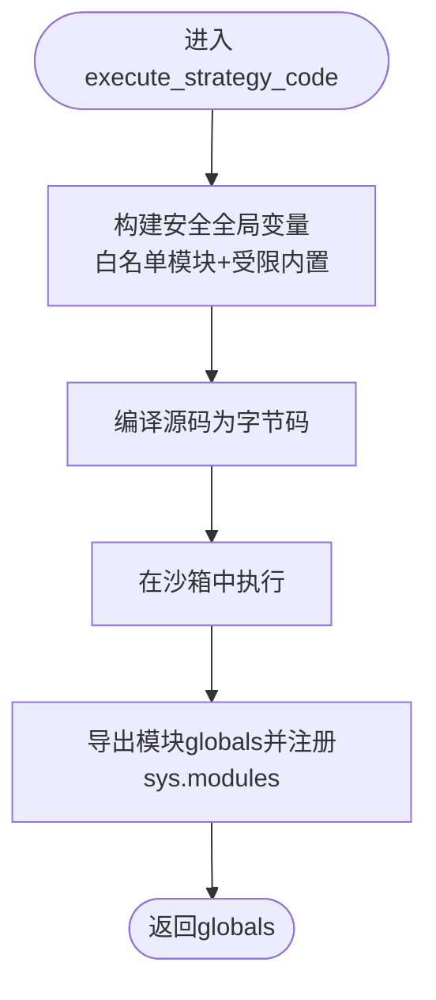
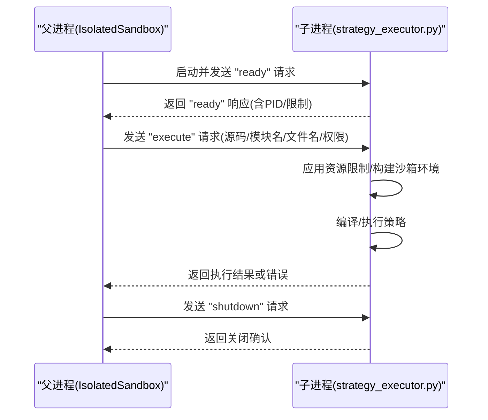
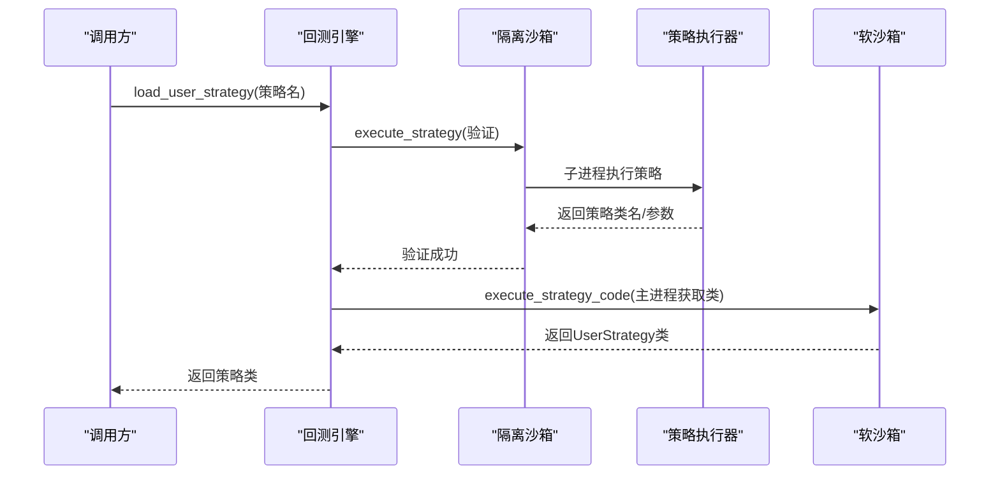
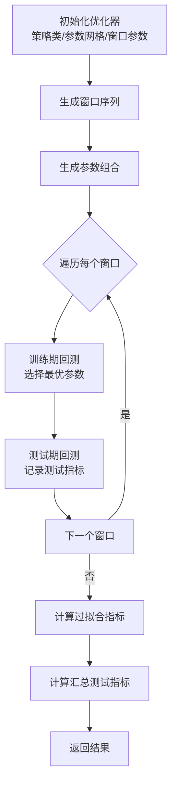
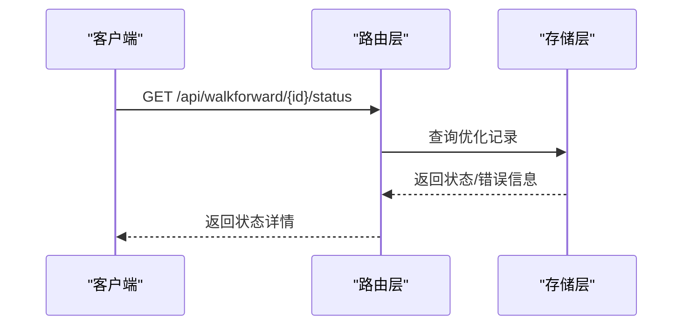
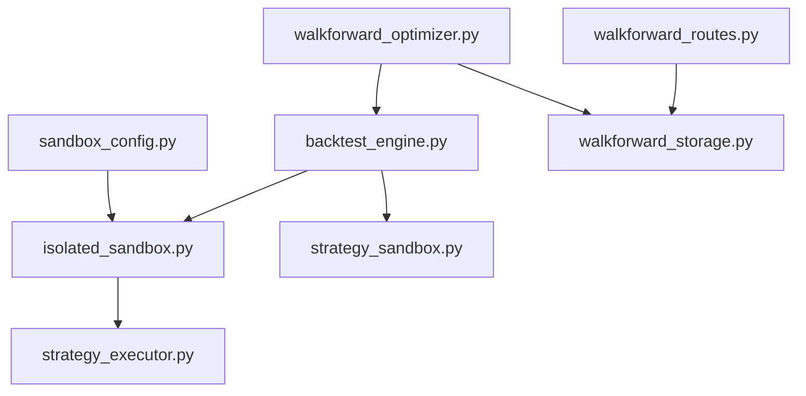

# 策略沙箱与优化器

<cite>
**本文引用的文件列表**
- [strategy_sandbox.py](file://backend/src/service/strategy_sandbox.py)
- [isolated_sandbox.py](file://backend/src/service/isolated_sandbox.py)
- [strategy_executor.py](file://backend/src/service/strategy_executor.py)
- [backtest_engine.py](file://backend/src/service/backtest_engine.py)
- [walkforward_optimizer.py](file://backend/src/service/walkforward_optimizer.py)
- [walkforward_routes.py](file://backend/src/routes/walkforward_routes.py)
- [walkforward_storage.py](file://backend/src/db/walkforward_storage.py)
- [sandbox_config.py](file://backend/src/config/sandbox_config.py)
</cite>

## 目录
1. [引言](#引言)
2. [项目结构](#项目结构)
3. [核心组件](#核心组件)
4. [架构总览](#架构总览)
5. [详细组件分析](#详细组件分析)
6. [依赖关系分析](#依赖关系分析)
7. [性能考量](#性能考量)
8. [故障排查指南](#故障排查指南)
9. [结论](#结论)
10. [附录](#附录)

## 引言
本文件系统性阐述策略沙箱与Walk-Forward优化器的设计与实现，重点覆盖：
- 策略沙箱的安全执行机制：如何动态加载用户上传的Python策略代码，通过代码验证、超时控制、异常隔离等手段防止恶意或错误代码影响系统稳定性；以及沙箱与回测引擎的集成方式，确保策略在受控环境中运行。
- Walk-Forward优化器的算法实现：参数优化流程（训练集/验证集划分）、网格搜索策略、过拟合检测逻辑及最优参数组合输出；并给出优化任务的配置方式、执行进度跟踪与结果分析方法。
- 安全配置建议与性能调优技巧，并结合实例说明如何为自定义策略配置优化参数范围。

## 项目结构
后端服务采用分层设计：
- 配置层：沙箱配置模块提供多模式隔离（软沙箱、子进程沙箱、Docker）与资源限制。
- 服务层：策略沙箱与隔离沙箱负责策略加载与执行；回测引擎负责策略加载、参数提取与回测运行；Walk-Forward优化器负责滚动窗口参数优化与过拟合检测。
- 路由层：FastAPI路由提供优化任务的创建、查询、删除与状态跟踪接口。
- 存储层：数据库存储优化任务元数据、窗口结果、汇总指标与过拟合指标。

图表来源
- [sandbox_config.py](file://backend/src/config/sandbox_config.py#L1-L115)
- [strategy_sandbox.py](file://backend/src/service/strategy_sandbox.py#L1-L213)
- [isolated_sandbox.py](file://backend/src/service/isolated_sandbox.py#L1-L393)
- [strategy_executor.py](file://backend/src/service/strategy_executor.py#L1-L560)
- [backtest_engine.py](file://backend/src/service/backtest_engine.py#L1-L400)
- [walkforward_optimizer.py](file://backend/src/service/walkforward_optimizer.py#L1-L538)
- [walkforward_routes.py](file://backend/src/routes/walkforward_routes.py#L1-L400)
- [walkforward_storage.py](file://backend/src/db/walkforward_storage.py#L1-L426)

章节来源
- [sandbox_config.py](file://backend/src/config/sandbox_config.py#L1-L115)
- [strategy_sandbox.py](file://backend/src/service/strategy_sandbox.py#L1-L213)
- [isolated_sandbox.py](file://backend/src/service/isolated_sandbox.py#L1-L393)
- [strategy_executor.py](file://backend/src/service/strategy_executor.py#L1-L560)
- [backtest_engine.py](file://backend/src/service/backtest_engine.py#L1-L400)
- [walkforward_optimizer.py](file://backend/src/service/walkforward_optimizer.py#L1-L538)
- [walkforward_routes.py](file://backend/src/routes/walkforward_routes.py#L1-L400)
- [walkforward_storage.py](file://backend/src/db/walkforward_storage.py#L1-L426)

## 核心组件
- 策略沙箱（软沙箱）：在主进程中以受限环境执行策略代码，允许白名单导入与内置函数，禁止相对导入与危险属性访问，适合可信策略或开发调试。
- 隔离沙箱（子进程沙箱）：通过独立子进程执行策略，应用资源限制（内存、CPU、网络、文件写入），并严格限制可导入模块与内置函数，适合生产环境中的不可信策略。
- 回测引擎：统一加载策略（优先使用隔离沙箱验证，再在主进程软沙箱中获取类对象），构建Cerebro回测框架，运行分析器并产出指标。
- Walk-Forward优化器：按滚动/锚定窗口划分训练与测试期，网格搜索参数组合，训练期优化指标，测试期验证，计算过拟合检测指标与汇总测试指标。
- 路由与存储：提供优化任务的REST接口，后台异步执行，持久化结果并支持查询、筛选与删除。

章节来源
- [strategy_sandbox.py](file://backend/src/service/strategy_sandbox.py#L1-L213)
- [isolated_sandbox.py](file://backend/src/service/isolated_sandbox.py#L1-L393)
- [strategy_executor.py](file://backend/src/service/strategy_executor.py#L1-L560)
- [backtest_engine.py](file://backend/src/service/backtest_engine.py#L1-L400)
- [walkforward_optimizer.py](file://backend/src/service/walkforward_optimizer.py#L1-L538)
- [walkforward_routes.py](file://backend/src/routes/walkforward_routes.py#L1-L400)
- [walkforward_storage.py](file://backend/src/db/walkforward_storage.py#L1-L426)

## 架构总览
下图展示从API请求到优化完成的端到端流程，包括策略加载、沙箱执行、回测与结果持久化。

图表来源
- [walkforward_routes.py](file://backend/src/routes/walkforward_routes.py#L120-L220)
- [walkforward_optimizer.py](file://backend/src/service/walkforward_optimizer.py#L341-L417)
- [backtest_engine.py](file://backend/src/service/backtest_engine.py#L81-L165)
- [isolated_sandbox.py](file://backend/src/service/isolated_sandbox.py#L181-L283)
- [strategy_executor.py](file://backend/src/service/strategy_executor.py#L423-L559)
- [walkforward_storage.py](file://backend/src/db/walkforward_storage.py#L164-L237)

## 详细组件分析

### 组件A：策略沙箱（软沙箱）
软沙箱在主进程中以受限环境执行策略代码，主要特性：
- 白名单导入：仅允许backtrader、pandas、numpy与常用标准库模块。
- 受限内置函数：仅暴露安全的内置函数与异常类型。
- 禁止相对导入与危险属性访问：通过自定义import钩子与getattr拦截阻止反射与对象图遍历等攻击路径。
- 编译与执行：先编译字节码捕获语法错误，再在沙箱全局变量中执行，最后将globals导出供上层使用。

图表来源
- [strategy_sandbox.py](file://backend/src/service/strategy_sandbox.py#L170-L210)

章节来源
- [strategy_sandbox.py](file://backend/src/service/strategy_sandbox.py#L1-L213)

### 组件B：隔离沙箱（子进程沙箱）
隔离沙箱通过独立子进程执行策略，具备更强的安全性与资源控制：
- 进程启动：父进程通过子进程启动策略执行器脚本，传递资源限制环境变量。
- 请求/响应协议：父子进程通过stdin/stdout交换JSON消息，支持execute/validate/shutdown等动作。
- 资源限制：Linux平台设置内存与CPU硬限制；Windows平台监控与终止。
- 安全限制：白名单导入、禁用危险属性访问、阻断文件写入（默认）。
- 超时控制：线程定时器触发超时，父进程杀死子进程并抛出超时异常。

图表来源
- [isolated_sandbox.py](file://backend/src/service/isolated_sandbox.py#L105-L181)
- [strategy_executor.py](file://backend/src/service/strategy_executor.py#L423-L559)

章节来源
- [isolated_sandbox.py](file://backend/src/service/isolated_sandbox.py#L1-L393)
- [strategy_executor.py](file://backend/src/service/strategy_executor.py#L1-L560)

### 组件C：回测引擎与策略加载
回测引擎负责策略加载与回测运行：
- 策略加载：优先使用隔离沙箱进行策略验证（白名单检查、语法检查、类存在性与继承校验），随后在主进程软沙箱中获取UserStrategy类对象，避免跨进程返回类对象。
- 参数提取：从策略类的params元类中提取参数名称、默认值与类型，用于前端展示与优化配置。
- 回测运行：构建Cerebro，添加策略、数据、分析器与资金/佣金/手数器，运行并收集指标。

图表来源
- [backtest_engine.py](file://backend/src/service/backtest_engine.py#L81-L165)
- [strategy_sandbox.py](file://backend/src/service/strategy_sandbox.py#L170-L210)
- [isolated_sandbox.py](file://backend/src/service/isolated_sandbox.py#L181-L283)
- [strategy_executor.py](file://backend/src/service/strategy_executor.py#L423-L559)

章节来源
- [backtest_engine.py](file://backend/src/service/backtest_engine.py#L1-L400)

### 组件D：Walk-Forward优化器
Walk-Forward优化器实现滚动窗口参数优化与过拟合检测：
- 窗口生成：根据起止日期与窗口大小生成训练/测试期序列；支持“滚动”与“锚定”两种模式。
- 参数组合：基于param_grid生成笛卡尔积，作为待测试参数集合。
- 训练期优化：对每个窗口的参数组合在训练期内回测，选择优化指标最优的参数组合。
- 测试期验证：使用训练期选出的最佳参数在测试期内回测，记录测试指标。
- 过拟合检测：计算训练/测试相关性、平均退化百分比、一致性得分与退化标准差；综合阈值判断是否过拟合。
- 结果汇总：统计所有测试窗口的总收益、平均夏普比率、最大回撤、胜率等指标。

图表来源
- [walkforward_optimizer.py](file://backend/src/service/walkforward_optimizer.py#L116-L199)
- [walkforward_optimizer.py](file://backend/src/service/walkforward_optimizer.py#L274-L340)
- [walkforward_optimizer.py](file://backend/src/service/walkforward_optimizer.py#L395-L417)
- [walkforward_optimizer.py](file://backend/src/service/walkforward_optimizer.py#L419-L531)

章节来源
- [walkforward_optimizer.py](file://backend/src/service/walkforward_optimizer.py#L1-L538)

### 组件E：API与存储
- API路由：提供启动优化、列出优化、查询详情、删除优化与状态查询接口；优化任务在后台异步执行，避免阻塞主线程。
- 存储层：将优化任务元数据、窗口明细、过拟合指标与汇总测试指标持久化，支持按条件过滤与排序。

图表来源
- [walkforward_routes.py](file://backend/src/routes/walkforward_routes.py#L355-L397)
- [walkforward_storage.py](file://backend/src/db/walkforward_storage.py#L309-L339)

章节来源
- [walkforward_routes.py](file://backend/src/routes/walkforward_routes.py#L1-L400)
- [walkforward_storage.py](file://backend/src/db/walkforward_storage.py#L1-L426)

## 依赖关系分析
- 配置依赖：沙箱配置模块提供全局配置，隔离沙箱读取超时、内存、网络与文件写入等限制；软沙箱不直接依赖此模块。
- 执行依赖：回测引擎依赖隔离沙箱进行策略验证，再通过软沙箱获取策略类；Walk-Forward优化器依赖回测引擎进行单次回测。
- 接口依赖：路由层依赖存储层进行优化任务的增删改查；优化器依赖存储层保存结果。
- 数据依赖：优化器内部使用pandas进行相关性与统计计算，使用backtrader进行回测。

图表来源
- [sandbox_config.py](file://backend/src/config/sandbox_config.py#L53-L88)
- [isolated_sandbox.py](file://backend/src/service/isolated_sandbox.py#L181-L283)
- [strategy_executor.py](file://backend/src/service/strategy_executor.py#L423-L559)
- [backtest_engine.py](file://backend/src/service/backtest_engine.py#L81-L165)
- [walkforward_optimizer.py](file://backend/src/service/walkforward_optimizer.py#L341-L417)
- [walkforward_storage.py](file://backend/src/db/walkforward_storage.py#L164-L237)
- [walkforward_routes.py](file://backend/src/routes/walkforward_routes.py#L120-L220)

章节来源
- [sandbox_config.py](file://backend/src/config/sandbox_config.py#L1-L115)
- [backtest_engine.py](file://backend/src/service/backtest_engine.py#L1-L400)
- [walkforward_optimizer.py](file://backend/src/service/walkforward_optimizer.py#L1-L538)
- [walkforward_routes.py](file://backend/src/routes/walkforward_routes.py#L1-L400)
- [walkforward_storage.py](file://backend/src/db/walkforward_storage.py#L1-L426)

## 性能考量
- 沙箱性能
  - 子进程沙箱：启动子进程与IPC通信带来额外开销，建议复用IsolatedSandbox实例而非频繁创建；合理设置超时与内存上限，避免长时间阻塞。
  - 软沙箱：无进程开销，但安全性较低，适合可信策略或本地开发。
- 优化器性能
  - 参数组合数量与窗口数量呈乘法增长，建议先缩小参数范围，再逐步扩展；优先使用更稳定的指标（如夏普比率）作为优化目标。
  - 训练/测试窗口重叠度与长度影响过拟合检测准确性，适当增大测试期有助于稳健评估。
- 回测性能
  - 分析器数量与数据规模成正比，建议按需启用分析器；对大规模数据可考虑分批回测或降采样。
- I/O与绘图
  - 回测绘图可能占用较多内存与磁盘I/O，建议在需要时才生成图像并控制分辨率与尺寸。

[本节为通用指导，无需特定文件来源]

## 故障排查指南
- 策略加载失败
  - 隔离沙箱超时：检查策略复杂度与资源限制配置；适当提高超时或降低内存上限。
  - 策略类缺失：确认策略文件包含UserStrategy类且继承自backtrader.Strategy。
  - 导入错误：策略中使用了未在白名单内的模块或相对导入。
- 回测异常
  - 数据源问题：确认数据源可用且时间范围正确；检查数据格式与字段映射。
  - 分析器异常：某些分析器在空数据或极端情况下可能抛错，建议在策略中增加边界保护。
- 优化任务失败
  - 查看存储层记录的错误信息；通过状态接口定位失败阶段（创建、运行、保存）。
  - 对于长时间运行的任务，建议分段执行并记录中间结果，便于快速定位问题。

章节来源
- [backtest_engine.py](file://backend/src/service/backtest_engine.py#L151-L165)
- [isolated_sandbox.py](file://backend/src/service/isolated_sandbox.py#L238-L265)
- [walkforward_routes.py](file://backend/src/routes/walkforward_routes.py#L355-L397)
- [walkforward_storage.py](file://backend/src/db/walkforward_storage.py#L114-L163)

## 结论
本系统通过软沙箱与隔离沙箱的双轨设计，在开发与生产场景下分别提供便捷与安全的策略执行能力；回测引擎与Walk-Forward优化器形成闭环，既保证策略在可控环境中运行，又提供严谨的参数优化与过拟合检测能力。配合API与存储层，实现了可追踪、可分析、可持久化的优化流水线。

[本节为总结，无需特定文件来源]

## 附录

### A. 安全配置建议
- 默认使用隔离沙箱（子进程模式），并根据部署环境调整超时、内存与网络权限。
- 严格限制文件写入，默认关闭；如确需写入，仅在受控目录内开启。
- 对不可信策略，避免开启网络访问；必要时使用防火墙或容器网络隔离。
- 定期更新白名单模块与内置函数列表，减少潜在攻击面。

章节来源
- [sandbox_config.py](file://backend/src/config/sandbox_config.py#L16-L46)
- [strategy_executor.py](file://backend/src/service/strategy_executor.py#L101-L139)
- [isolated_sandbox.py](file://backend/src/service/isolated_sandbox.py#L73-L104)

### B. 性能调优技巧
- 沙箱
  - 复用IsolatedSandbox实例，减少进程创建成本。
  - 合理设置timeout与max_memory_mb，避免长时间占用资源。
- 优化器
  - 先粗后细：先用较宽参数范围快速筛选，再在候选区间细化。
  - 控制窗口大小与数量：平衡过拟合检测精度与计算耗时。
- 回测
  - 按需启用分析器；对大规模数据分批处理。
  - 减少绘图频率与分辨率，避免I/O瓶颈。

章节来源
- [isolated_sandbox.py](file://backend/src/service/isolated_sandbox.py#L181-L283)
- [walkforward_optimizer.py](file://backend/src/service/walkforward_optimizer.py#L116-L199)

### C. 自定义策略优化参数配置示例
以下为常见策略参数范围配置思路（示例，非代码片段）：
- 移动平均交叉策略：fast_period ∈ [5, 10, 20, 30]，slow_period ∈ [20, 30, 50, 60]，步长建议从大到小逐步细化。
- RSI策略：rsi_period ∈ [7, 14, 21]，overbought ∈ [60, 70, 80]，oversold ∈ [20, 30, 40]。
- 布林带策略：bb_period ∈ [10, 20, 30]，bb_std ∈ [1.0, 1.5, 2.0]。
- 注意事项
  - 参数范围应覆盖策略有效区间，避免极端值导致回测异常。
  - 优先使用业务合理的整数步长，减少无效组合。
  - 若策略包含多个参数，建议先固定次要参数，优化主要参数后再联合优化。

章节来源
- [walkforward_optimizer.py](file://backend/src/service/walkforward_optimizer.py#L81-L106)
- [walkforward_routes.py](file://backend/src/routes/walkforward_routes.py#L32-L50)