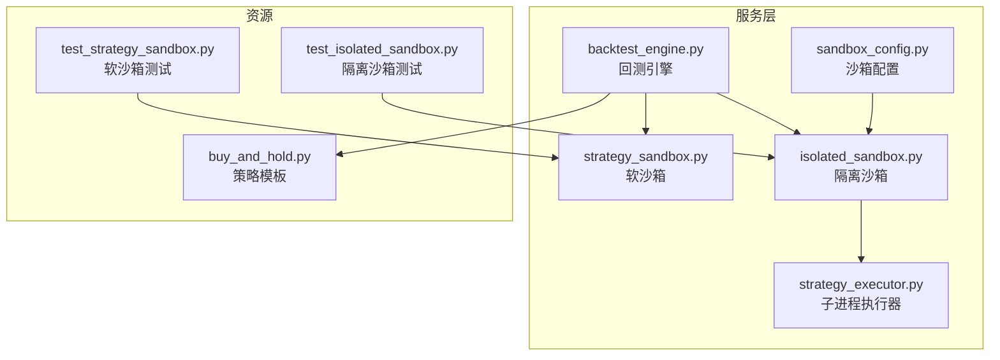
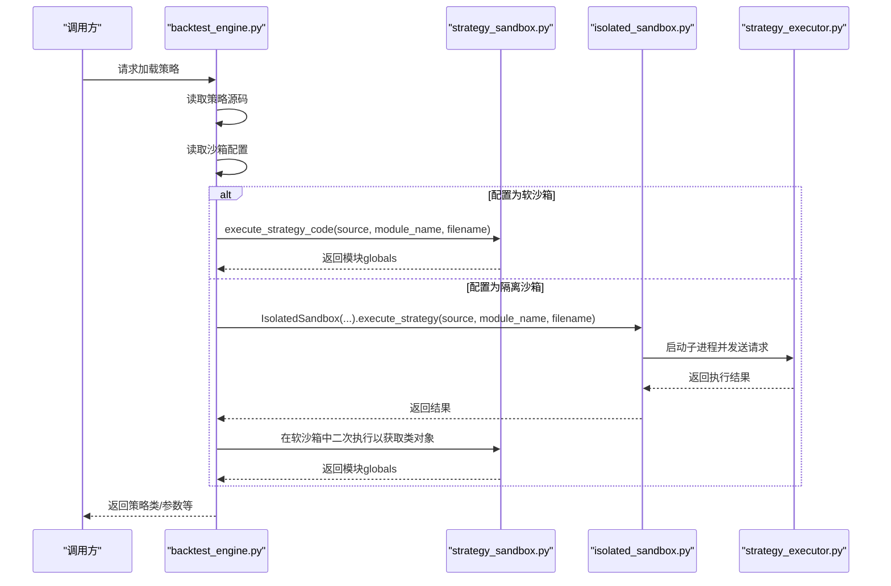
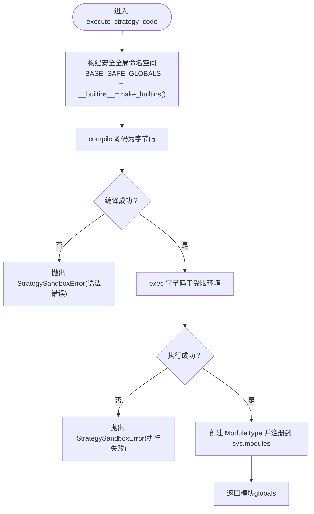
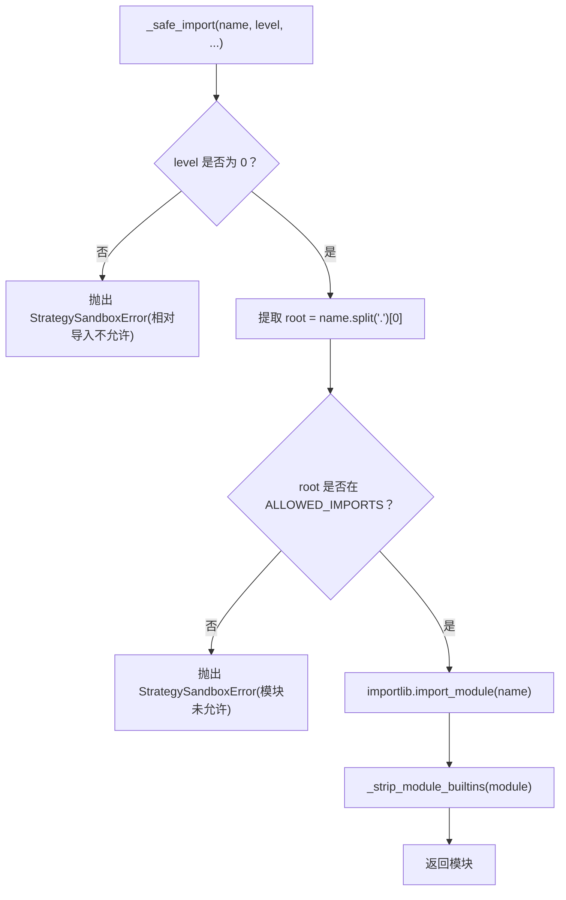
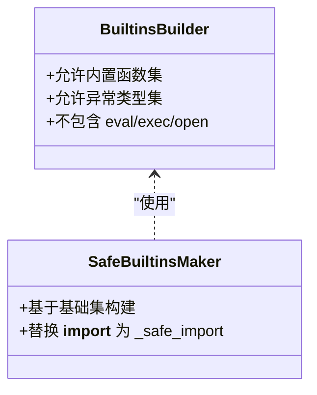
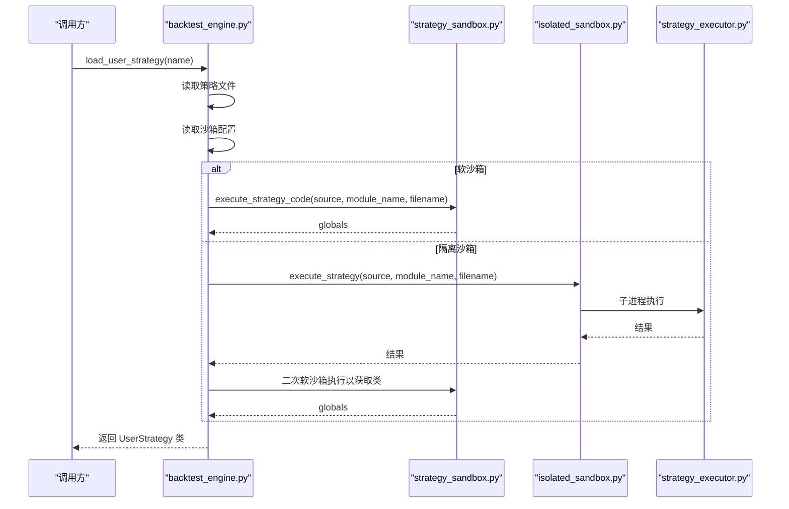
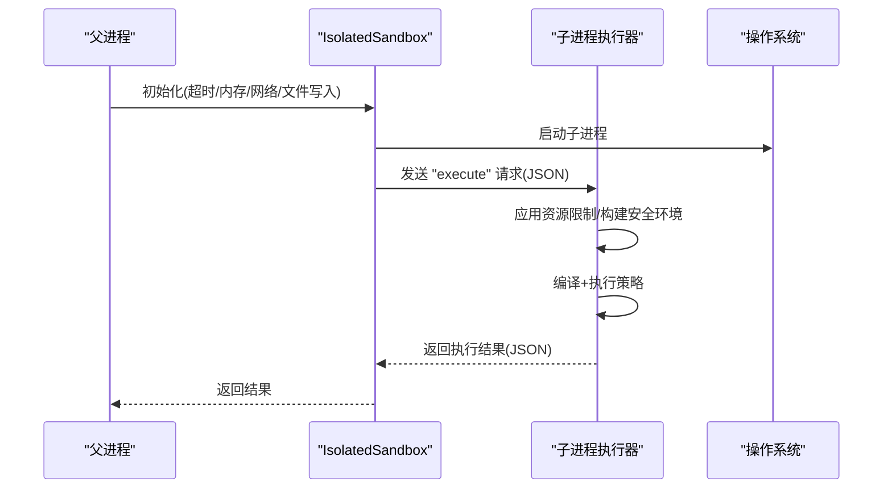
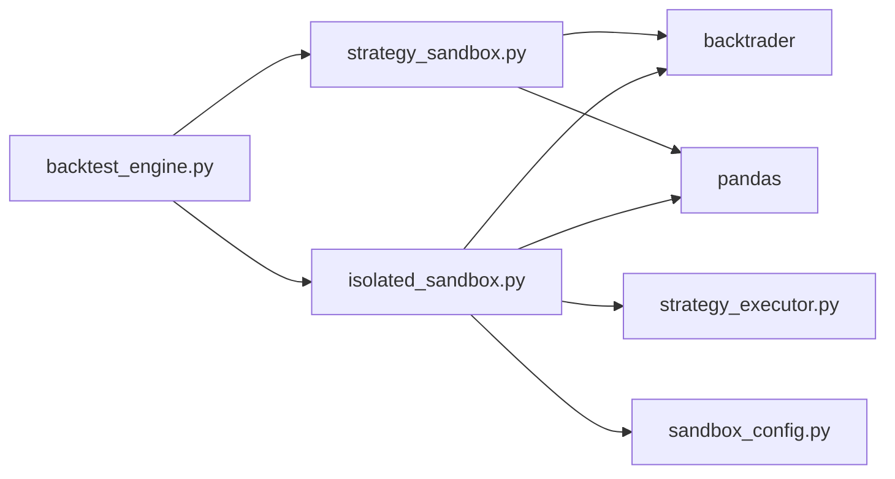

# 策略沙箱机制

<cite>
**本文引用的文件列表**
- [strategy_sandbox.py](file://backend/src/service/strategy_sandbox.py)
- [isolated_sandbox.py](file://backend/src/service/isolated_sandbox.py)
- [strategy_executor.py](file://backend/src/service/strategy_executor.py)
- [backtest_engine.py](file://backend/src/service/backtest_engine.py)
- [sandbox_config.py](file://backend/src/config/sandbox_config.py)
- [test_strategy_sandbox.py](file://backend/tests/service/test_strategy_sandbox.py)
- [test_isolated_sandbox.py](file://backend/tests/service/test_isolated_sandbox.py)
- [buy_and_hold.py](file://backend/resources/strategy/buy_and_hold.py)
</cite>

## 目录
1. [引言](#引言)
2. [项目结构](#项目结构)
3. [核心组件](#核心组件)
4. [架构总览](#架构总览)
5. [详细组件分析](#详细组件分析)
6. [依赖关系分析](#依赖关系分析)
7. [性能考量](#性能考量)
8. [故障排查指南](#故障排查指南)
9. [结论](#结论)
10. [附录](#附录)

## 引言
本文件系统性阐述策略沙箱（strategy_sandbox.py）的安全执行机制，重点围绕以下目标展开：
- 解释 execute_strategy_code 如何通过编译与受限的全局/内置命名空间执行用户策略代码；
- 说明 _safe_import 如何限制导入白名单模块并禁止相对导入；
- 描述 _build_base_builtins 与 _make_builtins 如何构建精简且安全的内置函数环境；
- 阐述 _strip_module_builtins 如何剥离模块中的 __builtins__ 引用以增强安全性；
- 结合测试与示例，展示策略加载、验证与执行流程；
- 总结异常处理策略（StrategySandboxError）、与 backtest_engine 的集成方式、性能影响评估及扩展 ALLOWED_IMPORTS 的安全建议。

## 项目结构
策略沙箱相关代码主要分布在后端服务层，包括软沙箱（strategy_sandbox.py）、隔离沙箱（isolated_sandbox.py + strategy_executor.py）以及与引擎的集成（backtest_engine.py）。配置模块（sandbox_config.py）提供隔离沙箱的运行参数。

图表来源
- [strategy_sandbox.py](file://backend/src/service/strategy_sandbox.py#L1-L213)
- [isolated_sandbox.py](file://backend/src/service/isolated_sandbox.py#L1-L393)
- [strategy_executor.py](file://backend/src/service/strategy_executor.py#L1-L560)
- [backtest_engine.py](file://backend/src/service/backtest_engine.py#L1-L400)
- [sandbox_config.py](file://backend/src/config/sandbox_config.py#L1-L115)
- [test_strategy_sandbox.py](file://backend/tests/service/test_strategy_sandbox.py#L1-L39)
- [test_isolated_sandbox.py](file://backend/tests/service/test_isolated_sandbox.py#L1-L406)
- [buy_and_hold.py](file://backend/resources/strategy/buy_and_hold.py#L1-L11)

章节来源
- [strategy_sandbox.py](file://backend/src/service/strategy_sandbox.py#L1-L213)
- [isolated_sandbox.py](file://backend/src/service/isolated_sandbox.py#L1-L393)
- [strategy_executor.py](file://backend/src/service/strategy_executor.py#L1-L560)
- [backtest_engine.py](file://backend/src/service/backtest_engine.py#L1-L400)
- [sandbox_config.py](file://backend/src/config/sandbox_config.py#L1-L115)
- [test_strategy_sandbox.py](file://backend/tests/service/test_strategy_sandbox.py#L1-L39)
- [test_isolated_sandbox.py](file://backend/tests/service/test_isolated_sandbox.py#L1-L406)
- [buy_and_hold.py](file://backend/resources/strategy/buy_and_hold.py#L1-L11)

## 核心组件
- 软沙箱（strategy_sandbox.py）
  - 提供 in-process 的软沙箱执行能力，用于受信任代码或兼容目的；明确标注无法抵御恶意代码。
  - 关键函数：execute_strategy_code、_safe_import、_strip_module_builtins、_build_base_builtins、_make_builtins。
  - 安全边界：通过白名单导入、剥离模块 __builtins__、限制内置函数集合实现。

- 隔离沙箱（isolated_sandbox.py + strategy_executor.py）
  - 使用子进程执行策略，配合资源限制（内存、CPU、网络、文件写入）与更严格的内置/导入限制。
  - 关键类：IsolatedSandbox；关键脚本：strategy_executor.py（执行器）。

- 回测引擎（backtest_engine.py）
  - 统一加载与执行策略，支持软/隔离两种模式；默认优先隔离沙箱，必要时在软沙箱中二次执行以获得类对象。

- 沙箱配置（sandbox_config.py）
  - 提供可由环境变量驱动的配置项，控制隔离级别、超时、内存上限、网络/文件写入权限等。

章节来源
- [strategy_sandbox.py](file://backend/src/service/strategy_sandbox.py#L1-L213)
- [isolated_sandbox.py](file://backend/src/service/isolated_sandbox.py#L1-L393)
- [strategy_executor.py](file://backend/src/service/strategy_executor.py#L1-L560)
- [backtest_engine.py](file://backend/src/service/backtest_engine.py#L1-L400)
- [sandbox_config.py](file://backend/src/config/sandbox_config.py#L1-L115)

## 架构总览
软沙箱与隔离沙箱共同服务于策略加载与执行。隔离沙箱在子进程中执行，具备更强的安全性；软沙箱在主进程中执行，便于兼容与调试。

图表来源
- [backtest_engine.py](file://backend/src/service/backtest_engine.py#L81-L165)
- [strategy_sandbox.py](file://backend/src/service/strategy_sandbox.py#L179-L210)
- [isolated_sandbox.py](file://backend/src/service/isolated_sandbox.py#L181-L283)
- [strategy_executor.py](file://backend/src/service/strategy_executor.py#L423-L559)

## 详细组件分析

### 软沙箱：execute_strategy_code 的安全执行路径
- 全局命名空间构建
  - 基于 _BASE_SAFE_GLOBALS 注入 bt、pd 等模块（已剥离 __builtins__）。
  - 设置 __name__、__package__、__doc__、__file__ 等标准元数据。
  - 将 __builtins__ 设为 _make_builtins() 返回的受限字典，其中包含 __import__ 指向 _safe_import。
- 编译与执行
  - 使用 compile 对源码进行语法检查；捕获 SyntaxError 并包装为 StrategySandboxError。
  - 使用 exec 在受限环境中执行；捕获异常并包装为 StrategySandboxError。
- 模块注册
  - 将执行后的 globals 复制到一个新 ModuleType 实例，注入 sys.modules，以便后续查找。

图表来源
- [strategy_sandbox.py](file://backend/src/service/strategy_sandbox.py#L179-L210)

章节来源
- [strategy_sandbox.py](file://backend/src/service/strategy_sandbox.py#L179-L210)

### 导入白名单与相对导入限制：_safe_import
- 限制条件
  - 禁止 level != 0 的相对导入。
  - 仅允许根模块名在 ALLOWED_IMPORTS 白名单内。
- 行为细节
  - 成功导入后对模块字典执行 _strip_module_builtins，移除 __builtins__ 引用。
  - ImportError 将被包装为 StrategySandboxError。

图表来源
- [strategy_sandbox.py](file://backend/src/service/strategy_sandbox.py#L75-L87)

章节来源
- [strategy_sandbox.py](file://backend/src/service/strategy_sandbox.py#L47-L64)
- [strategy_sandbox.py](file://backend/src/service/strategy_sandbox.py#L75-L87)

### 内置函数环境：_build_base_builtins 与 _make_builtins
- _build_base_builtins
  - 明确列出允许的内置函数与类型（如 abs、all、any、range、str、list、tuple、dict、set、frozenset、print、super、zip、property、classmethod、object 等）。
  - 明确列出常见异常类型（如 Exception、ValueError、RuntimeError、KeyError、NotImplementedError、StopIteration 等）。
  - 不包含 eval、exec、open 等高危内置。
- _make_builtins
  - 基于 _BASE_SAFE_BUILTINS 构建字典，并将 __import__ 替换为 _safe_import，从而统一导入入口与白名单校验。

图表来源
- [strategy_sandbox.py](file://backend/src/service/strategy_sandbox.py#L89-L157)
- [strategy_sandbox.py](file://backend/src/service/strategy_sandbox.py#L173-L177)

章节来源
- [strategy_sandbox.py](file://backend/src/service/strategy_sandbox.py#L89-L157)
- [strategy_sandbox.py](file://backend/src/service/strategy_sandbox.py#L173-L177)

### 模块剥离：_strip_module_builtins
- 目的：避免被导入模块直接持有对宿主内置函数的引用，降低反射攻击面。
- 行为：若模块字典存在 __builtins__ 键，则移除之。

章节来源
- [strategy_sandbox.py](file://backend/src/service/strategy_sandbox.py#L67-L73)

### 异常处理策略：StrategySandboxError
- 用途：统一包装导入失败、语法错误、执行失败等异常，便于上层识别与处理。
- 触发点：导入白名单拒绝、相对导入、编译语法错误、执行期异常。

章节来源
- [strategy_sandbox.py](file://backend/src/service/strategy_sandbox.py#L42-L45)
- [strategy_sandbox.py](file://backend/src/service/strategy_sandbox.py#L196-L204)

### 与回测引擎的集成：load_user_strategy
- 加载流程
  - 读取策略文件内容，去除 BOM。
  - 依据配置决定使用软沙箱还是隔离沙箱。
  - 隔离沙箱模式下先在子进程中执行并验证，再在软沙箱中二次执行以获取 UserStrategy 类对象。
- 参数提取
  - 通过遍历策略类的 params 元类，提取 JSON 可序列化参数列表。

图表来源
- [backtest_engine.py](file://backend/src/service/backtest_engine.py#L81-L165)
- [strategy_sandbox.py](file://backend/src/service/strategy_sandbox.py#L179-L210)
- [isolated_sandbox.py](file://backend/src/service/isolated_sandbox.py#L181-L283)
- [strategy_executor.py](file://backend/src/service/strategy_executor.py#L423-L559)

章节来源
- [backtest_engine.py](file://backend/src/service/backtest_engine.py#L81-L165)

### 隔离沙箱：执行器与资源限制
- 执行器（strategy_executor.py）
  - 与父进程通过 JSON 协议通信，支持 execute/validate/ping/shutdown 动作。
  - 在子进程中应用资源限制（内存、CPU、文件描述符等），并严格限制导入与内置访问。
  - 通过 _safe_getattr 阻止危险属性访问（如 __subclasses__、__bases__、__mro__ 等）。
- 隔离沙箱（isolated_sandbox.py）
  - 通过 subprocess 启动执行器，设置超时、内存上限、网络/文件写入权限。
  - 提供 validate_strategy 与 execute_strategy 两个入口，前者仅做静态检查，后者执行策略并返回结果。

图表来源
- [isolated_sandbox.py](file://backend/src/service/isolated_sandbox.py#L105-L149)
- [isolated_sandbox.py](file://backend/src/service/isolated_sandbox.py#L150-L180)
- [isolated_sandbox.py](file://backend/src/service/isolated_sandbox.py#L181-L283)
- [strategy_executor.py](file://backend/src/service/strategy_executor.py#L498-L559)

章节来源
- [strategy_executor.py](file://backend/src/service/strategy_executor.py#L1-L560)
- [isolated_sandbox.py](file://backend/src/service/isolated_sandbox.py#L1-L393)

### 示例：用户策略加载、验证与执行
- 示例策略模板
  - 参考 buy_and_hold.py，定义 UserStrategy 并继承 bt.Strategy。
- 测试用例
  - test_strategy_sandbox.py 展示了白名单导入、相对导入阻断、缺失内置阻断、语法错误包装等行为。
  - test_isolated_sandbox.py 展示了隔离沙箱对危险导入、eval/exec、超时、反射攻击的防护。

章节来源
- [buy_and_hold.py](file://backend/resources/strategy/buy_and_hold.py#L1-L11)
- [test_strategy_sandbox.py](file://backend/tests/service/test_strategy_sandbox.py#L1-L39)
- [test_isolated_sandbox.py](file://backend/tests/service/test_isolated_sandbox.py#L1-L406)

## 依赖关系分析
- 软沙箱依赖
  - builtins、importlib、types、typing、backtrader、pandas。
  - 通过白名单导入与内置限制实现安全边界。
- 隔离沙箱依赖
  - subprocess、threading、json、logging、os、sys、platform、psutil（可选）。
  - 通过子进程与资源限制实现强隔离。
- 引擎依赖
  - 优先使用隔离沙箱；在软沙箱模式下回退；根据配置切换模式。

图表来源
- [backtest_engine.py](file://backend/src/service/backtest_engine.py#L1-L40)
- [strategy_sandbox.py](file://backend/src/service/strategy_sandbox.py#L25-L34)
- [isolated_sandbox.py](file://backend/src/service/isolated_sandbox.py#L1-L31)
- [strategy_executor.py](file://backend/src/service/strategy_executor.py#L16-L26)
- [sandbox_config.py](file://backend/src/config/sandbox_config.py#L1-L47)

章节来源
- [backtest_engine.py](file://backend/src/service/backtest_engine.py#L1-L40)
- [strategy_sandbox.py](file://backend/src/service/strategy_sandbox.py#L25-L34)
- [isolated_sandbox.py](file://backend/src/service/isolated_sandbox.py#L1-L31)
- [strategy_executor.py](file://backend/src/service/strategy_executor.py#L16-L26)
- [sandbox_config.py](file://backend/src/config/sandbox_config.py#L1-L47)

## 性能考量
- 软沙箱
  - 优点：无进程开销，执行速度快，适合受信任代码与快速迭代。
  - 缺点：无法抵御恶意代码，存在反射、对象图遍历等风险。
- 隔离沙箱
  - 优点：强隔离，可限制内存/CPU/网络/文件写入，抵御恶意代码。
  - 缺点：进程启动与IPC通信带来额外开销；超时控制需合理设置。
- 建议
  - 默认启用隔离沙箱；仅在开发调试阶段考虑软沙箱。
  - 通过配置调整超时与内存上限，平衡安全性与性能。

[本节为通用指导，无需具体文件引用]

## 故障排查指南
- 常见错误与定位
  - 导入被拒：检查根模块是否在 ALLOWED_IMPORTS；确认非相对导入。
  - 语法错误：compile 抛出 SyntaxError，会被包装为 StrategySandboxError。
  - 执行失败：exec 抛出异常，会被包装为 StrategySandboxError。
  - 隔离沙箱超时：IsolatedSandbox 抛出 SandboxTimeoutError；适当提高 timeout。
  - 隔离沙箱内存溢出：IsolatedSandbox 抛出 SandboxMemoryError；提高 max_memory_mb 或优化策略。
- 单元测试参考
  - 软沙箱测试覆盖白名单导入、相对导入阻断、缺失内置阻断、语法错误包装。
  - 隔离沙箱测试覆盖危险导入阻断、eval/exec 阻断、超时终止、反射攻击隔离。

章节来源
- [test_strategy_sandbox.py](file://backend/tests/service/test_strategy_sandbox.py#L1-L39)
- [test_isolated_sandbox.py](file://backend/tests/service/test_isolated_sandbox.py#L1-L406)

## 结论
- 软沙箱提供便捷但不安全的执行环境，适用于受信任代码与兼容需求。
- 隔离沙箱通过子进程与资源限制实现强隔离，是生产环境的首选。
- backtest_engine 将两种沙箱无缝集成，既保证安全性又兼顾可用性。
- 扩展 ALLOWED_IMPORTS 需谨慎评估风险，遵循最小权限原则。

[本节为总结，无需具体文件引用]

## 附录

### 安全建议：扩展 ALLOWED_IMPORTS
- 评估原则
  - 最小权限：仅添加策略必需的模块。
  - 风险评估：避免引入可能绕过限制的模块（如具备文件I/O、反射、动态编译能力的模块）。
  - 可审计性：确保新增模块来源可信且可审计。
- 实施步骤
  - 在白名单中添加模块名。
  - 在导入后调用 _strip_module_builtins，移除模块字典中的 __builtins__。
  - 在软沙箱与隔离沙箱中保持一致的限制策略。
  - 编写针对性测试，覆盖导入、异常与边界场景。

章节来源
- [strategy_sandbox.py](file://backend/src/service/strategy_sandbox.py#L47-L64)
- [strategy_sandbox.py](file://backend/src/service/strategy_sandbox.py#L67-L73)
- [strategy_executor.py](file://backend/src/service/strategy_executor.py#L101-L119)
- [strategy_executor.py](file://backend/src/service/strategy_executor.py#L143-L158)