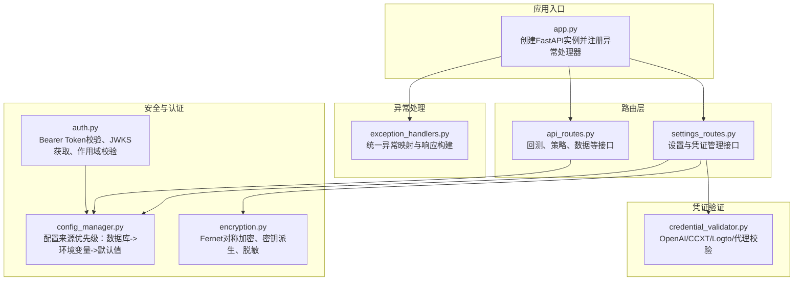
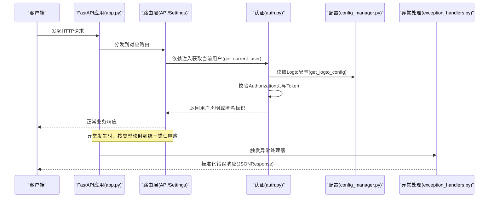
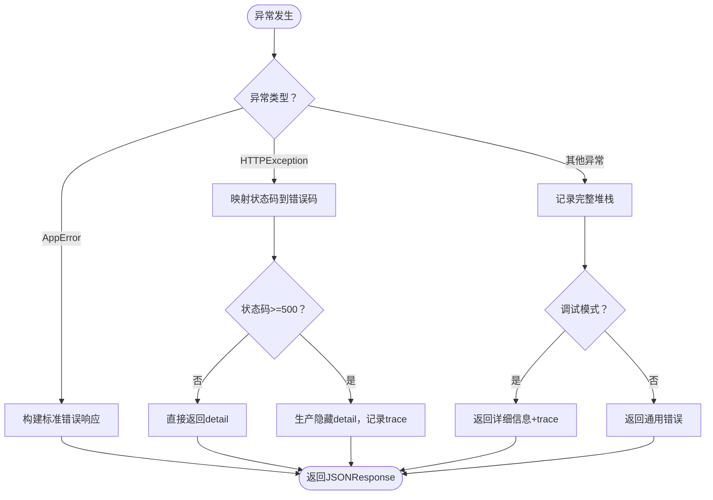
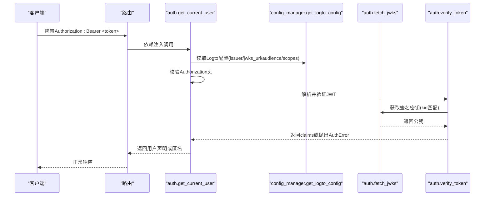
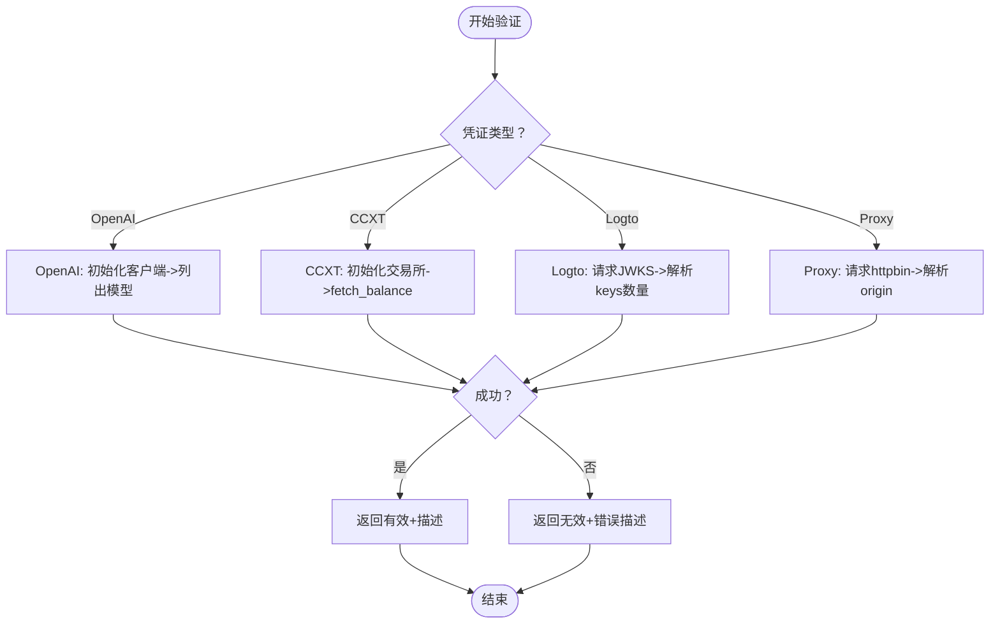
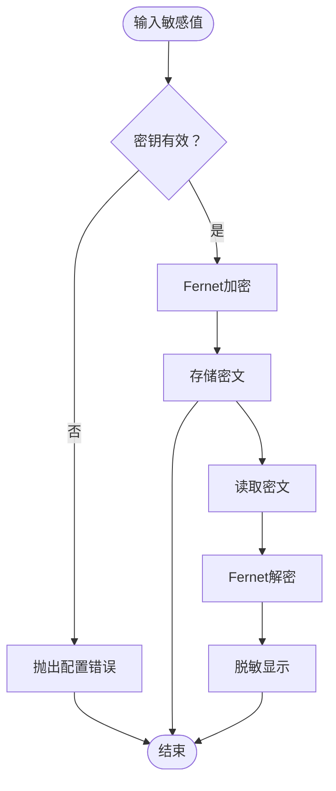
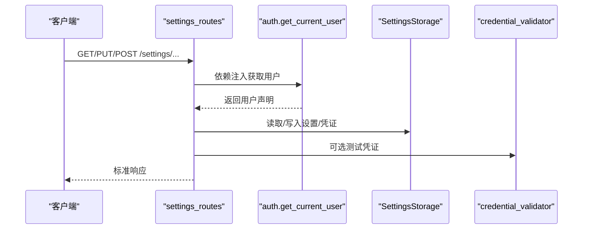
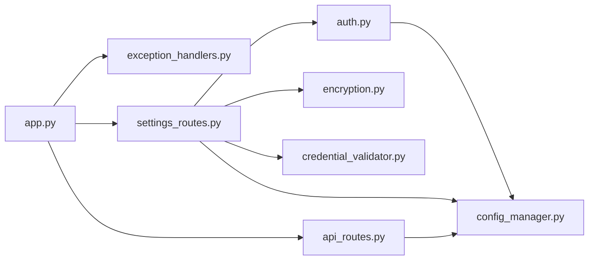

# 全局异常处理与安全响应

<cite>
**本文引用的文件**
- [exception_handlers.py](file://backend/src/utils/exception_handlers.py)
- [auth.py](file://backend/src/utils/auth.py)
- [credential_validator.py](file://backend/src/utils/credential_validator.py)
- [encryption.py](file://backend/src/utils/encryption.py)
- [app.py](file://backend/src/service/app.py)
- [config_manager.py](file://backend/src/config/config_manager.py)
- [settings_routes.py](file://backend/src/routes/settings_routes.py)
- [api_routes.py](file://backend/src/routes/api_routes.py)
- [test_exception_handlers.py](file://backend/tests/utils/test_exception_handlers.py)
- [test_auth.py](file://backend/tests/utils/test_auth.py)
- [test_credential_validator.py](file://backend/tests/utils/test_credential_validator.py)
</cite>

## 目录
1. [简介](#简介)
2. [项目结构](#项目结构)
3. [核心组件](#核心组件)
4. [架构总览](#架构总览)
5. [详细组件分析](#详细组件分析)
6. [依赖关系分析](#依赖关系分析)
7. [性能考量](#性能考量)
8. [故障排查指南](#故障排查指南)
9. [结论](#结论)

## 简介
本文件聚焦于后端的“全局异常处理与安全响应”能力，系统性梳理了以下方面：
- 统一的异常处理与错误响应格式化
- 基于 JWT 的认证与授权流程（含可选登录模式）
- 凭证验证与测试工具（OpenAI、CCXT、Logto、代理）
- 敏感信息加密与脱敏策略
- 路由层如何通过依赖注入实现统一鉴权
- 测试用例覆盖的关键行为与边界

目标是帮助开发者快速理解异常与安全相关的实现方式，并在扩展新功能时遵循一致的模式。

## 项目结构
后端采用 FastAPI 应用入口集中注册异常处理器与路由，认证与凭证管理分布在独立模块中，路由层通过依赖注入实现统一鉴权。

图表来源
- [app.py](file://backend/src/service/app.py#L1-L51)
- [exception_handlers.py](file://backend/src/utils/exception_handlers.py#L1-L246)
- [auth.py](file://backend/src/utils/auth.py#L1-L211)
- [config_manager.py](file://backend/src/config/config_manager.py#L1-L351)
- [credential_validator.py](file://backend/src/utils/credential_validator.py#L1-L360)
- [encryption.py](file://backend/src/utils/encryption.py#L1-L218)
- [settings_routes.py](file://backend/src/routes/settings_routes.py#L1-L401)
- [api_routes.py](file://backend/src/routes/api_routes.py#L1-L463)

章节来源
- [app.py](file://backend/src/service/app.py#L1-L51)

## 核心组件
- 统一异常处理与响应格式化：提供标准化错误码、错误体结构、调试模式下的追踪输出。
- 认证与授权：基于 Bearer Token 的 JWT 验签，支持可选登录模式、作用域校验、JWKS 缓存与轮换。
- 凭证验证：对 OpenAI、CCXT、Logto、代理进行连通性与权限验证。
- 加密与脱敏：对敏感字段进行对称加密存储，提供显示脱敏策略。
- 路由层鉴权：通过依赖注入强制要求用户身份，或允许匿名访问。

章节来源
- [exception_handlers.py](file://backend/src/utils/exception_handlers.py#L1-L246)
- [auth.py](file://backend/src/utils/auth.py#L1-L211)
- [credential_validator.py](file://backend/src/utils/credential_validator.py#L1-L360)
- [encryption.py](file://backend/src/utils/encryption.py#L1-L218)
- [settings_routes.py](file://backend/src/routes/settings_routes.py#L1-L401)
- [api_routes.py](file://backend/src/routes/api_routes.py#L1-L463)

## 架构总览
下图展示了从请求进入应用到异常处理与安全响应的整体流程。

图表来源
- [app.py](file://backend/src/service/app.py#L1-L51)
- [auth.py](file://backend/src/utils/auth.py#L1-L211)
- [config_manager.py](file://backend/src/config/config_manager.py#L1-L351)
- [exception_handlers.py](file://backend/src/utils/exception_handlers.py#L1-L246)
- [settings_routes.py](file://backend/src/routes/settings_routes.py#L1-L401)
- [api_routes.py](file://backend/src/routes/api_routes.py#L1-L463)

## 详细组件分析

### 组件A：统一异常处理与响应格式
- 错误码标准化：定义内部错误、参数错误、未找到、未授权、禁止、请求错误、服务不可用、外部服务错误等。
- 自定义异常：AppError 及其子类（如 ValidationError、NotFoundError、ExternalServiceError）用于业务错误。
- 响应构建：build_error_response 提供统一的 detail、error_code、可选 details、trace 字段。
- 处理器映射：
  - AppError → 标准化业务错误响应
  - HTTPException → 映射状态码到错误码，4xx 永远返回 detail；5xx 在生产隐藏 detail，调试模式包含 trace
  - 未捕获异常 → 记录完整堆栈，生产返回通用错误，调试返回详细信息与 trace
  - 工厂函数 create_exception_handlers 动态生成处理器映射，结合 DEBUG 控制行为

图表来源
- [exception_handlers.py](file://backend/src/utils/exception_handlers.py#L1-L246)

章节来源
- [exception_handlers.py](file://backend/src/utils/exception_handlers.py#L1-L246)
- [test_exception_handlers.py](file://backend/tests/utils/test_exception_handlers.py#L1-L208)

### 组件B：认证与授权（Bearer Token/JWT）
- 授权头解析：校验 Authorization 头是否为 Bearer 且非空。
- JWKS 获取：从 Logto JWKS URI 拉取公钥，带超时与代理支持，并使用 LRU 缓存；当找不到匹配 kid 时尝试刷新缓存再查找。
- JWT 验签：根据头部算法解码，校验 audience/issuer，支持可选作用域校验。
- 登录模式：支持启用/禁用登录；禁用时返回匿名用户标识，便于匿名访问。
- 依赖注入：get_current_user/get_optional_user 作为 FastAPI 依赖，路由层通过 Depends 强制鉴权或可选鉴权。

图表来源
- [auth.py](file://backend/src/utils/auth.py#L1-L211)
- [config_manager.py](file://backend/src/config/config_manager.py#L1-L351)

章节来源
- [auth.py](file://backend/src/utils/auth.py#L1-L211)
- [test_auth.py](file://backend/tests/utils/test_auth.py#L1-L78)

### 组件C：凭证验证与测试
- OpenAI：通过 OpenAI SDK 列表模型接口进行连通性与权限验证，区分 401/403/超时/连接错误等场景。
- CCXT：初始化交易所对象，按模式开启沙盒，拉取账户余额以验证凭据有效性，捕获认证、权限、网络、交换机等错误。
- Logto：对 JWKS 端点进行连通性测试，统计密钥数量。
- 代理：对代理连通性进行测试，返回来源 IP 以确认代理可用。
- 异步版本：提供 async 版本以便在 FastAPI 异步路由中使用。

图表来源
- [credential_validator.py](file://backend/src/utils/credential_validator.py#L1-L360)

章节来源
- [credential_validator.py](file://backend/src/utils/credential_validator.py#L1-L360)
- [test_credential_validator.py](file://backend/tests/utils/test_credential_validator.py#L1-L208)

### 组件D：加密与脱敏
- 对称加密：使用 Fernet（AES-128-CBC + HMAC），支持直接使用 32 字节 URL 安全 Base64 密钥或从任意字符串派生密钥。
- 存储前加密：在保存凭证前进行加密，避免明文落库。
- 读取后解密：从数据库取出后解密，失败时抛出明确错误。
- 脱敏显示：对敏感值进行掩码展示，避免泄露关键信息片段。

图表来源
- [encryption.py](file://backend/src/utils/encryption.py#L1-L218)

章节来源
- [encryption.py](file://backend/src/utils/encryption.py#L1-L218)

### 组件E：路由层鉴权与凭证管理
- 设置与凭证管理：提供获取/更新/删除凭证、测试凭证等接口，均通过 get_current_user 依赖强制鉴权。
- 回测与策略：大部分数据与策略接口同样依赖鉴权，确保用户身份与访问范围。
- 匿名模式：当登录关闭时，依赖注入返回匿名用户，前端可据此切换 UI 行为。

图表来源
- [settings_routes.py](file://backend/src/routes/settings_routes.py#L1-L401)
- [api_routes.py](file://backend/src/routes/api_routes.py#L1-L463)
- [auth.py](file://backend/src/utils/auth.py#L1-L211)

章节来源
- [settings_routes.py](file://backend/src/routes/settings_routes.py#L1-L401)
- [api_routes.py](file://backend/src/routes/api_routes.py#L1-L463)

## 依赖关系分析
- app.py 将异常处理器工厂与 CORS 中间件注册到 FastAPI 实例，确保所有路由共享统一的异常与跨域策略。
- 路由层通过依赖注入使用认证模块，避免重复逻辑。
- 凭证验证模块被设置路由复用，既用于前端“测试凭证”功能，也用于后台业务逻辑中的凭据检查。
- 配置管理模块为认证与代理等模块提供统一配置来源，保证数据库优先、环境变量回退、默认值兜底。

图表来源
- [app.py](file://backend/src/service/app.py#L1-L51)
- [settings_routes.py](file://backend/src/routes/settings_routes.py#L1-L401)
- [api_routes.py](file://backend/src/routes/api_routes.py#L1-L463)
- [auth.py](file://backend/src/utils/auth.py#L1-L211)
- [config_manager.py](file://backend/src/config/config_manager.py#L1-L351)
- [credential_validator.py](file://backend/src/utils/credential_validator.py#L1-L360)
- [encryption.py](file://backend/src/utils/encryption.py#L1-L218)

章节来源
- [app.py](file://backend/src/service/app.py#L1-L51)
- [config_manager.py](file://backend/src/config/config_manager.py#L1-L351)

## 性能考量
- 异常处理：统一异常映射减少分支判断开销；调试模式仅在开发环境开启，避免生产暴露堆栈。
- 认证：JWKS 使用 LRU 缓存，减少频繁网络请求；当找不到 kid 时自动刷新一次，兼顾健壮性。
- 凭证验证：OpenAI/CCXT/Logto/代理均为外部调用，建议在前端做节流与并发控制，后端按需异步执行。
- 加密：Fernet 为对称加密，CPU 开销较低；注意密钥长度与派生逻辑，避免重复计算。

## 故障排查指南
- 500 内部错误
  - 现象：生产环境返回通用错误，无详细信息；调试模式会包含 trace。
  - 排查：查看日志中 unhandled exception 的堆栈；确认 DEBUG 是否开启。
  - 参考路径：[exception_handlers.py](file://backend/src/utils/exception_handlers.py#L166-L204)
- 401 未授权
  - 现象：Authorization 头缺失、非 Bearer、Token 格式不正确、Token 过期/无效、签名算法缺失。
  - 排查：确认前端携带正确的 Bearer Token；检查 Logto 配置（issuer/jwks_uri/audience）；核对作用域是否满足要求。
  - 参考路径：[auth.py](file://backend/src/utils/auth.py#L38-L211)
- 403 禁止访问
  - 现象：缺少所需作用域。
  - 排查：核对 LOGTO_REQUIRED_SCOPES 与实际 Token 的 scope。
  - 参考路径：[auth.py](file://backend/src/utils/auth.py#L121-L139)
- 404 资源不存在
  - 现象：模板/回测记录等资源不存在。
  - 排查：确认资源 ID 或名称是否正确。
  - 参考路径：[api_routes.py](file://backend/src/routes/api_routes.py#L94-L106)
- 502 外部服务错误
  - 现象：数据源或外部 API 返回异常。
  - 排查：检查外部服务可用性与网络代理配置。
  - 参考路径：[exception_handlers.py](file://backend/src/utils/exception_handlers.py#L78-L87)
- 凭证无效
  - 现象：OpenAI/CCXT/Logto/代理测试失败。
  - 排查：使用设置路由的“测试凭证”接口定位具体问题；检查密钥、网络、代理、沙盒模式等。
  - 参考路径：[credential_validator.py](file://backend/src/utils/credential_validator.py#L1-L360)、[settings_routes.py](file://backend/src/routes/settings_routes.py#L341-L401)
- 加密失败
  - 现象：解密报错或密钥格式不正确。
  - 排查：确认 ENCRYPTION_KEY 设置与格式；必要时重新生成密钥并替换。
  - 参考路径：[encryption.py](file://backend/src/utils/encryption.py#L1-L218)

章节来源
- [exception_handlers.py](file://backend/src/utils/exception_handlers.py#L1-L246)
- [auth.py](file://backend/src/utils/auth.py#L1-L211)
- [credential_validator.py](file://backend/src/utils/credential_validator.py#L1-L360)
- [encryption.py](file://backend/src/utils/encryption.py#L1-L218)
- [settings_routes.py](file://backend/src/routes/settings_routes.py#L1-L401)
- [api_routes.py](file://backend/src/routes/api_routes.py#L1-L463)

## 结论
该后端在异常处理与安全响应方面实现了“统一、可控、可观测”的设计：
- 异常处理：标准化错误码与响应结构，区分调试与生产模式，确保信息最小暴露。
- 认证授权：基于 JWT 的强校验与可选登录模式，支持作用域控制与 JWKS 缓存优化。
- 凭证管理：提供多类型凭证的验证与测试能力，保障外部服务接入的可靠性。
- 数据保护：对敏感信息进行对称加密与脱敏，降低泄露风险。
- 路由集成：通过依赖注入实现统一鉴权，简化业务路由的认证逻辑。

建议在新增接口时：
- 明确错误码与状态码映射，优先使用自定义异常类表达业务错误。
- 对外部依赖（数据源、第三方 API）做好降级与错误分类处理。
- 在涉及敏感信息的接口中，始终使用 get_current_user 依赖并进行最小权限控制。
- 使用“测试凭证”接口在前端完成配置校验，减少后端错误传播。