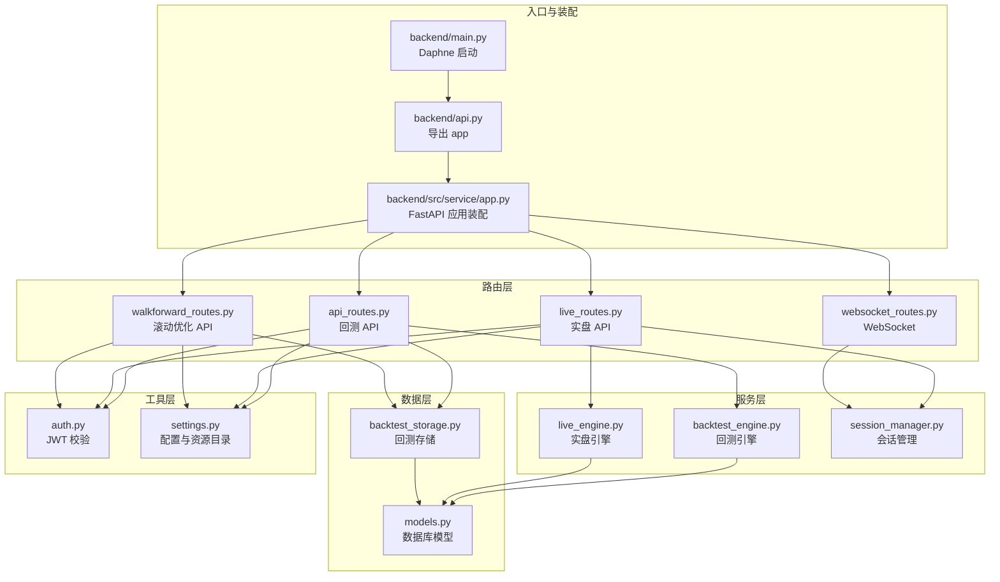
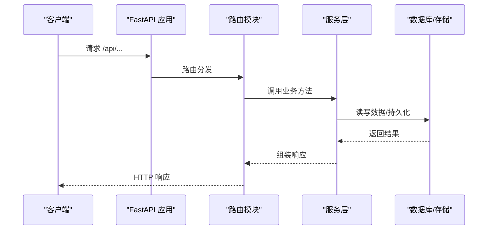
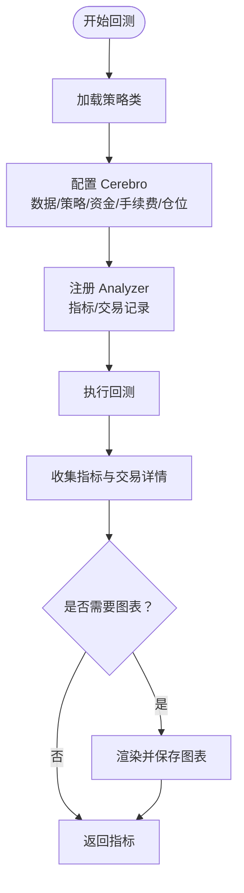
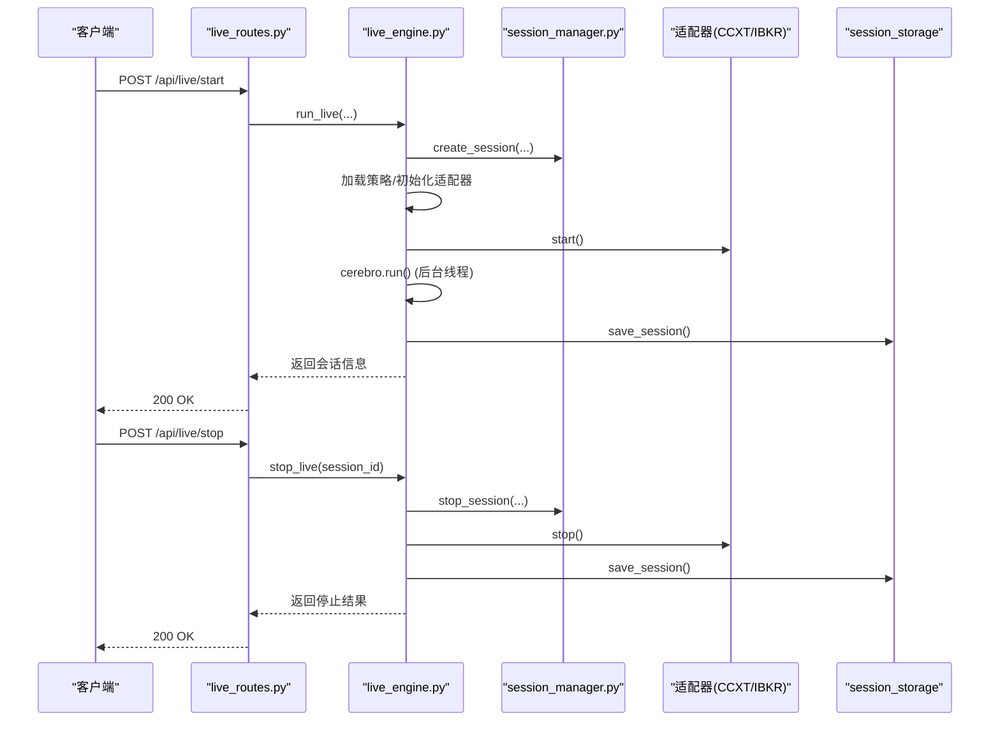
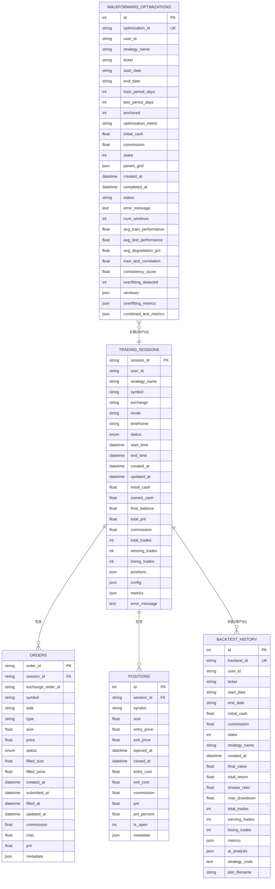
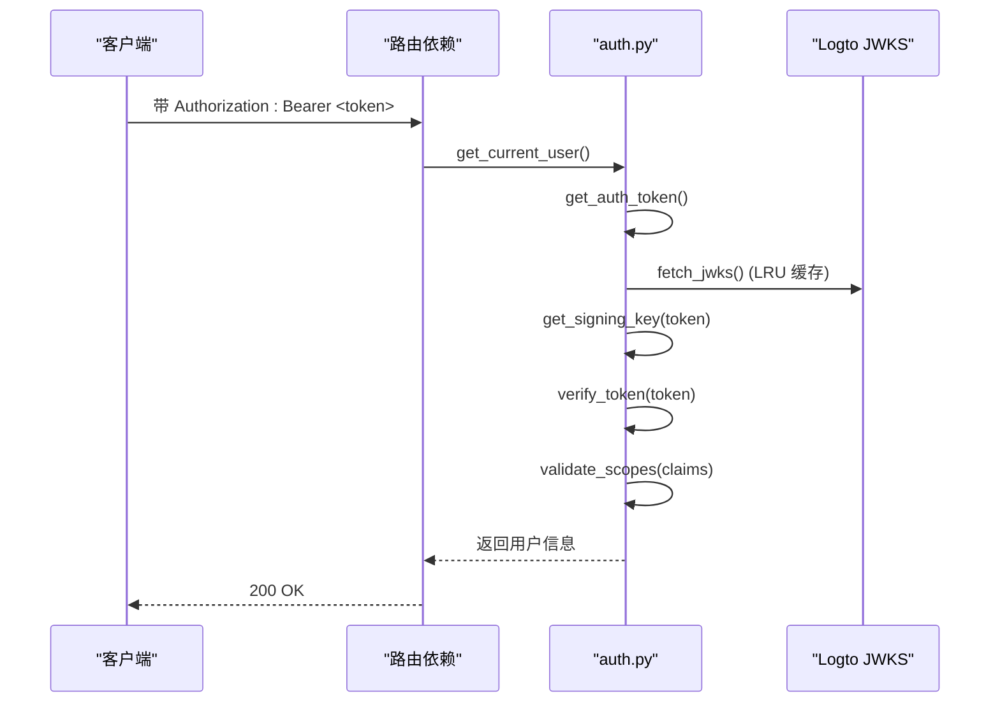
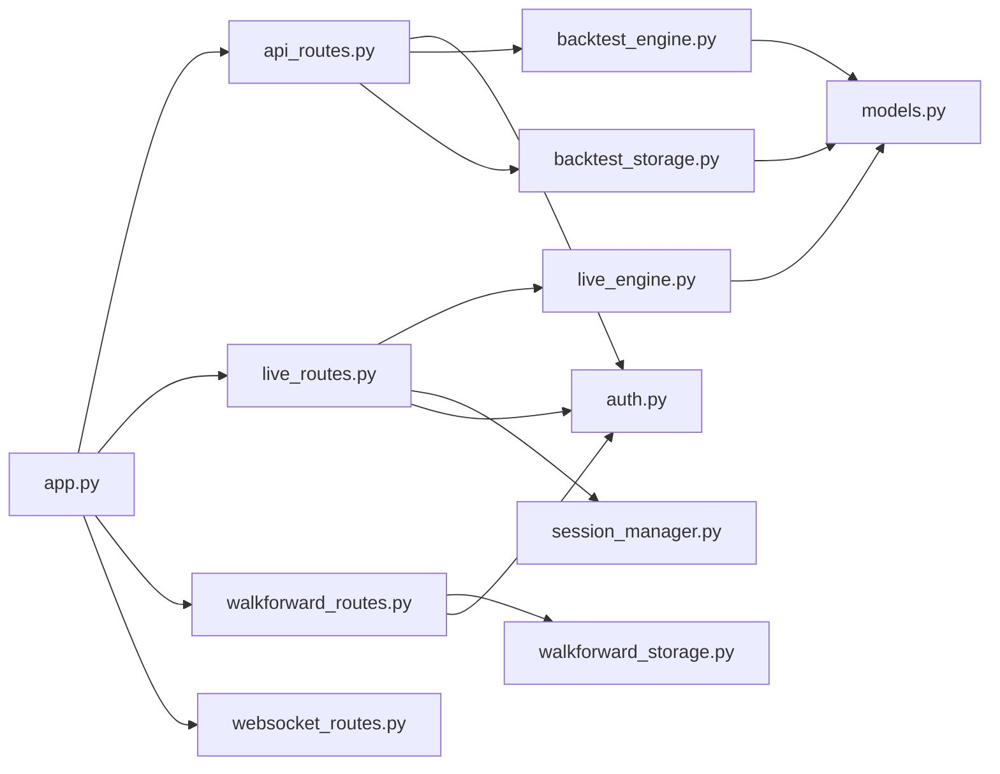

# 后端架构

<cite>
**本文引用的文件**
- [backend/main.py](file://backend/main.py)
- [backend/api.py](file://backend/api.py)
- [backend/src/service/app.py](file://backend/src/service/app.py)
- [backend/src/routes/api_routes.py](file://backend/src/routes/api_routes.py)
- [backend/src/routes/live_routes.py](file://backend/src/routes/live_routes.py)
- [backend/src/routes/walkforward_routes.py](file://backend/src/routes/walkforward_routes.py)
- [backend/src/routes/websocket_routes.py](file://backend/src/routes/websocket_routes.py)
- [backend/src/service/backtest_engine.py](file://backend/src/service/backtest_engine.py)
- [backend/src/service/live_engine.py](file://backend/src/service/live_engine.py)
- [backend/src/service/session_manager.py](file://backend/src/service/session_manager.py)
- [backend/src/db/models.py](file://backend/src/db/models.py)
- [backend/src/db/backtest_storage.py](file://backend/src/db/backtest_storage.py)
- [backend/src/utils/auth.py](file://backend/src/utils/auth.py)
- [backend/src/config/settings.py](file://backend/src/config/settings.py)
</cite>

## 目录
1. [简介](#简介)
2. [项目结构](#项目结构)
3. [核心组件](#核心组件)
4. [架构总览](#架构总览)
5. [详细组件分析](#详细组件分析)
6. [依赖关系分析](#依赖关系分析)
7. [性能与可扩展性](#性能与可扩展性)
8. [故障排查指南](#故障排查指南)
9. [结论](#结论)
10. [附录](#附录)

## 简介
本文件面向后端开发者，系统梳理基于 FastAPI 的后端架构，覆盖以下方面：
- API 路由组织：api_routes.py、live_routes.py、walkforward_routes.py 等模块的职责与分层
- 业务逻辑层：backtest_engine.py、live_engine.py 等服务的运行流程与调用关系
- 数据模型与持久化：models.py 中的数据库表设计与 backtest_storage.py 的读写策略
- 认证与授权：基于 JWT 的 Token 校验流程及 utils/auth.py 的实现
- WebSocket 实时推送：用于直播交易的实时更新通道
- 部署入口：Daphne 服务器启动与 FastAPI 应用装配

## 项目结构
后端采用“应用装配 + 路由模块 + 服务层 + 数据层 + 工具层”的分层组织方式：
- 入口与装配
  - backend/main.py：通过 Daphne 启动 ASGI 应用
  - backend/api.py：导出 FastAPI 应用实例
  - backend/src/service/app.py：FastAPI 应用初始化、CORS、路由挂载
- 路由层
  - backend/src/routes/api_routes.py：回测相关 API（数据获取、回测执行、历史查询、AI 分析）
  - backend/src/routes/live_routes.py：实盘/纸交易会话管理 API
  - backend/src/routes/walkforward_routes.py：滚动优化 API（后台任务）
  - backend/src/routes/websocket_routes.py：WebSocket 实时推送
- 服务层
  - backend/src/service/backtest_engine.py：回测引擎（策略加载、指标计算、图表生成）
  - backend/src/service/live_engine.py：实盘引擎（适配 CCXT/IBKR、会话生命周期）
  - backend/src/service/session_manager.py：会话生命周期与并发控制
- 数据层
  - backend/src/db/models.py：数据库模型（会话、订单、持仓、回测历史、优化结果）
  - backend/src/db/backtest_storage.py：回测历史的增删改查与自动清理
- 工具层
  - backend/src/utils/auth.py：JWT 校验与作用域校验
  - backend/src/config/settings.py：环境变量与资源目录初始化

图示来源
- [backend/src/service/app.py](file://backend/src/service/app.py#L1-L31)
- [backend/src/routes/api_routes.py](file://backend/src/routes/api_routes.py#L1-L341)
- [backend/src/routes/live_routes.py](file://backend/src/routes/live_routes.py#L1-L423)
- [backend/src/routes/walkforward_routes.py](file://backend/src/routes/walkforward_routes.py#L1-L400)
- [backend/src/routes/websocket_routes.py](file://backend/src/routes/websocket_routes.py#L1-L239)
- [backend/src/service/backtest_engine.py](file://backend/src/service/backtest_engine.py#L1-L272)
- [backend/src/service/live_engine.py](file://backend/src/service/live_engine.py#L1-L329)
- [backend/src/service/session_manager.py](file://backend/src/service/session_manager.py#L1-L410)
- [backend/src/db/models.py](file://backend/src/db/models.py#L1-L395)
- [backend/src/db/backtest_storage.py](file://backend/src/db/backtest_storage.py#L1-L444)
- [backend/src/utils/auth.py](file://backend/src/utils/auth.py#L1-L191)
- [backend/src/config/settings.py](file://backend/src/config/settings.py#L1-L81)

章节来源
- [backend/src/service/app.py](file://backend/src/service/app.py#L1-L31)
- [backend/src/routes/api_routes.py](file://backend/src/routes/api_routes.py#L1-L341)
- [backend/src/routes/live_routes.py](file://backend/src/routes/live_routes.py#L1-L423)
- [backend/src/routes/walkforward_routes.py](file://backend/src/routes/walkforward_routes.py#L1-L400)
- [backend/src/routes/websocket_routes.py](file://backend/src/routes/websocket_routes.py#L1-L239)

## 核心组件
- FastAPI 应用装配
  - 初始化 CORS，挂载各路由前缀，前端静态资源托管
  - 统一资源目录初始化，确保 images、strategy、config、frontend 存在
- 路由模块
  - 回测 API：策略列表、数据拉取、回测执行、历史查询、删除、AI 分析更新
  - 实盘 API：启动/停止会话、会话状态、会话列表、交易所列表、订单查询、健康检查
  - 滚动优化 API：创建优化任务（后台）、列出、查询、删除、查询状态
  - WebSocket：按会话推送实时数据
- 服务层
  - 回测引擎：策略加载与沙箱执行、指标计算、图表绘制
  - 实盘引擎：适配 CCXT/IBKR、会话生命周期、后台线程运行、状态持久化
  - 会话管理：单例管理、并发安全、状态机、优雅停机
- 数据层
  - 数据模型：会话、订单、持仓、回测历史、滚动优化结果
  - 回测存储：保存/查询/删除/清理、自动限制记录数量、JSON 容错
- 认证与授权
  - 基于 Logto 的 JWKS 动态拉取与签名验证，支持可选登录与作用域校验

章节来源
- [backend/src/service/app.py](file://backend/src/service/app.py#L1-L31)
- [backend/src/utils/auth.py](file://backend/src/utils/auth.py#L1-L191)
- [backend/src/db/models.py](file://backend/src/db/models.py#L1-L395)
- [backend/src/db/backtest_storage.py](file://backend/src/db/backtest_storage.py#L1-L444)
- [backend/src/service/backtest_engine.py](file://backend/src/service/backtest_engine.py#L1-L272)
- [backend/src/service/live_engine.py](file://backend/src/service/live_engine.py#L1-L329)
- [backend/src/service/session_manager.py](file://backend/src/service/session_manager.py#L1-L410)

## 架构总览
后端采用“路由 -> 服务 -> 数据层”的清晰分层，配合 JWT 认证与 WebSocket 实时推送，形成完整的量化交易后端能力。

图示来源
- [backend/src/service/app.py](file://backend/src/service/app.py#L1-L31)
- [backend/src/routes/api_routes.py](file://backend/src/routes/api_routes.py#L1-L341)
- [backend/src/routes/live_routes.py](file://backend/src/routes/live_routes.py#L1-L423)
- [backend/src/routes/walkforward_routes.py](file://backend/src/routes/walkforward_routes.py#L1-L400)
- [backend/src/db/backtest_storage.py](file://backend/src/db/backtest_storage.py#L1-L444)

## 详细组件分析

### 路由系统与 API 端点
- 回测 API（/api 路由前缀）
  - GET /api/strategies：列出可用策略
  - POST /api/data：按条件拉取行情数据
  - POST /api/backtest：执行回测，生成指标与图表，异步持久化历史
  - GET /api/strategy：获取策略源码
  - POST /api/strategy：保存策略源码
  - POST /api/analyze：对指标进行简单自然语言分析
  - POST /api/backtest/history：查询回测历史（过滤/排序/分页）
  - GET /api/backtest/history/{id}：按 ID 查询回测详情
  - DELETE /api/backtest/history/{id}：删除回测记录与图片
  - POST /api/backtest/history/{id}/ai-analysis：更新 AI 分析内容
- 实盘 API（/api 路由前缀）
  - POST /api/live/start：启动会话（校验模式、配置、交易所、符号、时间框架）
  - POST /api/live/stop：停止会话（优雅停机、保存最终状态）
  - GET /api/live/status/{session_id}：查询会话状态
  - GET /api/live/sessions：列出会话（支持按状态过滤、仅活跃）
  - GET /api/live/exchanges：列出可用交易所
  - GET /api/live/orders/{session_id}：查询会话内订单
  - GET /api/live/health：健康检查
- 滚动优化 API（/api 路由前缀）
  - POST /api/walkforward/start：创建优化任务（后台运行），返回优化 ID
  - GET /api/walkforward/list：列出优化任务（过滤/排序/分页）
  - GET /api/walkforward/{id}：查询优化详情
  - DELETE /api/walkforward/{id}：删除优化任务
  - GET /api/walkforward/{id}/status：查询优化状态
- WebSocket（无前缀）
  - WS /ws/live/{session_id}：实时推送会话状态、订单、P&L、日志等

章节来源
- [backend/src/routes/api_routes.py](file://backend/src/routes/api_routes.py#L1-L341)
- [backend/src/routes/live_routes.py](file://backend/src/routes/live_routes.py#L1-L423)
- [backend/src/routes/walkforward_routes.py](file://backend/src/routes/walkforward_routes.py#L1-L400)
- [backend/src/routes/websocket_routes.py](file://backend/src/routes/websocket_routes.py#L1-L239)

### 业务逻辑层

#### 回测引擎（backtest_engine.py）
- 策略加载与沙箱执行
  - 策略文件名校验与路径拼接，防止路径穿越
  - 将用户策略源码在受限环境中执行，提取 UserStrategy 类
- 回测执行
  - 使用 Backtrader 创建 Cerebro，添加策略与数据源
  - 设置初始资金、手续费、仓位大小
  - 注册多种 Analyzer（夏普比率、最大回撤、收益、年化、SQN、交易分析、时间序列回撤、自定义 TradeRecorder）
  - 运行回测并收集指标；必要时渲染 K 线图并保存至 images 目录
- 自定义分析器 TradeRecorder
  - 记录每笔交易的开仓/平仓时间、价格、手续费、净收益、胜率统计等

图示来源
- [backend/src/service/backtest_engine.py](file://backend/src/service/backtest_engine.py#L1-L272)

章节来源
- [backend/src/service/backtest_engine.py](file://backend/src/service/backtest_engine.py#L1-L272)

#### 实盘引擎（live_engine.py）
- 会话生命周期
  - 生成 session_id，创建会话对象，注册到 SessionManager
  - 加载策略类，根据交易所配置选择 CCXT 或 IBKR 适配器
  - 初始化 Broker、DataFeed，构建 Cerebro
  - 在后台线程中运行 Cerebro，更新状态并持久化
  - 支持优雅停机：关闭 store、等待线程结束、更新最终状态
- 安全返回分析器
  - SafeReturns 处理零周期导致的除零错误，提供中性指标避免崩溃

图示来源
- [backend/src/routes/live_routes.py](file://backend/src/routes/live_routes.py#L1-L423)
- [backend/src/service/live_engine.py](file://backend/src/service/live_engine.py#L1-L329)
- [backend/src/service/session_manager.py](file://backend/src/service/session_manager.py#L1-L410)

章节来源
- [backend/src/service/live_engine.py](file://backend/src/service/live_engine.py#L1-L329)
- [backend/src/service/session_manager.py](file://backend/src/service/session_manager.py#L1-L410)

#### 会话管理（session_manager.py）
- 单例 SessionManager 提供线程安全的会话生命周期管理
- 支持创建、注册、查询、更新、停止、列出、计数等操作
- 状态机：STARTING → RUNNING → STOPPING → STOPPED 或 ERROR
- 停止策略：设置状态、停止 store、等待线程、更新结束时间

章节来源
- [backend/src/service/session_manager.py](file://backend/src/service/session_manager.py#L1-L410)

### 数据模型与持久化

#### 数据模型（models.py）
- 会话模型 TradingSessionModel：会话基本信息、状态、时间戳、资金与指标、位置与订单 JSON、错误信息
- 订单模型 OrderModel：订单详情、状态、填充信息、时间戳、费用与成本、元数据 JSON
- 持仓模型 PositionModel：开仓/平仓、成本与收益、百分比收益、状态与元数据 JSON
- 回测历史模型 BacktestHistoryModel：回测配置、关键指标、完整指标 JSON、AI 分析 JSON、策略代码快照、图表文件名
- 滚动优化模型 WalkForwardOptimizationModel：优化配置、窗口参数、状态与错误、汇总指标、窗口明细与过拟合指标、组合测试指标

图示来源
- [backend/src/db/models.py](file://backend/src/db/models.py#L1-L395)

章节来源
- [backend/src/db/models.py](file://backend/src/db/models.py#L1-L395)

#### 回测存储（backtest_storage.py）
- 保存回测：抽取关键指标，写入 BacktestHistoryModel，并自动清理超出上限的历史记录
- 列表查询：支持按 ticker、策略名、日期范围、用户 ID 过滤，排序字段与方向，分页
- 删除回测：同时删除关联的图表文件
- 更新 AI 分析：以 JSON 字典形式保存多模型分析结果
- 自动清理：超过上限的记录按创建时间删除，同时删除对应图片文件

章节来源
- [backend/src/db/backtest_storage.py](file://backend/src/db/backtest_storage.py#L1-L444)

### 认证与授权（JWT）

#### JWT 校验流程（utils/auth.py）
- 令牌提取与格式校验：Bearer 方案、非空校验
- JWKS 下载与缓存：从 Logto 拉取公钥集合，LRU 缓存，失败返回 500
- 签名密钥匹配：解析头部 kid，匹配对应密钥；支持一次刷新重试
- 令牌解码与校验：算法、受众、发行者校验，过期与声明错误处理
- 作用域校验：若配置了所需作用域，校验令牌中 scope 是否包含缺失项
- 依赖注入：
  - get_current_user：强制认证，未启用登录时返回匿名用户标识
  - get_optional_user：可选认证，未携带或无效令牌时返回 None
  - require_user：兼容旧接口

图示来源
- [backend/src/utils/auth.py](file://backend/src/utils/auth.py#L1-L191)

章节来源
- [backend/src/utils/auth.py](file://backend/src/utils/auth.py#L1-L191)
- [backend/src/config/settings.py](file://backend/src/config/settings.py#L1-L81)

### WebSocket 实时推送
- WebSocket 端点：/ws/live/{session_id}
- 连接校验：当前版本允许可选 token，未来将增强鉴权
- 会话存在性校验：不存在则关闭连接
- 消息类型：connected、position、order、pnl、trade、log、error、status
- 客户端消息：ping/pong 保持心跳

章节来源
- [backend/src/routes/websocket_routes.py](file://backend/src/routes/websocket_routes.py#L1-L239)
- [backend/src/service/session_manager.py](file://backend/src/service/session_manager.py#L1-L410)

## 依赖关系分析

图示来源
- [backend/src/service/app.py](file://backend/src/service/app.py#L1-L31)
- [backend/src/routes/api_routes.py](file://backend/src/routes/api_routes.py#L1-L341)
- [backend/src/routes/live_routes.py](file://backend/src/routes/live_routes.py#L1-L423)
- [backend/src/routes/walkforward_routes.py](file://backend/src/routes/walkforward_routes.py#L1-L400)
- [backend/src/routes/websocket_routes.py](file://backend/src/routes/websocket_routes.py#L1-L239)
- [backend/src/service/backtest_engine.py](file://backend/src/service/backtest_engine.py#L1-L272)
- [backend/src/service/live_engine.py](file://backend/src/service/live_engine.py#L1-L329)
- [backend/src/service/session_manager.py](file://backend/src/service/session_manager.py#L1-L410)
- [backend/src/db/models.py](file://backend/src/db/models.py#L1-L395)
- [backend/src/db/backtest_storage.py](file://backend/src/db/backtest_storage.py#L1-L444)
- [backend/src/utils/auth.py](file://backend/src/utils/auth.py#L1-L191)

章节来源
- [backend/src/service/app.py](file://backend/src/service/app.py#L1-L31)
- [backend/src/routes/api_routes.py](file://backend/src/routes/api_routes.py#L1-L341)
- [backend/src/routes/live_routes.py](file://backend/src/routes/live_routes.py#L1-L423)
- [backend/src/routes/walkforward_routes.py](file://backend/src/routes/walkforward_routes.py#L1-L400)
- [backend/src/routes/websocket_routes.py](file://backend/src/routes/websocket_routes.py#L1-L239)
- [backend/src/service/backtest_engine.py](file://backend/src/service/backtest_engine.py#L1-L272)
- [backend/src/service/live_engine.py](file://backend/src/service/live_engine.py#L1-L329)
- [backend/src/service/session_manager.py](file://backend/src/service/session_manager.py#L1-L410)
- [backend/src/db/models.py](file://backend/src/db/models.py#L1-L395)
- [backend/src/db/backtest_storage.py](file://backend/src/db/backtest_storage.py#L1-L444)
- [backend/src/utils/auth.py](file://backend/src/utils/auth.py#L1-L191)

## 性能与可扩展性
- 回测与实盘
  - 图表渲染使用非交互模式，避免弹窗与阻塞
  - 实盘使用后台线程运行 Cerebro，主线程只负责状态更新与持久化
- 数据访问
  - 回测历史列表查询支持索引字段过滤与排序，建议在高频查询字段上建立数据库索引
  - 自动清理策略限制记录数量，避免无限增长
- 并发与会话
  - SessionManager 使用锁保证线程安全，停止会话支持超时控制
- 可扩展点
  - WebSocket 可扩展订阅事件类型
  - 滚动优化支持多模型并行与结果聚合
  - 认证层可接入更多身份提供商与作用域策略

[本节为通用指导，不直接分析具体文件]

## 故障排查指南
- 认证相关
  - 401/403：检查 Authorization 头是否为 Bearer 令牌，令牌是否过期或缺少所需作用域
  - JWKS 拉取失败：检查网络代理配置与 Logto JWKS 地址
- 回测相关
  - 策略加载失败：确认策略文件名合法且包含 UserStrategy 类
  - 图表渲染失败：检查 matplotlib 后端与磁盘空间
- 实盘相关
  - 会话无法启动：检查交易所配置、符号格式、时间框架、模式开关
  - 停止失败：查看线程是否卡住，检查 store 关闭与异常日志
- 数据相关
  - 历史查询异常：关注 JSON 解析错误，系统会尝试清理损坏记录后重试

章节来源
- [backend/src/utils/auth.py](file://backend/src/utils/auth.py#L1-L191)
- [backend/src/service/backtest_engine.py](file://backend/src/service/backtest_engine.py#L1-L272)
- [backend/src/service/live_engine.py](file://backend/src/service/live_engine.py#L1-L329)
- [backend/src/db/backtest_storage.py](file://backend/src/db/backtest_storage.py#L1-L444)

## 结论
该后端架构以 FastAPI 为核心，围绕回测、实盘、历史管理与实时推送构建了完整的量化交易能力。通过清晰的分层与严格的依赖注入，系统具备良好的可维护性与可扩展性。JWT 认证与可选登录机制满足不同部署场景的安全需求。建议在生产环境中进一步完善 WebSocket 鉴权、监控告警与数据库索引优化。

[本节为总结性内容，不直接分析具体文件]

## 附录

### 部署入口与启动
- Daphne 作为 ASGI 服务器启动 FastAPI 应用，监听 HOST/PORT 环境变量
- FastAPI 应用初始化时：
  - 启用 CORS
  - 挂载路由：/api 前缀下的回测、实盘、滚动优化路由，WebSocket 无前缀
  - 前端静态资源托管
  - 初始化资源目录（images、strategy、config、frontend）

章节来源
- [backend/main.py](file://backend/main.py#L1-L21)
- [backend/api.py](file://backend/api.py#L1-L4)
- [backend/src/service/app.py](file://backend/src/service/app.py#L1-L31)