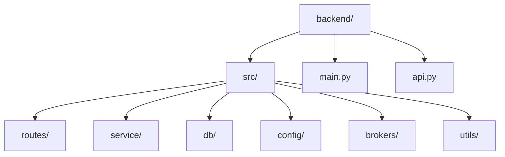
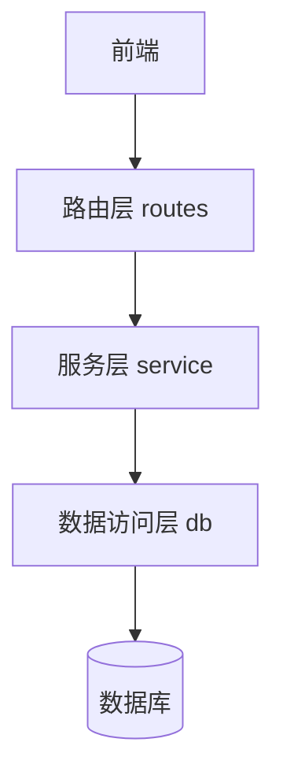
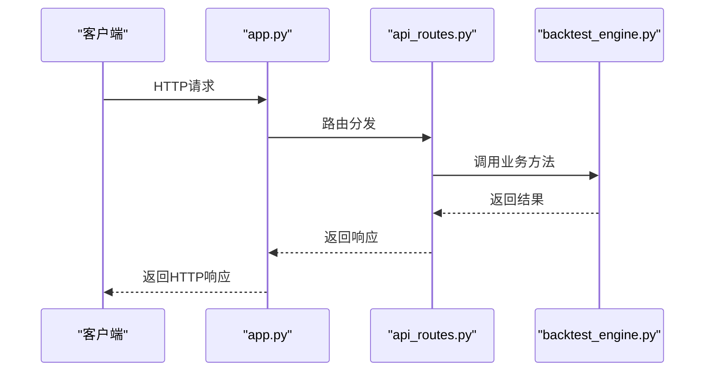
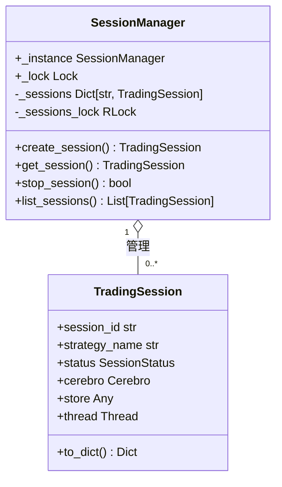
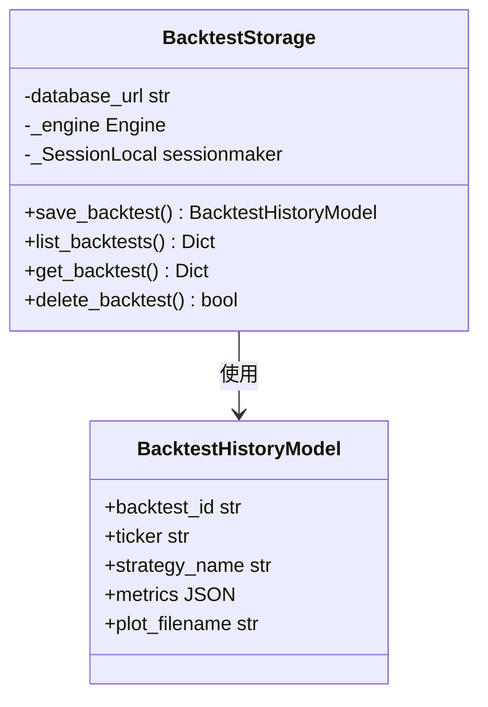
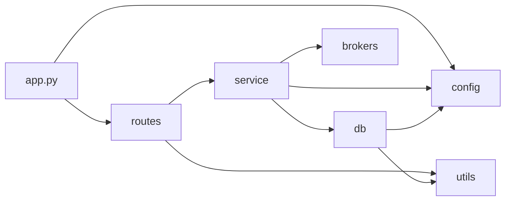

# 后端架构

<cite>
**本文档引用的文件**   
- [main.py](file://backend/main.py)
- [api.py](file://backend/api.py)
- [app.py](file://backend/src/service/app.py)
- [routes.md](file://backend/src/routes/routes.md)
- [service.md](file://backend/src/service/service.md)
- [db.md](file://backend/src/db/db.md)
- [models.py](file://backend/src/db/models.py)
- [session_manager.py](file://backend/src/service/session_manager.py)
- [backtest_engine.py](file://backend/src/service/backtest_engine.py)
- [live_engine.py](file://backend/src/service/live_engine.py)
- [backtest_storage.py](file://backend/src/db/backtest_storage.py)
- [strategy_sandbox.py](file://backend/src/service/strategy_sandbox.py)
- [settings.py](file://backend/src/config/settings.py)
- [api_routes.py](file://backend/src/routes/api_routes.py)
- [live_routes.py](file://backend/src/routes/live_routes.py)
</cite>

## 目录
1. [简介](#简介)
2. [项目结构](#项目结构)
3. [核心组件](#核心组件)
4. [分层架构设计](#分层架构设计)
5. [路由层 (routes)](#路由层-routes)
6. [服务层 (service)](#服务层-service)
7. [数据访问层 (db)](#数据访问层-db)
8. [应用入口与初始化](#应用入口与初始化)
9. [关键架构决策](#关键架构决策)
10. [依赖关系分析](#依赖关系分析)

## 简介
本架构文档旨在阐述后端系统的分层设计（MVC变体）和核心组件。系统采用清晰的分层架构，将路由、业务逻辑和数据访问分离，以提高可维护性和可扩展性。文档将详细描述routes层如何通过FastAPI定义API端点，深入分析service层的业务逻辑，包括回测引擎、实盘引擎和会话管理器等核心服务的职责与协作，以及db层的数据访问模式。通过分析关键设计决策，为后端开发者提供系统级的洞察。

## 项目结构
项目采用模块化结构，主要分为`backend`和`frontend`两大目录。`backend`目录包含后端源代码，其核心是`src`目录，该目录下按功能划分为`routes`、`service`、`db`、`config`、`brokers`和`utils`等子模块。这种结构清晰地体现了系统的分层设计，便于团队协作和代码维护。

**图源**
- [main.py](file://backend/main.py)
- [api.py](file://backend/api.py)

## 核心组件
系统的核心组件包括`app.py`中的FastAPI应用、`routes`目录下的API路由、`service`目录下的业务服务（如`backtest_engine`、`live_engine`、`session_manager`）以及`db`目录下的数据模型和存储模块。这些组件协同工作，实现了从API请求处理到业务逻辑执行再到数据持久化的完整流程。

**章节来源**
- [app.py](file://backend/src/service/app.py)
- [backtest_engine.py](file://backend/src/service/backtest_engine.py)
- [live_engine.py](file://backend/src/service/live_engine.py)
- [session_manager.py](file://backend/src/service/session_manager.py)

## 分层架构设计
系统采用了一种变体的MVC（Model-View-Controller）分层架构，具体分为三层：路由层（Controller）、服务层（Service）和数据访问层（DB）。这种设计确保了关注点分离，路由层仅负责请求的接收和响应的返回，服务层处理核心业务逻辑，而数据访问层则专注于与数据库的交互。

**图源**
- [routes.md](file://backend/src/routes/routes.md)
- [service.md](file://backend/src/service/service.md)
- [db.md](file://backend/src/db/db.md)

## 路由层 (routes)
路由层是系统的控制器，位于`backend/src/routes`目录下，使用FastAPI框架定义所有HTTP和WebSocket API端点。该层遵循“只做编排，不直接操作DB或外部broker”的原则，确保了非功能性要求中的可维护性。

### 路由注册规范
根据`routes.md`中的规范，所有新的路由文件都应命名为`{feature}_routes.py`，并对外暴露一个`router`实例。所有路由的注册统一在`backend/src/service/app.py`中完成，这保证了路由配置的集中管理。

**图源**
- [routes.md](file://backend/src/routes/routes.md)
- [app.py](file://backend/src/service/app.py)
- [api_routes.py](file://backend/src/routes/api_routes.py)

### 核心API端点
- `api_routes.py`：提供核心API，如`/api/backtest`用于执行回测，`/api/strategy`用于管理策略代码。
- `live_routes.py`：提供实盘交易接口，如`/api/live/start`用于启动实盘会话。
- `websocket_routes.py`：提供WebSocket接口，用于实时推送交易状态和系统事件。

**章节来源**
- [routes.md](file://backend/src/routes/routes.md)
- [api_routes.py](file://backend/src/routes/api_routes.py)
- [live_routes.py](file://backend/src/routes/live_routes.py)

## 服务层 (service)
服务层是系统的核心业务编排与运行时资源管理模块，位于`backend/src/service`目录下。它承载了所有核心业务逻辑，通过清晰的接口调用DB层和适配层，避免了与路由细节的直接耦合。

### 回测引擎 (backtest_engine)
`backtest_engine.py`是回测功能的核心。它负责加载用户策略、解析参数、执行回测并生成结果。该模块通过`load_user_strategy`函数安全地加载用户策略代码，并利用`run_backtest`函数协调Backtrader框架完成回测流程。

### 实盘引擎 (live_engine)
`live_engine.py`是实盘/模拟盘交易的核心。它通过`run_live`函数启动一个交易会话，该函数会创建`Cerebro`实例，连接到指定的交易所（通过`ccxt_adapter`或`ibkr_adapter`），并开始实时交易。`stop_live`函数则用于安全地停止一个运行中的会话。

### 会话管理器 (session_manager)
`session_manager.py`实现了单例模式，用于管理所有并发的交易会话。`SessionManager`类通过一个全局的`_instance`属性确保了整个应用中只有一个实例存在。它提供了创建、启动、停止和查询会话的完整生命周期管理功能，并通过线程锁保证了多线程环境下的数据安全。

**图源**
- [session_manager.py](file://backend/src/service/session_manager.py)
- [live_engine.py](file://backend/src/service/live_engine.py)

### 策略沙箱 (StrategySandbox)
`strategy_sandbox.py`模块实现了策略代码的安全执行环境。它通过限制可导入的模块和重写内置函数，防止用户策略代码执行危险操作。该模块定义了`ALLOWED_IMPORTS`白名单，并通过`_safe_import`函数拦截所有导入请求，确保只有允许的模块才能被加载。

**章节来源**
- [service.md](file://backend/src/service/service.md)
- [backtest_engine.py](file://backend/src/service/backtest_engine.py)
- [live_engine.py](file://backend/src/service/live_engine.py)
- [session_manager.py](file://backend/src/service/session_manager.py)
- [strategy_sandbox.py](file://backend/src/service/strategy_sandbox.py)

## 数据访问层 (db)
数据访问层负责系统的数据持久化，位于`backend/src/db`目录下。它基于SQLAlchemy/SQLite技术栈，管理交易会话、订单、持仓等核心数据。

### ORM模型 (models.py)
`models.py`文件定义了所有数据库表的ORM模型。例如，`TradingSessionModel`映射到`trading_sessions`表，`OrderModel`映射到`orders`表。这些模型使用`declarative_base()`进行声明，并通过`Column`定义字段，实现了数据库表与Python类的映射。

### 存储模块 (storage)
`backtest_storage.py`是回测历史存储的核心模块。它封装了对`BacktestHistoryModel`的CRUD操作，提供了`save_backtest`、`list_backtests`、`get_backtest`和`delete_backtest`等方法。该模块还实现了自动清理机制，当历史记录超过`MAX_RECORDS`（100条）时，会自动删除最旧的记录。

**图源**
- [db.md](file://backend/src/db/db.md)
- [models.py](file://backend/src/db/models.py)
- [backtest_storage.py](file://backend/src/db/backtest_storage.py)

## 应用入口与初始化
`app.py`是FastAPI应用的初始化入口，位于`backend/src/service/app.py`。`main.py`是整个应用的启动脚本，它导入`app`并使用`daphne`服务器启动。

### FastAPI应用初始化
在`app.py`中，首先通过`FastAPI()`创建应用实例。然后，从`src.config.settings`读取CORS配置，并通过`app.add_middleware()`添加CORS中间件，以处理跨域请求。

### 路由注册
所有路由通过`app.include_router()`方法注册。例如，`app.include_router(api_router, prefix="/api")`将`api_routes.py`中的所有路由挂载到`/api`前缀下。这遵循了`routes.md`中定义的规范。

### 静态文件挂载
`mount_frontend(app)`函数将前端静态资源（位于`resources/frontend`）挂载到根路径`/`，使得前端应用可以通过Web服务器直接访问。

**章节来源**
- [main.py](file://backend/main.py)
- [app.py](file://backend/src/service/app.py)
- [settings.py](file://backend/src/config/settings.py)

## 关键架构决策
### 单例模式的使用
`SessionManager`使用单例模式，确保了在整个应用生命周期内，所有组件都通过同一个实例来管理会话。这保证了会话状态的一致性，避免了因多个实例导致的状态冲突。

### 沙箱模式的安全考量
系统通过`strategy_sandbox.py`和更安全的`isolated_sandbox`（未在文档中详述）来执行用户上传的策略代码。`SANDBOX_MODE`环境变量控制使用哪种模式，`subprocess`模式提供了更强的隔离性，防止恶意代码对系统造成破坏。

### 层间依赖关系
各层之间遵循严格的依赖关系：路由层依赖服务层，服务层依赖数据访问层，而数据访问层不依赖上层。这种单向依赖确保了系统的低耦合和高内聚。

**章节来源**
- [service.md](file://backend/src/service/service.md)
- [db.md](file://backend/src/db/db.md)
- [strategy_sandbox.py](file://backend/src/service/strategy_sandbox.py)

## 依赖关系分析
系统各组件之间的依赖关系清晰。`app.py`依赖于所有`routes`和`config`。`routes`依赖于`service`和`utils`。`service`依赖于`db`、`config`和`brokers`。`db`依赖于`config`和`utils`。这种结构化的依赖关系使得系统易于测试和维护。

**图源**
- [app.py](file://backend/src/service/app.py)
- [routes.md](file://backend/src/routes/routes.md)
- [service.md](file://backend/src/service/service.md)
- [db.md](file://backend/src/db/db.md)