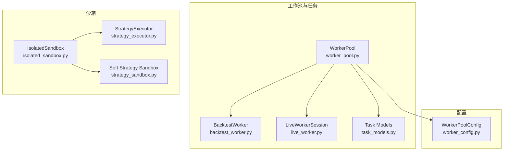
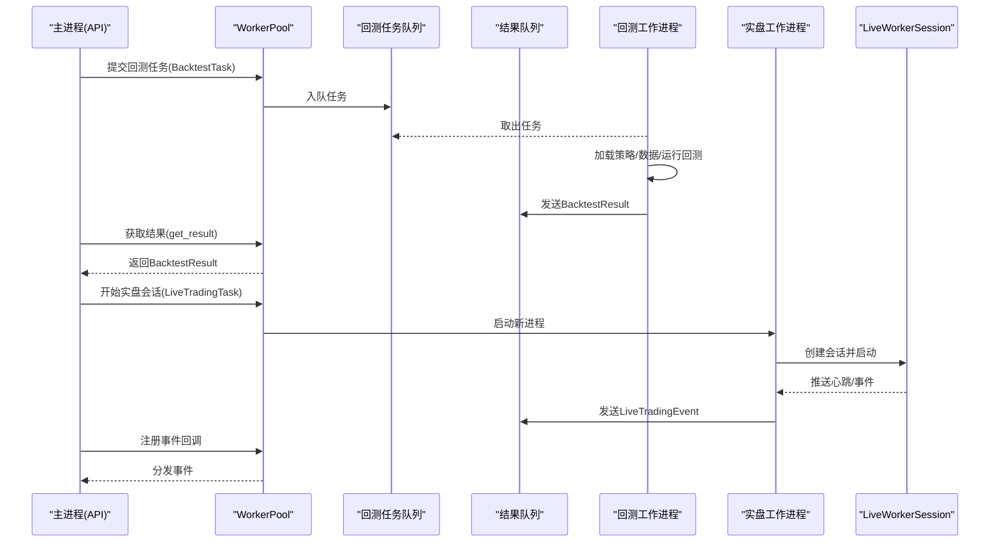
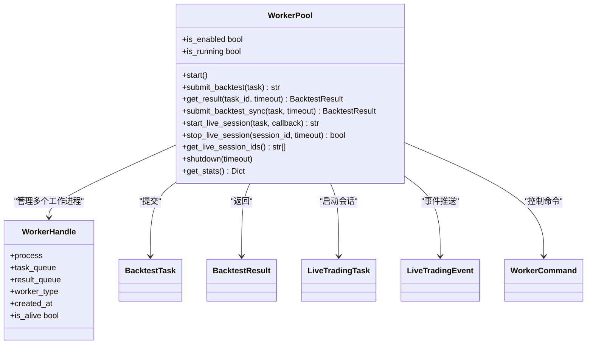
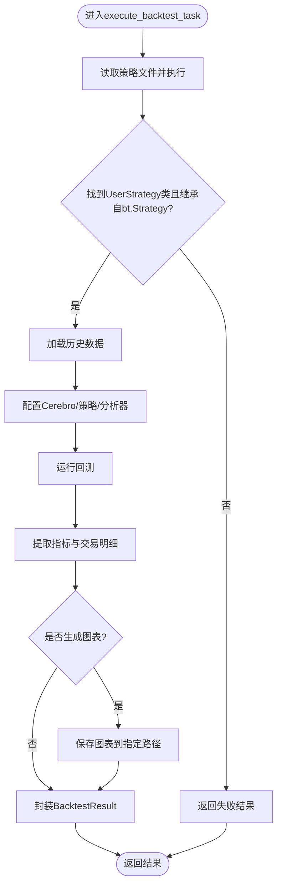
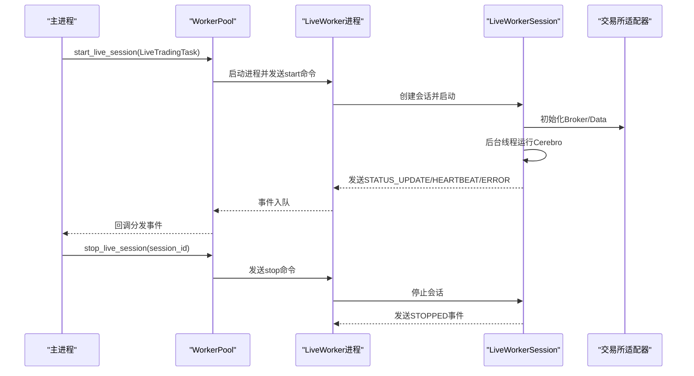
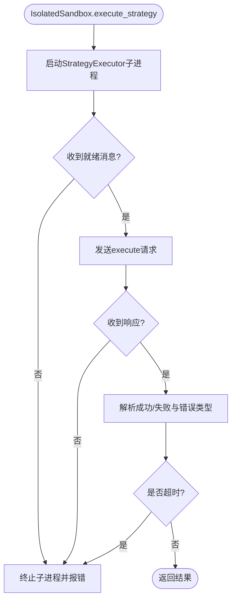
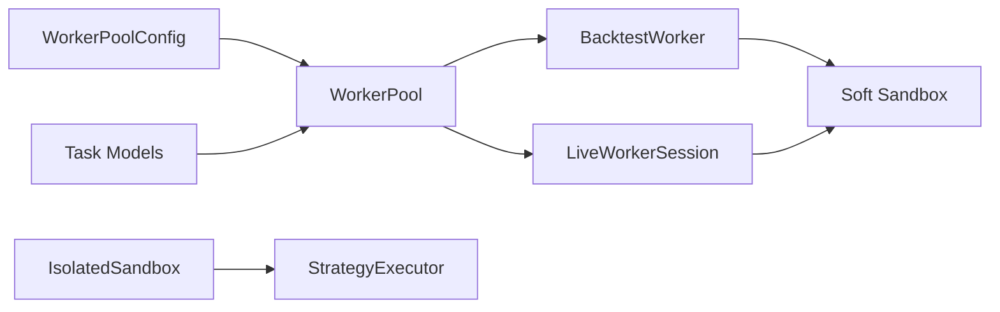

# 工作池隔离

<cite>
**本文引用的文件**
- [backend/src/service/worker/worker_pool.py](file://backend/src/service/worker/worker_pool.py)
- [backend/src/service/worker/backtest_worker.py](file://backend/src/service/worker/backtest_worker.py)
- [backend/src/service/worker/live_worker.py](file://backend/src/service/worker/live_worker.py)
- [backend/src/service/worker/task_models.py](file://backend/src/service/worker/task_models.py)
- [backend/src/config/worker_config.py](file://backend/src/config/worker_config.py)
- [backend/src/service/isolated_sandbox.py](file://backend/src/service/isolated_sandbox.py)
- [backend/src/service/strategy_executor.py](file://backend/src/service/strategy_executor.py)
- [backend/src/service/strategy_sandbox.py](file://backend/src/service/strategy_sandbox.py)
- [backend/tests/service/test_worker_pool.py](file://backend/tests/service/test_worker_pool.py)
- [backend/tests/service/test_isolated_sandbox.py](file://backend/tests/service/test_isolated_sandbox.py)
</cite>

## 目录
1. [简介](#简介)
2. [项目结构](#项目结构)
3. [核心组件](#核心组件)
4. [架构总览](#架构总览)
5. [详细组件分析](#详细组件分析)
6. [依赖关系分析](#依赖关系分析)
7. [性能与资源特性](#性能与资源特性)
8. [故障排查指南](#故障排查指南)
9. [结论](#结论)

## 简介
本文件聚焦“工作池隔离”主题，系统性阐述后端如何通过进程级隔离、资源限制与双向通信机制，安全地执行用户策略代码（回测与实盘/纸交易）。核心目标包括：
- 将用户策略代码完全置于独立工作进程中执行，避免对主服务进程造成影响。
- 提供统一的任务提交、结果收集与生命周期管理接口。
- 支持回测任务的同步/异步提交与超时控制，以及实盘会话的长连接事件推送。
- 在不同隔离模式下（子进程沙箱、软沙箱）提供可选的安全边界。

## 项目结构
围绕工作池隔离的关键目录与文件如下：
- 后端服务层：工作池与任务模型定义、工作进程入口、实时会话管理
- 配置层：工作池与沙箱配置加载
- 沙箱层：子进程策略执行器与软沙箱策略执行

图表来源
- [backend/src/service/worker/worker_pool.py](file://backend/src/service/worker/worker_pool.py#L256-L779)
- [backend/src/service/worker/backtest_worker.py](file://backend/src/service/worker/backtest_worker.py#L1-L231)
- [backend/src/service/worker/live_worker.py](file://backend/src/service/worker/live_worker.py#L1-L246)
- [backend/src/service/worker/task_models.py](file://backend/src/service/worker/task_models.py#L1-L290)
- [backend/src/config/worker_config.py](file://backend/src/config/worker_config.py#L1-L98)
- [backend/src/service/isolated_sandbox.py](file://backend/src/service/isolated_sandbox.py#L1-L393)
- [backend/src/service/strategy_executor.py](file://backend/src/service/strategy_executor.py#L1-L560)
- [backend/src/service/strategy_sandbox.py](file://backend/src/service/strategy_sandbox.py#L1-L213)

章节来源
- [backend/src/service/worker/worker_pool.py](file://backend/src/service/worker/worker_pool.py#L256-L779)
- [backend/src/service/worker/task_models.py](file://backend/src/service/worker/task_models.py#L1-L290)
- [backend/src/config/worker_config.py](file://backend/src/config/worker_config.py#L1-L98)
- [backend/src/service/isolated_sandbox.py](file://backend/src/service/isolated_sandbox.py#L1-L393)
- [backend/src/service/strategy_executor.py](file://backend/src/service/strategy_executor.py#L1-L560)
- [backend/src/service/strategy_sandbox.py](file://backend/src/service/strategy_sandbox.py#L1-L213)

## 核心组件
- 工作池管理器（WorkerPool）
  - 负责启动/停止工作进程、任务队列分发、结果收集、超时与错误处理、统计信息输出。
  - 支持禁用工作池时的降级执行（不推荐用于未信任代码）。
- 回测工作进程（BacktestWorker）
  - 在隔离进程中加载策略、构建数据源、运行回测引擎、提取指标与图表路径。
- 实盘工作会话（LiveWorkerSession）
  - 在隔离进程中加载策略、连接交易所适配器、持续推送心跳与事件。
- 任务模型（Task Models）
  - 定义回测任务、结果、实盘任务、事件类型与命令消息的数据结构。
- 配置（WorkerPoolConfig）
  - 从环境变量读取工作池大小、超时、内存上限、网络/文件写入权限等参数。
- 子进程沙箱（IsolatedSandbox + StrategyExecutor）
  - 通过子进程执行策略，应用资源限制与导入/属性访问白名单，支持超时终止。
- 软沙箱（strategy_sandbox.py）
  - 仅在当前进程内限制导入与内置函数，无法抵御恶意代码；已标注为弃用模式。

章节来源
- [backend/src/service/worker/worker_pool.py](file://backend/src/service/worker/worker_pool.py#L256-L779)
- [backend/src/service/worker/backtest_worker.py](file://backend/src/service/worker/backtest_worker.py#L1-L231)
- [backend/src/service/worker/live_worker.py](file://backend/src/service/worker/live_worker.py#L1-L246)
- [backend/src/service/worker/task_models.py](file://backend/src/service/worker/task_models.py#L1-L290)
- [backend/src/config/worker_config.py](file://backend/src/config/worker_config.py#L1-L98)
- [backend/src/service/isolated_sandbox.py](file://backend/src/service/isolated_sandbox.py#L1-L393)
- [backend/src/service/strategy_executor.py](file://backend/src/service/strategy_executor.py#L1-L560)
- [backend/src/service/strategy_sandbox.py](file://backend/src/service/strategy_sandbox.py#L1-L213)

## 架构总览
工作池隔离采用“主进程+多工作进程”的模式，所有用户策略代码仅在工作进程中执行，主进程负责任务编排与结果聚合。

图表来源
- [backend/src/service/worker/worker_pool.py](file://backend/src/service/worker/worker_pool.py#L377-L743)
- [backend/src/service/worker/backtest_worker.py](file://backend/src/service/worker/backtest_worker.py#L23-L210)
- [backend/src/service/worker/live_worker.py](file://backend/src/service/worker/live_worker.py#L27-L245)
- [backend/src/service/worker/task_models.py](file://backend/src/service/worker/task_models.py#L1-L290)

## 详细组件分析

### 组件A：WorkerPool（工作池管理器）
- 角色与职责
  - 管理回测工作进程池，使用“spawn”上下文确保进程隔离。
  - 维护共享队列（任务/结果），后台线程收集结果，提供同步/异步提交与超时等待。
  - 支持实盘会话的动态创建与事件收集线程，按会话ID管理独立工作进程。
  - 提供统计接口与优雅关闭流程。
- 关键流程
  - 启动：创建任务队列与结果队列，批量启动回测工作进程，启动结果收集线程。
  - 提交：注册待处理结果事件，向任务队列入队，返回任务ID。
  - 获取：等待事件或轮询结果队列，返回BacktestResult。
  - 实盘：为每个会话创建专用队列与进程，发送start命令，启动事件收集线程。
  - 关闭：先停止所有实盘会话，再向回测队列发送停止信号，等待进程退出或强制杀死。
- 错误与超时
  - 任务队列满、未知任务ID、超时均抛出自定义异常。
  - 降级执行（禁用工作池）仅用于调试或受信场景，明确警告风险。

图表来源
- [backend/src/service/worker/worker_pool.py](file://backend/src/service/worker/worker_pool.py#L256-L779)
- [backend/src/service/worker/task_models.py](file://backend/src/service/worker/task_models.py#L1-L290)

章节来源
- [backend/src/service/worker/worker_pool.py](file://backend/src/service/worker/worker_pool.py#L256-L779)
- [backend/src/service/worker/task_models.py](file://backend/src/service/worker/task_models.py#L1-L290)

### 组件B：回测工作进程（BacktestWorker）
- 角色与职责
  - 在隔离进程中加载策略文件、构建回测引擎、运行分析器、生成指标与图表。
- 关键流程
  - 策略加载：从策略目录读取源码，调用软沙箱执行策略代码，查找UserStrategy类。
  - 数据加载：根据任务参数获取历史数据。
  - 引擎运行：添加策略、数据、分析器，执行回测并提取指标。
  - 结果封装：构造BacktestResult，包含净值、夏普比率、最大回撤、年化收益、交易明细、资金曲线、图表路径等。
- 安全与隔离
  - 用户策略代码仅在此进程中加载与执行，主进程不导入策略模块。
  - 使用matplotlib无交互模式，避免弹窗与阻塞。

图表来源
- [backend/src/service/worker/backtest_worker.py](file://backend/src/service/worker/backtest_worker.py#L23-L210)

章节来源
- [backend/src/service/worker/backtest_worker.py](file://backend/src/service/worker/backtest_worker.py#L1-L231)

### 组件C：实盘工作会话（LiveWorkerSession）
- 角色与职责
  - 在隔离进程中管理单个实盘会话，加载策略、连接交易所适配器、持续推送心跳与事件。
- 关键流程
  - 初始化：解析任务参数，准备策略与数据源。
  - 启动：创建后台线程运行回测引擎，发送状态更新事件。
  - 运行：循环推送心跳事件，包含当前盈亏与持仓。
  - 停止：优雅停止引擎与适配器，发送stopped事件。
- 事件模型
  - 使用LiveTradingEvent枚举类型区分状态更新、交易执行、订单变更、心跳、错误与停止。

图表来源
- [backend/src/service/worker/live_worker.py](file://backend/src/service/worker/live_worker.py#L27-L245)
- [backend/src/service/worker/worker_pool.py](file://backend/src/service/worker/worker_pool.py#L521-L671)

章节来源
- [backend/src/service/worker/live_worker.py](file://backend/src/service/worker/live_worker.py#L1-L246)
- [backend/src/service/worker/worker_pool.py](file://backend/src/service/worker/worker_pool.py#L521-L671)

### 组件D：子进程沙箱（IsolatedSandbox + StrategyExecutor）
- 角色与职责
  - 通过子进程执行策略，应用资源限制（内存、CPU、文件描述符、网络），限制导入与属性访问，支持超时终止。
- 关键流程
  - 启动执行器：设置环境变量（内存、网络、文件写入），启动executor脚本，等待就绪消息。
  - 请求处理：发送execute/validate请求，读取响应；超时则终止子进程。
  - 执行策略：在executor中构建受限builtins与白名单导入，编译并执行策略代码，提取可序列化全局值与策略类名。
  - 清理：发送shutdown并等待退出，否则强制杀死进程。
- 安全要点
  - 屏蔽危险属性访问（如__subclasses__、__bases__等），阻止相对导入与敏感模块导入。
  - 平台特定资源限制（Linux使用RLIMIT，Windows监控）。

图表来源
- [backend/src/service/isolated_sandbox.py](file://backend/src/service/isolated_sandbox.py#L105-L283)
- [backend/src/service/strategy_executor.py](file://backend/src/service/strategy_executor.py#L423-L559)

章节来源
- [backend/src/service/isolated_sandbox.py](file://backend/src/service/isolated_sandbox.py#L1-L393)
- [backend/src/service/strategy_executor.py](file://backend/src/service/strategy_executor.py#L1-L560)

### 组件E：软沙箱（strategy_sandbox.py）
- 角色与职责
  - 在当前进程内限制导入与内置函数，不提供进程级隔离；仅适用于可信代码或演示。
- 安全说明
  - 明确标注不可抵御恶意代码，存在反射、对象图遍历等绕过风险；建议使用子进程沙箱。

章节来源
- [backend/src/service/strategy_sandbox.py](file://backend/src/service/strategy_sandbox.py#L1-L213)

## 依赖关系分析
- WorkerPool依赖
  - 任务模型：BacktestTask/BacktestResult/LiveTradingTask/LiveTradingEvent/WorkerCommand
  - 配置：WorkerPoolConfig（环境变量驱动）
  - 工作进程：回测工作进程、实盘会话
- 工作进程依赖
  - 回测：策略软沙箱、市场数据加载、回测引擎与分析器
  - 实盘：交易所适配器、回测引擎、交易记录器
- 沙箱依赖
  - StrategyExecutor：受限builtins、白名单导入、资源限制、IPC协议
  - Soft Sandbox：受限builtins与导入列表（仅当前进程）

图表来源
- [backend/src/config/worker_config.py](file://backend/src/config/worker_config.py#L1-L98)
- [backend/src/service/worker/worker_pool.py](file://backend/src/service/worker/worker_pool.py#L256-L779)
- [backend/src/service/worker/task_models.py](file://backend/src/service/worker/task_models.py#L1-L290)
- [backend/src/service/strategy_sandbox.py](file://backend/src/service/strategy_sandbox.py#L1-L213)
- [backend/src/service/isolated_sandbox.py](file://backend/src/service/isolated_sandbox.py#L1-L393)
- [backend/src/service/strategy_executor.py](file://backend/src/service/strategy_executor.py#L1-L560)

章节来源
- [backend/src/config/worker_config.py](file://backend/src/config/worker_config.py#L1-L98)
- [backend/src/service/worker/worker_pool.py](file://backend/src/service/worker/worker_pool.py#L256-L779)
- [backend/src/service/worker/task_models.py](file://backend/src/service/worker/task_models.py#L1-L290)
- [backend/src/service/strategy_sandbox.py](file://backend/src/service/strategy_sandbox.py#L1-L213)
- [backend/src/service/isolated_sandbox.py](file://backend/src/service/isolated_sandbox.py#L1-L393)
- [backend/src/service/strategy_executor.py](file://backend/src/service/strategy_executor.py#L1-L560)

## 性能与资源特性
- 进程隔离
  - 使用“spawn”上下文启动工作进程，确保Python模块与策略代码仅在子进程中加载。
- 资源限制
  - 内存限制：Linux使用AS限制，Windows通过监控与终止策略实现。
  - CPU限制：Linux使用RLIMIT_CPU，Windows通过监控实现。
  - 文件描述符限制：降低资源泄露风险。
  - 网络与文件写入：由配置开关控制，实盘需要网络，回测可能需要写入图表。
- 超时与队列
  - 任务超时时间、队列长度限制、心跳间隔等均可通过配置调整。
- 并发与吞吐
  - 多工作进程并行处理回测任务，提高整体吞吐量；事件收集线程避免阻塞主流程。

章节来源
- [backend/src/service/worker/worker_pool.py](file://backend/src/service/worker/worker_pool.py#L307-L349)
- [backend/src/service/worker/worker_pool.py](file://backend/src/service/worker/worker_pool.py#L222-L232)
- [backend/src/service/strategy_executor.py](file://backend/src/service/strategy_executor.py#L32-L119)
- [backend/src/config/worker_config.py](file://backend/src/config/worker_config.py#L1-L98)

## 故障排查指南
- 常见问题与定位
  - 任务超时：检查任务超时配置、策略复杂度与数据规模；必要时增加超时或优化策略。
  - 内存不足：检查工作进程内存限制与策略占用；减少中间对象或启用缓存清理。
  - 导入失败：确认策略文件存在、UserStrategy类正确继承bt.Strategy；查看软沙箱错误信息。
  - 实盘会话无法启动：检查Broker配置、适配器支持情况与网络连通性。
- 单元测试参考
  - 工作池配置与任务模型：验证默认值、序列化/反序列化与枚举值。
  - 子进程沙箱：验证导入阻断、超时终止、反射攻击拦截与进程崩溃不影响主进程。

章节来源
- [backend/tests/service/test_worker_pool.py](file://backend/tests/service/test_worker_pool.py#L1-L236)
- [backend/tests/service/test_isolated_sandbox.py](file://backend/tests/service/test_isolated_sandbox.py#L92-L361)

## 结论
工作池隔离通过“主进程+多工作进程+子进程沙箱”的组合，实现了对用户策略代码的强隔离与可控执行。WorkerPool提供统一的任务编排与生命周期管理，BacktestWorker与LiveWorkerSession分别覆盖回测与实盘场景，StrategyExecutor进一步强化了子进程内的安全边界。配合可配置的资源限制与超时策略，系统在安全性与可用性之间取得平衡，适合在生产环境中执行未信任策略代码。