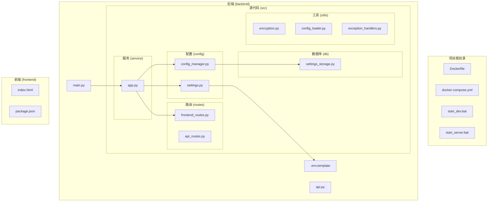
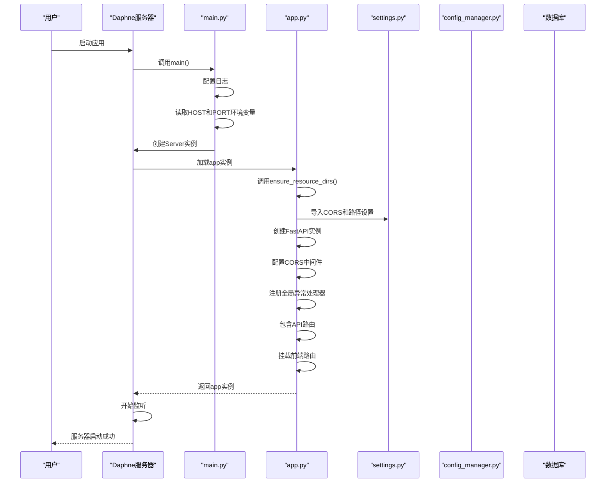
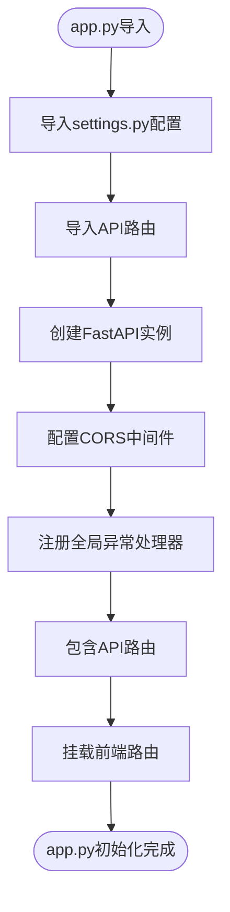
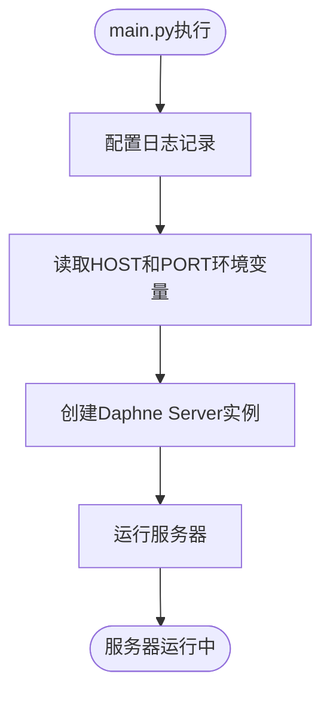
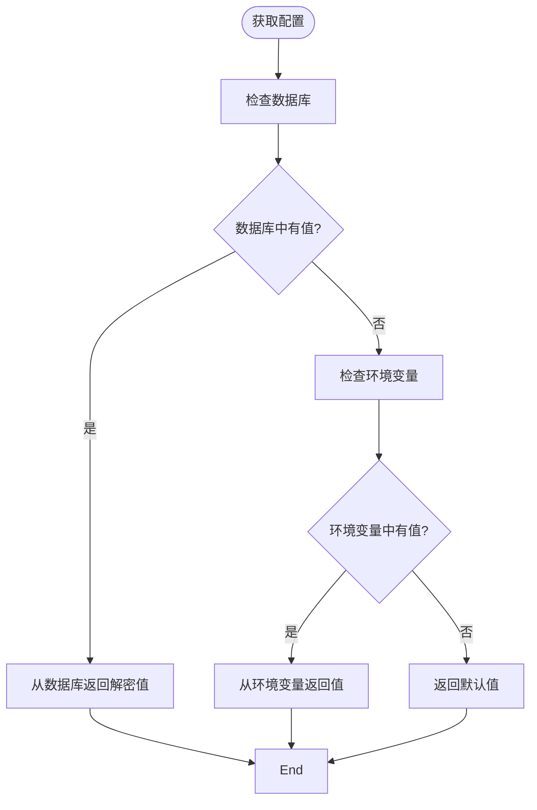
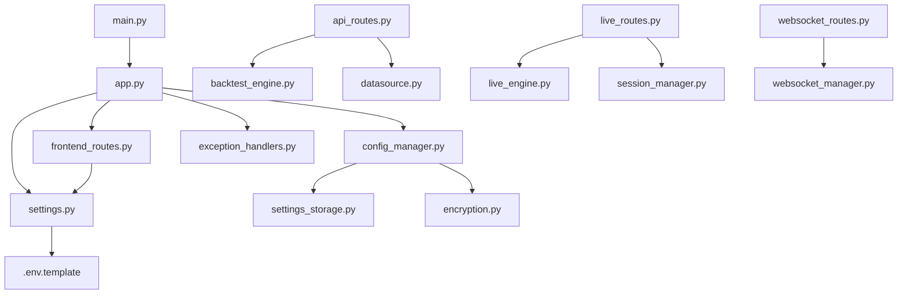

# 应用配置与启动

<cite>
**本文档引用的文件**   
- [app.py](file://backend/src/service/app.py)
- [main.py](file://backend/main.py)
- [api.py](file://backend/api.py)
- [config_manager.py](file://backend/src/config/config_manager.py)
- [settings.py](file://backend/src/config/settings.py)
- [.env.template](file://backend/.env.template)
- [frontend_routes.py](file://backend/src/routes/frontend_routes.py)
- [encryption.py](file://backend/src/utils/encryption.py)
- [config_loader.py](file://backend/src/utils/config_loader.py)
- [exception_handlers.py](file://backend/src/utils/exception_handlers.py)
</cite>

## 更新摘要
**变更内容**   
- 在 `app.py` 中注册了新的全局异常处理器，该处理器根据 `settings.py` 中的 `DEBUG` 环境变量决定是否返回详细的错误堆栈，确保生产环境的安全性。
- 更新了“应用初始化分析”和“架构概述”部分，以反映新的异常处理机制。
- 新增了“全局异常处理机制”章节，详细说明异常处理器的配置和行为。

## 目录
1. [简介](#简介)
2. [项目结构](#项目结构)
3. [核心组件](#核心组件)
4. [架构概述](#架构概述)
5. [详细组件分析](#详细组件分析)
6. [依赖分析](#依赖分析)
7. [性能考虑](#性能考虑)
8. [故障排除指南](#故障排除指南)
9. [结论](#结论)

## 简介
本文档旨在提供关于Backtrader应用配置与启动流程的权威指南。文档以app.py为核心，详细说明FastAPI应用实例的初始化过程，包括中间件注册（如CORS）、依赖注入配置、路由挂载顺序以及前端静态文件的挂载机制。结合main.py解释开发服务器（Daphne）的启动逻辑和环境判断。分析api.py如何导出应用实例以支持ASGI服务器部署。深入config_manager.py和settings.py，说明配置的分层加载机制（环境变量、.env文件、默认值）和类型验证。文档涵盖配置项的完整列表（如数据库URL、OpenAI API密钥、交易所凭证路径），并提供安全配置的最佳实践，如敏感信息的加密存储和开发/生产环境的差异配置。包含完整的启动流程时序图、常见启动错误（如端口占用、依赖缺失）的排查步骤及多环境部署建议。

## 项目结构
Backtrader项目的结构清晰地分为前端和后端两个主要部分。后端使用FastAPI框架构建REST API，而前端使用现代JavaScript框架（可能是React）构建用户界面。项目根目录包含Docker相关文件、构建脚本和主要的配置文件。

后端位于`backend/`目录下，其核心结构包括：
- `src/service/app.py`：FastAPI应用实例的创建和配置
- `src/config/`：应用配置和设置管理
- `src/routes/`：API路由定义
- `src/db/`：数据库操作和模型
- `src/utils/`：实用工具函数

前端位于`frontend/`目录下，遵循现代前端项目结构，包含组件、页面、服务和资源文件。

配置文件如`.env.template`提供了环境变量的模板，而`backend/.env.template`则专门用于后端服务的配置。



**图表来源**
- [app.py](file://backend/src/service/app.py)
- [main.py](file://backend/main.py)
- [config_manager.py](file://backend/src/config/config_manager.py)
- [settings.py](file://backend/src/config/settings.py)
- [frontend_routes.py](file://backend/src/routes/frontend_routes.py)
- [.env.template](file://backend/.env.template)

**章节来源**
- [app.py](file://backend/src/service/app.py)
- [main.py](file://backend/main.py)
- [api.py](file://backend/api.py)
- [config_manager.py](file://backend/src/config/config_manager.py)
- [settings.py](file://backend/src/config/settings.py)
- [.env.template](file://backend/.env.template)

## 核心组件
Backtrader应用的核心组件围绕FastAPI应用实例的创建和配置展开。`app.py`文件是整个后端服务的入口点，负责创建FastAPI应用实例、配置中间件、注册路由和挂载前端静态文件。

`main.py`文件是应用的启动脚本，负责启动Daphne ASGI服务器并监听指定的主机和端口。`api.py`文件则是一个简单的模块，用于导出`app.py`中创建的FastAPI应用实例，以便在ASGI服务器中使用。

配置管理是另一个核心组件，由`config_manager.py`和`settings.py`文件实现。`settings.py`文件负责从环境变量、.env文件和默认值中加载配置，并提供类型验证。`config_manager.py`文件则提供了一个更高级的配置管理接口，支持数据库优先的配置查找策略。

```mermaid
classDiagram
class FastAPI {
+add_middleware()
+include_router()
+mount()
}
class AppPy {
+app : FastAPI
+ensure_resource_dirs()
+mount_frontend()
}
class MainPy {
+main()
+host : str
+port : int
}
class ApiPy {
+__all__ : list
+app : FastAPI
}
class SettingsPy {
+DATABASE_URL : str
+OPENAI_API_KEY : str
+CORS_ALLOW_ORIGINS : list
+ensure_resource_dirs()
}
class ConfigManagerPy {
+get_openai_config()
+get_ccxt_credentials()
+get_database_url()
}
AppPy --> FastAPI : "使用"
MainPy --> AppPy : "导入"
ApiPy --> AppPy : "导入"
AppPy --> SettingsPy : "导入"
AppPy --> ConfigManagerPy : "导入"
SettingsPy --> .env.template : "读取"
```

**章节来源**
- [app.py](file://backend/src/service/app.py)
- [main.py](file://backend/main.py)
- [api.py](file://backend/api.py)
- [config_manager.py](file://backend/src/config/config_manager.py)
- [settings.py](file://backend/src/config/settings.py)

## 架构概述
Backtrader应用采用分层架构设计，将不同的关注点分离到不同的模块中。应用的核心是FastAPI框架，它提供了REST API的路由、请求处理和响应生成功能。

应用的启动流程从`main.py`开始，该文件启动Daphne ASGI服务器并加载`app.py`中定义的FastAPI应用实例。`app.py`文件负责初始化应用，包括配置CORS中间件、注册API路由和挂载前端静态文件。

配置管理采用分层加载机制，优先级从高到低依次为：数据库（用户特定的加密凭证）、环境变量（.env文件）、默认值（硬编码的回退值）。这种设计允许用户通过UI配置凭证，同时保持与.env配置的向后兼容性。



**图表来源**
- [main.py](file://backend/main.py)
- [app.py](file://backend/src/service/app.py)
- [settings.py](file://backend/src/config/settings.py)

## 详细组件分析

### 应用初始化分析
`app.py`文件是FastAPI应用实例的创建和配置中心。它首先从`settings.py`导入必要的配置，如CORS设置和资源目录路径。然后创建FastAPI应用实例，并配置CORS中间件以允许跨域请求。

CORS配置通过环境变量进行，确保了安全性。如果启用了凭据（cookies/Authorization），则不允许使用通配符"*"作为允许的源，这是浏览器的安全要求。

应用实例通过`include_router()`方法注册多个API路由，每个路由都有相应的前缀。前端静态文件通过`mount_frontend()`函数挂载，该函数在`frontend_routes.py`中定义。

**全局异常处理机制**
`app.py`中引入了新的全局异常处理机制，这是本次更新的核心。通过`create_exception_handlers(debug=DEBUG)`函数，根据`settings.py`中的`DEBUG`环境变量动态配置异常处理器。在开发模式下（`DEBUG=true`），会返回详细的错误堆栈以方便调试；而在生产模式下（`DEBUG=false`），则返回通用的“内部服务器错误”消息，以防止敏感信息泄露。



**图表来源**
- [app.py](file://backend/src/service/app.py)
- [settings.py](file://backend/src/config/settings.py)
- [frontend_routes.py](file://backend/src/routes/frontend_routes.py)
- [exception_handlers.py](file://backend/src/utils/exception_handlers.py)

**章节来源**
- [app.py](file://backend/src/service/app.py)
- [settings.py](file://backend/src/config/settings.py)
- [exception_handlers.py](file://backend/src/utils/exception_handlers.py)

### 启动脚本分析
`main.py`文件是应用的启动脚本，负责启动Daphne ASGI服务器。它首先配置日志记录，然后从环境变量中读取主机和端口设置。默认情况下，服务器监听所有网络接口（0.0.0.0）的8000端口。

Daphne服务器通过`Server`类创建，该类接受FastAPI应用实例作为参数。服务器配置包括端点、信号处理器和详细程度。启动日志会记录服务器的监听地址和日志级别。



**图表来源**
- [main.py](file://backend/main.py)

**章节来源**
- [main.py](file://backend/main.py)

### 配置管理分析
配置管理是Backtrader应用的核心功能之一，由`config_manager.py`和`settings.py`文件共同实现。`settings.py`文件负责从环境变量、.env文件和默认值中加载配置，并提供类型验证。

`config_manager.py`文件提供了一个更高级的配置管理接口，支持数据库优先的配置查找策略。配置查找的优先级为：数据库（用户特定的加密凭证）、环境变量（.env文件）、默认值（硬编码的回退值）。

敏感信息如API密钥在数据库中加密存储，使用Fernet对称加密（AES-128 CBC模式，带HMAC认证）。加密密钥必须在ENCRYPTION_KEY环境变量中设置。



**图表来源**
- [config_manager.py](file://backend/src/config/config_manager.py)
- [settings.py](file://backend/src/config/settings.py)
- [encryption.py](file://backend/src/utils/encryption.py)

**章节来源**
- [config_manager.py](file://backend/src/config/config_manager.py)
- [settings.py](file://backend/src/config/settings.py)

## 依赖分析
Backtrader应用的依赖关系清晰地展示了各个组件之间的交互。`main.py`依赖于`app.py`中的FastAPI应用实例，而`app.py`又依赖于`settings.py`和`config_manager.py`进行配置管理。

`settings.py`文件依赖于`dotenv`库来加载环境变量，并从`.env.template`文件中读取默认配置。`config_manager.py`文件依赖于`settings_storage.py`进行数据库操作，并使用`encryption.py`进行敏感信息的加密和解密。

前端路由依赖于`settings.py`中的路径设置来确定静态文件的位置。API路由则依赖于各种服务和数据库模块来处理业务逻辑。



**图表来源**
- [main.py](file://backend/main.py)
- [app.py](file://backend/src/service/app.py)
- [settings.py](file://backend/src/config/settings.py)
- [config_manager.py](file://backend/src/config/config_manager.py)
- [frontend_routes.py](file://backend/src/routes/frontend_routes.py)
- [.env.template](file://backend/.env.template)
- [settings_storage.py](file://backend/src/db/settings_storage.py)
- [encryption.py](file://backend/src/utils/encryption.py)

**章节来源**
- [main.py](file://backend/main.py)
- [app.py](file://backend/src/service/app.py)
- [settings.py](file://backend/src/config/settings.py)
- [config_manager.py](file://backend/src/config/config_manager.py)

## 性能考虑
在应用配置和启动过程中，有几个性能考虑点需要注意。首先，`settings.py`中的`ensure_resource_dirs()`函数确保了必要的资源目录存在，这在应用启动时执行一次，避免了运行时的文件系统检查开销。

其次，`config_loader.py`中的配置缓存机制减少了重复加载和验证配置文件的开销。配置文件在首次加载后会被缓存，后续请求直接使用缓存的配置对象。

最后，`settings_storage.py`中的数据库会话管理使用了连接池，避免了频繁创建和销毁数据库连接的开销。

## 故障排除指南
在应用启动过程中，可能会遇到一些常见问题。以下是一些常见错误及其排查步骤：

1. **端口占用**：如果指定的端口已被其他进程占用，Daphne服务器将无法启动。可以通过更改PORT环境变量或终止占用端口的进程来解决。

2. **依赖缺失**：如果缺少必要的Python包，应用将无法启动。确保已安装requirements.txt中列出的所有依赖。

3. **数据库连接失败**：如果DATABASE_URL环境变量配置不正确，应用将无法连接到数据库。检查数据库URL格式和数据库服务状态。

4. **加密密钥缺失**：如果ENCRYPTION_KEY环境变量未设置，敏感信息的加密和解密将失败。按照文档生成并设置加密密钥。

5. **配置文件缺失**：如果broker_config.json文件不存在，应用将无法加载交易所配置。复制broker_config.template.json并根据需要进行修改。

**章节来源**
- [main.py](file://backend/main.py)
- [settings.py](file://backend/src/config/settings.py)
- [config_manager.py](file://backend/src/config/config_manager.py)
- [encryption.py](file://backend/src/utils/encryption.py)
- [config_loader.py](file://backend/src/utils/config_loader.py)

## 结论
Backtrader应用的配置与启动流程设计得既灵活又安全。通过分层配置管理，应用能够适应不同的部署环境，从开发到生产。FastAPI框架的使用确保了API的高性能和易用性，而Daphne服务器提供了可靠的ASGI支持。

配置管理的分层加载机制（数据库 > 环境变量 > 默认值）为用户提供了多种配置方式，同时保持了向后兼容性。敏感信息的加密存储确保了凭证的安全性，即使数据库被泄露，攻击者也无法轻易获取API密钥等敏感信息。

**全局异常处理机制的引入**是本次更新的重要安全增强。通过根据`DEBUG`环境变量动态调整错误信息的详细程度，系统在开发阶段提供了强大的调试能力，而在生产环境中则有效防止了敏感信息的泄露，符合安全最佳实践。

整体架构清晰，组件职责分明，为应用的维护和扩展提供了良好的基础。通过遵循本文档中的最佳实践，用户可以安全、高效地配置和启动Backtrader应用。