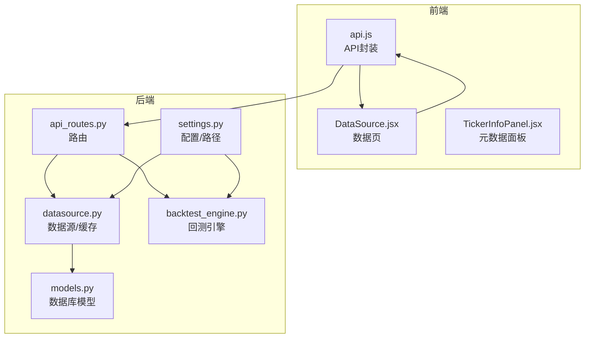
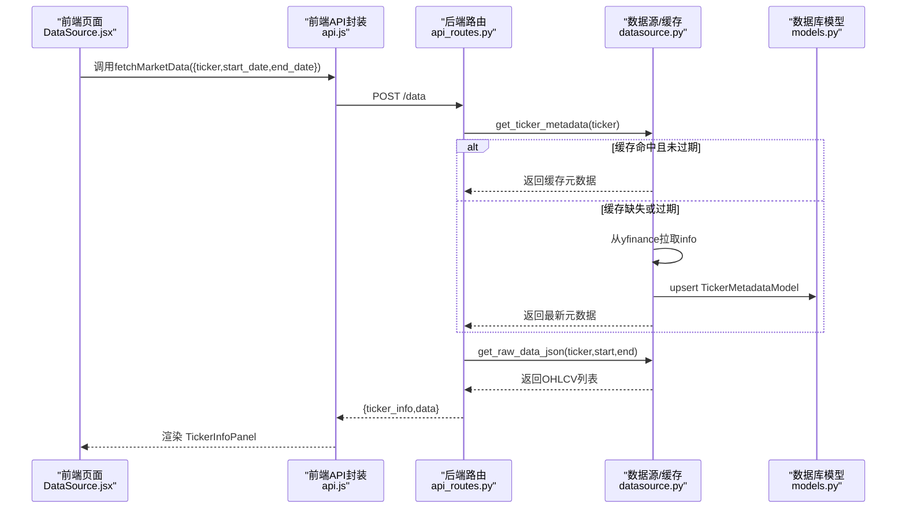
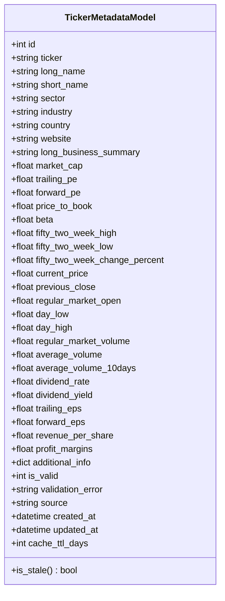
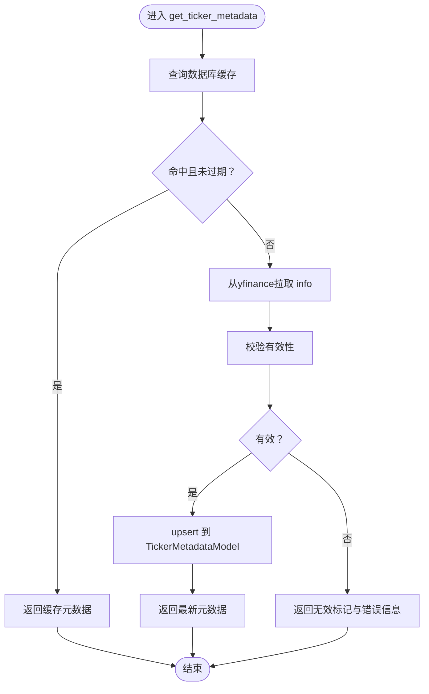
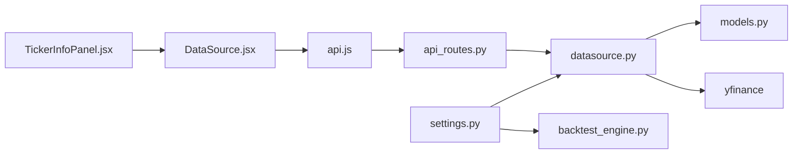

# Ticker元数据模型

<cite>
**本文引用的文件**
- [README.md](file://README.md)
- [models.py](file://backend/src/db/models.py)
- [datasource.py](file://backend/src/db/datasource.py)
- [api_routes.py](file://backend/src/routes/api_routes.py)
- [backtest_engine.py](file://backend/src/service/backtest_engine.py)
- [settings.py](file://backend/src/config/settings.py)
- [TickerInfoPanel.jsx](file://frontend/src/components/DataSource/TickerInfoPanel.jsx)
- [DataSource.jsx](file://frontend/src/pages/DataSource.jsx)
- [api.js](file://frontend/src/services/api.js)
</cite>

## 目录
1. [简介](#简介)
2. [项目结构](#项目结构)
3. [核心组件](#核心组件)
4. [架构总览](#架构总览)
5. [详细组件分析](#详细组件分析)
6. [依赖关系分析](#依赖关系分析)
7. [性能考量](#性能考量)
8. [故障排查指南](#故障排查指南)
9. [结论](#结论)

## 简介
本文件聚焦“Ticker元数据模型”，系统性阐述后端数据库模型、数据获取与缓存策略、以及前端展示组件之间的协作关系。目标是帮助读者理解：
- Ticker元数据的字段构成与用途
- 后端如何从外部数据源拉取并缓存元数据
- 前端如何消费这些元数据并进行可视化
- 在回测与实盘场景中，Ticker元数据如何参与流程

## 项目结构
围绕Ticker元数据的关键文件分布如下：
- 后端数据库模型与数据源：backend/src/db/models.py、backend/src/db/datasource.py
- 后端路由与业务：backend/src/routes/api_routes.py、backend/src/service/backtest_engine.py
- 配置与路径：backend/src/config/settings.py
- 前端展示与调用：frontend/src/components/DataSource/TickerInfoPanel.jsx、frontend/src/pages/DataSource.jsx、frontend/src/services/api.js

**图示来源**
- [api_routes.py](file://backend/src/routes/api_routes.py#L68-L94)
- [datasource.py](file://backend/src/db/datasource.py#L150-L171)
- [models.py](file://backend/src/db/models.py#L437-L518)
- [settings.py](file://backend/src/config/settings.py#L1-L81)
- [backtest_engine.py](file://backend/src/service/backtest_engine.py#L180-L257)
- [api.js](file://frontend/src/services/api.js#L105-L111)
- [DataSource.jsx](file://frontend/src/pages/DataSource.jsx#L18-L35)
- [TickerInfoPanel.jsx](file://frontend/src/components/DataSource/TickerInfoPanel.jsx#L1-L194)

**章节来源**
- [README.md](file://README.md#L307-L405)

## 核心组件
- 数据库模型：TickerMetadataModel（后端）
- 数据源与缓存：datasource.py中的元数据函数族（后端）
- 路由：/data端点（后端）
- 前端组件：TickerInfoPanel.jsx（前端）
- 前端页面：DataSource.jsx（前端）
- API封装：api.js（前端）

**章节来源**
- [models.py](file://backend/src/db/models.py#L437-L518)
- [datasource.py](file://backend/src/db/datasource.py#L436-L499)
- [api_routes.py](file://backend/src/routes/api_routes.py#L68-L94)
- [TickerInfoPanel.jsx](file://frontend/src/components/DataSource/TickerInfoPanel.jsx#L1-L194)
- [DataSource.jsx](file://frontend/src/pages/DataSource.jsx#L18-L35)
- [api.js](file://frontend/src/services/api.js#L105-L111)

## 架构总览
Ticker元数据在系统中的流转路径如下：
- 前端调用/data接口，携带ticker、start_date、end_date
- 后端路由校验并调用datasource.get_ticker_metadata
- 若缓存命中且未过期，则直接返回；否则从yfinance拉取并入库
- 后端同时尝试获取OHLCV数据并返回给前端
- 前端将返回的ticker_info渲染到TickerInfoPanel

**图示来源**
- [api_routes.py](file://backend/src/routes/api_routes.py#L68-L94)
- [datasource.py](file://backend/src/db/datasource.py#L436-L499)
- [models.py](file://backend/src/db/models.py#L437-L518)
- [api.js](file://frontend/src/services/api.js#L105-L111)
- [DataSource.jsx](file://frontend/src/pages/DataSource.jsx#L18-L35)
- [TickerInfoPanel.jsx](file://frontend/src/components/DataSource/TickerInfoPanel.jsx#L1-L194)

## 详细组件分析

### 数据库模型：TickerMetadataModel
- 表名：ticker_metadata
- 主键：自增id
- 唯一索引：ticker（唯一）
- 字段分类：
  - 基本公司信息：long_name、short_name、sector、industry、country、website、long_business_summary
  - 市场指标：market_cap、trailing_pe、forward_pe、price_to_book、beta、52周最高/最低、52周涨跌幅
  - 交易统计：current_price、previous_close、regular_market_open、当日最高/最低、当日成交量、平均成交量、10日均量
  - 基本面数据：dividend_rate、dividend_yield、trailing_eps、forward_eps、revenue_per_share、profit_margins
  - 其他：additional_info（JSON）、is_valid（有效性标记）、validation_error（错误信息）
  - 缓存元数据：source（默认yfinance）、created_at、updated_at、cache_ttl_days（默认7天）
- 关键方法：is_stale()，基于updated_at与cache_ttl_days判断是否过期

**图示来源**
- [models.py](file://backend/src/db/models.py#L437-L518)

**章节来源**
- [models.py](file://backend/src/db/models.py#L437-L518)

### 数据源与缓存：datasource.py
- get_ticker_metadata(ticker, force_refresh=False)
  - 逻辑：先查数据库缓存；若未强制刷新且未过期则返回；否则从yfinance拉取，校验有效性，入库upsert，并返回
  - 校验规则：至少包含longName/shortName/symbol之一，至少包含currentPrice/regularMarketPrice/previousClose之一
  - 解析映射：将yfinance.info标准化为与模型字段一致的字典
  - upsert：存在则更新，不存在则创建
  - 返回：包含computed字段cached与cache_age_days
- get_raw_data_json(ticker, start_date, end_date)
  - 将OHLCV数据转换为前端期望的数组格式（含time/open/high/low/close/volume）

**图示来源**
- [datasource.py](file://backend/src/db/datasource.py#L436-L499)
- [models.py](file://backend/src/db/models.py#L437-L518)

**章节来源**
- [datasource.py](file://backend/src/db/datasource.py#L217-L499)

### 路由与调用：api_routes.py
- /data POST
  - 调用get_ticker_metadata校验并获取元数据
  - 调用get_raw_data_json获取OHLCV
  - 返回：{ticker_info, data}

**章节来源**
- [api_routes.py](file://backend/src/routes/api_routes.py#L68-L94)

### 前端展示：TickerInfoPanel.jsx
- 接收tickerInfo（来自后端响应），渲染公司基本信息、市场指标、交易统计、基本面数据
- 展示缓存年龄（cache_age_days）与“缓存数据”提示

**章节来源**
- [TickerInfoPanel.jsx](file://frontend/src/components/DataSource/TickerInfoPanel.jsx#L1-L194)

### 前端页面与API封装：DataSource.jsx、api.js
- DataSource.jsx触发api.fetchMarketData，接收后分别设置chartData与tickerInfo
- api.js封装/buildRequest，负责注入Authorization头、解析响应、处理401跳转登录

**章节来源**
- [DataSource.jsx](file://frontend/src/pages/DataSource.jsx#L18-L35)
- [api.js](file://frontend/src/services/api.js#L1-L74)
- [api.js](file://frontend/src/services/api.js#L105-L111)

### 与回测引擎的关系
- 回测引擎通过get_bt_feed获取数据，用于Cerebro回测；与Ticker元数据无直接耦合
- 但回测结果中包含trade_details等指标，可用于进一步分析与可视化

**章节来源**
- [backtest_engine.py](file://backend/src/service/backtest_engine.py#L180-L257)

## 依赖关系分析
- 后端依赖
  - 数据库：SQLAlchemy（declarative_base、Column、Enum、JSON等）
  - 外部数据源：yfinance
  - 配置：settings.py提供DATABASE_URL、资源目录等
- 前端依赖
  - 组件：Ant Design Icons、i18n
  - API封装：api.js统一请求与鉴权

**图示来源**
- [datasource.py](file://backend/src/db/datasource.py#L1-L499)
- [models.py](file://backend/src/db/models.py#L1-L560)
- [api_routes.py](file://backend/src/routes/api_routes.py#L1-L360)
- [api.js](file://frontend/src/services/api.js#L1-L277)
- [settings.py](file://backend/src/config/settings.py#L1-L81)
- [backtest_engine.py](file://backend/src/service/backtest_engine.py#L1-L272)

**章节来源**
- [settings.py](file://backend/src/config/settings.py#L1-L81)
- [models.py](file://backend/src/db/models.py#L1-L560)
- [datasource.py](file://backend/src/db/datasource.py#L1-L499)
- [api_routes.py](file://backend/src/routes/api_routes.py#L1-L360)
- [api.js](file://frontend/src/services/api.js#L1-L277)

## 性能考量
- 缓存策略
  - TickerMetadataModel默认缓存7天（cache_ttl_days），减少对yfinance的频繁请求
  - 缓存命中时直接返回，避免网络与解析开销
- 数据库写入
  - upsert操作（存在则更新，不存在则插入），保证幂等性
  - 使用SafeJSON类型处理NULL与空字符串，降低序列化异常风险
- 前端渲染
  - TickerInfoPanel按需渲染字段，避免不必要的DOM节点
  - 对大额数值与百分比进行格式化，提升可读性

[本节为通用指导，不涉及具体文件分析]

## 故障排查指南
- 后端
  - yfinance不可用或返回空：get_ticker_metadata会返回is_valid=False与错误信息
  - 数据库异常：_save_ticker_metadata捕获异常并回滚，确保事务一致性
  - 数据库URL未配置：datasource.py使用默认本地数据库路径
- 前端
  - 401未授权：api.js解析响应时检测401并重定向至登录页
  - 网络错误：api.js统一抛出错误，上层组件应显示友好提示

**章节来源**
- [datasource.py](file://backend/src/db/datasource.py#L436-L499)
- [api.js](file://frontend/src/services/api.js#L55-L74)

## 结论
Ticker元数据模型通过“缓存+校验+upsert”的机制，实现了对yfinance数据的高效复用与稳定呈现。后端路由在/data端点中串联元数据与OHLCV数据，前端组件负责将这些信息以卡片与指标的形式直观展示。该设计既满足了回测与实盘的数据需求，也提升了用户体验与系统性能。